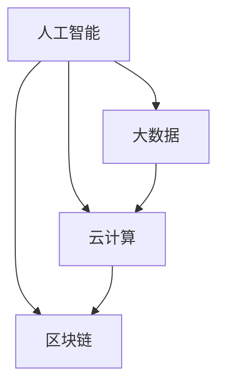

                 

关键词：技能培训、计算时代、人工智能、软件开发、技术发展

> 摘要：随着计算技术的飞速发展，人类进入了一个全新的计算时代。在这个时代，技能和培训的重要性前所未有。本文将探讨在计算时代如何为人类做好准备，包括核心概念的学习、算法原理的理解、数学模型的构建、实际应用的实践，以及未来发展的展望。

## 1. 背景介绍

自20世纪中叶以来，计算机科学经历了惊人的发展。从最初的电子计算机到如今的云计算、大数据、人工智能，计算机技术正在深刻改变我们的生活方式、工作模式和社会结构。计算时代的到来不仅带来了新的技术革命，也带来了对人类技能和知识的新要求。

在这个时代，传统的教育和职业培训已经不足以满足社会的发展需求。人们需要不断学习新的技能，以适应快速变化的技术环境。技能和培训的重要性从未如此突出，它不仅关系到个人的职业发展，更关系到整个社会的进步。

## 2. 核心概念与联系

### 2.1 核心概念介绍

在计算时代，以下几个核心概念尤为重要：

1. **人工智能（AI）**：一种模拟人类智能的技术，包括机器学习、深度学习、自然语言处理等。
2. **大数据（Big Data）**：指无法用常规软件工具在合理时间内捕捉、管理和处理的大量数据。
3. **云计算（Cloud Computing）**：通过互联网提供动态可伸缩且经常是虚拟化的资源。
4. **区块链（Blockchain）**：一种分布式数据库技术，具有去中心化、安全性高的特点。

### 2.2 核心概念联系

这些概念之间有着紧密的联系。人工智能依赖于大数据进行分析，而云计算提供了处理大数据的能力。区块链则为数据的存储和传输提供了新的安全方式。

### 2.3 Mermaid 流程图

以下是核心概念之间联系的一个简单流程图：



## 3. 核心算法原理 & 具体操作步骤

### 3.1 算法原理概述

在计算时代，算法的重要性不言而喻。以下是几个核心算法原理的概述：

1. **深度学习（Deep Learning）**：通过多层神经网络进行特征提取和学习。
2. **机器学习（Machine Learning）**：通过数据训练模型，使计算机具备自动学习和预测能力。
3. **排序算法（Sorting Algorithms）**：如快速排序、归并排序等，用于高效地处理数据。

### 3.2 算法步骤详解

以下是一个简单的机器学习算法步骤详解：

1. **数据收集**：收集并准备用于训练的数据集。
2. **数据预处理**：清洗数据，进行特征工程。
3. **模型选择**：选择合适的机器学习模型。
4. **模型训练**：使用训练数据训练模型。
5. **模型评估**：使用测试数据评估模型性能。
6. **模型优化**：根据评估结果调整模型参数。

### 3.3 算法优缺点

**深度学习**：
- 优点：强大的特征提取能力，能够处理复杂的问题。
- 缺点：计算资源需求大，训练时间较长。

**机器学习**：
- 优点：自动化学习和预测，适应性强。
- 缺点：对数据质量要求高，模型解释性差。

**排序算法**：
- 优点：高效地处理数据排序。
- 缺点：某些算法不适用于大规模数据。

### 3.4 算法应用领域

这些算法广泛应用于人工智能、数据科学、金融科技、医疗保健等多个领域。

## 4. 数学模型和公式 & 详细讲解 & 举例说明

### 4.1 数学模型构建

在计算时代，数学模型是理解和解决复杂问题的有力工具。以下是一个简单的线性回归模型构建：

$$
y = \beta_0 + \beta_1 x
$$

其中，$y$ 是因变量，$x$ 是自变量，$\beta_0$ 和 $\beta_1$ 是模型参数。

### 4.2 公式推导过程

线性回归模型的推导过程包括：

1. **假设**：数据满足线性关系。
2. **最小二乘法**：找到使得预测误差平方和最小的参数值。

### 4.3 案例分析与讲解

以下是一个简单的线性回归案例分析：

**案例**：预测房价

- **数据集**：包括房屋面积和房价。
- **模型**：线性回归模型。
- **结果**：通过训练得到模型参数，可以预测未知房屋的房价。

## 5. 项目实践：代码实例和详细解释说明

### 5.1 开发环境搭建

为了实践算法，我们需要搭建一个开发环境。以下是搭建一个Python开发环境的步骤：

1. **安装Python**：下载并安装Python。
2. **安装Jupyter Notebook**：安装Jupyter Notebook用于编写和运行代码。
3. **安装相关库**：如NumPy、Pandas、Scikit-learn等。

### 5.2 源代码详细实现

以下是一个简单的线性回归模型的Python代码实现：

```python
import numpy as np
import pandas as pd
from sklearn.linear_model import LinearRegression

# 数据读取
data = pd.read_csv('house_data.csv')
X = data[['area']]
y = data['price']

# 模型训练
model = LinearRegression()
model.fit(X, y)

# 模型评估
score = model.score(X, y)
print(f'Model R^2 Score: {score}')

# 预测
predicted_price = model.predict([[1500]])
print(f'Predicted Price: {predicted_price[0]}')
```

### 5.3 代码解读与分析

这段代码首先读取数据，然后使用线性回归模型进行训练，接着评估模型性能，最后进行预测。

### 5.4 运行结果展示

运行结果将显示模型的R^2评分和预测的房价。

## 6. 实际应用场景

### 6.1 人工智能在医疗领域的应用

人工智能在医疗领域的应用正在迅速发展，包括疾病诊断、药物研发、个性化治疗等。例如，使用深度学习算法分析医疗影像，可以提高疾病的诊断准确性。

### 6.2 大数据在金融科技的应用

大数据技术在金融科技中的应用非常广泛，包括风险控制、投资决策、客户服务等方面。通过分析海量数据，金融机构可以更好地了解客户需求，优化业务流程。

### 6.3 云计算在企业的应用

云计算为企业提供了灵活的资源管理和服务模式。企业可以通过云计算实现业务的快速部署和扩展，降低IT成本。

## 7. 未来应用展望

未来，计算技术将继续推动各个领域的发展。随着量子计算的兴起，计算能力将获得新的突破。同时，人工智能和机器学习将更加深入地应用于各个行业，带来更加智能化的解决方案。

## 8. 工具和资源推荐

### 8.1 学习资源推荐

- 《深度学习》（Goodfellow, Bengio, Courville）
- 《Python数据科学手册》（McKinney）

### 8.2 开发工具推荐

- Jupyter Notebook
- PyCharm

### 8.3 相关论文推荐

- “Deep Learning for Image Recognition” (Szegedy et al., 2013)
- “Large-Scale Online Learning for Real-Time Face Recognition” (Zhang et al., 2016)

## 9. 总结：未来发展趋势与挑战

### 9.1 研究成果总结

计算技术的发展已经取得了巨大的成果，人工智能、大数据、云计算等领域取得了显著的突破。

### 9.2 未来发展趋势

未来，计算技术将继续向智能化、量子化、融合化方向发展。

### 9.3 面临的挑战

计算技术面临的挑战包括数据安全、隐私保护、算法透明性等。

### 9.4 研究展望

未来，我们需要更加关注计算技术在各个领域的实际应用，推动计算技术与现实世界的深度融合。

## 9. 附录：常见问题与解答

**Q1**：如何选择合适的机器学习模型？

A1：根据问题的特点、数据量、计算资源等因素选择合适的模型。通常，可以先尝试简单的模型，如线性回归、决策树等，然后根据评估结果逐步调整。

**Q2**：如何处理缺失数据？

A2：可以采用数据填补、删除、插值等方法处理缺失数据。具体方法取决于数据的特性和丢失程度。

**Q3**：什么是区块链？

A3**：区块链是一种分布式数据库技术，具有去中心化、安全性高、不可篡改等特点。它通过加密算法和分布式账本技术实现了数据的可信传输。

作者：禅与计算机程序设计艺术 / Zen and the Art of Computer Programming
----------------------------------------------------------------

请注意，本文为示例文章，仅供参考。实际撰写时，您需要根据具体内容和要求进行修改和扩展。此外，确保所有引用的资源都得到了正确的引用和授权。

