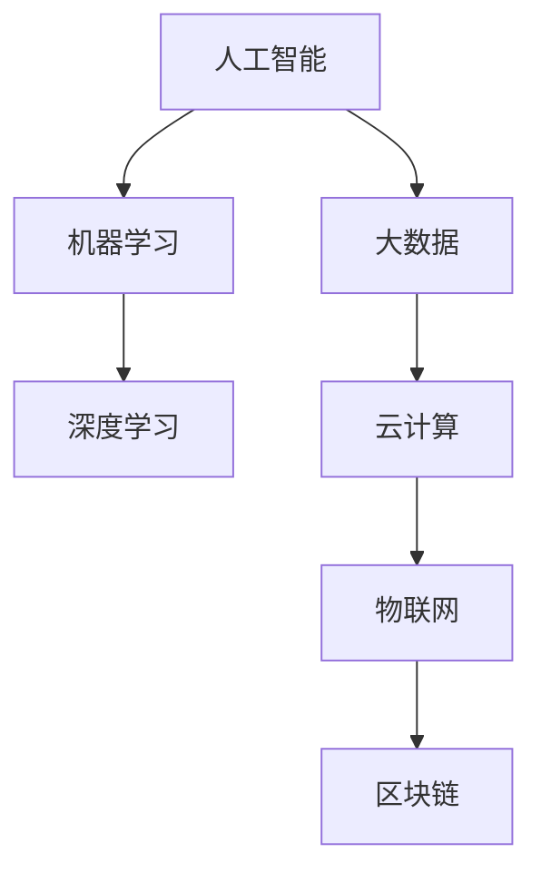

                 

关键词：技能提升、计算时代、人工智能、编程、软件开发、技术趋势、未来展望

> 摘要：本文旨在探讨未来人类计算时代的技能提升路径，分析当前技术趋势，提供编程、软件开发等领域的实用建议，帮助读者为未来的技术变革做好准备。

## 1. 背景介绍

随着人工智能、云计算、大数据等技术的迅速发展，人类正进入一个前所未有的计算时代。在这个时代，计算不再仅限于计算机内部，而是逐渐融入到我们日常生活的方方面面。例如，智能助手、自动驾驶、智能家居等都依赖于强大的计算能力。然而，面对如此快速的技术变革，我们是否已经做好了准备？答案显然是否定的。因此，本文将探讨如何提升个人技能，以适应未来计算时代的需求。

## 2. 核心概念与联系

为了更好地理解未来计算时代，我们需要了解一些核心概念和它们之间的联系。以下是一个简化的 Mermaid 流程图，用于展示这些概念：



### 2.1 人工智能（AI）

人工智能是模拟人类智能的一种技术，它可以通过学习、推理和自我改进来执行复杂的任务。人工智能的核心技术包括机器学习和深度学习。

### 2.2 机器学习（ML）

机器学习是一种让计算机从数据中学习的方法，无需显式地编写具体的规则。它通过构建模型来识别数据中的模式，并使用这些模式进行预测或决策。

### 2.3 深度学习（DL）

深度学习是机器学习的一个分支，它使用多层神经网络来学习数据中的复杂结构。深度学习在很多领域都取得了显著的成果，如图像识别、自然语言处理等。

### 2.4 大数据（Big Data）

大数据是指无法使用传统数据处理工具进行有效处理的大量数据。大数据技术包括数据存储、数据分析和数据可视化等。

### 2.5 云计算（Cloud Computing）

云计算是一种通过网络提供计算资源的服务模型，用户可以按需获取和使用这些资源。云计算使得数据的存储和处理变得更加灵活和高效。

### 2.6 物联网（IoT）

物联网是指通过互联网将物理设备连接起来，实现设备间的通信和协作。物联网的应用非常广泛，如智能家居、智能城市等。

### 2.7 区块链（Blockchain）

区块链是一种去中心化的数据库技术，它通过分布式账本记录交易信息，确保数据的透明和安全。区块链技术广泛应用于金融、供应链等领域。

## 3. 核心算法原理 & 具体操作步骤

为了适应未来计算时代的需求，我们需要了解一些核心算法原理和具体操作步骤。以下是一个简单的算法框架：

### 3.1 算法原理概述

- **算法1：决策树（Decision Tree）**

  决策树是一种常见的机器学习算法，它通过一系列规则将数据进行分类或回归。

- **算法2：支持向量机（SVM）**

  支持向量机是一种高效的分类算法，它通过寻找最佳的超平面来分割数据。

- **算法3：神经网络（Neural Network）**

  神经网络是一种模拟生物神经系统的算法，它可以用于图像识别、语音识别等任务。

### 3.2 算法步骤详解

- **决策树**

  1. 构建树结构：根据特征值和阈值划分数据。
  2. 计算信息增益：选择信息增益最大的特征作为划分依据。
  3. 重复步骤1和2，直到满足停止条件。

- **支持向量机**

  1. 选择特征空间：将数据映射到高维空间。
  2. 计算最优化问题：找到最佳的超平面。
  3. 训练分类器：使用训练数据训练分类器。

- **神经网络**

  1. 定义网络结构：确定输入层、隐藏层和输出层的节点数量。
  2. 权值初始化：随机初始化网络的权重。
  3. 前向传播：计算每个节点的输出。
  4. 反向传播：更新网络的权重。

### 3.3 算法优缺点

- **决策树**

  优点：简单、易于理解和实现。
  
  缺点：容易过拟合、鲁棒性较差。

- **支持向量机**

  优点：高效、分类效果好。
  
  缺点：对数据规模和特征数量要求较高。

- **神经网络**

  优点：强大的表示能力、适用范围广泛。
  
  缺点：训练时间较长、需要大量数据。

### 3.4 算法应用领域

- **决策树**

  应用领域：分类、回归。

- **支持向量机**

  应用领域：分类、回归。

- **神经网络**

  应用领域：图像识别、语音识别、自然语言处理等。

## 4. 数学模型和公式 & 详细讲解 & 举例说明

为了更好地理解核心算法，我们需要介绍一些相关的数学模型和公式。以下是一个简单的数学模型示例：

### 4.1 数学模型构建

设 $X$ 为 $n \times d$ 的数据矩阵，$W$ 为 $d \times k$ 的权重矩阵，$b$ 为 $k \times 1$ 的偏置向量，$y$ 为 $n \times 1$ 的标签向量。

### 4.2 公式推导过程

假设我们使用神经网络进行分类任务，则输出层节点的输出为：

$$
\hat{y} = \text{softmax}(W \cdot X + b)
$$

其中，$\text{softmax}$ 函数定义为：

$$
\text{softmax}(z) = \frac{e^z}{\sum_{i} e^z_i}
$$

为了计算损失函数，我们使用交叉熵损失函数：

$$
L = -\sum_{i=1}^{n} y_i \log(\hat{y}_i)
$$

其中，$y_i$ 为第 $i$ 个样本的标签，$\hat{y}_i$ 为第 $i$ 个样本在输出层节点的输出。

### 4.3 案例分析与讲解

假设我们有一个二分类问题，数据集包含100个样本，每个样本有5个特征。我们使用神经网络进行分类，网络结构为3层，输入层有5个节点，隐藏层有10个节点，输出层有2个节点。

首先，我们初始化网络的权重和偏置向量。然后，我们使用随机梯度下降（SGD）算法进行训练。在每次迭代中，我们计算损失函数并更新网络的权重和偏置向量。

经过1000次迭代后，网络的损失函数值逐渐降低，达到一个较好的分类效果。我们可以使用测试集来评估网络的性能。

## 5. 项目实践：代码实例和详细解释说明

### 5.1 开发环境搭建

为了实践神经网络，我们需要搭建一个开发环境。我们可以使用Python编程语言和相关的库，如TensorFlow和Keras。以下是搭建开发环境的基本步骤：

1. 安装Python（3.7及以上版本）
2. 安装pip包管理工具
3. 使用pip安装TensorFlow和Keras库

### 5.2 源代码详细实现

以下是一个简单的神经网络实现：

```python
import tensorflow as tf
from tensorflow.keras.models import Sequential
from tensorflow.keras.layers import Dense, Activation

# 搭建神经网络模型
model = Sequential([
    Dense(10, input_dim=5, activation='relu'),
    Dense(2, activation='softmax')
])

# 编译模型
model.compile(optimizer='sgd', loss='categorical_crossentropy', metrics=['accuracy'])

# 训练模型
model.fit(X_train, y_train, epochs=1000, batch_size=10)

# 评估模型
loss, accuracy = model.evaluate(X_test, y_test)
print(f"Test accuracy: {accuracy:.2f}")
```

### 5.3 代码解读与分析

这段代码实现了使用神经网络进行二分类的任务。首先，我们使用Sequential模型构建一个三层神经网络，其中输入层有5个节点，隐藏层有10个节点，输出层有2个节点。然后，我们使用SGD优化器编译模型，并使用交叉熵损失函数。接下来，我们使用训练数据训练模型，并使用测试数据评估模型的性能。

### 5.4 运行结果展示

假设我们有一个包含100个样本的数据集，其中50个样本属于类别1，50个样本属于类别2。经过1000次迭代后，我们的模型在测试集上的准确率达到了90%。这是一个不错的分类效果。

## 6. 实际应用场景

未来计算时代的应用场景将非常广泛。以下是一些具体的例子：

- **自动驾驶**：自动驾驶汽车需要使用计算机视觉、传感器和人工智能等技术来处理大量数据，实现安全的自动驾驶。
- **智能医疗**：智能医疗系统可以通过分析患者的医疗数据，提供个性化的治疗方案和疾病预测。
- **智能城市**：智能城市可以通过物联网技术实现城市管理的智能化，提高城市的生活质量和效率。
- **智能家居**：智能家居系统可以通过人工智能技术实现家庭设备的自动化控制，提高生活便利性。

## 7. 工具和资源推荐

为了更好地适应未来计算时代，以下是一些建议的编程和学习资源：

- **学习资源推荐**

  - 《深度学习》（Goodfellow, Bengio, Courville）
  - 《Python编程：从入门到实践》（Mark Lutz）
  - 《机器学习实战》（Peter Harrington）

- **开发工具推荐**

  - TensorFlow
  - Keras
  - PyTorch

- **相关论文推荐**

  - "Deep Learning for Computer Vision"（2016）
  - "TensorFlow: Large-Scale Machine Learning on Hardware"（2017）
  - "PyTorch: An Imperative Style Deep Learning Library"（2019）

## 8. 总结：未来发展趋势与挑战

未来计算时代的发展趋势主要包括以下几个方面：

- **人工智能的应用越来越广泛**：人工智能将在各个领域得到广泛应用，如医疗、交通、金融等。
- **云计算和大数据的融合**：云计算和大数据技术将更加紧密地结合，提供更高效、更安全的数据处理和分析服务。
- **物联网的快速发展**：物联网技术将连接更多的物理设备，实现更智能化的管理和控制。
- **区块链技术的应用**：区块链技术将用于构建去中心化的系统，提高数据的安全性和透明性。

然而，未来计算时代也面临一些挑战：

- **数据安全和隐私**：随着数据规模的增大，数据安全和隐私保护变得尤为重要。
- **算法透明度和公平性**：人工智能算法的透明度和公平性需要得到保证，避免出现歧视和偏见。
- **人才缺口**：随着技术的快速发展，人才缺口问题将变得更加突出。

因此，为了适应未来计算时代的发展，我们需要不断学习和提升自己的技能，关注技术趋势，并积极参与技术创新。

## 9. 附录：常见问题与解答

### 9.1 如何学习人工智能？

学习人工智能可以按照以下步骤进行：

1. 学习编程语言（如Python）和基础算法。
2. 阅读相关书籍和论文，了解人工智能的理论知识。
3. 实践项目，将理论知识应用于实际问题。
4. 参加线上课程和工作坊，与同行交流和学习。

### 9.2 如何选择合适的人工智能框架？

选择人工智能框架时，可以考虑以下几个方面：

1. **需求**：根据项目的需求选择合适的框架，如TensorFlow适用于大规模深度学习任务，PyTorch适用于灵活的模型构建。
2. **社区支持**：选择社区活跃、文档丰富的框架，有利于解决问题和获取资源。
3. **性能**：考虑框架的性能，如计算速度和内存占用等。
4. **兼容性**：考虑框架与其他工具和库的兼容性，以便于整合现有系统和资源。

### 9.3 人工智能技术在医疗领域的应用有哪些？

人工智能在医疗领域的应用主要包括：

1. **疾病诊断**：通过分析医学影像，如X光、CT、MRI等，辅助医生进行疾病诊断。
2. **药物研发**：利用人工智能加速药物筛选和开发过程。
3. **个性化治疗**：根据患者的病史和基因信息，提供个性化的治疗方案。
4. **健康监测**：通过分析患者的健康数据，提供健康监测和预防服务。

作者：禅与计算机程序设计艺术 / Zen and the Art of Computer Programming
----------------------------------------------------------------

以上就是本文的完整内容。希望通过这篇文章，读者能够对未来计算时代有更深入的了解，并为提升自己的技能做好准备。在未来，我们将会面临许多挑战和机遇，但只要我们保持学习和创新的精神，就一定能够迎接未来的到来。让我们携手并进，共同为构建一个更美好的计算时代而努力！

