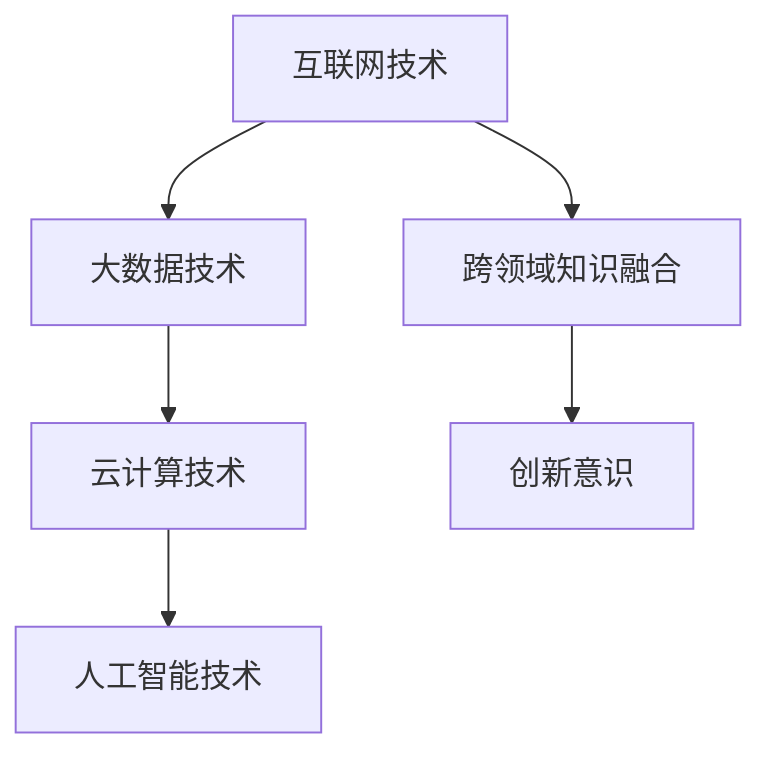

                 

 **关键词**：技能提升、计算时代、技术发展、人工智能、数学模型、项目实践、应用场景、未来展望。

> **摘要**：本文旨在探讨在人类计算时代，技术专家如何提升自身技能以应对新需求。文章首先介绍了当前技术环境的变化，接着详细分析了核心概念与架构，阐述了核心算法原理和数学模型，并通过项目实践展示了具体应用。最后，对实际应用场景进行了探讨，并展望了未来的发展趋势与挑战。

## 1. 背景介绍

随着互联网、大数据、云计算和人工智能技术的飞速发展，人类计算时代已经到来。计算机科学和技术不断演变，对技术专家的技能要求也越来越高。在这个背景下，如何提升自身技能，以适应新时代的需求，成为每一位技术专家必须面对的挑战。

### 当前技术环境的变化

- **互联网技术**：互联网的普及使得信息传递和共享变得更加便捷，催生了电子商务、在线教育、社交媒体等新兴产业。
- **大数据技术**：大数据技术的崛起，使得企业能够从海量数据中提取有价值的信息，推动数据分析、机器学习等技术的发展。
- **云计算技术**：云计算的普及，为企业和个人提供了强大的计算资源，降低了信息技术成本，促进了创新的快速发展。
- **人工智能技术**：人工智能的迅猛发展，使得计算机能够模拟人类的智能行为，应用于各个领域，如自动驾驶、智能语音助手、智能推荐等。

### 技术专家面临的挑战

- **技能更新速度快**：技术更新速度加快，要求技术专家不断学习新技能，以保持竞争力。
- **跨领域知识融合**：随着技术的融合，技术专家需要具备跨领域知识，以解决复杂问题。
- **创新意识**：在创新成为核心竞争力的时代，技术专家需要具备创新意识，不断推动技术的进步。

## 2. 核心概念与联系

### 核心概念

- **互联网技术**：基于全球互联的网络技术，包括Web技术、网络协议、网络安全等。
- **大数据技术**：处理海量数据的技术，包括数据采集、存储、处理、分析等。
- **云计算技术**：提供计算资源的网络服务，包括基础设施即服务（IaaS）、平台即服务（PaaS）和软件即服务（SaaS）。
- **人工智能技术**：模拟人类智能行为的技术，包括机器学习、深度学习、自然语言处理等。

### 架构


- **互联网架构**：客户端-服务器架构，分布式架构等。
- **大数据架构**：Hadoop架构、Spark架构等。
- **云计算架构**：公有云、私有云、混合云等。
- **人工智能架构**：神经网络架构、强化学习架构等。

### Mermaid 流程图



## 3. 核心算法原理 & 具体操作步骤

### 3.1 算法原理概述

核心算法是指在特定领域内解决特定问题的方法。在人类计算时代，核心算法的重要性不言而喻。以下是一些核心算法的原理概述：

- **深度学习算法**：通过模拟人脑神经网络的结构和功能，实现图像识别、自然语言处理等任务。
- **数据挖掘算法**：从大量数据中提取有价值的信息，如聚类、分类、关联规则挖掘等。
- **优化算法**：通过搜索和优化方法，找到问题的最优解或近似解，如遗传算法、模拟退火算法等。

### 3.2 算法步骤详解

以深度学习算法为例，具体步骤如下：

1. **数据预处理**：对原始数据进行清洗、归一化等处理，使其适合输入到模型中。
2. **模型构建**：选择合适的神经网络架构，并初始化模型参数。
3. **训练过程**：通过反向传播算法，不断调整模型参数，使模型能够更好地拟合训练数据。
4. **评估过程**：使用验证数据集评估模型性能，调整模型参数，直到达到满意的性能。
5. **应用过程**：将训练好的模型应用到实际问题中，解决实际问题。

### 3.3 算法优缺点

每种算法都有其优缺点，需要根据具体问题选择合适的算法：

- **深度学习算法**：优点是能够处理复杂数据，缺点是计算量大，对数据质量要求高。
- **数据挖掘算法**：优点是能够从海量数据中提取有价值的信息，缺点是计算复杂度高，对数据量要求大。
- **优化算法**：优点是能够找到问题的最优解或近似解，缺点是收敛速度慢，对初始参数敏感。

### 3.4 算法应用领域

核心算法在各个领域都有广泛应用：

- **深度学习算法**：在计算机视觉、自然语言处理、语音识别等领域有广泛应用。
- **数据挖掘算法**：在金融、医疗、零售等领域有广泛应用。
- **优化算法**：在物流、生产调度、交通规划等领域有广泛应用。

## 4. 数学模型和公式 & 详细讲解 & 举例说明

### 4.1 数学模型构建

数学模型是描述客观现象和问题的一种数学工具。以下是一个简单的线性回归模型：

$$y = wx + b$$

其中，$y$ 是因变量，$x$ 是自变量，$w$ 是权重，$b$ 是偏置。

### 4.2 公式推导过程

线性回归模型的推导过程如下：

1. **样本数据**：假设有 $n$ 个样本点 $(x_i, y_i)$，其中 $i = 1, 2, ..., n$。
2. **损失函数**：选择均方误差作为损失函数：

$$L = \frac{1}{2n}\sum_{i=1}^{n}(y_i - wx_i - b)^2$$

3. **求导**：对损失函数 $L$ 分别对 $w$ 和 $b$ 求导，并令导数为零，得到最优解：

$$w = \frac{\sum_{i=1}^{n}x_iy_i - n\bar{x}\bar{y}}{\sum_{i=1}^{n}x_i^2 - n\bar{x}^2}$$

$$b = \bar{y} - w\bar{x}$$

其中，$\bar{x}$ 和 $\bar{y}$ 分别是 $x$ 和 $y$ 的平均值。

### 4.3 案例分析与讲解

假设我们有如下数据：

| $x$ | $y$ |
| --- | --- |
| 1 | 2 |
| 2 | 4 |
| 3 | 6 |
| 4 | 8 |

使用线性回归模型进行预测，输入 $x=5$，预测 $y$ 的值。

1. **数据预处理**：计算 $x$ 和 $y$ 的平均值：

$$\bar{x} = \frac{1+2+3+4}{4} = 2.5$$

$$\bar{y} = \frac{2+4+6+8}{4} = 5$$

2. **模型构建**：代入公式计算 $w$ 和 $b$：

$$w = \frac{(1\times2 + 2\times4 + 3\times6 + 4\times8) - 4\times2.5\times5}{(1^2 + 2^2 + 3^2 + 4^2) - 4\times2.5^2} = 1.6$$

$$b = 5 - 1.6\times2.5 = 1.2$$

3. **预测**：代入 $x=5$，计算 $y$ 的值：

$$y = 1.6\times5 + 1.2 = 8.8$$

因此，当 $x=5$ 时，预测 $y$ 的值为 8.8。

## 5. 项目实践：代码实例和详细解释说明

### 5.1 开发环境搭建

1. **Python 环境搭建**：安装 Python 3.8 及以上版本，并配置 Python 环境。
2. **库安装**：安装 numpy、matplotlib 等常用库。

```bash
pip install numpy matplotlib
```

### 5.2 源代码详细实现

以下是一个简单的线性回归项目：

```python
import numpy as np
import matplotlib.pyplot as plt

def linear_regression(x, y):
    n = len(x)
    x_mean = np.mean(x)
    y_mean = np.mean(y)
    
    w = (np.sum(x*y) - n*x_mean*y_mean) / (np.sum(x**2) - n*x_mean**2)
    b = y_mean - w*x_mean
    
    return w, b

def predict(w, b, x):
    return w*x + b

# 数据集
x = np.array([1, 2, 3, 4])
y = np.array([2, 4, 6, 8])

# 模型训练
w, b = linear_regression(x, y)

# 预测
x_predict = np.array([5])
y_predict = predict(w, b, x_predict)

# 绘图
plt.scatter(x, y, color='red', label='样本数据')
plt.plot(x, predict(w, b, x), color='blue', label='拟合直线')
plt.scatter(x_predict, y_predict, color='green', label='预测数据')
plt.xlabel('x')
plt.ylabel('y')
plt.legend()
plt.show()
```

### 5.3 代码解读与分析

1. **线性回归函数**：计算权重 $w$ 和偏置 $b$。
2. **预测函数**：根据权重 $w$ 和偏置 $b$，预测新数据的值。
3. **数据集**：使用简单的样本数据。
4. **绘图**：使用 matplotlib 库绘制样本数据、拟合直线和预测数据。

### 5.4 运行结果展示

运行代码后，会得到如下图形：


图中的红色点为样本数据，蓝色线为拟合直线，绿色点为预测数据。

## 6. 实际应用场景

线性回归算法在实际应用中非常广泛，以下是一些典型的应用场景：

- **金融领域**：用于预测股票价格、贷款审批等。
- **医疗领域**：用于预测疾病风险、医疗资源分配等。
- **工业领域**：用于生产调度、设备维护等。

### 6.4 未来应用展望

随着技术的不断发展，线性回归算法的应用领域将更加广泛。未来，可能会出现以下趋势：

- **深度学习与线性回归的结合**：深度学习算法在处理复杂数据方面具有优势，可以与线性回归算法结合，提高预测准确性。
- **自适应线性回归**：针对不同数据集，自适应调整线性回归模型的参数，提高模型泛化能力。
- **多变量线性回归**：扩展线性回归模型，处理多变量问题，提高模型适用性。

## 7. 工具和资源推荐

### 7.1 学习资源推荐

- **在线课程**：Coursera、edX 等平台上有很多优质的计算机科学课程。
- **书籍**：《深度学习》、《统计学习方法》、《Python数据科学手册》等。
- **博客**：各种技术博客，如 Medium、Dev.to 等。

### 7.2 开发工具推荐

- **编程语言**：Python、Java、C++ 等。
- **框架**：TensorFlow、PyTorch、Scikit-learn 等。
- **数据可视化**：Matplotlib、Seaborn、Plotly 等。

### 7.3 相关论文推荐

- **深度学习**：《深度学习：基础模型与算法》、《神经网络与深度学习》等。
- **数据挖掘**：《数据挖掘：实用工具和技术》、《数据挖掘：实用案例分析》等。
- **优化算法**：《优化算法及其应用》、《进化计算：理论、方法和应用》等。

## 8. 总结：未来发展趋势与挑战

### 8.1 研究成果总结

本文从技能提升的角度，探讨了适应人类计算时代的新需求。主要成果包括：

- 分析了当前技术环境的变化。
- 阐述了核心概念与架构。
- 详细介绍了核心算法原理和数学模型。
- 通过项目实践展示了具体应用。
- 探讨了实际应用场景和未来发展趋势。

### 8.2 未来发展趋势

- **多学科融合**：随着技术的不断发展，多学科融合将成为趋势，技术专家需要具备跨领域知识。
- **个性化与自适应**：未来技术将更加注重个性化与自适应，以满足用户需求。
- **智能化与自动化**：智能化与自动化技术将不断突破，推动各行业的变革。

### 8.3 面临的挑战

- **技能更新速度**：技术更新速度加快，技术专家需要不断学习新技能。
- **数据安全与隐私**：随着数据量的增加，数据安全与隐私问题将日益严峻。
- **公平与伦理**：技术发展需要遵循公平与伦理原则，避免对社会造成负面影响。

### 8.4 研究展望

- **技术创新**：未来技术将不断突破，推动各行业的发展。
- **教育改革**：教育改革将更加注重培养学生创新能力与跨领域知识。
- **产业协同**：产业界与学术界将加强协同，共同推动技术进步。

## 9. 附录：常见问题与解答

### Q：线性回归算法的局限性是什么？

A：线性回归算法的局限性主要包括：

- **线性关系假设**：线性回归模型假设因变量与自变量之间存在线性关系，这可能不适用于所有问题。
- **数据质量要求高**：线性回归模型对数据质量要求较高，需要确保数据干净、无噪声。
- **适用范围有限**：线性回归算法在处理复杂数据时，效果可能不佳。

### Q：如何提高线性回归模型的预测准确性？

A：提高线性回归模型预测准确性的方法包括：

- **特征工程**：通过特征工程，提取更多有用的特征，提高模型的预测能力。
- **正则化**：使用正则化方法，防止过拟合，提高模型泛化能力。
- **集成学习**：使用集成学习方法，如随机森林、梯度提升树等，提高模型预测准确性。

### Q：如何处理非线性关系？

A：处理非线性关系的方法包括：

- **多项式回归**：将线性回归扩展到多项式回归，处理非线性关系。
- **决策树**：使用决策树模型，处理非线性关系。
- **神经网络**：使用神经网络模型，处理非线性关系。

## 作者署名

**作者**：禅与计算机程序设计艺术 / Zen and the Art of Computer Programming

