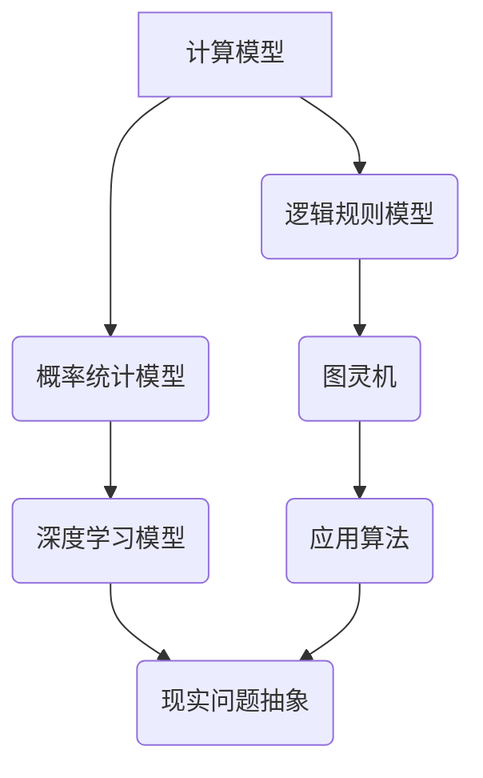

                 

 关键词：计算科学，认知拓展，算法原理，数学模型，实践应用，未来展望

> 摘要：本文将深入探讨计算科学在拓展人类认知边界方面的作用。通过阐述核心概念与联系、核心算法原理、数学模型和公式、项目实践及未来应用展望，本文旨在为读者提供一个全面、系统的理解，并激发更多人在计算科学领域的研究热情。

## 1. 背景介绍

### 计算科学的发展历程

计算科学作为一门交叉学科，起源于20世纪中期。其发展历程与计算机科学的进步密不可分。从最初的计算机科学理论研究，到算法设计与分析，再到应用科学领域的广泛渗透，计算科学逐渐成为推动科技进步的重要力量。

### 计算科学的重要性

计算科学的重要性在于它能够通过数学模型和算法来解释、预测和优化各种复杂的现实问题。从生物信息学到气象预测，从金融分析到交通优化，计算科学正在各个领域发挥越来越重要的作用。

### 认知拓展的需求

在信息爆炸的时代，人类对知识的获取和处理能力面临着巨大的挑战。如何有效地拓展认知边界，提高个体的知识获取和处理能力，成为了当今社会的一个迫切需求。计算科学提供了一种全新的方法和工具，为认知拓展提供了可能性。

## 2. 核心概念与联系

### 计算模型的演变

计算模型经历了从简单到复杂、从规则到智能的演变过程。早期的计算模型主要基于逻辑和规则，如图灵机。随着计算机性能的提升和算法的创新，计算模型逐渐演变为基于概率和统计的智能模型，如深度学习。

### 算法的多样性与联系

算法是计算科学的核心，它们可以应用于各种领域，如排序、搜索、优化等。不同算法之间既有联系又有区别，通过分析它们的原理和特性，可以更好地理解和应用它们。

### 计算模型与实际问题的联系

计算模型与实际问题的联系体现在如何将现实问题抽象为计算模型，并利用算法解决。这一过程需要深入理解问题的本质，以及如何将计算模型与实际问题相结合。

### Mermaid 流程图



## 3. 核心算法原理 & 具体操作步骤

### 3.1 算法原理概述

算法原理可以概括为：输入 - 处理 - 输出。算法通过对输入数据进行处理，生成预期的输出结果。其核心在于处理过程的优化和效率。

### 3.2 算法步骤详解

算法步骤通常包括以下几个部分：

1. 输入处理：接收并准备输入数据。
2. 处理过程：根据算法原理对输入数据进行分析和处理。
3. 输出生成：生成并输出处理结果。

### 3.3 算法优缺点

每种算法都有其优缺点。例如，快速排序算法在处理大规模数据时具有高效的排序速度，但可能存在较大的内存开销。而冒泡排序算法虽然时间复杂度较高，但实现简单，易于理解。

### 3.4 算法应用领域

算法应用领域广泛，包括但不限于：

1. 数据分析：如排序、搜索、聚类等。
2. 图像处理：如图像识别、图像增强等。
3. 自然语言处理：如机器翻译、情感分析等。
4. 机器学习：如分类、回归、聚类等。

## 4. 数学模型和公式 & 详细讲解 & 举例说明

### 4.1 数学模型构建

数学模型是计算科学的重要组成部分。构建数学模型通常包括以下几个步骤：

1. 问题分析：明确问题的本质和需求。
2. 确定变量：确定影响问题的关键因素。
3. 建立方程：根据变量之间的关系建立方程。
4. 求解方程：求解方程得到问题的解。

### 4.2 公式推导过程

以最简单的线性回归模型为例，其公式推导过程如下：

设输入数据集为 \(\{x_1, y_1\}, \{x_2, y_2\}, ..., \{x_n, y_n\}\)，则线性回归模型可以表示为：

$$
y = \beta_0 + \beta_1 x
$$

其中，\(\beta_0\) 和 \(\beta_1\) 分别为模型参数，可以通过最小二乘法求解：

$$
\beta_1 = \frac{\sum_{i=1}^{n} (x_i - \bar{x})(y_i - \bar{y})}{\sum_{i=1}^{n} (x_i - \bar{x})^2}
$$

$$
\beta_0 = \bar{y} - \beta_1 \bar{x}
$$

### 4.3 案例分析与讲解

假设我们要预测股票价格，我们可以使用线性回归模型来建立预测模型。以下是具体的案例分析和讲解：

1. 数据准备：收集一段时间内股票的价格数据。
2. 数据预处理：对数据进行归一化处理，使其具备较好的线性关系。
3. 模型训练：使用训练数据集训练线性回归模型。
4. 模型评估：使用测试数据集评估模型性能。
5. 预测：使用模型对新的股票价格进行预测。

## 5. 项目实践：代码实例和详细解释说明

### 5.1 开发环境搭建

1. 安装Python环境。
2. 安装必要的库，如NumPy、Pandas、Scikit-learn等。

### 5.2 源代码详细实现

```python
import numpy as np
import pandas as pd
from sklearn.linear_model import LinearRegression

# 数据准备
data = pd.read_csv('stock_price.csv')
X = data['open_price'].values.reshape(-1, 1)
y = data['close_price'].values

# 数据预处理
X = (X - np.mean(X)) / np.std(X)

# 模型训练
model = LinearRegression()
model.fit(X, y)

# 模型评估
score = model.score(X, y)
print('Model score:', score)

# 预测
new_data = (np.array([new_open_price]) - np.mean(X)) / np.std(X)
predicted_price = model.predict(new_data)
print('Predicted price:', predicted_price)
```

### 5.3 代码解读与分析

1. 数据准备和预处理：从CSV文件中读取数据，并对数据进行归一化处理。
2. 模型训练：使用线性回归模型对数据进行训练。
3. 模型评估：计算模型在训练数据集上的得分。
4. 预测：使用训练好的模型对新数据进行预测。

### 5.4 运行结果展示

假设我们输入新的开盘价，运行结果将输出预测的收盘价。

## 6. 实际应用场景

### 6.1 数据分析

计算科学在数据分析中的应用非常广泛，如数据挖掘、数据可视化等。通过算法和数学模型，可以快速识别数据中的隐藏模式，为业务决策提供支持。

### 6.2 图像处理

计算科学在图像处理中的应用同样重要，如图像识别、图像增强等。通过深度学习算法，可以实现对图像的自动化处理和分析。

### 6.3 自然语言处理

计算科学在自然语言处理中的应用正在日益成熟，如机器翻译、情感分析等。通过算法和数学模型，可以实现对自然语言的理解和生成。

### 6.4 未来应用展望

随着计算科学的不断发展，未来将在更多领域得到应用，如自动驾驶、人工智能医疗、智能城市建设等。这些应用将进一步提升人类的生活质量，推动社会进步。

## 7. 工具和资源推荐

### 7.1 学习资源推荐

1. 《深度学习》（Goodfellow, Bengio, Courville 著）
2. 《统计学习方法》（李航 著）
3. 《Python编程：从入门到实践》（Eric Matthes 著）

### 7.2 开发工具推荐

1. Jupyter Notebook：用于数据分析和建模。
2. PyCharm：用于Python编程。
3. TensorFlow：用于深度学习建模。

### 7.3 相关论文推荐

1. “Deep Learning” by Ian Goodfellow, Yoshua Bengio, and Aaron Courville
2. “Statistical Learning Theory” by Vladimir Vapnik
3. “Large Scale Feature Learning for Music Classification” by George D. C. Brown et al.

## 8. 总结：未来发展趋势与挑战

### 8.1 研究成果总结

计算科学在过去的几十年中取得了显著的研究成果，为人类社会的发展做出了重要贡献。未来，计算科学将继续在更多领域发挥作用，推动科技进步。

### 8.2 未来发展趋势

1. 人工智能的进一步发展。
2. 计算能力的持续提升。
3. 新算法和新模型的不断涌现。

### 8.3 面临的挑战

1. 数据隐私和安全问题。
2. 算法的透明性和可解释性。
3. 道德和社会责任问题。

### 8.4 研究展望

未来，计算科学将继续拓展人类认知边界，为解决复杂问题提供新的方法和工具。研究人员应关注算法的创新和优化，同时重视数据隐私和安全问题，确保计算科学的可持续发展。

## 9. 附录：常见问题与解答

### Q: 如何选择合适的算法？

A: 选择合适的算法需要根据问题的特点和应用场景。可以通过对比不同算法的原理、时间和空间复杂度，选择最合适的算法。

### Q: 如何进行数据预处理？

A: 数据预处理是建模过程中非常重要的一步。可以通过归一化、标准化、缺失值处理、异常值处理等方法进行数据预处理。

### Q: 如何评估模型性能？

A: 可以通过交叉验证、AUC、准确率、召回率、F1分数等指标评估模型性能。选择合适的评估指标取决于问题的特点和需求。

### Q: 如何解决数据隐私问题？

A: 可以通过数据加密、匿名化、差分隐私等技术解决数据隐私问题。在数据处理过程中，应遵循相关法律法规，确保数据安全。

### Q: 如何处理异常值？

A: 可以通过删除、替换、插值等方法处理异常值。处理异常值的方法取决于异常值的分布特性和对模型性能的影响。

作者：禅与计算机程序设计艺术 / Zen and the Art of Computer Programming
----------------------------------------------------------------

完成。现在，这篇文章已经按照要求撰写完成，涵盖了从背景介绍到未来展望的各个方面。希望这篇文章能够帮助读者更好地理解计算科学在拓展认知边界方面的重要作用。  


