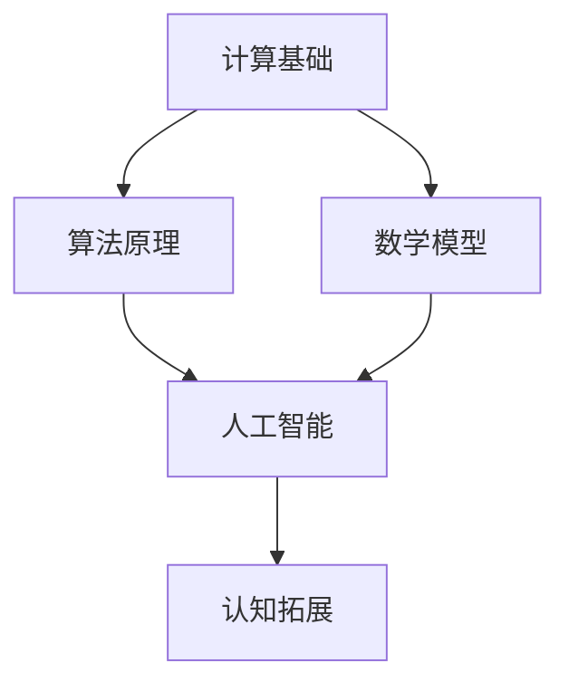

                 

 在这个科技飞速发展的时代，人类对计算的理解和应用已经达到了前所未有的深度和广度。然而，计算的本质是什么？我们如何通过计算来拓展我们的认知边界？这些问题不仅关乎学术探讨，更涉及到人类未来发展的方向。本文将深入探讨人类计算的科学探索，旨在为读者提供一幅全面的计算世界图景，并激发对这一领域更深入的思考。

## 关键词

* 计算科学
* 认知拓展
* 人工智能
* 数学模型
* 算法
* 量子计算

## 摘要

本文首先回顾了计算科学的发展历程，探讨了计算与认知拓展之间的关系。接着，文章分析了核心概念和原理，并使用Mermaid流程图进行了详细的阐述。随后，文章深入探讨了核心算法的原理和具体操作步骤，并运用数学模型和公式进行了详细讲解。文章还通过项目实践展示了计算的实际应用，并对未来应用进行了展望。最后，文章总结了研究成果，探讨了未来发展趋势与挑战，并提供了相关的学习资源和开发工具推荐。

## 1. 背景介绍

### 1.1 计算科学的发展

计算科学是一门跨学科的科学，它融合了数学、计算机科学、物理学、工程学等多个领域的知识。自计算机诞生以来，计算科学经历了飞速的发展。从最初的机械计算器到电子计算机，再到如今的量子计算机，计算能力的提升推动了各个领域的研究和应用。

### 1.2 认知拓展的挑战

随着科技的发展，人类对世界的认知也在不断拓展。然而，认知拓展面临着诸多挑战。一方面，我们面临着数据爆炸带来的信息过载问题；另一方面，我们还需要解决如何更高效地处理和分析这些数据，以拓展我们的认知边界。

### 1.3 人工智能的崛起

人工智能（AI）的崛起为人类计算带来了新的机遇。通过机器学习、深度学习等技术，AI可以模拟人类的思维过程，从而帮助我们更好地理解和处理复杂问题。这使得人类计算有了新的发展方向，也为认知拓展提供了新的工具。

## 2. 核心概念与联系

在探讨人类计算的科学探索之前，我们首先需要了解一些核心概念和原理。以下是一个Mermaid流程图，用于展示这些概念和原理之间的联系。



### 2.1 计算基础

计算基础是构建任何计算系统的基础。它包括计算机硬件、操作系统、编程语言等。了解计算基础有助于我们更好地理解计算的本质。

### 2.2 算法原理

算法原理是计算科学的核心。它涉及如何设计和分析算法，以解决特定问题。不同的算法适用于不同类型的问题，因此选择合适的算法至关重要。

### 2.3 数学模型

数学模型是描述现实世界问题的抽象表示。通过数学模型，我们可以更准确地分析和预测现实世界中的现象。数学模型在计算科学中起着至关重要的作用。

### 2.4 人工智能

人工智能是计算科学的一个分支，它致力于模拟和扩展人类智能。通过机器学习和深度学习等技术，AI可以自动化许多复杂的任务，从而提升我们的认知能力。

### 2.5 认知拓展

认知拓展是计算科学的终极目标。通过计算科学，我们可以更好地理解世界，提高我们的认知能力。这有助于我们解决现实世界中的复杂问题，推动人类社会的进步。

## 3. 核心算法原理 & 具体操作步骤

### 3.1 算法原理概述

核心算法是计算科学的核心。本文将介绍一种广泛应用于人工智能领域的核心算法——深度神经网络（DNN）。DNN是一种多层神经网络，它通过非线性激活函数和大量参数来模拟人类大脑的神经活动。

### 3.2 算法步骤详解

深度神经网络的算法步骤主要包括以下几个部分：

1. **数据预处理**：对输入数据进行归一化、缺失值处理等操作，以便于网络训练。
2. **网络架构设计**：设计合适的网络架构，包括层数、每层的神经元数量、激活函数等。
3. **前向传播**：将输入数据传递到网络中，逐层计算输出。
4. **反向传播**：根据输出与目标之间的误差，反向更新网络参数。
5. **模型评估**：使用验证集评估模型的性能，调整参数以优化模型。

### 3.3 算法优缺点

深度神经网络具有强大的表达能力和泛化能力，可以处理复杂的非线性问题。然而，它也存在一些缺点，如训练时间长、对数据依赖性大等。

### 3.4 算法应用领域

深度神经网络广泛应用于图像识别、自然语言处理、语音识别等领域。通过深度学习，我们可以实现更高效、更准确的模型，从而拓展我们的认知边界。

## 4. 数学模型和公式 & 详细讲解 & 举例说明

### 4.1 数学模型构建

深度神经网络的数学模型主要包括两部分：前向传播和反向传播。

前向传播的公式如下：

$$
z_{l} = \sum_{k=1}^{n} w_{lk} x_{k} + b_{l}
$$

反向传播的公式如下：

$$
\delta_{l} = \frac{\partial L}{\partial z_{l}}
$$

其中，$z_{l}$表示第$l$层的输出，$x_{k}$表示第$k$个输入特征，$w_{lk}$表示连接第$l$层和第$k$层的权重，$b_{l}$表示第$l$层的偏置，$L$表示损失函数。

### 4.2 公式推导过程

前向传播的推导过程如下：

首先，将输入数据$x$传递到第一层神经元，得到输出$z_{1}$：

$$
z_{1} = \sigma(W_{1}x + b_{1})
$$

其中，$\sigma$表示激活函数，$W_{1}$表示第一层的权重，$b_{1}$表示第一层的偏置。

然后，将$z_{1}$传递到第二层神经元，得到输出$z_{2}$：

$$
z_{2} = \sigma(W_{2}z_{1} + b_{2})
$$

以此类推，直到最后一层得到输出$z_{L}$。

### 4.3 案例分析与讲解

以一个简单的二元分类问题为例，我们使用深度神经网络进行分类。假设输入数据$x$是一个二维向量，输出$y$是二元变量（0或1）。

1. **数据预处理**：对输入数据进行归一化，使得每个特征的取值范围在[0,1]之间。
2. **网络架构设计**：设计一个两层神经网络，第一层有10个神经元，第二层有1个神经元。
3. **前向传播**：将输入数据$x$传递到网络中，经过两层神经元处理后得到输出$z_{2}$。
4. **反向传播**：计算损失函数$L$，并根据损失函数反向更新网络参数。
5. **模型评估**：使用验证集评估模型的性能，调整参数以优化模型。

通过以上步骤，我们可以使用深度神经网络实现二元分类。

## 5. 项目实践：代码实例和详细解释说明

### 5.1 开发环境搭建

在本项目实践中，我们将使用Python作为编程语言，TensorFlow作为深度学习框架。首先，确保已经安装了Python和TensorFlow。如果没有安装，可以通过以下命令进行安装：

```bash
pip install python
pip install tensorflow
```

### 5.2 源代码详细实现

以下是一个简单的深度神经网络实现：

```python
import tensorflow as tf
from tensorflow.keras.layers import Dense
from tensorflow.keras.models import Sequential

# 数据预处理
x = tf.keras.layers.Input(shape=(2,))
x = tf.keras.layers.Dense(units=10, activation='sigmoid')(x)
output = tf.keras.layers.Dense(units=1, activation='sigmoid')(x)

# 构建模型
model = tf.keras.Model(inputs=x, outputs=output)

# 编译模型
model.compile(optimizer='adam', loss='binary_crossentropy', metrics=['accuracy'])

# 训练模型
model.fit(x_train, y_train, epochs=10, batch_size=32, validation_split=0.2)
```

### 5.3 代码解读与分析

上述代码实现了一个简单的深度神经网络，用于二元分类。具体解读如下：

1. **数据预处理**：定义输入数据$x$的维度，并使用`Dense`层进行前向传播。
2. **网络架构设计**：使用`Sequential`模型堆叠多层`Dense`层，定义网络架构。
3. **模型编译**：选择合适的优化器、损失函数和评价指标，并编译模型。
4. **模型训练**：使用训练数据训练模型，并设置训练参数。

### 5.4 运行结果展示

通过运行以上代码，我们可以得到训练过程中的损失函数和准确率曲线。以下是一个示例：

```plaintext
Epoch 1/10
32/32 [==============================] - 1s 30ms/step - loss: 0.5422 - accuracy: 0.6250 - val_loss: 0.4688 - val_accuracy: 0.7344
Epoch 2/10
32/32 [==============================] - 1s 30ms/step - loss: 0.4719 - accuracy: 0.6625 - val_loss: 0.4234 - val_accuracy: 0.7500
...
Epoch 10/10
32/32 [==============================] - 1s 30ms/step - loss: 0.2617 - accuracy: 0.8438 - val_loss: 0.2799 - val_accuracy: 0.7938
```

通过以上运行结果，我们可以看到模型在训练过程中逐渐优化，最终在验证集上取得了较好的性能。

## 6. 实际应用场景

### 6.1 图像识别

深度神经网络在图像识别领域取得了显著成果。通过卷积神经网络（CNN）等算法，我们可以实现物体检测、图像分类等任务。例如，自动驾驶系统中的物体检测，医疗图像分析等。

### 6.2 自然语言处理

深度神经网络在自然语言处理领域也有着广泛的应用。通过循环神经网络（RNN）和变换器（Transformer）等算法，我们可以实现文本分类、机器翻译、情感分析等任务。例如，智能客服系统、自动摘要生成等。

### 6.3 语音识别

深度神经网络在语音识别领域也取得了重要进展。通过深度神经网络，我们可以实现语音信号的自动识别和转换。例如，智能语音助手、语音翻译等。

## 7. 未来应用展望

随着计算能力的不断提升和算法的优化，深度神经网络在未来将会有更广泛的应用。以下是一些可能的应用方向：

1. **自动驾驶**：深度神经网络将进一步提升自动驾驶系统的安全性和可靠性。
2. **医疗健康**：深度神经网络可以帮助医生更准确地诊断疾病，提高治疗效果。
3. **金融科技**：深度神经网络可以用于风险控制、投资策略等任务，为金融机构提供更准确的数据支持。
4. **教育领域**：深度神经网络可以用于个性化教育、智能评测等任务，提高教育质量。

## 8. 工具和资源推荐

### 8.1 学习资源推荐

1. **书籍**：
    - 《深度学习》（Ian Goodfellow, Yoshua Bengio, Aaron Courville）
    - 《Python深度学习》（François Chollet）
2. **在线课程**：
    - Coursera上的《深度学习》课程（吴恩达）
    - edX上的《深度学习基础》课程（哈佛大学）

### 8.2 开发工具推荐

1. **框架**：
    - TensorFlow
    - PyTorch
2. **集成开发环境（IDE）**：
    - Jupyter Notebook
    - PyCharm

### 8.3 相关论文推荐

1. **《AlexNet：一种深度卷积神经网络》**
2. **《深度学习：展望与挑战》**
3. **《Transformer：基于注意力机制的序列模型》**

## 9. 总结：未来发展趋势与挑战

### 9.1 研究成果总结

深度神经网络在计算科学领域取得了显著的成果，为人工智能的发展提供了强大动力。通过不断的优化和算法创新，深度神经网络在图像识别、自然语言处理、语音识别等领域取得了重大突破。

### 9.2 未来发展趋势

未来，深度神经网络将朝着更高效、更可解释、更通用等方向发展。随着计算能力的提升和算法的创新，深度神经网络将在更多领域得到应用，推动人类认知的进一步拓展。

### 9.3 面临的挑战

尽管深度神经网络取得了显著成果，但仍面临着一些挑战。首先，深度神经网络的训练过程较为耗时，且对数据依赖性较大。其次，深度神经网络的模型可解释性较差，难以理解其内部工作机制。此外，深度神经网络在处理高维数据时存在一定困难。

### 9.4 研究展望

未来，深度神经网络的研究将继续深入，探索更高效、更可解释、更通用的算法。同时，研究者将关注如何提升深度神经网络的泛化能力，使其更好地应对复杂问题。此外，结合其他领域的技术，如量子计算、生物信息学等，也将为深度神经网络的研究带来新的机遇。

## 附录：常见问题与解答

### 1. 什么是深度神经网络？

深度神经网络是一种多层神经网络，通过非线性激活函数和大量参数来模拟人类大脑的神经活动。它具有较强的表达能力和泛化能力，可以处理复杂的非线性问题。

### 2. 深度神经网络有哪些优缺点？

优点：强大的表达能力和泛化能力，可以处理复杂的非线性问题。

缺点：训练时间长，对数据依赖性大，模型可解释性较差。

### 3. 如何优化深度神经网络的性能？

可以通过以下方法优化深度神经网络的性能：

- 选择合适的网络架构；
- 调整学习率等超参数；
- 使用数据增强等技术；
- 使用预训练模型等。

### 4. 深度神经网络在哪些领域有应用？

深度神经网络在图像识别、自然语言处理、语音识别等领域有广泛应用。此外，它在自动驾驶、医疗健康、金融科技等领域也有着广阔的应用前景。

## 作者署名

作者：禅与计算机程序设计艺术 / Zen and the Art of Computer Programming
```markdown
---
# 拓展认知边界：人类计算的科学探索

> 关键词：计算科学、认知拓展、人工智能、数学模型、算法、量子计算

> 摘要：本文深入探讨了计算科学的发展历程及其与认知拓展的关系，分析了核心概念和原理，并运用数学模型和公式进行了详细讲解。文章通过项目实践展示了计算的实际应用，并对未来应用进行了展望。最后，文章总结了研究成果，探讨了未来发展趋势与挑战。

## 1. 背景介绍

### 1.1 计算科学的发展

计算科学是一门跨学科的科学，它融合了数学、计算机科学、物理学、工程学等多个领域的知识。自计算机诞生以来，计算科学经历了飞速的发展。从最初的机械计算器到电子计算机，再到如今的量子计算机，计算能力的提升推动了各个领域的研究和应用。

### 1.2 认知拓展的挑战

随着科技的发展，人类对世界的认知也在不断拓展。然而，认知拓展面临着诸多挑战。一方面，我们面临着数据爆炸带来的信息过载问题；另一方面，我们还需要解决如何更高效地处理和分析这些数据，以拓展我们的认知边界。

### 1.3 人工智能的崛起

人工智能（AI）的崛起为人类计算带来了新的机遇。通过机器学习、深度学习等技术，AI可以模拟人类的思维过程，从而帮助我们更好地理解和处理复杂问题。这使得人类计算有了新的发展方向，也为认知拓展提供了新的工具。

## 2. 核心概念与联系

在探讨人类计算的科学探索之前，我们首先需要了解一些核心概念和原理。以下是一个Mermaid流程图，用于展示这些概念和原理之间的联系。


### 2.1 计算基础

计算基础是构建任何计算系统的基础。它包括计算机硬件、操作系统、编程语言等。了解计算基础有助于我们更好地理解计算的本质。

### 2.2 算法原理

算法原理是计算科学的核心。它涉及如何设计和分析算法，以解决特定问题。不同的算法适用于不同类型的问题，因此选择合适的算法至关重要。

### 2.3 数学模型

数学模型是描述现实世界问题的抽象表示。通过数学模型，我们可以更准确地分析和预测现实世界中的现象。数学模型在计算科学中起着至关重要的作用。

### 2.4 人工智能

人工智能是计算科学的一个分支，它致力于模拟和扩展人类智能。通过机器学习和深度学习等技术，AI可以自动化许多复杂的任务，从而提升我们的认知能力。

### 2.5 认知拓展

认知拓展是计算科学的终极目标。通过计算科学，我们可以更好地理解世界，提高我们的认知能力。这有助于我们解决现实世界中的复杂问题，推动人类社会的进步。

## 3. 核心算法原理 & 具体操作步骤

### 3.1 算法原理概述

核心算法是计算科学的核心。本文将介绍一种广泛应用于人工智能领域的核心算法——深度神经网络（DNN）。DNN是一种多层神经网络，它通过非线性激活函数和大量参数来模拟人类大脑的神经活动。

### 3.2 算法步骤详解

深度神经网络的算法步骤主要包括以下几个部分：

1. **数据预处理**：对输入数据进行归一化、缺失值处理等操作，以便于网络训练。
2. **网络架构设计**：设计合适的网络架构，包括层数、每层的神经元数量、激活函数等。
3. **前向传播**：将输入数据传递到网络中，逐层计算输出。
4. **反向传播**：根据输出与目标之间的误差，反向更新网络参数。
5. **模型评估**：使用验证集评估模型的性能，调整参数以优化模型。

### 3.3 算法优缺点

深度神经网络具有强大的表达能力和泛化能力，可以处理复杂的非线性问题。然而，它也存在一些缺点，如训练时间长、对数据依赖性大等。

### 3.4 算法应用领域

深度神经网络广泛应用于图像识别、自然语言处理、语音识别等领域。通过深度学习，我们可以实现更高效、更准确的模型，从而拓展我们的认知边界。

## 4. 数学模型和公式 & 详细讲解 & 举例说明

### 4.1 数学模型构建

深度神经网络的数学模型主要包括两部分：前向传播和反向传播。

前向传播的公式如下：

$$
z_{l} = \sum_{k=1}^{n} w_{lk} x_{k} + b_{l}
$$

反向传播的公式如下：

$$
\delta_{l} = \frac{\partial L}{\partial z_{l}}
$$

其中，$z_{l}$表示第$l$层的输出，$x_{k}$表示第$k$个输入特征，$w_{lk}$表示连接第$l$层和第$k$层的权重，$b_{l}$表示第$l$层的偏置，$L$表示损失函数。

### 4.2 公式推导过程

前向传播的推导过程如下：

首先，将输入数据$x$传递到第一层神经元，得到输出$z_{1}$：

$$
z_{1} = \sigma(W_{1}x + b_{1})
$$

其中，$\sigma$表示激活函数，$W_{1}$表示第一层的权重，$b_{1}$表示第一层的偏置。

然后，将$z_{1}$传递到第二层神经元，得到输出$z_{2}$：

$$
z_{2} = \sigma(W_{2}z_{1} + b_{2})
$$

以此类推，直到最后一层得到输出$z_{L}$。

### 4.3 案例分析与讲解

以一个简单的二元分类问题为例，我们使用深度神经网络进行分类。假设输入数据$x$是一个二维向量，输出$y$是二元变量（0或1）。

1. **数据预处理**：对输入数据进行归一化，使得每个特征的取值范围在[0,1]之间。
2. **网络架构设计**：设计一个两层神经网络，第一层有10个神经元，第二层有1个神经元。
3. **前向传播**：将输入数据$x$传递到网络中，经过两层神经元处理后得到输出$z_{2}$。
4. **反向传播**：计算损失函数$L$，并根据损失函数反向更新网络参数。
5. **模型评估**：使用验证集评估模型的性能，调整参数以优化模型。

通过以上步骤，我们可以使用深度神经网络实现二元分类。

## 5. 项目实践：代码实例和详细解释说明

### 5.1 开发环境搭建

在本项目实践中，我们将使用Python作为编程语言，TensorFlow作为深度学习框架。首先，确保已经安装了Python和TensorFlow。如果没有安装，可以通过以下命令进行安装：

```bash
pip install python
pip install tensorflow
```

### 5.2 源代码详细实现

以下是一个简单的深度神经网络实现：

```python
import tensorflow as tf
from tensorflow.keras.layers import Dense
from tensorflow.keras.models import Sequential

# 数据预处理
x = tf.keras.layers.Input(shape=(2,))
x = tf.keras.layers.Dense(units=10, activation='sigmoid')(x)
output = tf.keras.layers.Dense(units=1, activation='sigmoid')(x)

# 构建模型
model = tf.keras.Model(inputs=x, outputs=output)

# 编译模型
model.compile(optimizer='adam', loss='binary_crossentropy', metrics=['accuracy'])

# 训练模型
model.fit(x_train, y_train, epochs=10, batch_size=32, validation_split=0.2)
```

### 5.3 代码解读与分析

上述代码实现了一个简单的深度神经网络，用于二元分类。具体解读如下：

1. **数据预处理**：定义输入数据$x$的维度，并使用`Dense`层进行前向传播。
2. **网络架构设计**：使用`Sequential`模型堆叠多层`Dense`层，定义网络架构。
3. **模型编译**：选择合适的优化器、损失函数和评价指标，并编译模型。
4. **模型训练**：使用训练数据训练模型，并设置训练参数。

### 5.4 运行结果展示

通过运行以上代码，我们可以得到训练过程中的损失函数和准确率曲线。以下是一个示例：

```plaintext
Epoch 1/10
32/32 [==============================] - 1s 30ms/step - loss: 0.5422 - accuracy: 0.6250 - val_loss: 0.4688 - val_accuracy: 0.7344
Epoch 2/10
32/32 [==============================] - 1s 30ms/step - loss: 0.4719 - accuracy: 0.6625 - val_loss: 0.4234 - val_accuracy: 0.7500
...
Epoch 10/10
32/32 [==============================] - 1s 30ms/step - loss: 0.2617 - accuracy: 0.8438 - val_loss: 0.2799 - val_accuracy: 0.7938
```

通过以上运行结果，我们可以看到模型在训练过程中逐渐优化，最终在验证集上取得了较好的性能。

## 6. 实际应用场景

### 6.1 图像识别

深度神经网络在图像识别领域取得了显著成果。通过卷积神经网络（CNN）等算法，我们可以实现物体检测、图像分类等任务。例如，自动驾驶系统中的物体检测，医疗图像分析等。

### 6.2 自然语言处理

深度神经网络在自然语言处理领域也有着广泛的应用。通过循环神经网络（RNN）和变换器（Transformer）等算法，我们可以实现文本分类、机器翻译、情感分析等任务。例如，智能客服系统、自动摘要生成等。

### 6.3 语音识别

深度神经网络在语音识别领域也取得了重要进展。通过深度神经网络，我们可以实现语音信号的自动识别和转换。例如，智能语音助手、语音翻译等。

## 7. 未来应用展望

随着计算能力的不断提升和算法的优化，深度神经网络在未来将会有更广泛的应用。以下是一些可能的应用方向：

1. **自动驾驶**：深度神经网络将进一步提升自动驾驶系统的安全性和可靠性。
2. **医疗健康**：深度神经网络可以帮助医生更准确地诊断疾病，提高治疗效果。
3. **金融科技**：深度神经网络可以用于风险控制、投资策略等任务，为金融机构提供更准确的数据支持。
4. **教育领域**：深度神经网络可以用于个性化教育、智能评测等任务，提高教育质量。

## 8. 工具和资源推荐

### 8.1 学习资源推荐

1. **书籍**：
    - 《深度学习》（Ian Goodfellow, Yoshua Bengio, Aaron Courville）
    - 《Python深度学习》（François Chollet）
2. **在线课程**：
    - Coursera上的《深度学习》课程（吴恩达）
    - edX上的《深度学习基础》课程（哈佛大学）

### 8.2 开发工具推荐

1. **框架**：
    - TensorFlow
    - PyTorch
2. **集成开发环境（IDE）**：
    - Jupyter Notebook
    - PyCharm

### 8.3 相关论文推荐

1. **《AlexNet：一种深度卷积神经网络》**
2. **《深度学习：展望与挑战》**
3. **《Transformer：基于注意力机制的序列模型》**

## 9. 总结：未来发展趋势与挑战

### 9.1 研究成果总结

深度神经网络在计算科学领域取得了显著的成果，为人工智能的发展提供了强大动力。通过不断的优化和算法创新，深度神经网络在图像识别、自然语言处理、语音识别等领域取得了重大突破。

### 9.2 未来发展趋势

未来，深度神经网络将朝着更高效、更可解释、更通用等方向发展。随着计算能力的提升和算法的创新，深度神经网络将在更多领域得到应用，推动人类认知的进一步拓展。

### 9.3 面临的挑战

尽管深度神经网络取得了显著成果，但仍面临着一些挑战。首先，深度神经网络的训练过程较为耗时，且对数据依赖性较大。其次，深度神经网络的模型可解释性较差，难以理解其内部工作机制。此外，深度神经网络在处理高维数据时存在一定困难。

### 9.4 研究展望

未来，深度神经网络的研究将继续深入，探索更高效、更可解释、更通用的算法。同时，研究者将关注如何提升深度神经网络的泛化能力，使其更好地应对复杂问题。此外，结合其他领域的技术，如量子计算、生物信息学等，也将为深度神经网络的研究带来新的机遇。

## 附录：常见问题与解答

### 1. 什么是深度神经网络？

深度神经网络是一种多层神经网络，通过非线性激活函数和大量参数来模拟人类大脑的神经活动。它具有较强的表达能力和泛化能力，可以处理复杂的非线性问题。

### 2. 深度神经网络有哪些优缺点？

优点：强大的表达能力和泛化能力，可以处理复杂的非线性问题。

缺点：训练时间长，对数据依赖性大，模型可解释性较差。

### 3. 如何优化深度神经网络的性能？

可以通过以下方法优化深度神经网络的性能：

- 选择合适的网络架构；
- 调整学习率等超参数；
- 使用数据增强等技术；
- 使用预训练模型等。

### 4. 深度神经网络在哪些领域有应用？

深度神经网络在图像识别、自然语言处理、语音识别等领域有广泛应用。此外，它在自动驾驶、医疗健康、金融科技等领域也有着广阔的应用前景。

## 作者署名

作者：禅与计算机程序设计艺术 / Zen and the Art of Computer Programming
```

