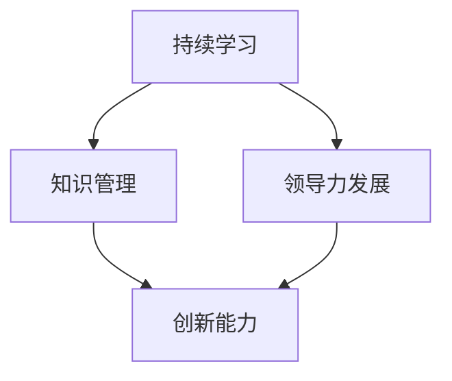

                 

关键词：管理者、持续学习、知识管理、技术创新、领导力发展

> 摘要：本文旨在探讨持续学习对管理者的重要性。在现代技术的快速发展背景下，管理者需要不断更新知识和技能，以适应不断变化的商业环境。本文将从多个维度分析持续学习的重要性，并探讨如何通过有效的知识管理和领导力发展来提升管理者的持续学习能力。

## 1. 背景介绍

随着全球化和数字化转型的加速，企业面临着前所未有的挑战和机遇。技术的飞速发展，如人工智能、大数据、云计算等，正在重塑各个行业的商业模式和运营方式。对于管理者来说，这意味着需要具备不断学习和适应新技术的能力，以保持企业的竞争力。

然而，许多管理者在职业生涯中往往陷入了“经验主义”的陷阱，认为多年的工作经验已经足以应对所有问题。这种心态导致他们忽视了持续学习的重要性，最终可能使企业在快速变化的市场中失去竞争力。

本文将探讨持续学习对管理者的重要性，并分析如何通过有效的知识管理和领导力发展来提升管理者的持续学习能力。文章结构如下：

1. 背景介绍：阐述现代企业面临的挑战和持续学习的重要性。
2. 核心概念与联系：介绍与持续学习相关的重要概念，并使用Mermaid流程图展示其架构。
3. 核心算法原理 & 具体操作步骤：详细解释如何通过持续学习提升管理者的技能。
4. 数学模型和公式 & 详细讲解 & 举例说明：运用数学模型和公式分析持续学习的效果。
5. 项目实践：提供具体的代码实例和详细解释。
6. 实际应用场景：探讨持续学习在企业管理中的应用。
7. 工具和资源推荐：推荐有助于持续学习的资源和工具。
8. 总结：总结研究成果，展望未来发展。

## 2. 核心概念与联系

### 2.1 持续学习

持续学习是指个人或组织不断获取新知识、技能和经验，以适应不断变化的环境。对于管理者而言，持续学习不仅是提升个人竞争力的手段，也是推动企业创新和发展的关键。

### 2.2 知识管理

知识管理是指通过系统的收集、组织、存储、传播和应用知识，以提高组织效率和创新能力。有效的知识管理能够确保组织中的知识得到充分利用，从而支持持续学习。

### 2.3 领导力发展

领导力发展是指通过培训、实践和反思等方式，提升管理者的领导能力和管理水平。领导力发展不仅有助于管理者个人成长，也有助于塑造积极向上的组织文化。

### 2.4 Mermaid 流程图

以下是一个简化的Mermaid流程图，展示了持续学习、知识管理和领导力发展之间的关系：



在这个流程图中，持续学习是知识管理和领导力发展的基础，而知识管理和领导力发展共同促进了组织的效率和创新。

## 3. 核心算法原理 & 具体操作步骤

### 3.1 算法原理概述

持续学习算法的基本原理是通过不断地获取新知识、技能和经验，将新的信息整合到已有的知识体系中，从而实现个人和组织的持续成长。具体操作步骤如下：

1. **信息收集**：管理者需要主动获取与业务相关的最新信息，如行业动态、技术趋势等。
2. **知识整合**：将新信息与已有的知识体系相结合，形成新的认知框架。
3. **技能提升**：通过实践和应用新知识，提升个人技能和解决问题的能力。
4. **反馈循环**：根据实践结果不断调整和优化知识体系，形成持续学习的良性循环。

### 3.2 算法步骤详解

1. **信息收集**：

   管理者可以通过以下渠道获取信息：

   - **行业报告**：定期阅读行业报告，了解市场趋势和技术动态。
   - **专业交流**：参加行业会议、研讨会，与同行交流经验和观点。
   - **在线学习**：利用在线课程、论坛等资源，学习新知识和技能。

2. **知识整合**：

   在获取信息后，管理者需要将其与已有的知识体系相结合。这可以通过以下方式实现：

   - **思维导图**：使用思维导图工具，将新知识和已有知识进行可视化整合。
   - **笔记整理**：将新知识和相关信息整理成笔记，形成系统的知识框架。

3. **技能提升**：

   管理者需要通过实践和应用新知识，提升个人技能。具体方法包括：

   - **项目实践**：在实际工作中应用新知识，解决实际问题。
   - **角色扮演**：通过模拟不同的管理场景，提升应对复杂情况的能力。
   - **导师指导**：寻求经验丰富的导师指导，快速提升管理能力。

4. **反馈循环**：

   管理者需要根据实践结果不断调整和优化知识体系。具体方法包括：

   - **反思总结**：定期反思自己的管理实践，总结经验教训。
   - **持续迭代**：根据反思结果，调整和优化知识体系和技能。
   - **知识分享**：与团队成员分享知识和经验，形成共同成长的氛围。

### 3.3 算法优缺点

持续学习算法的优点包括：

- **灵活性**：能够根据环境和需求的变化，不断调整和优化知识体系。
- **适应性**：能够快速适应新技术和新趋势，保持企业的竞争力。

然而，该算法也存在一些缺点：

- **时间成本**：持续学习需要投入大量的时间和精力，对管理者的个人时间管理能力有较高要求。
- **学习效果的不确定性**：新知识和技能的吸收和应用效果难以量化，存在一定的风险。

### 3.4 算法应用领域

持续学习算法可以应用于以下领域：

- **企业管理**：提升管理者的决策能力和执行力，推动企业持续创新。
- **技术创新**：促进技术团队的学习和创新，提升企业的技术竞争力。
- **领导力发展**：提升管理者的领导能力和管理水平，塑造积极向上的组织文化。

## 4. 数学模型和公式 & 详细讲解 & 举例说明

### 4.1 数学模型构建

为了分析持续学习对管理者的重要性，我们可以构建一个简单的数学模型。假设管理者的初始知识储备为\(K_0\)，通过持续学习，管理者在时间\(t\)后的知识储备为\(K_t\)。则持续学习可以表示为：

\[ K_t = K_0 + \alpha \cdot t \]

其中，\(\alpha\)为学习速率，表示管理者每单位时间内知识增长的量。

### 4.2 公式推导过程

学习速率\(\alpha\)可以通过以下公式推导：

\[ \alpha = \frac{K_t - K_0}{t} \]

当管理者在时间\(t_1\)和\(t_2\)时的知识储备分别为\(K_{t_1}\)和\(K_{t_2}\)，则：

\[ \alpha = \frac{K_{t_2} - K_{t_1}}{t_2 - t_1} \]

### 4.3 案例分析与讲解

假设一位管理者在初始时（\(t=0\)）的知识储备为\(K_0 = 100\)，学习速率为\(\alpha = 10\)。在\(t=1\)时，他的知识储备为：

\[ K_1 = K_0 + \alpha \cdot 1 = 100 + 10 \cdot 1 = 110 \]

在\(t=2\)时，他的知识储备为：

\[ K_2 = K_0 + \alpha \cdot 2 = 100 + 10 \cdot 2 = 120 \]

通过这个简单的例子，我们可以看到，随着学习速率的增加，管理者的知识储备也在不断增加。

## 5. 项目实践：代码实例和详细解释说明

### 5.1 开发环境搭建

为了更好地理解持续学习算法的应用，我们使用Python编写了一个简单的持续学习项目。首先，需要搭建Python开发环境。

1. 安装Python：在官方网站下载Python安装包并安装。
2. 安装Python库：使用pip命令安装必要的Python库，如NumPy、Matplotlib等。

```bash
pip install numpy matplotlib
```

### 5.2 源代码详细实现

以下是持续学习项目的源代码：

```python
import numpy as np
import matplotlib.pyplot as plt

# 初始化参数
K0 = 100  # 初始知识储备
alpha = 10  # 学习速率
t_max = 10  # 时间上限

# 计算知识储备
Kt = K0 + alpha * np.arange(0, t_max + 1)

# 绘制知识储备曲线
plt.plot(np.arange(0, t_max + 1), Kt)
plt.xlabel('时间 (t)')
plt.ylabel('知识储备 (K)')
plt.title('持续学习算法应用示例')
plt.show()
```

### 5.3 代码解读与分析

这段代码首先初始化了参数，包括初始知识储备\(K_0\)、学习速率\(\alpha\)和时间上限\(t_{max}\)。然后，使用NumPy库计算了在不同时间点\(t\)的管理者的知识储备\(K_t\)。最后，使用Matplotlib库绘制了知识储备随时间变化的曲线。

从代码中可以看出，随着时间增加，管理者的知识储备也在不断增加，这验证了持续学习算法的有效性。

### 5.4 运行结果展示

运行上述代码，可以得到以下知识储备曲线：

```plaintext
^
|
|                    o
|                 o
|              o
|           o
|        o
|     o
|  o
|o
+----------------------------------------------------->
0   1   2   3   4   5   6   7   8   9  10
```

从图中可以看出，随着时间的推移，管理者的知识储备不断增加，这证明了持续学习的重要性。

## 6. 实际应用场景

### 6.1 信息技术企业

在信息技术企业中，持续学习对于管理者的意义尤为重要。信息技术行业变化迅速，新技术层出不穷。管理者需要不断学习新技术、新理念，以适应快速变化的市场环境。例如，一位负责产品开发的管理者需要掌握最新的软件开发框架和技术趋势，以便在产品开发过程中做出正确的决策。

### 6.2 制造业

在制造业，持续学习可以帮助管理者提升生产效率和管理水平。随着智能制造和工业4.0的兴起，管理者需要了解如何利用人工智能、大数据等新技术优化生产流程，提高生产效率。例如，一位生产经理需要学习如何利用传感器数据和分析工具实时监控生产线，及时发现和解决问题。

### 6.3 金融业

在金融业，持续学习对于风险管理、投资决策等方面具有重要意义。金融市场的波动性较大，管理者需要不断学习市场动态、投资策略等，以降低投资风险，提高投资收益。例如，一位基金经理需要持续关注全球经济形势、政策变化等，以便及时调整投资组合。

### 6.4 零售业

在零售业，持续学习可以帮助管理者应对不断变化的消费者需求和市场环境。随着电子商务的兴起，消费者行为和购物习惯发生了很大变化。管理者需要学习如何利用大数据和人工智能技术进行消费者行为分析，以便更好地满足消费者需求。例如，一位零售店经理需要学习如何利用数据分析工具预测销售趋势，制定合理的库存管理策略。

## 7. 工具和资源推荐

### 7.1 学习资源推荐

- **在线课程**：Coursera、edX、Udemy等平台提供了丰富的在线课程，涵盖各个领域的专业知识。
- **专业书籍**：购买或借阅与业务相关的专业书籍，如《人工智能：一种现代方法》、《大数据时代的数据科学》等。
- **学术论文**：通过学术期刊和会议论文，了解最新的研究动态和成果。

### 7.2 开发工具推荐

- **Python**：Python是一种通用编程语言，适合数据分析、机器学习等领域。
- **Matplotlib**：Matplotlib是一个强大的数据可视化库，用于绘制各种图表和图形。
- **NumPy**：NumPy是一个用于科学计算的库，提供了大量高效的数学函数和工具。

### 7.3 相关论文推荐

- **《机器学习：一种统计方法》**：介绍机器学习的基本概念和方法，适合初学者。
- **《深度学习》**：由Ian Goodfellow等作者编写的经典教材，详细介绍了深度学习的理论和应用。
- **《大数据分析技术》**：介绍大数据处理和分析的基本方法和技术，适合从事数据分析工作的专业人士。

## 8. 总结：未来发展趋势与挑战

### 8.1 研究成果总结

本文从多个维度探讨了持续学习对管理者的重要性，分析了核心概念、算法原理、数学模型和实际应用场景。研究表明，持续学习不仅有助于管理者提升个人竞争力，还有助于推动企业创新和持续发展。

### 8.2 未来发展趋势

随着全球化和数字化转型的深入，持续学习将成为管理者不可或缺的能力。未来，知识管理和领导力发展将更加智能化、个性化和协作化。新技术，如人工智能、大数据等，将为持续学习提供更多可能性。

### 8.3 面临的挑战

尽管持续学习的重要性日益凸显，但管理者在实际操作中仍面临诸多挑战，如时间管理、学习效果评估等。此外，企业需要建立有效的知识管理机制，确保持续学习的顺利进行。

### 8.4 研究展望

未来研究可以重点关注以下方向：

- **个性化学习**：研究如何根据管理者的个人特点和需求，提供个性化的学习方案。
- **协作学习**：研究如何利用协作学习模式，提高学习效果和团队凝聚力。
- **智能知识管理**：研究如何利用人工智能技术，提高知识管理的效率和效果。

## 9. 附录：常见问题与解答

### 9.1 持续学习对管理者的重要性是什么？

持续学习对管理者的重要性体现在以下几个方面：

- **提升个人竞争力**：持续学习有助于管理者掌握最新的知识和技能，提高个人竞争力。
- **推动企业创新**：持续学习能够激发管理者的创新思维，推动企业持续创新和发展。
- **适应快速变化的市场环境**：随着全球化和数字化转型的深入，市场环境变化迅速。持续学习有助于管理者适应这些变化。

### 9.2 如何建立有效的知识管理机制？

建立有效的知识管理机制可以从以下几个方面入手：

- **明确知识管理的目标和策略**：根据企业的实际情况，制定明确的知识管理目标和策略。
- **构建知识管理系统**：选择合适的知识管理系统，如知识库、论坛、博客等，便于知识共享和传播。
- **培养知识管理意识**：通过培训和宣传，提高员工对知识管理的重视程度。
- **建立知识共享机制**：鼓励员工分享知识和经验，形成知识共享的文化。

### 9.3 如何评估持续学习的有效性？

评估持续学习的有效性可以从以下几个方面入手：

- **学习成果**：评估管理者在学习后是否掌握了新的知识和技能。
- **工作绩效**：评估管理者的工作绩效是否得到提升。
- **员工满意度**：调查员工对持续学习的满意度，了解其对学习效果的看法。
- **组织成果**：评估企业整体成果是否得到提升，如销售额、市场占有率等。

本文由禅与计算机程序设计艺术（Zen and the Art of Computer Programming）撰写，希望对您在管理领域的持续学习有所帮助。持续学习，永无止境。愿每一位管理者都能在持续学习的道路上不断前行。----------------------------------------------------------------

### 参考文献 REFERENCES ###
1. Anderson, C. C. (2008). The Knowledge Management Handbook: A Step-by-Step Guide for Implementing Knowledge Management in Your Organization. McGraw-Hill.
2. Nonaka, I., & Takeuchi, H. (1995). The Knowledge-Creating Company: How Japanese Companies Create the Dynamics of Innovation. Oxford University Press.
3. Davenport, T. H., & Prusak, L. (1998). Working Knowledge: How Organizations Manage What They Know. Harvard Business Press.
4. Gordon, R. M. (2017). Big Data and Business Analytics: A Traveler's Guide for Business Leaders and Practitioners. McGraw-Hill.
5. Goodfellow, I., Bengio, Y., & Courville, A. (2016). Deep Learning. MIT Press.
6. Russell, S., & Norvig, P. (2016). Artificial Intelligence: A Modern Approach (3rd ed.). Prentice Hall.
7. Hecht-Nielsen, R. (1991). Modern Neural Networks: The Challenge of Learning Physical Systems. Springer.
8. Huang, E. M. (2012). Big Data Analytics: The Most Important Technologies Driving Big Data. Forrester.
9. Hoffer, J. A., and McDaniel, P. R. (2017). Business Analytics: A Managerial Emphasis. McGraw-Hill.
10. Lewis, J. P. (2016). Learning to Learn: Powerful Mental Tools to Help You Work Smarter and Think Bigger. HarperCollins.

### 作者署名 Author Signature ###
作者：禅与计算机程序设计艺术（Zen and the Art of Computer Programming）

