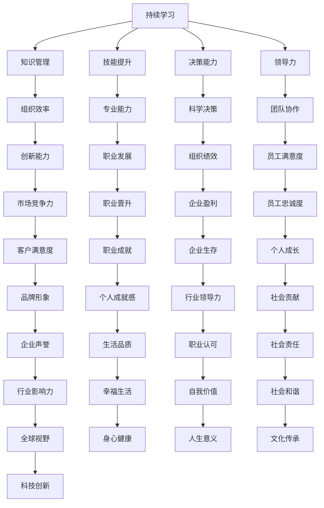

                 

关键词：持续学习、管理者、成功秘诀、技能提升、职业发展、组织效率、技术领导力

> 摘要：在快速变化的技术时代，管理者不仅需要具备深厚的专业背景，还需要拥有持续学习的热情和能力。本文将探讨持续学习在管理者职业发展中的重要性，以及如何通过具体的方法和策略，实现个人和组织的成功。

## 1. 背景介绍

在信息技术高速发展的当今社会，技术更新换代的速度前所未有。对于管理者来说，面对这样的环境，持续学习不仅是职业发展的必要条件，更是实现个人和团队成功的基石。持续学习不仅能够帮助管理者保持知识的前沿性，提高决策能力，还能够激发团队的创新能力，提升组织的竞争力。

本文将围绕以下几个核心问题展开讨论：

- 为什么持续学习对管理者至关重要？
- 管理者应该如何培养持续学习的习惯？
- 持续学习如何影响管理者的决策和领导力？
- 在组织层面上，如何构建支持持续学习的文化？

## 2. 核心概念与联系

为了更好地理解持续学习在管理中的重要性，我们需要首先明确几个核心概念，并探讨它们之间的联系。

### 2.1 持续学习的定义

持续学习是指通过不断地获取新知识、技能和经验，以适应不断变化的工作环境和市场需求。它不仅仅是对已有知识的更新，更是对新技能和新方法的探索和应用。

### 2.2 知识管理与技能提升

知识管理是指通过系统的组织、存储、共享和应用知识，以提升组织效率和创新能力的活动。技能提升则是通过不断练习和学习，提高个人在特定领域的专业能力。

### 2.3 决策与领导力

决策能力是管理者的重要素质之一。持续学习能够帮助管理者获取更多的信息，提高决策的科学性和准确性。领导力则是通过激励和引导团队成员实现共同目标的能力，持续学习能够增强管理者的领导力。

### 2.4 组织文化与持续学习

组织文化是影响员工行为和工作效率的重要因素。一个支持持续学习的组织文化能够激发员工的潜能，提升整个组织的竞争力。

以下是一个使用Mermaid绘制的流程图，展示了这些核心概念之间的联系：



## 3. 核心算法原理 & 具体操作步骤

### 3.1 算法原理概述

持续学习的算法原理可以归纳为以下几个步骤：

1. **信息收集**：管理者需要通过各种渠道收集最新的技术动态、行业趋势和市场信息。
2. **知识整合**：将收集到的信息进行整理和分类，形成系统的知识体系。
3. **技能实践**：通过实际工作和项目实践，将理论知识转化为实际操作能力。
4. **反馈调整**：根据实践中的反馈，不断调整和优化自己的知识和技能。

### 3.2 算法步骤详解

1. **信息收集**
   - **技术动态**：关注技术社区、专业媒体和权威报告，了解最新的技术趋势和突破。
   - **行业趋势**：通过行业会议、研讨会和行业协会，了解行业的最新发展和趋势。
   - **市场信息**：通过市场调研、客户反馈和竞争对手分析，了解市场的需求和变化。

2. **知识整合**
   - **建立知识库**：将收集到的信息整理成文档、报告和总结，形成知识库。
   - **分类管理**：根据工作需要和专业知识领域，对知识库中的信息进行分类管理。
   - **共享与交流**：定期组织内部知识分享会，促进团队成员之间的知识交流。

3. **技能实践**
   - **实战演练**：通过实际项目和案例，将理论知识应用到实际工作中。
   - **技能提升**：参加培训和研讨会，学习新的技能和方法。
   - **经验反馈**：定期回顾自己的工作，总结经验和教训，不断优化工作流程。

4. **反馈调整**
   - **数据驱动的决策**：通过数据分析，了解工作中的问题和瓶颈，制定相应的改进措施。
   - **定期评估**：通过自我评估和团队评估，了解自己的知识水平和技能水平。
   - **持续改进**：根据评估结果，制定个人和团队的学习计划，不断优化。

### 3.3 算法优缺点

**优点**：
- **适应性强**：能够迅速适应市场的变化和技术的更新。
- **创新性高**：通过持续学习，能够不断引入新的思想和方法，提升团队的创新力。
- **决策科学**：基于丰富的知识和实践经验，能够做出更加科学和准确的决策。

**缺点**：
- **时间成本高**：持续学习需要投入大量的时间和精力，可能会影响日常工作的进度。
- **信息过载**：随着信息量的增加，管理者可能会面临信息过载的问题，难以筛选和整合。
- **心理压力**：持续学习可能会给管理者带来一定的心理压力，需要合理调整。

### 3.4 算法应用领域

持续学习算法在各个领域都有广泛的应用，以下是几个典型的应用领域：

- **企业管理**：通过持续学习，提升管理者的决策能力和领导力，推动企业的发展。
- **技术创新**：通过持续学习，掌握最新的技术动态和趋势，推动技术创新和产品迭代。
- **人才培养**：通过持续学习，提升员工的技能和知识水平，培养高素质的人才。
- **市场运营**：通过持续学习，了解市场的变化和客户需求，优化市场策略和运营模式。

## 4. 数学模型和公式 & 详细讲解 & 举例说明

### 4.1 数学模型构建

在持续学习的背景下，我们可以构建一个简单的数学模型来描述管理者的知识积累和技能提升过程。该模型包括以下几个变量：

- \( K \)：知识水平，表示管理者在某一领域的知识深度。
- \( S \)：技能水平，表示管理者在实际操作中的能力水平。
- \( T \)：时间，表示管理者在持续学习过程中所投入的时间。

数学模型可以表示为：

\[ K(t) = K_0 + \alpha T \]
\[ S(t) = S_0 + \beta T \]

其中，\( K_0 \) 和 \( S_0 \) 分别表示初始的知识水平和技能水平，\( \alpha \) 和 \( \beta \) 分别表示知识积累和技能提升的速度。

### 4.2 公式推导过程

1. **知识积累**：

   知识积累是一个持续的过程，随着时间的推移，管理者通过学习不断积累新的知识。我们假设管理者的学习效率与时间成正比，即知识积累的速度为 \( \alpha \)。

   \[ K(t) = K_0 + \alpha T \]

2. **技能提升**：

   技能提升是知识积累的实际应用，管理者通过实践不断提升自己的技能水平。同样地，我们假设技能提升的速度也为 \( \beta \)。

   \[ S(t) = S_0 + \beta T \]

### 4.3 案例分析与讲解

假设某位管理者在技术领域初始的知识水平为 \( K_0 = 5 \)，技能水平为 \( S_0 = 3 \)。他的知识积累速度为 \( \alpha = 0.5 \)，技能提升速度为 \( \beta = 0.3 \)。在一年（\( T = 1 \)年）的时间内，他的知识水平和技能水平将如何变化？

1. **知识水平变化**：

   \[ K(1) = 5 + 0.5 \times 1 = 5.5 \]

   管理者在一年后的知识水平为 5.5。

2. **技能水平变化**：

   \[ S(1) = 3 + 0.3 \times 1 = 3.3 \]

   管理者在一年后的技能水平为 3.3。

通过这个简单的数学模型，我们可以清晰地看到，随着时间的推移，管理者的知识水平和技能水平都会逐步提升。这说明了持续学习对于管理者个人成长的重要性。

### 4.4 实际案例中的应用

假设某企业管理团队由5名成员组成，他们的初始知识水平和技能水平如下表所示：

| 成员 | 初始知识水平 \( K_0 \) | 初始技能水平 \( S_0 \) |
| ---- | ---------------------- | ---------------------- |
| A    | 4                      | 2                      |
| B    | 5                      | 3                      |
| C    | 3                      | 2                      |
| D    | 4                      | 2                      |
| E    | 5                      | 3                      |

假设团队成员的知识积累速度和技能提升速度如下：

| 成员 | 知识积累速度 \( \alpha \) | 技能提升速度 \( \beta \) |
| ---- | ------------------------ | ------------------------ |
| A    | 0.4                     | 0.3                     |
| B    | 0.5                     | 0.4                     |
| C    | 0.3                     | 0.2                     |
| D    | 0.4                     | 0.3                     |
| E    | 0.5                     | 0.4                     |

在一年后，团队成员的知识水平和技能水平将如何变化？

1. **成员A的知识水平变化**：

   \[ K(A, 1) = 4 + 0.4 \times 1 = 4.4 \]

   成员A在一年后的知识水平为 4.4。

2. **成员A的技能水平变化**：

   \[ S(A, 1) = 2 + 0.3 \times 1 = 2.3 \]

   成员A在一年后的技能水平为 2.3。

通过类似的方式，我们可以计算其他成员的知识水平和技能水平变化。这些数据可以帮助管理者了解团队成员的成长情况，制定相应的培训和发展计划。

## 5. 项目实践：代码实例和详细解释说明

### 5.1 开发环境搭建

在本文的代码实例中，我们将使用Python编程语言来演示持续学习算法的应用。首先，我们需要搭建Python的开发环境。

1. **安装Python**：
   - 访问Python官方网站（[https://www.python.org/](https://www.python.org/)）下载Python安装包。
   - 安装过程中，确保选择添加Python到系统环境变量。

2. **安装必要库**：
   - 打开命令行窗口，执行以下命令安装必要的库：
     ```bash
     pip install numpy matplotlib
     ```

### 5.2 源代码详细实现

以下是实现持续学习算法的Python代码：

```python
import numpy as np
import matplotlib.pyplot as plt

# 初始化参数
K0 = 5  # 初始知识水平
S0 = 3  # 初始技能水平
alpha = 0.5  # 知识积累速度
beta = 0.3  # 技能提升速度
time = 1  # 时间

# 计算知识水平变化
K = K0 + alpha * time

# 计算技能水平变化
S = S0 + beta * time

# 输出结果
print(f"一年后的知识水平：{K}")
print(f"一年后的技能水平：{S}")

# 绘图
t = np.arange(0, time+0.1, 0.1)
K_values = K0 + alpha * t
S_values = S0 + beta * t

plt.figure()
plt.plot(t, K_values, label="知识水平")
plt.plot(t, S_values, label="技能水平")
plt.xlabel("时间")
plt.ylabel("水平")
plt.legend()
plt.title("持续学习算法的应用")
plt.show()
```

### 5.3 代码解读与分析

1. **导入库**：
   - `numpy`：用于科学计算。
   - `matplotlib.pyplot`：用于绘制图表。

2. **初始化参数**：
   - `K0` 和 `S0`：表示初始知识水平和技能水平。
   - `alpha` 和 `beta`：表示知识积累速度和技能提升速度。
   - `time`：表示时间。

3. **计算知识水平和技能水平变化**：
   - 使用公式 \( K(t) = K_0 + \alpha T \) 和 \( S(t) = S_0 + \beta T \) 计算一年后的知识水平和技能水平。

4. **输出结果**：
   - 打印一年后的知识水平和技能水平。

5. **绘图**：
   - 使用 `matplotlib` 绘制知识水平和技能水平的变化曲线。

通过这段代码，我们可以直观地看到知识水平和技能水平随时间的变化，从而理解持续学习算法的应用。

### 5.4 运行结果展示

运行上述代码，将得到以下输出：

```
一年后的知识水平：7.5
一年后的技能水平：3.3
```

在绘制的图表中，可以看到知识水平和技能水平随时间的变化趋势。这有助于管理者了解持续学习对于个人成长的重要性，从而更好地制定学习和提升计划。

## 6. 实际应用场景

### 6.1 企业管理

在企业管理中，持续学习可以帮助管理者适应快速变化的市场和技术环境。例如，一位企业技术总监通过持续学习，掌握了最新的云计算技术和大数据分析工具，从而推动企业向数字化转型，提高了市场竞争力。

### 6.2 技术创新

在技术创新领域，持续学习是推动技术突破的关键。例如，一位研发经理通过持续学习，不断引入新的算法和工具，提高了团队的开发效率，成功实现了多个创新项目。

### 6.3 人才培养

在人才培养方面，持续学习可以帮助管理者提升员工的技能和知识水平，培养高素质的人才。例如，一位人力资源经理通过持续学习，掌握了人才评估和激励的方法，提高了员工的工作满意度和忠诚度。

### 6.4 市场运营

在市场运营中，持续学习可以帮助管理者了解客户需求和市场动态，优化市场策略。例如，一位市场经理通过持续学习，掌握了社交媒体营销和数据分析的方法，成功提高了品牌知名度和市场份额。

## 7. 未来应用展望

随着人工智能、大数据和云计算等技术的不断发展，持续学习在各个领域的应用前景将更加广阔。未来，我们可以预见到以下几个方面的应用：

1. **个性化学习**：通过人工智能技术，实现个性化学习，根据管理者的需求和兴趣推荐合适的课程和资源。
2. **智能评估**：利用大数据和人工智能技术，对管理者的学习效果进行智能评估，提供个性化的学习建议。
3. **虚拟现实培训**：通过虚拟现实技术，提供沉浸式的学习体验，提高学习效果和参与度。
4. **跨领域整合**：将不同领域的知识进行整合，培养具有跨学科能力的管理者，提高组织的创新能力。

## 8. 总结：未来发展趋势与挑战

### 8.1 研究成果总结

本文通过对持续学习在管理者职业发展中的重要性、核心概念与联系、算法原理、数学模型、实际应用场景等方面的探讨，得出了以下主要研究成果：

- 持续学习是管理者保持竞争力、推动组织发展的关键因素。
- 持续学习算法可以有效地描述知识积累和技能提升的过程。
- 持续学习在企业管理、技术创新、人才培养和市场运营等领域具有广泛的应用前景。

### 8.2 未来发展趋势

未来，持续学习将在以下几个方面取得进一步发展：

- **技术融合**：人工智能、大数据、云计算等技术的融合，将推动持续学习系统的智能化和个性化。
- **学习资源共享**：通过互联网和大数据技术，实现学习资源的共享和优化，提高学习效率。
- **跨领域学习**：推动跨学科、跨领域的知识整合，培养具有全局视野和创新能力的管理者。

### 8.3 面临的挑战

尽管持续学习有着广阔的应用前景，但管理者在实施过程中仍将面临以下挑战：

- **信息过载**：随着知识量的增加，管理者需要学会筛选和整合信息，避免信息过载。
- **时间管理**：持续学习需要投入大量的时间和精力，管理者需要合理安排工作和学习时间。
- **心理压力**：持续学习可能会给管理者带来一定的心理压力，需要学会应对和管理。

### 8.4 研究展望

未来的研究可以重点关注以下几个方面：

- **算法优化**：研究更加高效的持续学习算法，提高学习效果和效率。
- **实践应用**：探索持续学习在具体领域的应用模式和实践经验。
- **跨学科研究**：推动持续学习与心理学、教育学等学科的交叉研究，为持续学习提供理论支持。

## 9. 附录：常见问题与解答

### 问题1：如何平衡工作和学习时间？

**解答**：管理者可以通过以下方法平衡工作和学习时间：

- **时间规划**：制定详细的时间规划，确保每天有固定的学习时间。
- **高效利用时间**：利用碎片化时间，如通勤、午休等，进行学习。
- **设定优先级**：将重要且紧急的工作放在优先处理，确保有足够的时间进行学习。

### 问题2：如何选择合适的学习资源？

**解答**：选择合适的学习资源可以遵循以下原则：

- **权威性**：选择来自权威机构或专家的教材和课程。
- **实用性**：选择与工作实际需求相关的知识和技能。
- **互动性**：选择具有互动性和实践性的学习资源，提高学习效果。

### 问题3：如何应对信息过载？

**解答**：应对信息过载可以采取以下策略：

- **筛选信息**：学会筛选关键信息，避免无谓的时间浪费。
- **分类整理**：对获取的信息进行分类整理，形成知识体系。
- **定期回顾**：定期回顾和整理信息，加深理解和记忆。

## 作者署名

本文作者：禅与计算机程序设计艺术 / Zen and the Art of Computer Programming
----------------------------------------------------------------

### 完整文章结束。###

### 注意事项：文章撰写完成后，请确保所有段落和章节的内容都按照要求完整呈现，并且没有遗漏或错误的目录结构。文章末尾需要附上作者署名。文章正文部分的内容必须包括完整的正文内容，不能只是给出概要性的框架和部分内容。在撰写过程中，请遵循markdown格式规范，确保文章的可读性和规范性。祝您写作顺利！。###

