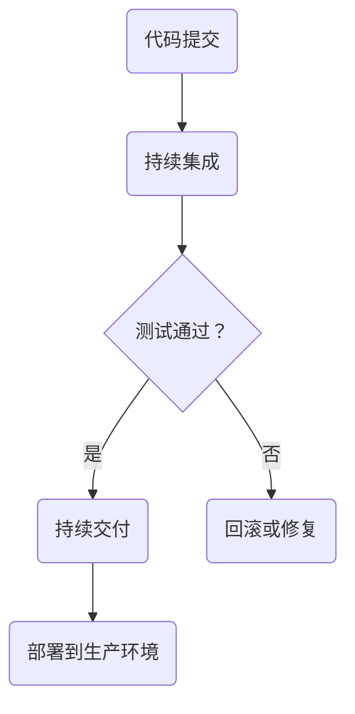

                 

持续部署（Continuous Deployment，简称CD）是现代软件开发中至关重要的一个概念。它不仅仅是一个自动化过程，而是一个完整的体系，旨在减少软件发布过程中的风险和复杂性，提高开发效率和质量。本文将深入探讨持续部署的核心概念、实践方法以及未来趋势。

> **关键词：** 持续部署，自动化发布，CI/CD，DevOps，敏捷开发

> **摘要：** 本文将介绍持续部署的基本概念，如何实现自动化发布流程，以及它在现代软件开发中的作用和重要性。我们将讨论CI/CD流水线、DevOps文化，并提供一系列实际案例和工具推荐，最后展望持续部署的未来发展趋势。

## 1. 背景介绍

在传统的软件开发流程中，发布新版本通常是一个繁琐且高风险的过程。开发人员在完成代码修改后，需要手动构建、测试和部署软件，这个过程往往需要花费大量时间和人力资源。而且，由于各个环节之间的依赖关系复杂，人为操作带来的错误和遗漏在所难免，这导致了发布周期长、质量不稳定等问题。

随着敏捷开发（Agile Development）和DevOps文化的兴起，持续集成（Continuous Integration，CI）和持续部署（Continuous Deployment，CD）逐渐成为现代软件开发的核心理念。持续部署旨在通过自动化流程，确保软件可以在任何时间、任何环境中快速、可靠地发布。

### 什么是持续部署？

持续部署是一种软件开发和发布实践，它通过自动化流程来确保代码的每次变更都能够被快速、安全地部署到生产环境中。持续部署的核心目标是减少发布过程中的手动干预，提高发布频率和可靠性。

### 为什么需要持续部署？

- **缩短发布周期**：自动化流程可以大大缩短从代码提交到部署的过程时间。
- **提高质量**：频繁的测试和反馈可以帮助及早发现问题，降低发布风险。
- **减少成本**：自动化减少了人力成本和因手动操作错误带来的额外成本。
- **增强可靠性**：通过持续部署，可以确保每次发布都是稳定和可预测的。

## 2. 核心概念与联系

### 核心概念

持续部署涉及多个核心概念，包括：

- **持续集成（CI）**：每次代码变更都会自动触发构建和测试，确保代码库的持续完整性。
- **持续交付（CD）**：构建和测试通过后，自动部署到生产环境。
- **自动化测试**：自动化测试用于确保代码质量，减少手动测试的工作量。
- **DevOps**：DevOps是一种文化和实践，旨在打破开发（Dev）和运维（Ops）之间的壁垒，实现更高效的协作。

### Mermaid 流程图

下面是一个简单的Mermaid流程图，展示了持续部署的流程：



## 3. 核心算法原理 & 具体操作步骤

### 3.1 算法原理概述

持续部署的算法原理主要基于以下几个步骤：

1. **代码提交**：开发人员将代码提交到代码仓库。
2. **构建**：构建工具（如Jenkins、GitLab CI等）根据配置文件构建项目。
3. **测试**：执行自动化测试，确保代码质量。
4. **部署**：测试通过后，自动部署到生产环境。

### 3.2 算法步骤详解

1. **代码提交**
    - 开发人员使用Git等版本控制系统提交代码。
    - 提交后，代码仓库会触发持续集成服务。

2. **构建**
    - 持续集成服务读取配置文件，下载依赖、编译代码、构建可执行文件。
    - 构建过程中，可以执行单元测试、集成测试等。

3. **测试**
    - 构建成功后，执行自动化测试，确保代码质量。
    - 测试包括功能测试、性能测试、安全测试等。

4. **部署**
    - 测试通过后，持续集成服务将构建物部署到生产环境。
    - 部署可以通过脚本、容器编排工具（如Docker、Kubernetes）或CI/CD平台完成。

### 3.3 算法优缺点

**优点：**
- **提高效率**：自动化流程减少了人工干预，加快了发布速度。
- **保证质量**：频繁的测试和反馈确保了代码质量。
- **降低风险**：通过自动化，减少了因人为错误导致的问题。

**缺点：**
- **初期投入较大**：需要配置CI/CD流水线、自动化测试等。
- **对团队协作要求高**：DevOps文化的实现需要团队的高度协作。

### 3.4 算法应用领域

持续部署广泛应用于Web应用、移动应用、云服务、物联网等领域。在Web应用中，持续部署可以确保网站或服务的快速迭代和更新；在移动应用中，可以提供及时的新功能和修复；在云服务和物联网领域，持续部署有助于实现高效的资源管理和设备更新。

## 4. 数学模型和公式 & 详细讲解 & 举例说明

### 4.1 数学模型构建

持续部署的数学模型可以基于以下几个指标：

- **发布频率（F）**：每次发布之间的时间间隔。
- **测试覆盖率（C）**：自动化测试覆盖的代码比例。
- **失败率（R）**：测试失败的频率。

### 4.2 公式推导过程

**发布频率（F）**：

$$ F = \frac{1}{T} $$

其中，\( T \) 是每次发布之间的时间间隔。

**测试覆盖率（C）**：

$$ C = \frac{TC}{TC + TF} $$

其中，\( TC \) 是自动化测试覆盖的代码比例，\( TF \) 是手动测试覆盖的代码比例。

**失败率（R）**：

$$ R = \frac{TF}{TC + TF} $$

### 4.3 案例分析与讲解

假设一个Web应用团队，每次发布之间的时间间隔为一周（\( T = 7 \) 天），自动化测试覆盖率 \( TC \) 为 90%，手动测试覆盖率 \( TF \) 为 10%。

- **发布频率（F）**：

$$ F = \frac{1}{7} = 0.143 $$

- **测试覆盖率（C）**：

$$ C = \frac{0.9}{0.9 + 0.1} = 0.9 $$

- **失败率（R）**：

$$ R = \frac{0.1}{0.9 + 0.1} = 0.1 $$

这意味着该团队每周发布一次，测试覆盖率约为 90%，失败率为 10%。

## 5. 项目实践：代码实例和详细解释说明

### 5.1 开发环境搭建

要实现持续部署，首先需要搭建一个合适的开发环境。以下是一个基于Docker的例子：

```Dockerfile
# 基础镜像
FROM node:14-alpine

# 设置工作目录
WORKDIR /app

# 复制项目文件
COPY . .

# 安装依赖
RUN npm install

# 运行应用
CMD ["npm", "start"]
```

### 5.2 源代码详细实现

以下是一个简单的Node.js Web应用示例，包括API接口和自动化测试：

```javascript
// app.js
const express = require('express');
const app = express();

app.get('/hello', (req, res) => {
  res.send('Hello, World!');
});

const port = process.env.PORT || 3000;
app.listen(port, () => {
  console.log(`Server running on port ${port}`);
});
```

```javascript
// test/hello.test.js
const request = require('supertest');
const app = require('../app');

describe('GET /hello', () => {
  it('responds with "Hello, World!"', async () => {
    const response = await request(app).get('/hello');
    expect(response.text).toBe('Hello, World!');
  });
});
```

### 5.3 代码解读与分析

该示例展示了如何使用Express框架创建一个简单的Web应用，并编写一个测试用例。通过Dockerfile，可以将应用打包成镜像，方便在CI/CD流水线中构建和部署。

### 5.4 运行结果展示

使用GitLab CI配置文件，可以自动化构建和部署应用：

```yaml
stages:
  - build
  - test
  - deploy

build:
  stage: build
  script:
    - docker build -t myapp .
  artifacts:
    paths:
      - /myapp

test:
  stage: test
  script:
    - docker run --rm myapp npm test

deploy:
  stage: deploy
  script:
    - docker push myapp
    - docker run --rm -d -p 8080:80 myapp
  only:
    - master
```

该配置文件定义了一个三个阶段的CI/CD流水线，分别用于构建、测试和部署。当代码提交到GitLab的master分支时，会触发整个流程。

## 6. 实际应用场景

### 6.1 云服务

在云服务领域，持续部署可以帮助企业快速响应市场变化，提高服务质量。例如，Amazon Web Services（AWS）和Microsoft Azure都提供了丰富的持续部署工具和平台，帮助用户自动化部署和管理云应用。

### 6.2 物联网（IoT）

物联网设备的更新和维护是一个挑战。通过持续部署，可以自动化设备固件和应用的更新，确保设备始终运行最新版本。例如，智能家居系统可以通过持续部署实现快速迭代，提供更多功能和更好的用户体验。

### 6.3 移动应用

移动应用的开发和发布周期通常较短，持续部署有助于快速响应用户反馈和市场需求。例如，Facebook、Instagram等社交应用通过持续部署，可以每天发布多个新版本，提供更好的用户体验。

## 7. 工具和资源推荐

### 7.1 学习资源推荐

- 《持续交付：发布可靠软件的系统化方法》
- 《DevOps实践指南》
- 《敏捷软件开发：原则、实践与模式》

### 7.2 开发工具推荐

- Jenkins
- GitLab CI/CD
- Docker
- Kubernetes

### 7.3 相关论文推荐

- "Continuous Delivery: Reliable Software Releases through Build, Test, and Deployment Automation"
- "DevOps and Its Impact on Software Engineering"
- "Accelerating the Development of IoT Devices through Continuous Deployment"

## 8. 总结：未来发展趋势与挑战

### 8.1 研究成果总结

持续部署已经成为现代软件开发的核心理念，通过自动化流程提高了开发效率和质量。研究成果表明，持续部署有助于缩短发布周期、提高产品质量和降低风险。

### 8.2 未来发展趋势

- **更多工具和平台的涌现**：随着持续部署的普及，将有更多的工具和平台支持自动化流程。
- **更加智能的CI/CD**：利用人工智能和机器学习技术，可以实现更加智能的持续集成和持续部署。
- **更广泛的应用领域**：持续部署将在更多领域得到应用，如边缘计算、区块链等。

### 8.3 面临的挑战

- **安全性**：自动化流程带来了新的安全挑战，需要确保持续部署过程中的安全性。
- **复杂度**：持续部署流水线的复杂度逐渐增加，需要更好的管理和监控工具。

### 8.4 研究展望

持续部署将在未来继续发挥重要作用，通过自动化和智能化，提高软件开发的效率和质量。研究重点将集中在安全性、复杂度管理和智能CI/CD等方面。

## 9. 附录：常见问题与解答

### Q：持续部署需要哪些工具和平台？

A：常用的持续部署工具和平台包括Jenkins、GitLab CI/CD、Docker、Kubernetes等。这些工具和平台可以帮助自动化构建、测试和部署流程。

### Q：如何确保持续部署的安全性？

A：确保持续部署的安全性需要多个方面的努力，包括：

- **访问控制**：对持续部署流程进行访问控制，确保只有授权用户可以执行关键操作。
- **加密传输**：使用加密传输（如HTTPS）保护数据传输过程中的安全性。
- **监控和日志**：实时监控和记录持续部署过程中的操作和日志，及时发现和解决问题。

### Q：持续部署对团队协作有什么要求？

A：持续部署需要团队具备良好的协作和沟通能力。团队成员需要了解持续部署的概念和流程，协同工作以确保持续部署的成功实施。此外，团队需要培养DevOps文化，促进开发、测试和运维之间的紧密合作。

---

持续部署是现代软件开发的重要实践，通过自动化和智能化，可以提高开发效率、确保软件质量并降低风险。随着技术的不断进步，持续部署将在更多领域得到应用，成为软件开发不可或缺的一部分。希望本文能够帮助您更好地理解持续部署的核心概念和实践方法，为您的软件开发带来新的启示和改进。

## 作者署名

**作者：禅与计算机程序设计艺术 / Zen and the Art of Computer Programming**。

