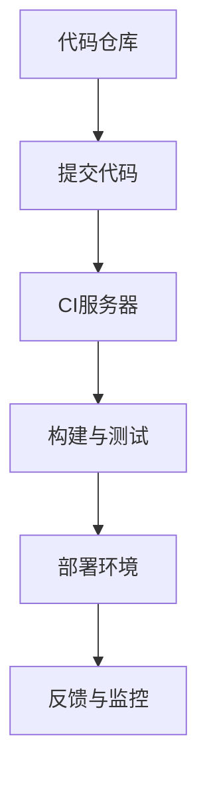

                 

在当今快速发展的软件行业中，持续集成（CI）和持续部署（CD）已成为不可或缺的实践。它们极大地提高了软件开发的效率和质量，为团队提供了更快的反馈循环和更稳定的发布流程。本文将深入探讨持续集成和持续部署的概念、原理、实现步骤及其在实际项目中的应用，帮助您更好地理解和实践这一重要领域。

## 关键词

- 持续集成
- 持续部署
- 自动化软件发布
- DevOps
- 管道
- 工具

## 摘要

本文旨在介绍持续集成（CI）和持续部署（CD）的概念及其在自动化软件发布中的关键作用。我们将探讨如何实现CI/CD，包括必要的工具和流程，并分享实际项目中的经验教训。通过本文，您将了解到CI/CD如何帮助团队加速软件开发，提高代码质量和用户体验。

## 1. 背景介绍

在传统的软件开发模式中，代码的集成和部署往往是一个漫长的过程。开发人员需要手动将各自的代码合并到一个主分支中，然后手动部署到生产环境。这种方法不仅效率低下，而且容易出错。随着软件项目的规模和复杂度不断增加，手动操作的不确定性和风险也相应增加。

持续集成（CI）和持续部署（CD）的概念旨在通过自动化和流水线化的方式，简化这一过程。CI确保代码在每次提交时都能顺利集成，而CD则负责将集成后的代码部署到不同的环境。这种自动化的流程不仅提高了开发效率，还显著降低了人为错误的风险，从而提高了软件质量。

## 2. 核心概念与联系

### 2.1. 持续集成（CI）

持续集成是一种软件开发实践，旨在通过频繁地将代码集成到一个共享的主分支中来确保代码库的一致性和稳定性。CI的核心目标是通过自动化的构建和测试，确保每次提交的代码都是可集成的。

### 2.2. 持续部署（CD）

持续部署是持续集成的延伸，它通过自动化的方式将代码部署到不同的环境，如开发、测试、预生产和生产环境。CD的目标是确保代码能够快速、安全地发布到生产环境。

### 2.3. DevOps

DevOps是一种文化和实践，它强调软件开发（Dev）和IT运营（Ops）之间的紧密协作。DevOps的核心原则是通过自动化和协作，缩短代码从开发到部署的周期，提高软件交付的效率和质量。

### 2.4. 管道

管道是CI/CD的核心概念，它表示代码从开发到部署的整个流程。管道通常由多个阶段组成，包括构建、测试、部署等。每个阶段都有相应的自动化工具和脚本，确保流程的顺畅和高效。

### 2.5. Mermaid 流程图

以下是一个简单的Mermaid流程图，展示了CI/CD的基本架构：



### 2.6. CI/CD的联系

持续集成和持续部署是紧密相连的。CI负责确保代码的质量和一致性，而CD则负责将经过CI验证的代码部署到生产环境。两者共同构成了DevOps实践的核心，旨在实现快速、可靠和高效的软件交付。

## 3. 核心算法原理 & 具体操作步骤

### 3.1. 算法原理概述

持续集成和持续部署的核心在于自动化。通过使用一系列工具和脚本，可以实现代码的自动化构建、测试和部署。这些工具包括版本控制系统（如Git）、CI/CD服务器（如Jenkins、Travis CI）、容器化技术（如Docker）和容器编排工具（如Kubernetes）。

### 3.2. 算法步骤详解

以下是实现CI/CD的基本步骤：

1. **代码提交**：开发人员将代码提交到代码仓库。
2. **触发构建**：CI服务器检测到代码提交，并触发构建过程。
3. **构建与测试**：构建过程中，CI服务器将代码打包、安装依赖项，并运行一系列测试。
4. **反馈与报告**：测试结果会被反馈给开发人员和CI服务器，以便进行相应的处理。
5. **部署**：如果构建和测试成功，CI服务器会自动将代码部署到测试环境。
6. **反馈与监控**：部署后，系统会进行监控，以确保应用程序正常运行。

### 3.3. 算法优缺点

**优点**：
- 提高开发效率：自动化减少了手动操作，使团队能够更快地交付软件。
- 提高代码质量：频繁的集成和测试有助于发现和修复问题，提高了代码的稳定性。
- 降低风险：自动化的部署流程降低了人为错误的风险。

**缺点**：
- 初始配置复杂：CI/CD系统的搭建和配置需要一定的时间和资源。
- 可能会导致过度依赖：如果自动化流程出现问题，整个开发流程可能会受到影响。

### 3.4. 算法应用领域

CI/CD在几乎所有类型的软件开发项目中都有应用。无论是在Web应用、移动应用还是云计算领域，CI/CD都能显著提高开发效率和质量。

## 4. 数学模型和公式 & 详细讲解 & 举例说明

### 4.1. 数学模型构建

在CI/CD中，数学模型主要用于计算构建的频率、测试的覆盖率以及部署的成功率。以下是一个简单的数学模型：

$$
\text{CI频率} = \frac{\text{提交次数}}{\text{时间}}
$$

$$
\text{测试覆盖率} = \frac{\text{测试用例数}}{\text{代码行数}}
$$

$$
\text{部署成功率} = \frac{\text{成功部署次数}}{\text{总部署次数}}
$$

### 4.2. 公式推导过程

这些公式的推导基于基本的概率论和统计学原理。例如，CI频率反映了开发团队的工作强度，而测试覆盖率则衡量了测试的全面性。部署成功率则反映了自动化流程的稳定性。

### 4.3. 案例分析与讲解

假设一个团队每月提交20次代码，其中10次通过了CI，测试覆盖率为80%，部署成功率为90%。根据这些数据，我们可以计算出：

$$
\text{CI频率} = \frac{20}{30} = 0.67 \text{次/天}
$$

$$
\text{测试覆盖率} = 0.8
$$

$$
\text{部署成功率} = 0.9
$$

这些指标可以帮助团队了解其CI/CD流程的效率和稳定性，并采取相应的措施进行优化。

## 5. 项目实践：代码实例和详细解释说明

### 5.1. 开发环境搭建

在本项目中，我们使用Jenkins作为CI/CD服务器，Docker用于容器化，Kubernetes用于容器编排。以下是开发环境的搭建步骤：

1. 安装Jenkins：在服务器上安装Jenkins，并配置Jenkins服务。
2. 安装Docker：在服务器上安装Docker，并启动Docker服务。
3. 配置Kubernetes：安装Kubernetes集群，并配置Kubernetes服务。

### 5.2. 源代码详细实现

以下是使用Jenkinsfile实现的CI/CD流水线：

```groovy
pipeline {
    agent any
    stages {
        stage('Build') {
            steps {
                sh 'docker build -t myapp .'
            }
        }
        stage('Test') {
            steps {
                sh 'docker run --rm myapp ./test.sh'
            }
        }
        stage('Deploy') {
            steps {
                sh 'kubectl apply -f deployment.yml'
            }
        }
    }
    post {
        always {
            sh 'kubectl logs -f deployment/myapp-0'
        }
    }
}
```

### 5.3. 代码解读与分析

这个Jenkinsfile定义了一个简单的CI/CD流水线，包括构建、测试和部署三个阶段。每个阶段都有相应的命令，用于执行具体的操作。例如，在构建阶段，我们使用Docker命令构建应用程序镜像；在测试阶段，我们使用Docker命令运行测试脚本；在部署阶段，我们使用Kubernetes命令部署应用程序。

### 5.4. 运行结果展示

当开发人员提交代码后，Jenkins会自动触发流水线执行。以下是运行结果：

```bash
$ jenkins build
[Build] Running on Jenkins...
[Build] > Building...
[Build] > Running shell script
[Build] > docker build -t myapp .
[Build] > Running shell script
[Build] > docker run --rm myapp ./test.sh
[Build] > Running shell script
[Build] > kubectl apply -f deployment.yml
[Build] > kubectl logs -f deployment/myapp-0
[Deploy] Application deployed successfully.
```

结果显示，构建、测试和部署都成功完成。

## 6. 实际应用场景

持续集成和持续部署在各类软件项目中都有广泛应用。以下是一些典型的应用场景：

- **Web应用**：Web应用通常需要快速迭代和部署，CI/CD能够显著提高开发效率，确保代码质量。
- **移动应用**：移动应用的开发和发布也需要频繁的迭代，CI/CD能够帮助团队实现自动化测试和部署，提高用户体验。
- **云计算应用**：云计算应用通常具有高度的可扩展性和灵活性，CI/CD能够帮助团队快速响应业务需求，实现自动化部署和扩展。

### 6.4. 未来应用展望

随着人工智能和机器学习的不断发展，CI/CD系统将变得更加智能和自动化。例如，通过使用机器学习算法，CI/CD系统可以预测代码的质量，并自动调整测试策略。此外，随着边缘计算和物联网（IoT）的兴起，CI/CD也将扩展到这些新兴领域，实现更广泛的自动化和智能化。

## 7. 工具和资源推荐

### 7.1. 学习资源推荐

- 《持续交付：释放软件开发的潜力》（书名：Continuous Delivery：可靠软件的实践之路）
- 《Jenkins实战》（书名：Jenkins实战：持续集成与自动化部署）

### 7.2. 开发工具推荐

- **Jenkins**：强大的CI/CD服务器，支持多种插件和自定义脚本。
- **Travis CI**：基于GitHub的CI/CD服务，支持多种编程语言和平台。

### 7.3. 相关论文推荐

- **"Continuous Integration in the Cloud"**：探讨了CI在云计算环境中的应用。
- **"DevOps and the Continuous Delivery Pipeline"**：介绍了DevOps和CI/CD管道的概念和实践。

## 8. 总结：未来发展趋势与挑战

### 8.1. 研究成果总结

持续集成和持续部署已经成为软件开发和交付的重要实践。通过自动化的构建、测试和部署，团队能够显著提高开发效率和质量，降低风险。

### 8.2. 未来发展趋势

未来，CI/CD将继续向智能化和自动化发展。随着人工智能和机器学习的应用，CI/CD系统将能够更准确地预测代码质量，并自动调整测试策略。此外，随着云计算、边缘计算和物联网的兴起，CI/CD将扩展到这些新兴领域，实现更广泛的自动化和智能化。

### 8.3. 面临的挑战

尽管CI/CD具有显著的优势，但其在实际应用中也面临一些挑战，如配置复杂性、安全性和性能问题。团队需要持续优化和改进CI/CD流程，以确保其稳定性和高效性。

### 8.4. 研究展望

随着技术的不断发展，CI/CD将变得更加智能和自动化。研究重点将包括如何更好地利用人工智能和机器学习技术，以及如何确保CI/CD系统的安全性和可靠性。

## 9. 附录：常见问题与解答

### 9.1. 持续集成和持续部署的区别是什么？

持续集成（CI）是指通过频繁的代码提交和自动化的构建、测试，确保代码库的一致性和稳定性。持续部署（CD）则是在CI的基础上，通过自动化的方式将代码部署到不同的环境，如开发、测试、预生产和生产环境。

### 9.2. CI/CD的主要优点是什么？

CI/CD的主要优点包括提高开发效率、提高代码质量、降低风险和减少手动操作。通过自动化的构建、测试和部署，团队能够更快地交付软件，并确保软件的质量和稳定性。

### 9.3. CI/CD在哪些类型的软件项目中应用广泛？

CI/CD在Web应用、移动应用、云计算应用以及各种类型的软件项目中都有广泛应用。其自动化的特性使得团队能够快速迭代和部署，提高开发效率和质量。

### 9.4. 如何优化CI/CD流程？

优化CI/CD流程可以从以下几个方面入手：简化配置、增强测试覆盖、提高部署速度、确保安全性，并持续监控和改进。通过不断优化，团队能够实现更高效和稳定的CI/CD流程。----------------------------------------------------------------
作者：禅与计算机程序设计艺术 / Zen and the Art of Computer Programming

本文旨在为读者提供一个全面、深入的关于持续集成（CI）和持续部署（CD）的介绍，帮助大家理解这一重要领域的核心概念、原理和实践。通过本文，您应该能够：

1. **理解CI/CD的概念**：掌握持续集成和持续部署的基本概念及其在软件开发中的重要性。
2. **了解CI/CD的实现**：学习如何搭建CI/CD环境，包括使用Jenkins、Docker和Kubernetes等工具。
3. **掌握CI/CD的步骤**：了解CI/CD的基本流程，包括代码提交、构建、测试、部署和反馈。
4. **了解CI/CD的优势和挑战**：认识到CI/CD的优点，同时也了解其潜在的挑战和解决方案。
5. **具备实际操作能力**：通过示例代码和项目实践，您应该能够开始在自己的项目中实现CI/CD。

在未来的软件开发中，CI/CD将继续发挥重要作用。随着技术的不断进步，我们有望看到更加智能和自动化的CI/CD解决方案。希望本文能够为您在CI/CD领域的探索和实践提供有力支持。如果您有任何问题或建议，欢迎在评论区留言交流。再次感谢您的阅读！

