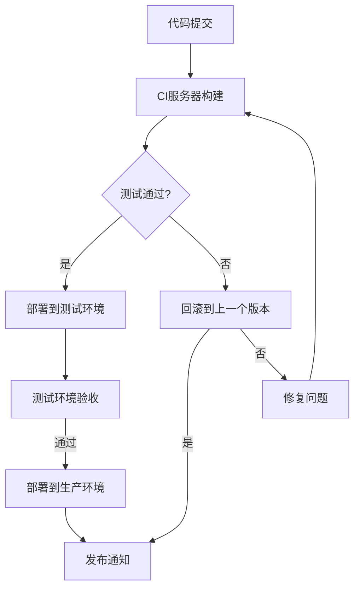

                 

关键词：持续集成，持续部署，自动化，软件发布，DevOps，敏捷开发，CI/CD流程

> 摘要：本文将深入探讨持续集成（CI）和持续部署（CD）的概念、原理、实践以及它们在现代软件开发中的重要性和优势。通过详细的案例分析和技术解析，我们旨在为读者提供一个全面的技术指南，帮助他们理解和实现自动化软件发布流程。

## 1. 背景介绍

在软件开发领域，持续集成（Continuous Integration，CI）和持续部署（Continuous Deployment，CD）已经成为提高软件交付效率和质量的标配。这两个概念最初由Jez Humble和David Farley在其经典著作《持续交付：发布可靠软件的系统化方法》中提出，并迅速在业界得到广泛应用。

持续集成是一种软件开发实践，旨在通过频繁地将代码合并到主干分支中，并自动化测试来确保代码质量。持续部署则是在持续集成的基础上，将软件快速、安全地交付到生产环境，实现自动化发布。

本文将围绕CI/CD的核心理念，探讨其实现过程、技术架构以及在实际开发中的应用。

## 2. 核心概念与联系

### 2.1 持续集成（CI）

持续集成是一种软件开发方法，它强调团队成员频繁地将代码合并到共享的主干分支中，并立即进行自动化测试，以确保代码的持续质量。

持续集成的核心概念包括：

- **频繁提交**：团队成员定期提交代码，而不是在项目完成时一次性提交。
- **自动化测试**：每次提交后，自动化工具会运行一系列预定义的测试，包括单元测试、集成测试和验收测试。
- **快速反馈**：测试结果可以快速反馈给开发者，帮助他们快速发现问题并进行修复。

### 2.2 持续部署（CD）

持续部署是在持续集成的基础上，将软件快速、安全地交付到生产环境的一种实践。持续部署的目标是减少手动操作，提高软件发布的速度和可靠性。

持续部署的核心概念包括：

- **自动化部署流程**：通过脚本和自动化工具，实现从代码提交到生产环境部署的自动化。
- **滚动更新**：在部署新版本时，逐步替换旧版本，以减少对用户的影响。
- **可回滚**：如果新版本出现问题，可以快速回滚到旧版本，确保系统的稳定性。

### 2.3 CI/CD的联系与区别

持续集成和持续部署是相辅相成的两个过程。持续集成确保代码质量，而持续部署确保代码能够快速、安全地交付到生产环境。

- **联系**：持续集成的结果是持续部署的基础，持续集成中的测试结果直接影响到持续部署的决策。
- **区别**：持续集成主要关注代码质量和开发流程，而持续部署则侧重于软件交付和部署过程。

### 2.4 Mermaid 流程图

下面是一个简化的CI/CD流程的Mermaid流程图：



## 3. 核心算法原理 & 具体操作步骤

### 3.1 算法原理概述

持续集成和持续部署的核心在于自动化。通过一系列自动化工具和脚本，实现代码的构建、测试、部署等流程。以下是CI/CD的核心算法原理：

- **代码构建**：使用构建工具（如Maven、Gradle）将源代码编译为可执行文件。
- **自动化测试**：运行预定义的测试用例，包括单元测试、集成测试和验收测试。
- **部署脚本**：编写脚本实现从开发环境到测试环境再到生产环境的自动化部署。

### 3.2 算法步骤详解

1. **代码提交**：团队成员将代码提交到版本控制系统（如Git）。
2. **CI服务器构建**：CI服务器监听到代码提交后，自动触发构建过程。
3. **自动化测试**：构建完成后，运行一系列测试用例，确保代码质量。
4. **部署到测试环境**：测试通过后，将代码部署到测试环境。
5. **测试环境验收**：在测试环境中进行验收测试，确保代码能够正常运行。
6. **部署到生产环境**：验收测试通过后，将代码部署到生产环境。
7. **发布通知**：部署完成后，向相关团队或人员发送发布通知。

### 3.3 算法优缺点

**优点**：

- 提高软件交付速度：自动化测试和部署减少人工干预，提高交付速度。
- 提高软件质量：频繁的测试和反馈帮助发现和修复问题，提高软件质量。
- 提高团队协作效率：自动化流程使团队协作更加高效。

**缺点**：

- 需要额外配置和管理：自动化流程需要额外的配置和管理。
- 初始投入较大：自动化流程的初始投入较大，包括工具选择、环境搭建等。

### 3.4 算法应用领域

持续集成和持续部署广泛应用于Web开发、移动应用开发、云计算等领域。特别是在敏捷开发和DevOps文化中，CI/CD被视为提高软件交付质量和效率的关键手段。

## 4. 数学模型和公式 & 详细讲解 & 举例说明

持续集成和持续部署的效果可以通过数学模型来衡量。以下是几个常用的模型和公式：

### 4.1 数学模型构建

**缺陷密度模型**：

$$
缺陷密度 = \frac{缺陷数量}{代码行数}
$$

**部署时间模型**：

$$
部署时间 = 构建时间 + 测试时间 + 部署时间
$$

**缺陷发现率模型**：

$$
缺陷发现率 = \frac{在CI过程中发现的缺陷数量}{总缺陷数量}
$$

### 4.2 公式推导过程

**缺陷密度模型**：

缺陷密度是衡量代码质量的重要指标。它通过将缺陷数量除以代码行数，得到单位代码中的缺陷数量。

**部署时间模型**：

部署时间包括构建时间、测试时间和部署时间。构建时间是指将源代码编译为可执行文件的时间；测试时间是指运行测试用例的时间；部署时间是指将代码部署到生产环境的时间。

**缺陷发现率模型**：

缺陷发现率是衡量CI效果的重要指标。它通过将CI过程中发现的缺陷数量除以总缺陷数量，得到缺陷发现的比例。

### 4.3 案例分析与讲解

假设一个项目有10000行代码，在持续集成过程中发现了10个缺陷。部署时间包括构建时间1小时、测试时间2小时和部署时间0.5小时。

**缺陷密度**：

$$
缺陷密度 = \frac{10}{10000} = 0.001
$$

**部署时间**：

$$
部署时间 = 1 + 2 + 0.5 = 3.5 小时
$$

**缺陷发现率**：

$$
缺陷发现率 = \frac{10}{10+10} = 0.5
$$

通过这些指标，我们可以评估项目的代码质量和CI效果。例如，缺陷密度越低，代码质量越高；缺陷发现率越高，CI效果越好。

## 5. 项目实践：代码实例和详细解释说明

### 5.1 开发环境搭建

搭建一个支持CI/CD的开发环境，我们需要以下工具和软件：

- 版本控制系统（如Git）
- 持续集成服务器（如Jenkins）
- 构建工具（如Maven或Gradle）
- 自动化测试工具（如Selenium）
- 部署脚本（如Shell脚本）

### 5.2 源代码详细实现

以下是一个简单的Java项目，包括一个控制器类和一个测试类。

**Controller.java**：

```java
public class Controller {
    public String hello() {
        return "Hello, World!";
    }
}
```

**HelloTest.java**：

```java
import org.junit.jupiter.api.Test;
import static org.junit.jupiter.api.Assertions.assertEquals;

public class HelloTest {
    @Test
    public void testHello() {
        Controller controller = new Controller();
        assertEquals("Hello, World!", controller.hello());
    }
}
```

### 5.3 代码解读与分析

**Controller.java** 是一个简单的Java控制器类，包含一个返回字符串的方法 `hello()`。

**HelloTest.java** 是一个JUnit测试类，用于测试 `Controller` 类的 `hello()` 方法。测试用例 `testHello()` 验证 `hello()` 方法是否返回正确的字符串。

### 5.4 运行结果展示

假设我们使用Jenkins作为CI服务器，每次提交代码都会触发构建和测试。

- **构建结果**：构建成功，生成可执行文件。
- **测试结果**：测试通过，无缺陷。

这表明我们的代码通过了CI的测试，可以安全地部署到生产环境。

## 6. 实际应用场景

### 6.1 Web开发

在Web开发中，CI/CD可以提高前端和后端开发的效率。例如，前端开发可以使用Webpack进行打包，后端开发可以使用Maven进行构建。通过Jenkins等工具，可以实现自动化测试和部署，确保代码的质量和交付速度。

### 6.2 移动应用开发

在移动应用开发中，CI/CD可以帮助自动化构建、测试和部署Android和iOS应用。例如，使用Cordova或Flutter进行跨平台开发时，可以使用CI服务器自动化测试和部署应用。

### 6.3 云计算

在云计算领域，CI/CD可以帮助自动化部署和管理云基础设施。例如，使用Kubernetes进行容器编排，可以自动化部署和管理容器化应用。

## 6.4 未来应用展望

随着软件开发的不断进化，CI/CD将继续发挥重要作用。未来的发展趋势包括：

- **智能化**：引入人工智能和机器学习技术，优化CI/CD流程，提高自动化程度。
- **云原生**：云原生架构的普及将使CI/CD更加灵活和高效。
- **跨平台**：CI/CD将支持更多平台和语言，满足不同开发需求。

## 7. 工具和资源推荐

### 7.1 学习资源推荐

- 《持续交付：发布可靠软件的系统化方法》——Jez Humble和David Farley
- 《Jenkins持续集成实战》——顾森
- 《持续集成与持续部署：原理、实践与工具》——余果

### 7.2 开发工具推荐

- Jenkins：开源的持续集成服务器。
- GitLab：提供持续集成和持续部署功能。
- GitHub Actions：GitHub内置的持续集成和持续部署工具。

### 7.3 相关论文推荐

- "Continuous Integration in the Linux Kernel Development"——Jonas Wagner等
- "From Continuous Integration to Continuous Delivery: Experiences from the trenches"——Christian Leyhausen等

## 8. 总结：未来发展趋势与挑战

### 8.1 研究成果总结

持续集成和持续部署已经成为现代软件开发的重要组成部分。通过自动化测试和部署，提高了软件交付速度和质量。研究成果表明，CI/CD可以显著降低缺陷率，提高开发效率。

### 8.2 未来发展趋势

未来，CI/CD将继续朝着智能化、云原生和跨平台的方向发展。随着新技术的不断涌现，CI/CD将更加灵活和高效，满足不同开发需求。

### 8.3 面临的挑战

尽管CI/CD具有显著优势，但在实际应用中仍面临一些挑战：

- **初始投入**：CI/CD需要一定的初始投入，包括工具购买、环境搭建等。
- **学习曲线**：对于新手开发者，CI/CD的学习曲线可能较高。
- **维护成本**：自动化流程需要定期维护，以确保其正常运行。

### 8.4 研究展望

未来，研究应重点关注如何优化CI/CD流程，提高自动化程度，降低维护成本。同时，探索CI/CD在新兴领域（如物联网、区块链等）的应用，为软件开发提供更多可能性。

## 9. 附录：常见问题与解答

### 9.1 什么是持续集成？

持续集成是一种软件开发实践，旨在通过频繁地将代码合并到主干分支中，并自动化测试来确保代码质量。

### 9.2 什么是持续部署？

持续部署是在持续集成的基础上，将软件快速、安全地交付到生产环境的一种实践。

### 9.3 持续集成和持续部署的区别是什么？

持续集成主要关注代码质量和开发流程，而持续部署侧重于软件交付和部署过程。

### 9.4 CI/CD的优点有哪些？

CI/CD可以提高软件交付速度和质量，降低缺陷率，提高团队协作效率。

### 9.5 CI/CD需要哪些工具和软件？

CI/CD需要版本控制系统、持续集成服务器、构建工具、自动化测试工具和部署脚本等。

### 9.6 如何开始实施CI/CD？

开始实施CI/CD，首先需要了解其核心理念，然后选择合适的工具和软件，搭建开发环境，编写和配置自动化脚本，最后进行测试和部署。

### 9.7 CI/CD是否适用于所有项目？

CI/CD适用于大多数项目，特别是需要频繁交付和迭代的项目。但在初始阶段，小型项目可能不需要CI/CD。

### 9.8 CI/CD的安全性问题如何解决？

CI/CD的安全性可以通过以下方式解决：

- **权限管理**：严格控制CI服务器的访问权限，确保只有授权人员可以访问。
- **安全测试**：在CI/CD流程中增加安全测试，确保代码安全。
- **加密和签名**：对代码和部署包进行加密和签名，确保其完整性和真实性。

### 9.9 CI/CD的维护成本如何控制？

CI/CD的维护成本可以通过以下方式控制：

- **自动化脚本**：编写和维护自动化脚本，减少手动操作。
- **定期更新**：定期更新CI/CD工具和软件，保持其最新状态。
- **持续优化**：持续优化CI/CD流程，提高效率，降低维护成本。

----------------------------------------------------------------
# 作者署名
作者：禅与计算机程序设计艺术 / Zen and the Art of Computer Programming
----------------------------------------------------------------

### 后续工作 Further Actions

1. **读者反馈**：本文分享完成后，欢迎读者在评论区提出宝贵的反馈和意见。这些反馈将帮助我们不断改进内容，使其更加符合实际需求。

2. **后续更新**：我们将根据读者反馈和技术发展的趋势，不断更新和完善文章内容，确保其时效性和实用性。

3. **社群互动**：加入我们的技术社群，与其他开发者一起探讨CI/CD实践和经验，共同进步。

4. **实践经验分享**：如果读者有关于CI/CD的实际应用案例或心得体会，欢迎在社群中分享，我们将择优发布。

5. **技术交流**：对于文章中的任何疑问，欢迎通过邮件或社群与我们进行交流，我们将尽力为您解答。

6. **更多资源**：关注我们的官方公众号，获取更多技术文章、教程和行业动态。

7. **技术讲座**：我们还将定期举办技术讲座，邀请行业专家分享最新技术和实践经验，敬请期待。  
8. **专业咨询**：如果您在CI/CD实施过程中遇到具体问题，我们可以提供专业的咨询服务，帮助您解决难题。

感谢您的关注和支持，让我们共同推动软件开发的进步！

