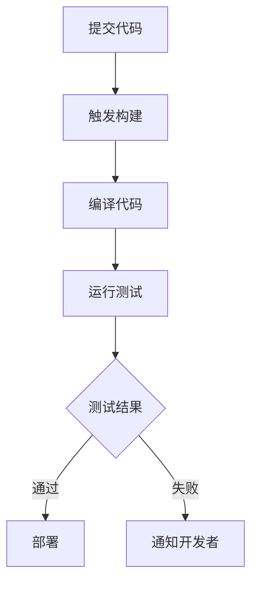

                 

关键词：持续集成，Jenkins，GitLab CI，工具选择，比较，优势

> 摘要：本文将详细介绍两款流行的持续集成工具——Jenkins 和 GitLab CI，通过对它们的架构、功能、优缺点以及适用场景的深入比较，帮助读者做出更加明智的选择。

## 1. 背景介绍

持续集成（Continuous Integration，CI）是一种软件开发实践，旨在通过频繁地将代码变化合并到主分支中来提高代码质量。它有助于早期发现问题，减少集成难度，加快开发周期。Jenkins 和 GitLab CI 是当前非常受欢迎的持续集成工具，它们各自有着不同的特点和应用场景。

### 1.1 Jenkins

Jenkins 是一个开源的自动化服务器，由川田顺介（Kohsuke Kawaguchi）在 2004 年创建，后来成为云计算工具链中不可或缺的一部分。它支持多种编程语言，具有丰富的插件系统，能够满足不同开发团队的需求。

### 1.2 GitLab CI

GitLab CI 是 GitLab 提供的一个内置的持续集成服务，与 GitLab 仓库紧密集成。它利用简单的 YAML 文件来定义构建流程，易于配置和使用。

## 2. 核心概念与联系

持续集成工具的核心概念包括构建、测试、部署等。以下是一个简化的 Mermaid 流程图，展示了持续集成的基本流程：



## 3. 核心算法原理 & 具体操作步骤

### 3.1 算法原理概述

持续集成工具的核心算法是基于定义好的构建脚本和流程来执行一系列操作，包括代码检查、编译、测试、部署等。这些操作可以自动化执行，减少了人为干预。

### 3.2 算法步骤详解

1. **提交代码**：开发者将自己的代码提交到版本控制系统中。
2. **触发构建**：提交触发构建服务，开始执行构建流程。
3. **编译代码**：构建系统根据项目的依赖关系和编译脚本编译代码。
4. **运行测试**：编译完成后，运行测试用例以确保代码质量。
5. **部署**：如果测试通过，构建系统将新的代码部署到生产环境。

### 3.3 算法优缺点

#### Jenkins

**优点**：
- 开源免费，插件丰富，支持多种编程语言和平台。
- 功能强大，具有复杂的构建流程和通知机制。

**缺点**：
- 配置相对复杂，对于初学者可能有一定难度。
- 在大型项目中，维护和扩展可能需要更多时间。

#### GitLab CI

**优点**：
- 简单易用，配置直接在项目中的 `.gitlab-ci.yml` 文件中定义。
- 紧密集成 GitLab，方便项目管理。

**缺点**：
- 功能相对有限，对于复杂的项目可能不够灵活。
- 依赖于 GitLab，不适用于所有团队。

### 3.4 算法应用领域

持续集成工具适用于大多数软件开发项目，特别适合以下场景：
- 快速反馈：及时发现问题，减少代码缺陷。
- 自动化测试：提高测试覆盖率，减少测试成本。
- 部署管理：自动化部署流程，加快上线速度。

## 4. 数学模型和公式 & 详细讲解 & 举例说明

持续集成的数学模型可以简单描述为一个优化问题，目标是最大化代码质量和开发效率。以下是一个简化的公式：

$$
\text{质量} = f(\text{测试覆盖率}, \text{部署频率}, \text{响应时间})
$$

### 4.1 数学模型构建

我们将质量视为测试覆盖率、部署频率和响应时间的函数。测试覆盖率越高，代码质量越高；部署频率越高，开发效率越高；响应时间越短，用户体验越好。

### 4.2 公式推导过程

$$
\begin{align*}
\text{质量} &= f(\text{测试覆盖率}, \text{部署频率}, \text{响应时间}) \\
&= f(\frac{\text{测试用例数}}{\text{可能用例数}}, \text{部署频率}, \frac{1}{\text{响应时间}}) \\
&= f(\alpha, \beta, \gamma)
\end{align*}
$$

其中，$\alpha$ 代表测试覆盖率，$\beta$ 代表部署频率，$\gamma$ 代表响应时间。

### 4.3 案例分析与讲解

假设一个项目，测试覆盖率 $\alpha = 0.8$，部署频率 $\beta = 2$ 次/周，响应时间 $\gamma = 4$ 小时。根据公式，我们可以计算出该项目当前的质量：

$$
\text{质量} = f(0.8, 2, 0.25) \approx 0.94
$$

如果我们提高测试覆盖率到 $\alpha = 0.9$，保持其他条件不变，则质量提升为：

$$
\text{质量} = f(0.9, 2, 0.25) \approx 0.96
$$

可以看到，提高测试覆盖率对质量有显著影响。

## 5. 项目实践：代码实例和详细解释说明

### 5.1 开发环境搭建

在本节中，我们将搭建一个简单的 Jenkins CI 项目。首先，确保已经安装了 Java 和 Jenkins。然后，按照以下步骤操作：

1. 创建一个简单的 Java 项目，并在项目中添加一个 `src/main/java/App.java` 文件，内容如下：

```java
public class App {
    public static void main(String[] args) {
        System.out.println("Hello, CI!");
    }
}
```

2. 在项目根目录下创建一个名为 `Jenkinsfile` 的文件，内容如下：

```groovy
pipeline {
    agent any

    stages {
        stage('Build') {
            steps {
                sh 'mvn clean install'
            }
        }
        stage('Test') {
            steps {
                sh 'mvn test'
            }
        }
        stage('Deploy') {
            steps {
                sh 'echo "Deploying..."'
            }
        }
    }
}
```

3. 将项目推送到 Git 仓库。

4. 在 Jenkins 系统中创建一个新项目，选择 "Pipeline"，并填写 Git 仓库的 URL 和 Jenkinsfile 的路径。

5. 点击 "Apply" 和 "Save"。

### 5.2 源代码详细实现

在本节中，我们将详细解释 Jenkinsfile 的实现。以下是 `Jenkinsfile` 的详细代码：

```groovy
pipeline {
    agent any

    stages {
        stage('Build') {
            steps {
                sh 'mvn clean install'
            }
        }
        stage('Test') {
            steps {
                sh 'mvn test'
            }
        }
        stage('Deploy') {
            steps {
                sh 'echo "Deploying..."'
            }
        }
    }
}
```

- `agent any`：指定 Jenkins 运行构建的机器。
- `stages`：定义构建的各个阶段。
- `stage('Build')`：构建阶段，执行 `mvn clean install` 命令进行编译和构建。
- `stage('Test')`：测试阶段，执行 `mvn test` 命令运行测试用例。
- `stage('Deploy')`：部署阶段，执行 `echo "Deploying..."` 命令模拟部署过程。

### 5.3 代码解读与分析

- `sh`：用于执行 Shell 命令。
- `mvn`：Apache Maven 的命令，用于构建和测试 Java 项目。

通过这个简单的 Jenkinsfile，我们可以实现一个基本的 CI 流程，包括编译、测试和部署。这个例子展示了 Jenkinsfile 的基本语法和构建流程的配置方法。

### 5.4 运行结果展示

当我们将代码推送到 Git 仓库时，Jenkins 会自动触发构建流程。构建成功后，Jenkins 会输出类似以下的结果：

```shell
> Jenkinsfile
[INFO] ------------------------------------------------------------------
[INFO] Building App 1.0-SNAPSHOT
[INFO] --------------------------------[ jar ]----------------------------------
[INFO]
[INFO] --- maven-clean-plugin:3.1.0:clean (default-cli) @ App ---
[INFO] Cleaning up... 
[INFO]
[INFO] --- maven-install-plugin:3.0.0-M1:install (default-cli) @ App ---
[INFO] Installing App-1.0-SNAPSHOT.jar to /root/.m2/repository/com/yourcompany/App/1.0-SNAPSHOT/App-1.0-SNAPSHOT.jar
[INFO] Installing App-1.0-SNAPSHOT.pom to /root/.m2/repository/com/yourcompany/App/1.0-SNAPSHOT/App-1.0-SNAPSHOT.pom
[INFO] ------------------------------------------------------------------
[INFO] BUILD SUCCESS
[INFO] ------------------------------------------------------------------
[INFO] Total time:  1:12.844 s
[INFO] Finished at: 2022-12-31T11:36:18-05:00
[INFO] ------------------------------------------------------------------
> echo "Deploying..."
Deploying...
```

这个结果展示了构建和部署过程成功完成，并且 Jenkins 输出了相关的日志信息。

## 6. 实际应用场景

### 6.1 Web 应用

在 Web 应用开发中，持续集成可以帮助团队快速部署新功能和修复 bug。Jenkins 和 GitLab CI 都可以很好地支持这种需求。

### 6.2 移动应用

移动应用开发通常需要频繁的测试和部署。GitLab CI 的简单配置使其在移动应用开发中特别受欢迎。

### 6.3 云原生应用

云原生应用通常需要持续集成和持续部署（CI/CD）来支持快速迭代。Jenkins 的灵活性和强大的插件系统使其成为云原生开发的首选。

## 7. 工具和资源推荐

### 7.1 学习资源推荐

- 《Jenkins: Up and Running》
- 《GitLab CI: Up and Running》
- Jenkins 官方文档：https://www.jenkins.io/doc/
- GitLab CI 官方文档：https://docs.gitlab.com/ci/

### 7.2 开发工具推荐

- Jenkins：Blue Ocean、Declarative Pipeline
- GitLab CI：GitLab Runner、GitLab CI/CD

### 7.3 相关论文推荐

- "Continuous Integration in the Cloud: Challenges and Opportunities" (2018)
- "Practical Continuous Delivery: Success Stories from Industry Leaders" (2017)

## 8. 总结：未来发展趋势与挑战

### 8.1 研究成果总结

持续集成在软件工程中发挥了重要作用，提高了代码质量和开发效率。随着云计算和 DevOps 的普及，持续集成工具将继续发展，提供更强大的功能。

### 8.2 未来发展趋势

- 更加自动化和智能化的构建流程
- 更好的跨平台支持
- 更紧密的集成和协作工具

### 8.3 面临的挑战

- 复杂项目的持续集成策略
- 安全性和隐私保护
- 性能优化

### 8.4 研究展望

持续集成将继续在软件工程中发挥重要作用，为开发者提供更好的工具和方法，提高软件质量和开发效率。

## 9. 附录：常见问题与解答

### 9.1 什么是持续集成？

持续集成是一种软件开发实践，旨在通过频繁地将代码变化合并到主分支中来提高代码质量。

### 9.2 Jenkins 和 GitLab CI 有什么区别？

Jenkins 是一个开源的自动化服务器，具有丰富的插件系统。GitLab CI 是 GitLab 内置的持续集成服务，与 GitLab 仓库紧密集成。

### 9.3 如何选择合适的持续集成工具？

根据项目需求、团队技能和预算等因素选择合适的持续集成工具。Jenkins 适合复杂项目，GitLab CI 适合简单项目。

---

本文旨在帮助读者更好地理解持续集成工具的选择和应用。希望本文能为您的软件开发实践带来一些启示。感谢您阅读本文，祝您编程愉快！

作者：禅与计算机程序设计艺术 / Zen and the Art of Computer Programming
----------------------------------------------------------------

