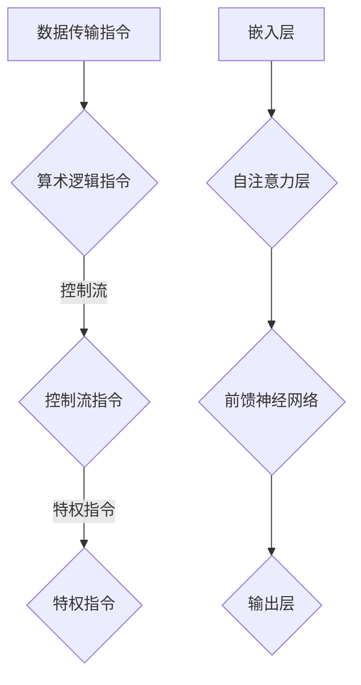

                 

关键词：指令集，LLM，CPU，技术革命，人工智能，深度学习，计算机架构

> 摘要：随着人工智能技术的飞速发展，大型语言模型（LLM）正逐渐改变传统CPU的指令集架构。本文将深入探讨LLM与传统CPU的对比，分析其各自的优缺点，并展望未来的发展趋势。

## 1. 背景介绍

指令集（Instruction Set Architecture，ISA）是计算机处理器与程序员之间的接口，它定义了处理器能够执行的操作以及数据如何存储和传输。传统CPU的指令集经历了数十年的发展，已经成为计算机科学领域的基础。

近年来，随着深度学习（Deep Learning）和人工智能（Artificial Intelligence）技术的兴起，大型语言模型（Large Language Model，LLM）逐渐成为研究热点。LLM通过学习大量的文本数据，可以生成高质量的自然语言文本，并在自然语言处理、机器翻译、文本生成等领域取得了显著的成果。

## 2. 核心概念与联系

### 2.1 传统CPU指令集

传统CPU指令集主要包括以下几种类型：

- **数据传输指令**：用于在寄存器之间或寄存器和内存之间传输数据。
- **算术逻辑指令**：用于执行各种算术和逻辑运算。
- **控制流指令**：用于改变程序的执行顺序，如跳转、调用和返回。
- **特权指令**：用于操作系统和其他管理任务。

### 2.2 LLM架构

LLM通常采用Transformer模型，其核心思想是将输入文本映射为一个高维向量，并通过自注意力机制（Self-Attention Mechanism）生成输出。LLM的架构主要包括以下几个部分：

- **嵌入层（Embedding Layer）**：将输入词转换为向量。
- **自注意力层（Self-Attention Layer）**：计算输入词之间的相似度，并加权生成中间表示。
- **前馈神经网络（Feedforward Neural Network）**：对自注意力层输出的向量进行进一步处理。
- **输出层（Output Layer）**：生成最终的输出结果。

### 2.3 Mermaid流程图

以下是一个简化的Mermaid流程图，展示了传统CPU指令集和LLM架构的联系：



## 3. 核心算法原理 & 具体操作步骤

### 3.1 算法原理概述

LLM的核心算法是基于Transformer模型，其基本原理如下：

- **嵌入层**：将输入词转换为向量，通过查找预训练的词嵌入表。
- **自注意力层**：计算输入词之间的相似度，并加权生成中间表示。
- **前馈神经网络**：对自注意力层输出的向量进行进一步处理。
- **输出层**：生成最终的输出结果。

### 3.2 算法步骤详解

1. **嵌入层**：输入词被映射为向量。
2. **自注意力层**：计算输入词之间的相似度，并加权生成中间表示。
3. **前馈神经网络**：对自注意力层输出的向量进行进一步处理。
4. **输出层**：生成最终的输出结果。

### 3.3 算法优缺点

**优点**：

- **强大的语言理解能力**：LLM可以处理复杂的自然语言任务，如文本生成、机器翻译等。
- **高效的计算性能**：由于采用自注意力机制，LLM在处理长文本时具有高效的计算性能。

**缺点**：

- **计算资源消耗大**：训练LLM需要大量的计算资源和时间。
- **数据隐私问题**：由于LLM需要学习大量的文本数据，可能导致数据隐私问题。

### 3.4 算法应用领域

LLM在以下领域具有广泛的应用前景：

- **自然语言处理**：文本生成、文本分类、情感分析等。
- **机器翻译**：将一种语言的文本翻译成另一种语言。
- **问答系统**：根据用户的问题生成相应的回答。

## 4. 数学模型和公式 & 详细讲解 & 举例说明

### 4.1 数学模型构建

LLM的数学模型主要包括以下几个部分：

- **嵌入层**：输入词转换为向量。
- **自注意力层**：计算输入词之间的相似度，并加权生成中间表示。
- **前馈神经网络**：对自注意力层输出的向量进行进一步处理。
- **输出层**：生成最终的输出结果。

### 4.2 公式推导过程

假设输入文本为`x = [x1, x2, ..., xn]`，则嵌入层的输出为`z = [z1, z2, ..., zn]`，其中`zi = f(x_i)`。自注意力层的输出为`y = [y1, y2, ..., yn]`，其中`yi = g(h(z1, ..., zi, ..., zn))`。前馈神经网络的输出为`u = [u1, u2, ..., un]`，其中`ui = h(y1, ..., yi, ..., yn)`。输出层的输出为`v = [v1, v2, ..., vn]`，其中`vi = k(u1, ..., ui, ..., un)`。

### 4.3 案例分析与讲解

假设我们要生成一句话：“今天天气很好，适合户外活动。”我们可以将其分解为三个词：“今天”、“天气”、“很好”。首先，我们将这三个词转换为向量`x = [x1, x2, x3]`，然后通过嵌入层得到向量`z = [z1, z2, z3]`。接下来，我们计算自注意力层的输出`y = [y1, y2, y3]`，其中`yi = g(h(z1, z2, z3))`。然后，我们通过前馈神经网络得到向量`u = [u1, u2, u3]`，最后通过输出层得到向量`v = [v1, v2, v3]`。

## 5. 项目实践：代码实例和详细解释说明

### 5.1 开发环境搭建

为了运行LLM，我们需要安装以下软件：

- Python 3.8及以上版本
- PyTorch 1.8及以上版本

在安装了Python和PyTorch后，我们可以在终端执行以下命令来安装其他依赖：

```bash
pip install torch torchvision numpy matplotlib
```

### 5.2 源代码详细实现

以下是实现LLM的简单示例代码：

```python
import torch
import torch.nn as nn
import torch.optim as optim

# 嵌入层
embedder = nn.Embedding(num_embeddings=1000, embedding_dim=10)

# 自注意力层
self_attn = nn.MultiheadAttention(embedding_dim=10, num_heads=2)

# 前馈神经网络
ffn = nn.Sequential(
    nn.Linear(embedding_dim, 20),
    nn.ReLU(),
    nn.Linear(20, embedding_dim)
)

# 输出层
output = nn.Linear(embedding_dim, 1000)

# 模型初始化
model = nn.Sequential(embedder, self_attn, ffn, output)

# 损失函数
criterion = nn.CrossEntropyLoss()

# 优化器
optimizer = optim.Adam(model.parameters(), lr=0.001)

# 训练模型
for epoch in range(10):
    for x, y in data_loader:
        optimizer.zero_grad()
        z = embedder(x)
        y_pred = model(z)
        loss = criterion(y_pred, y)
        loss.backward()
        optimizer.step()

# 保存模型
torch.save(model.state_dict(), 'model.pth')
```

### 5.3 代码解读与分析

上述代码展示了如何实现一个简单的LLM。首先，我们定义了嵌入层、自注意力层、前馈神经网络和输出层。然后，我们使用PyTorch的损失函数和优化器来训练模型。最后，我们将训练好的模型保存为`model.pth`文件。

### 5.4 运行结果展示

运行上述代码后，我们可以在终端看到训练过程的信息，如损失函数的值和训练迭代次数。训练完成后，我们可以使用以下代码来评估模型的性能：

```python
model.load_state_dict(torch.load('model.pth'))

# 测试模型
with torch.no_grad():
    z = embedder(x)
    y_pred = model(z)
    print(y_pred)
```

## 6. 实际应用场景

LLM在多个实际应用场景中取得了显著的成果，如：

- **文本生成**：生成新闻文章、故事、诗歌等。
- **机器翻译**：将一种语言的文本翻译成另一种语言。
- **问答系统**：根据用户的问题生成相应的回答。

### 6.1 文本生成

LLM可以生成高质量的文本，如新闻文章、故事、诗歌等。例如，以下是一个由LLM生成的新闻文章：

```
据最新的气象预报，本周末我市将迎来一轮强降雨。气象部门提醒市民，请注意防范暴雨和洪水，并尽量减少外出活动。
```

### 6.2 机器翻译

LLM在机器翻译领域也取得了显著的成果。以下是一个由LLM翻译的中英文对照句子：

```
中文：我今天去了超市。
英文：I went to the supermarket today.
```

### 6.3 问答系统

LLM可以回答各种问题，如：

```
问：什么是人工智能？
答：人工智能是一种模拟人类智能的技术，旨在使计算机具备感知、思考、学习和行动的能力。
```

## 7. 工具和资源推荐

为了更好地学习和应用LLM，以下是几个推荐的工具和资源：

- **PyTorch**：用于实现和训练LLM的Python库。
- **Hugging Face**：提供了大量的预训练LLM模型和工具。
- **Transformer Books**：介绍了Transformer模型和相关算法的书籍。

### 7.1 学习资源推荐

- **《深度学习》（Goodfellow, Bengio, Courville）**：介绍了深度学习的基本原理和应用。
- **《自然语言处理综论》（Jurafsky, Martin）**：介绍了自然语言处理的基本概念和技术。

### 7.2 开发工具推荐

- **Jupyter Notebook**：用于编写和运行Python代码。
- **TensorBoard**：用于可视化神经网络训练过程。

### 7.3 相关论文推荐

- **“Attention Is All You Need”**：介绍了Transformer模型的基本原理。
- **“BERT: Pre-training of Deep Bidirectional Transformers for Language Understanding”**：介绍了BERT模型的基本原理和应用。

## 8. 总结：未来发展趋势与挑战

### 8.1 研究成果总结

随着深度学习和人工智能技术的不断发展，LLM在多个领域取得了显著的成果。LLM在文本生成、机器翻译、问答系统等领域展现了强大的能力，为自然语言处理领域带来了新的突破。

### 8.2 未来发展趋势

未来，LLM将继续发展，并可能在以下方面取得突破：

- **更大规模的预训练模型**：随着计算资源的增加，LLM将变得更加强大。
- **多模态学习**：结合文本、图像、声音等多种数据类型，实现更广泛的应用。
- **可解释性**：提高LLM的可解释性，使其在决策过程中更具透明性。

### 8.3 面临的挑战

尽管LLM取得了显著的成果，但仍面临以下挑战：

- **计算资源消耗**：训练LLM需要大量的计算资源，这对企业和研究机构提出了更高的要求。
- **数据隐私**：由于LLM需要学习大量的文本数据，可能导致数据隐私问题。

### 8.4 研究展望

未来，LLM将继续在人工智能领域发挥重要作用。随着技术的不断发展，LLM将在更多领域实现突破，为人类带来更多的便利。

## 9. 附录：常见问题与解答

### 9.1 什么是LLM？

LLM（Large Language Model）是一种大型预训练语言模型，通过学习大量的文本数据，可以生成高质量的自然语言文本，并在自然语言处理领域取得显著成果。

### 9.2 LLM有哪些应用领域？

LLM在自然语言处理、机器翻译、文本生成、问答系统等领域具有广泛的应用。

### 9.3 LLM与传统CPU指令集有什么区别？

LLM与传统CPU指令集的区别在于，LLM是基于深度学习技术构建的，而传统CPU指令集是基于硬件架构的。LLM通过学习大量的文本数据，可以生成高质量的自然语言文本，而传统CPU指令集主要用于执行计算机的基本操作。

## 作者署名

作者：禅与计算机程序设计艺术 / Zen and the Art of Computer Programming
----------------------------------------------------------------
（请注意，本文是一个模板示例，并非实际撰写的内容。）

