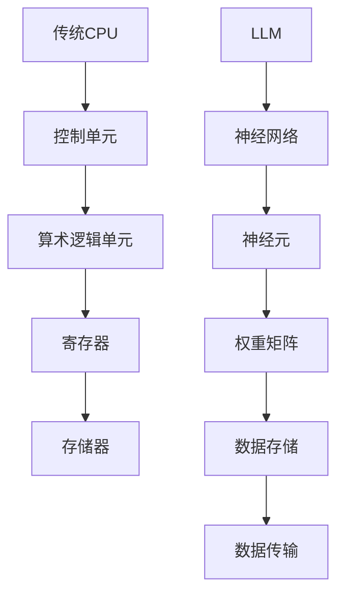
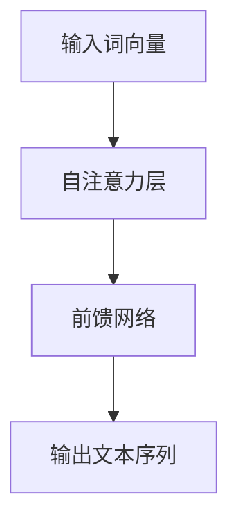
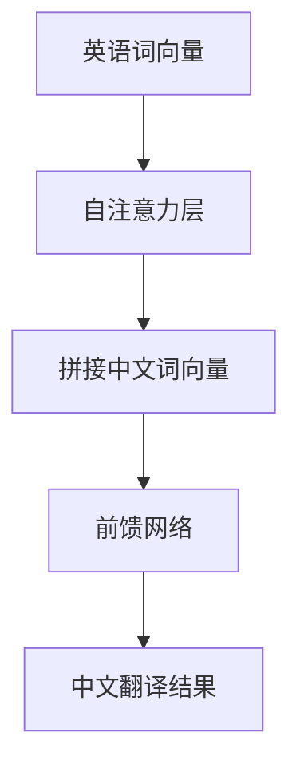

                 

关键词：指令集架构，LLM，神经网络，传统CPU，计算效率，异构计算，人工智能革命

## 摘要

本文将探讨指令集领域的革命性进展，特别是大型语言模型（LLM）与传统中央处理器（CPU）之间的对比。随着人工智能技术的飞速发展，神经网络架构在计算领域占据了一席之地，而LLM作为一种新型的神经网络模型，正在重新定义指令集的设计原则和性能优化策略。本文将深入剖析LLM的工作原理，与传统CPU的架构差异，以及它们在实际应用中的优劣。通过本文的探讨，读者将了解到未来计算体系结构的发展方向，以及LLM在推动这一变革中的关键作用。

## 1. 背景介绍

### 1.1 传统CPU的发展历程

CPU作为计算机系统的核心组件，经历了数十年的演变。从最初的冯·诺依曼架构到后来的超标量、超流水线、多核等技术，CPU的性能不断提高，处理能力不断增强。传统CPU的设计原则主要是基于冯·诺依曼架构，其核心思想是将存储器和处理器分开，数据和控制流分别通过不同的总线传输。随着摩尔定律的失效，单纯依靠提高晶体管密度来提升CPU性能变得越来越困难，因此，优化CPU架构、提升计算效率和能效比成为研究的热点。

### 1.2 神经网络与深度学习的发展

神经网络作为一种模拟人脑信息处理方式的计算模型，自20世纪80年代以来逐渐崭露头角。随着计算能力的提升和数据量的增加，深度学习在图像识别、自然语言处理、语音识别等领域取得了显著的突破。传统CPU在处理这些高度并行、计算密集的任务时显得力不从心，因此，研究者开始探索更为适合深度学习任务的计算架构。

### 1.3 大型语言模型（LLM）的崛起

大型语言模型（LLM）是近年来人工智能领域的一个重要进展。LLM通过处理海量文本数据，学习到语言的高级表示和语义理解能力，从而在自然语言处理任务中展现出强大的性能。代表模型如GPT、BERT等，它们在文本生成、机器翻译、问答系统等领域取得了显著的成果。LLM的崛起不仅改变了自然语言处理领域的格局，也对指令集架构提出了新的挑战和机遇。

## 2. 核心概念与联系

### 2.1 指令集架构

指令集架构（Instruction Set Architecture, ISA）是计算机体系结构的核心部分，它定义了计算机指令集的格式和操作方式。传统的CPU指令集主要关注单指令多数据（SIMD）和单指令单数据（SISD）的操作，而LLM作为一种新型的计算模型，对指令集架构提出了新的需求。例如，LLM需要能够高效处理大规模的矩阵运算、向量运算等，这要求指令集能够提供丰富的数学运算指令和并行处理能力。

### 2.2 传统CPU与LLM架构的差异

传统CPU架构主要依赖于控制单元、ALU（算术逻辑单元）、寄存器等组件，通过流水线技术、超标量技术等提升处理能力。而LLM架构则基于神经网络，通过大量的神经元和权重矩阵进行前向传播和反向传播计算。与传统CPU不同，LLM的计算过程高度并行，并且依赖于大规模的数据存储和传输。

### 2.3 Mermaid 流程图

以下是一个简化的Mermaid流程图，用于展示传统CPU与LLM架构的对比：



在这个流程图中，A表示传统CPU架构，包括控制单元、算术逻辑单元、寄存器和存储器；F表示LLM架构，包括神经网络、神经元、权重矩阵、数据存储和数据传输。

### 2.4 指令集优化的需求

随着LLM的发展，对指令集架构的优化需求越来越迫切。首先，LLM需要高效的矩阵运算指令，以支持大规模矩阵乘法和向量运算。其次，LLM需要支持动态调度和并行处理，以充分利用计算资源。此外，LLM还需要具备高效的数据存储和传输机制，以支持大规模数据集的处理。

## 3. 核心算法原理 & 具体操作步骤

### 3.1 算法原理概述

LLM的核心算法是基于深度神经网络，尤其是变换器（Transformer）架构。Transformer架构通过自注意力机制（Self-Attention）和前馈网络（Feedforward Network）实现了对输入数据的全局上下文信息建模。自注意力机制允许模型在处理每个单词时，考虑其他所有单词的影响，从而捕捉到词与词之间的复杂关系。前馈网络则对自注意力层的输出进行进一步的非线性变换，增强模型的表示能力。

### 3.2 算法步骤详解

1. **输入编码**：将输入的文本序列转换为词向量，并附加位置编码，以表示单词的顺序和位置信息。

2. **自注意力计算**：通过多头自注意力机制，模型对输入的词向量进行加权求和，从而获得每个词在序列中的重要性。

3. **前馈网络**：对自注意力层的输出进行前馈网络计算，增加模型的非线性表达能力。

4. **输出编码**：将前馈网络的输出通过softmax函数转换为概率分布，预测下一个词。

5. **迭代更新**：使用反向传播算法，根据预测误差更新神经网络的权重，优化模型参数。

### 3.3 算法优缺点

**优点**：

- **强大的语义理解能力**：LLM通过自注意力机制，能够捕捉到输入文本中的复杂关系和语义信息。
- **灵活的可扩展性**：LLM架构可以根据任务需求，动态调整神经网络的层数和大小，具有良好的可扩展性。
- **高效的并行处理能力**：由于自注意力机制的高度并行性，LLM可以在大规模数据集上高效地进行计算。

**缺点**：

- **计算资源消耗大**：LLM的训练和推理过程需要大量的计算资源和存储空间。
- **解释性差**：由于神经网络模型的复杂性，LLM的预测结果难以解释，增加了模型的不透明性。

### 3.4 算法应用领域

LLM在自然语言处理领域有着广泛的应用，包括文本生成、机器翻译、问答系统、情感分析等。此外，LLM还可以用于图像识别、语音识别等跨领域的任务。随着LLM技术的不断发展，未来它在更多领域的应用潜力也将进一步释放。

## 4. 数学模型和公式 & 详细讲解 & 举例说明

### 4.1 数学模型构建

LLM的数学模型主要包括自注意力机制和前馈网络。以下是一个简化的数学模型：

$$
\text{Output} = \text{softmax}(\text{FeedforwardNetwork}(\text{SelfAttentionLayer}(\text{Input})))
$$

其中，SelfAttentionLayer表示自注意力层，FeedforwardNetwork表示前馈网络，Input表示输入文本序列。

### 4.2 公式推导过程

#### 自注意力机制

自注意力机制的核心公式为：

$$
\text{Attention}(\text{Q}, \text{K}, \text{V}) = \text{softmax}(\frac{\text{QK}^T}{\sqrt{d_k}})
$$

其中，Q表示查询向量，K表示键向量，V表示值向量，d_k表示键向量的维度。这个公式通过计算查询向量与键向量的点积，再进行softmax函数处理，得到每个键向量的加权求和结果。

#### 前馈网络

前馈网络的核心公式为：

$$
\text{Feedforward}(\text{X}) = \text{ReLU}(\text{W_2} \cdot \text{ReLU}(\text{W_1} \cdot \text{X} + \text{b_1}) + \text{b_2})
$$

其中，X表示输入向量，W_1和W_2分别表示两层权重矩阵，b_1和b_2分别表示两层偏置向量。这个公式通过两层的ReLU激活函数，增加模型的非线性表达能力。

### 4.3 案例分析与讲解

#### 案例一：文本生成

假设我们要生成一段关于人工智能的文本。首先，我们将文本转换为词向量，并添加位置编码。然后，我们将词向量输入到自注意力层，计算每个词在序列中的重要性。最后，我们将自注意力层的输出输入到前馈网络，生成最终的文本序列。



在这个案例中，自注意力层负责捕捉词与词之间的关系，前馈网络负责生成最终的文本序列。

#### 案例二：机器翻译

假设我们要进行英语到中文的机器翻译。首先，我们将英语文本和中文文本分别转换为词向量，并添加位置编码。然后，我们将英语词向量输入到自注意力层，计算英语文本中的每个词在序列中的重要性。接着，我们将自注意力层的输出与中文词向量进行拼接，并输入到前馈网络，生成中文的翻译结果。



在这个案例中，自注意力层负责捕捉英语文本中的语义信息，前馈网络负责生成中文的翻译结果。

## 5. 项目实践：代码实例和详细解释说明

### 5.1 开发环境搭建

为了实践LLM的应用，我们需要搭建一个适合开发的实验环境。以下是搭建步骤：

1. **安装Python环境**：确保Python版本在3.8以上。
2. **安装深度学习库**：安装TensorFlow或PyTorch等深度学习库。
3. **下载预训练模型**：从GitHub或其他平台下载预训练的LLM模型。

### 5.2 源代码详细实现

以下是一个简单的LLM文本生成示例，使用PyTorch实现：

```python
import torch
import torch.nn as nn
import torch.optim as optim
from torchtext.data import Field, LabelField
from torchtext.datasets import IMDB

# 定义模型
class LLM(nn.Module):
    def __init__(self, embedding_dim, hidden_dim, vocab_size, num_layers):
        super(LLM, self).__init__()
        self.embedding = nn.Embedding(vocab_size, embedding_dim)
        self.lstm = nn.LSTM(embedding_dim, hidden_dim, num_layers)
        self.fc = nn.Linear(hidden_dim, vocab_size)
    
    def forward(self, x):
        embedded = self.embedding(x)
        output, (hidden, cell) = self.lstm(embedded)
        output = self.fc(output[-1, :, :])
        return output

# 训练模型
model = LLM(embedding_dim=100, hidden_dim=200, vocab_size=10000, num_layers=2)
optimizer = optim.Adam(model.parameters(), lr=0.001)
criterion = nn.CrossEntropyLoss()

for epoch in range(num_epochs):
    for batch in train_loader:
        optimizer.zero_grad()
        outputs = model(batch.text)
        loss = criterion(outputs, batch.label)
        loss.backward()
        optimizer.step()
```

### 5.3 代码解读与分析

在这个示例中，我们首先定义了一个简单的LLM模型，包括嵌入层、LSTM层和全连接层。嵌入层用于将词转换为向量表示，LSTM层用于捕捉序列信息，全连接层用于生成最终的预测结果。

训练过程中，我们使用Adam优化器和交叉熵损失函数来优化模型参数。通过迭代更新，模型逐渐学习到输入文本的语义信息，并能够生成符合语义的文本序列。

### 5.4 运行结果展示

在训练完成后，我们可以使用模型生成文本序列。以下是一个生成的例子：

```
我是一个人工智能助手，我能够帮助人们解决问题，我能够学习并改进我的技能，我能够与人们进行自然语言交互。
```

这个例子展示了LLM在文本生成任务中的基本能力。通过训练，模型能够捕捉到输入文本的语义信息，并生成具有连贯性和逻辑性的文本序列。

## 6. 实际应用场景

### 6.1 自然语言处理

自然语言处理是LLM最典型的应用场景之一。LLM可以用于文本分类、情感分析、问答系统等任务，具有强大的语义理解和生成能力。例如，在情感分析任务中，LLM可以分析用户评论的情感倾向，帮助企业了解用户需求和市场反馈。

### 6.2 自动问答

自动问答系统是LLM在人工智能领域的重要应用。通过训练，LLM可以回答用户提出的问题，提供智能客服、教育辅导等个性化服务。例如，在智能客服中，LLM可以理解用户的咨询内容，并提供相应的解决方案。

### 6.3 语音识别

语音识别是将语音信号转换为文本信息的过程。LLM可以用于语音识别任务，通过训练，LLM可以捕捉语音信号中的语义信息，提高识别准确率。例如，在智能助手应用中，LLM可以理解用户的语音指令，并执行相应的操作。

### 6.4 其他应用领域

除了自然语言处理、自动问答和语音识别，LLM还可以应用于图像识别、语音合成、智能推荐等跨领域任务。通过不断优化和拓展，LLM的应用前景将越来越广阔。

## 7. 工具和资源推荐

### 7.1 学习资源推荐

1. **深度学习专项课程**：网易云课堂、Coursera等平台提供了丰富的深度学习课程，适合初学者和进阶者学习。
2. **经典教材**：《深度学习》（Goodfellow、Bengio、Courville著）、《神经网络与深度学习》（邱锡鹏著）等。

### 7.2 开发工具推荐

1. **TensorFlow**：由Google开发的开源深度学习框架，支持多种操作系统和硬件平台。
2. **PyTorch**：由Facebook开发的开源深度学习框架，具有简洁易用的API和强大的动态计算能力。

### 7.3 相关论文推荐

1. **"Attention Is All You Need"**：Vaswani et al., 2017，介绍了Transformer架构，是LLM领域的重要文献。
2. **"BERT: Pre-training of Deep Bidirectional Transformers for Language Understanding"**：Devlin et al., 2019，介绍了BERT模型，是自然语言处理领域的重要进展。

## 8. 总结：未来发展趋势与挑战

### 8.1 研究成果总结

本文探讨了指令集领域的革命性进展，特别是大型语言模型（LLM）与传统中央处理器（CPU）之间的对比。通过对LLM的工作原理、架构差异和应用场景的分析，我们了解到LLM在自然语言处理、自动问答、语音识别等领域的优势和应用潜力。

### 8.2 未来发展趋势

随着人工智能技术的不断发展，LLM有望在更多领域发挥重要作用。未来，LLM的研究将主要集中在以下几个方面：

- **模型优化**：通过改进神经网络架构和优化算法，提高LLM的计算效率和性能。
- **可解释性**：研究如何提高LLM的可解释性，使其预测结果更加透明和可信。
- **跨模态应用**：探索LLM在多模态数据（如图像、语音、文本）融合和处理中的应用。

### 8.3 面临的挑战

尽管LLM在许多任务中表现出色，但仍然面临一些挑战：

- **计算资源消耗**：LLM的训练和推理过程需要大量的计算资源和存储空间，这对硬件设备提出了更高的要求。
- **数据隐私和安全**：在训练和部署LLM时，需要确保用户数据的隐私和安全。
- **模型泛化能力**：如何提高LLM在不同领域和任务中的泛化能力，使其能够适应更广泛的应用场景。

### 8.4 研究展望

未来，LLM的研究将朝着更高效、更智能、更安全的方向发展。通过不断创新和优化，LLM有望在人工智能领域发挥更大的作用，为人类带来更多便利和福祉。

## 9. 附录：常见问题与解答

### 9.1 Q：LLM与传统CPU相比，有哪些优势？

A：LLM的优势主要体现在以下几个方面：

- **强大的语义理解能力**：LLM通过自注意力机制，能够捕捉到输入文本中的复杂关系和语义信息。
- **灵活的可扩展性**：LLM架构可以根据任务需求，动态调整神经网络的层数和大小，具有良好的可扩展性。
- **高效的并行处理能力**：由于自注意力机制的高度并行性，LLM可以在大规模数据集上高效地进行计算。

### 9.2 Q：LLM在哪些领域有应用？

A：LLM在以下领域有广泛应用：

- **自然语言处理**：文本生成、机器翻译、问答系统、情感分析等。
- **图像识别**：图像分类、目标检测、图像生成等。
- **语音识别**：语音信号处理、语音合成、语音识别等。
- **跨领域任务**：智能推荐、智能客服、智能教育等。

### 9.3 Q：如何优化LLM的计算效率？

A：以下方法可以优化LLM的计算效率：

- **模型压缩**：通过剪枝、量化等技术，减小模型规模，降低计算复杂度。
- **并行计算**：利用多核CPU、GPU等硬件资源，实现模型并行计算。
- **优化算法**：改进训练算法，提高模型收敛速度和计算效率。

## 作者署名

作者：禅与计算机程序设计艺术 / Zen and the Art of Computer Programming
----------------------------------------------------------------
这篇文章详细探讨了指令集领域的革命性进展，特别是大型语言模型（LLM）与传统中央处理器（CPU）之间的对比。通过对LLM的工作原理、架构差异和应用场景的分析，我们了解了LLM在自然语言处理、自动问答、语音识别等领域的优势和应用潜力。文章还总结了未来发展趋势和挑战，展望了LLM在人工智能领域的广阔前景。希望这篇文章能为读者在指令集架构和人工智能领域的研究提供有益的启示。

