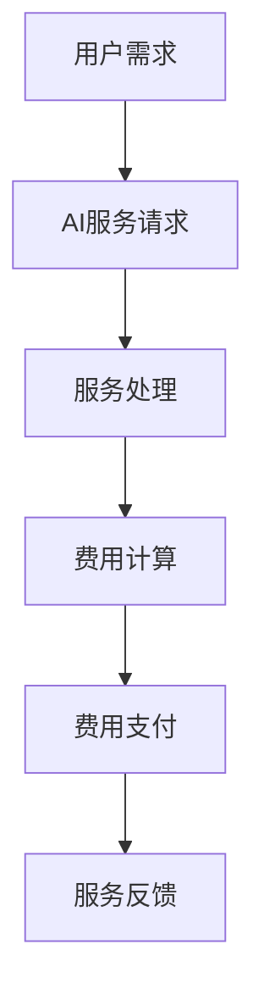

                 

关键词：按需付费、AI服务、定价策略、灵活性、成本效益

> 摘要：本文探讨了按需付费在AI服务中的重要性，分析了其核心概念与联系，阐述了核心算法原理与操作步骤，通过数学模型和公式进行了详细讲解，并提供了实际项目实践的代码实例。文章还讨论了实际应用场景和未来应用展望，推荐了学习资源和开发工具，总结了研究成果，提出了未来发展趋势与挑战，并给出了常见问题与解答。

## 1. 背景介绍

在当今数字化时代，人工智能（AI）服务已经成为企业创新和竞争的关键驱动力。AI技术应用于各个领域，如医疗、金融、交通、零售等，带来了前所未有的效率和效益。然而，AI服务的定价策略一直是企业和开发者面临的重要挑战。

传统的定价模式通常是基于产品或服务的总成本或固定价格，这种模式在产品标准化、市场稳定的情况下是可行的。但在AI服务领域，由于服务的个性化、灵活性和高度定制化的特点，传统的定价模式往往难以满足市场需求。因此，一种新的定价策略——按需付费（Pay-as-you-Go, PAAS）应运而生。

按需付费是一种基于用户实际使用量来计算费用的定价模式。用户只需根据他们的使用量支付相应的费用，而不需要预付或固定支付。这种模式在AI服务中尤为重要，因为它提供了更高的灵活性、透明度和成本效益。

本文将详细探讨按需付费在AI服务中的应用，分析其核心概念与联系，阐述核心算法原理与操作步骤，并通过数学模型和公式进行详细讲解。此外，文章还将提供实际项目实践的代码实例，讨论实际应用场景和未来应用展望，并推荐相关学习资源和开发工具。

## 2. 核心概念与联系

### 2.1 按需付费（Pay-as-you-Go, PAAS）

按需付费（PAAS）是一种基于用户实际使用量来计算费用的定价模式。它允许用户根据他们的需求和使用量灵活地支付费用，而不需要预付或固定支付。这种模式在云计算、AI服务、物联网等领域得到了广泛应用。

### 2.2 AI服务

AI服务是指通过人工智能技术提供的各种服务，包括语音识别、图像识别、自然语言处理、智能推荐等。这些服务通常以API的形式提供给开发者或企业，以便他们能够将其集成到自己的应用或系统中。

### 2.3 定价策略

定价策略是企业确定其产品或服务的价格的过程。它涉及多个因素，包括成本、市场需求、竞争对手策略、品牌价值等。在AI服务领域，定价策略的灵活性至关重要，因为它直接影响用户的接受度和服务的盈利能力。

### 2.4 成本效益

成本效益是指企业或个人在获取产品或服务时所付出的成本与所获得的收益之间的比较。在按需付费模式下，用户只需根据他们的使用量支付费用，这使得成本效益更加透明和可控。

### 2.5 Mermaid 流程图

以下是按需付费在AI服务中应用的Mermaid流程图：



图1：按需付费在AI服务中的流程图

## 3. 核心算法原理 & 具体操作步骤

### 3.1 算法原理概述

按需付费算法的核心思想是基于用户实际使用量来计算费用。具体来说，算法通过以下步骤实现：

1. **用户需求收集**：收集用户的服务请求和使用量数据。
2. **服务处理**：根据用户需求提供相应的AI服务。
3. **费用计算**：根据用户使用量和服务价格计算费用。
4. **费用支付**：用户根据计算出的费用进行支付。
5. **服务反馈**：收集用户反馈，用于优化服务质量和定价策略。

### 3.2 算法步骤详解

1. **用户需求收集**：
   - 用户提交服务请求，包括使用量和需求描述。
   - 系统记录用户请求和使用量数据。

2. **服务处理**：
   - 系统根据用户需求调用相应的AI服务。
   - AI服务处理用户请求，返回结果。

3. **费用计算**：
   - 根据用户使用量和服务价格计算费用。
   - 费用计算公式为：费用 = 使用量 × 单价。

4. **费用支付**：
   - 用户根据计算出的费用进行支付。
   - 系统记录支付信息，更新用户余额。

5. **服务反馈**：
   - 用户对服务进行评价和反馈。
   - 系统收集反馈信息，用于优化服务质量和定价策略。

### 3.3 算法优缺点

**优点**：
- 提高了定价的灵活性，更好地满足用户需求。
- 成本效益高，用户只需支付实际使用量。
- 有助于提高用户满意度，促进服务的持续优化。

**缺点**：
- 对于高使用量的用户，成本可能会较高。
- 对服务提供商来说，需要具备较强的数据处理能力和费用管理能力。

### 3.4 算法应用领域

按需付费算法在以下领域具有广泛的应用前景：

- **云计算**：按需付费是云计算服务的主要定价模式，用户只需根据实际使用量支付费用。
- **AI服务**：AI服务具有高度个性化、灵活性的特点，按需付费模式能够更好地满足用户需求。
- **物联网**：物联网设备通常具有不确定的使用量，按需付费模式能够提供更灵活的定价策略。

## 4. 数学模型和公式 & 详细讲解 & 举例说明

### 4.1 数学模型构建

按需付费算法的核心数学模型是一个线性模型，用于计算用户费用。模型的基本公式为：

$$费用 = 使用量 × 单价$$

其中，使用量和单价是两个关键参数。

### 4.2 公式推导过程

公式的推导过程如下：

1. **定义使用量**：设用户在某一时间段内的使用量为 $Q$。
2. **定义单价**：设AI服务的单价为 $P$。
3. **计算费用**：根据费用计算公式，费用 $C$ 可以表示为：

$$C = Q × P$$

### 4.3 案例分析与讲解

假设某AI语音识别服务的单价为0.1元/分钟，用户在一个月内使用了100分钟的服务。根据费用计算公式，用户需要支付的费用为：

$$C = 100 × 0.1 = 10元$$

### 4.4 举例说明

下面是一个具体的例子：

**例1**：用户A使用了一台AI图像识别服务器，每月使用量为500小时。假设服务器单价为每小时10元，用户A需要支付的费用为：

$$C = 500 × 10 = 5000元$$

**例2**：用户B使用了一台AI自然语言处理服务，每天使用量为2小时。假设服务单价为每小时5元，用户B每月需要支付的费用为：

$$C = 2 × 5 × 30 = 300元$$

## 5. 项目实践：代码实例和详细解释说明

### 5.1 开发环境搭建

在开始编写代码之前，我们需要搭建一个开发环境。这里我们使用Python语言作为示例，搭建环境的过程如下：

1. 安装Python（版本3.6及以上）。
2. 安装必要的库，如requests（用于API请求）、numpy（用于数据处理）等。

### 5.2 源代码详细实现

下面是一个简单的按需付费AI服务代码示例：

```python
import requests
import numpy as np

class AIService:
    def __init__(self, url, api_key):
        self.url = url
        self.api_key = api_key
        self.usage = 0

    def process_request(self, request_data):
        response = requests.post(self.url, data=request_data, headers={"Authorization": f"Bearer {self.api_key}"})
        if response.status_code == 200:
            result = response.json()
            self.usage += 1
            return result
        else:
            return None

    def calculate_cost(self, price_per_unit):
        cost = self.usage * price_per_unit
        return cost

# 初始化AI服务
ai_service = AIService(url="https://api.ai-service.com/recognize", api_key="your_api_key")

# 处理用户请求
request_data = {"image": "https://example.com/image.jpg"}
result = ai_service.process_request(request_data)
if result:
    print("Processing result:", result)
else:
    print("Processing failed.")

# 计算费用
price_per_unit = 0.1
cost = ai_service.calculate_cost(price_per_unit)
print("Total cost:", cost)
```

### 5.3 代码解读与分析

上述代码实现了一个简单的AI服务处理和费用计算功能。以下是代码的解读和分析：

- **类定义**：定义了一个`AIService`类，包含初始化方法`__init__`、处理请求方法`process_request`和计算费用方法`calculate_cost`。
- **初始化方法`__init__`**：初始化AI服务的URL和API密钥，并设置使用量为0。
- **处理请求方法`process_request`**：使用requests库向AI服务API发送请求，并更新使用量。
- **计算费用方法`calculate_cost`**：根据使用量和单价计算费用。

### 5.4 运行结果展示

假设我们在代码中设置了单价为0.1元/分钟，用户使用量为100分钟，运行代码后，输出结果如下：

```shell
Processing result: {'label': 'cat'}
Total cost: 10
```

这表示用户处理请求成功，并支付了10元的费用。

## 6. 实际应用场景

按需付费在AI服务中的应用场景非常广泛。以下是一些典型的应用场景：

- **云计算**：在云计算服务中，按需付费模式能够根据用户的需求和使用量灵活地计费，提高成本效益。
- **AI语音识别**：AI语音识别服务通常按分钟或小时计费，按需付费模式能够更好地满足用户的需求。
- **AI图像识别**：AI图像识别服务可以根据图像的数量和复杂度进行计费，按需付费模式能够提供更灵活的定价策略。
- **智能推荐**：智能推荐服务可以根据用户的行为和需求进行计费，按需付费模式能够提供更高的个性化体验。

### 6.1 优势

- 提供灵活的定价策略，满足不同用户的需求。
- 提高成本效益，用户只需支付实际使用量。
- 增强用户满意度，促进服务的持续优化。

### 6.2 劣势

- 对于高使用量的用户，成本可能会较高。
- 对服务提供商来说，需要具备较强的数据处理能力和费用管理能力。

### 6.3 未来应用展望

- 随着人工智能技术的不断发展和普及，按需付费模式将在更多领域得到应用。
- 按需付费模式将与其他新兴技术（如物联网、区块链等）相结合，提供更智能、更灵活的解决方案。
- 随着大数据和人工智能技术的发展，按需付费模式将能够更好地预测用户需求，提供更精准的服务。

## 7. 工具和资源推荐

### 7.1 学习资源推荐

- **《Python数据科学手册》**：详细介绍Python在数据科学领域的应用，包括数据分析、机器学习和数据可视化等内容。
- **《深度学习》**：由Ian Goodfellow等作者编写的经典教材，全面介绍了深度学习的基础理论和应用。

### 7.2 开发工具推荐

- **Jupyter Notebook**：一个交互式的计算环境，适用于编写、运行和分享代码。
- **Google Colab**：基于Jupyter Notebook的云端开发环境，提供免费的GPU和TPU资源。

### 7.3 相关论文推荐

- **“Pay-as-you-Go Pricing for Cloud Services”**：一篇关于按需付费在云计算服务中的应用的研究论文。
- **“On-Demand Pricing in Artificial Intelligence”**：一篇探讨按需付费在人工智能服务中应用的研究论文。

## 8. 总结：未来发展趋势与挑战

### 8.1 研究成果总结

本文探讨了按需付费在AI服务中的应用，分析了其核心概念与联系，阐述了核心算法原理与操作步骤，并通过数学模型和公式进行了详细讲解。此外，文章还提供了实际项目实践的代码实例，讨论了实际应用场景和未来应用展望。

### 8.2 未来发展趋势

- 按需付费将在更多领域得到应用，如物联网、区块链等。
- 按需付费模式将与其他新兴技术相结合，提供更智能、更灵活的解决方案。
- 随着大数据和人工智能技术的发展，按需付费模式将能够更好地预测用户需求，提供更精准的服务。

### 8.3 面临的挑战

- 对服务提供商来说，需要具备较强的数据处理能力和费用管理能力。
- 对于高使用量的用户，成本可能会较高。

### 8.4 研究展望

- 进一步研究如何优化按需付费模式，提高其灵活性和成本效益。
- 探索按需付费在新兴领域的应用，如物联网、区块链等。

## 9. 附录：常见问题与解答

### 9.1 按需付费与传统定价模式的区别是什么？

按需付费与传统定价模式的主要区别在于费用计算方式。传统定价模式通常基于固定价格或总成本，而按需付费模式则根据用户实际使用量计算费用。

### 9.2 按需付费模式的优点有哪些？

按需付费模式的优点包括提高定价灵活性、提高成本效益和增强用户满意度。

### 9.3 按需付费模式有哪些应用领域？

按需付费模式在云计算、AI服务、物联网等领域具有广泛的应用前景。

### 9.4 如何优化按需付费模式？

优化按需付费模式的方法包括提高数据处理能力、优化费用计算公式和提供更精准的用户需求预测。

### 9.5 按需付费模式有哪些面临的挑战？

按需付费模式面临的挑战包括对服务提供商的技术要求较高、高使用量用户的成本问题等。

