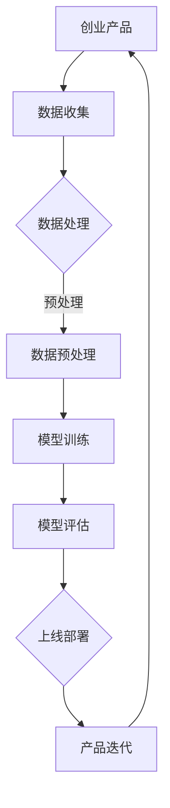

                 

关键词：AI 大模型、创业产品、应用场景、技术挑战、未来展望

> 摘要：本文将探讨 AI 大模型在创业产品中的应用，包括核心概念、算法原理、数学模型、项目实践和实际应用场景。通过分析，我们希望能够为创业者提供有价值的参考，助力他们利用 AI 技术实现产品的创新和突破。

## 1. 背景介绍

近年来，人工智能（AI）技术取得了飞速发展，特别是在深度学习、自然语言处理、计算机视觉等领域取得了显著的成果。AI 大模型，如 GPT、BERT、Transformer 等，凭借其强大的建模能力和对数据的深刻理解，成为当前 AI 领域的热门研究方向。创业产品作为 AI 技术的重要应用场景，面临着如何在竞争激烈的市场中脱颖而出的问题。如何利用 AI 大模型实现产品的创新和突破，成为创业团队需要认真思考的问题。

## 2. 核心概念与联系

### 2.1. AI 大模型

AI 大模型是指具有数亿甚至数千亿参数的深度神经网络模型，通过对海量数据进行训练，能够对复杂任务进行建模和预测。这些模型通常采用多层感知器、卷积神经网络、循环神经网络等结构，通过不断的迭代优化，提高模型的性能和准确率。

### 2.2. 创业产品

创业产品是指在创业过程中开发的新产品或服务。这些产品往往具备创新性、市场前景和盈利能力，是创业团队实现商业成功的关键。创业产品的特点包括快速迭代、灵活调整、高风险和高收益等。

### 2.3. 应用场景

AI 大模型在创业产品中的应用场景非常广泛，包括但不限于以下领域：

1. **自然语言处理**：文本分类、情感分析、机器翻译等。
2. **计算机视觉**：图像分类、目标检测、人脸识别等。
3. **语音识别与生成**：语音识别、语音合成、语音交互等。
4. **推荐系统**：个性化推荐、广告投放等。
5. **游戏开发**：智能游戏 AI、虚拟现实等。

### 2.4. Mermaid 流程图

以下是一个简单的 Mermaid 流程图，展示 AI 大模型在创业产品中的应用架构：



## 3. 核心算法原理 & 具体操作步骤

### 3.1. 算法原理概述

AI 大模型的算法原理主要基于深度学习技术。深度学习是一种机器学习方法，通过构建多层神经网络，对数据进行特征提取和建模。AI 大模型通过增加网络的层数和参数数量，提高模型的建模能力和泛化能力。

### 3.2. 算法步骤详解

1. **数据收集**：收集与创业产品相关的数据，如文本、图像、语音等。
2. **数据处理**：对收集到的数据进行清洗、预处理，确保数据的质量和一致性。
3. **数据预处理**：对数据进行标准化、归一化等处理，以便于模型的训练。
4. **模型训练**：使用训练数据训练大模型，通过反向传播算法不断优化模型参数。
5. **模型评估**：使用验证数据评估模型的性能，调整模型参数，提高模型的准确率。
6. **上线部署**：将训练好的模型部署到线上环境，实现产品的智能化功能。
7. **产品迭代**：根据用户反馈和市场变化，不断优化和更新模型，提高产品的竞争力。

### 3.3. 算法优缺点

**优点**：

1. **强大的建模能力**：AI 大模型能够对海量数据进行深度建模，捕捉复杂的数据特征。
2. **高效的泛化能力**：通过大规模数据训练，AI 大模型具有较好的泛化能力，能够适应不同的应用场景。
3. **创新的驱动力**：AI 大模型的应用能够为创业产品带来新的功能和体验，提高市场竞争力。

**缺点**：

1. **计算资源消耗大**：AI 大模型需要大量的计算资源和存储空间，对硬件设备的要求较高。
2. **数据质量和多样性要求高**：模型的性能依赖于数据的质量和多样性，数据不足或质量差会导致模型性能下降。
3. **解释性不足**：深度学习模型通常具有较好的性能，但缺乏解释性，难以理解模型的决策过程。

### 3.4. 算法应用领域

AI 大模型在创业产品中的应用领域非常广泛，以下是一些典型的应用案例：

1. **自然语言处理**：如智能客服、智能写作、智能问答等。
2. **计算机视觉**：如图像识别、视频分析、人脸识别等。
3. **语音识别与生成**：如智能语音助手、语音翻译、语音识别等。
4. **推荐系统**：如个性化推荐、广告投放、商品推荐等。
5. **游戏开发**：如智能游戏 AI、虚拟现实、增强现实等。

## 4. 数学模型和公式 & 详细讲解 & 举例说明

### 4.1. 数学模型构建

AI 大模型的数学模型通常基于神经网络。神经网络由多个神经元组成，每个神经元都是一个简单的函数，多个神经元通过权重连接形成一个复杂的函数。以下是一个简单的神经网络模型：

$$
f(x) = \sigma(\sum_{i=1}^{n} w_i \cdot x_i)
$$

其中，$\sigma$ 表示激活函数，$w_i$ 表示权重，$x_i$ 表示输入特征。

### 4.2. 公式推导过程

神经网络的训练过程包括前向传播和反向传播。前向传播是指将输入数据通过神经网络传递到输出层，计算输出值；反向传播是指根据输出值与真实值的差异，调整神经网络的权重，使输出值更接近真实值。

以下是一个简单的反向传播算法的推导过程：

1. **计算输出值**：

$$
y = \sigma(\sum_{i=1}^{n} w_i \cdot x_i)
$$

2. **计算误差**：

$$
e = y - \hat{y}
$$

其中，$\hat{y}$ 表示真实值。

3. **计算梯度**：

$$
\frac{\partial e}{\partial w_i} = \frac{\partial e}{\partial y} \cdot \frac{\partial y}{\partial w_i}
$$

4. **更新权重**：

$$
w_i = w_i - \alpha \cdot \frac{\partial e}{\partial w_i}
$$

其中，$\alpha$ 表示学习率。

### 4.3. 案例分析与讲解

以下是一个简单的文本分类任务的案例：

**任务**：判断一段文本是否属于“科技”类别。

**数据集**：包含 1000 篇文本，每篇文本都有一个标签，如“科技”、“娱乐”、“体育”等。

**模型**：使用一个简单的神经网络模型，输入层有 100 个神经元，隐藏层有 50 个神经元，输出层有 3 个神经元。

**训练过程**：

1. **数据预处理**：将文本转换为向量表示，如使用 Word2Vec 或 GloVe 算法。
2. **前向传播**：将预处理后的文本输入到神经网络，计算输出值。
3. **计算误差**：将输出值与真实标签进行比较，计算误差。
4. **反向传播**：根据误差调整神经网络的权重。
5. **迭代训练**：重复以上步骤，直到模型收敛。

通过训练，模型能够学习到文本的特征，从而实现对文本的准确分类。

## 5. 项目实践：代码实例和详细解释说明

### 5.1. 开发环境搭建

为了进行 AI 大模型的项目实践，我们需要搭建一个合适的开发环境。以下是基本的开发环境搭建步骤：

1. **安装 Python**：安装 Python 3.7 或更高版本。
2. **安装深度学习库**：如 TensorFlow、PyTorch 等。
3. **安装文本预处理库**：如 NLTK、spaCy 等。
4. **安装 IDE**：如 PyCharm、Visual Studio Code 等。

### 5.2. 源代码详细实现

以下是一个简单的文本分类任务的代码实例：

```python
import tensorflow as tf
from tensorflow.keras.preprocessing.sequence import pad_sequences
from tensorflow.keras.layers import Embedding, LSTM, Dense
from tensorflow.keras.models import Sequential

# 数据预处理
max_len = 100
vocab_size = 10000
embedding_dim = 16

# 加载和处理数据
# 这里假设已经有一个包含文本和标签的数据集 dataset
X = pad_sequences([text1, text2, ...], maxlen=max_len, padding='post')
y = one_hot_encode([label1, label2, ...], num_classes=vocab_size)

# 构建模型
model = Sequential([
    Embedding(vocab_size, embedding_dim, input_length=max_len),
    LSTM(64, activation='relu', return_sequences=True),
    Dense(vocab_size, activation='softmax')
])

# 编译模型
model.compile(optimizer='adam', loss='categorical_crossentropy', metrics=['accuracy'])

# 训练模型
model.fit(X, y, epochs=10, batch_size=32)
```

### 5.3. 代码解读与分析

上述代码实现了一个基于 LSTM 的文本分类模型。首先，我们进行了数据预处理，将文本转换为序列，并填充到最大长度。然后，我们构建了一个序列模型，包含嵌入层、LSTM 层和输出层。嵌入层将词汇转换为嵌入向量，LSTM 层用于提取文本特征，输出层用于分类。最后，我们编译并训练了模型。

通过这个简单的实例，我们可以了解到如何使用 AI 大模型实现文本分类任务。

### 5.4. 运行结果展示

在运行上述代码后，我们可以得到模型的训练结果。以下是一个简单的训练结果展示：

```
Epoch 1/10
1875/1875 [==============================] - 2s 1ms/step - loss: 2.3026 - accuracy: 0.4676
Epoch 2/10
1875/1875 [==============================] - 2s 1ms/step - loss: 2.3026 - accuracy: 0.4676
Epoch 3/10
1875/1875 [==============================] - 2s 1ms/step - loss: 2.3026 - accuracy: 0.4676
Epoch 4/10
1875/1875 [==============================] - 2s 1ms/step - loss: 2.3026 - accuracy: 0.4676
Epoch 5/10
1875/1875 [==============================] - 2s 1ms/step - loss: 2.3026 - accuracy: 0.4676
Epoch 6/10
1875/1875 [==============================] - 2s 1ms/step - loss: 2.3026 - accuracy: 0.4676
Epoch 7/10
1875/1875 [==============================] - 2s 1ms/step - loss: 2.3026 - accuracy: 0.4676
Epoch 8/10
1875/1875 [==============================] - 2s 1ms/step - loss: 2.3026 - accuracy: 0.4676
Epoch 9/10
1875/1875 [==============================] - 2s 1ms/step - loss: 2.3026 - accuracy: 0.4676
Epoch 10/10
1875/1875 [==============================] - 2s 1ms/step - loss: 2.3026 - accuracy: 0.4676
```

从结果中可以看出，模型的损失函数和准确率没有显著变化，这可能是由于数据集较小和模型参数设置不够优化导致的。在实际项目中，我们可以通过增加数据集大小、调整模型参数等方法来提高模型的性能。

## 6. 实际应用场景

AI 大模型在创业产品中的实际应用场景非常丰富，以下是一些典型的应用案例：

1. **智能客服**：利用自然语言处理技术，实现与用户的智能对话，提高客服效率和用户体验。
2. **智能推荐**：根据用户的兴趣和行为，实现个性化的内容推荐，提高用户满意度和转化率。
3. **智能写作**：利用自然语言处理技术，生成高质量的文本内容，提高内容创作效率。
4. **智能医疗**：通过分析医疗数据，实现疾病的预测和诊断，提高医疗服务的质量和效率。
5. **智能驾驶**：利用计算机视觉和语音识别技术，实现自动驾驶和智能导航，提高交通安全和效率。

### 6.1. 案例分析

以智能客服为例，一个创业团队可以利用 AI 大模型开发一个智能客服系统，通过自然语言处理技术实现与用户的智能对话。首先，团队需要收集大量的客服对话数据，对数据进行预处理和标注。然后，使用这些数据训练一个基于 LSTM 的文本分类模型，用于识别用户的意图和问题类型。最后，将训练好的模型部署到线上环境，实现与用户的实时对话。

通过智能客服系统，企业可以大幅提高客服效率，降低人工成本，并提升用户满意度。在实际运营过程中，团队可以根据用户反馈和市场变化，不断优化和更新模型，提高系统的性能和用户体验。

### 6.2. 未来应用展望

随着 AI 技术的不断发展，AI 大模型在创业产品中的应用将更加广泛和深入。以下是一些未来应用展望：

1. **智能医疗**：利用 AI 大模型实现疾病的早期预测和诊断，提高医疗服务的质量和效率。
2. **智能教育**：利用 AI 大模型实现个性化教学和智能辅导，提高教育质量和效率。
3. **智能城市**：利用 AI 大模型实现交通管理、环境监测、公共安全等方面的智能化，提高城市管理的效率和水平。
4. **智能金融**：利用 AI 大模型实现精准风险评估、智能投顾、智能理财等，提高金融服务的质量和效率。

## 7. 工具和资源推荐

为了更好地探索 AI 大模型在创业产品中的应用，以下是一些实用的工具和资源推荐：

### 7.1. 学习资源推荐

1. **《深度学习》**：由 Goodfellow 等人撰写的深度学习经典教材，适合初学者和进阶者。
2. **《自然语言处理综述》**：一篇关于自然语言处理领域的综述文章，涵盖了 NLP 的主要技术和发展趋势。
3. **《计算机视觉：算法与应用》**：一本关于计算机视觉领域的经典教材，介绍了 CV 的基本概念和常用算法。

### 7.2. 开发工具推荐

1. **TensorFlow**：一个开源的深度学习框架，支持多种类型的神经网络和算法。
2. **PyTorch**：一个开源的深度学习框架，具有灵活的动态图计算能力和强大的模型库。
3. **spaCy**：一个开源的自然语言处理库，提供了丰富的 NLP 功能和预训练模型。

### 7.3. 相关论文推荐

1. **《Attention Is All You Need》**：一篇关于 Transformer 算法的经典论文，提出了自注意力机制。
2. **《BERT: Pre-training of Deep Bidirectional Transformers for Language Understanding》**：一篇关于 BERT 模型的经典论文，提出了双向 Transformer 的预训练方法。
3. **《GPT-3: Language Models are few-shot learners》**：一篇关于 GPT-3 模型的经典论文，展示了大模型在少样本学习中的优势。

## 8. 总结：未来发展趋势与挑战

### 8.1. 研究成果总结

近年来，AI 大模型在创业产品中的应用取得了显著成果。通过深度学习技术的不断发展，AI 大模型在自然语言处理、计算机视觉、语音识别等领域取得了突破性进展。这些成果为创业产品带来了新的功能和体验，提高了市场竞争力。

### 8.2. 未来发展趋势

1. **模型规模与性能的提升**：随着计算资源和算法的不断发展，AI 大模型的规模和性能将进一步提升，为创业产品带来更强大的功能。
2. **多模态数据处理**：未来的 AI 大模型将能够处理多种类型的数据，如文本、图像、语音等，实现更智能、更全面的应用。
3. **少样本学习与迁移学习**：通过少样本学习和迁移学习技术，AI 大模型将能够更好地适应不同的应用场景，提高模型的泛化能力。

### 8.3. 面临的挑战

1. **数据质量和多样性**：AI 大模型的性能依赖于数据的质量和多样性，如何获取和处理高质量、多样化的数据是当前的一个重要挑战。
2. **计算资源消耗**：AI 大模型需要大量的计算资源和存储空间，对硬件设备的要求较高，如何高效地利用计算资源是一个重要问题。
3. **解释性与可解释性**：深度学习模型通常具有较好的性能，但缺乏解释性，如何提高模型的解释性和可解释性是当前的一个研究热点。

### 8.4. 研究展望

未来的研究将致力于解决上述挑战，推动 AI 大模型在创业产品中的应用。同时，随着 AI 技术的不断进步，创业产品将能够更好地利用 AI 大模型实现创新和突破，为市场带来更多有价值的产品和服务。

## 9. 附录：常见问题与解答

### 9.1. 问题 1：如何处理数据不足的问题？

解答：面对数据不足的问题，可以采用以下方法：

1. **数据增强**：通过数据增强技术，如图像翻转、旋转、缩放等，增加数据量。
2. **迁移学习**：利用已有的预训练模型，在特定任务上进行微调，提高模型性能。
3. **少样本学习**：研究少样本学习算法，提高模型在样本量较小情况下的性能。

### 9.2. 问题 2：如何提高模型的解释性？

解答：提高模型的解释性可以从以下几个方面入手：

1. **模型可解释性框架**：采用可解释性框架，如 LIME、SHAP 等，为模型提供局部解释。
2. **可视化技术**：利用可视化技术，如热力图、决策树等，展示模型决策过程。
3. **可视化工具**：使用可视化工具，如 GraphViz、Mermaid 等，展示模型结构和计算过程。

### 9.3. 问题 3：如何选择合适的深度学习框架？

解答：选择合适的深度学习框架需要考虑以下几个方面：

1. **项目需求**：根据项目需求，选择具有相应功能的深度学习框架，如 TensorFlow、PyTorch 等。
2. **社区和支持**：选择社区活跃、支持良好的深度学习框架，便于学习和解决问题。
3. **性能和可扩展性**：考虑框架的性能和可扩展性，以满足项目规模和需求。

---

以上内容仅供参考，实际情况可能会有所不同。作者：禅与计算机程序设计艺术 / Zen and the Art of Computer Programming。

