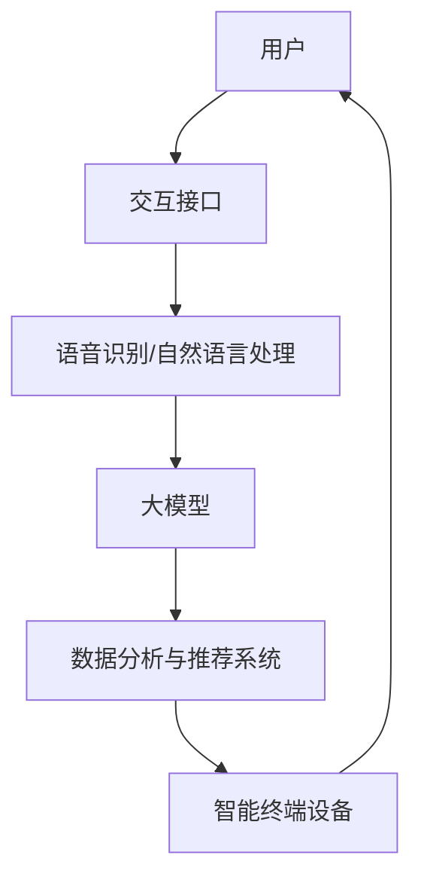

                 

关键词：人工智能，智能家居，大模型，娱乐系统，深度学习，自然语言处理

> 摘要：随着人工智能技术的快速发展，智能家居娱乐系统正逐渐成为人们日常生活的重要组成部分。本文将探讨AI大模型在智能家居娱乐系统中的应用，通过分析其核心概念、算法原理、数学模型以及实际应用案例，为读者提供对这一领域的深入理解。

## 1. 背景介绍

随着物联网技术的普及，智能家居系统正以前所未有的速度融入我们的日常生活。从智能照明、智能空调到智能音响，智能家居设备不仅提升了我们的生活质量，也为家居娱乐带来了前所未有的便捷性。然而，智能家居娱乐系统的应用不仅限于简单的设备控制，更涉及到自然语言交互、智能推荐、个性化内容生成等方面。

AI大模型，作为人工智能领域的一项核心技术，已经在图像识别、自然语言处理、语音识别等多个领域取得了显著成果。大模型通常具有庞大的参数量，能够处理复杂的数据集，从而实现高度准确的预测和分类。将AI大模型应用于智能家居娱乐系统，不仅能够提升系统的智能化程度，还能够提供更为丰富的娱乐内容和更加个性化的用户体验。

本文将围绕以下几个核心问题展开讨论：
- AI大模型在智能家居娱乐系统中如何发挥作用？
- 这些模型的基本原理和架构是怎样的？
- 如何实现AI大模型与智能家居设备的无缝整合？
- 实际应用中存在哪些挑战和机遇？

## 2. 核心概念与联系

### 2.1 智能家居娱乐系统简介

智能家居娱乐系统是指利用人工智能技术实现家庭娱乐设备智能化控制与内容推荐的系统。它通常包括以下几个部分：

1. **智能终端设备**：如智能电视、智能音响、智能投影仪等。
2. **交互接口**：如智能语音助手、智能屏幕等，用于与用户进行交互。
3. **内容平台**：提供各种娱乐内容，如电影、音乐、游戏等。
4. **数据分析与推荐系统**：利用用户行为数据和AI算法，实现个性化内容推荐。

### 2.2 AI大模型简介

AI大模型，通常指的是拥有数百万甚至数十亿参数的神经网络模型。这些模型通常基于深度学习技术，具有强大的特征提取和模式识别能力。例如，GPT-3、BERT等都是典型的大模型。

大模型的主要特点包括：

1. **参数量巨大**：具有数百万到数十亿个参数。
2. **训练数据量庞大**：通常需要海量的训练数据集。
3. **计算资源需求高**：训练和推理过程需要大量的计算资源。
4. **性能卓越**：在图像识别、自然语言处理等领域表现优异。

### 2.3 模型架构与联系

为了更好地理解AI大模型在智能家居娱乐系统中的应用，我们可以通过一个Mermaid流程图来展示其基本架构和联系。

在这个流程图中，用户通过交互接口（如智能音响）与大模型进行交互，大模型通过语音识别和自然语言处理技术理解用户的指令和偏好，然后利用数据分析与推荐系统为用户推荐个性化的娱乐内容，最后通过智能终端设备呈现给用户。

## 3. 核心算法原理 & 具体操作步骤

### 3.1 算法原理概述

AI大模型在智能家居娱乐系统中的应用，主要依赖于深度学习和自然语言处理技术。深度学习通过多层神经网络对大量数据进行特征提取和学习，从而实现智能决策。自然语言处理则通过语言模型和语音识别技术，实现人与机器的自然交互。

具体来说，算法原理包括以下几个关键步骤：

1. **语音识别**：将用户的语音输入转化为文本。
2. **自然语言理解**：解析文本，提取语义信息。
3. **内容推荐**：根据用户偏好和语义信息，推荐相应的娱乐内容。
4. **交互反馈**：用户与系统进行互动，系统根据反馈调整推荐策略。

### 3.2 算法步骤详解

#### 3.2.1 语音识别

语音识别技术是将语音信号转换为文本的过程。其基本原理包括：

1. **特征提取**：使用MFCC（梅尔频率倒谱系数）等方法提取语音信号的特征。
2. **声学模型训练**：使用大量的语音数据集训练声学模型，以识别不同语音特征对应的音素。
3. **语言模型训练**：使用文本语料库训练语言模型，以预测下一个词的可能性。

具体操作步骤如下：

1. **数据预处理**：对语音信号进行降噪、去噪等处理，提高语音质量。
2. **特征提取**：使用MFCC等方法提取语音信号特征。
3. **声学模型推理**：将特征输入到声学模型，得到一系列音素的概率分布。
4. **语言模型推理**：将音素序列转化为文本序列。

#### 3.2.2 自然语言理解

自然语言理解是将文本转化为机器可理解语义信息的过程。其基本原理包括：

1. **词嵌入**：将文本中的词语映射到高维空间，形成词向量。
2. **句法分析**：分析句子的语法结构，理解句子的含义。
3. **实体识别**：识别文本中的实体（如人名、地名等），为后续内容推荐提供信息。

具体操作步骤如下：

1. **文本预处理**：去除停用词、标点符号等，对文本进行分词。
2. **词嵌入**：使用预训练的词嵌入模型（如Word2Vec、BERT等）将词语映射到高维空间。
3. **句法分析**：使用句法分析工具（如Stanford NLP、spaCy等）对句子进行语法分析。
4. **实体识别**：使用命名实体识别（NER）技术识别文本中的实体。

#### 3.2.3 内容推荐

内容推荐是根据用户偏好和语义信息推荐相应的娱乐内容。其基本原理包括：

1. **用户画像**：根据用户的历史行为数据构建用户画像。
2. **内容特征提取**：提取娱乐内容的特征，如关键词、主题等。
3. **推荐算法**：使用协同过滤、基于内容的推荐等算法推荐内容。

具体操作步骤如下：

1. **用户画像构建**：收集用户的历史行为数据，如播放记录、搜索记录等，构建用户画像。
2. **内容特征提取**：对娱乐内容进行特征提取，如提取关键词、主题等。
3. **推荐算法选择**：根据用户画像和内容特征选择合适的推荐算法。
4. **内容推荐**：根据推荐算法为用户推荐娱乐内容。

#### 3.2.4 交互反馈

交互反馈是用户与系统的互动过程，系统根据用户的反馈调整推荐策略。其基本原理包括：

1. **用户反馈收集**：收集用户的反馈，如点击、播放等行为。
2. **反馈分析**：分析用户的反馈，了解用户的喜好和偏好。
3. **策略调整**：根据反馈调整推荐策略，提高推荐质量。

具体操作步骤如下：

1. **反馈数据收集**：记录用户的操作行为，如点击、播放等。
2. **反馈分析**：使用机器学习算法分析用户的反馈，了解用户的喜好和偏好。
3. **策略调整**：根据反馈结果调整推荐策略，如调整推荐算法的权重、更新用户画像等。

### 3.3 算法优缺点

#### 优点

1. **高准确性**：AI大模型在语音识别、自然语言理解和内容推荐方面具有很高的准确性。
2. **个性化推荐**：基于用户的个性化数据和偏好，实现高度个性化的内容推荐。
3. **交互性强**：通过与用户的自然语言交互，提供更加流畅和人性化的用户体验。

#### 缺点

1. **计算资源消耗大**：大模型需要大量的计算资源和存储空间，对硬件要求较高。
2. **训练时间长**：大模型的训练过程需要较长时间，且训练数据量庞大。
3. **数据隐私问题**：用户数据的安全性和隐私性是一个重要问题，需要采取有效的数据保护措施。

### 3.4 算法应用领域

AI大模型在智能家居娱乐系统的应用非常广泛，包括但不限于以下几个方面：

1. **智能语音助手**：如智能音响、智能电视等设备的语音交互功能。
2. **个性化内容推荐**：根据用户的偏好和观看历史，推荐个性化的娱乐内容。
3. **智能家居控制**：通过语音指令控制家中的智能设备，如照明、空调等。
4. **语音识别与翻译**：实现多语言之间的语音识别和翻译功能。

## 4. 数学模型和公式 & 详细讲解 & 举例说明

### 4.1 数学模型构建

在智能家居娱乐系统中，AI大模型通常涉及以下几个数学模型：

1. **语音识别模型**：包括声学模型和语言模型。
2. **自然语言理解模型**：如词嵌入模型、句法分析模型等。
3. **内容推荐模型**：如协同过滤模型、基于内容的推荐模型等。

#### 4.1.1 语音识别模型

语音识别模型主要包括声学模型和语言模型。

1. **声学模型**：用于将语音信号转换为音素的概率分布。其基本公式为：

   $$ P(\text{音素}|\text{语音信号}) = f(\text{语音信号}; \theta_{\text{声学}}) $$

   其中，$f(\text{语音信号}; \theta_{\text{声学}})$表示声学模型对语音信号的输出概率分布，$\theta_{\text{声学}}$为声学模型的参数。

2. **语言模型**：用于将音素序列转换为文本序列的概率分布。其基本公式为：

   $$ P(\text{文本}|\text{音素序列}) = f(\text{音素序列}; \theta_{\text{语言}}) $$

   其中，$f(\text{音素序列}; \theta_{\text{语言}})$表示语言模型对音素序列的输出概率分布，$\theta_{\text{语言}}$为语言模型的参数。

#### 4.1.2 自然语言理解模型

自然语言理解模型主要包括词嵌入模型、句法分析模型等。

1. **词嵌入模型**：将文本中的词语映射到高维空间，形成词向量。其基本公式为：

   $$ \text{词向量} = \text{Word2Vec}(\text{文本}; \theta_{\text{词嵌入}}) $$

   其中，$\text{Word2Vec}(\text{文本}; \theta_{\text{词嵌入}})$表示词嵌入模型对文本的输出词向量，$\theta_{\text{词嵌入}}$为词嵌入模型的参数。

2. **句法分析模型**：用于分析句子的语法结构，理解句子的含义。其基本公式为：

   $$ \text{句子结构} = \text{句法分析}(\text{词向量}; \theta_{\text{句法}}) $$

   其中，$\text{句法分析}(\text{词向量}; \theta_{\text{句法}})$表示句法分析模型对词向量的输出句子结构，$\theta_{\text{句法}}$为句法分析模型的参数。

#### 4.1.3 内容推荐模型

内容推荐模型主要包括协同过滤模型、基于内容的推荐模型等。

1. **协同过滤模型**：基于用户的历史行为数据，预测用户对未知内容的偏好。其基本公式为：

   $$ P(\text{用户偏好}|\text{用户历史行为}) = \text{协同过滤}(\text{用户历史行为}; \theta_{\text{协同}}) $$

   其中，$\text{协同过滤}(\text{用户历史行为}; \theta_{\text{协同}})$表示协同过滤模型对用户历史行为的输出用户偏好，$\theta_{\text{协同}}$为协同过滤模型的参数。

2. **基于内容的推荐模型**：基于内容特征，预测用户对未知内容的偏好。其基本公式为：

   $$ P(\text{用户偏好}|\text{内容特征}) = \text{基于内容推荐}(\text{内容特征}; \theta_{\text{内容}}) $$

   其中，$\text{基于内容推荐}(\text{内容特征}; \theta_{\text{内容}})$表示基于内容的推荐模型对内容特征的输出用户偏好，$\theta_{\text{内容}}$为基于内容的推荐模型的参数。

### 4.2 公式推导过程

#### 4.2.1 声学模型推导

声学模型通常使用循环神经网络（RNN）或卷积神经网络（CNN）进行构建。下面以RNN为例进行推导。

1. **输入表示**：设输入语音信号为$x(t)$，时间步长为$t$。
2. **隐藏状态表示**：设隐藏状态为$h(t)$，时间步长为$t$。
3. **输出表示**：设输出概率分布为$p(y_t|h(t))$。

根据RNN的递归关系，有：

$$ h(t) = \sigma(W_h h(t-1) + W_x x(t) + b_h) $$

其中，$\sigma$为激活函数，$W_h$、$W_x$和$b_h$分别为权重和偏置。

根据输出层，有：

$$ p(y_t|h(t)) = \text{softmax}(W_y h(t) + b_y) $$

其中，$W_y$和$b_y$分别为输出层的权重和偏置。

#### 4.2.2 语言模型推导

语言模型通常使用神经网络进行构建。下面以神经网络语言模型（NNLM）为例进行推导。

1. **输入表示**：设输入序列为$x = \{x_1, x_2, ..., x_T\}$，其中$x_t$为第$t$个词语。
2. **隐藏状态表示**：设隐藏状态为$h_t = \{h_1, h_2, ..., h_T\}$。
3. **输出表示**：设输出概率分布为$p(y|h)$。

根据NNLM的递归关系，有：

$$ h_t = \text{tan

