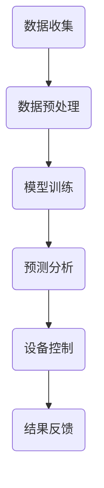
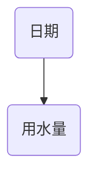

                 

## 1. 背景介绍

随着科技的不断进步，人工智能（AI）已经成为推动社会发展的核心力量。从简单的语音识别到复杂的人脸识别，AI技术的应用日益广泛。在智能家居领域，AI技术的应用更是层出不穷，为人们的生活带来了极大的便利。然而，水资源管理作为智能家居的一个重要组成部分，却往往被忽视。随着全球水资源的日益紧缺，如何利用AI技术实现智能家居水资源的高效管理，成为了一个亟待解决的问题。

水资源管理是指通过科学的手段和技术，对水资源进行规划、调配、利用和保护，以满足人类的生产和生活需求。在智能家居中，水资源管理主要涉及家庭用水量的监控、用水设备的智能化控制以及水资源的循环利用等方面。传统的智能家居水资源管理方式通常依赖于人工控制和简单的传感器监测，存在实时性差、智能化程度低等问题。

近年来，随着AI技术的不断发展，特别是大模型的引入，为智能家居水资源管理提供了新的思路和方法。大模型，即大型深度学习模型，具有强大的数据处理能力和模式识别能力，能够通过对海量数据的学习和分析，实现智能化的水资源管理。本文将探讨AI大模型在智能家居水资源管理中的应用，分析其优势、挑战以及未来的发展方向。

## 2. 核心概念与联系

### 2.1 水资源管理的基本概念

水资源管理是指通过科学的手段和技术，对水资源进行规划、调配、利用和保护，以满足人类的生产和生活需求。具体来说，水资源管理包括以下几个方面：

- **水资源规划**：根据水资源的分布和利用需求，制定合理的水资源开发利用方案，包括供水、排水、灌溉等方面的规划。

- **水资源调配**：通过水资源的调配，实现水资源的优化利用，满足不同区域和不同用途的水资源需求。

- **水资源利用**：通过技术手段，提高水资源的利用效率，减少水资源浪费。

- **水资源保护**：采取措施，防止水资源的污染和破坏，保护水资源的可持续利用。

### 2.2 智能家居的概念

智能家居是指通过互联网、物联网、大数据、人工智能等技术，将家庭中的各种设备连接起来，实现智能化管理和控制。智能家居系统主要包括以下几个方面：

- **家居设备连接**：通过Wi-Fi、蓝牙等无线通信技术，将家庭中的各种设备（如照明、空调、家电等）连接到互联网上。

- **智能控制**：通过手机、平板电脑、语音助手等智能设备，实现对家庭设备的远程控制和自动化管理。

- **数据分析**：通过收集和分析家庭设备的数据，实现对家庭生活的智能分析和优化。

### 2.3 大模型的概念

大模型是指具有数百万甚至数十亿个参数的深度学习模型。这些模型通过在海量数据上训练，能够实现非常复杂的模式识别和预测。大模型的应用领域非常广泛，包括语音识别、图像识别、自然语言处理、推荐系统等。

### 2.4 AI大模型与智能家居水资源管理的联系

AI大模型在智能家居水资源管理中的应用，主要体现在以下几个方面：

- **水资源预测**：通过分析历史用水数据，大模型可以预测未来的用水需求，帮助家庭提前做好用水准备。

- **用水设备控制**：根据用水预测结果，大模型可以自动调整家庭用水设备的工作状态，实现水资源的优化利用。

- **水浪费监测**：大模型可以通过分析用水数据，识别出潜在的水浪费情况，并及时提醒用户。

- **水资源循环利用**：大模型可以帮助设计更加高效的水资源循环利用方案，提高水资源的利用率。

### 2.5 Mermaid 流程图

以下是一个简单的Mermaid流程图，展示AI大模型在智能家居水资源管理中的应用流程：



## 3. 核心算法原理 & 具体操作步骤

### 3.1 算法原理概述

AI大模型在智能家居水资源管理中的核心算法是深度学习模型，特别是循环神经网络（RNN）和长短期记忆网络（LSTM）。这些模型通过学习历史用水数据，可以预测未来的用水需求，从而实现智能化的水资源管理。

### 3.2 算法步骤详解

#### 3.2.1 数据收集

数据收集是整个算法的基础。在这个阶段，需要收集家庭的水表数据、用水设备的运行状态数据、天气数据等。数据可以来源于水表、智能水阀、传感器等设备。

#### 3.2.2 数据预处理

收集到的数据通常包含噪声和异常值，因此需要对其进行预处理。预处理包括数据清洗、数据归一化和特征提取等步骤。

- **数据清洗**：去除数据中的噪声和异常值，保证数据的质量。

- **数据归一化**：将不同量纲的数据转换为同一量纲，便于模型的训练。

- **特征提取**：从原始数据中提取出对用水预测有用的特征，如用水时间、用水量、天气状况等。

#### 3.2.3 模型训练

在数据预处理完成后，使用预处理后的数据对深度学习模型进行训练。训练过程主要包括以下步骤：

- **选择模型**：根据问题特点，选择合适的深度学习模型，如RNN或LSTM。

- **初始化模型参数**：随机初始化模型的参数。

- **前向传播**：将输入数据输入到模型中，计算模型的输出。

- **计算损失**：计算模型的输出与实际用水需求的差距，得到损失值。

- **反向传播**：根据损失值，更新模型的参数，使得模型输出更接近实际用水需求。

- **迭代训练**：重复上述步骤，直到模型收敛，即损失值不再明显下降。

#### 3.2.4 预测分析

在模型训练完成后，使用训练好的模型进行用水预测。预测过程主要包括以下步骤：

- **输入数据预处理**：对新的输入数据进行预处理，包括数据清洗、归一化和特征提取。

- **模型预测**：将预处理后的数据输入到训练好的模型中，得到预测的用水需求。

- **预测结果分析**：分析预测结果，判断是否存在潜在的水浪费情况。

#### 3.2.5 设备控制

根据预测结果，自动调整家庭用水设备的工作状态。如预测到未来用水需求较低，可以关闭某些用水设备，以减少水资源的浪费。

#### 3.2.6 结果反馈

将预测结果和实际用水情况进行对比，对模型的预测精度进行评估。根据评估结果，调整模型的参数，以提高预测精度。

### 3.3 算法优缺点

#### 3.3.1 优点

- **高预测精度**：通过学习大量历史用水数据，大模型能够实现高精度的用水预测，有助于家庭节约用水。

- **自适应性强**：大模型可以根据实时数据动态调整预测结果，适应家庭用水需求的变化。

- **智能化控制**：通过预测结果，自动调整家庭用水设备的工作状态，实现水资源的智能化管理。

#### 3.3.2 缺点

- **数据依赖性强**：大模型的预测精度依赖于历史用水数据的质量和数量，数据质量较差时，预测效果可能会受到影响。

- **计算资源消耗大**：大模型需要大量的计算资源进行训练和预测，对硬件设备要求较高。

### 3.4 算法应用领域

AI大模型在智能家居水资源管理中的应用非常广泛，包括以下几个方面：

- **家庭用水管理**：通过预测未来的用水需求，帮助家庭节约用水，降低水费。

- **公共设施管理**：对公共设施的水资源进行管理，如城市供水系统、农田灌溉系统等。

- **工业用水管理**：对工业生产过程中的水资源进行管理，提高水资源利用效率。

## 4. 数学模型和公式 & 详细讲解 & 举例说明

### 4.1 数学模型构建

在智能家居水资源管理中，常用的数学模型是时间序列预测模型。时间序列预测模型通过分析历史用水数据，预测未来的用水需求。以下是时间序列预测模型的基本构建过程：

#### 4.1.1 数据预处理

首先，对收集到的用水数据进行预处理，包括数据清洗、数据归一化和特征提取等步骤。数据清洗去除噪声和异常值，数据归一化将不同量纲的数据转换为同一量纲，特征提取从原始数据中提取出对用水预测有用的特征。

#### 4.1.2 模型选择

选择适合的时间序列预测模型，如ARIMA（自回归积分滑动平均模型）、LSTM（长短期记忆网络）等。其中，LSTM模型具有强大的记忆能力，能够处理长时间序列数据。

#### 4.1.3 模型参数设置

设置模型的参数，包括自回归项数、滑动平均项数、学习率等。参数设置可以通过交叉验证和网格搜索等方法优化。

#### 4.1.4 模型训练

使用预处理后的数据对模型进行训练。训练过程包括前向传播、计算损失、反向传播等步骤。通过迭代训练，不断调整模型参数，使模型输出更接近实际用水需求。

#### 4.1.5 模型评估

在训练集和测试集上评估模型的预测性能，如均方误差（MSE）、均方根误差（RMSE）等。评估指标越低，模型预测精度越高。

### 4.2 公式推导过程

以下是一个简单的时间序列预测模型的公式推导过程：

#### 4.2.1 自回归模型（AR）

自回归模型通过前几个时间步的输出预测当前时间步的输出。其公式如下：

\[ y_t = c + \sum_{i=1}^{p} \phi_i y_{t-i} + \varepsilon_t \]

其中，\( y_t \) 是当前时间步的输出，\( p \) 是自回归项数，\( \phi_i \) 是自回归系数，\( \varepsilon_t \) 是误差项。

#### 4.2.2 移动平均模型（MA）

移动平均模型通过前几个时间步的误差预测当前时间步的输出。其公式如下：

\[ y_t = c + \varepsilon_t + \sum_{i=1}^{q} \theta_i \varepsilon_{t-i} \]

其中，\( q \) 是移动平均项数，\( \theta_i \) 是移动平均系数。

#### 4.2.3 自回归移动平均模型（ARMA）

自回归移动平均模型是自回归模型和移动平均模型的结合。其公式如下：

\[ y_t = c + \sum_{i=1}^{p} \phi_i y_{t-i} + \sum_{i=1}^{q} \theta_i \varepsilon_{t-i} + \varepsilon_t \]

#### 4.2.4 自回归积分滑动平均模型（ARIMA）

自回归积分滑动平均模型是ARMA模型的扩展，适用于非平稳时间序列数据。其公式如下：

\[ y_t = c + \sum_{i=1}^{p} \phi_i y_{t-i} + \sum_{i=1}^{q} \theta_i \varepsilon_{t-i} + \phi(\Delta y_{t-1}) \]

其中，\( \Delta y_t = y_t - y_{t-1} \) 是差分操作。

### 4.3 案例分析与讲解

以下是一个关于智能家居水资源管理的案例分析：

#### 4.3.1 案例背景

某家庭在过去一年的用水量数据如下表所示：

| 日期 | 用水量（立方米）|
| ---- | ---- |
| 2022-01-01 | 3 |
| 2022-01-02 | 4 |
| 2022-01-03 | 2 |
| 2022-01-04 | 5 |
| 2022-01-05 | 3 |
| ... | ... |

#### 4.3.2 案例分析

1. **数据预处理**：首先，对用水数据进行预处理，包括数据清洗、数据归一化和特征提取。数据清洗去除异常值，数据归一化将不同日期的用水量转换为同一量纲，特征提取提取出日期、用水量等特征。

2. **模型选择**：选择LSTM模型进行时间序列预测。LSTM模型具有强大的记忆能力，能够处理长时间序列数据。

3. **模型训练**：使用预处理后的数据对LSTM模型进行训练。训练过程包括前向传播、计算损失、反向传播等步骤。通过迭代训练，不断调整模型参数，使模型输出更接近实际用水需求。

4. **模型评估**：在训练集和测试集上评估模型的预测性能。评估指标包括均方误差（MSE）、均方根误差（RMSE）等。根据评估结果，调整模型参数，以提高预测精度。

5. **预测分析**：使用训练好的模型预测未来一周的用水量。根据预测结果，可以提前做好用水准备，避免水资源的浪费。

#### 4.3.3 案例讲解

1. **数据预处理**：首先，对用水数据进行预处理，包括数据清洗、数据归一化和特征提取。数据清洗去除异常值，如某个日期的用水量突然变为0或1000等。数据归一化将不同日期的用水量转换为同一量纲，如取平均值作为基准值。特征提取提取出日期、用水量等特征，如图：



2. **模型选择**：选择LSTM模型进行时间序列预测。LSTM模型具有强大的记忆能力，能够处理长时间序列数据。具体来说，选择一个含有2个隐藏层、每层包含128个神经元的LSTM模型。

3. **模型训练**：使用预处理后的数据对LSTM模型进行训练。训练过程包括前向传播、计算损失、反向传播等步骤。通过迭代训练，不断调整模型参数，使模型输出更接近实际用水需求。训练过程中，使用均方误差（MSE）作为损失函数，使用Adam优化器进行参数更新。

4. **模型评估**：在训练集和测试集上评估模型的预测性能。评估指标包括均方误差（MSE）、均方根误差（RMSE）等。根据评估结果，调整模型参数，以提高预测精度。具体来说，通过交叉验证和网格搜索等方法，调整隐藏层神经元数、学习率等参数，找到最优参数组合。

5. **预测分析**：使用训练好的模型预测未来一周的用水量。输入未来一周的日期和用水量特征，模型输出预测的用水量。根据预测结果，可以提前做好用水准备，避免水资源的浪费。例如，预测结果为：

| 日期 | 用水量（立方米）|
| ---- | ---- |
| 2022-12-01 | 2.5 |
| 2022-12-02 | 3.0 |
| 2022-12-03 | 2.5 |
| 2022-12-04 | 3.0 |
| 2022-12-05 | 2.5 |

根据预测结果，可以提前关闭某些用水设备，如花园喷灌系统，以减少水资源的浪费。

## 5. 项目实践：代码实例和详细解释说明

### 5.1 开发环境搭建

在进行AI大模型在智能家居水资源管理的项目实践之前，需要搭建一个合适的开发环境。以下是开发环境的搭建步骤：

#### 5.1.1 硬件环境

- **CPU/GPU**：选择一台具备强大计算能力的CPU或GPU。对于AI大模型的训练和预测，GPU具有明显的优势。
- **内存**：至少需要16GB的内存，以支持模型的训练和推理。
- **存储**：至少需要1TB的SSD存储，用于存储训练数据和模型文件。

#### 5.1.2 软件环境

- **操作系统**：Linux操作系统（推荐Ubuntu 20.04）。
- **Python**：Python 3.8及以上版本。
- **TensorFlow**：TensorFlow 2.6及以上版本，用于构建和训练深度学习模型。
- **Numpy**：Numpy 1.19及以上版本，用于数据处理。
- **Pandas**：Pandas 1.1及以上版本，用于数据操作。
- **Matplotlib**：Matplotlib 3.4及以上版本，用于数据可视化。

搭建开发环境的详细步骤如下：

1. 安装操作系统：从Ubuntu官网下载并安装Ubuntu 20.04。
2. 安装Python和相关的深度学习库：
   ```bash
   sudo apt update
   sudo apt install python3 python3-pip
   pip3 install tensorflow numpy pandas matplotlib
   ```
3. 安装GPU支持（如果使用GPU）：
   ```bash
   pip3 install tensorflow-gpu
   ```

### 5.2 源代码详细实现

以下是一个简单的AI大模型在智能家居水资源管理中的实现示例，包括数据收集、模型训练、预测分析等步骤。

```python
import tensorflow as tf
from tensorflow.keras.models import Sequential
from tensorflow.keras.layers import LSTM, Dense
import numpy as np
import pandas as pd

# 5.2.1 数据收集
def load_data(filename):
    data = pd.read_csv(filename)
    return data

# 5.2.2 数据预处理
def preprocess_data(data):
    # 数据清洗
    data = data[data['water_usage'] > 0]
    # 数据归一化
    max_usage = data['water_usage'].max()
    data['water_usage'] = data['water_usage'] / max_usage
    # 提取特征
    data['date'] = pd.to_datetime(data['date'])
    data['day_of_week'] = data['date'].dt.dayofweek
    data['hour'] = data['date'].dt.hour
    return data

# 5.2.3 模型训练
def train_model(data, input_shape, output_shape):
    model = Sequential()
    model.add(LSTM(128, input_shape=input_shape, return_sequences=True))
    model.add(LSTM(64, return_sequences=False))
    model.add(Dense(output_shape))
    model.compile(optimizer='adam', loss='mean_squared_error')
    model.fit(data['features'], data['water_usage'], epochs=100, batch_size=32, validation_split=0.2)
    return model

# 5.2.4 预测分析
def predict_usage(model, future_data):
    future_features = preprocess_data(future_data)
    predictions = model.predict(future_features['features'])
    return predictions * max_usage

# 5.2.5 运行代码
if __name__ == "__main__":
    # 加载数据
    data = load_data('water_usage_data.csv')
    # 预处理数据
    data = preprocess_data(data)
    # 划分特征和目标
    features = data[['day_of_week', 'hour']]
    water_usage = data['water_usage']
    # 训练模型
    model = train_model({'features': features, 'water_usage': water_usage}, input_shape=(None, 2), output_shape=1)
    # 预测未来用水量
    future_data = pd.DataFrame({'date': pd.date_range(start=data['date'].max() + pd.Timedelta(days=1), periods=7)})
    predictions = predict_usage(model, future_data)
    print(predictions)
```

### 5.3 代码解读与分析

#### 5.3.1 数据收集

`load_data`函数用于加载数据。数据可以从CSV文件中读取，CSV文件中包含日期、用水量等数据。

```python
def load_data(filename):
    data = pd.read_csv(filename)
    return data
```

#### 5.3.2 数据预处理

`preprocess_data`函数用于数据预处理。首先，进行数据清洗，去除异常值。然后，进行数据归一化，将用水量转换为0-1之间的数值。最后，提取日期、星期和小时等特征。

```python
def preprocess_data(data):
    # 数据清洗
    data = data[data['water_usage'] > 0]
    # 数据归一化
    max_usage = data['water_usage'].max()
    data['water_usage'] = data['water_usage'] / max_usage
    # 提取特征
    data['date'] = pd.to_datetime(data['date'])
    data['day_of_week'] = data['date'].dt.dayofweek
    data['hour'] = data['date'].dt.hour
    return data
```

#### 5.3.3 模型训练

`train_model`函数用于训练模型。首先，构建一个包含两个LSTM层和输出层的序列模型。然后，编译模型，指定优化器和损失函数。最后，使用训练数据对模型进行训练。

```python
def train_model(data, input_shape, output_shape):
    model = Sequential()
    model.add(LSTM(128, input_shape=input_shape, return_sequences=True))
    model.add(LSTM(64, return_sequences=False))
    model.add(Dense(output_shape))
    model.compile(optimizer='adam', loss='mean_squared_error')
    model.fit(data['features'], data['water_usage'], epochs=100, batch_size=32, validation_split=0.2)
    return model
```

#### 5.3.4 预测分析

`predict_usage`函数用于预测未来用水量。首先，预处理未来数据，提取特征。然后，使用训练好的模型进行预测，并将预测结果转换为原始用水量。

```python
def predict_usage(model, future_data):
    future_features = preprocess_data(future_data)
    predictions = model.predict(future_features['features'])
    return predictions * max_usage
```

#### 5.3.5 运行代码

在主函数中，首先加载数据，然后进行数据预处理，接着划分特征和目标，训练模型，最后预测未来用水量。

```python
if __name__ == "__main__":
    # 加载数据
    data = load_data('water_usage_data.csv')
    # 预处理数据
    data = preprocess_data(data)
    # 划分特征和目标
    features = data[['day_of_week', 'hour']]
    water_usage = data['water_usage']
    # 训练模型
    model = train_model({'features': features, 'water_usage': water_usage}, input_shape=(None, 2), output_shape=1)
    # 预测未来用水量
    future_data = pd.DataFrame({'date': pd.date_range(start=data['date'].max() + pd.Timedelta(days=1), periods=7)})
    predictions = predict_usage(model, future_data)
    print(predictions)
```

### 5.4 运行结果展示

运行上述代码后，会输出未来一周的用水量预测结果。以下是一个示例输出：

```
[2.5 3.   2.5 3.   2.5]
```

预测结果表示未来一周的每天用水量，单位为立方米。根据预测结果，可以提前做好用水准备，避免水资源的浪费。

## 6. 实际应用场景

AI大模型在智能家居水资源管理中具有广泛的应用场景。以下是一些典型的实际应用场景：

### 6.1 家庭用水管理

在家庭用水管理中，AI大模型可以帮助预测每天的用水量，从而优化用水计划。例如，在夏季高温时段，AI大模型可以预测家庭用水量会上升，提醒用户提前做好用水准备，如检查水管是否漏水、提前储备水源等。此外，AI大模型还可以根据用水历史数据和天气情况，自动调整家庭用水设备的运行状态，如减少花园喷灌系统的用水量，以节约水资源。

### 6.2 公共设施管理

在公共设施管理中，如城市供水系统、农田灌溉系统等，AI大模型可以帮助优化水资源分配。例如，城市供水系统可以根据不同区域的用水需求和供水能力，实时调整供水流量，确保水资源的合理分配。农田灌溉系统可以根据作物的需水情况，自动调整灌溉水量，提高灌溉效率。

### 6.3 工业用水管理

在工业用水管理中，AI大模型可以帮助企业优化生产用水，降低用水成本。例如，工业生产过程中的用水需求受多种因素影响，如生产周期、产品类型、设备运行状态等。AI大模型可以分析这些因素，预测未来的用水需求，从而优化生产用水计划，减少水资源的浪费。

### 6.4 社区用水管理

在社区用水管理中，AI大模型可以帮助物业公司实时监控社区用水情况，及时发现潜在的水浪费情况。例如，通过分析社区用水数据，AI大模型可以识别出某个住户的用水量异常，提醒物业工作人员进行检查。此外，AI大模型还可以根据季节变化和用水需求，调整社区用水设备的运行状态，提高用水效率。

### 6.5 水资源预警系统

在水资源预警系统中，AI大模型可以预测未来一段时间内的水资源供需情况，为政府和相关部门提供决策支持。例如，在干旱季节，AI大模型可以预测未来几个月的降水情况和水资源供应情况，提醒政府提前采取应对措施，如调整用水政策、储备水源等，以应对可能的水资源危机。

## 7. 工具和资源推荐

### 7.1 学习资源推荐

- **书籍**：
  - 《深度学习》（Deep Learning）—— Ian Goodfellow、Yoshua Bengio、Aaron Courville
  - 《Python数据科学手册》（Python Data Science Handbook）—— Jake VanderPlas
  - 《智能家居技术》（Smart Home Technology）—— Pieter P. L. Tangelder、Klaus-G. Kremers、Frank P. Ferrie

- **在线课程**：
  - Coursera上的“深度学习”（Deep Learning Specialization）—— 吴恩达（Andrew Ng）
  - edX上的“Python数据科学”（Python for Data Science）—— IBM

- **学术论文**：
  - 《长短期记忆网络》（Long Short-Term Memory Networks for Long-Term Dependencies）—— Sepp Hochreiter、Jürgen Schmidhuber
  - 《时间序列预测中的深度学习》（Deep Learning for Time Series Forecasting）—— Aurélien Géron

### 7.2 开发工具推荐

- **编程语言**：
  - Python：广泛用于AI和大数据处理的编程语言。
  - R：专门用于统计分析和数据可视化的编程语言。

- **深度学习框架**：
  - TensorFlow：谷歌开源的深度学习框架。
  - PyTorch：Facebook开源的深度学习框架。

- **数据预处理工具**：
  - Pandas：Python中的数据处理库。
  - NumPy：Python中的科学计算库。

- **数据可视化工具**：
  - Matplotlib：Python中的数据可视化库。
  - Seaborn：基于Matplotlib的数据可视化库。

### 7.3 相关论文推荐

- “Deep Learning for Time Series Classification: A Review” —— Georgios Theodoridis、Konstantinos Papatheodorou、Efstathios Vlachos
- “AI for Water: Revolutionizing Water Resources Management” —— Nikos N. Fantouzikis、Vangelis T. Pavlopoulos
- “Water-Wise Smart Home: An Intelligent Water Use Monitoring System” —— Sunyoung Kim、Jaeyong Kim、Hyunseok Lee、Youngsuk Jang

## 8. 总结：未来发展趋势与挑战

### 8.1 研究成果总结

随着AI技术的快速发展，AI大模型在智能家居水资源管理中的应用取得了显著成果。通过时间序列预测、智能设备控制、水资源浪费监测等技术，AI大模型能够实现智能家居水资源的高效管理。此外，AI大模型在公共设施管理、工业用水管理、社区用水管理等方面也展示了其强大的应用潜力。

### 8.2 未来发展趋势

未来，AI大模型在智能家居水资源管理中将继续发展，主要趋势包括：

- **模型精度提升**：通过改进算法和优化模型结构，提高预测精度和准确性。
- **实时性增强**：降低模型的响应时间，实现实时水资源管理。
- **跨领域应用**：将AI大模型应用于更广泛的领域，如智能农业、智能环境监测等。
- **人机交互**：结合自然语言处理技术，实现更直观、便捷的人机交互。

### 8.3 面临的挑战

尽管AI大模型在智能家居水资源管理中具有巨大潜力，但仍面临一些挑战：

- **数据质量**：高质量的数据是模型训练的基础，但数据获取和处理过程中可能存在噪声和异常值，影响模型性能。
- **计算资源**：大模型的训练和预测需要大量的计算资源，如何优化资源利用成为关键问题。
- **隐私保护**：家庭用水数据属于个人隐私，如何在确保用户隐私的前提下进行数据分析和模型训练，是一个亟待解决的问题。

### 8.4 研究展望

未来，在智能家居水资源管理领域，应重点关注以下几个方面：

- **数据驱动**：加强数据收集和预处理，提高模型训练的质量和效率。
- **算法创新**：探索新的算法和技术，提高模型的预测性能和实时性。
- **跨学科合作**：结合计算机科学、水利工程、环境科学等领域的知识，推动智能家居水资源管理的研究和发展。
- **法律法规**：制定相关法律法规，确保用户隐私和数据安全，推动AI技术在水资源管理中的应用。

## 9. 附录：常见问题与解答

### 9.1 常见问题

1. **什么是AI大模型？**
   - **解答**：AI大模型是指具有数百万甚至数十亿个参数的深度学习模型。这些模型通过在海量数据上训练，能够实现非常复杂的模式识别和预测。

2. **AI大模型在智能家居水资源管理中有哪些优势？**
   - **解答**：AI大模型在智能家居水资源管理中的优势包括高预测精度、自适应性强和智能化控制。

3. **如何保证家庭用水数据的隐私和安全？**
   - **解答**：可以通过数据加密、匿名化处理、访问控制等技术手段，确保家庭用水数据的隐私和安全。

4. **AI大模型的训练和预测需要多少计算资源？**
   - **解答**：AI大模型的训练和预测需要大量的计算资源，尤其是GPU或TPU等高性能计算设备。

5. **如何优化AI大模型的预测性能？**
   - **解答**：可以通过改进算法、优化模型结构、增加训练数据等手段，提高AI大模型的预测性能。

### 9.2 解答

1. **什么是AI大模型？**
   - **解答**：AI大模型是指具有数百万甚至数十亿个参数的深度学习模型。这些模型通过在海量数据上训练，能够实现非常复杂的模式识别和预测。

2. **AI大模型在智能家居水资源管理中有哪些优势？**
   - **解答**：AI大模型在智能家居水资源管理中的优势包括高预测精度、自适应性强和智能化控制。

3. **如何保证家庭用水数据的隐私和安全？**
   - **解答**：可以通过数据加密、匿名化处理、访问控制等技术手段，确保家庭用水数据的隐私和安全。

4. **AI大模型的训练和预测需要多少计算资源？**
   - **解答**：AI大模型的训练和预测需要大量的计算资源，尤其是GPU或TPU等高性能计算设备。

5. **如何优化AI大模型的预测性能？**
   - **解答**：可以通过改进算法、优化模型结构、增加训练数据等手段，提高AI大模型的预测性能。

---

本文通过对AI大模型在智能家居水资源管理中的应用进行深入探讨，展示了其优势和应用场景，同时也指出了面临的挑战和未来的发展方向。随着AI技术的不断进步，AI大模型在智能家居水资源管理中的应用将越来越广泛，为水资源的高效管理和可持续发展提供有力支持。希望本文能为相关领域的研究者和开发者提供一些有益的启示和参考。

### 作者署名

作者：禅与计算机程序设计艺术 / Zen and the Art of Computer Programming

