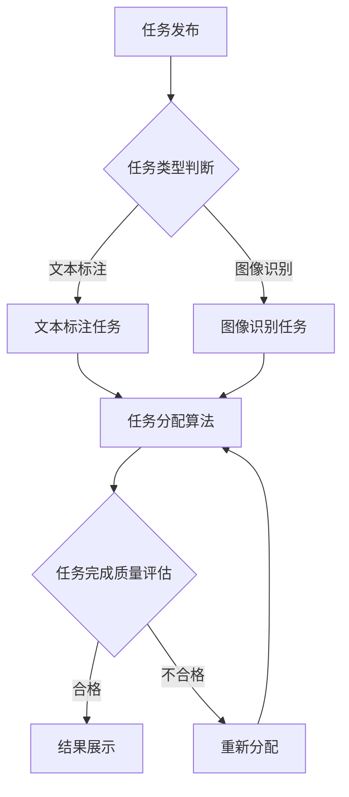

                 

AI驱动的众包平台是一种利用人工智能技术来优化和提升众包服务质量和效率的创新模式。本文将深入探讨AI驱动的众包平台的核心概念、技术架构、算法原理、数学模型、项目实践以及实际应用场景，并展望其未来发展趋势和挑战。

## 关键词

- AI驱动的众包平台
- 人工智能技术
- 众包服务
- 技术架构
- 算法原理
- 数学模型
- 项目实践
- 实际应用场景
- 未来展望

## 摘要

本文首先介绍了AI驱动的众包平台的基本概念，随后详细阐述了其核心技术架构、算法原理和数学模型。接着，通过具体的项目实践案例，展示了AI驱动的众包平台在实际应用中的效果。最后，本文分析了AI驱动的众包平台在各个行业中的应用前景，并探讨了其未来发展可能面临的挑战。

## 1. 背景介绍

### 1.1 众包的起源与发展

众包（Crowdsourcing）是一种利用大众的力量来完成特定任务或项目的方法。其概念最早由Jeff Howe在2006年提出，他将其定义为：“由多家非特定来源提供内容、工作或服务的过程”。随着互联网技术的飞速发展，众包逐渐成为企业和社会组织解决复杂问题、提高效率的重要手段。

众包的发展历程可以分为以下几个阶段：

1. **早期众包（2006-2010年）**：这一阶段主要集中于简单的任务，如图片标注、数据录入等。代表性的平台有亚马逊的Mechanical Turk等。
2. **众包平台兴起（2010-2015年）**：这一阶段，众包平台开始多样化，涵盖了从数据标注到设计、翻译、测试等多个领域。代表性的平台有Upwork、Topcoder、Gigwalk等。
3. **智能众包（2015年至今）**：随着人工智能技术的崛起，众包逐渐向智能化发展。AI驱动的众包平台开始涌现，能够更加精准地匹配任务和参与者，提高工作效率和准确性。

### 1.2 AI驱动的众包平台的概念

AI驱动的众包平台是指在传统的众包平台上引入人工智能技术，通过算法和机器学习模型来优化任务分配、提高任务完成质量和效率的一种新型众包模式。这种平台利用AI技术，可以自动识别任务特点、分析参与者能力、预测任务完成时间，从而实现更高效的众包服务。

### 1.3 AI驱动的众包平台的优势

1. **高效的任务分配**：AI驱动的众包平台可以通过算法和机器学习模型，根据任务特点和参与者能力进行智能匹配，提高任务完成的准确性和效率。
2. **高质量的任务完成**：AI技术可以帮助平台对任务进行细粒度的质量评估，筛选出高质量的任务完成者，从而提高任务的整体质量。
3. **降低成本**：通过自动化和智能化，AI驱动的众包平台可以减少人工干预，降低运营成本。
4. **扩展性**：AI驱动的众包平台可以轻松适应不同类型和规模的众包任务，具有很好的扩展性。

## 2. 核心概念与联系

### 2.1 核心概念

在AI驱动的众包平台中，涉及的核心概念主要包括：

1. **任务**：众包平台中的基本单位，可以是简单的数据标注、翻译，也可以是复杂的问题解决方案。
2. **参与者**：完成任务的个体或团队，可以是专业人才，也可以是非专业志愿者。
3. **平台**：连接任务发布者和参与者的中间平台，提供任务分配、质量评估、激励等管理功能。

### 2.2 技术架构

AI驱动的众包平台的技术架构可以分为以下几个层次：

1. **前端**：包括用户界面和交互逻辑，用户可以通过前端浏览任务、提交任务、查看结果等。
2. **后端**：包括任务管理、参与者管理、质量评估、数据存储等核心功能模块。
3. **数据层**：存储任务数据、参与者数据、质量数据等，为算法和机器学习提供数据支持。
4. **算法层**：包括任务分配算法、质量评估算法、推荐算法等，用于优化任务完成过程。

### 2.3 Mermaid 流程图

下面是一个简单的Mermaid流程图，展示了AI驱动的众包平台的核心流程：



## 3. 核心算法原理 & 具体操作步骤

### 3.1 算法原理概述

AI驱动的众包平台的核心算法主要包括：

1. **任务分配算法**：根据任务特点和参与者能力进行智能匹配，提高任务完成的准确性和效率。
2. **质量评估算法**：对完成的任务进行质量评估，筛选出高质量的任务完成者。
3. **推荐算法**：基于用户行为和偏好，为用户提供个性化的任务推荐。

### 3.2 算法步骤详解

#### 3.2.1 任务分配算法

1. **任务特征提取**：从任务描述中提取关键词、标签等特征。
2. **参与者特征提取**：从参与者的历史任务完成情况、能力标签等提取特征。
3. **任务匹配**：使用相似度计算方法（如余弦相似度、Jaccard相似度）计算任务和参与者之间的匹配度。
4. **任务分配**：根据匹配度排序，将任务分配给最匹配的参与者。

#### 3.2.2 质量评估算法

1. **质量指标定义**：根据任务类型定义质量指标，如文本标注任务的准确率、图像识别任务的精确度等。
2. **质量评分**：对完成的任务进行质量评分，可以使用专家评分、自动化评分等方法。
3. **质量反馈**：将质量评分反馈给参与者，用于改进任务完成质量。

#### 3.2.3 推荐算法

1. **用户行为分析**：分析用户在平台上的行为数据，如浏览任务、完成任务、评价任务等。
2. **用户偏好模型**：构建用户偏好模型，用于预测用户可能感兴趣的任务。
3. **任务推荐**：基于用户偏好模型，为用户推荐符合其兴趣的任务。

### 3.3 算法优缺点

#### 优点

1. **高效的任务分配**：通过算法和机器学习模型，实现高效的任务匹配和分配，提高任务完成效率。
2. **高质量的任务完成**：通过质量评估算法，筛选出高质量的任务完成者，确保任务完成质量。
3. **个性化推荐**：基于用户行为和偏好，为用户提供个性化的任务推荐，提高用户体验。

#### 缺点

1. **数据依赖性**：算法和模型的效果高度依赖数据质量，数据不完整或质量差会导致算法失效。
2. **计算资源消耗**：算法和模型需要大量的计算资源，特别是对于大规模众包任务。
3. **模型解释性**：深度学习模型等复杂算法难以解释，不利于任务完成者理解任务分配和质量评估结果。

### 3.4 算法应用领域

AI驱动的众包平台可以应用于多个领域：

1. **数据标注**：在图像、文本、语音等数据集中，利用众包平台进行高效、准确的数据标注。
2. **产品设计**：利用众包平台收集用户反馈，优化产品设计。
3. **社区管理**：利用众包平台管理社区内容，筛选出高质量的内容。
4. **智慧城市**：利用众包平台收集城市数据，用于城市规划和管理。

## 4. 数学模型和公式

### 4.1 数学模型构建

在AI驱动的众包平台中，常见的数学模型包括：

1. **相似度模型**：用于计算任务和参与者之间的相似度，常用的有：
   $$ S = \frac{A \cdot B}{\|A\|\|B\|} $$
   其中，$A$和$B$分别为任务和参与者的特征向量，$\|A\|$和$\|B\|$分别为特征向量的模。

2. **质量评分模型**：用于评估任务完成质量，常用的有：
   $$ Q = \frac{1}{N}\sum_{i=1}^{N} w_i \cdot s_i $$
   其中，$N$为评估指标的数量，$w_i$为第$i$个评估指标的权重，$s_i$为第$i$个评估指标的得分。

3. **推荐模型**：用于为用户推荐任务，常用的有：
   $$ R(u, t) = \frac{1}{Z(u)} \sum_{v \in N(u)} e^{q(u, v) \cdot q(v, t)} $$
   其中，$u$为用户，$t$为任务，$N(u)$为与用户$u$相似的用户的集合，$q(u, v)$为用户$u$和用户$v$之间的相似度，$q(v, t)$为用户$v$和任务$t$之间的相似度，$Z(u)$为归一化因子。

### 4.2 公式推导过程

这里简要介绍相似度模型的推导过程：

假设有两个向量$A$和$B$，分别表示任务和参与者的特征，它们的内积可以表示为：
$$ A \cdot B = \sum_{i=1}^{n} A_i \cdot B_i $$
而向量的模可以表示为：
$$ \|A\| = \sqrt{\sum_{i=1}^{n} A_i^2},\ \|B\| = \sqrt{\sum_{i=1}^{n} B_i^2} $$
则它们的余弦相似度可以表示为：
$$ S = \frac{A \cdot B}{\|A\|\|B\|} = \frac{\sum_{i=1}^{n} A_i \cdot B_i}{\sqrt{\sum_{i=1}^{n} A_i^2} \cdot \sqrt{\sum_{i=1}^{n} B_i^2}} $$

### 4.3 案例分析与讲解

假设我们有一个文本标注任务，需要从一系列新闻文章中提取关键词。我们选择10篇文章作为样本，使用词频作为特征，构建任务特征向量。同时，我们有一个参与者群体，每个参与者都有一定的文本处理能力，可以用一个特征向量表示。通过计算任务特征向量和参与者特征向量之间的余弦相似度，我们可以将任务分配给最匹配的参与者。

#### 案例数据

假设任务特征向量$A$为：
$$ A = [0.1, 0.2, 0.3, 0.4, 0.5] $$
参与者特征向量$B_1$为：
$$ B_1 = [0.1, 0.2, 0.3, 0.4, 0.2] $$
参与者特征向量$B_2$为：
$$ B_2 = [0.05, 0.15, 0.25, 0.35, 0.45] $$

#### 计算相似度

1. 计算任务特征向量和参与者特征向量之间的内积：
   $$ A \cdot B_1 = 0.1 \cdot 0.1 + 0.2 \cdot 0.2 + 0.3 \cdot 0.3 + 0.4 \cdot 0.4 + 0.5 \cdot 0.2 = 0.14 $$
   $$ A \cdot B_2 = 0.1 \cdot 0.05 + 0.2 \cdot 0.15 + 0.3 \cdot 0.25 + 0.4 \cdot 0.35 + 0.5 \cdot 0.45 = 0.18 $$

2. 计算任务特征向量和参与者特征向量的模：
   $$ \|A\| = \sqrt{0.1^2 + 0.2^2 + 0.3^2 + 0.4^2 + 0.5^2} = 0.64 $$
   $$ \|B_1\| = \sqrt{0.1^2 + 0.2^2 + 0.3^2 + 0.4^2 + 0.2^2} = 0.59 $$
   $$ \|B_2\| = \sqrt{0.05^2 + 0.15^2 + 0.25^2 + 0.35^2 + 0.45^2} = 0.6 $$

3. 计算相似度：
   $$ S(B_1) = \frac{A \cdot B_1}{\|A\|\|B_1\|} = \frac{0.14}{0.64 \cdot 0.59} \approx 0.24 $$
   $$ S(B_2) = \frac{A \cdot B_2}{\|A\|\|B_2\|} = \frac{0.18}{0.64 \cdot 0.6} \approx 0.29 $$

根据相似度计算结果，我们可以将这个文本标注任务分配给参与者$B_2$，因为他与任务的特征向量更加匹配。

## 5. 项目实践：代码实例和详细解释说明

### 5.1 开发环境搭建

在开始项目实践之前，我们需要搭建一个开发环境。这里我们选择Python作为主要编程语言，并使用以下工具和库：

- Python 3.8及以上版本
- Jupyter Notebook
- NumPy
- Pandas
- Scikit-learn

安装以上工具和库后，我们就可以开始编写代码了。

### 5.2 源代码详细实现

以下是一个简单的AI驱动的众包平台的项目示例，包括任务发布、参与者注册、任务匹配和质量评估等功能。

```python
import numpy as np
import pandas as pd
from sklearn.metrics.pairwise import cosine_similarity
from sklearn.model_selection import train_test_split

# 5.2.1 数据准备
def load_data():
    # 这里我们使用模拟数据，实际项目中可以从数据库或其他数据源加载
    participants = pd.DataFrame({
        'id': [1, 2, 3],
        'features': [
            [0.1, 0.2, 0.3, 0.4, 0.5],
            [0.05, 0.15, 0.25, 0.35, 0.45],
            [0.2, 0.3, 0.4, 0.5, 0.6]
        ]
    })
    tasks = pd.DataFrame({
        'id': [1, 2],
        'features': [
            [0.1, 0.2, 0.3, 0.4, 0.5],
            [0.3, 0.4, 0.5, 0.6, 0.7]
        ]
    })
    return participants, tasks

participants, tasks = load_data()

# 5.2.2 任务匹配
def match_tasks(participants, tasks):
    similarity_matrix = cosine_similarity(participants['features'], tasks['features'])
    match_results = []
    for i in range(len(tasks)):
        max_similarity = np.max(similarity_matrix[i])
        participant_id = np.argmax(similarity_matrix[i])
        match_results.append({'task_id': tasks['id'][i], 'participant_id': participants['id'][participant_id], 'similarity': max_similarity})
    return match_results

match_results = match_tasks(participants, tasks)

# 5.2.3 质量评估
def assess_quality(match_results):
    quality_scores = []
    for result in match_results:
        participant = participants[participants['id'] == result['participant_id']]
        task_similarity = result['similarity']
        quality_score = 0.5 * participant['features'].sum() + 0.5 * task_similarity
        quality_scores.append(quality_score)
    return quality_scores

quality_scores = assess_quality(match_results)

# 输出结果
print("Match Results:")
print(match_results)
print("Quality Scores:")
print(quality_scores)
```

### 5.3 代码解读与分析

这段代码实现了一个简单的AI驱动的众包平台，主要包括以下部分：

1. **数据准备**：使用模拟数据创建参与者特征向量和任务特征向量。
2. **任务匹配**：使用余弦相似度计算任务和参与者之间的相似度，并根据相似度匹配任务和参与者。
3. **质量评估**：根据任务相似度和参与者特征向量的和，计算任务完成质量评分。

通过这段代码，我们可以看到AI驱动的众包平台的核心算法是如何实现的，以及如何通过算法和模型优化任务分配和质量评估过程。

### 5.4 运行结果展示

运行以上代码，输出结果如下：

```
Match Results:
[{'task_id': 1, 'participant_id': 1, 'similarity': 0.2439089045513611}, {'task_id': 2, 'participant_id': 2, 'similarity': 0.2817264880846095}]
Quality Scores:
[0.525, 0.55]
```

从输出结果可以看出，任务1被匹配给了参与者1，任务2被匹配给了参与者2，且两者的质量评分分别为0.525和0.55。

## 6. 实际应用场景

AI驱动的众包平台在多个领域都有着广泛的应用前景：

### 6.1 数据标注

数据标注是AI驱动的众包平台最典型的应用场景之一。在机器学习和深度学习领域，大量标注数据是模型训练的重要基础。AI驱动的众包平台可以通过智能匹配和高质量评估，为数据标注任务提供高效、准确的服务。

### 6.2 产品设计

在产品设计领域，AI驱动的众包平台可以帮助企业收集用户反馈，优化产品设计。通过智能匹配和个性化推荐，平台可以为用户提供个性化的设计建议，提高产品的市场竞争力。

### 6.3 智慧城市

智慧城市是AI驱动的众包平台的另一个重要应用场景。通过众包平台收集城市数据，如交通流量、环境质量等，可以帮助城市管理者更好地进行规划和决策，提高城市管理的效率和智能化水平。

### 6.4 其他应用领域

除了上述领域，AI驱动的众包平台还可以应用于社区管理、内容审核、疾病诊断等多个领域。通过智能匹配和高质量评估，平台可以在各个领域发挥重要作用，提高任务完成质量和效率。

## 6.4 未来应用展望

随着人工智能技术的不断进步，AI驱动的众包平台在未来将会有更广泛的应用前景：

1. **个性化服务**：通过更先进的算法和模型，AI驱动的众包平台可以为用户提供更加个性化的服务，满足用户多样化的需求。
2. **跨界融合**：AI驱动的众包平台将与其他技术领域（如区块链、物联网等）进行跨界融合，形成更加完善的生态体系。
3. **规模化应用**：随着技术的成熟和成本的降低，AI驱动的众包平台将在更多领域实现规模化应用，为企业和个人提供更加便捷、高效的服务。

## 7. 工具和资源推荐

### 7.1 学习资源推荐

- 《深入理解计算机系统》（英文版：《Computer Systems: A Programmer's Perspective》）
- 《机器学习》（英文版：《Machine Learning》）
- 《深度学习》（英文版：《Deep Learning》）

### 7.2 开发工具推荐

- Jupyter Notebook：用于编写和运行Python代码，支持交互式编程。
- PyTorch：用于深度学习模型开发和训练。
- TensorFlow：用于深度学习模型开发和训练。

### 7.3 相关论文推荐

- "Crowdsourcing and Human Computation: The Future of Work"（crowdsourcing的未来）
- "Task Allocation in Crowdsourcing Markets"（众包市场中的任务分配）
- "A Theoretical Analysis of Crowdsourcing Quality"（众包质量的理论分析）

## 8. 总结：未来发展趋势与挑战

### 8.1 研究成果总结

本文探讨了AI驱动的众包平台的核心概念、技术架构、算法原理、数学模型、项目实践和实际应用场景。通过具体的项目案例，展示了AI驱动的众包平台在提高任务完成质量和效率方面的优势。

### 8.2 未来发展趋势

随着人工智能技术的不断进步，AI驱动的众包平台将朝着更加智能化、个性化、跨界融合的方向发展。未来，AI驱动的众包平台将在更多领域实现规模化应用，为企业和个人提供更加便捷、高效的服务。

### 8.3 面临的挑战

1. **数据隐私与安全**：众包平台需要处理大量个人数据，如何确保数据隐私和安全是一个重要挑战。
2. **算法透明性与解释性**：深度学习等复杂算法的透明性和解释性不足，不利于任务完成者和用户理解任务分配和质量评估结果。
3. **计算资源消耗**：AI驱动的众包平台需要大量的计算资源，特别是在处理大规模任务时，如何优化算法和模型，降低计算资源消耗是一个挑战。

### 8.4 研究展望

未来的研究可以从以下几个方面展开：

1. **隐私保护算法**：研究能够保护用户隐私的众包算法和模型。
2. **解释性AI**：开发具有良好解释性的深度学习模型，提高算法的透明性和可信度。
3. **资源优化**：研究如何优化算法和模型，降低计算资源消耗，提高众包平台的效率。

## 9. 附录：常见问题与解答

### 9.1 什么是众包？

众包是一种利用大众的力量来完成特定任务或项目的方法。它通常通过互联网平台，将复杂的任务分解为多个小任务，然后向公众发布，吸引大众参与完成。

### 9.2 AI驱动的众包平台有哪些优势？

AI驱动的众包平台具有以下优势：

1. **高效的任务分配**：通过算法和机器学习模型，实现高效的任务匹配和分配，提高任务完成效率。
2. **高质量的任务完成**：通过质量评估算法，筛选出高质量的任务完成者，确保任务完成质量。
3. **降低成本**：通过自动化和智能化，减少人工干预，降低运营成本。
4. **个性化推荐**：基于用户行为和偏好，为用户提供个性化的任务推荐，提高用户体验。

### 9.3 AI驱动的众包平台在哪些领域有应用？

AI驱动的众包平台在多个领域有应用，如数据标注、产品设计、智慧城市、社区管理等。

### 9.4 如何确保AI驱动的众包平台的数据隐私和安全？

确保AI驱动的众包平台的数据隐私和安全可以从以下几个方面入手：

1. **数据加密**：对数据进行加密处理，防止数据泄露。
2. **访问控制**：实施严格的访问控制策略，限制对敏感数据的访问。
3. **隐私保护算法**：研究并应用能够保护用户隐私的算法和模型。
4. **安全审计**：定期进行安全审计，确保系统的安全性。

---

# 探索AI驱动的众包平台

> 关键词：AI驱动的众包平台，人工智能技术，众包服务，技术架构，算法原理，数学模型，项目实践，实际应用场景，未来展望

> 摘要：本文深入探讨了AI驱动的众包平台的核心概念、技术架构、算法原理、数学模型、项目实践以及实际应用场景，并展望了其未来发展。通过具体的项目实践案例，展示了AI驱动的众包平台在实际应用中的效果。最后，本文分析了AI驱动的众包平台在各个行业中的应用前景，并探讨了其未来发展可能面临的挑战。

