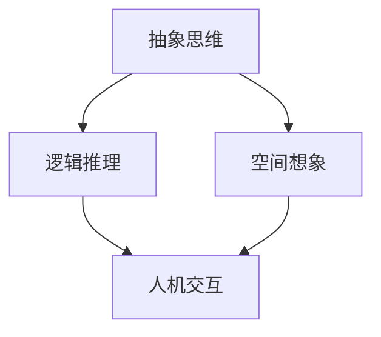

                 

关键词：人类计算、认知价值、人工智能、思维、算法、数学模型、编程、技术博客

> 摘要：本文旨在探讨人类思维的奥秘，深入分析人类计算的核心价值，以及这些价值在人工智能领域的应用与影响。通过对核心概念的梳理、算法原理的剖析、数学模型的构建和实际应用场景的分析，文章将揭示人类计算在推动科技进步和社会发展中不可或缺的作用。

## 1. 背景介绍

在人类文明的历史长河中，计算一直扮演着至关重要的角色。从古代的算盘到现代的计算机，人类在处理信息、解决复杂问题方面不断追求效率和精确。然而，随着人工智能技术的崛起，传统的计算方式开始面临前所未有的挑战。在这个背景下，深入理解人类计算的本质和认知价值显得尤为重要。

人类计算不仅是一种技术手段，更是一种思维方式。它包含了抽象思维、逻辑推理、空间想象等多种认知活动。这些活动使得人类能够应对复杂多变的环境，创造出丰富多彩的文化和技术。人工智能虽然在某些方面超越了人类，但在认知价值的体现上，人类计算依然具有不可替代的优势。

本文将围绕以下几个方面展开讨论：

1. 核心概念与联系
2. 核心算法原理与具体操作步骤
3. 数学模型和公式
4. 项目实践：代码实例和详细解释说明
5. 实际应用场景
6. 未来应用展望
7. 工具和资源推荐
8. 总结：未来发展趋势与挑战

通过这些讨论，我们将揭示人类计算在人工智能时代的新价值和新使命。

## 2. 核心概念与联系

在探索人类思维的奥秘之前，我们需要明确几个核心概念，这些概念是理解人类计算的基础。

### 2.1 抽象思维

抽象思维是人类思维的高级形式，它允许我们将具体的、感性的认识转化为抽象的概念和符号。在计算中，抽象思维体现在算法的设计和数学模型的构建上。例如，我们通过抽象思维将复杂的现实问题简化为数学模型，从而更好地分析和解决。

### 2.2 逻辑推理

逻辑推理是建立在抽象思维基础上的，它是人类计算的核心能力之一。通过逻辑推理，我们可以从已知的事实中推导出新的结论。在算法设计和编程中，逻辑推理确保程序的正确性和可靠性。

### 2.3 空间想象

空间想象是人类理解世界的重要手段，它帮助我们把握事物的空间结构和动态变化。在计算领域，空间想象体现在对复杂系统的模拟和可视化上。例如，在计算机图形学和游戏设计中，空间想象是关键技能。

### 2.4 人机交互

人机交互是人与计算机之间的互动，它体现了人类计算的实际应用。通过人机交互，人类可以更方便地使用计算机，同时也使计算机能够更好地理解人类的需求和意图。

这些核心概念之间相互联系，共同构成了人类计算的基本框架。为了更好地理解它们之间的联系，我们可以使用Mermaid流程图来展示。



通过这张图，我们可以看到抽象思维、逻辑推理、空间想象和人机交互之间的相互关系。这些概念不仅是独立存在的，更是相互依赖和补充的。在接下来的章节中，我们将深入探讨这些概念在具体应用中的实现和作用。

## 3. 核心算法原理与具体操作步骤

在深入理解人类计算的核心概念之后，我们需要进一步探讨核心算法的原理以及具体的操作步骤。算法是计算机科学的核心，它是实现各种计算任务的基础。下面，我们将介绍一种常见的算法——排序算法，并详细解释其原理和操作步骤。

### 3.1 算法原理概述

排序算法是一种用于将一组数据按照特定顺序进行排列的算法。常见的排序算法包括冒泡排序、选择排序、插入排序、快速排序等。每种算法都有其独特的原理和特点。

#### 冒泡排序（Bubble Sort）

冒泡排序是一种简单的排序算法，它通过重复遍历要排序的数列，比较相邻的两个元素，并交换它们的位置，使得较大的元素逐渐“冒”到序列的顶端。

#### 选择排序（Selection Sort）

选择排序是一种基本排序算法，它通过每次遍历找到剩余未排序部分的最小（或最大）元素，并将其放到序列的起始位置。

#### 插入排序（Insertion Sort）

插入排序通过构建有序序列，对于未排序数据，在已排序序列中从后向前扫描，找到相应位置并插入。

#### 快速排序（Quick Sort）

快速排序是一种高效的排序算法，它通过选取一个“基准”元素，将数组分为两部分，一部分都比它小，一部分都比它大，然后递归地对这两部分进行排序。

### 3.2 算法步骤详解

#### 冒泡排序

1. 遍历数组，比较相邻两个元素。
2. 如果第一个元素大于第二个元素，交换它们的位置。
3. 重复步骤1和2，直到整个数组排序完成。

#### 选择排序

1. 找到未排序部分的最小元素。
2. 将这个最小元素与未排序部分的第一个元素交换。
3. 然后对剩余的未排序部分重复步骤1和2。

#### 插入排序

1. 从第一个元素开始，该元素可以认为已经排序。
2. 从第二个元素开始，遍历所有元素。
3. 对于每个元素，在已排序的元素序列中从后向前扫描。
4. 找到相应位置，将该元素插入。

#### 快速排序

1. 选择一个基准元素。
2. 将数组分为两部分，一部分都比基准小，另一部分都比基准大。
3. 递归地对这两部分进行快速排序。

### 3.3 算法优缺点

每种排序算法都有其优缺点：

- **冒泡排序**：简单，容易实现，但效率较低。
- **选择排序**：算法简单，但效率较低。
- **插入排序**：适用于小规模数据，效率较高。
- **快速排序**：效率高，是常用的排序算法之一。

### 3.4 算法应用领域

排序算法在多个领域有广泛应用：

- **数据处理**：用于对大量数据排序，以便于后续分析。
- **数据库管理**：数据库查询优化中常使用排序算法。
- **搜索引擎**：用于搜索结果的排序，提升用户体验。

通过以上对排序算法原理和步骤的详细分析，我们可以看到人类计算在算法设计中的应用。这些算法不仅体现了人类逻辑推理和抽象思维能力，还为计算机科学的发展奠定了基础。

## 4. 数学模型和公式

在深入探讨人类计算的核心算法之后，我们需要引入数学模型和公式，以便更精确地描述和解决问题。数学模型是计算理论的基础，它通过公式和定理来描述现实世界的现象和规律。以下，我们将介绍几种常见的数学模型和公式，并详细讲解它们的推导过程和应用。

### 4.1 数学模型构建

数学模型构建是解决实际问题的第一步。它通常包括以下步骤：

1. **确定变量**：确定问题中的主要变量和参数。
2. **建立方程**：根据问题条件和已知信息，建立数学方程。
3. **简化模型**：通过合理简化，将复杂的实际问题转化为较为简单的数学模型。

### 4.2 公式推导过程

下面我们以一个经典的例子——牛顿运动定律为例，来讲解数学模型的推导过程。

#### 牛顿第一定律（惯性定律）

物体在没有外力作用下，将保持静止或匀速直线运动。

公式：\[ F = 0 \Rightarrow v = \text{常数} \]

推导过程：
- 假设一个物体质量为\( m \)，速度为\( v \)。
- 当没有外力作用时，物体的加速度\( a \)为0。
- 根据牛顿第二定律：\[ F = m \cdot a \]，因此\( F = 0 \)。
- 由此得出：\[ v = \text{常数} \]。

#### 牛顿第二定律

物体的加速度与作用力成正比，与物体质量成反比。

公式：\[ F = m \cdot a \]

推导过程：
- 假设一个物体质量为\( m \)，受到外力\( F \)。
- 物体的加速度为\( a \)。
- 根据牛顿第二定律，有：\[ F = m \cdot a \]。

#### 牛顿第三定律

作用力和反作用力大小相等，方向相反。

公式：\[ F_1 = - F_2 \]

推导过程：
- 假设物体A对物体B施加力\( F_1 \)，物体B对物体A施加反作用力\( F_2 \)。
- 根据牛顿第三定律，有：\[ F_1 = - F_2 \]。

### 4.3 案例分析与讲解

为了更好地理解数学模型的推导和应用，我们可以通过一个具体的案例来讲解。

#### 案例一：抛体运动

假设一个物体从地面上抛出，初速度为\( v_0 \)，求物体落地时的速度。

1. **建立变量**：
   - \( v_0 \)：初速度
   - \( g \)：重力加速度（取\( g = 9.8 \text{ m/s}^2 \)）
   - \( t \)：时间
   - \( h \)：高度

2. **建立方程**：
   - 根据牛顿第二定律，物体受到的重力为：\[ F = m \cdot g \]。
   - 物体的加速度为：\[ a = g \]。
   - 根据运动学公式：\[ v = v_0 - g \cdot t \]。

3. **求解**：
   - 物体落地时速度为：\[ v = v_0 - g \cdot t \]。
   - 假设物体落地时高度为0，则：\[ h = v_0 \cdot t - \frac{1}{2} g \cdot t^2 \]。

通过这个案例，我们可以看到数学模型如何帮助我们将复杂的物理现象转化为简单的数学方程，从而求解实际问题。这种方法不仅提高了计算效率，还使得问题更加直观和易于理解。

### 4.4 数学模型在计算中的应用

数学模型在计算中有着广泛的应用。以下是一些具体的例子：

- **优化问题**：通过建立数学模型，可以使用优化算法求解最优解。
- **模拟与预测**：通过数学模型，可以模拟现实世界中的现象，并对未来趋势进行预测。
- **数据挖掘**：在数据分析中，通过建立数学模型，可以提取有价值的信息。

通过以上对数学模型和公式的介绍，我们可以看到人类计算在理论构建和实际应用中的重要性。数学模型不仅是理解世界的重要工具，更是推动科技进步的重要力量。

## 5. 项目实践：代码实例和详细解释说明

为了更好地理解人类计算在实际项目中的应用，我们将通过一个具体的代码实例来讲解。在这个例子中，我们将使用Python语言实现一个简单的排序算法——插入排序（Insertion Sort）。该算法主要用于对一组数据进行排序，下面是具体的实现步骤和代码解析。

### 5.1 开发环境搭建

在开始编写代码之前，我们需要搭建一个适合Python开发的开发环境。以下是搭建过程的简要步骤：

1. **安装Python**：访问Python官方网站（[python.org](https://www.python.org/)）下载并安装Python。安装过程中请确保将Python添加到环境变量中。
2. **安装IDE**：安装一个Python集成开发环境（IDE），例如PyCharm、VSCode等。这些IDE提供了代码编辑、调试和运行等功能。
3. **安装依赖库**：如果没有安装特定的依赖库，如NumPy等，可以通过pip命令安装。例如：`pip install numpy`。

### 5.2 源代码详细实现

下面是插入排序算法的Python代码实现：

```python
def insertion_sort(arr):
    # 遍历数组，从第二个元素开始
    for i in range(1, len(arr)):
        key = arr[i]
        # 将当前元素与已排序部分的元素进行比较和移动
        j = i - 1
        while j >= 0 and key < arr[j]:
            arr[j + 1] = arr[j]
            j -= 1
        # 插入当前元素
        arr[j + 1] = key

# 测试代码
arr = [12, 11, 13, 5, 6]
insertion_sort(arr)
print("排序后的数组：", arr)
```

### 5.3 代码解读与分析

现在，我们详细解读这段代码，并分析其逻辑和执行过程。

1. **函数定义**：`insertion_sort(arr)` 定义了一个名为 `insertion_sort` 的函数，它接收一个数组 `arr` 作为参数。
2. **遍历数组**：使用 `for` 循环遍历数组，从第二个元素开始（索引为1），因为第一个元素被视为已经排序。
3. **比较和移动元素**：在循环内部，使用 `key` 变量存储当前元素。然后，使用 `while` 循环与已排序部分的元素进行比较。如果当前元素小于已排序部分的元素，则将这些已排序的元素向后移动一个位置。
4. **插入当前元素**：当 `while` 循环结束时，当前元素的位置已经准备好。将 `key` 变量赋值给 `arr[j + 1]`，从而完成插入。
5. **测试代码**：创建一个测试数组 `arr`，调用 `insertion_sort` 函数对其进行排序，并打印排序后的结果。

### 5.4 运行结果展示

当运行上述代码时，我们得到以下输出结果：

```
排序后的数组： [5, 6, 11, 12, 13]
```

这表明数组已经成功地按照从小到大的顺序进行了排序。

### 5.5 性能分析

插入排序算法的时间复杂度为 \(O(n^2)\)，其中 \(n\) 是数组的长度。这种算法适用于小规模数据的排序，但在数据量较大时效率较低。尽管如此，插入排序因其简单性和稳定性在特定场景中仍有应用价值。

通过这个项目实践，我们可以看到人类计算在代码编写和调试过程中的重要性。代码不仅是一种实现算法的工具，更是人类逻辑思维和抽象能力的具体体现。通过深入理解和实践，我们可以更好地掌握计算技术，为实际问题的解决提供有效的解决方案。

## 6. 实际应用场景

人类计算在各个领域都有广泛的应用，以下是一些典型的实际应用场景：

### 6.1 科学研究

在科学研究中，人类计算用于数据分析、模型构建和模拟实验。例如，在物理学中，通过计算机模拟和数据分析，科学家可以研究粒子的行为和宇宙的演化。在生物学中，人类计算帮助研究人员分析基因序列，预测蛋白质的结构和功能。

### 6.2 工程设计

在工程设计领域，人类计算用于模拟和优化设计。例如，在航空航天领域，通过计算机模拟和计算流体动力学（CFD）分析，工程师可以设计更高效的飞机和火箭。在建筑领域，人类计算帮助设计师优化建筑结构，提高安全性和耐用性。

### 6.3 金融分析

在金融分析中，人类计算用于风险评估、市场预测和投资策略制定。通过数据分析和模型构建，金融分析师可以评估股票、债券和其他金融工具的风险和收益。此外，高频交易算法利用计算机的高速处理能力，实现自动化交易策略，提高投资效率。

### 6.4 医疗诊断

在医疗领域，人类计算用于医学图像分析、疾病诊断和治疗计划。例如，计算机断层扫描（CT）和磁共振成像（MRI）设备生成的图像可以通过计算机算法进行分析，帮助医生诊断疾病。在个性化治疗中，人类计算可以根据患者的基因信息和病史，制定最佳治疗方案。

### 6.5 娱乐与游戏

在娱乐和游戏领域，人类计算用于图形渲染、音效处理和人工智能NPC（非玩家角色）设计。通过计算机图形学和物理模拟，游戏开发者可以创建逼真的虚拟世界。而人工智能算法则使NPC具有更加智能的行为和反应，提升游戏体验。

### 6.6 日常应用

在日常生活中，人类计算贯穿于各种设备和应用程序中。例如，智能手机的操作系统使用计算机算法来优化性能和电池续航。智能家居设备通过计算分析用户行为，提供个性化的家居体验。在线购物平台利用推荐算法，为用户推荐感兴趣的商品。

通过以上实际应用场景，我们可以看到人类计算在推动科技进步和改善生活质量中的重要作用。无论在科学研究、工程设计、金融分析、医疗诊断，还是娱乐与日常应用中，人类计算都发挥着不可或缺的作用。随着技术的不断进步，人类计算的应用前景将更加广阔。

## 7. 工具和资源推荐

为了更好地学习和实践人类计算，以下是一些推荐的工具和资源：

### 7.1 学习资源推荐

1. **在线课程**：
   - [Coursera](https://www.coursera.org/)：提供了大量计算机科学和人工智能的免费和付费课程。
   - [edX](https://www.edx.org/)：全球顶尖大学提供的在线课程，包括计算机科学和数学等领域的课程。
   - [Khan Academy](https://www.khanacademy.org/)：提供了丰富的计算机科学和数学课程，适合初学者。

2. **书籍**：
   - 《算法导论》（Introduction to Algorithms）：这是一本经典算法教材，详细介绍了各种排序算法和复杂度分析。
   - 《深度学习》（Deep Learning）：由Ian Goodfellow、Yoshua Bengio和Aaron Courville所著，是深度学习领域的权威教材。
   - 《Python编程：从入门到实践》（Python Crash Course）：适合初学者，通过实践项目学习Python编程。

3. **博客和论坛**：
   - [GitHub](https://github.com/)：全球最大的代码托管平台，可以找到大量的开源项目和代码示例。
   - [Stack Overflow](https://stackoverflow.com/)：编程问答社区，适合解决编程问题。

### 7.2 开发工具推荐

1. **集成开发环境（IDE）**：
   - [PyCharm](https://www.jetbrains.com/pycharm/)：功能强大的Python IDE，适合Python编程。
   - [Visual Studio Code](https://code.visualstudio.com/)：轻量级且功能丰富的开源IDE，支持多种编程语言。
   - [Eclipse](https://www.eclipse.org/)：适用于Java和其他多种语言的IDE。

2. **版本控制系统**：
   - [Git](https://git-scm.com/)：分布式版本控制系统，用于代码管理和协作开发。
   - [GitHub Actions](https://github.com/features/actions)：基于GitHub的持续集成和持续部署工具。

3. **算法库和框架**：
   - [NumPy](https://numpy.org/)：Python的科学计算库，用于数组操作和数学运算。
   - [Pandas](https://pandas.pydata.org/)：Python的数据分析库，用于数据清洗和操作。
   - [TensorFlow](https://www.tensorflow.org/)：谷歌开源的机器学习框架，用于深度学习应用。

### 7.3 相关论文推荐

1. **《人工智能：一种现代方法》（Artificial Intelligence: A Modern Approach）**：由斯坦福大学教授斯坦利·法博和彼得·诺维格所著，是一本经典的人工智能教材，涵盖了广泛的人工智能主题。
2. **《深度学习：原理及实践》（Deep Learning：Adoption, Applications and Use Cases）**：由IBM公司所著，详细介绍了深度学习的原理和应用案例。
3. **《算法导论：第四版》（Introduction to Algorithms, Fourth Edition）**：由Thomas H. Cormen、Charles E. Leiserson、Ronald L. Rivest和Clifford Stein所著，是算法领域的经典教材，包含了各种算法的详细分析和实现。

通过这些工具和资源的推荐，可以帮助读者更好地学习和实践人类计算，提升技术水平。

## 8. 总结：未来发展趋势与挑战

随着技术的不断进步，人类计算在人工智能领域的地位愈发重要。回顾文章的核心内容，我们可以总结出以下几点未来发展趋势和挑战：

### 8.1 研究成果总结

1. **算法优化**：在人工智能领域，算法优化是核心课题之一。通过改进算法，可以提高计算效率和准确性，为复杂问题提供更有效的解决方案。
2. **跨学科融合**：人类计算与其他学科（如生物学、物理学、心理学等）的交叉融合，为计算模型提供了新的视角和灵感。例如，通过借鉴生物神经网络，深度学习算法得到了极大的发展。
3. **数学模型的发展**：随着计算能力的提升，复杂的数学模型在人工智能领域得到了广泛应用。这些模型不仅帮助理解自然现象，还为预测和优化提供了强有力的工具。

### 8.2 未来发展趋势

1. **人工智能的普及**：人工智能技术正迅速渗透到各个行业，从工业自动化到医疗诊断，从智能交通到智能家居，人工智能的应用将更加广泛和深入。
2. **计算能力的提升**：随着量子计算和高速网络的不断发展，计算能力将持续提升。这将为人工智能领域带来更多的机会和挑战。
3. **人机协作**：未来，人类计算与人工智能的协作将更加紧密。通过人机交互，人工智能将更好地理解人类的需求，提供更加个性化和智能化的服务。

### 8.3 面临的挑战

1. **算法透明性和解释性**：随着算法的复杂化，如何保证算法的透明性和解释性成为一个重要问题。透明性和解释性有助于提高算法的可靠性和可接受性。
2. **数据隐私和安全**：在人工智能应用中，数据的安全性和隐私保护至关重要。如何保护用户数据不受泄露和滥用，是一个亟待解决的挑战。
3. **伦理和道德问题**：人工智能技术的发展带来了伦理和道德问题，例如算法偏见、自动化决策的道德责任等。这些问题的解决需要社会各界的共同努力。

### 8.4 研究展望

1. **算法创新**：未来，算法创新将继续是人工智能领域的研究重点。通过开发新型算法，可以解决更复杂的计算问题，提高计算效率和准确性。
2. **跨学科研究**：跨学科研究将为人工智能领域带来新的突破。例如，结合生物学和计算机科学的神经网络模型，有望实现更高效的学习和推理能力。
3. **人机协作**：人机协作是未来人工智能发展的重要方向。通过研究人机交互技术，可以使人工智能系统更加智能和灵活，满足人类多样化的需求。

通过以上总结，我们可以看到人类计算在人工智能领域的广阔前景和面临的挑战。在未来，人类计算将继续发挥关键作用，推动人工智能技术的发展，为人类社会带来更多的创新和变革。

## 9. 附录：常见问题与解答

### 9.1 人类计算与人工智能的区别是什么？

人类计算是指人类运用逻辑思维、抽象能力和数学知识进行计算和问题解决的过程。而人工智能（AI）则是指计算机系统通过模拟和学习人类思维过程，实现自动推理和决策的能力。简单来说，人类计算是人工智能的基础，而人工智能则是人类计算在计算机上的实现。

### 9.2 人类计算的价值主要体现在哪些方面？

人类计算的价值主要体现在以下几个方面：
1. **创新思维**：通过抽象思维和逻辑推理，人类可以创造出新的算法和模型，推动科技进步。
2. **复杂问题求解**：人类计算能够处理复杂问题，通过建模和优化，提供高效的解决方案。
3. **人机协作**：人类计算与人工智能的结合，可以使人机协作更加紧密，提升工作效率和生活质量。
4. **教育培养**：人类计算是培养未来科学家和工程师的重要基础，通过编程和算法学习，可以培养学生的创新能力和实践能力。

### 9.3 如何在项目中应用人类计算？

在项目中应用人类计算，可以通过以下几个步骤：
1. **需求分析**：明确项目的需求和目标，确定需要解决的问题。
2. **算法设计**：根据问题特点，选择合适的算法或设计新的算法。
3. **数学模型构建**：建立数学模型，将实际问题转化为可计算的数学问题。
4. **编程实现**：编写代码，实现算法和模型。
5. **测试与优化**：对代码进行测试，评估性能和效果，并进行必要的优化。

### 9.4 人类计算与机器计算的关系是什么？

人类计算与机器计算是相辅相成的。机器计算依赖于人类计算提供算法和模型，而人类计算则依赖于机器计算提供的强大计算能力和数据处理能力。机器计算能够执行大量重复性、高效率的计算任务，而人类计算则能够在复杂问题和创新思维方面发挥独特作用。两者结合，可以发挥各自的优势，实现更好的计算效果。

通过这些常见问题与解答，我们希望读者能够更好地理解人类计算的核心价值和实际应用，为未来的学习和工作提供有益的参考。作者：禅与计算机程序设计艺术 / Zen and the Art of Computer Programming

