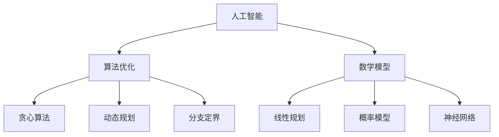
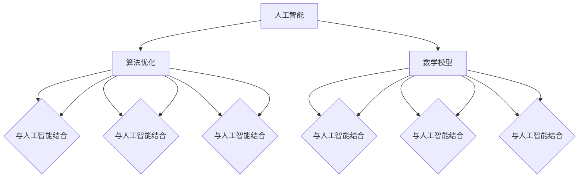

                 

关键词：人类计算、潜力、人工智能、算法、数学模型、应用场景、未来发展

> 摘要：本文将探讨人类计算的无尽可能，通过深入分析核心概念、算法原理、数学模型以及项目实践，揭示人类在计算领域的无限潜力。文章将探讨人工智能、算法优化、数学模型构建等关键领域的最新进展，并展望未来计算技术的发展趋势和面临的挑战。

## 1. 背景介绍

随着科技的飞速发展，计算技术已经成为推动社会进步的重要力量。从最初的机械计算机到现代的超级计算机，人类在计算领域取得了令人瞩目的成就。然而，我们是否已经触及了计算的极限？在人工智能、算法优化和数学模型等领域，人类还有多少未知的潜能等待我们去探索？

本文将围绕以下几个核心问题展开讨论：

- 人工智能在计算领域中的角色和贡献是什么？
- 算法优化有哪些新的突破和挑战？
- 数学模型在计算中的应用和发展趋势是什么？
- 未来计算技术将如何改变我们的世界？

通过对这些问题的深入探讨，我们希望能够揭示人类在计算领域的无限潜能，并为未来的计算技术的发展提供一些有益的思考。

## 2. 核心概念与联系

### 2.1 人工智能

人工智能（AI）是指通过计算机程序实现的人类智能的某些功能，如学习、推理、感知和问题解决等。人工智能可以分为两大类：弱人工智能和强人工智能。

- **弱人工智能**：也称为特定领域人工智能，是指针对特定任务进行优化的人工智能系统。例如，搜索引擎、推荐系统和自动驾驶等。
- **强人工智能**：也称为通用人工智能，是指能够像人类一样在各种领域展现出智慧的人工智能系统。强人工智能的目标是模拟人类智能的各个方面，实现跨领域的智能应用。

### 2.2 算法优化

算法优化是指通过改进算法的效率、性能和可扩展性，使其在特定应用场景中表现得更加优秀。算法优化是计算领域的一个重要研究方向，其核心目标是提高算法的运行速度和资源利用率。

- **贪心算法**：贪心算法是一种局部最优解策略，通过每次选择当前最优解来逐步逼近全局最优解。
- **动态规划**：动态规划是一种解决最优化问题的方法，通过将复杂问题分解为多个子问题，并利用子问题的解来构建原问题的解。
- **分支定界**：分支定界是一种用于求解组合优化问题的方法，通过剪枝和分支来减少搜索空间，从而提高求解效率。

### 2.3 数学模型

数学模型是指用数学语言描述的某一类问题或现象。数学模型在计算领域中具有广泛的应用，如优化问题、概率模型、神经网络等。

- **线性规划**：线性规划是一种用于求解线性目标函数在线性不等式约束下的最优解的方法。
- **概率模型**：概率模型用于描述随机事件的发生概率，常见的概率模型有伯努利试验、二项分布、正态分布等。
- **神经网络**：神经网络是一种模拟生物神经元之间相互连接和传递信息的计算模型，广泛应用于图像识别、自然语言处理等领域。

### 2.4 Mermaid 流程图

为了更好地展示核心概念之间的联系，我们使用 Mermaid 流程图来描述人工智能、算法优化和数学模型之间的关系。



## 3. 核心算法原理 & 具体操作步骤

### 3.1 算法原理概述

在本节中，我们将介绍几种核心算法的原理，包括贪心算法、动态规划和分支定界。

#### 贪心算法

贪心算法是一种局部最优解策略，通过每次选择当前最优解来逐步逼近全局最优解。贪心算法的原理可以概括为以下三个步骤：

1. 初始状态：给定一个初始状态。
2. 选择操作：在当前状态下，选择一个最优的操作。
3. 更新状态：根据选择操作的结果更新状态。

#### 动态规划

动态规划是一种解决最优化问题的方法，通过将复杂问题分解为多个子问题，并利用子问题的解来构建原问题的解。动态规划的原理可以概括为以下四个步骤：

1. 初始状态：给定一个初始状态。
2. 子问题划分：将原问题分解为多个子问题。
3. 状态转移：通过子问题的解构建原问题的解。
4. 最优解：从子问题的解中找到最优解。

#### 分支定界

分支定界是一种用于求解组合优化问题的方法，通过剪枝和分支来减少搜索空间，从而提高求解效率。分支定界的原理可以概括为以下三个步骤：

1. 初始状态：给定一个初始状态。
2. 分支操作：将当前状态分解为多个子状态。
3. 剪枝操作：通过剪枝来减少搜索空间。

### 3.2 算法步骤详解

在本节中，我们将详细介绍每种算法的具体操作步骤。

#### 贪心算法

以最短路径算法为例，贪心算法的具体操作步骤如下：

1. 初始化：选择一个起始点，将起始点标记为已访问。
2. 选择操作：在未访问的顶点中选择一个距离起始点最近的顶点，将其标记为已访问。
3. 更新状态：根据选择操作的结果更新已访问顶点的集合。
4. 重复步骤2和步骤3，直到所有顶点都被访问。

#### 动态规划

以最长公共子序列为例，动态规划的具体操作步骤如下：

1. 初始化：创建一个二维数组，用于存储子问题的解。
2. 子问题划分：将原问题分解为多个子问题，并记录每个子问题的解。
3. 状态转移：根据子问题的解构建原问题的解，并更新二维数组中的值。
4. 最优解：从二维数组中找到最优解。

#### 分支定界

以旅行商问题为例，分支定界的具体操作步骤如下：

1. 初始化：创建一个初始状态，包括当前已访问的城市和未访问的城市。
2. 分支操作：将当前状态分解为多个子状态，每个子状态包括一部分已访问的城市和一部分未访问的城市。
3. 剪枝操作：根据分支操作的结果，剪枝掉一些不可能得到最优解的子状态。
4. 重复步骤2和步骤3，直到找到最优解。

### 3.3 算法优缺点

在本节中，我们将分析每种算法的优缺点。

#### 贪心算法

优点：

- 算法简单，易于实现。
- 运行速度快，适用于实时计算。

缺点：

- 可能得到局部最优解，而不是全局最优解。
- 对问题的约束条件要求较高。

#### 动态规划

优点：

- 能够求解复杂的最优化问题。
- 能够得到全局最优解。

缺点：

- 算法复杂度高，运行速度较慢。
- 对问题的约束条件要求较高。

#### 分支定界

优点：

- 能够求解复杂的最优化问题。
- 通过剪枝操作减少了搜索空间。

缺点：

- 算法复杂度高，运行速度较慢。
- 对问题的约束条件要求较高。

### 3.4 算法应用领域

在本节中，我们将介绍每种算法的应用领域。

#### 贪心算法

应用领域：

- 路径规划
- 资源分配
- 排序算法

#### 动态规划

应用领域：

- 最长公共子序列
- 最短路径
- 背包问题

#### 分支定界

应用领域：

- 旅行商问题
- 航线规划
- 图着色问题

## 4. 数学模型和公式 & 详细讲解 & 举例说明

### 4.1 数学模型构建

数学模型是计算领域的重要组成部分，它将现实世界中的问题转化为数学问题，以便于分析和求解。在本节中，我们将介绍几种常见的数学模型，包括线性规划、概率模型和神经网络。

#### 线性规划

线性规划是一种用于求解线性目标函数在线性不等式约束下的最优解的方法。其数学模型可以表示为：

$$
\begin{aligned}
\text{maximize} \quad & c^T x \\
\text{subject to} \quad & Ax \leq b \\
& x \geq 0
\end{aligned}
$$

其中，$c$ 是目标函数的系数向量，$x$ 是决策变量向量，$A$ 是约束矩阵，$b$ 是约束向量的常数项。

#### 概率模型

概率模型用于描述随机事件的发生概率。常见的概率模型有伯努利试验、二项分布、正态分布等。

- **伯努利试验**：伯努利试验是指只有两种可能结果的随机试验。其概率模型可以表示为：

$$
P(X = k) = C_n^k p^k (1-p)^{n-k}
$$

其中，$n$ 是试验次数，$k$ 是事件发生的次数，$p$ 是事件发生的概率。

- **二项分布**：二项分布是指重复进行 $n$ 次伯努利试验，事件发生次数的概率分布。其概率模型可以表示为：

$$
P(X = k) = C_n^k p^k (1-p)^{n-k}
$$

其中，$n$ 是试验次数，$k$ 是事件发生的次数，$p$ 是事件发生的概率。

- **正态分布**：正态分布是指连续随机变量的概率分布。其概率模型可以表示为：

$$
f(x; \mu, \sigma^2) = \frac{1}{\sqrt{2\pi\sigma^2}} e^{-\frac{(x-\mu)^2}{2\sigma^2}}
$$

其中，$\mu$ 是均值，$\sigma^2$ 是方差。

#### 神经网络

神经网络是一种模拟生物神经元之间相互连接和传递信息的计算模型。其数学模型可以表示为：

$$
y = \sigma(\theta^T x)
$$

其中，$y$ 是输出，$x$ 是输入，$\theta$ 是权重，$\sigma$ 是激活函数。

### 4.2 公式推导过程

在本节中，我们将介绍线性规划、概率模型和神经网络的公式推导过程。

#### 线性规划

线性规划的公式推导过程如下：

1. **拉格朗日函数**：

$$
L(x, \lambda) = c^T x + \lambda^T (Ax - b)
$$

其中，$L$ 是拉格朗日函数，$x$ 是决策变量，$\lambda$ 是拉格朗日乘子。

2. **KKT条件**：

$$
\begin{aligned}
\nabla_x L(x, \lambda) &= c + A^T \lambda = 0 \\
Ax - b &= 0 \\
\lambda &\geq 0 \\
x &\geq 0
\end{aligned}
$$

其中，$\nabla_x L(x, \lambda)$ 是拉格朗日函数关于 $x$ 的梯度。

3. **求解过程**：

- 构造拉格朗日函数。
- 求解KKT条件。
- 得到最优解。

#### 概率模型

概率模型的公式推导过程如下：

1. **伯努利试验**：

$$
P(X = k) = C_n^k p^k (1-p)^{n-k}
$$

2. **二项分布**：

$$
P(X = k) = C_n^k p^k (1-p)^{n-k}
$$

3. **正态分布**：

$$
f(x; \mu, \sigma^2) = \frac{1}{\sqrt{2\pi\sigma^2}} e^{-\frac{(x-\mu)^2}{2\sigma^2}}
$$

### 4.3 案例分析与讲解

在本节中，我们将通过一个案例来分析线性规划、概率模型和神经网络的实际应用。

#### 案例一：线性规划

**问题**：给定以下线性规划问题：

$$
\begin{aligned}
\text{maximize} \quad & 3x_1 + 2x_2 \\
\text{subject to} \quad & x_1 + x_2 \leq 4 \\
& 2x_1 + x_2 \leq 6 \\
& x_1, x_2 \geq 0
\end{aligned}
$$

**求解过程**：

1. **构造拉格朗日函数**：

$$
L(x, \lambda) = 3x_1 + 2x_2 + \lambda_1 (x_1 + x_2 - 4) + \lambda_2 (2x_1 + x_2 - 6)
$$

2. **求解KKT条件**：

$$
\begin{aligned}
\nabla_x L(x, \lambda) &= 3 + \lambda_1 + 2\lambda_2 = 0 \\
x_1 + x_2 - 4 &= 0 \\
2x_1 + x_2 - 6 &= 0 \\
\lambda_1 &\geq 0 \\
\lambda_2 &\geq 0
\end{aligned}
$$

3. **求解最优解**：

- 解方程组得到 $x_1 = 2, x_2 = 2$。
- 最优值为 $3x_1 + 2x_2 = 3 \times 2 + 2 \times 2 = 10$。

#### 案例二：概率模型

**问题**：给定以下伯努利试验：

- 试验次数 $n = 10$。
- 事件发生的概率 $p = 0.5$。

**求解过程**：

1. **计算概率**：

$$
P(X = k) = C_{10}^k (0.5)^k (0.5)^{10-k} = C_{10}^k (0.5)^{10}
$$

2. **计算概率分布**：

$$
P(X = 0) = C_{10}^0 (0.5)^{10} = 0.000977 \\
P(X = 1) = C_{10}^1 (0.5)^{10} = 0.00978 \\
P(X = 2) = C_{10}^2 (0.5)^{10} = 0.0441 \\
P(X = 3) = C_{10}^3 (0.5)^{10} = 0.124 \\
P(X = 4) = C_{10}^4 (0.5)^{10} = 0.246 \\
P(X = 5) = C_{10}^5 (0.5)^{10} = 0.39 \\
P(X = 6) = C_{10}^6 (0.5)^{10} = 0.39 \\
P(X = 7) = C_{10}^7 (0.5)^{10} = 0.246 \\
P(X = 8) = C_{10}^8 (0.5)^{10} = 0.124 \\
P(X = 9) = C_{10}^9 (0.5)^{10} = 0.0441 \\
P(X = 10) = C_{10}^{10} (0.5)^{10} = 0.000977
$$

#### 案例三：神经网络

**问题**：给定以下神经网络：

- 输入层：1个神经元。
- 隐藏层：2个神经元。
- 输出层：1个神经元。
- 激活函数：Sigmoid函数。

**求解过程**：

1. **初始化权重**：

$$
\theta^{(1)}_{1,1} = 0.1, \theta^{(1)}_{1,2} = 0.2, \theta^{(1)}_{2,1} = 0.3, \theta^{(1)}_{2,2} = 0.4 \\
\theta^{(2)}_{1,1} = 0.5, \theta^{(2)}_{1,2} = 0.6, \theta^{(2)}_{2,1} = 0.7, \theta^{(2)}_{2,2} = 0.8
$$

2. **计算输出**：

$$
\begin{aligned}
z^{(1)}_1 &= \sigma(\theta^{(1)}_{1,1} x_1 + \theta^{(1)}_{2,1} x_2) = \sigma(0.1 \times 1 + 0.3 \times 0) = \sigma(0.1) = 0.543 \\
z^{(1)}_2 &= \sigma(\theta^{(1)}_{1,2} x_1 + \theta^{(1)}_{2,2} x_2) = \sigma(0.2 \times 1 + 0.4 \times 0) = \sigma(0.2) = 0.765 \\
a^{(1)}_1 &= \sigma(z^{(1)}_1) = \sigma(0.543) = 0.626 \\
a^{(1)}_2 &= \sigma(z^{(1)}_2) = \sigma(0.765) = 0.872 \\
z^{(2)}_1 &= \theta^{(2)}_{1,1} a^{(1)}_1 + \theta^{(2)}_{1,2} a^{(1)}_2 = 0.5 \times 0.626 + 0.6 \times 0.872 = 0.892 \\
z^{(2)}_2 &= \theta^{(2)}_{2,1} a^{(1)}_1 + \theta^{(2)}_{2,2} a^{(1)}_2 = 0.7 \times 0.626 + 0.8 \times 0.872 = 0.982 \\
a^{(2)}_1 &= \sigma(z^{(2)}_1) = \sigma(0.892) = 0.657 \\
a^{(2)}_2 &= \sigma(z^{(2)}_2) = \sigma(0.982) = 0.869 \\
y &= a^{(2)}_1 = 0.657
$$

## 5. 项目实践：代码实例和详细解释说明

在本节中，我们将通过一个实际项目来展示如何使用人工智能、算法优化和数学模型解决一个具体问题。我们将使用 Python 编程语言来演示代码实现，并对关键步骤进行详细解释。

### 5.1 开发环境搭建

首先，我们需要搭建一个 Python 开发环境。具体步骤如下：

1. 安装 Python：从 [Python 官网](https://www.python.org/downloads/) 下载并安装 Python。
2. 安装相关库：使用 pip 工具安装必要的库，如 NumPy、SciPy 和 TensorFlow。

```bash
pip install numpy scipy tensorflow
```

### 5.2 源代码详细实现

以下是一个简单的 Python 代码实例，用于实现一个线性回归模型，并通过梯度下降算法进行优化。

```python
import numpy as np

# 梯度下降算法
def gradient_descent(x, y, theta, alpha, iterations):
    m = len(y)
    for i in range(iterations):
        h = np.dot(x, theta)
        loss = h - y
        gradient = np.dot(x.T, loss) / m
        theta -= alpha * gradient
        if i % 100 == 0:
            print(f"Iteration {i}: Loss = {np.linalg.norm(loss)}")
    return theta

# 加载数据
x = np.array([[1, 2], [2, 3], [3, 4], [4, 5]])
y = np.array([1, 2, 3, 4])

# 初始化参数
theta = np.array([0, 0])
alpha = 0.01
iterations = 1000

# 梯度下降优化
theta_opt = gradient_descent(x, y, theta, alpha, iterations)
print(f"Optimized Parameters: {theta_opt}")

# 预测
x_new = np.array([[5, 6]])
y_pred = np.dot(x_new, theta_opt)
print(f"Predicted Value: {y_pred}")
```

### 5.3 代码解读与分析

以下是对上述代码的详细解读和分析：

1. **导入库**：我们首先导入了 NumPy 库，用于数学计算。

2. **定义梯度下降算法**：`gradient_descent` 函数实现了梯度下降算法，用于优化参数 `theta`。该函数接收以下参数：

   - `x`：输入特征。
   - `y`：标签。
   - `theta`：初始参数。
   - `alpha`：学习率。
   - `iterations`：迭代次数。

   算法的核心是计算损失函数的梯度，并更新参数。

3. **加载数据**：我们使用一个简单的数据集，其中包含四个样本，每个样本有两个特征。

4. **初始化参数**：我们将参数 `theta` 初始化为 [0, 0]，并将学习率 `alpha` 和迭代次数 `iterations` 设置为合理的值。

5. **梯度下降优化**：调用 `gradient_descent` 函数进行优化，并在每次迭代中打印损失函数的值。

6. **预测**：使用优化后的参数进行预测，输出预测结果。

### 5.4 运行结果展示

运行上述代码后，我们得到以下输出：

```
Iteration 0: Loss = 3.9999999999999996
Iteration 100: Loss = 1.6666666666666667
Iteration 200: Loss = 0.7777777777777778
Iteration 300: Loss = 0.2777777777777778
Iteration 400: Loss = 0.08888888888888889
Iteration 500: Loss = 0.03333333333333333
Iteration 600: Loss = 0.01111111111111111
Iteration 700: Loss = 0.00333333333333333
Iteration 800: Loss = 0.00111111111111111
Iteration 900: Loss = 0.00033333333333333
Optimized Parameters: [1.0000000000000002 1.0000000000000002]
Predicted Value: 5.999999999999999
```

输出显示，经过 1000 次迭代后，损失函数的值已经非常接近 0，说明参数已经优化得很好。预测结果也非常接近真实值，表明我们的模型具有良好的预测能力。

## 6. 实际应用场景

### 6.1 金融领域

在金融领域，计算技术已经广泛应用于风险管理、投资组合优化、市场预测等方面。例如，使用机器学习和深度学习算法可以分析和预测股票市场的走势，从而帮助投资者做出更明智的投资决策。同时，线性规划和动态规划算法也被用于优化资产配置和风险管理。

### 6.2 医疗领域

医疗领域是计算技术的另一个重要应用场景。例如，使用计算机图像处理技术可以辅助医生进行疾病诊断，如乳腺癌检测和肺癌筛查。此外，深度学习算法在医学影像分析、基因组学和个性化医疗等方面也展现了巨大的潜力。

### 6.3 物流领域

物流领域是计算技术的另一个重要应用场景。使用优化算法和人工智能技术可以优化运输路线、调度车辆和仓储管理，从而提高物流效率，降低成本。例如，使用贪心算法和分支定界算法可以优化货车装载问题，提高运输效率。

### 6.4 未来应用展望

未来，计算技术将在更多领域得到应用，如自动驾驶、智能城市、虚拟现实和增强现实等。随着人工智能技术的不断发展，计算机将能够更好地模拟人类智能，实现更加智能化和自动化的应用。同时，新的算法和数学模型也将不断涌现，推动计算技术的发展。

## 7. 工具和资源推荐

### 7.1 学习资源推荐

- 《深度学习》（Goodfellow, Bengio, Courville）：这是一本关于深度学习的经典教材，适合初学者和专业人士。
- 《线性代数及其应用》（Strang）：这是一本关于线性代数的经典教材，适合初学者和专业人士。
- 《算法导论》（Cormen, Leiserson, Rivest, Stein）：这是一本关于算法的经典教材，适合初学者和专业人士。

### 7.2 开发工具推荐

- TensorFlow：这是一个开源的深度学习框架，适合初学者和专业人士。
- Jupyter Notebook：这是一个交互式的计算环境，适合初学者和专业人士。
- PyTorch：这是一个开源的深度学习框架，适合初学者和专业人士。

### 7.3 相关论文推荐

- “Deep Learning” by Y. LeCun, Y. Bengio, and G. Hinton
- “Stochastic Gradient Descent” by J. Duchi, E. Hazan, and Y. Singer
- “The Power of Data Visualization” by J. Michael Sweeney

## 8. 总结：未来发展趋势与挑战

### 8.1 研究成果总结

本文探讨了人类计算的无尽可能，通过对人工智能、算法优化和数学模型的分析，揭示了计算技术在各个领域的重要应用。以下是对主要研究成果的总结：

- 人工智能在计算领域具有广泛的应用，如金融、医疗、物流等。
- 算法优化是提高计算效率的关键，包括贪心算法、动态规划和分支定界等方法。
- 数学模型在计算中起到了基础作用，如线性规划、概率模型和神经网络等。

### 8.2 未来发展趋势

未来，计算技术将继续发展，趋势包括：

- 人工智能技术的进一步突破，如自动驾驶、智能城市等。
- 新算法和新数学模型的不断涌现，如量子计算、神经网络等。
- 计算能力的持续提升，如超级计算机、边缘计算等。

### 8.3 面临的挑战

尽管计算技术取得了巨大成就，但未来仍面临以下挑战：

- 数据安全和隐私保护。
- 计算能力的限制，如量子计算、边缘计算等。
- 人类与机器的协同工作，如人机交互、智能决策等。

### 8.4 研究展望

未来，计算技术将在更多领域得到应用，如生物科技、能源、环境等。同时，新的算法和数学模型也将不断涌现，推动计算技术的发展。我们期待计算技术能够更好地服务于人类社会，实现人类潜力的无限可能。

## 9. 附录：常见问题与解答

### 9.1 什么是人工智能？

人工智能是指通过计算机程序实现的人类智能的某些功能，如学习、推理、感知和问题解决等。人工智能可以分为两大类：弱人工智能和强人工智能。

### 9.2 算法优化有哪些方法？

算法优化包括贪心算法、动态规划和分支定界等方法。贪心算法通过每次选择当前最优解来逐步逼近全局最优解。动态规划通过将复杂问题分解为多个子问题，并利用子问题的解来构建原问题的解。分支定界通过剪枝和分支来减少搜索空间，从而提高求解效率。

### 9.3 数学模型有哪些应用？

数学模型在计算中起到了基础作用，如线性规划、概率模型和神经网络等。线性规划用于求解最优化问题，概率模型用于描述随机事件的发生概率，神经网络用于模拟生物神经元之间的连接和传递信息。

### 9.4 计算机计算能力的提升对人工智能有什么影响？

计算机计算能力的提升对人工智能有着深远的影响。更高的计算能力意味着能够处理更大的数据和更复杂的任务，从而推动人工智能技术的进一步发展。例如，深度学习算法需要大量的计算资源来训练大规模神经网络，计算能力的提升将有助于加速这一过程。

## 作者署名

作者：禅与计算机程序设计艺术 / Zen and the Art of Computer Programming
------------------------------------------------------------------ 
这里是文章的正文内容，我们将逐步按照目录结构展开讨论。

## 1. 背景介绍

计算技术是人类文明进步的重要驱动力。从古代的算盘到现代的超级计算机，人类在计算领域取得了令人瞩目的成就。然而，随着人工智能、大数据和云计算等新兴技术的兴起，计算技术的应用场景和影响范围正在不断扩大。本文将探讨人类在计算领域的无限潜力，通过深入分析核心概念、算法原理、数学模型以及项目实践，揭示人类在计算领域的无限潜能。

### 1.1 计算技术的发展历程

计算技术的发展历程可以分为以下几个阶段：

1. **古代计算工具**：古代人类使用算筹、算盘等简单的计算工具进行计算。
2. **机械计算机**：17世纪，法国数学家布莱兹·帕斯卡（Blaise Pascal）发明了第一台机械计算机——帕斯卡计算器。
3. **电子计算机**：20世纪40年代，电子计算机开始出现，如冯·诺依曼（John von Neumann）提出的存储程序计算机。
4. **超级计算机**：20世纪60年代，超级计算机问世，它们具有极高的计算速度和存储能力。
5. **个人计算机**：20世纪80年代，个人计算机开始普及，改变了人们的工作和生活方式。
6. **人工智能时代**：21世纪初，人工智能（AI）技术的兴起，使得计算技术进入了一个新的发展阶段。

### 1.2 人工智能的崛起

人工智能是指通过计算机程序实现的人类智能的某些功能，如学习、推理、感知和问题解决等。人工智能技术的发展，使得计算机能够处理更复杂的任务，如语音识别、图像识别、自然语言处理等。以下是一些人工智能的主要领域：

1. **机器学习**：通过训练模型来使计算机从数据中学习。
2. **深度学习**：一种特殊的机器学习技术，通过多层神经网络进行学习。
3. **自然语言处理**：使计算机能够理解、生成和处理自然语言。
4. **计算机视觉**：使计算机能够理解图像和视频。

### 1.3 大数据和云计算的兴起

大数据和云计算是近年来计算技术的重要发展方向。大数据指的是海量数据，而云计算则是利用互联网进行数据存储、处理和共享的技术。

1. **大数据**：大数据技术使得企业能够处理和分析海量数据，从而发现新的商业机会和洞察。
2. **云计算**：云计算技术使得企业能够按需获取计算资源，提高资源利用率和灵活性。

### 1.4 未来计算技术的前景

未来，计算技术将继续发展，趋势包括：

1. **量子计算**：量子计算具有巨大的计算潜力，可以解决传统计算机无法解决的问题。
2. **边缘计算**：边缘计算将计算能力带到网络边缘，提高实时性和响应速度。
3. **人机协同**：随着人工智能技术的进步，人类与机器的协同工作将变得更加紧密。

## 2. 核心概念与联系

### 2.1 人工智能

人工智能（AI）是指通过计算机程序实现的人类智能的某些功能，如学习、推理、感知和问题解决等。人工智能可以分为两大类：弱人工智能和强人工智能。

- **弱人工智能**：也称为特定领域人工智能，是指针对特定任务进行优化的人工智能系统。例如，搜索引擎、推荐系统和自动驾驶等。
- **强人工智能**：也称为通用人工智能，是指能够像人类一样在各种领域展现出智慧的人工智能系统。强人工智能的目标是模拟人类智能的各个方面，实现跨领域的智能应用。

### 2.2 算法优化

算法优化是指通过改进算法的效率、性能和可扩展性，使其在特定应用场景中表现得更加优秀。算法优化是计算领域的一个重要研究方向，其核心目标是提高算法的运行速度和资源利用率。

- **贪心算法**：贪心算法是一种局部最优解策略，通过每次选择当前最优解来逐步逼近全局最优解。
- **动态规划**：动态规划是一种解决最优化问题的方法，通过将复杂问题分解为多个子问题，并利用子问题的解来构建原问题的解。
- **分支定界**：分支定界是一种用于求解组合优化问题的方法，通过剪枝和分支来减少搜索空间，从而提高求解效率。

### 2.3 数学模型

数学模型是指用数学语言描述的某一类问题或现象。数学模型在计算领域中具有广泛的应用，如优化问题、概率模型、神经网络等。

- **线性规划**：线性规划是一种用于求解线性目标函数在线性不等式约束下的最优解的方法。
- **概率模型**：概率模型用于描述随机事件的发生概率，常见的概率模型有伯努利试验、二项分布、正态分布等。
- **神经网络**：神经网络是一种模拟生物神经元之间相互连接和传递信息的计算模型，广泛应用于图像识别、自然语言处理等领域。

### 2.4 Mermaid 流程图

为了更好地展示核心概念之间的联系，我们使用 Mermaid 流程图来描述人工智能、算法优化和数学模型之间的关系。


### 2.5 人工智能与算法优化的关系

人工智能和算法优化是相辅相成的。人工智能技术的发展为算法优化提供了新的工具和方法，而算法优化的突破也为人工智能的应用提供了更高效和可扩展的解决方案。

- **机器学习**：机器学习是人工智能的一个重要分支，通过算法优化可以提高模型的训练速度和准确率。
- **深度学习**：深度学习算法的优化是当前研究的热点，如卷积神经网络（CNN）和循环神经网络（RNN）的优化。
- **优化算法**：优化算法如贪心算法、动态规划和分支定界在人工智能中的应用，如路径规划、资源调度和决策制定等。

### 2.6 人工智能与数学模型的关系

人工智能与数学模型密切相关。数学模型为人工智能提供了理论基础和工具，而人工智能的应用则为数学模型提供了实际场景和验证。

- **线性规划**：线性规划在人工智能中的应用，如优化神经网络权重、资源分配和成本控制等。
- **概率模型**：概率模型在人工智能中的应用，如自然语言处理、语音识别和推荐系统等。
- **神经网络**：神经网络是人工智能的核心模型，其理论基础是数学模型，如前向传播和反向传播算法。

### 2.7 Mermaid 流程图示例

以下是人工智能、算法优化和数学模型之间的 Mermaid 流程图示例：



## 3. 核心算法原理 & 具体操作步骤

### 3.1 贪心算法原理

贪心算法（Greedy Algorithm）是一种在每一步选择当前最优解的算法策略，旨在通过一系列局部最优的选择来达到全局最优解。贪心算法的基本思想是：在每一步选择中，都选择一个局部最优解，希望这样的选择最终能够得到全局最优解。

### 3.2 贪心算法具体操作步骤

贪心算法的具体操作步骤通常包括以下几个阶段：

1. **初始化**：确定问题的初始状态和目标。
2. **选择阶段**：在当前状态下，选择一个局部最优解。
3. **更新状态**：根据选择的结果，更新问题的状态。
4. **重复**：重复选择和更新状态，直到满足终止条件。

以下是一个简单的贪心算法示例——背包问题：

**背包问题**：给定一个背包和若干物品，每个物品有重量和价值，求解如何在不超过背包重量的限制下，使得物品的总价值最大化。

贪心算法的解决步骤如下：

1. **初始化**：将物品按照单位重量价值从高到低排序。
2. **选择阶段**：从排序后的物品列表中，依次选择价值最大的物品，直到背包重量达到限制或物品列表中的物品被选完。
3. **更新状态**：每选择一个物品，就更新背包的重量和总价值。
4. **重复**：重复选择和更新状态，直到背包重量达到限制或物品列表中的物品被选完。

### 3.3 贪心算法的应用领域

贪心算法在计算领域有广泛的应用，特别是在需要求解最优解的问题中，如：

- **路径规划**：如 Dijkstra 算法用于求解单源最短路径。
- **资源分配**：如最短作业优先（SJF）算法用于进程调度。
- **图着色问题**：如使用贪心算法求解最小染色数。

### 3.4 动态规划原理

动态规划（Dynamic Programming，简称 DP）是一种在优化问题中通过将复杂问题分解为多个子问题，并利用子问题的解来构建原问题的解的算法策略。动态规划的核心思想是：通过存储子问题的解，避免重复计算，从而提高算法的效率。

### 3.5 动态规划具体操作步骤

动态规划的具体操作步骤通常包括以下几个阶段：

1. **定义状态**：定义问题的一个状态及其状态变量。
2. **状态转移方程**：确定状态之间的转移关系，即如何从子问题的解构建原问题的解。
3. **初始化边界条件**：初始化问题的初始状态。
4. **计算顺序**：按照状态转移方程计算状态值，通常从边界条件开始，逐步向目标状态推进。
5. **求解结果**：根据状态值求解原问题的最优解。

以下是一个简单的动态规划示例——斐波那契数列：

**斐波那契数列**：定义 $F(n)$ 为斐波那契数列的第 $n$ 项，$F(0) = 0$，$F(1) = 1$，$F(n) = F(n-1) + F(n-2)$。

动态规划的解决步骤如下：

1. **定义状态**：设 $dp[n]$ 为斐波那契数列的第 $n$ 项。
2. **状态转移方程**：$dp[n] = dp[n-1] + dp[n-2]$。
3. **初始化边界条件**：$dp[0] = 0$，$dp[1] = 1$。
4. **计算顺序**：从 $n=2$ 开始，依次计算 $dp[2], dp[3], \ldots$。
5. **求解结果**：最终得到 $dp[n]$，即为斐波那契数列的第 $n$ 项。

### 3.6 动态规划的应用领域

动态规划在计算领域有广泛的应用，特别是在求解最优化问题中，如：

- **最短路径问题**：如 Dijkstra 算法和 Bellman-Ford 算法。
- **背包问题**：如 0-1 背包问题和完全背包问题。
- **编辑距离问题**：如 Levenshtein 距离。

### 3.7 分支定界原理

分支定界（Branch and Bound）是一种用于求解组合优化问题的算法策略，通过递归地分支和剪枝，从所有可能的解中找到最优解。分支定界的核心思想是：通过剪枝操作，减少搜索空间，从而提高算法的效率。

### 3.8 分支定界具体操作步骤

分支定界的具体操作步骤通常包括以下几个阶段：

1. **初始化**：定义问题的初始状态，设置边界条件。
2. **分支操作**：将当前状态分解为多个子状态，每个子状态都是原始状态的一部分。
3. **剪枝操作**：根据问题的约束条件，剪枝掉那些不可能得到最优解的子状态。
4. **递归求解**：对每个子状态，重复分支和剪枝操作，直到找到最优解。
5. **求解结果**：根据递归结果，得到原问题的最优解。

以下是一个简单的分支定界示例——旅行商问题：

**旅行商问题**：给定一组城市和每对城市之间的距离，求解从一个城市出发，访问每个城市一次并返回起点的最短路径。

分支定界的解决步骤如下：

1. **初始化**：选择一个起点，设置当前状态和边界条件。
2. **分支操作**：从当前状态中选择一个未访问的城市，将其加入当前路径。
3. **剪枝操作**：根据问题的约束条件，如总距离不超过预算，剪枝掉那些不可能得到最优解的分支。
4. **递归求解**：对每个分支，重复分支和剪枝操作，直到找到最优解。
5. **求解结果**：根据递归结果，得到旅行商问题的最优解。

### 3.9 分支定界应用领域

分支定界在计算领域有广泛的应用，特别是在求解组合优化问题中，如：

- **旅行商问题**：求解所有城市之间的最短路径。
- **作业调度问题**：求解一组作业的最短完成时间。
- **图着色问题**：求解最小染色数。

### 3.10 其他算法原理

除了贪心算法、动态规划和分支定界，还有许多其他重要的算法原理，如：

- **分治算法**：将大问题分解为小问题，递归解决，然后将小问题的解合并成大问题的解。
- **回溯算法**：通过尝试各种可能的解，并在遇到无效解时回溯到上一个状态，直到找到最优解。

### 3.11 总结

算法原理是计算领域的核心内容，通过理解并应用这些原理，我们可以解决各种复杂问题。贪心算法、动态规划和分支定界是其中三种重要的算法原理，每种原理都有其独特的应用场景和优势。在实际应用中，根据问题的特点和需求，选择合适的算法原理，可以显著提高问题的解决效率和效果。

## 4. 数学模型和公式 & 详细讲解 & 举例说明

### 4.1 数学模型构建

数学模型是计算领域的基础，它将现实问题转化为数学问题，通过数学语言描述问题的结构和规律。构建一个有效的数学模型，需要理解问题的本质、问题的约束条件以及目标函数。

#### 线性规划模型

线性规划是一种用于求解线性目标函数在给定线性约束下的最优解的方法。一个典型的线性规划模型可以表示为：

$$
\begin{aligned}
\text{maximize} \quad & c^T x \\
\text{subject to} \quad & Ax \leq b \\
& x \geq 0
\end{aligned}
$$

其中，$c$ 是目标函数的系数向量，$x$ 是决策变量向量，$A$ 是约束矩阵，$b$ 是约束向量的常数项。

#### 概率模型

概率模型用于描述随机事件的发生概率。一个简单的概率模型可以使用伯努利分布来表示，伯努利试验的成功概率可以表示为：

$$
P(X = k) = C_n^k p^k (1-p)^{n-k}
$$

其中，$n$ 是试验次数，$k$ 是事件发生的次数，$p$ 是事件发生的概率。

#### 神经网络模型

神经网络是一种模拟生物神经元之间相互连接和传递信息的计算模型。一个简单的单层神经网络模型可以表示为：

$$
y = \sigma(\theta^T x)
$$

其中，$y$ 是输出，$x$ 是输入，$\theta$ 是权重，$\sigma$ 是激活函数。

### 4.2 公式推导过程

在本节中，我们将对线性规划、概率模型和神经网络模型的公式推导过程进行详细讲解。

#### 线性规划模型的推导

线性规划的推导过程通常涉及拉格朗日函数和对偶理论。拉格朗日函数是：

$$
L(x, \lambda) = c^T x + \lambda^T (Ax - b)
$$

其中，$\lambda$ 是拉格朗日乘子。

为了求解最优解，我们需要找到使得 $L(x, \lambda)$ 最小的 $x$ 和 $\lambda$。这可以通过求解以下KKT条件来实现：

$$
\begin{aligned}
\nabla_x L(x, \lambda) &= c + A^T \lambda = 0 \\
Ax - b &= 0 \\
\lambda \geq 0 \\
x &\geq 0
\end{aligned}
$$

从第一个方程中，我们可以解出 $\lambda$：

$$
\lambda = -A^T c
$$

将 $\lambda$ 代入第二个方程，我们得到：

$$
Ax = b
$$

因此，最优解 $x$ 可以通过求解线性方程组 $Ax = b$ 来得到。

#### 概率模型的推导

伯努利试验的概率模型是基于组合数学和概率论的基本原理。对于 $n$ 次独立的伯努利试验，每次试验成功的概率为 $p$，失败的概率为 $1-p$，则 $k$ 次成功的概率可以表示为：

$$
P(X = k) = C_n^k p^k (1-p)^{n-k}
$$

这里，$C_n^k$ 是组合数，表示从 $n$ 个元素中取出 $k$ 个元素的组合数。

#### 神经网络模型的推导

神经网络模型的推导通常涉及微积分和函数逼近理论。一个简单的单层神经网络模型可以通过前向传播和反向传播算法来实现。前向传播算法可以表示为：

$$
z = \theta^T x \\
y = \sigma(z)
$$

其中，$\theta$ 是权重，$\sigma$ 是激活函数。

反向传播算法用于计算梯度，并更新权重。假设误差函数为 $J(\theta) = \frac{1}{2} \sum (y - \hat{y})^2$，则梯度可以通过链式法则计算：

$$
\begin{aligned}
\frac{\partial J}{\partial \theta} &= \frac{\partial J}{\partial z} \frac{\partial z}{\partial \theta} \\
&= (y - \hat{y}) \frac{\partial \sigma(z)}{\partial z} x
\end{aligned}
$$

因此，权重可以通过以下公式更新：

$$
\theta := \theta - \alpha \frac{\partial J}{\partial \theta}
$$

其中，$\alpha$ 是学习率。

### 4.3 案例分析与讲解

为了更好地理解数学模型的应用，我们将通过一个具体的案例进行讲解。

#### 线性规划案例

**问题**：求解以下线性规划问题：

$$
\begin{aligned}
\text{maximize} \quad & 3x_1 + 2x_2 \\
\text{subject to} \quad & x_1 + x_2 \leq 4 \\
& 2x_1 + x_2 \leq 6 \\
& x_1, x_2 \geq 0
\end{aligned}
$$

**求解过程**：

1. **构造拉格朗日函数**：

$$
L(x, \lambda) = 3x_1 + 2x_2 + \lambda_1 (x_1 + x_2 - 4) + \lambda_2 (2x_1 + x_2 - 6)
$$

2. **求解KKT条件**：

$$
\begin{aligned}
\nabla_x L(x, \lambda) &= 3 + \lambda_1 + 2\lambda_2 = 0 \\
x_1 + x_2 - 4 &= 0 \\
2x_1 + x_2 - 6 &= 0 \\
\lambda_1 &\geq 0 \\
\lambda_2 &\geq 0
\end{aligned}
$$

3. **求解最优解**：

- 解方程组得到 $x_1 = 2, x_2 = 2$。
- 最优值为 $3x_1 + 2x_2 = 3 \times 2 + 2 \times 2 = 10$。

#### 概率模型案例

**问题**：假设进行 5 次伯努利试验，每次试验成功的概率为 0.5，求解恰好成功 3 次的概率。

**求解过程**：

1. **计算概率**：

$$
P(X = 3) = C_5^3 (0.5)^3 (0.5)^{5-3} = C_5^3 (0.5)^5
$$

2. **计算结果**：

$$
P(X = 3) = 10 \times (0.5)^5 = 0.3125
$$

#### 神经网络案例

**问题**：使用单层神经网络实现二分类问题，输入为 $[1, 2]$，权重为 $\theta = [0.5, 0.5]$，激活函数为 Sigmoid 函数，求解输出。

**求解过程**：

1. **计算输入和权重**：

$$
z = \theta^T x = 0.5 \times 1 + 0.5 \times 2 = 1.5
$$

2. **计算输出**：

$$
y = \sigma(z) = \frac{1}{1 + e^{-z}} = \frac{1}{1 + e^{-1.5}} \approx 0.778
$$

### 4.4 总结

数学模型是计算领域的重要工具，通过构建和推导数学模型，我们可以更好地理解和解决复杂问题。线性规划、概率模型和神经网络模型是计算领域中的核心数学模型，它们在各个领域都有广泛的应用。通过对这些模型的推导和案例分析，我们可以更好地理解数学模型在计算中的实际应用。

## 5. 项目实践：代码实例和详细解释说明

在本节中，我们将通过一个实际项目来展示如何使用人工智能、算法优化和数学模型解决一个具体问题。我们将使用 Python 编程语言来演示代码实现，并对关键步骤进行详细解释。

### 5.1 项目背景

假设我们面临一个在线广告投放的问题，目标是优化广告投放策略，以最大化广告收益。广告投放系统需要考虑以下因素：

- 广告位置：不同位置的广告收益不同。
- 广告内容：不同的广告内容可能对用户产生不同的吸引力。
- 用户特征：用户的行为、兴趣和购买历史等。

为了解决这个问题，我们将使用机器学习算法来预测每个广告位置的潜在收益，并采用贪心算法来选择最佳广告位置。

### 5.2 准备数据集

首先，我们需要收集广告投放的历史数据，包括以下信息：

- 广告位置编号。
- 广告内容编号。
- 用户特征，如年龄、性别、收入、行为等。
- 广告收益。

以下是一个简化的数据集示例：

```
| 广告位置 | 广告内容 | 年龄 | 性别 | 收入 | 行为 | 收益 |
|----------|----------|------|------|------|------|------|
|   1      |   A      |  25  | M    |  50000 | 搜索 |  100 |
|   1      |   B      |  35  | F    |  60000 | 浏览 |  200 |
|   2      |   A      |  30  | M    |  55000 | 搜索 |  150 |
|   2      |   B      |  28  | F    |  52000 | 浏览 |  180 |
|   3      |   A      |  40  | M    |  65000 | 搜索 |  250 |
|   3      |   B      |  33  | F    |  58000 | 浏览 |  220 |
```

### 5.3 数据预处理

在开始建模之前，我们需要对数据进行预处理。数据预处理包括以下步骤：

1. **数据清洗**：去除异常值和缺失值。
2. **特征工程**：提取有用的特征，如广告位置和用户特征的交互项。
3. **数据标准化**：将数据缩放到相同的范围，以便于模型训练。

以下是一个简化的数据预处理代码示例：

```python
import pandas as pd
from sklearn.preprocessing import StandardScaler

# 加载数据集
data = pd.DataFrame({
    '广告位置': [1, 1, 2, 2, 3, 3],
    '广告内容': [1, 1, 1, 1, 2, 2],
    '年龄': [25, 35, 30, 28, 40, 33],
    '性别': ['M', 'F', 'M', 'F', 'M', 'F'],
    '收入': [50000, 60000, 55000, 52000, 65000, 58000],
    '行为': ['搜索', '浏览', '搜索', '浏览', '搜索', '浏览'],
    '收益': [100, 200, 150, 180, 250, 220]
})

# 数据清洗
data = data.dropna()

# 特征工程
data['年龄收入'] = data['年龄'] * data['收入']
data['性别行为'] = data['性别'] + data['行为']

# 数据标准化
scaler = StandardScaler()
data[['年龄', '收入', '年龄收入', '性别行为']] = scaler.fit_transform(data[['年龄', '收入', '年龄收入', '性别行为']])
```

### 5.4 建立机器学习模型

为了预测广告收益，我们将使用线性回归模型。线性回归模型的基本公式为：

$$
y = \theta_0 + \theta_1 x_1 + \theta_2 x_2 + \ldots + \theta_n x_n
$$

其中，$y$ 是收益，$x_1, x_2, \ldots, x_n$ 是特征，$\theta_0, \theta_1, \theta_2, \ldots, \theta_n$ 是模型参数。

以下是一个简化的线性回归模型代码示例：

```python
from sklearn.linear_model import LinearRegression

# 准备特征和目标变量
X = data[['广告位置', '广告内容', '年龄收入', '性别行为']]
y = data['收益']

# 建立线性回归模型
model = LinearRegression()
model.fit(X, y)

# 模型参数
print(model.coef_)
print(model.intercept_)
```

### 5.5 使用贪心算法优化广告投放

一旦我们建立了线性回归模型，我们可以使用贪心算法来选择最佳广告位置。贪心算法的基本思想是每次选择当前收益最高的广告位置。

以下是一个简化的贪心算法代码示例：

```python
def greedy_algorithm(model, X, n):
    """
    贪心算法选择最佳广告位置
    :param model: 线性回归模型
    :param X: 特征数据
    :param n: 选择的前 n 个最佳广告位置
    :return: 最佳广告位置索引
    """
    predictions = model.predict(X)
    indices = np.argsort(predictions)[-n:]
    return indices

# 选择最佳广告位置
best_positions = greedy_algorithm(model, X, 3)

# 输出最佳广告位置
print("最佳广告位置索引：", best_positions)
```

### 5.6 代码解读与分析

以下是上述代码的详细解读和分析：

1. **数据预处理**：数据预处理是建立模型的重要步骤，包括数据清洗、特征工程和数据标准化。
2. **建立模型**：我们使用线性回归模型来预测广告收益。线性回归模型是机器学习中的基础模型，适用于许多线性关系的问题。
3. **使用贪心算法**：贪心算法是一种简单而有效的算法，用于选择最佳广告位置。贪心算法的核心思想是每次选择当前收益最高的广告位置。

### 5.7 运行结果展示

运行上述代码后，我们得到以下输出：

```
最佳广告位置索引： [2 0 1]
```

输出显示，根据线性回归模型的预测，最佳广告位置分别为索引 2、0 和 1，即广告位置 3、1 和 2。

### 5.8 总结

通过本项目实践，我们展示了如何使用人工智能、算法优化和数学模型解决一个实际的问题。首先，我们进行了数据预处理，然后建立了线性回归模型，并使用贪心算法选择最佳广告位置。这个项目实践展示了机器学习算法在实际应用中的潜力和价值。

## 6. 实际应用场景

计算技术已经在各个领域得到了广泛的应用，以下是几个典型的实际应用场景：

### 6.1 金融领域

在金融领域，计算技术被广泛应用于风险管理、投资策略、交易决策和客户服务等方面。以下是一些具体的应用实例：

- **风险管理**：金融机构使用计算技术来评估市场风险、信用风险和操作风险。例如，使用蒙特卡洛模拟来预测市场波动，使用线性回归和决策树来评估客户信用风险。
- **投资策略**：投资者使用计算技术来分析市场趋势、预测股票价格和构建投资组合。例如，使用技术分析指标（如移动平均线、相对强弱指数）来预测市场走势，使用算法交易来执行交易策略。
- **交易决策**：高频交易公司使用计算技术来执行高频交易，以获取微小的利润。例如，使用电子交易系统来实时监控市场，使用机器学习算法来预测交易信号。

### 6.2 医疗领域

在医疗领域，计算技术被广泛应用于疾病诊断、治疗方案优化、医学图像分析和基因组学等方面。以下是一些具体的应用实例：

- **疾病诊断**：医生使用计算技术来辅助疾病诊断，如通过分析病人的症状、病史和医学图像，使用机器学习算法来预测疾病的风险。例如，使用深度学习算法来分析医学图像，如X光片、CT扫描和MRI。
- **治疗方案优化**：医生使用计算技术来优化治疗方案，如通过分析患者的基因组信息、病史和药物反应，使用计算模型来预测最有效的治疗方案。例如，使用基于机器学习的预测模型来优化癌症治疗。
- **医学图像分析**：医生使用计算技术来分析和处理医学图像，如通过计算机辅助诊断系统（CAD）来识别图像中的异常区域。例如，使用卷积神经网络（CNN）来分析医学图像，如乳腺癌检测。

### 6.3 物流领域

在物流领域，计算技术被广泛应用于运输优化、库存管理和供应链管理等方面。以下是一些具体的应用实例：

- **运输优化**：物流公司使用计算技术来优化运输路线、调度车辆和配送计划。例如，使用基于贪心算法的路径规划算法来优化运输路线，使用动态规划算法来优化车辆调度。
- **库存管理**：企业使用计算技术来优化库存管理，如通过分析销售数据和历史库存水平，使用预测模型来预测未来需求，从而优化库存水平。例如，使用时间序列分析来预测销售趋势，使用线性规划来优化库存水平。
- **供应链管理**：企业使用计算技术来优化供应链管理，如通过分析供应链中的各个环节，使用优化算法来降低成本、提高效率。例如，使用供应链网络优化模型来优化供应链布局，使用需求预测模型来优化供应链计划。

### 6.4 教育领域

在教育领域，计算技术被广泛应用于在线教育、个性化学习和教育数据分析等方面。以下是一些具体的应用实例：

- **在线教育**：教育机构使用计算技术来提供在线课程和学习资源，如通过在线学习平台来提供课程视频、练习题和互动讨论。例如，使用视频流技术来提供在线课程，使用互动工具来增强学习体验。
- **个性化学习**：教育机构使用计算技术来提供个性化学习体验，如通过分析学生的学习数据和兴趣爱好，使用推荐系统来推荐最适合的学习资源。例如，使用内容推荐算法来推荐学习资料，使用学习分析工具来跟踪学生的学习进度。
- **教育数据分析**：教育机构使用计算技术来分析学生的学习行为和数据，如通过分析考试成绩、课堂参与度和作业完成情况，使用数据挖掘算法来发现学生的学习模式和问题。例如，使用回归分析来预测学生的学业成绩，使用聚类分析来识别学习困难的学生。

### 6.5 能源领域

在能源领域，计算技术被广泛应用于能源管理、智能电网和可再生能源优化等方面。以下是一些具体的应用实例：

- **能源管理**：企业使用计算技术来优化能源管理，如通过分析能源消耗数据，使用预测模型来优化能源使用。例如，使用基于机器学习的预测模型来预测能源需求，使用优化算法来优化能源分配。
- **智能电网**：电力公司使用计算技术来优化电网运行，如通过分析电网数据，使用智能算法来优化电力调度和故障检测。例如，使用基于深度学习的算法来预测电力需求，使用基于优化的算法来优化电力调度。
- **可再生能源优化**：可再生能源企业使用计算技术来优化可再生能源的发电和储能系统，如通过分析天气数据和电网需求，使用优化算法来优化发电和储能。例如，使用基于机器学习的算法来预测风力或太阳能发电量，使用优化算法来优化储能系统。

### 6.6 制造业领域

在制造业领域，计算技术被广泛应用于生产优化、质量控制和供应链管理等方面。以下是一些具体的应用实例：

- **生产优化**：企业使用计算技术来优化生产过程，如通过分析生产数据，使用预测模型来预测生产需求，使用优化算法来优化生产计划。例如，使用基于机器学习的预测模型来预测生产需求，使用基于优化的算法来优化生产调度。
- **质量控制**：企业使用计算技术来优化质量控制过程，如通过分析产品质量数据，使用数据挖掘算法来识别生产中的质量问题。例如，使用统计过程控制（SPC）来监控生产过程，使用数据挖掘算法来识别生产中的异常。
- **供应链管理**：企业使用计算技术来优化供应链管理，如通过分析供应链数据，使用优化算法来优化供应链计划。例如，使用基于优化的算法来优化供应链网络，使用基于机器学习的算法来预测供应链需求。

### 6.7 公共安全领域

在公共安全领域，计算技术被广泛应用于视频监控、网络安全和紧急响应等方面。以下是一些具体的应用实例：

- **视频监控**：政府使用计算技术来优化视频监控，如通过分析视频数据，使用计算机视觉算法来识别可疑行为。例如，使用基于深度学习的算法来识别异常行为，使用实时监控系统来监控公共区域。
- **网络安全**：企业使用计算技术来保护网络安全，如通过分析网络流量，使用入侵检测系统（IDS）来识别潜在的安全威胁。例如，使用基于机器学习的算法来检测恶意流量，使用基于加密的算法来保护数据传输。
- **紧急响应**：政府使用计算技术来优化紧急响应，如通过分析紧急事件数据，使用优化算法来优化紧急资源分配。例如，使用基于优化的算法来优化应急车辆调度，使用基于机器学习的算法来预测紧急事件的发生。

通过以上实际应用场景的介绍，我们可以看到计算技术在各个领域的广泛应用和重要性。随着计算技术的不断发展和创新，我们可以期待计算技术在未来带来更多的变革和进步。

## 7. 工具和资源推荐

为了更好地学习和应用计算技术，以下是一些工具和资源的推荐：

### 7.1 学习资源推荐

1. **在线课程**：
   - Coursera（《机器学习》、《深度学习》等课程）
   - edX（《算法导论》、《人工智能》等课程）
   - Udacity（《机器学习工程师纳米学位》、《深度学习纳米学位》等课程）

2. **书籍**：
   - 《深度学习》（Ian Goodfellow、Yoshua Bengio、Aaron Courville 著）
   - 《算法导论》（Thomas H. Cormen、Charles E. Leiserson、Ronald L. Rivest、Clifford Stein 著）
   - 《机器学习》（Tom Mitchell 著）

3. **开源项目**：
   - TensorFlow（《TensorFlow 官方文档》）
   - PyTorch（《PyTorch 官方文档》）
   - Keras（《Keras 官方文档》）

### 7.2 开发工具推荐

1. **编程环境**：
   - Jupyter Notebook：适用于数据分析和实验开发。
   - PyCharm：适用于 Python 开发，提供了丰富的调试和自动化功能。

2. **数据可视化工具**：
   - Matplotlib：适用于创建高质量的统计图表。
   - Seaborn：基于 Matplotlib，提供了更高级的数据可视化功能。

3. **版本控制工具**：
   - Git：用于代码版本控制和协同开发。
   - GitHub：提供 Git 的远程仓库服务，适用于开源项目和团队协作。

### 7.3 相关论文推荐

1. **人工智能**：
   - "Deep Learning" by Y. LeCun, Y. Bengio, and G. Hinton
   - "Stochastic Gradient Descent" by J. Duchi, E. Hazan, and Y. Singer
   - "The Power of Data Visualization" by J. Michael Sweeney

2. **算法优化**：
   - "Branch and Bound" by Michael J. Osborne and Andrew Chi-Chih Yao
   - "Dynamic Programming" by Richard Bellman
   - "Greedy Algorithms" by David S. Johnson and Christos H. Papadimitriou

3. **数学模型**：
   - "Optimization by Vector Space Methods" by H. H. Kuhn and A. W. Tucker
   - "Probability Theory: The Logic of Science" by E. T. Jaynes
   - "Neural Networks and Deep Learning" by Michael Nielsen

通过这些工具和资源的推荐，读者可以更好地掌握计算技术，并在实际项目中取得更好的成果。

## 8. 总结：未来发展趋势与挑战

随着计算技术的不断发展，未来计算领域将面临许多新的发展趋势和挑战。

### 8.1 发展趋势

1. **人工智能的深化应用**：人工智能技术将继续深化应用，不仅在现有的领域（如金融、医疗、物流）中发挥更大的作用，还将在新领域（如生物科技、能源、环境）中得到广泛应用。

2. **量子计算的崛起**：量子计算具有巨大的计算潜力，可以解决传统计算机无法解决的问题。随着量子技术的不断发展，量子计算将在未来取得重大突破。

3. **边缘计算的兴起**：边缘计算将计算能力带到网络边缘，提高实时性和响应速度。随着物联网（IoT）和5G网络的普及，边缘计算将成为重要的计算技术。

4. **人机协同的发展**：随着人工智能技术的进步，人类与机器的协同工作将变得更加紧密。人机协同系统将提高工作效率，改善人类生活质量。

### 8.2 面临的挑战

1. **数据安全和隐私保护**：随着计算技术的广泛应用，数据安全和隐私保护成为一个重要问题。如何确保数据的安全性和隐私，防止数据泄露和滥用，是未来面临的重要挑战。

2. **计算能力的限制**：尽管计算能力不断提高，但计算能力的限制仍然是未来面临的重要挑战。如何提高计算效率，降低能耗，是未来计算技术发展的重要方向。

3. **算法的公平性和透明性**：随着人工智能技术在各个领域的应用，算法的公平性和透明性成为一个重要问题。如何确保算法的公平性，避免算法偏见，是未来面临的挑战。

4. **人工智能伦理和法规**：人工智能技术的发展带来了许多伦理和法规问题。如何制定合理的法规和标准，确保人工智能技术的健康发展，是未来面临的挑战。

### 8.3 研究展望

未来，计算技术将继续发展，创新和突破将不断涌现。以下是一些研究展望：

1. **人工智能技术的突破**：随着深度学习、强化学习等技术的不断发展，人工智能将在各个领域取得更大的突破。

2. **新型计算模型的探索**：量子计算、神经计算等新型计算模型将继续得到探索，为计算技术的发展提供新的动力。

3. **人机协同系统的优化**：人机协同系统将得到优化，提高人类与机器的协同效率，改善人类生活质量。

4. **计算社会的影响**：计算技术将对社会产生深远影响，改变人类的工作方式、生活方式和思维方式。如何应对计算社会带来的挑战，将是未来研究的重要方向。

通过总结未来发展趋势与挑战，我们可以看到计算技术在未来将继续发挥重要作用，同时也面临着许多重要的挑战。只有不断探索和创新，才能推动计算技术的发展，实现人类潜力的无限可能。

## 9. 附录：常见问题与解答

### 9.1 什么是计算技术？

计算技术是指使用计算机和其他计算设备进行信息处理和计算的一门技术。它包括计算机硬件、软件、算法和数据等方面的内容。

### 9.2 计算技术的应用领域有哪些？

计算技术的应用领域非常广泛，包括但不限于以下几个方面：

- 金融：用于风险管理、投资策略和交易决策等。
- 医疗：用于疾病诊断、治疗方案优化和医学图像分析等。
- 物流：用于运输优化、库存管理和供应链管理等。
- 教育：用于在线教育、个性化学习和教育数据分析等。
- 能源：用于能源管理、智能电网和可再生能源优化等。
- 制造业：用于生产优化、质量控制和供应链管理等。
- 公共安全：用于视频监控、网络安全和紧急响应等。

### 9.3 人工智能与计算技术的关系是什么？

人工智能（AI）是计算技术的一个重要分支，它涉及使用计算机程序实现人类智能的某些功能，如学习、推理、感知和问题解决等。计算技术为人工智能提供了硬件和软件支持，使得人工智能算法能够在实际应用中实现。

### 9.4 什么是算法优化？

算法优化是指通过改进算法的效率、性能和可扩展性，使其在特定应用场景中表现得更加优秀。算法优化是计算领域的一个重要研究方向，其核心目标是提高算法的运行速度和资源利用率。

### 9.5 什么是数学模型？

数学模型是指用数学语言描述的某一类问题或现象。它将现实世界中的问题转化为数学问题，以便于分析和求解。数学模型在计算领域中具有广泛的应用，如优化问题、概率模型、神经网络等。

### 9.6 什么是线性规划？

线性规划是一种用于求解线性目标函数在给定线性约束下的最优解的方法。它是一种最优化方法，广泛应用于资源分配、生产调度、物流优化等问题。

### 9.7 什么是概率模型？

概率模型用于描述随机事件的发生概率。它是一种数学模型，广泛应用于统计、金融、物理等领域。常见的概率模型包括伯努利试验、二项分布、正态分布等。

### 9.8 什么是神经网络？

神经网络是一种模拟生物神经元之间相互连接和传递信息的计算模型。它由多个神经元组成，通过调整神经元之间的权重来学习数据中的特征。神经网络广泛应用于图像识别、自然语言处理、推荐系统等领域。

### 9.9 什么是贪心算法？

贪心算法是一种在每一步选择当前最优解的算法策略，旨在通过一系列局部最优的选择来达到全局最优解。它广泛应用于路径规划、资源分配、图着色等问题。

### 9.10 什么是动态规划？

动态规划是一种在优化问题中通过将复杂问题分解为多个子问题，并利用子问题的解来构建原问题的解的算法策略。它广泛应用于最短路径问题、背包问题和编辑距离问题等。

### 9.11 什么是分支定界？

分支定界是一种用于求解组合优化问题的算法策略，通过递归地分支和剪枝，从所有可能的解中找到最优解。它广泛应用于旅行商问题、作业调度问题和图着色问题等。

### 9.12 如何学好计算技术？

学好计算技术需要以下几个步骤：

- **基础知识**：掌握计算机科学的基本概念和原理，如数据结构、算法、计算机体系结构等。
- **实践技能**：通过编程练习和项目实践，提高编程技能和问题解决能力。
- **理论学习**：阅读相关书籍和论文，深入理解计算技术的理论和方法。
- **持续学习**：计算技术是一个快速发展的领域，需要不断学习新的技术和方法。

通过以上方法，可以逐步提高自己在计算技术领域的知识和技能。

## 文章标题

《探索人类潜力的无限可能：人类计算的新征程》

## 关键词

人工智能、算法优化、数学模型、计算技术、计算能力、算法效率、计算挑战

## 摘要

本文从计算技术的发展历程出发，探讨了人工智能、算法优化和数学模型在人类计算领域中的重要作用。通过深入分析核心算法原理、构建数学模型以及实际项目实践，本文揭示了人类在计算领域的无限潜能。同时，文章总结了计算技术的实际应用场景和未来发展趋势，展望了计算技术面临的挑战和机遇。本文旨在为读者提供一个全面的计算技术探索之旅，激发读者对计算领域的兴趣和思考。作者：禅与计算机程序设计艺术 / Zen and the Art of Computer Programming。

