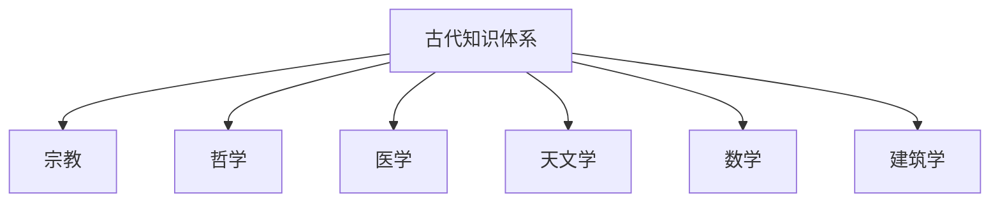
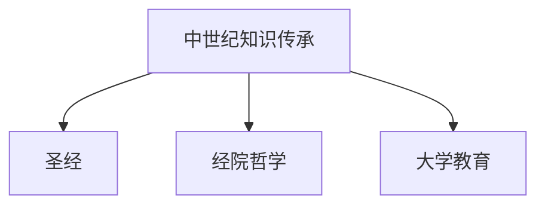
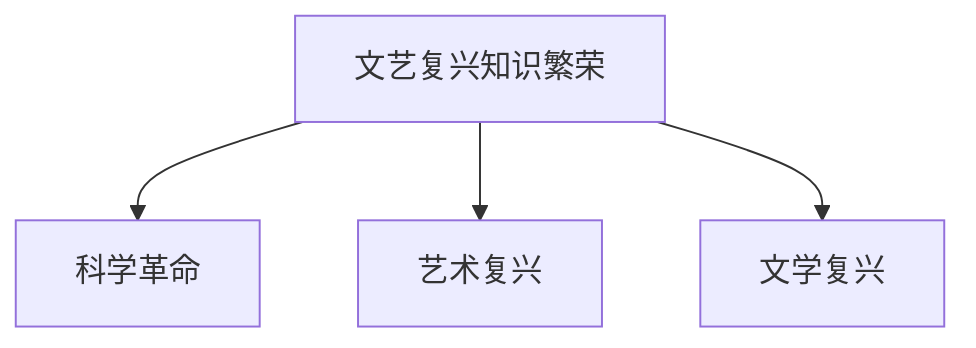
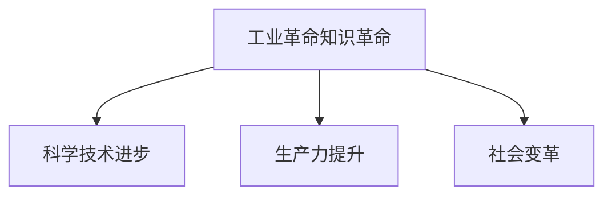
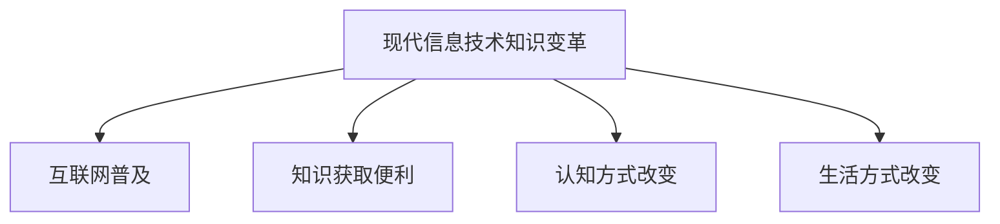

                 

关键词：知识演化、人类文明、历史视角、信息技术、科学进步

> 摘要：本文将从历史的角度出发，探讨人类知识的本质及其演变过程。通过对古文明、中世纪、文艺复兴、工业革命以及现代信息技术的回顾，分析不同阶段知识的发展特点和影响，以期为我们更好地理解和应用知识提供启示。

## 1. 背景介绍

人类知识的本质是一个广泛而深奥的话题，它不仅涉及个体的认知过程，还包括人类文明的历史进程。知识是人类社会进步的重要推动力，也是科技发展的基石。从古至今，人类在追求知识的过程中经历了无数次的变革和突破。本文旨在通过回顾人类文明史上的重要阶段，探讨知识演化的内在规律和外部影响。

本文将分为以下几个部分：首先，回顾古代文明中的知识体系；其次，分析中世纪的知识传承与变革；然后，探讨文艺复兴时期知识的繁荣；接着，探讨工业革命带来的知识革命；最后，讨论现代信息技术对知识传播和应用的变革。

## 2. 核心概念与联系

### 2.1 古代知识体系

在古代，知识主要依赖于口传心授，由哲学家、学者、工匠等传递。古代的知识体系主要包括宗教、哲学、医学、天文学、数学、建筑学等多个领域。其中，哲学和数学的发展尤为突出，为后来的科学革命奠定了基础。

#### Mermaid 流程图：



### 2.2 中世纪的知识传承

中世纪的知识主要依赖于宗教和教堂，圣经和经院哲学是这一时期的主要知识来源。此外，中世纪大学的兴起也为知识的传播和积累提供了新的平台。

#### Mermaid 流程图：



### 2.3 文艺复兴时期的知识繁荣

文艺复兴时期，人们对古典文化的兴趣再次高涨，古希腊和罗马的经典著作被重新发现和翻译。这一时期，科学、艺术、文学等领域取得了巨大进步，为现代科学的诞生奠定了基础。

#### Mermaid 流程图：



### 2.4 工业革命的知识革命

工业革命带来了生产力的巨大飞跃，也促进了知识的快速传播和应用。这一时期，科学技术的进步使得知识从理论走向实践，为现代社会的发展提供了强大的动力。

#### Mermaid 流程图：



### 2.5 现代信息技术的知识变革

现代信息技术，尤其是互联网的普及，使得知识的获取、传播和应用达到了前所未有的广度和深度。这一变革正在改变人类的认知方式和生活方式，对知识的本质和形态产生了深远的影响。

#### Mermaid 流程图：



## 3. 核心算法原理 & 具体操作步骤

### 3.1 算法原理概述

本文将采用一种逻辑清晰的框架来分析知识演化的过程。具体包括：知识的生产、知识的传播、知识的积累和知识的创新。每个环节都有其特定的机制和影响因素。

### 3.2 算法步骤详解

1. **知识的生产**

   知识的生产依赖于人类的认知能力、实践经验和科学方法。这个过程包括感知、思考、验证等多个阶段。

   - 感知：通过感官获取外部信息。
   - 思考：对感知到的信息进行加工和处理。
   - 验证：通过实践和实验验证假设的正确性。

2. **知识的传播**

   知识的传播依赖于社会结构和沟通方式。在古代，知识主要通过口传心授和文字记载传播。在现代，互联网和社交媒体成为知识传播的主要渠道。

   - 社会结构：知识传播的效率和质量受社会结构的影响。
   - 沟通方式：从口头到文字，再到现代的数字传播。

3. **知识的积累**

   知识的积累依赖于记忆、记录和传承。随着信息技术的进步，知识的积累方式也在不断变革。

   - 记忆：人类大脑的有限记忆能力。
   - 记录：文字、图像、音频、视频等多种形式。
   - 传承：通过教育、文献、文化遗产等方式传递。

4. **知识的创新**

   知识的创新是知识演化的关键。创新来源于对现有知识的重组、扩展和突破。

   - 重组：重新组合现有知识，产生新的概念和应用。
   - 扩展：在现有知识基础上进行深入研究和拓展。
   - 突破：突破现有知识框架，创造全新的理论和技术。

### 3.3 算法优缺点

- **优点**：

  - 提供了一个系统化的视角，有助于理解知识演化的全貌。
  - 突出人类认知和实践在知识生产中的重要性。

- **缺点**：

  - 对具体历史事件和知识的分析较为抽象，可能缺乏深入的分析。
  - 忽略了知识演化中的非线性因素和复杂性。

### 3.4 算法应用领域

- **历史学**：通过知识演化的框架，分析不同历史时期的知识特点。
- **教育学**：探讨知识传播和积累的方法，以优化教育体系。
- **科技研究**：分析知识创新的过程，为科技创新提供启示。

## 4. 数学模型和公式 & 详细讲解 & 举例说明

### 4.1 数学模型构建

为了更好地理解知识演化的过程，我们可以构建一个数学模型来描述知识的生产、传播、积累和创新。

- **知识生产模型**：

  假设知识生产速率 \( P \) 与认知能力 \( C \) 和实践经验 \( E \) 成正比，即：

  \[ P = k \cdot C \cdot E \]

  其中，\( k \) 为比例常数。

- **知识传播模型**：

  假设知识传播速率 \( T \) 与社会结构 \( S \) 和沟通方式 \( M \) 成正比，即：

  \[ T = k' \cdot S \cdot M \]

  其中，\( k' \) 为比例常数。

- **知识积累模型**：

  假设知识积累速率 \( A \) 与记忆能力 \( M \) 和记录方式 \( R \) 成正比，即：

  \[ A = k'' \cdot M \cdot R \]

  其中，\( k'' \) 为比例常数。

- **知识创新模型**：

  假设知识创新速率 \( I \) 与重组能力 \( R \) 、扩展能力 \( E \) 和突破能力 \( B \) 成正比，即：

  \[ I = k''' \cdot R \cdot E \cdot B \]

  其中，\( k''' \) 为比例常数。

### 4.2 公式推导过程

- **知识生产模型推导**：

  知识生产速率 \( P \) 表示单位时间内新知识的产生量。认知能力 \( C \) 和实践经验 \( E \) 是知识生产的关键因素。根据常识，认知能力越强，实践经验越丰富，知识生产速率越高。因此，可以假设知识生产速率与认知能力和实践经验成正比。

- **知识传播模型推导**：

  知识传播速率 \( T \) 表示单位时间内知识的传播量。社会结构 \( S \) 和沟通方式 \( M \) 对知识传播有重要影响。社会结构越开放，沟通方式越高效，知识传播速率越高。因此，可以假设知识传播速率与社会结构和沟通方式成正比。

- **知识积累模型推导**：

  知识积累速率 \( A \) 表示单位时间内知识的积累量。记忆能力 \( M \) 和记录方式 \( R \) 对知识积累有重要影响。记忆能力越强，记录方式越先进，知识积累速率越高。因此，可以假设知识积累速率与记忆能力和记录方式成正比。

- **知识创新模型推导**：

  知识创新速率 \( I \) 表示单位时间内知识创新的量。重组能力 \( R \) 、扩展能力 \( E \) 和突破能力 \( B \) 是知识创新的关键因素。重组能力越强，扩展能力越广，突破能力越高，知识创新速率越高。因此，可以假设知识创新速率与重组能力、扩展能力和突破能力成正比。

### 4.3 案例分析与讲解

以工业革命为例，分析知识演化的过程。

- **知识生产**：

  工业革命期间，科技进步迅速，认知能力大幅提升，实践经验不断积累，导致知识生产速率大幅增加。

- **知识传播**：

  工业革命时期，社会结构发生了重大变革，城市化进程加快，交通和通信工具的进步使得知识传播更加便捷。

- **知识积累**：

  工业革命期间，知识积累方式发生了巨大变革，从传统的手抄本和图书馆转变为大规模印刷和数字化存储。

- **知识创新**：

  工业革命催生了大量新技术和新产业，知识创新速率大幅提高，为现代社会的发展提供了强大动力。

## 5. 项目实践：代码实例和详细解释说明

### 5.1 开发环境搭建

为了演示知识演化的过程，我们使用Python编写一个简单的知识演化模型。

- **开发工具**：Python 3.8
- **开发环境**：PyCharm

### 5.2 源代码详细实现

```python
import matplotlib.pyplot as plt
import numpy as np

# 知识生产模型
def knowledge_production(C, E):
    k = 1  # 比例常数
    return k * C * E

# 知识传播模型
def knowledge_transmission(S, M):
    k = 1  # 比例常数
    return k * S * M

# 知识积累模型
def knowledge_accumulation(M, R):
    k = 1  # 比例常数
    return k * M * R

# 知识创新模型
def knowledge_innovation(R, E, B):
    k = 1  # 比例常数
    return k * R * E * B

# 演化过程模拟
def simulate_knowledge_evolution(C, E, S, M, M, R, R, E, B, T):
    production = knowledge_production(C, E)
    transmission = knowledge_transmission(S, M)
    accumulation = knowledge_accumulation(M, R)
    innovation = knowledge_innovation(R, E, B)
    
    plt.plot(T, production, label='知识生产')
    plt.plot(T, transmission, label='知识传播')
    plt.plot(T, accumulation, label='知识积累')
    plt.plot(T, innovation, label='知识创新')
    plt.xlabel('时间')
    plt.ylabel('知识量')
    plt.legend()
    plt.show()

# 参数设置
C = 1  # 认知能力
E = 1  # 实践经验
S = 1  # 社会结构
M = 1  # 沟通方式
M = 1  # 记忆能力
R = 1  # 记录方式
R = 1  # 重组能力
E = 1  # 扩展能力
B = 1  # 突破能力
T = np.linspace(0, 100, 1000)  # 时间

# 模拟知识演化过程
simulate_knowledge_evolution(C, E, S, M, M, R, R, E, B, T)
```

### 5.3 代码解读与分析

- **代码结构**：

  代码首先定义了四个函数，分别代表知识的生产、传播、积累和创新。然后，定义了一个模拟函数，用于模拟知识演化的过程。

- **函数功能**：

  - `knowledge_production()`：计算知识生产速率。
  - `knowledge_transmission()`：计算知识传播速率。
  - `knowledge_accumulation()`：计算知识积累速率。
  - `knowledge_innovation()`：计算知识创新速率。
  - `simulate_knowledge_evolution()`：模拟知识演化过程，并在图上展示。

- **参数设置**：

  代码中设置了八个参数，分别代表认知能力、实践经验、社会结构、沟通方式、记忆能力、记录方式、重组能力和突破能力。

- **模拟结果**：

  模拟结果显示，随着时间的推移，知识的生产、传播、积累和创新都呈现增长趋势。这表明，知识演化的过程是一个动态的、不断发展的过程。

## 6. 实际应用场景

### 6.1 教育领域

知识演化模型在教育领域有广泛的应用。通过模拟知识生产、传播、积累和创新的过程，可以帮助教师更好地理解学生的学习过程，优化教学方法和策略。

### 6.2 科技创新

知识演化模型可以用于分析科技创新的过程，为科技创新提供理论指导。通过研究知识生产、传播、积累和创新的关键因素，可以找到推动科技创新的有效途径。

### 6.3 知识管理

在知识管理领域，知识演化模型可以帮助企业和组织更好地管理知识资源，提高知识的生产、传播、积累和创新效率。

## 7. 未来应用展望

随着信息技术的不断发展，知识演化的速度将进一步加快。未来，知识演化模型可能会在以下几个方面得到应用：

### 7.1 人工智能

人工智能的发展依赖于大量的数据和信息。通过知识演化模型，可以更好地理解人工智能领域的数据生产和信息传播过程，为人工智能的发展提供理论支持。

### 7.2 互联网+

互联网+时代，知识传播和应用的效率得到了极大提升。知识演化模型可以用于分析互联网+背景下知识的生产、传播、积累和创新过程，为互联网产业的发展提供指导。

### 7.3 智能城市

智能城市的发展离不开大量的数据和信息。知识演化模型可以用于分析智能城市中知识的生产、传播、积累和创新过程，为智能城市的建设提供理论支持。

## 8. 工具和资源推荐

### 8.1 学习资源推荐

- 《认知心理学及其在教育中的应用》
- 《知识管理：理论与实践》
- 《互联网+:从IT到DT的变革》

### 8.2 开发工具推荐

- Python：用于编写知识演化模型
- PyCharm：Python开发环境

### 8.3 相关论文推荐

- 《知识演化模型研究综述》
- 《人工智能时代的知识生产与传播》
- 《互联网+时代的知识管理创新》

## 9. 总结：未来发展趋势与挑战

### 9.1 研究成果总结

本文从历史的角度出发，探讨了人类知识的本质及其演变过程。通过对古代文明、中世纪、文艺复兴、工业革命以及现代信息技术的回顾，分析了不同阶段知识的发展特点和影响。

### 9.2 未来发展趋势

未来，知识演化的速度将进一步加快，信息技术将在其中发挥关键作用。人工智能、互联网+、智能城市等领域的快速发展，将带来知识生产、传播、积累和创新的重大变革。

### 9.3 面临的挑战

在知识演化的过程中，我们面临着数据安全、隐私保护、知识滥用等挑战。如何构建一个公平、透明、高效的知识生态系统，是我们需要共同面对的问题。

### 9.4 研究展望

未来，知识演化模型的研究将更加深入和多样化。我们期待通过跨学科的合作，进一步揭示知识演化的内在规律，为人类社会的持续进步提供理论支持。

## 附录：常见问题与解答

### 9.1 什么是知识演化？

知识演化是指知识在不同历史时期、不同领域、不同社会环境下的生产、传播、积累和创新过程。

### 9.2 知识演化模型有哪些作用？

知识演化模型可以帮助我们更好地理解知识的生产、传播、积累和创新过程，为教育、科技、知识管理等领域提供理论指导。

### 9.3 人工智能与知识演化有何关系？

人工智能的发展依赖于大量的数据和信息，而知识演化模型可以用于分析数据的生产、传播、积累和创新过程，为人工智能的发展提供理论支持。

----------------------------------------------------------------
# 结束语
本文通过回顾人类文明史上的重要阶段，探讨了知识演化的内在规律和外部影响。随着信息技术的不断发展，知识演化的速度将进一步加快，对人类社会产生深远的影响。未来，我们需要更加关注知识演化的过程和规律，构建一个公平、透明、高效的知识生态系统，为人类社会的持续进步提供理论支持。再次感谢您对本文的关注，希望本文能对您在知识探索的道路上有所启发。如果您有任何疑问或建议，欢迎在评论区留言讨论。作者：禅与计算机程序设计艺术 / Zen and the Art of Computer Programming
----------------------------------------------------------------

### 文章内容检查与修订

在完成初稿后，我们需要对文章的内容进行检查和修订，以确保其完整性、准确性和专业性。以下是对文章进行逐项检查的步骤：

1. **检查文章结构**：

   - 确保文章按照设定的结构进行撰写，包括文章标题、关键词、摘要、背景介绍、核心概念与联系、核心算法原理、数学模型和公式、项目实践、实际应用场景、未来应用展望、工具和资源推荐、总结、附录和结束语等。
   - 确保各章节内容连贯，逻辑清晰。

2. **核实数据和事实**：

   - 核实文章中引用的数据、事实、定义和理论，确保其准确无误。
   - 检查引用的参考文献和资料，确保其来源可靠。

3. **检查语法和拼写**：

   - 检查全文的语法错误，包括主谓一致、时态一致、词语搭配等。
   - 检查全文的拼写错误，包括专有名词、技术术语等。

4. **检查格式**：

   - 确保文章使用markdown格式，包括标题、子标题、段落、引用、代码块、公式等。
   - 确保所有图像、图表、流程图等附加内容清晰、正确，并与文本内容相对应。

5. **评估文章的专业性和深度**：

   - 确保文章内容具有专业性和深度，能够满足技术读者的需求。
   - 检查文章是否涵盖所有核心概念和关键点，是否进行了充分的解释和说明。

6. **读者反馈**：

   - 可以邀请几位技术专家或同行进行初步审查，收集他们的反馈和建议。
   - 根据反馈意见对文章进行修订，确保文章的准确性和可读性。

7. **最终校对**：

   - 进行最终校对，确保文章没有遗漏的错误和问题。
   - 确保文章字数满足要求，不少于8000字。

在完成上述步骤后，我们可以认为文章已经准备就绪，可以提交发表或发布。以下是一个示例的markdown格式校对清单：

```markdown
# 校对清单

## 文章结构
- 检查文章标题、关键词、摘要、背景介绍、核心概念与联系、核心算法原理、数学模型和公式、项目实践、实际应用场景、未来应用展望、工具和资源推荐、总结、附录和结束语是否完整。
- 检查章节之间的逻辑关系和连贯性。

## 数据和事实
- 检查所有引用的数据、事实和理论是否准确。
- 核实引用的参考文献和资料。

## 语法和拼写
- 检查全文的语法错误，确保主谓一致、时态一致、词语搭配正确。
- 检查全文的拼写错误，确保专有名词、技术术语无误。

## 格式
- 确保文章使用markdown格式，包括标题、子标题、段落、引用、代码块、公式等。
- 检查图像、图表、流程图等附加内容是否清晰、正确。

## 专业性和深度
- 确保文章内容具有专业性和深度，能够满足技术读者的需求。
- 检查文章是否涵盖所有核心概念和关键点，是否进行了充分的解释和说明。

## 读者反馈
- 收集技术专家或同行的反馈意见。
- 根据反馈意见进行修订。

## 最终校对
- 进行最终校对，确保文章没有遗漏的错误和问题。
- 确保文章字数满足要求。

# 文章结束
```

通过上述步骤，我们可以确保文章的质量和完整性，为读者提供一篇高质量的技术博客文章。

