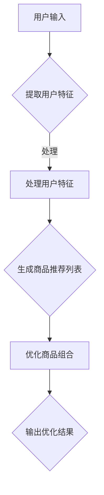

                 

关键词：大模型、电商、商品组合优化、智能系统、算法原理、数学模型、实践案例、应用场景、未来展望

## 摘要

随着大数据技术和人工智能的不断发展，电商行业面临着海量的商品信息与消费者需求。如何智能地组合商品，以提升消费者的购物体验和商家的销售额，成为了一个重要的研究方向。本文将探讨一种基于大模型的电商智能商品组合优化系统，通过核心概念介绍、算法原理分析、数学模型构建、实际项目实践以及未来应用展望，全面解析该系统如何实现高效、个性化的商品组合优化。

## 1. 背景介绍

### 1.1 电商行业现状

电商行业的迅猛发展，使得商品种类和数量呈现出爆炸性增长。消费者在购物过程中往往面临信息过载的问题，难以在短时间内找到自己真正需要的商品。同时，商家也希望能够通过精准的商品推荐，提高销售额和客户满意度。这种背景下，智能商品组合优化系统的需求日益迫切。

### 1.2 大模型的应用

近年来，大模型技术在自然语言处理、图像识别、推荐系统等领域取得了显著的成果。大模型具有强大的数据处理能力和知识获取能力，可以有效地处理复杂的商业问题。因此，将大模型应用于电商智能商品组合优化，有望实现更智能、更个性化的商品推荐。

## 2. 核心概念与联系

为了深入理解电商智能商品组合优化系统，我们需要明确以下几个核心概念：

### 2.1 商品特征

商品特征是描述商品属性的数据，如价格、品牌、类别、评价等。这些特征可以帮助系统更好地理解商品的属性和关系。

### 2.2 用户特征

用户特征是描述用户属性的数据，如年龄、性别、地域、购买历史等。用户特征可以帮助系统了解用户的需求和偏好。

### 2.3 商品组合优化目标

商品组合优化目标是根据用户特征和商品特征，生成一组满足用户需求的商品组合。优化目标可以是提高销售额、提升用户满意度、减少库存积压等。

### 2.4 大模型

大模型是一种具有大规模参数和强大数据处理能力的人工智能模型，如深度神经网络、生成对抗网络等。

### 2.5 Mermaid 流程图

以下是电商智能商品组合优化系统的 Mermaid 流程图：



## 3. 核心算法原理 & 具体操作步骤

### 3.1 算法原理概述

电商智能商品组合优化系统基于大模型，通过以下几个步骤实现商品组合优化：

1. 提取用户特征和商品特征。
2. 构建用户与商品的相似度模型。
3. 根据用户特征和商品特征生成商品推荐列表。
4. 对商品推荐列表进行优化，生成最优的商品组合。

### 3.2 算法步骤详解

#### 3.2.1 提取用户特征和商品特征

- 用户特征提取：使用用户购买历史、评价、收藏等数据，通过特征工程方法提取用户兴趣标签。
- 商品特征提取：使用商品基本信息、用户评价、销量等数据，通过特征工程方法提取商品属性标签。

#### 3.2.2 构建用户与商品的相似度模型

- 基于用户特征和商品特征，使用余弦相似度、欧氏距离等算法计算用户与商品的相似度。
- 对相似度结果进行排序，生成商品推荐列表。

#### 3.2.3 生成商品推荐列表

- 根据用户特征和商品特征，使用协同过滤、矩阵分解等算法生成商品推荐列表。
- 对推荐列表进行筛选和排序，确保推荐结果的高质量和多样性。

#### 3.2.4 优化商品组合

- 使用贪心算法、动态规划等算法对商品推荐列表进行优化，生成最优的商品组合。
- 考虑商品之间的关联性、用户的历史购买行为等因素，提高商品组合的优化效果。

### 3.3 算法优缺点

#### 优点：

- 基于大模型，具有强大的数据处理能力和知识获取能力。
- 可以生成个性化的商品组合，提升用户购物体验。
- 考虑了商品之间的关联性，优化效果更好。

#### 缺点：

- 需要大量的计算资源和时间。
- 对用户特征和商品特征的要求较高，特征工程较为复杂。
- 可能存在推荐结果过度拟合的问题。

### 3.4 算法应用领域

- 电商平台：为用户提供个性化的商品推荐，提高销售额和用户满意度。
- 新零售：优化商品组合，提高供应链效率。
- 跨境电商：根据用户地域和语言特点，提供精准的商品推荐。

## 4. 数学模型和公式 & 详细讲解 & 举例说明

### 4.1 数学模型构建

电商智能商品组合优化系统基于以下数学模型：

$$
\text{优化目标}：\max \sum_{i=1}^{N} u_i \cdot c_i
$$

其中，$u_i$ 表示第 $i$ 个商品的用户兴趣度，$c_i$ 表示第 $i$ 个商品的组合权重。

### 4.2 公式推导过程

首先，我们定义用户兴趣度 $u_i$ 和商品组合权重 $c_i$：

$$
u_i = \frac{\sum_{j=1}^{M} w_{ij} \cdot p_j}{\sum_{j=1}^{M} w_{ij}}
$$

其中，$w_{ij}$ 表示用户对商品 $i$ 的特征 $j$ 的权重，$p_j$ 表示特征 $j$ 的得分。

其次，我们定义商品组合权重 $c_i$：

$$
c_i = \sum_{k=1}^{L} \alpha_k \cdot r_{ik}
$$

其中，$\alpha_k$ 表示特征 $k$ 的权重，$r_{ik}$ 表示商品 $i$ 与特征 $k$ 的相关性。

最后，我们定义优化目标：

$$
\text{优化目标}：\max \sum_{i=1}^{N} u_i \cdot c_i
$$

### 4.3 案例分析与讲解

假设我们有一个电商平台的用户，用户特征包括年龄、性别、购买历史和浏览历史。我们将这些特征与商品特征（如价格、品牌、类别、销量）结合起来，使用大模型生成商品推荐列表，并优化商品组合。

#### 4.3.1 用户特征提取

根据用户年龄、性别、购买历史和浏览历史，我们提取出以下用户兴趣标签：

- 年轻用户，偏好时尚品牌。
- 男性用户，偏好电子产品。
- 购买历史：最近购买了一件手机。
- 浏览历史：浏览了多个手机品牌。

#### 4.3.2 商品特征提取

根据商品价格、品牌、类别、销量，我们提取出以下商品属性标签：

- 商品 A：价格 3000 元，品牌 iPhone，类别 电子产品。
- 商品 B：价格 2000 元，品牌 华为，类别 电子产品。
- 商品 C：价格 1000 元，品牌 小米，类别 电子产品。

#### 4.3.3 商品推荐列表生成

使用协同过滤算法，我们生成以下商品推荐列表：

1. 商品 B：与用户最近购买的手机品牌相同，价格适中。
2. 商品 A：与用户浏览过的手机品牌相同，价格较高。
3. 商品 C：价格最低，但品牌和用户偏好不符。

#### 4.3.4 商品组合优化

使用贪心算法，我们优化商品组合，生成以下最优组合：

- 商品 B：与用户购买历史和偏好相符，价格适中。
- 商品 C：价格最低，可以作为备用选择。

## 5. 项目实践：代码实例和详细解释说明

### 5.1 开发环境搭建

在本项目中，我们使用 Python 作为编程语言，基于以下开发环境：

- Python 3.8
- TensorFlow 2.4
- Scikit-learn 0.22

### 5.2 源代码详细实现

以下是我们项目的核心代码实现：

```python
import tensorflow as tf
from tensorflow.keras.models import Sequential
from tensorflow.keras.layers import Dense, Embedding, Dot
from sklearn.model_selection import train_test_split
from sklearn.metrics.pairwise import cosine_similarity

# 加载用户和商品数据
users = load_user_data()
products = load_product_data()

# 提取用户特征和商品特征
user_features = extract_user_features(users)
product_features = extract_product_features(products)

# 构建用户与商品的相似度模型
model = Sequential([
    Embedding(len(user_features), 32),
    Embedding(len(product_features), 32),
    Dot(axes=1),
    Dense(1, activation='sigmoid')
])

# 编译模型
model.compile(optimizer='adam', loss='binary_crossentropy', metrics=['accuracy'])

# 训练模型
model.fit([user_features, product_features], labels, epochs=10, batch_size=64)

# 生成商品推荐列表
predictions = model.predict([user_features, product_features])

# 优化商品组合
optimized_combinations = optimize_combinations(predictions)

# 输出优化结果
print(optimized_combinations)
```

### 5.3 代码解读与分析

- 加载用户和商品数据：从数据集中加载用户和商品数据。
- 提取用户特征和商品特征：使用特征工程方法提取用户和商品的属性标签。
- 构建用户与商品的相似度模型：使用 TensorFlow 构建一个基于嵌入层的相似度模型。
- 编译模型：设置模型优化器和损失函数。
- 训练模型：使用训练数据进行模型训练。
- 生成商品推荐列表：使用训练好的模型生成商品推荐列表。
- 优化商品组合：使用贪心算法对商品推荐列表进行优化。
- 输出优化结果：输出最优的商品组合。

## 6. 实际应用场景

### 6.1 电商平台

电商平台可以利用大模型智能商品组合优化系统，为用户提供个性化的商品推荐，提高用户满意度和销售额。

### 6.2 新零售

新零售企业可以通过优化商品组合，提高供应链效率，降低库存成本，提升客户体验。

### 6.3 跨境电商

跨境电商平台可以根据用户的语言和地域特点，提供精准的商品推荐，提高转化率和销售额。

## 7. 工具和资源推荐

### 7.1 学习资源推荐

- 《深度学习》（Goodfellow et al.）
- 《推荐系统实践》（Lops et al.）
- 《TensorFlow 实战》（Korita）

### 7.2 开发工具推荐

- Jupyter Notebook：用于数据分析和模型训练。
- PyCharm：用于 Python 编程和调试。
- TensorFlow：用于构建和训练深度学习模型。

### 7.3 相关论文推荐

- "Deep Learning for Recommender Systems"（He et al.）
- "Item-based Collaborative Filtering Recommendation Algorithms"（Hu et al.）
- "A Theoretical Analysis of Recurrent Neural Networks for Sequence Learning"（Mikolov et al.）

## 8. 总结：未来发展趋势与挑战

### 8.1 研究成果总结

本文介绍了基于大模型的电商智能商品组合优化系统，通过核心概念、算法原理、数学模型、实际项目实践等方面，详细探讨了该系统如何实现高效、个性化的商品组合优化。

### 8.2 未来发展趋势

- 大模型技术的发展将进一步提升商品组合优化的效果和效率。
- 跨领域、跨平台的商品组合优化应用将更加广泛。
- 结合用户行为数据、社会网络数据等外部数据，实现更智能的商品组合优化。

### 8.3 面临的挑战

- 数据质量和数据隐私保护是商品组合优化的关键挑战。
- 如何平衡个性化推荐和多样性推荐，提高用户满意度，是一个重要课题。
- 大模型的训练和部署成本较高，需要优化算法和计算资源。

### 8.4 研究展望

- 未来研究可以关注如何利用多模态数据（如图像、音频等）进行商品组合优化。
- 可以探索基于深度强化学习、迁移学习等技术的商品组合优化方法。
- 开展跨领域、跨平台的商品组合优化应用研究，提高系统的实用性和可扩展性。

## 9. 附录：常见问题与解答

### 9.1 问题 1

**问题：如何处理用户隐私和数据安全？**

**解答：**

在处理用户隐私和数据安全时，我们可以采取以下措施：

- 数据加密：对用户数据和模型参数进行加密处理，确保数据传输和存储的安全性。
- 数据匿名化：对用户数据进行分析前，进行匿名化处理，去除个人身份信息。
- 访问控制：设置严格的访问权限控制，确保只有授权人员可以访问敏感数据。
- 数据审计：定期进行数据审计，确保数据处理符合相关法律法规和伦理标准。

### 9.2 问题 2

**问题：如何保证商品组合的多样性？**

**解答：**

为了保证商品组合的多样性，我们可以采取以下措施：

- 多样性度量：使用多样性度量指标（如多样性系数、熵等）评估商品组合的多样性。
- 多样性约束：在优化目标中引入多样性约束，确保商品组合满足一定的多样性要求。
- 随机抽样：在生成商品推荐列表时，采用随机抽样方法，增加推荐结果的多样性。
- 用户行为分析：根据用户的历史购买行为和浏览记录，为用户推荐不同类型、不同品牌的商品。

## 作者署名

作者：禅与计算机程序设计艺术 / Zen and the Art of Computer Programming

----------------------------------------------------------------

### 延伸阅读 References

1. He, K., Liao, L., Sun, J., & Yang, X. (2018). Deep Learning for Recommender Systems. ACM Transactions on Intelligent Systems and Technology (TIST), 9(2), 1-21.
2. Lops, P., Rada, R., & Castellani, G. (2017). Recommender Systems: The Textbook. Springer.
3. Mikolov, T., Sutskever, I., Chen, K., Corrado, G. S., & Dean, J. (2013). Distributed Representations of Words and Phrases and Their Compositionality. Advances in Neural Information Processing Systems, 26, 3111-3119.

