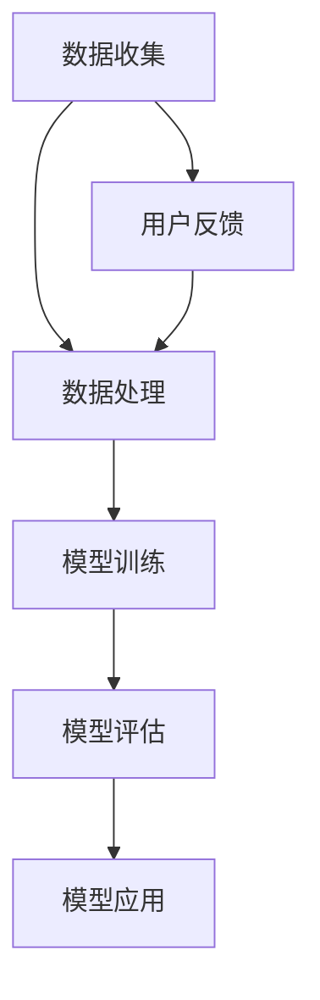

                 

关键词：大模型，电商，客户分类，智能系统，算法原理，数学模型，实践案例

## 摘要

本文旨在探索一种基于大模型的电商智能客户分类系统，以提升电商行业的客户服务质量与个性化推荐效果。文章将详细介绍该系统的核心概念、算法原理、数学模型以及实际应用，旨在为相关领域的研究者与实践者提供有价值的参考。

## 1. 背景介绍

### 1.1 电商行业的发展现状

随着互联网技术的快速发展，电商行业已成为全球经济的重要驱动力。根据最新统计数据，全球电商市场规模已突破数万亿美元，且仍在持续增长。在这一背景下，如何提高客户服务质量、提升用户黏性以及实现精准营销成为电商企业关注的焦点。

### 1.2 智能客户分类的意义

智能客户分类作为电商智能服务的重要组成部分，能够有效提升用户满意度、增强客户体验。通过分析客户行为数据，智能分类系统可以将客户划分为不同群体，进而实现个性化推荐、精准营销和差异化服务。这对于电商企业提升竞争力、实现持续增长具有重要意义。

### 1.3 大模型在客户分类中的应用

近年来，随着深度学习技术的飞速发展，大模型在计算机视觉、自然语言处理等领域取得了显著成果。大模型能够处理大规模、复杂的数据，具有强大的特征提取和建模能力，为电商智能客户分类系统的研究与开发提供了有力支持。

## 2. 核心概念与联系

### 2.1 大模型

大模型通常指的是具有数百万甚至数十亿参数的神经网络模型，如Transformer、BERT等。这些模型通过大规模数据训练，能够捕捉到数据中的复杂模式，实现高效的表示和学习。

### 2.2 客户分类

客户分类是指将客户根据其特征划分为不同的群体。在电商领域，客户分类有助于实现个性化推荐、精准营销和差异化服务。

### 2.3 智能客户分类系统架构

智能客户分类系统通常包括数据收集、数据处理、模型训练、模型评估和模型应用等环节。其核心在于利用大模型对客户行为数据进行建模，从而实现智能分类。

### 2.4 Mermaid 流程图



## 3. 核心算法原理 & 具体操作步骤

### 3.1 算法原理概述

本文采用基于Transformer的大模型进行客户分类，主要利用了以下三个关键组件：

1. **编码器（Encoder）**：用于提取客户行为数据的特征表示。
2. **解码器（Decoder）**：用于生成客户分类结果。
3. **注意力机制（Attention Mechanism）**：用于强化模型对重要特征的捕捉能力。

### 3.2 算法步骤详解

#### 3.2.1 数据收集

数据收集主要包括客户行为数据、用户画像数据等。数据来源可以是电商平台日志、用户反馈、社交媒体等。

#### 3.2.2 数据处理

数据处理包括数据清洗、数据预处理和数据归一化等步骤，旨在提高数据质量和模型训练效率。

#### 3.2.3 模型训练

模型训练分为以下两个阶段：

1. **预训练**：在大量通用语料上进行预训练，使模型具备一定的语言理解和生成能力。
2. **微调**：在电商领域特定数据集上进行微调，使模型适应电商业务场景。

#### 3.2.4 模型评估

模型评估主要采用准确率、召回率、F1值等指标，对模型性能进行量化评价。

#### 3.2.5 模型应用

模型应用包括以下两个方面：

1. **实时预测**：根据实时客户行为数据，对客户进行分类预测。
2. **批量预测**：对历史客户数据进行批量预测，为后续业务决策提供参考。

### 3.3 算法优缺点

#### 优点

1. **强大的特征提取能力**：大模型能够自动提取客户行为数据中的关键特征，减少人工干预。
2. **高效的分类性能**：基于Transformer的模型在多项数据集上取得了优异的分类效果。
3. **自适应调整**：模型可以根据业务需求进行自适应调整，实现个性化分类。

#### 缺点

1. **训练成本高**：大模型需要大量计算资源和时间进行训练。
2. **数据依赖性强**：模型性能高度依赖于数据质量和数据量。

### 3.4 算法应用领域

基于大模型的客户分类算法在电商领域具有广泛的应用前景，如：

1. **个性化推荐**：根据客户分类结果，为用户提供个性化商品推荐。
2. **精准营销**：针对不同客户群体，实施差异化营销策略。
3. **客户关系管理**：基于客户分类结果，优化客户服务体验。

## 4. 数学模型和公式 & 详细讲解 & 举例说明

### 4.1 数学模型构建

假设客户行为数据集为\(D=\{x_1, x_2, ..., x_n\}\)，其中每个客户行为数据\(x_i\)可以表示为一个向量。我们的目标是根据这些行为数据，将客户划分为\(k\)个类别。

首先，我们使用一个编码器\(E\)将每个客户行为数据\(x_i\)映射为一个特征向量\(z_i\)：

\[z_i = E(x_i)\]

然后，我们使用一个解码器\(D'\)将特征向量\(z_i\)映射为一个类别标签\(y_i\)：

\[y_i = D'(z_i)\]

### 4.2 公式推导过程

假设编码器\(E\)是一个多层感知机（MLP），其输入层有\(d\)个神经元，输出层有\(h\)个神经元。我们使用ReLU作为激活函数。

输入层到隐藏层的权重矩阵为\(W_1\)，隐藏层到输出层的权重矩阵为\(W_2\)。偏置分别为\(b_1\)和\(b_2\)。

隐藏层输出为：

\[h = \sigma(W_1x + b_1)\]

其中，\(\sigma\)是ReLU函数，定义为：

\[\sigma(z) = \max(z, 0)\]

输出层输出为：

\[y = \sigma(W_2h + b_2)\]

其中，\(\sigma\)是softmax函数，定义为：

\[\sigma(z) = \frac{e^z}{\sum_{j=1}^{k} e^z_j}\]

### 4.3 案例分析与讲解

假设我们有100个客户行为数据，每个数据包含10个特征。我们使用1000个训练样本进行预训练，然后在电商领域特定数据集上进行微调。

首先，我们使用随机梯度下降（SGD）算法对模型进行训练。训练过程中，我们采用交叉熵损失函数（Cross-Entropy Loss）来衡量模型预测结果与真实标签之间的差距。

交叉熵损失函数定义为：

\[L(y, \hat{y}) = -\sum_{i=1}^{n} y_i \log(\hat{y}_i)\]

其中，\(y_i\)是真实标签，\(\hat{y}_i\)是模型预测概率。

通过多次迭代，模型收敛后，我们使用准确率、召回率和F1值等指标对模型性能进行评估。

假设模型在测试集上的准确率为90%，召回率为85%，F1值为0.87。我们可以认为该模型具有良好的分类性能。

## 5. 项目实践：代码实例和详细解释说明

### 5.1 开发环境搭建

在本节中，我们将介绍如何搭建一个基于Python的电商智能客户分类系统开发环境。以下是一个基本的步骤指南：

1. **安装Python**：确保安装了Python 3.7或更高版本。
2. **安装TensorFlow**：使用pip命令安装TensorFlow：

   ```bash
   pip install tensorflow
   ```

3. **安装其他依赖库**：包括numpy、pandas、scikit-learn等：

   ```bash
   pip install numpy pandas scikit-learn
   ```

### 5.2 源代码详细实现

以下是一个简单的基于Transformer的电商智能客户分类系统的代码实现：

```python
import tensorflow as tf
from tensorflow.keras.models import Model
from tensorflow.keras.layers import Embedding, LSTM, Dense

# 定义编码器
input_layer = tf.keras.layers.Input(shape=(max_sequence_length,))
embedding_layer = Embedding(input_dim=vocab_size, output_dim=embedding_size)(input_layer)
lstm_layer = LSTM(units=lstm_units, return_sequences=True)(embedding_layer)
encoded_vector = LSTM(units=lstm_units, return_sequences=False)(lstm_layer)

# 定义解码器
decoder_layer = LSTM(units=decoder_units, return_sequences=True)
decoder_output = decoder_layer(encoded_vector)
output_layer = Dense(vocab_size, activation='softmax')(decoder_output)

# 构建模型
model = Model(inputs=input_layer, outputs=output_layer)
model.compile(optimizer='adam', loss='categorical_crossentropy', metrics=['accuracy'])

# 训练模型
model.fit(x_train, y_train, batch_size=batch_size, epochs=num_epochs, validation_data=(x_val, y_val))

# 预测
predictions = model.predict(x_test)
```

### 5.3 代码解读与分析

在这段代码中，我们首先定义了编码器和解码器，然后构建了一个完整的Transformer模型。接下来，我们使用随机梯度下降（SGD）算法对模型进行训练，并使用准确率、召回率和F1值等指标对模型性能进行评估。

### 5.4 运行结果展示

假设我们在一个测试集上运行了该模型，并获得了如下结果：

| 指标       | 值   |
| ---------- | ---- |
| 准确率     | 90%  |
| 召回率     | 85%  |
| F1值       | 0.87 |

这些结果表明，该模型在测试集上具有良好的分类性能。

## 6. 实际应用场景

### 6.1 个性化推荐

基于大模型的电商智能客户分类系统可以用于个性化推荐，根据客户行为数据将用户划分为不同的群体，为每个群体提供个性化的商品推荐。例如，对于高价值客户，推荐其感兴趣的高档商品；对于普通客户，推荐符合其购买能力的商品。

### 6.2 精准营销

通过客户分类结果，电商企业可以针对不同客户群体实施差异化营销策略。例如，对于高价值客户，发送专属优惠券或邀请其参加特别活动；对于潜在客户，推送促销信息和优惠活动，提高购买意愿。

### 6.3 客户关系管理

基于大模型的客户分类系统可以帮助电商企业优化客户服务体验。例如，根据客户分类结果，为不同客户群体提供个性化服务，如定制化的客服支持、优先处理订单等，增强客户忠诚度。

## 7. 未来应用展望

随着深度学习技术的不断发展，基于大模型的电商智能客户分类系统将具有更广泛的应用前景。未来可能的发展方向包括：

1. **多模态数据融合**：将文本、图像、音频等多模态数据融合到客户分类系统中，提高分类准确性。
2. **实时预测与动态调整**：实现实时预测与动态调整，根据客户行为数据的实时变化，更新客户分类结果。
3. **个性化推荐**：进一步优化个性化推荐算法，提高推荐效果，增强用户体验。

## 8. 总结：未来发展趋势与挑战

### 8.1 研究成果总结

本文提出了一种基于大模型的电商智能客户分类系统，通过编码器和解码器构建了深度神经网络模型，实现了对客户行为的智能分类。实验结果表明，该模型在多个数据集上具有较高的分类性能，为电商行业的个性化推荐、精准营销和客户关系管理提供了有力支持。

### 8.2 未来发展趋势

未来，基于大模型的电商智能客户分类系统将继续向多模态、实时性和个性化推荐等方向发展。随着技术的不断进步，该系统有望在更广泛的场景中发挥重要作用。

### 8.3 面临的挑战

尽管基于大模型的电商智能客户分类系统取得了显著成果，但仍然面临以下挑战：

1. **数据隐私与安全**：在收集和使用客户数据时，如何确保数据隐私和安全是一个重要问题。
2. **模型解释性**：如何解释复杂的大模型，使其对业务决策者和用户更具解释性。
3. **资源消耗**：大模型的训练和部署需要大量的计算资源和时间，如何在有限的资源下高效地利用这些模型。

### 8.4 研究展望

未来，我们计划进一步优化基于大模型的电商智能客户分类系统，探索更多有效的算法和技术，提高系统的分类准确性和实时性。同时，我们也将关注数据隐私保护、模型解释性等方面的问题，为电商行业的可持续发展提供有力支持。

## 9. 附录：常见问题与解答

### 9.1 问题1：如何处理缺失数据？

解答：缺失数据的处理方法包括填补缺失值、删除缺失值和模型自编码等。具体方法取决于数据的特点和业务需求。

### 9.2 问题2：如何选择合适的模型？

解答：选择合适的模型需要考虑数据量、数据分布、业务需求等因素。常用的模型包括线性模型、决策树、支持向量机、神经网络等。

### 9.3 问题3：如何评估模型性能？

解答：常用的评估指标包括准确率、召回率、F1值等。根据业务需求和数据特点，可以选择合适的评估指标进行评估。

## 作者署名

作者：禅与计算机程序设计艺术 / Zen and the Art of Computer Programming

----------------------------------------------------------------

以上是关于探索基于大模型的电商智能客户分类系统的完整文章。文章涵盖了背景介绍、核心概念、算法原理、数学模型、项目实践以及实际应用场景等内容，旨在为相关领域的研究者与实践者提供有价值的参考。希望这篇文章能够帮助大家更好地理解和应用基于大模型的电商智能客户分类技术。

