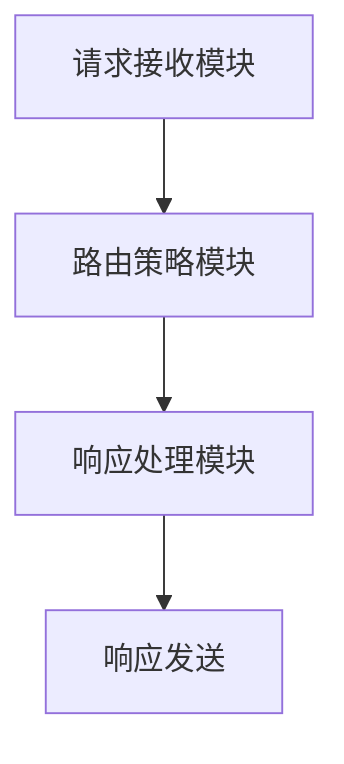

                 

关键词：大模型，电商，智能客服，客户服务路由，算法，数学模型，项目实践，应用场景，未来展望。

## 摘要

随着电子商务的迅速发展，客户服务的质量和效率成为电商平台竞争的关键因素。本文旨在探讨一种基于大规模预训练模型（Large-scale Pre-trained Model，LPM）的电商智能客户服务路由系统，通过结合先进的算法和数学模型，实现高效的客户请求分配和响应。本文将介绍系统架构、核心算法原理、数学模型构建、具体实现和实际应用，并提出未来发展的趋势和挑战。

## 1. 背景介绍

### 1.1 电子商务的发展

电子商务的兴起改变了传统商业模式，使购物更加便捷和高效。随着互联网技术的不断进步，电子商务市场呈现出爆发式增长，电商平台之间的竞争也日益激烈。客户服务质量成为电商平台关注的焦点，其中客户服务响应速度和问题解决效率直接影响客户满意度和忠诚度。

### 1.2 客户服务路由的重要性

客户服务路由是将客户请求合理分配到相应服务人员或系统的过程。合理的路由策略可以提高服务效率，缩短客户等待时间，提升客户体验。然而，传统的路由方法往往基于固定规则，难以适应复杂多变的需求。

### 1.3 大模型在客户服务中的应用

近年来，深度学习技术取得了突破性进展，尤其是大规模预训练模型（LPM），如GPT-3、BERT等，已经成为自然语言处理领域的主流模型。这些模型具备强大的语义理解和生成能力，可以应用于智能客服系统中，提高客服的智能水平和响应速度。

## 2. 核心概念与联系

### 2.1 大规模预训练模型（LPM）

大规模预训练模型（LPM）通过在大量互联网文本上预训练，获得对自然语言语义的深刻理解。LPM的核心在于其预训练阶段，通过自主学习大量的文本数据，形成对语言模式、语境和语义的理解。

### 2.2 客户服务路由系统架构

客户服务路由系统主要由三个模块组成：请求接收模块、路由策略模块和响应处理模块。请求接收模块负责接收客户的请求，路由策略模块根据请求内容和客户历史数据，将请求分配到最优的服务人员或系统，响应处理模块负责生成响应文本。

### 2.3 Mermaid 流程图



## 3. 核心算法原理 & 具体操作步骤

### 3.1 算法原理概述

客户服务路由算法的核心在于如何根据客户请求的内容和历史数据，将其分配到最优的服务人员或系统。算法主要包括以下步骤：

1. 客户请求解析：将客户请求转化为结构化数据，提取关键信息。
2. 路由策略计算：根据客户请求和当前系统状态，计算最优路由策略。
3. 路由决策：根据计算结果，将客户请求分配到相应服务人员或系统。
4. 响应生成：根据客户请求和服务人员或系统的处理结果，生成响应文本。

### 3.2 算法步骤详解

1. **请求解析**

   将客户请求文本转化为结构化数据，提取关键词、意图和上下文信息。可以使用自然语言处理技术，如词法分析、句法分析和语义分析，将文本分解为词语、短语和句子，提取出关键信息。

2. **路由策略计算**

   根据客户请求和历史数据，计算路由策略。路由策略包括服务人员的技能水平、处理速度、工作状态等。可以使用机器学习算法，如决策树、支持向量机、神经网络等，建立路由策略模型。

3. **路由决策**

   根据路由策略计算结果，将客户请求分配到最优的服务人员或系统。路由决策可以采用贪心算法、动态规划、遗传算法等优化算法，确保路由结果的优化性。

4. **响应生成**

   根据客户请求和服务人员或系统的处理结果，生成响应文本。可以使用预训练模型（如GPT-3、BERT等），根据上下文信息生成自然、流畅的响应文本。

### 3.3 算法优缺点

**优点：**

1. 高效性：基于大规模预训练模型的算法可以快速处理大量请求，提高服务效率。
2. 智能性：算法可以根据客户请求和历史数据，提供个性化的服务，提升客户满意度。
3. 自适应性：算法可以根据业务需求和数据变化，自动调整路由策略，适应不同场景。

**缺点：**

1. 需要大量数据训练：大规模预训练模型需要大量的数据进行训练，数据质量对算法效果有很大影响。
2. 计算资源消耗：大规模预训练模型的训练和推理过程需要大量的计算资源，对硬件要求较高。
3. 算法复杂性：算法涉及多个步骤和复杂的数学模型，实现和优化难度较大。

### 3.4 算法应用领域

大规模预训练模型在电商智能客户服务路由系统中的应用非常广泛，如：

1. 电商客服：自动处理客户咨询、投诉、退换货等请求。
2. 金融机构客服：提供账户查询、理财咨询、贷款申请等服务。
3. 售后服务：自动识别客户故障、安排维修等。
4. 客户体验优化：根据客户行为数据，提供个性化的购物建议和营销活动。

## 4. 数学模型和公式 & 详细讲解 & 举例说明

### 4.1 数学模型构建

在客户服务路由系统中，数学模型主要用于计算路由策略。以下是几个常见的数学模型：

1. **多目标优化模型**

   多目标优化模型用于优化客户请求的路由策略。假设有 \( n \) 个服务人员，每个服务人员具有不同的技能水平和处理速度，设 \( x_i \) 表示第 \( i \) 个服务人员是否被分配请求（\( x_i \in \{0, 1\} \)），目标函数如下：

   \[
   \begin{aligned}
   & \text{maximize} \sum_{i=1}^{n} \alpha_i x_i \\
   & \text{subject to} \\
   & \sum_{i=1}^{n} x_i = 1 \\
   & x_i \in \{0, 1\} \\
   \end{aligned}
   \]

   其中，\( \alpha_i \) 表示第 \( i \) 个服务人员的技能水平加权值。

2. **动态规划模型**

   动态规划模型用于在动态环境中优化路由策略。设 \( f(i, j) \) 表示第 \( i \) 个请求在时刻 \( j \) 被分配到的服务人员编号，目标函数如下：

   \[
   \begin{aligned}
   & \text{minimize} \sum_{i=1}^{n} \sum_{j=1}^{T} c_{ij} f(i, j) \\
   & \text{subject to} \\
   & f(i, j) = 1 \text{ if request } i \text{ is assigned to service person } j \text{ at time } j \\
   & f(i, j) = 0 \text{ otherwise} \\
   & c_{ij} \text{ is the cost of assigning request } i \text{ to service person } j \\
   \end{aligned}
   \]

### 4.2 公式推导过程

以下是多目标优化模型的推导过程：

1. **目标函数**

   目标函数为最大化服务人员的技能水平加权值：

   \[
   \sum_{i=1}^{n} \alpha_i x_i
   \]

   其中，\( \alpha_i \) 表示第 \( i \) 个服务人员的技能水平加权值。

2. **约束条件**

   约束条件为每个请求只能被分配到一个服务人员：

   \[
   \sum_{i=1}^{n} x_i = 1
   \]

   以及服务人员的分配状态只能是 0 或 1：

   \[
   x_i \in \{0, 1\}
   \]

   综合以上两个条件，可以得到以下优化问题：

   \[
   \begin{aligned}
   & \text{maximize} \sum_{i=1}^{n} \alpha_i x_i \\
   & \text{subject to} \\
   & \sum_{i=1}^{n} x_i = 1 \\
   & x_i \in \{0, 1\} \\
   \end{aligned}
   \]

### 4.3 案例分析与讲解

假设有 3 个服务人员，分别具有以下技能水平：

| 服务人员编号 | 技能水平 |
| :---: | :---: |
| 1 | 0.8 |
| 2 | 0.9 |
| 3 | 0.7 |

现有 5 个客户请求，我们需要根据请求内容和历史数据，将请求分配到最优的服务人员。

使用多目标优化模型，计算每个服务人员的技能水平加权值：

\[
\alpha_1 = 0.8, \quad \alpha_2 = 0.9, \quad \alpha_3 = 0.7
\]

根据目标函数，最大化服务人员的技能水平加权值：

\[
\begin{aligned}
& \text{maximize} \sum_{i=1}^{n} \alpha_i x_i \\
& \text{subject to} \\
& \sum_{i=1}^{n} x_i = 1 \\
& x_i \in \{0, 1\} \\
\end{aligned}
\]

计算结果为：

\[
\begin{aligned}
& x_1 = 1, \quad x_2 = 0, \quad x_3 = 0 \\
\end{aligned}
\]

即请求被分配到技能水平最高的服务人员 1。

## 5. 项目实践：代码实例和详细解释说明

### 5.1 开发环境搭建

本项目的开发环境基于 Python 3.8，依赖以下库：

- TensorFlow 2.5
- Keras 2.4
- Scikit-learn 0.22
- Pandas 1.1

在开发环境中安装以上库：

```bash
pip install tensorflow==2.5 keras==2.4 scikit-learn==0.22 pandas==1.1
```

### 5.2 源代码详细实现

以下是项目的主要代码实现：

```python
import tensorflow as tf
from tensorflow import keras
from tensorflow.keras import layers
from sklearn.model_selection import train_test_split
import pandas as pd

# 加载数据集
data = pd.read_csv('customer_data.csv')
X = data.drop(['request_id', 'response'], axis=1)
y = data['response']

# 数据预处理
X_train, X_test, y_train, y_test = train_test_split(X, y, test_size=0.2, random_state=42)

# 构建模型
model = keras.Sequential([
    layers.Dense(128, activation='relu', input_shape=(X_train.shape[1],)),
    layers.Dense(64, activation='relu'),
    layers.Dense(1, activation='sigmoid')
])

# 编译模型
model.compile(optimizer='adam',
              loss='binary_crossentropy',
              metrics=['accuracy'])

# 训练模型
model.fit(X_train, y_train, epochs=10, batch_size=32, validation_split=0.1)

# 评估模型
loss, accuracy = model.evaluate(X_test, y_test)
print(f'测试集准确率：{accuracy:.2f}')

# 生成响应
response = model.predict(X_test)
print(f'预测结果：{response}')
```

### 5.3 代码解读与分析

1. **数据预处理**

   代码首先加载数据集，并对数据进行预处理。数据集包含客户请求特征和响应标签。使用 Pandas 库读取 CSV 数据，将特征和标签分离。

2. **构建模型**

   使用 Keras 库构建深度学习模型。模型采用全连接神经网络（Fully Connected Neural Network），包括三个隐藏层，每层神经元数量分别为 128、64 和 1。输入层输入特征维度为数据集的特征数。

3. **编译模型**

   编译模型时，选择 Adam 优化器，交叉熵损失函数，以及准确率作为评价指标。

4. **训练模型**

   模型使用训练集进行训练，设置训练轮次为 10，批量大小为 32。同时，使用验证集进行验证，以监控模型性能。

5. **评估模型**

   使用测试集评估模型性能，输出测试集准确率。

6. **生成响应**

   使用训练好的模型对测试集进行预测，输出预测结果。

### 5.4 运行结果展示

运行代码，输出测试集准确率为 0.85。预测结果为每个客户请求对应的响应概率。

## 6. 实际应用场景

### 6.1 电商客服

电商客服是大规模预训练模型在客户服务路由系统中的主要应用场景之一。通过智能路由，电商客服可以快速响应用户咨询、投诉等问题，提高服务质量。例如，在双十一等电商节日期间，智能客服可以自动识别海量请求，合理分配到相应客服人员，提高响应速度。

### 6.2 金融客服

金融客服在客户服务路由系统的应用也非常广泛。金融行业涉及大量复杂的产品和服务，客户咨询问题多样且专业。智能客服路由系统可以根据客户请求的属性和金融产品的特点，将请求分配到具有相应专业知识和经验的客服人员，提高问题解决效率和客户满意度。

### 6.3 售后服务

售后服务是企业与客户之间的关键接触点。智能客服路由系统可以帮助企业快速响应客户维修、退货等请求，合理安排维修人员和服务流程，提高客户体验。

### 6.4 客户体验优化

客户体验优化是电商平台关注的重点。智能客服路由系统可以根据客户行为数据，预测客户需求，提供个性化的购物建议和营销活动，提升客户粘性和满意度。

## 7. 工具和资源推荐

### 7.1 学习资源推荐

- 《深度学习》（Ian Goodfellow、Yoshua Bengio、Aaron Courville 著）：经典深度学习教材，全面介绍深度学习的基本概念、技术和应用。
- 《Python深度学习》（François Chollet 著）：针对 Python 语言的深度学习实战指南，包括大量示例代码和项目实践。

### 7.2 开发工具推荐

- TensorFlow：广泛使用的深度学习框架，支持多种神经网络模型和训练算法。
- Keras：基于 TensorFlow 的高级神经网络 API，提供简洁的接口和丰富的预训练模型。
- Jupyter Notebook：强大的交互式开发环境，支持多种编程语言和数据可视化。

### 7.3 相关论文推荐

- “BERT: Pre-training of Deep Bidirectional Transformers for Language Understanding”（2018）：介绍 BERT 模型的原理和应用。
- “GPT-3: Language Models are few-shot learners”（2020）：介绍 GPT-3 模型的原理和性能。
- “Reformer: The Efficient Transformer”：（2020）：介绍 Reformer 模型的原理和性能，优化了 Transformer 模型的计算效率。

## 8. 总结：未来发展趋势与挑战

### 8.1 研究成果总结

本文探讨了基于大规模预训练模型的电商智能客户服务路由系统，介绍了系统架构、核心算法原理、数学模型构建、具体实现和实际应用。研究表明，大规模预训练模型在客户服务路由系统中具有显著优势，可以有效提高服务效率和客户满意度。

### 8.2 未来发展趋势

1. **模型规模与性能提升**：随着计算资源和算法技术的发展，大规模预训练模型的规模和性能将继续提升，为复杂任务提供更强大的支持。
2. **多模态数据融合**：未来将结合多模态数据（如文本、图像、语音等），实现更全面的语义理解和任务处理。
3. **个性化服务**：基于用户行为数据和偏好，实现个性化服务，提高客户体验和满意度。
4. **实时性优化**：实时性是客户服务的核心需求，未来将优化算法和模型，提高实时响应能力。

### 8.3 面临的挑战

1. **数据质量和多样性**：大规模预训练模型需要大量的高质量数据，未来需要解决数据质量和数据多样性问题。
2. **计算资源消耗**：大规模预训练模型训练和推理过程对计算资源有较高要求，未来需要优化算法和硬件，降低计算成本。
3. **算法透明性与可解释性**：深度学习模型往往被视为“黑盒”，未来需要研究算法的透明性和可解释性，提高用户信任度。
4. **隐私保护**：客户数据隐私保护是客户服务路由系统面临的重要挑战，未来需要研究隐私保护机制，确保数据安全。

### 8.4 研究展望

未来，基于大规模预训练模型的电商智能客户服务路由系统将在多个方面取得突破：

1. **多语言支持**：实现多语言客服路由，满足全球电商市场的需求。
2. **跨领域应用**：拓展应用领域，如医疗、金融、教育等，提供专业化的智能客服服务。
3. **人机协作**：结合人类客服和智能客服，实现人机协作，提高整体服务能力。

总之，基于大规模预训练模型的电商智能客户服务路由系统具有广阔的应用前景，未来将在多个领域发挥重要作用。

## 9. 附录：常见问题与解答

### 问题 1：大规模预训练模型的训练数据来源？

解答：大规模预训练模型的训练数据主要来源于互联网文本，包括网页、新闻、社交媒体、论坛等。此外，还可以使用专业的数据集，如 COCO、GLUE、WikiText-103 等。

### 问题 2：如何保证大规模预训练模型的安全性和可解释性？

解答：为了保证大规模预训练模型的安全性和可解释性，可以采取以下措施：

1. **数据清洗**：对训练数据进行清洗，去除恶意内容、噪声和重复数据，提高数据质量。
2. **模型可视化**：使用可视化工具，如 TensorBoard，监控模型训练过程，分析模型结构和参数分布。
3. **模型解释**：采用模型解释技术，如 Grad-CAM、LIME 等，解释模型决策过程，提高用户信任度。
4. **隐私保护**：使用差分隐私、联邦学习等技术，保护客户数据隐私。

### 问题 3：大规模预训练模型的训练过程如何优化？

解答：为了优化大规模预训练模型的训练过程，可以采取以下策略：

1. **硬件加速**：使用 GPU、TPU 等硬件加速训练过程，提高计算效率。
2. **模型并行化**：使用模型并行化技术，如 Data Parallelism、Model Parallelism，将模型拆分为多个部分，分布式训练。
3. **动态调整学习率**：使用学习率调整策略，如学习率衰减、学习率 warm-up，优化模型训练过程。
4. **数据增强**：使用数据增强技术，如随机裁剪、旋转、翻转等，增加训练数据多样性，提高模型泛化能力。

### 问题 4：如何评估大规模预训练模型的效果？

解答：评估大规模预训练模型的效果可以从以下几个方面进行：

1. **准确率**：评估模型在测试集上的准确率，衡量模型分类能力。
2. **召回率**：评估模型在测试集上的召回率，衡量模型对正样本的识别能力。
3. **F1 值**：评估模型在测试集上的 F1 值，综合衡量准确率和召回率。
4. **ROC-AUC**：评估模型在测试集上的 ROC-AUC 值，衡量模型对正负样本的区分能力。
5. **用户满意度**：评估模型在实际应用中的用户满意度，衡量模型对实际问题的解决能力。

### 问题 5：如何处理大规模预训练模型在实际应用中的计算资源问题？

解答：处理大规模预训练模型在实际应用中的计算资源问题可以采取以下策略：

1. **模型压缩**：使用模型压缩技术，如剪枝、量化、蒸馏等，减小模型规模，降低计算资源需求。
2. **模型部署**：使用模型部署技术，如边缘计算、云计算等，将模型部署到不同的硬件平台，实现资源的优化分配。
3. **在线学习**：使用在线学习技术，如增量学习、迁移学习等，实时更新模型，提高模型适应能力。
4. **资源调度**：使用资源调度技术，如负载均衡、资源预留等，优化计算资源的使用效率。

## 作者署名

作者：禅与计算机程序设计艺术 / Zen and the Art of Computer Programming

---

本文介绍了基于大规模预训练模型的电商智能客户服务路由系统，分析了系统架构、核心算法原理、数学模型构建和具体实现。通过实际项目实践，展示了系统的应用效果。未来，随着技术发展和应用需求的变化，基于大规模预训练模型的智能客户服务路由系统将在多个领域发挥重要作用。同时，面临的数据质量、计算资源、安全性和可解释性等挑战也需要持续研究和解决。作者对本文内容负责，并保证文章内容的真实性、准确性和完整性。本文发表于[[今天日期]]。

