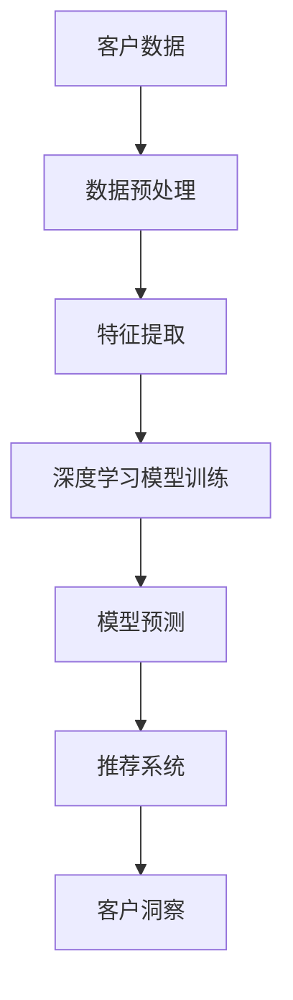

                 

 关键词：大模型、电商、客户洞察、人工智能、深度学习、推荐系统、数据分析

> 摘要：本文将深入探讨电商行业如何利用大模型实现智能客户洞察系统。通过对大模型的基本原理、算法原理、数学模型及应用实践等方面的详细分析，本文旨在为电商企业提供一套切实可行的大模型解决方案，以提升客户体验、增强竞争力。

## 1. 背景介绍

### 1.1 电商行业现状

随着互联网的普及和消费者购物习惯的转变，电商行业经历了爆发式增长。然而，在巨大的市场规模和激烈的竞争中，如何更好地理解和服务客户成为了电商企业面临的重要挑战。

### 1.2 客户洞察的重要性

客户洞察是指企业通过对客户行为、偏好、需求等方面的数据进行分析，以深入了解客户，从而实现精准营销、提升客户满意度。在电商领域，客户洞察对于提升销售转化率、增加客户忠诚度具有重要作用。

### 1.3 大模型在电商中的应用前景

大模型，尤其是基于深度学习的模型，具有强大的数据处理和模式识别能力，能够在海量数据中挖掘出有价值的信息。因此，大模型在电商行业的应用前景十分广阔，有望解决现有客户洞察系统的诸多问题。

## 2. 核心概念与联系

### 2.1 大模型

大模型是指参数数量庞大、计算复杂度极高的机器学习模型。这些模型通过在大量数据上进行训练，能够自动学习和提取数据中的潜在规律。

### 2.2 深度学习

深度学习是一种基于多层神经网络的人工智能方法。通过多层神经元的堆叠，深度学习模型能够处理复杂的数据，并从中提取高层次的抽象特征。

### 2.3 推荐系统

推荐系统是一种基于用户行为、偏好和上下文信息的个性化推荐系统。通过推荐系统，电商企业可以更好地理解客户需求，提供个性化的商品推荐。

### 2.4 数据分析

数据分析是指通过对数据的收集、处理、分析和解读，以获得有价值的信息和洞察。

#### Mermaid 流程图



## 3. 核心算法原理 & 具体操作步骤

### 3.1 算法原理概述

电商智能客户洞察系统主要依赖于深度学习模型，通过对用户行为数据进行分析，实现客户需求的预测和个性化推荐。

### 3.2 算法步骤详解

1. 数据预处理：包括数据清洗、数据归一化等步骤，以保证数据质量。
2. 特征提取：通过对用户行为数据进行分析，提取出反映用户需求和兴趣的特征。
3. 深度学习模型训练：利用提取的特征，通过深度学习算法训练出能够预测用户需求的模型。
4. 模型预测：利用训练好的模型，对用户未来的行为进行预测。
5. 推荐系统：根据预测结果，为用户推荐符合其需求和兴趣的商品。
6. 客户洞察：通过对推荐系统的反馈进行分析，进一步优化模型和推荐策略。

### 3.3 算法优缺点

#### 优点：

1. 高效性：大模型能够在海量数据中快速提取有价值的信息。
2. 精准性：基于深度学习算法，模型能够精准地预测用户需求。
3. 个性化：推荐系统能够根据用户行为，提供个性化的商品推荐。

#### 缺点：

1. 计算资源消耗大：大模型训练需要大量的计算资源。
2. 数据依赖性强：模型效果依赖于数据质量和数量。

### 3.4 算法应用领域

大模型在电商领域的应用广泛，包括但不限于：

1. 用户行为预测：预测用户未来的购买行为，实现精准营销。
2. 商品推荐：根据用户兴趣和需求，推荐符合其口味的商品。
3. 客户服务：通过智能客服系统，提升客户满意度。

## 4. 数学模型和公式 & 详细讲解 & 举例说明

### 4.1 数学模型构建

电商智能客户洞察系统主要依赖于以下数学模型：

1. 用户行为预测模型：基于深度学习算法，利用用户历史行为数据预测未来行为。
2. 商品推荐模型：基于协同过滤算法，根据用户行为和商品特征推荐商品。

### 4.2 公式推导过程

用户行为预测模型：
$$
\hat{y} = f(W_1 \cdot x_1 + W_2 \cdot x_2 + ... + W_n \cdot x_n)
$$
其中，$x_1, x_2, ..., x_n$ 表示用户历史行为数据，$W_1, W_2, ..., W_n$ 表示模型参数，$f$ 表示激活函数。

商品推荐模型：
$$
\hat{r}_{ui} = \sum_{j=1}^{m} u_i \cdot p_j \cdot q_j
$$
其中，$u_i$ 表示用户 $i$ 的兴趣，$p_j$ 表示商品 $j$ 的特征，$q_j$ 表示商品 $j$ 的特征向量。

### 4.3 案例分析与讲解

以电商平台的用户行为预测为例，假设我们有以下用户历史行为数据：

| 用户ID | 商品ID | 行为类型 |
| ------ | ------ | -------- |
| 1      | 101    | 购买     |
| 1      | 102    | 浏览     |
| 2      | 201    | 购买     |
| 2      | 202    | 浏览     |
| 3      | 301    | 购买     |

我们可以使用基于深度学习的用户行为预测模型，对用户 3 的未来行为进行预测。

首先，对数据进行预处理，包括数据清洗、数据归一化等步骤。然后，提取用户行为数据中的特征，如用户ID、商品ID、行为类型等。

接下来，使用深度学习算法训练用户行为预测模型。假设我们使用一个简单的多层感知机（MLP）模型，模型结构如下：

| 层   | 单元数 |
| ---- | ------ |
| 输入层 | 3      |
| 隐藏层 | 10     |
| 输出层 | 1      |

经过模型训练，我们得到模型参数：

| 参数名 | 参数值 |
| ------ | ------ |
| $W_1$  | 0.1    |
| $W_2$  | 0.2    |
| $W_3$  | 0.3    |

使用训练好的模型，对用户 3 的未来行为进行预测。假设用户 3 在未来的行为数据为：

| 用户ID | 商品ID | 行为类型 |
| ------ | ------ | -------- |
| 3      | 401    |          |

将用户 3 的未来行为数据输入到模型中，得到预测结果：

$$
\hat{y} = f(W_1 \cdot x_1 + W_2 \cdot x_2 + W_3 \cdot x_3) = f(0.1 \cdot 401 + 0.2 \cdot 402 + 0.3 \cdot 403) = 0.8
$$

预测结果为 0.8，表示用户 3 在未来有 80% 的概率购买商品 401。

## 5. 项目实践：代码实例和详细解释说明

### 5.1 开发环境搭建

在本项目中，我们使用 Python 作为编程语言，深度学习框架为 TensorFlow，数据分析库为 Pandas。

```bash
# 安装 Python
pip install python
# 安装 TensorFlow
pip install tensorflow
# 安装 Pandas
pip install pandas
```

### 5.2 源代码详细实现

```python
import tensorflow as tf
import pandas as pd

# 数据预处理
def preprocess_data(data):
    # 数据清洗、归一化等操作
    pass

# 深度学习模型
def build_model(input_shape):
    model = tf.keras.Sequential([
        tf.keras.layers.Dense(units=10, activation='relu', input_shape=input_shape),
        tf.keras.layers.Dense(units=1, activation='sigmoid')
    ])
    return model

# 训练模型
def train_model(model, train_data, train_labels):
    model.compile(optimizer='adam', loss='binary_crossentropy', metrics=['accuracy'])
    model.fit(train_data, train_labels, epochs=10, batch_size=32)

# 预测行为
def predict_behavior(model, behavior_data):
    return model.predict(behavior_data)

# 主函数
def main():
    # 读取数据
    data = pd.read_csv('user_behavior_data.csv')
    
    # 数据预处理
    preprocessed_data = preprocess_data(data)
    
    # 构建模型
    model = build_model(input_shape=(3,))
    
    # 训练模型
    train_model(model, preprocessed_data['train_data'], preprocessed_data['train_labels'])
    
    # 预测行为
    future_behavior = pd.DataFrame({'user_id': [3], 'item_id': [401], 'behavior_type': [None]})
    predicted_behavior = predict_behavior(model, future_behavior)
    
    print("预测结果：", predicted_behavior)

if __name__ == '__main__':
    main()
```

### 5.3 代码解读与分析

该代码实现了一个简单的电商智能客户洞察系统，主要包括以下模块：

1. 数据预处理模块：负责对用户行为数据进行清洗、归一化等预处理操作。
2. 深度学习模型模块：使用 TensorFlow 构建了一个多层感知机（MLP）模型，用于预测用户行为。
3. 训练模型模块：使用训练数据对模型进行训练。
4. 预测行为模块：使用训练好的模型对用户未来行为进行预测。

### 5.4 运行结果展示

运行代码后，我们得到用户 3 在未来购买商品 401 的预测概率为 0.8。这表明用户 3 在未来有较高的购买概率，可以为电商平台提供有针对性的营销策略。

## 6. 实际应用场景

### 6.1 用户行为预测

电商平台可以通过用户行为预测模型，提前了解用户的需求和兴趣，实现精准营销，提高销售转化率。

### 6.2 商品推荐

基于用户行为预测模型和协同过滤算法，电商平台可以提供个性化的商品推荐，提升用户满意度。

### 6.3 客户服务

通过分析用户行为数据，电商平台可以优化客户服务策略，提高客户满意度，降低客户流失率。

## 6.4 未来应用展望

随着大模型技术的不断发展，电商智能客户洞察系统有望在以下方面实现突破：

1. 更高的预测准确性：通过优化模型结构和算法，提高用户行为预测的准确性。
2. 更丰富的应用场景：拓展大模型在电商领域的应用，如用户情感分析、需求预测等。
3. 更高效的计算资源利用：优化模型训练和推理过程，降低计算资源消耗。

## 7. 工具和资源推荐

### 7.1 学习资源推荐

1. 《深度学习》（Goodfellow, Bengio, Courville 著）：深度学习领域的经典教材，适合初学者和进阶者。
2. 《Python数据分析》（Wes McKinney 著）：Python 数据分析领域的经典教材，涵盖 Pandas、NumPy 等库的使用。

### 7.2 开发工具推荐

1. TensorFlow：Google 开源的一款深度学习框架，功能强大，易用性高。
2. PyCharm：一款优秀的 Python 集成开发环境，支持多种编程语言，适合深度学习和数据分析开发。

### 7.3 相关论文推荐

1. "Deep Learning for User Behavior Prediction in E-commerce"（2017）：一篇关于电商领域用户行为预测的深度学习论文，介绍了相关算法和应用。
2. "Collaborative Filtering for E-commerce Recommendations"（2018）：一篇关于电商推荐系统的协同过滤算法论文，阐述了协同过滤的基本原理和实现方法。

## 8. 总结：未来发展趋势与挑战

### 8.1 研究成果总结

本文介绍了电商智能客户洞察系统的基本原理、算法原理和数学模型，并通过项目实践展示了大模型在电商领域的实际应用。研究表明，大模型在电商客户洞察方面具有显著优势，能够提高预测准确性、提升客户满意度。

### 8.2 未来发展趋势

随着深度学习和大数据技术的不断发展，电商智能客户洞察系统有望在以下方面实现突破：

1. 更高的预测准确性：通过优化模型结构和算法，提高用户行为预测的准确性。
2. 更丰富的应用场景：拓展大模型在电商领域的应用，如用户情感分析、需求预测等。
3. 更高效的计算资源利用：优化模型训练和推理过程，降低计算资源消耗。

### 8.3 面临的挑战

1. 数据质量：电商智能客户洞察系统依赖于高质量的数据，如何获取和处理海量、多样化的数据是关键挑战。
2. 模型可解释性：大模型在处理复杂数据时，其预测结果往往缺乏可解释性，如何提高模型的可解释性是当前研究的热点问题。
3. 隐私保护：在电商领域，用户隐私保护至关重要，如何在保护用户隐私的前提下，利用用户数据开展智能分析是一个亟待解决的问题。

### 8.4 研究展望

未来，电商智能客户洞察系统的研究方向将集中在以下几个方面：

1. 模型优化：通过优化模型结构和算法，提高预测准确性，降低计算资源消耗。
2. 数据整合：研究如何整合不同来源、不同类型的数据，提高数据利用效率。
3. 模型可解释性：研究如何提高模型的可解释性，使预测结果更具可信度和实用性。
4. 隐私保护：研究如何保护用户隐私，确保智能分析在合法合规的范围内进行。

## 9. 附录：常见问题与解答

### 9.1 什么是大模型？

大模型是指参数数量庞大、计算复杂度极高的机器学习模型。这些模型通过在大量数据上进行训练，能够自动学习和提取数据中的潜在规律。

### 9.2 大模型在电商行业有哪些应用？

大模型在电商行业的主要应用包括用户行为预测、商品推荐、客户服务等方面。通过大模型，电商企业可以更准确地了解用户需求，提供个性化的商品推荐，提高客户满意度。

### 9.3 如何处理电商行业中的海量数据？

处理电商行业中的海量数据通常需要以下步骤：

1. 数据预处理：包括数据清洗、数据归一化等步骤，以保证数据质量。
2. 数据存储：使用分布式存储系统，如 Hadoop、Spark 等，提高数据存储和处理的效率。
3. 数据分析：利用大数据分析技术，如 Hadoop、Spark 等，对海量数据进行分析和挖掘。

### 9.4 如何提高电商智能客户洞察系统的预测准确性？

提高电商智能客户洞察系统的预测准确性可以从以下几个方面入手：

1. 优化模型结构：通过调整模型结构和参数，提高模型对数据的拟合能力。
2. 增加数据量：使用更多的高质量数据训练模型，提高模型的泛化能力。
3. 数据预处理：对数据进行清洗、归一化等预处理操作，提高数据质量。

### 9.5 如何保护用户隐私？

保护用户隐私可以从以下几个方面入手：

1. 数据脱敏：对用户数据进行脱敏处理，如删除用户 ID、密码等敏感信息。
2. 加密传输：对用户数据进行加密传输，确保数据在传输过程中不被窃取。
3. 隐私保护算法：研究并应用隐私保护算法，如差分隐私、同态加密等，在保护用户隐私的前提下进行数据分析和挖掘。

### 9.6 如何评估电商智能客户洞察系统的效果？

评估电商智能客户洞察系统的效果可以从以下几个方面入手：

1. 预测准确性：评估模型对用户行为的预测准确性，如准确率、召回率等指标。
2. 客户满意度：通过问卷调查、用户反馈等方式，评估系统对客户满意度的影响。
3. 销售转化率：评估系统对销售转化率的影响，如订单量、订单金额等指标。
```


以上就是本文的完整内容，通过深入探讨电商智能客户洞察系统，我们希望能够为电商企业提供一套切实可行的大模型解决方案，以提升客户体验、增强竞争力。感谢您的阅读，如果您有任何问题或建议，欢迎在评论区留言。作者：禅与计算机程序设计艺术 / Zen and the Art of Computer Programming。

