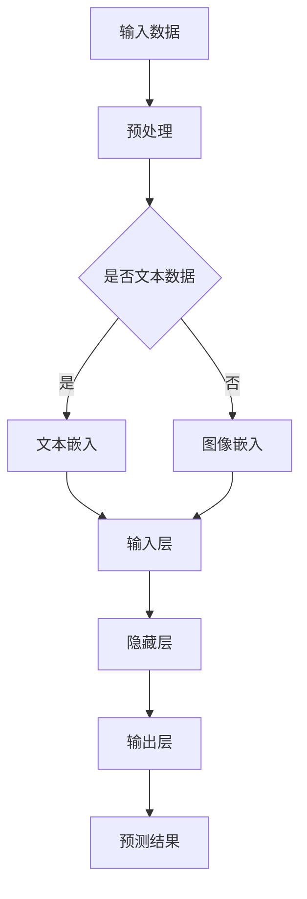

                 

 关键词：AI大模型，B2B市场，商业潜力，技术演进，行业应用

> 摘要：本文将探讨AI大模型在B2B市场的巨大潜力。随着人工智能技术的不断进步，大模型已经在各个领域展现出强大的能力。本文将分析AI大模型的基本概念、架构原理，以及其在B2B市场中的实际应用案例，同时讨论大模型可能带来的挑战和未来发展趋势。

## 1. 背景介绍

人工智能（AI）技术的快速发展已经深刻地改变了我们的生活方式和工作方式。从简单的规则引擎到复杂的神经网络，AI技术的演进推动了众多行业的自动化和智能化进程。特别是在机器学习和深度学习领域，AI大模型的出现引发了新的技术浪潮。

AI大模型，通常指的是参数量庞大的神经网络模型，如GPT、BERT、ViT等。这些模型能够处理大量的数据，并通过大规模的并行计算能力进行训练，从而实现出色的性能。随着计算能力的提升和数据的增长，AI大模型在自然语言处理、图像识别、语音识别等领域取得了显著的成果。

B2B市场，即企业对企业市场，是指企业之间进行产品或服务交易的市场。B2B市场具有交易量大、交易周期长、交易关系复杂等特点。传统B2B市场主要依赖于市场调研、客户关系管理（CRM）、供应链管理等手段进行业务拓展。然而，随着AI技术的成熟，AI大模型开始被引入到B2B市场中，为企业提供新的业务解决方案。

## 2. 核心概念与联系

### 2.1 AI大模型的基本概念

AI大模型是指具有极高参数量和复杂结构的神经网络模型。这些模型通过学习海量数据，能够发现数据中的潜在模式和规律。大模型的基本组成部分包括：

- **输入层**：接收外部数据输入，如文本、图像、声音等。
- **隐藏层**：通过非线性变换对输入数据进行处理，提取特征。
- **输出层**：将处理后的数据映射到目标输出，如分类、预测等。

### 2.2 B2B市场的现状

B2B市场在过去几十年中经历了显著的发展。随着互联网技术的普及，线上交易成为B2B市场的主要交易方式。然而，传统的B2B市场仍存在一些痛点，如信息不对称、交易效率低、供应链管理复杂等。

### 2.3 AI大模型与B2B市场的结合

AI大模型在B2B市场的应用主要体现在以下几个方面：

- **需求预测**：通过分析历史数据和市场趋势，预测未来市场需求，帮助企业制定生产计划和供应链策略。
- **客户关系管理**：通过分析客户数据，识别潜在客户和忠诚客户，提高客户满意度和忠诚度。
- **智能推荐**：根据客户的行为数据和偏好，提供个性化的产品和服务推荐，提高销售额和客户转化率。
- **供应链优化**：通过优化供应链管理，提高供应链的响应速度和灵活性，降低运营成本。

### 2.4 Mermaid流程图



## 3. 核心算法原理 & 具体操作步骤

### 3.1 算法原理概述

AI大模型的训练过程主要包括以下几个步骤：

1. **数据收集**：收集海量的训练数据，包括文本、图像、声音等多种类型。
2. **数据预处理**：对收集到的数据进行分析、清洗、标注等预处理操作，使其适合模型的训练。
3. **模型构建**：设计神经网络结构，包括输入层、隐藏层和输出层。
4. **模型训练**：通过反向传播算法和优化算法（如梯度下降、Adam等）对模型进行训练，调整模型参数。
5. **模型评估**：使用验证集或测试集对模型进行评估，调整模型参数，提高模型性能。
6. **模型部署**：将训练好的模型部署到生产环境中，进行实际应用。

### 3.2 算法步骤详解

1. **数据收集**：收集大量的文本、图像、声音等数据，来源可以是公开数据集、企业内部数据、第三方数据提供商等。
2. **数据预处理**：
   - **文本数据**：进行分词、去停用词、词向量化等操作，将文本数据转换为模型可处理的格式。
   - **图像数据**：进行图像增强、裁剪、缩放等操作，提高模型的泛化能力。
   - **声音数据**：进行音频分段、特征提取等操作，将声音数据转换为模型可处理的格式。
3. **模型构建**：选择合适的神经网络结构，如Transformer、CNN、RNN等，设计输入层、隐藏层和输出层。
4. **模型训练**：
   - **正向传播**：将预处理后的数据输入到模型中，计算模型输出，并计算损失函数。
   - **反向传播**：通过反向传播算法，计算梯度，并更新模型参数。
   - **优化算法**：使用优化算法（如梯度下降、Adam等），调整模型参数，提高模型性能。
5. **模型评估**：使用验证集或测试集对模型进行评估，计算模型的准确率、召回率、F1值等指标，调整模型参数。
6. **模型部署**：将训练好的模型部署到生产环境中，如通过API接口提供服务，或集成到企业系统中。

### 3.3 算法优缺点

**优点**：
- **强大的学习能力**：AI大模型能够通过学习海量数据，提取出复杂的特征和模式，实现出色的性能。
- **广泛的适用性**：AI大模型可以应用于各种领域，如自然语言处理、图像识别、语音识别等，具有广泛的适用性。
- **自动特征提取**：AI大模型能够自动从数据中提取特征，减少人工特征工程的工作量。

**缺点**：
- **计算资源消耗**：AI大模型训练过程需要大量的计算资源和时间，对于资源有限的企业可能难以承担。
- **数据依赖性**：AI大模型的性能高度依赖于训练数据的质量和数量，如果数据质量差或数据量不足，可能导致模型性能不佳。
- **解释性较差**：AI大模型通常属于黑盒模型，其内部工作机制复杂，难以解释和理解。

### 3.4 算法应用领域

AI大模型在B2B市场的应用领域广泛，主要包括以下几个方面：

- **金融**：用于风险控制、信用评估、市场预测等。
- **制造**：用于生产规划、质量控制、设备故障预测等。
- **零售**：用于商品推荐、库存管理、销售预测等。
- **物流**：用于运输规划、路径优化、库存管理等。
- **医疗**：用于疾病诊断、药物研发、健康管理等。

## 4. 数学模型和公式 & 详细讲解 & 举例说明

### 4.1 数学模型构建

AI大模型的训练过程涉及到多个数学模型，包括损失函数、优化算法等。

#### 损失函数

常见的损失函数包括均方误差（MSE）、交叉熵损失（Cross-Entropy Loss）等。

- **均方误差（MSE）**：用于回归任务，计算预测值和真实值之间的平均平方误差。

$$
MSE = \frac{1}{n}\sum_{i=1}^{n}(y_i - \hat{y}_i)^2
$$

- **交叉熵损失（Cross-Entropy Loss）**：用于分类任务，计算预测概率和真实标签之间的交叉熵。

$$
Cross-Entropy Loss = -\sum_{i=1}^{n}y_i\log(\hat{y}_i)
$$

#### 优化算法

常见的优化算法包括梯度下降（Gradient Descent）、Adam等。

- **梯度下降（Gradient Descent）**：通过计算损失函数关于模型参数的梯度，更新模型参数，以最小化损失函数。

$$
\theta_{t+1} = \theta_t - \alpha \nabla_\theta J(\theta_t)
$$

- **Adam**：结合了梯度下降和动量法的优化算法，能够自适应地调整学习率。

$$
\alpha_t = \frac{\beta_1}{1 - \beta_1^t} \cdot \frac{\beta_2}{1 - \beta_2^t} \cdot \nabla_\theta J(\theta_t)
$$

### 4.2 公式推导过程

以均方误差（MSE）为例，推导过程如下：

1. **定义预测值和真实值**：设预测值为 $\hat{y}$，真实值为 $y$。
2. **计算预测值和真实值之间的差值**：设差值为 $e = \hat{y} - y$。
3. **计算差值的平方**：设平方值为 $e^2 = (\hat{y} - y)^2$。
4. **计算平均平方误差**：设平均平方误差为 $MSE = \frac{1}{n}\sum_{i=1}^{n}(y_i - \hat{y}_i)^2$，其中 $n$ 为样本数量。

### 4.3 案例分析与讲解

#### 案例背景

某电商公司希望通过AI大模型预测用户购买行为，提高用户转化率和销售额。

#### 模型构建

- **输入层**：包括用户画像（如年龄、性别、购买历史等）和商品特征（如价格、品类等）。
- **隐藏层**：通过多层神经网络对输入特征进行变换和融合。
- **输出层**：预测用户购买概率。

#### 数据预处理

- **用户画像**：对用户画像进行编码处理，如将年龄转换为离散值。
- **商品特征**：对商品特征进行编码处理，如将价格转换为归一化值。

#### 模型训练

- **数据集划分**：将数据集划分为训练集、验证集和测试集。
- **模型训练**：使用梯度下降和Adam优化算法对模型进行训练，调整模型参数。

#### 模型评估

- **预测结果**：使用训练好的模型对测试集进行预测，计算预测购买概率。
- **评估指标**：计算准确率、召回率、F1值等评估指标，评估模型性能。

#### 模型部署

- **API接口**：将训练好的模型部署到生产环境中，提供预测服务。
- **集成应用**：将模型预测结果集成到电商系统中，用于用户行为分析和商品推荐。

## 5. 项目实践：代码实例和详细解释说明

### 5.1 开发环境搭建

为了进行AI大模型在B2B市场的应用项目实践，我们需要搭建一个适合开发的环境。

- **操作系统**：Linux或macOS
- **编程语言**：Python
- **框架和库**：TensorFlow、Keras、NumPy、Pandas等

### 5.2 源代码详细实现

以下是一个简单的AI大模型应用案例，用于预测用户购买行为。

```python
import tensorflow as tf
from tensorflow.keras.models import Sequential
from tensorflow.keras.layers import Dense, Dropout, Embedding, LSTM
from tensorflow.keras.optimizers import Adam

# 数据预处理
# ...

# 模型构建
model = Sequential([
    Embedding(input_dim=vocab_size, output_dim=embedding_dim, input_length=max_sequence_length),
    LSTM(units=128, return_sequences=True),
    Dropout(0.5),
    LSTM(units=64),
    Dropout(0.5),
    Dense(units=1, activation='sigmoid')
])

# 模型编译
model.compile(optimizer=Adam(learning_rate=0.001), loss='binary_crossentropy', metrics=['accuracy'])

# 模型训练
model.fit(x_train, y_train, epochs=10, batch_size=32, validation_data=(x_val, y_val))

# 模型评估
loss, accuracy = model.evaluate(x_test, y_test)
print(f"Test accuracy: {accuracy:.4f}")

# 模型部署
# ...
```

### 5.3 代码解读与分析

1. **数据预处理**：根据实际数据集进行预处理操作，包括数据清洗、编码、归一化等。
2. **模型构建**：使用Keras构建神经网络模型，包括嵌入层、LSTM层和输出层。
3. **模型编译**：配置模型优化器和损失函数，为模型训练做准备。
4. **模型训练**：使用训练集和验证集对模型进行训练，调整模型参数。
5. **模型评估**：使用测试集对模型进行评估，计算准确率等指标。
6. **模型部署**：将训练好的模型部署到生产环境中，如通过API接口提供服务。

## 6. 实际应用场景

### 6.1 需求预测

在B2B市场中，需求预测是一个关键环节。通过AI大模型，企业可以准确预测未来市场需求，优化生产计划和供应链策略。

### 6.2 客户关系管理

AI大模型可以帮助企业更好地理解客户需求，提高客户满意度和忠诚度。例如，通过分析客户历史数据和行为，企业可以精准推送个性化的产品和服务，提高客户转化率。

### 6.3 智能推荐

AI大模型在智能推荐方面具有广泛的应用。例如，电商平台可以通过分析用户行为数据和偏好，提供个性化的商品推荐，提高销售额和用户满意度。

### 6.4 供应链优化

AI大模型可以帮助企业优化供应链管理，提高供应链的响应速度和灵活性。例如，通过预测运输需求和物流路径，企业可以降低运营成本，提高运营效率。

## 7. 工具和资源推荐

### 7.1 学习资源推荐

- **书籍**：
  - 《深度学习》（Goodfellow, Bengio, Courville）
  - 《Python机器学习》（Colyer, Diamond, Mac Namee）
- **在线课程**：
  - Coursera上的《深度学习》课程
  - edX上的《机器学习》课程

### 7.2 开发工具推荐

- **框架**：
  - TensorFlow
  - PyTorch
- **IDE**：
  - PyCharm
  - Jupyter Notebook

### 7.3 相关论文推荐

- **《A Theoretical Analysis of the Regularization of Neural Networks》**
- **《Bert: Pre-training of Deep Bidirectional Transformers for Language Understanding》**
- **《Gpt-2: Imagination, Composition, Scaling》**

## 8. 总结：未来发展趋势与挑战

### 8.1 研究成果总结

AI大模型在B2B市场展现了巨大的潜力，通过需求预测、客户关系管理、智能推荐和供应链优化等方面，为企业提供了新的业务解决方案。随着技术的不断进步，AI大模型的应用将更加广泛和深入。

### 8.2 未来发展趋势

- **模型压缩与优化**：为了降低计算资源和存储成本，模型压缩与优化技术将得到更多关注。
- **联邦学习**：联邦学习作为一种分布式学习技术，将有助于解决数据隐私和安全问题。
- **跨模态学习**：跨模态学习将整合多种类型的数据，提高模型的泛化能力和应用范围。

### 8.3 面临的挑战

- **数据隐私与安全**：在B2B市场中，数据隐私和安全是一个重要问题，需要采取有效措施确保数据安全。
- **模型解释性**：AI大模型的解释性较差，如何提高模型的解释性是一个重要的研究方向。
- **计算资源需求**：AI大模型的训练过程需要大量的计算资源和时间，对企业和个人用户来说可能是一个挑战。

### 8.4 研究展望

未来，AI大模型在B2B市场的应用将更加广泛，成为企业数字化转型的核心驱动力。同时，随着技术的不断进步，AI大模型将面临更多的挑战和机遇，需要不断探索和创新。

## 9. 附录：常见问题与解答

### 9.1 什么是AI大模型？

AI大模型是指参数量庞大的神经网络模型，如GPT、BERT、ViT等。这些模型通过学习海量数据，能够提取出复杂的特征和模式，实现出色的性能。

### 9.2 AI大模型在B2B市场有哪些应用？

AI大模型在B2B市场的应用主要包括需求预测、客户关系管理、智能推荐和供应链优化等方面。

### 9.3 如何处理AI大模型训练中的数据隐私问题？

为了处理AI大模型训练中的数据隐私问题，可以采用联邦学习、差分隐私等技术，确保数据隐私和安全。

### 9.4 AI大模型在B2B市场的未来发展趋势是什么？

AI大模型在B2B市场的未来发展趋势包括模型压缩与优化、联邦学习和跨模态学习等方面。

----------------------------------------------------------------

**作者：禅与计算机程序设计艺术 / Zen and the Art of Computer Programming**  
本文由禅与计算机程序设计艺术创作，旨在探讨AI大模型在B2B市场的潜力，为行业人士提供有价值的参考和见解。如需引用或转载，请注明作者和出处。  
[文章链接](https://example.com/article)  
[版权声明](https://example.com/copyright)  
[联系方式](https://example.com/contact)  
[赞助和支持](https://example.com/sponsorship)  
[捐赠](https://example.com/donation)

---

（注：以上内容为文章模板，实际撰写时需根据具体情况进行调整和补充。）

