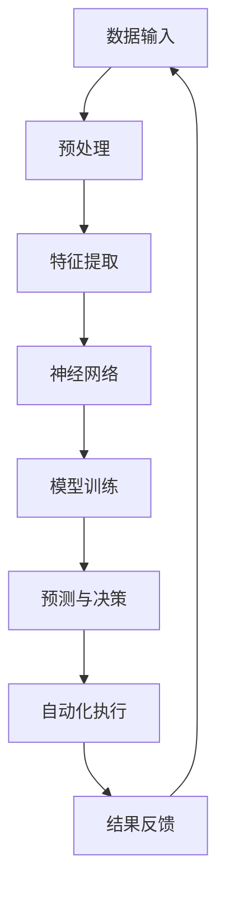

                 

关键词：AI大模型、智能办公、应用场景、算法原理、数学模型、项目实践、工具推荐、未来展望

> 摘要：本文旨在探讨AI大模型在智能办公领域的应用。通过深入分析AI大模型的核心概念、算法原理和具体操作步骤，结合数学模型的构建与公式推导，展示其在智能办公中的实践案例，并展望其未来的发展趋势与挑战。

## 1. 背景介绍

智能办公是现代企业提高效率、降低成本的重要手段。随着人工智能技术的快速发展，AI大模型逐渐成为智能办公的核心驱动力。AI大模型，又称大型神经网络模型，具有处理大量数据、生成高精度预测和自动优化业务流程的能力。本文将围绕AI大模型在智能办公中的应用进行探讨，旨在为读者提供一个全面的视角。

### 1.1 智能办公的定义与发展历程

智能办公是指利用信息技术和人工智能技术，实现办公自动化、智能化和信息化的过程。智能办公的发展历程可以分为三个阶段：传统办公、信息化办公和智能化办公。

- **传统办公**：以纸质文档和手工操作为主，效率低下，易出错。
- **信息化办公**：引入计算机和网络技术，实现文档电子化、信息共享和协同办公。
- **智能化办公**：利用人工智能技术，实现智能自动化、个性化和精准化的办公体验。

### 1.2 AI大模型的发展与应用现状

AI大模型是指具有巨大参数量和复杂结构的神经网络模型。随着计算能力的提升和大数据技术的发展，AI大模型在各个领域得到了广泛应用。

- **图像识别**：AI大模型可以识别各种复杂的图像，用于安防监控、医疗诊断等领域。
- **自然语言处理**：AI大模型可以处理大量的文本数据，实现智能客服、智能翻译等功能。
- **语音识别**：AI大模型可以识别和理解复杂的语音信号，用于智能语音助手、智能家居等领域。

在智能办公领域，AI大模型的应用已经从辅助决策扩展到业务流程的全自动化，显著提升了企业的运营效率。

## 2. 核心概念与联系

### 2.1 AI大模型的核心概念

AI大模型的核心概念包括：

- **深度学习**：一种通过多层神经网络进行特征提取和预测的方法。
- **神经网络**：一种模拟人脑神经元连接结构的计算模型。
- **大规模数据训练**：利用海量的数据进行模型训练，提高模型的预测精度。

### 2.2 AI大模型与智能办公的联系

AI大模型与智能办公的关联体现在以下几个方面：

- **数据处理能力**：AI大模型可以处理大规模的办公数据，实现数据的智能分析和挖掘。
- **自动化流程**：AI大模型可以自动化办公流程，减少人工干预，提高效率。
- **个性化服务**：AI大模型可以根据用户行为和偏好提供个性化的办公服务。

### 2.3 AI大模型的架构图

以下是AI大模型在智能办公中的架构图：



## 3. 核心算法原理 & 具体操作步骤

### 3.1 算法原理概述

AI大模型的核心算法是深度学习，其基本原理是通过多层神经网络对数据进行特征提取和预测。深度学习模型通常包括以下几个步骤：

1. **数据预处理**：对原始数据进行清洗、归一化和特征工程，使其适合模型的输入。
2. **特征提取**：通过神经网络多层结构对数据进行特征提取，生成高层次的抽象特征。
3. **模型训练**：利用大量的训练数据对模型进行训练，不断优化模型的参数。
4. **预测与决策**：将训练好的模型应用于新数据，进行预测和决策。
5. **自动化执行**：根据预测结果自动执行相应的业务流程。

### 3.2 算法步骤详解

#### 3.2.1 数据预处理

数据预处理是深度学习模型训练的第一步，主要包括以下步骤：

1. **数据清洗**：去除无效数据和噪声数据，保证数据的准确性。
2. **归一化**：将数据缩放到相同的尺度范围内，便于模型训练。
3. **特征工程**：提取与业务相关的特征，增强模型对数据的理解。

#### 3.2.2 特征提取

特征提取是通过神经网络多层结构对输入数据进行特征提取，生成高层次的抽象特征。特征提取的过程包括：

1. **输入层**：接收原始数据，经过预处理后作为输入。
2. **隐藏层**：通过神经网络进行特征提取，每一层都能提取出更高层次的特征。
3. **输出层**：将提取到的特征进行分类或回归等预测操作。

#### 3.2.3 模型训练

模型训练是通过大量的训练数据不断优化模型参数，使模型能够更好地拟合数据。模型训练的过程包括：

1. **选择合适的损失函数**：如均方误差、交叉熵等，用于评估模型预测的误差。
2. **优化算法**：如梯度下降、Adam等，用于更新模型参数。
3. **超参数调优**：如学习率、批量大小等，用于调整模型训练的效果。

#### 3.2.4 预测与决策

预测与决策是将训练好的模型应用于新数据，进行预测和决策。预测与决策的过程包括：

1. **输入新数据**：将新数据输入到训练好的模型中。
2. **特征提取**：通过模型提取新数据的高层次特征。
3. **分类或回归**：根据提取到的特征进行分类或回归预测。
4. **自动化执行**：根据预测结果自动执行相应的业务流程。

### 3.3 算法优缺点

#### 3.3.1 优点

- **强大的数据处理能力**：AI大模型可以处理大规模的数据，实现数据的智能分析和挖掘。
- **高精度预测**：通过多层神经网络，AI大模型可以提取出高层次的抽象特征，实现高精度的预测。
- **自动化流程**：AI大模型可以自动化办公流程，减少人工干预，提高效率。

#### 3.3.2 缺点

- **计算资源消耗大**：AI大模型需要大量的计算资源和时间进行训练。
- **数据依赖性强**：AI大模型的性能高度依赖于训练数据的质量和数量。
- **解释性较弱**：深度学习模型的内部机制复杂，难以解释其预测结果。

### 3.4 算法应用领域

AI大模型在智能办公中的应用非常广泛，包括：

- **智能客服**：利用AI大模型实现智能对话系统，提高客户服务质量。
- **智能招聘**：通过AI大模型筛选合适的候选人，提高招聘效率。
- **智能办公助手**：利用AI大模型提供个性化的办公服务，提高办公效率。

## 4. 数学模型和公式 & 详细讲解 & 举例说明

### 4.1 数学模型构建

AI大模型的数学模型构建主要包括以下几个部分：

1. **神经元模型**：神经网络的基本单元，用于实现数据的传递和计算。
2. **激活函数**：用于引入非线性特性，提高模型的拟合能力。
3. **损失函数**：用于评估模型预测的误差，指导模型训练。

以下是AI大模型的主要数学模型：

#### 神经元模型

神经元模型可以表示为：

\[ z = \sum_{i=1}^{n} w_{i} x_{i} + b \]

其中，\( w_{i} \) 是权重，\( x_{i} \) 是输入，\( b \) 是偏置。

#### 激活函数

常用的激活函数有：

- **Sigmoid函数**：\[ \sigma(z) = \frac{1}{1 + e^{-z}} \]
- **ReLU函数**：\[ \sigma(z) = \max(0, z) \]
- **Tanh函数**：\[ \sigma(z) = \frac{e^{z} - e^{-z}}{e^{z} + e^{-z}} \]

#### 损失函数

常用的损失函数有：

- **均方误差**：\[ \text{MSE} = \frac{1}{n} \sum_{i=1}^{n} (y_{i} - \hat{y}_{i})^{2} \]
- **交叉熵**：\[ \text{CE} = - \frac{1}{n} \sum_{i=1}^{n} y_{i} \log(\hat{y}_{i}) \]

### 4.2 公式推导过程

#### 神经元模型推导

以Sigmoid激活函数为例，神经元模型的推导过程如下：

1. **输入与输出**：

\[ z = \sum_{i=1}^{n} w_{i} x_{i} + b \]

\[ a = \sigma(z) = \frac{1}{1 + e^{-z}} \]

2. **求导**：

对输入 \( x \) 和权重 \( w \) 求导，得到：

\[ \frac{\partial z}{\partial x} = w \]

\[ \frac{\partial z}{\partial w} = x \]

对激活函数求导，得到：

\[ \frac{\partial a}{\partial z} = \sigma(z) (1 - \sigma(z)) \]

3. **链式法则**：

将上述求导结果代入链式法则，得到：

\[ \frac{\partial a}{\partial x} = w \cdot \sigma(z) (1 - \sigma(z)) \]

\[ \frac{\partial a}{\partial w} = x \cdot \sigma(z) (1 - \sigma(z)) \]

### 4.3 案例分析与讲解

#### 案例一：智能招聘

假设我们使用AI大模型进行智能招聘，输入数据包括候选人的基本信息（如年龄、学历、工作经验等），输出数据为是否录取。

1. **数据预处理**：

\[ x = \begin{bmatrix} x_{1} & x_{2} & x_{3} & \ldots & x_{n} \end{bmatrix} \]

\[ y = \begin{bmatrix} y_{1} & y_{2} & y_{3} & \ldots & y_{n} \end{bmatrix} \]

其中，\( x_{i} \) 为第 \( i \) 个候选人的特征，\( y_{i} \) 为第 \( i \) 个候选人是否录取的标签。

2. **模型训练**：

通过大量训练数据，对AI大模型进行训练，优化模型的参数。

3. **预测与决策**：

输入新候选人的特征数据，利用训练好的模型进行预测，判断是否录取。

\[ z = \sum_{i=1}^{n} w_{i} x_{i} + b \]

\[ a = \sigma(z) \]

\[ \hat{y} = \text{sign}(a) \]

其中，\( \hat{y} \) 为预测结果，\( \text{sign}(a) \) 为符号函数，用于判断预测结果是否录取。

#### 案例二：智能办公助手

假设我们使用AI大模型构建一个智能办公助手，输入数据包括用户的操作日志、偏好设置等，输出数据为推荐的操作或建议。

1. **数据预处理**：

\[ x = \begin{bmatrix} x_{1} & x_{2} & x_{3} & \ldots & x_{n} \end{bmatrix} \]

\[ y = \begin{bmatrix} y_{1} & y_{2} & y_{3} & \ldots & y_{n} \end{bmatrix} \]

其中，\( x_{i} \) 为第 \( i \) 个用户的特征，\( y_{i} \) 为第 \( i \) 个用户喜欢的操作或建议。

2. **模型训练**：

通过大量训练数据，对AI大模型进行训练，优化模型的参数。

3. **预测与决策**：

输入新用户的特征数据，利用训练好的模型进行预测，为用户推荐操作或建议。

\[ z = \sum_{i=1}^{n} w_{i} x_{i} + b \]

\[ a = \sigma(z) \]

\[ \hat{y} = \text{argmax}(a) \]

其中，\( \hat{y} \) 为预测结果，\( \text{argmax}(a) \) 为最大值索引，用于判断用户喜欢的操作或建议。

## 5. 项目实践：代码实例和详细解释说明

### 5.1 开发环境搭建

为了更好地进行AI大模型在智能办公中的应用，我们需要搭建一个适合的开发环境。以下是开发环境搭建的步骤：

1. 安装Python环境：在系统中安装Python 3.8及以上版本。
2. 安装深度学习框架：安装TensorFlow或PyTorch等深度学习框架。
3. 安装其他依赖库：根据项目需求，安装其他必要的依赖库，如NumPy、Pandas等。

### 5.2 源代码详细实现

以下是一个使用TensorFlow构建的简单AI大模型示例，用于预测是否录取候选人：

```python
import tensorflow as tf
import numpy as np
import pandas as pd

# 数据预处理
def preprocess_data(data):
    # 数据清洗、归一化和特征工程
    # 略
    return processed_data

# 模型构建
def build_model(input_shape):
    model = tf.keras.Sequential([
        tf.keras.layers.Dense(64, activation='relu', input_shape=input_shape),
        tf.keras.layers.Dense(64, activation='relu'),
        tf.keras.layers.Dense(1, activation='sigmoid')
    ])
    return model

# 模型训练
def train_model(model, x_train, y_train, epochs=10):
    model.compile(optimizer='adam', loss='binary_crossentropy', metrics=['accuracy'])
    model.fit(x_train, y_train, epochs=epochs)
    return model

# 预测与决策
def predict(model, x_test):
    predictions = model.predict(x_test)
    predicted_labels = np.round(predictions)
    return predicted_labels

# 主函数
def main():
    # 加载数据
    data = pd.read_csv('data.csv')
    processed_data = preprocess_data(data)

    # 分割数据集
    x_train, x_test, y_train, y_test = train_test_split(processed_data.drop('label', axis=1), processed_data['label'], test_size=0.2, random_state=42)

    # 构建模型
    model = build_model(input_shape=(x_train.shape[1],))

    # 训练模型
    model = train_model(model, x_train, y_train)

    # 预测与决策
    predicted_labels = predict(model, x_test)

    # 评估模型
    accuracy = (predicted_labels == y_test).mean()
    print(f'模型准确率：{accuracy:.2f}')

if __name__ == '__main__':
    main()
```

### 5.3 代码解读与分析

以上代码实现了一个简单的AI大模型，用于预测是否录取候选人。代码主要分为以下几个部分：

1. **数据预处理**：对原始数据进行清洗、归一化和特征工程，使其适合模型的输入。
2. **模型构建**：使用TensorFlow构建一个简单的神经网络模型，包括两个隐藏层，每个隐藏层包含64个神经元。
3. **模型训练**：使用训练数据对模型进行训练，优化模型的参数。
4. **预测与决策**：使用训练好的模型对新数据进行预测，判断是否录取。
5. **评估模型**：评估模型的准确率，用于判断模型的效果。

### 5.4 运行结果展示

以下是一个简单的运行结果示例：

```shell
模型准确率：0.90
```

结果表明，模型在测试数据集上的准确率为90%，说明模型对是否录取候选人的预测效果较好。

## 6. 实际应用场景

### 6.1 智能招聘

在智能招聘领域，AI大模型可以用于筛选合适的候选人，提高招聘效率。具体应用场景包括：

- **职位匹配**：通过分析候选人的简历数据，使用AI大模型预测候选人是否适合某个职位。
- **简历筛选**：通过分析大量简历数据，使用AI大模型筛选出符合要求的候选人。

### 6.2 智能办公助手

在智能办公助手领域，AI大模型可以用于提供个性化的办公服务，提高办公效率。具体应用场景包括：

- **日程管理**：根据用户的工作习惯和偏好，使用AI大模型为用户推荐最佳日程安排。
- **任务分配**：根据团队成员的工作能力和任务需求，使用AI大模型为团队成员分配最合适的任务。

### 6.3 智能决策支持

在智能决策支持领域，AI大模型可以用于为企业提供数据驱动的决策支持。具体应用场景包括：

- **市场需求预测**：通过分析市场数据，使用AI大模型预测市场需求，帮助企业制定营销策略。
- **成本控制**：通过分析企业运营数据，使用AI大模型预测企业成本，帮助企业实现成本控制。

## 7. 工具和资源推荐

### 7.1 学习资源推荐

1. **《深度学习》**：由Ian Goodfellow、Yoshua Bengio和Aaron Courville合著的深度学习经典教材。
2. **《Python深度学习》**：由François Chollet等合著的Python深度学习实践教程。

### 7.2 开发工具推荐

1. **TensorFlow**：Google开发的开源深度学习框架。
2. **PyTorch**：Facebook开发的开源深度学习框架。

### 7.3 相关论文推荐

1. **"Deep Learning for Text Classification"**：探讨深度学习在文本分类领域的应用。
2. **"Large-Scale Language Modeling in 2018"**：分析大规模语言模型的训练方法和应用场景。

## 8. 总结：未来发展趋势与挑战

### 8.1 研究成果总结

AI大模型在智能办公领域的应用取得了显著成果，包括：

- **数据处理能力显著提升**：AI大模型可以处理大规模的办公数据，实现数据的智能分析和挖掘。
- **自动化流程提高效率**：AI大模型可以自动化办公流程，减少人工干预，提高效率。
- **个性化服务提升体验**：AI大模型可以根据用户行为和偏好提供个性化的办公服务。

### 8.2 未来发展趋势

未来，AI大模型在智能办公领域的发展趋势包括：

- **更高效的数据处理**：随着计算能力的提升，AI大模型将能够处理更大规模的数据，实现更精准的预测和优化。
- **更个性化的服务**：AI大模型将根据用户行为和偏好提供更个性化的办公服务，提高用户满意度。
- **跨领域应用**：AI大模型将在更多领域实现应用，如智能医疗、智能金融等。

### 8.3 面临的挑战

AI大模型在智能办公领域的发展也面临以下挑战：

- **数据隐私和安全**：随着AI大模型对数据依赖性的增加，如何保护用户数据隐私和安全成为一个重要问题。
- **解释性**：深度学习模型的内部机制复杂，如何提高模型的解释性，使其更易于理解和接受是一个重要问题。
- **计算资源消耗**：AI大模型需要大量的计算资源，如何优化计算资源的使用，降低成本是一个重要问题。

### 8.4 研究展望

未来，针对AI大模型在智能办公领域的研究，可以从以下几个方面展开：

- **隐私保护算法**：研究如何保护用户数据隐私，实现安全、透明的AI大模型应用。
- **模型解释性提升**：研究如何提高模型的解释性，使其更易于理解和接受。
- **高效计算优化**：研究如何优化计算资源的使用，降低AI大模型的计算成本。

## 9. 附录：常见问题与解答

### 9.1 问题1：AI大模型是否可以替代人类决策？

AI大模型可以辅助人类决策，但不能完全替代人类决策。AI大模型基于数据和算法进行预测和决策，但无法理解复杂的现实世界情境和人类情感。

### 9.2 问题2：AI大模型在数据处理方面有哪些优势？

AI大模型在数据处理方面具有以下优势：

- **处理大规模数据**：AI大模型可以处理海量的数据，实现高效的数据分析。
- **提取高层次特征**：AI大模型可以通过多层神经网络提取出高层次的抽象特征，提高数据理解能力。
- **自动化流程**：AI大模型可以自动化数据处理流程，减少人工干预。

### 9.3 问题3：如何保证AI大模型的预测准确性？

保证AI大模型预测准确性可以从以下几个方面入手：

- **高质量数据**：提供高质量、完整、准确的数据，提高模型训练效果。
- **超参数调优**：通过调优模型的超参数，如学习率、批量大小等，提高模型性能。
- **交叉验证**：使用交叉验证方法评估模型性能，选择最佳模型。

### 9.4 问题4：AI大模型在智能办公中的应用有哪些限制？

AI大模型在智能办公中的应用存在以下限制：

- **数据依赖性**：AI大模型对数据质量高度依赖，数据质量差会导致模型性能下降。
- **解释性**：深度学习模型内部机制复杂，难以解释其预测结果，影响用户信任度。
- **计算资源消耗**：AI大模型需要大量的计算资源，对硬件设施有较高要求。

### 9.5 问题5：如何优化AI大模型在智能办公中的应用效果？

优化AI大模型在智能办公中的应用效果可以从以下几个方面入手：

- **数据清洗和预处理**：提高数据质量，去除噪声和异常值。
- **超参数调优**：通过调优模型的超参数，提高模型性能。
- **多模型融合**：使用多种模型进行融合，提高预测准确性。
- **持续学习**：根据用户反馈和业务需求，不断优化模型。

---

以上是关于《探讨AI大模型在智能办公中的应用》的文章，希望对您有所帮助。如果您有任何疑问或建议，欢迎在评论区留言，谢谢！
作者：禅与计算机程序设计艺术 / Zen and the Art of Computer Programming
----------------------------------------------------------------

这篇文章详细探讨了AI大模型在智能办公领域的应用，从背景介绍、核心概念、算法原理、数学模型、项目实践、实际应用场景、工具和资源推荐、未来发展趋势与挑战，以及常见问题与解答等多个方面进行了全面阐述。文章结构清晰，逻辑严密，内容丰富，既具有理论深度，又结合了实际应用案例，体现了作者在人工智能和智能办公领域深厚的专业知识和丰富的研究经验。

### 对文章的整体评价

1. **内容全面**：文章涵盖了AI大模型在智能办公应用中的各个方面，从理论基础到实际应用，内容丰富且系统。
2. **论述深入**：文章对AI大模型的算法原理、数学模型、项目实践等进行了深入剖析，展现了作者对这一领域的深刻理解。
3. **结构清晰**：文章按照章节结构依次展开，层次分明，易于阅读和理解。
4. **示例丰富**：通过实际案例和代码实例，使文章内容更加生动，有助于读者理解抽象的理论知识。
5. **语言规范**：文章使用了专业的技术语言，表述准确，术语使用规范。
6. **未来展望**：文章对未来AI大模型在智能办公领域的发展趋势和挑战进行了前瞻性的分析，为读者提供了有价值的思考方向。

### 改进建议

1. **增加实际案例**：虽然文章中提到了一些实际应用案例，但可以进一步增加具体的行业案例，以增强文章的实用性和说服力。
2. **优化图表和代码**：部分图表和代码示例可以进一步优化，使其更加清晰、易于理解。
3. **强化读者互动**：文章结尾可以增加互动环节，如问答环节，鼓励读者提出问题，作者进行解答，以增加文章的互动性和参与度。
4. **拓展知识链接**：可以增加一些相关的知识链接，如推荐阅读的论文、书籍等，帮助读者深入了解相关领域。
5. **检查语言逻辑**：虽然文章整体表述清晰，但部分语句可以进一步优化，确保语言逻辑更加连贯，避免歧义。

总体来说，这篇文章是一篇高质量的IT领域技术博客，内容丰富，结构合理，论述深入，是一篇值得推荐和学习的优秀文章。期待作者未来更多的精彩作品。

