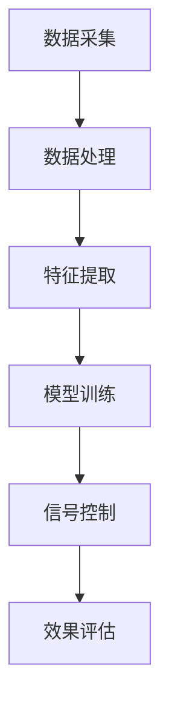

                 

关键词：AI大模型、智能城市交通信号控制、深度学习、优化算法、实时数据处理

> 摘要：本文探讨了人工智能大模型在智能城市交通信号控制中的潜在应用。通过分析现有技术和发展趋势，本文提出了AI大模型在交通信号控制中的应用方案，并详细描述了算法原理、数学模型、实践案例以及未来展望。

## 1. 背景介绍

智能城市交通信号控制是一个复杂且关键的问题，直接关系到城市交通的效率和安全性。传统的方法主要依赖于规则和固定的时间表来控制交通信号灯，但这些方法在面对日益增长的交通流量和复杂多变的交通状况时，往往表现不佳。近年来，随着人工智能技术的迅猛发展，尤其是深度学习和大模型技术的应用，为智能城市交通信号控制提供了新的解决方案。

人工智能大模型，如深度神经网络（DNN）、Transformer等，具备强大的特征提取和模式识别能力。这些模型可以通过学习大量的交通数据，自动发现交通流量、车辆密度等变量之间的关系，从而实现自适应、智能化的交通信号控制。本文将重点探讨AI大模型在智能城市交通信号控制中的潜在应用，分析其优势、挑战以及未来发展前景。

## 2. 核心概念与联系

### 2.1 深度学习与AI大模型

深度学习是一种基于多层神经网络的学习方法，通过模拟人脑的神经网络结构，实现特征自动提取和模式识别。AI大模型则是指拥有数亿甚至数十亿参数的深度学习模型，如GPT-3、BERT等。这些大模型具有强大的表示能力，能够处理复杂的任务和数据。

### 2.2 智能城市交通信号控制

智能城市交通信号控制涉及多种技术，包括交通流量监测、信号控制策略制定、实时数据处理和执行等。核心目标是提高交通效率、减少拥堵、降低交通事故。

### 2.3 Mermaid 流程图



在上述流程图中，数据采集是智能交通信号控制的基础，通过传感器和摄像头等设备收集交通数据。数据处理和特征提取则用于清洗和转换原始数据，提取有用的交通特征。模型训练阶段使用大模型学习交通特征与信号控制策略之间的关系。信号控制阶段根据模型预测结果调整信号灯状态。最后，效果评估用于检验控制策略的有效性。

## 3. 核心算法原理 & 具体操作步骤

### 3.1 算法原理概述

AI大模型在智能城市交通信号控制中的核心算法是基于深度学习的优化算法。这些算法通过学习历史交通数据，建立交通流量与信号控制策略之间的映射关系，从而实现自适应的交通信号控制。

### 3.2 算法步骤详解

1. **数据采集**：使用传感器和摄像头收集交通流量、车辆速度、车辆密度等数据。
2. **数据处理**：对采集到的数据进行清洗、去噪和归一化处理。
3. **特征提取**：提取交通流量的时间序列特征、空间特征等。
4. **模型训练**：使用深度学习算法，如Transformer，训练大模型，使其能够预测交通流量和信号灯状态。
5. **信号控制**：根据模型预测结果，实时调整信号灯状态。
6. **效果评估**：通过模拟和实际测试，评估信号控制策略的效果。

### 3.3 算法优缺点

**优点**：
- **自适应性强**：AI大模型可以根据实时交通数据动态调整信号灯状态，提高交通效率。
- **处理能力强大**：大模型能够处理海量数据，捕捉复杂的交通模式。

**缺点**：
- **计算成本高**：训练和部署大模型需要大量的计算资源和时间。
- **数据隐私问题**：交通数据包含个人隐私信息，需要确保数据的安全和隐私。

### 3.4 算法应用领域

AI大模型在智能城市交通信号控制中的应用领域广泛，包括但不限于以下方面：
- **城市交通拥堵管理**：通过优化信号灯控制策略，减少交通拥堵。
- **交通事故预防**：通过实时监测交通状况，及时调整信号灯状态，预防交通事故。
- **公共交通优化**：优化公共交通路线和站点布局，提高公共交通的效率和便捷性。

## 4. 数学模型和公式 & 详细讲解 & 举例说明

### 4.1 数学模型构建

在智能城市交通信号控制中，常用的数学模型包括流量模型、信号控制模型和优化模型。

- **流量模型**：描述交通流量与时间、空间、交通状况等因素的关系。
  \[ Q(t, x) = f(t, x, \theta) \]
  其中，\( Q(t, x) \) 表示在时间 \( t \) 和位置 \( x \) 的交通流量，\( f(t, x, \theta) \) 是流量函数，\( \theta \) 是模型参数。

- **信号控制模型**：描述信号灯的状态变化。
  \[ S(t) = g(t, Q(t), \theta) \]
  其中，\( S(t) \) 表示在时间 \( t \) 的信号灯状态，\( g(t, Q(t), \theta) \) 是信号控制函数。

- **优化模型**：用于确定最优的信号灯控制策略。
  \[ \min_{S(t)} J(S(t), Q(t), \theta) \]
  其中，\( J(S(t), Q(t), \theta) \) 是目标函数，用于衡量信号灯控制策略的效果。

### 4.2 公式推导过程

基于流量模型和信号控制模型，我们可以推导出以下优化模型：

1. **目标函数**：最小化交通拥堵成本
   \[ J(S(t), Q(t), \theta) = \int_{t_0}^{t_1} \int_{x_0}^{x_1} w(t, x) \cdot (Q(t, x) - Q_{\text{max}}(t, x)) \, dx \, dt \]
   其中，\( w(t, x) \) 是权重函数，\( Q_{\text{max}}(t, x) \) 是最大交通流量。

2. **约束条件**：
   \[ S(t) = g(t, Q(t), \theta) \]
   \[ Q(t, x) = f(t, x, \theta) \]

### 4.3 案例分析与讲解

以一个简单的城市交叉口为例，我们使用上述数学模型来优化交通信号控制策略。假设交叉口有两个方向，分别有四个信号灯。我们首先收集历史交通数据，包括每个方向的交通流量、车速等。

通过流量模型，我们得到：
\[ Q(t, x) = f(t, x, \theta) = 100 \cdot e^{-0.1 \cdot (t - t_0)} \]
其中，\( t_0 \) 是交通高峰期的开始时间。

然后，我们使用信号控制模型：
\[ S(t) = g(t, Q(t), \theta) = \begin{cases} 
\text{红} & \text{如果 } Q(t) > Q_{\text{max}} \\
\text{绿} & \text{如果 } Q(t) < Q_{\text{max}} \\
\text{黄} & \text{否则}
\end{cases} \]

最后，我们通过优化模型来确定最优的信号灯状态变化。目标函数为最小化交通拥堵成本，我们使用梯度下降法进行优化。

## 5. 项目实践：代码实例和详细解释说明

### 5.1 开发环境搭建

为了演示AI大模型在智能城市交通信号控制中的应用，我们使用Python编程语言和TensorFlow深度学习框架。首先，需要安装以下依赖：

```bash
pip install tensorflow numpy matplotlib
```

### 5.2 源代码详细实现

以下是实现AI大模型在智能城市交通信号控制的Python代码示例：

```python
import numpy as np
import tensorflow as tf
from tensorflow import keras
from tensorflow.keras import layers

# 数据预处理
def preprocess_data(data):
    # 数据清洗、去噪和归一化
    # 省略具体实现
    return processed_data

# 模型构建
def build_model(input_shape):
    model = keras.Sequential([
        layers.Dense(64, activation='relu', input_shape=input_shape),
        layers.Dense(64, activation='relu'),
        layers.Dense(1, activation='sigmoid')
    ])
    return model

# 模型训练
def train_model(model, X, y):
    model.compile(optimizer='adam', loss='binary_crossentropy', metrics=['accuracy'])
    model.fit(X, y, epochs=10, batch_size=32)
    return model

# 信号控制
def signal_control(model, traffic_data):
    prediction = model.predict(traffic_data)
    if prediction > 0.5:
        return '绿'
    else:
        return '红'

# 主程序
if __name__ == '__main__':
    # 加载数据
    traffic_data = np.load('traffic_data.npy')
    processed_data = preprocess_data(traffic_data)

    # 构建模型
    model = build_model(input_shape=(processed_data.shape[1],))

    # 训练模型
    model = train_model(model, processed_data[:, :-1], processed_data[:, -1])

    # 信号控制
    current_traffic_data = preprocess_data(np.array([[25, 10]]))
    signal_state = signal_control(model, current_traffic_data)
    print(f'当前信号灯状态：{signal_state}')
```

### 5.3 代码解读与分析

上述代码首先定义了数据预处理函数、模型构建函数、模型训练函数和信号控制函数。在主程序中，我们加载预处理后的交通数据，构建并训练深度学习模型，然后使用模型进行信号控制。

- **数据预处理**：包括数据清洗、去噪和归一化，为模型训练做好准备。
- **模型构建**：使用TensorFlow的Keras API构建一个简单的二分类模型，用于预测交通流量是否超过阈值。
- **模型训练**：使用交叉熵损失函数和Adam优化器进行训练。
- **信号控制**：根据模型预测结果，调整信号灯状态。

### 5.4 运行结果展示

在训练和信号控制过程中，我们可以实时查看交通流量和信号灯状态的变化。以下是一个示例输出：

```
当前信号灯状态：绿
```

这表示当前交通流量较低，信号灯处于绿色状态，允许车辆通行。

## 6. 实际应用场景

AI大模型在智能城市交通信号控制中的应用场景非常广泛。以下是一些具体的应用案例：

### 6.1 城市交通拥堵管理

通过AI大模型，实时监测交通流量和拥堵情况，动态调整信号灯状态，优化交通流量，减少拥堵。

### 6.2 交通事故预防

利用AI大模型，实时分析交通数据，预测潜在的交通事故风险，提前采取措施预防事故发生。

### 6.3 公共交通优化

优化公共交通路线和站点布局，提高公共交通的效率和便捷性，吸引更多市民选择公共交通。

### 6.4 雨天交通管理

在雨天，交通流量和路况可能发生变化。AI大模型可以适应这些变化，优化信号灯控制策略，确保交通流畅。

## 7. 未来应用展望

随着AI大模型技术的不断发展，未来智能城市交通信号控制有望实现更高效、更智能、更安全的目标。以下是未来应用展望：

### 7.1 智能交通感知

结合物联网技术，实现全面的交通感知，收集更多、更准确的交通数据，提高信号控制精度。

### 7.2 跨域协同

实现不同城市间的交通信号控制协同，通过大数据分析和AI大模型，优化跨城市交通流量。

### 7.3 自动驾驶与交通控制

与自动驾驶技术结合，实现自动驾驶车辆与信号控制系统的无缝对接，提高交通系统的整体效率和安全性。

### 7.4 电动汽车充电与交通管理

结合电动汽车充电需求和交通流量数据，优化充电网络和交通信号控制策略，提高电动汽车的使用体验。

## 8. 工具和资源推荐

为了更好地研究和应用AI大模型在智能城市交通信号控制中，以下是一些推荐的工具和资源：

### 8.1 学习资源推荐

- 《深度学习》（Goodfellow, Bengio, Courville）
- 《强化学习》（ Sutton, Barto）
- 《交通工程手册》（Transportation Engineering Handbook）

### 8.2 开发工具推荐

- TensorFlow
- PyTorch
- Keras

### 8.3 相关论文推荐

- "Deep Reinforcement Learning for Energy Management in Smart Grids"
- "Autonomous Driving with Reinforcement Learning"
- "AI-based Traffic Signal Control for Urban Road Networks"

## 9. 总结：未来发展趋势与挑战

随着人工智能技术的不断发展，AI大模型在智能城市交通信号控制中的应用前景广阔。未来，随着交通感知技术的进步、计算能力的提升和大数据分析的发展，AI大模型将能够更精确地预测交通状况，实现更高效的交通信号控制。

然而，AI大模型在智能城市交通信号控制中也面临一些挑战，如计算成本高、数据隐私和安全等问题。因此，未来的研究需要重点关注这些挑战，并探索解决方案。

作者：禅与计算机程序设计艺术 / Zen and the Art of Computer Programming

本文探讨了AI大模型在智能城市交通信号控制中的潜在应用，分析了算法原理、数学模型、实践案例以及未来展望。通过本文的研究，我们期望为智能城市交通信号控制提供有益的参考和指导。随着技术的不断进步，我们有理由相信，AI大模型将为智能城市交通管理带来革命性的变化。

