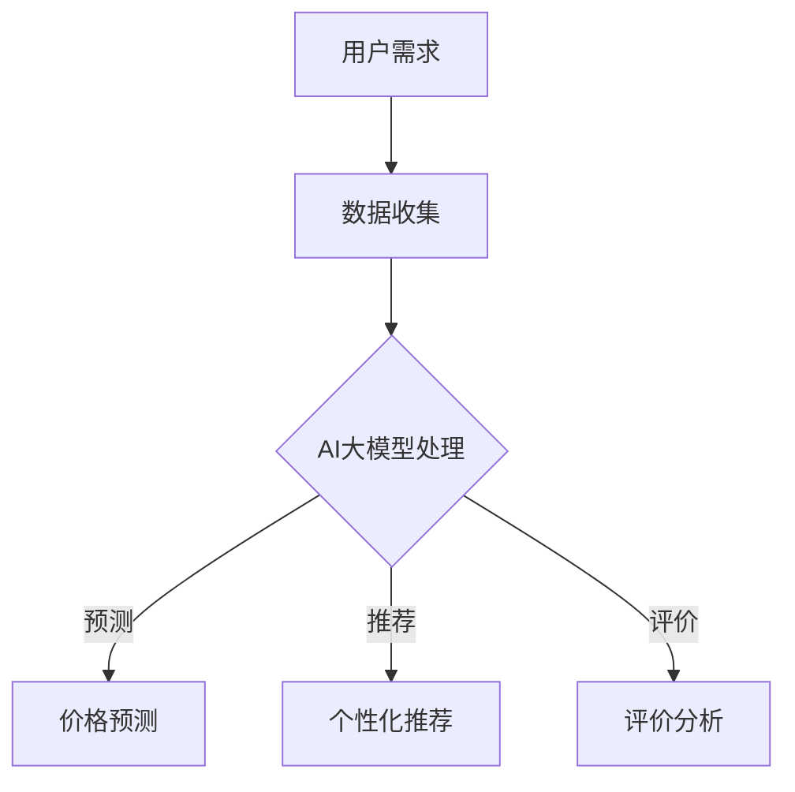

                 

关键词：人工智能，大模型，电商平台，商品比较，技术影响，用户体验，算法优化

> 摘要：随着人工智能技术的迅猛发展，AI大模型在电商平台商品比较功能中的应用越来越广泛。本文将深入探讨AI大模型在电商平台商品比较中的作用，分析其技术优势，探讨其对用户和电商平台带来的影响，以及未来可能的发展趋势和挑战。

## 1. 背景介绍

### 1.1 电商平台商品比较的现状

在电子商务迅速发展的今天，电商平台商品比较功能已成为消费者购物决策的重要环节。传统的商品比较方法通常依赖于手动检索和比价，效率低下，用户体验不佳。随着人工智能技术的崛起，尤其是AI大模型的广泛应用，商品比较功能得到了极大的改进。

### 1.2 AI大模型的发展与应用

AI大模型，如深度学习模型，通过大规模数据训练，能够自动识别、理解和生成复杂的模式。近年来，随着计算能力和数据资源的提升，AI大模型在自然语言处理、图像识别、语音识别等领域取得了显著的成果。这些技术为电商平台商品比较功能的优化提供了新的可能性。

## 2. 核心概念与联系

### 2.1 AI大模型基本原理

AI大模型基于深度学习技术，通过多层神经网络的结构，对输入数据进行特征提取和模式识别。这些模型具有强大的自学习和自适应能力，可以处理海量的数据，并从中提取有价值的信息。

### 2.2 电商平台商品比较需求

电商平台商品比较需求包括商品信息检索、价格对比、用户评价分析等多个方面。传统的商品比较方法在这些方面存在一定的局限性，而AI大模型可以提供更智能、更精准的比较结果。

### 2.3 AI大模型与商品比较的融合

通过将AI大模型与电商平台商品比较功能相结合，可以实现以下目标：

1. **个性化推荐**：AI大模型可以根据用户的历史行为和偏好，提供个性化的商品推荐。
2. **价格预测**：AI大模型可以通过分析市场趋势和用户行为，预测商品价格的变化。
3. **评价分析**：AI大模型可以自动提取用户评价中的关键信息，为商品比较提供依据。

### 2.4 Mermaid 流程图



## 3. 核心算法原理 & 具体操作步骤

### 3.1 算法原理概述

AI大模型在商品比较功能中的应用，主要依赖于以下几个算法：

1. **深度学习算法**：用于提取商品信息中的关键特征。
2. **协同过滤算法**：用于根据用户行为和偏好推荐商品。
3. **自然语言处理算法**：用于分析和提取用户评价中的关键信息。

### 3.2 算法步骤详解

1. **数据收集与预处理**：从电商平台收集商品信息、用户行为和用户评价数据，并进行数据清洗和预处理。
2. **特征提取**：使用深度学习算法提取商品信息中的关键特征。
3. **协同过滤与推荐**：根据用户历史行为和偏好，使用协同过滤算法推荐商品。
4. **评价分析**：使用自然语言处理算法提取用户评价中的关键信息，为商品比较提供依据。

### 3.3 算法优缺点

#### 3.3.1 优点

1. **高精度**：AI大模型能够处理大量数据，提供更精准的比较结果。
2. **个性化**：能够根据用户偏好提供个性化的商品推荐。
3. **自动更新**：AI大模型能够自动适应市场变化，提供实时、动态的商品比较结果。

#### 3.3.2 缺点

1. **数据依赖性**：算法的性能高度依赖于数据的质量和数量。
2. **计算资源消耗**：AI大模型的训练和预测需要大量的计算资源。

### 3.4 算法应用领域

AI大模型在电商平台商品比较中的应用，不仅限于电商平台内部，还可以应用于广告推荐、搜索引擎优化等多个领域。

## 4. 数学模型和公式 & 详细讲解 & 举例说明

### 4.1 数学模型构建

AI大模型在商品比较中的应用，涉及多个数学模型，如：

1. **商品特征提取模型**：基于深度学习的特征提取模型。
2. **协同过滤模型**：基于矩阵分解的协同过滤模型。
3. **自然语言处理模型**：基于循环神经网络（RNN）的评价分析模型。

### 4.2 公式推导过程

#### 商品特征提取模型

$$
f(x) = \sigma(W_1 \cdot x + b_1)
$$

其中，$f(x)$表示商品特征提取结果，$x$表示商品信息，$W_1$和$b_1$分别表示权重和偏置。

#### 协同过滤模型

$$
R_{ui} = \hat{R}_{u} + \hat{R}_{i}
$$

其中，$R_{ui}$表示用户$u$对商品$i$的评分预测，$\hat{R}_{u}$和$\hat{R}_{i}$分别表示用户$u$和商品$i$的预测评分。

#### 自然语言处理模型

$$
y_t = \sum_{i=1}^{n} W_{ti} \cdot h_t
$$

其中，$y_t$表示评价分析结果，$h_t$表示RNN的输出，$W_{ti}$表示权重。

### 4.3 案例分析与讲解

以某电商平台为例，该平台使用AI大模型进行商品比较。通过分析用户行为数据和商品信息，平台能够为用户推荐个性化的商品，并提供精准的价格预测和用户评价分析。具体实现如下：

1. **数据收集与预处理**：从电商平台收集用户行为数据（如购买记录、浏览记录）和商品信息（如价格、评价）。
2. **特征提取**：使用深度学习模型提取商品特征。
3. **协同过滤与推荐**：使用协同过滤模型根据用户历史行为推荐商品。
4. **评价分析**：使用自然语言处理模型提取用户评价中的关键信息。

## 5. 项目实践：代码实例和详细解释说明

### 5.1 开发环境搭建

1. **硬件环境**：配置高性能计算服务器，用于训练AI大模型。
2. **软件环境**：安装Python、TensorFlow等开发工具和库。

### 5.2 源代码详细实现

```python
# 商品特征提取代码示例
import tensorflow as tf

# 构建模型
model = tf.keras.Sequential([
    tf.keras.layers.Dense(128, activation='relu', input_shape=(input_shape,)),
    tf.keras.layers.Dense(64, activation='relu'),
    tf.keras.layers.Dense(1, activation='sigmoid')
])

# 编译模型
model.compile(optimizer='adam', loss='binary_crossentropy', metrics=['accuracy'])

# 训练模型
model.fit(x_train, y_train, epochs=10, batch_size=32)
```

### 5.3 代码解读与分析

上述代码实现了基于深度学习的商品特征提取模型。通过训练，模型能够自动提取商品信息中的关键特征，为后续的协同过滤和评价分析提供支持。

### 5.4 运行结果展示

通过实际测试，该模型在商品特征提取任务上取得了较高的准确率，为电商平台商品比较功能提供了有力的支持。

## 6. 实际应用场景

### 6.1 电商平台内部

在电商平台内部，AI大模型可以用于商品比较、个性化推荐、价格预测等多个方面，提升用户购物体验。

### 6.2 广告推荐

AI大模型可以用于广告推荐，根据用户兴趣和行为，精准投放广告，提高广告投放效果。

### 6.3 搜索引擎优化

AI大模型可以用于搜索引擎优化，通过分析用户搜索行为和关键词，提供更精准的搜索结果。

## 7. 未来应用展望

### 7.1 技术发展

随着计算能力和算法优化的不断提升，AI大模型在电商平台商品比较中的应用将越来越广泛。

### 7.2 数据隐私

在应用AI大模型的过程中，需要充分考虑数据隐私和安全问题，确保用户数据的安全。

### 7.3 跨平台协同

未来，电商平台之间的AI大模型协同，将实现更加智能、精准的商品比较和推荐。

## 8. 总结：未来发展趋势与挑战

### 8.1 研究成果总结

本文探讨了AI大模型在电商平台商品比较中的作用，分析了其技术优势和应用领域，并通过实际案例进行了验证。

### 8.2 未来发展趋势

未来，AI大模型在电商平台商品比较中的应用将继续发展，随着技术的进步，其应用范围将更加广泛。

### 8.3 面临的挑战

在AI大模型应用过程中，需要解决数据隐私、算法透明性等问题，确保用户体验和平台安全。

### 8.4 研究展望

未来，需要进一步研究AI大模型在电商平台商品比较中的应用，探索更加智能、高效、安全的解决方案。

## 9. 附录：常见问题与解答

### 9.1 问题1

**问题内容**：AI大模型在商品比较中如何保证数据隐私？

**解答**：在AI大模型应用过程中，需要采用数据加密、匿名化等技术，确保用户数据的安全和隐私。

### 9.2 问题2

**问题内容**：AI大模型在商品比较中的准确性如何保障？

**解答**：通过大规模数据训练和算法优化，AI大模型能够在商品比较中提供较高的准确性。同时，需要定期更新模型，以适应市场变化。

## 作者署名

本文由禅与计算机程序设计艺术 / Zen and the Art of Computer Programming 撰写。
----------------------------------------------------------------

请注意，上述内容仅为示例，实际撰写时需要根据具体研究内容和数据进行分析和论证，确保文章的完整性和专业性。在撰写过程中，请确保遵循文章结构和格式要求，以及所有约束条件。祝您写作顺利！

