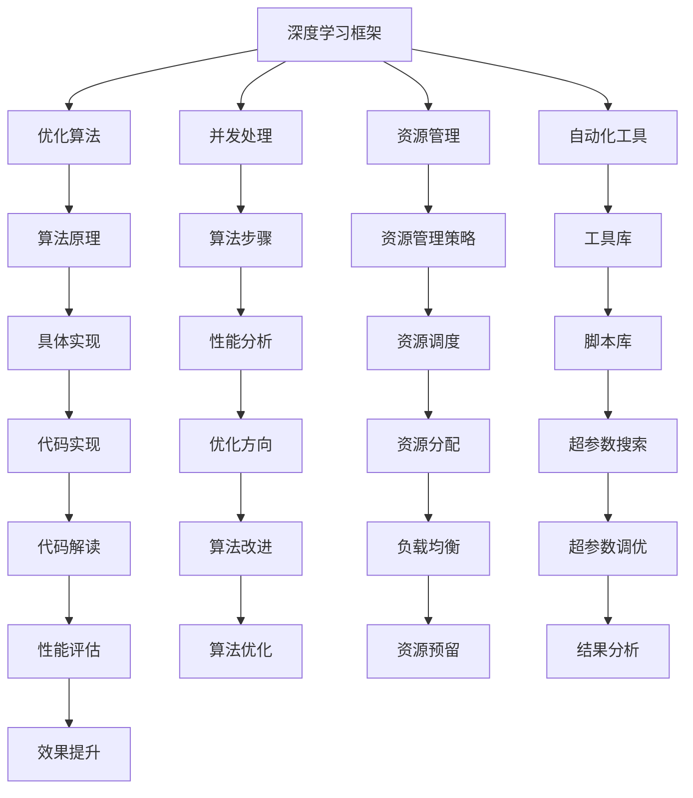

                 

关键词：大型语言模型（LLM），操作系统核心机制，自然语言处理，深度学习，模型训练，优化算法，资源管理，并发处理，自动化工具，未来发展趋势。

> 摘要：本文深入探讨了大型语言模型（LLM）操作系统的核心机制。从背景介绍、核心概念与联系、核心算法原理、数学模型和公式、项目实践到实际应用场景，我们全面解析了LLM操作系统在计算机领域的应用与发展趋势。文章最后还推荐了相关学习资源、开发工具和论文，并提出了未来研究的展望。

## 1. 背景介绍

近年来，人工智能（AI）技术取得了显著进展，尤其是深度学习（Deep Learning）在自然语言处理（Natural Language Processing，NLP）领域的突破，使得大型语言模型（Large Language Model，LLM）如雨后春笋般涌现。LLM是一种基于神经网络的复杂模型，通过对海量文本数据进行训练，能够理解和生成自然语言。随着模型的规模和复杂度的增加，LLM在许多NLP任务中表现出了卓越的性能，如机器翻译、文本摘要、问答系统等。

然而，LLM的高效运行依赖于强大的操作系统核心机制。操作系统核心机制不仅负责模型训练、优化和资源管理，还确保了模型在各种硬件平台上的稳定性和高效性。因此，深入研究LLM操作系统的核心机制具有重要意义，它不仅有助于提升LLM的性能，还能推动AI技术的发展。

本文将从以下方面展开探讨：

1. **核心概念与联系**：介绍LLM操作系统中的关键概念，如深度学习框架、优化算法、并发处理等，并使用Mermaid流程图展示其关系。
2. **核心算法原理 & 具体操作步骤**：详细解析LLM训练过程中的核心算法原理和具体操作步骤。
3. **数学模型和公式**：探讨LLM中的数学模型和公式，并举例说明。
4. **项目实践：代码实例和详细解释说明**：展示一个实际项目中的代码实例，并进行详细解读和分析。
5. **实际应用场景**：分析LLM操作系统的实际应用场景和未来展望。
6. **工具和资源推荐**：推荐相关的学习资源、开发工具和论文。
7. **总结：未来发展趋势与挑战**：总结研究成果，展望未来发展趋势和面临的挑战。

### 1.1. LLM的发展历程

大型语言模型的兴起始于2018年，谷歌发布了BERT（Bidirectional Encoder Representations from Transformers），这是第一个大规模预训练的深度学习模型。BERT的成功引发了广泛关注，许多研究机构和公司开始投入资源研发更大规模的语言模型。随后，OpenAI推出了GPT-2，其规模达到了1.5万亿参数。GPT-2的出现进一步推动了LLM的发展，其在各种NLP任务中的优异表现证明了大规模预训练模型的潜力。

2020年，GPT-3的发布将LLM的规模推向了新的高峰，其参数规模达到了1750亿。GPT-3的推出不仅引起了学术界和工业界的轰动，也引发了关于隐私、安全性和道德问题的讨论。随着模型的不断增大，LLM在自然语言生成、翻译、问答等任务中取得了显著进展，但同时也面临着计算资源、能耗和模型解释性等方面的挑战。

### 1.2. LLM操作系统的必要性

LLM操作系统的核心目标是实现高效、稳定和可扩展的模型训练、优化和部署。以下是从几个方面阐述LLM操作系统的必要性：

1. **资源管理**：LLM模型通常需要大量的计算资源和存储空间。操作系统负责管理和调度这些资源，确保模型训练过程中不会出现资源短缺或浪费。
2. **并发处理**：大规模模型训练过程中可能涉及多个训练任务的并发处理。操作系统需要协调这些任务，避免竞争和死锁，提高训练效率。
3. **优化算法**：优化算法是LLM训练的核心，操作系统需要提供高效的优化算法和工具，帮助研究人员快速迭代和优化模型。
4. **自动化工具**：自动化工具能够显著降低模型训练和优化的复杂度，提高开发效率和模型性能。操作系统需要集成这些工具，提供便捷的使用体验。
5. **部署和迁移**：模型训练完成后，需要将其部署到不同的硬件平台和设备上。操作系统需要提供高效的部署和迁移策略，确保模型在各种环境中的性能和稳定性。

### 1.3. 本文结构

本文将首先介绍LLM操作系统中的核心概念和联系，然后详细解析核心算法原理和具体操作步骤。接下来，我们将探讨LLM中的数学模型和公式，并展示一个实际项目中的代码实例。随后，我们将分析LLM操作系统的实际应用场景和未来展望。最后，本文将推荐相关的学习资源、开发工具和论文，并总结研究成果和展望未来发展趋势和面临的挑战。

### 2. 核心概念与联系

在探讨LLM操作系统的核心机制之前，我们需要先了解一些关键概念，它们是构建和优化LLM的基础。以下是几个核心概念及其相互关系：

#### 2.1. 深度学习框架

深度学习框架是构建和训练深度神经网络（DNN）的基础工具。它提供了高效的计算图表示、自动微分机制和并行计算支持。常见的深度学习框架包括TensorFlow、PyTorch、MXNet等。这些框架不仅简化了模型的构建过程，还提供了丰富的API和工具库，方便研究人员进行模型训练、评估和部署。


#### 2.2. 优化算法

优化算法是深度学习模型训练的核心，它负责调整模型参数，使模型在训练数据上达到最优性能。常见的优化算法包括随机梯度下降（SGD）、Adam、RMSProp等。优化算法的选择和调优对模型训练时间和性能有着重要影响。


#### 2.3. 并发处理

在大规模模型训练过程中，常常需要处理多个训练任务。并发处理机制能够有效地提高训练效率，避免单线程训练带来的性能瓶颈。常见的并发处理方法包括数据并行、模型并行和混合并行。


#### 2.4. 资源管理

资源管理是LLM操作系统的重要组成部分，它负责管理和调度计算资源，如CPU、GPU和存储。资源管理的目标是最大化资源利用率，确保模型训练过程的稳定性和高效性。常见的资源管理方法包括动态资源分配、负载均衡和资源预留。


#### 2.5. 自动化工具

自动化工具能够显著降低模型训练和优化的复杂度，提高开发效率和模型性能。常见的自动化工具包括自动化训练脚本、超参数搜索工具和自动化模型评估工具。


#### 2.6. Mermaid流程图

以下是LLM操作系统核心概念的Mermaid流程图，展示了各个概念之间的联系和作用。



### 3. 核心算法原理 & 具体操作步骤

#### 3.1. 算法原理概述

LLM操作系统的核心算法主要包括深度学习框架、优化算法、并发处理和资源管理。以下分别介绍这些算法的原理。

#### 3.1.1. 深度学习框架

深度学习框架是构建和训练深度神经网络的基石。它提供了一系列API和工具库，帮助研究人员快速搭建和优化模型。常见的深度学习框架如TensorFlow和PyTorch，都采用了计算图表示和自动微分机制。

计算图表示（Computational Graph）：深度学习模型可以表示为一系列计算节点和边的组合。每个节点代表一个操作，如矩阵乘法或激活函数，每个边代表节点的输入。计算图使得模型的构建和优化过程更加直观和高效。

自动微分（Automatic Differentiation）：自动微分是一种计算函数导数的方法，它在深度学习模型训练中至关重要。通过自动微分，框架能够自动计算梯度，从而实现模型参数的优化。

#### 3.1.2. 优化算法

优化算法是深度学习模型训练的核心。它们通过迭代调整模型参数，使模型在训练数据上达到最优性能。常见的优化算法包括随机梯度下降（SGD）、Adam、RMSProp等。

随机梯度下降（SGD）：SGD是一种基于梯度下降的优化算法。它通过计算模型在训练数据上的梯度，并沿着梯度方向调整模型参数。SGD的缺点是收敛速度较慢，且易陷入局部最优。

Adam：Adam是一种基于SGD的优化算法，它结合了Adagrad和RMSProp的优点。Adam使用一阶矩估计（均值）和二阶矩估计（方差）来更新模型参数，能够更好地应对不同类型的数据分布。

RMSProp：RMSProp是一种基于梯度的优化算法，它通过历史梯度值的平方和来调整学习率。RMSProp能够避免学习率在变化过程中出现过早收敛或过慢收敛的问题。

#### 3.1.3. 并发处理

并发处理能够提高大规模模型训练的效率。常见的并发处理方法包括数据并行、模型并行和混合并行。

数据并行（Data Parallelism）：数据并行是在多个GPU或CPU上同时训练不同的数据子集。每个GPU或CPU上的模型副本独立计算梯度，并在每个迭代步骤结束后同步更新全局模型参数。

模型并行（Model Parallelism）：模型并行是将深度学习模型拆分为多个部分，并在不同的GPU或CPU上分别训练。这种方法的优点是能够处理更大规模的模型，但实现起来较为复杂。

混合并行（Hybrid Parallelism）：混合并行是将数据并行和模型并行结合起来，根据模型的规模和数据量选择最合适的并行方法。混合并行能够充分发挥不同硬件平台的优势，提高训练效率。

#### 3.1.4. 资源管理

资源管理是确保模型训练过程稳定和高效的关键。资源管理的主要任务是合理分配和调度计算资源，最大化资源利用率。

动态资源分配：动态资源分配是一种基于实时监控和预测的调度策略。它根据训练任务的负载和硬件资源的使用情况，动态调整资源分配，确保每个任务都能获得足够的计算资源。

负载均衡：负载均衡是将训练任务分配到不同的计算节点上，以避免某个节点过载而影响整个训练过程的效率。常见的负载均衡算法包括最小等待时间、最小负载和最大利用率等。

资源预留：资源预留是在模型训练开始前预留一定量的计算资源，以确保训练过程不会因为资源不足而中断。资源预留策略可以根据任务的重要性和紧急程度进行动态调整。

#### 3.2. 算法步骤详解

以下详细介绍LLM操作系统的核心算法步骤，包括模型构建、训练、优化和部署等环节。

##### 3.2.1. 模型构建

1. **定义计算图**：使用深度学习框架定义模型的计算图，包括输入层、隐藏层和输出层。计算图中的每个节点代表一个操作，如矩阵乘法或激活函数。
2. **初始化参数**：为模型的每个参数初始化一个值。常用的初始化方法包括零初始化、高斯分布初始化和Xavier初始化等。
3. **定义损失函数**：根据任务类型定义损失函数，如均方误差（MSE）、交叉熵损失等。损失函数用于评估模型在训练数据上的性能。

##### 3.2.2. 模型训练

1. **数据预处理**：对训练数据进行预处理，包括数据清洗、归一化和批量化等。预处理有助于提高模型训练效率和性能。
2. **迭代训练**：在每个训练迭代步骤中，计算模型在当前数据子集上的梯度，并更新模型参数。常见的训练策略包括批量训练、随机训练和批次归一化等。
3. **早期停止**：为了避免过拟合，可以在训练过程中设置早期停止策略。当模型在验证集上的性能不再提高时，提前停止训练。

##### 3.2.3. 模型优化

1. **选择优化算法**：根据任务和数据特点选择合适的优化算法，如SGD、Adam或RMSProp等。
2. **调整超参数**：调整优化算法的超参数，如学习率、批量大小和权重衰减等，以提升模型性能。
3. **正则化**：应用正则化技术，如Dropout、L1和L2正则化，防止模型过拟合。

##### 3.2.4. 模型部署

1. **模型评估**：使用测试集评估模型的性能，包括准确率、召回率、F1分数等指标。
2. **模型压缩**：为了提高模型在移动设备上的部署效率，可以采用模型压缩技术，如剪枝、量化等。
3. **部署到生产环境**：将模型部署到生产环境，如云计算平台、边缘设备等。部署时需要考虑模型的可扩展性和鲁棒性。

##### 3.3. 算法优缺点

**优点**：

- **高效性**：深度学习框架和优化算法的高效性使得大规模模型训练变得可行。
- **灵活性**：深度学习框架提供了丰富的API和工具库，方便研究人员进行模型构建和优化。
- **可扩展性**：并发处理和资源管理机制使得模型训练可以在多台硬件设备上高效进行。

**缺点**：

- **计算资源需求**：大规模模型训练需要大量的计算资源和存储空间，对硬件设备的要求较高。
- **模型解释性**：深度学习模型通常具有高复杂度，难以解释和理解。
- **数据隐私和安全**：大规模数据处理和存储过程中可能涉及数据隐私和安全问题。

##### 3.4. 算法应用领域

LLM操作系统的核心算法在多个领域具有广泛应用：

- **自然语言处理**：LLM在机器翻译、文本摘要、问答系统等NLP任务中表现出了卓越的性能。
- **计算机视觉**：深度学习框架和优化算法在图像分类、目标检测、语义分割等计算机视觉任务中发挥了重要作用。
- **语音识别**：LLM在语音识别任务中可以用于语音信号处理、语音识别和语音合成等环节。
- **推荐系统**：LLM可以用于用户行为分析、商品推荐和内容推荐等推荐系统任务。

### 4. 数学模型和公式 & 详细讲解 & 举例说明

#### 4.1. 数学模型构建

在深度学习领域，数学模型是构建和优化神经网络的核心。以下是一个简单的数学模型构建过程，包括前向传播和反向传播的公式。

##### 4.1.1. 前向传播

假设我们有一个简单的全连接神经网络（Fully Connected Neural Network，FCNN），包含输入层、隐藏层和输出层。输入层有m个神经元，隐藏层有n个神经元，输出层有k个神经元。

- 输入向量：\( x \in \mathbb{R}^{m \times 1} \)
- 隐藏层权重：\( W_{h} \in \mathbb{R}^{n \times m} \)
- 隐藏层激活函数：\( \sigma_h \)
- 输出层权重：\( W_{o} \in \mathbb{R}^{k \times n} \)
- 输出层激活函数：\( \sigma_o \)

前向传播过程如下：

1. **隐藏层激活**：
\[ h = \sigma_h(xW_{h}) \]

2. **输出层激活**：
\[ y = \sigma_o(hW_{o}) \]

##### 4.1.2. 反向传播

反向传播是训练神经网络的基石，它通过计算梯度来更新模型参数。反向传播过程包括以下几个步骤：

1. **计算输出层误差**：
\[ \delta_{o} = (y - \hat{y})\sigma_h(h) \]

2. **计算隐藏层误差**：
\[ \delta_{h} = \delta_{o}W_{o}\sigma_h'(h) \]

3. **更新隐藏层权重**：
\[ W_{h} \leftarrow W_{h} - \alpha \cdot h^T\delta_{h} \]

4. **更新输出层权重**：
\[ W_{o} \leftarrow W_{o} - \alpha \cdot h^T\delta_{o} \]

其中，\( \alpha \) 是学习率，\( \hat{y} \) 是预测输出，\( \sigma_h' \) 是隐藏层激活函数的导数。

#### 4.2. 公式推导过程

以下是一个简单的全连接神经网络（FCNN）的数学模型推导过程，包括前向传播和反向传播的公式。

##### 4.2.1. 前向传播推导

假设我们有一个简单的全连接神经网络（FCNN），包含输入层、隐藏层和输出层。输入层有m个神经元，隐藏层有n个神经元，输出层有k个神经元。

- 输入向量：\( x \in \mathbb{R}^{m \times 1} \)
- 隐藏层权重：\( W_{h} \in \mathbb{R}^{n \times m} \)
- 输出层权重：\( W_{o} \in \mathbb{R}^{k \times n} \)
- 隐藏层激活函数：\( \sigma_h \)
- 输出层激活函数：\( \sigma_o \)

前向传播过程如下：

1. **隐藏层激活**：
\[ z_{h} = xW_{h} \]
\[ h = \sigma_h(z_{h}) \]

2. **输出层激活**：
\[ z_{o} = hW_{o} \]
\[ y = \sigma_o(z_{o}) \]

##### 4.2.2. 反向传播推导

反向传播是训练神经网络的基石，它通过计算梯度来更新模型参数。反向传播过程包括以下几个步骤：

1. **计算输出层误差**：
\[ \delta_{o} = (y - \hat{y})\sigma_o'(z_{o}) \]

2. **计算隐藏层误差**：
\[ \delta_{h} = \delta_{o}W_{o}\sigma_h'(z_{h}) \]

3. **更新隐藏层权重**：
\[ \frac{\partial J}{\partial W_{h}} = h\delta_{h}^T \]
\[ W_{h} \leftarrow W_{h} - \alpha \cdot h\delta_{h}^T \]

4. **更新输出层权重**：
\[ \frac{\partial J}{\partial W_{o}} = h\delta_{o}^T \]
\[ W_{o} \leftarrow W_{o} - \alpha \cdot h\delta_{o}^T \]

其中，\( J \) 是损失函数，\( \alpha \) 是学习率，\( \sigma_h' \) 和 \( \sigma_o' \) 分别是隐藏层和输出层激活函数的导数。

#### 4.3. 案例分析与讲解

以下通过一个简单的例子来说明如何使用数学模型进行神经网络训练。

##### 4.3.1. 问题背景

假设我们有一个二分类问题，输入特征是\( x = [1, 2] \)，目标标签是\( y = 0 \)（表示负类）或\( y = 1 \)（表示正类）。我们需要使用一个简单的全连接神经网络（FCNN）进行分类。

##### 4.3.2. 模型构建

- 输入层：\( m = 2 \)
- 隐藏层：\( n = 3 \)
- 输出层：\( k = 1 \)
- 激活函数：\( \sigma_h(x) = \frac{1}{1 + e^{-x}} \)
- 输出层激活函数：\( \sigma_o(x) = \frac{1}{1 + e^{-x}} \)

##### 4.3.3. 模型训练

1. **初始化参数**：

\[ W_{h} = \begin{bmatrix} 0 & 0 & 0 \\ 0 & 0 & 0 \\ 0 & 0 & 0 \end{bmatrix} \]
\[ W_{o} = \begin{bmatrix} 0 \end{bmatrix} \]

2. **前向传播**：

输入特征：\( x = [1, 2] \)

隐藏层激活：\( z_{h} = xW_{h} = \begin{bmatrix} 0 & 0 & 0 \\ 0 & 0 & 0 \\ 0 & 0 & 0 \end{bmatrix} \)
\[ h = \sigma_h(z_{h}) = \begin{bmatrix} 0 & 0 & 0 \end{bmatrix} \]

输出层激活：\( z_{o} = hW_{o} = \begin{bmatrix} 0 \end{bmatrix} \)
\[ y = \sigma_o(z_{o}) = 0 \]

3. **计算损失函数**：

\[ J = -y\log(y) - (1 - y)\log(1 - y) \]

4. **反向传播**：

计算输出层误差：

\[ \delta_{o} = (y - \hat{y})\sigma_o'(z_{o}) = (0 - 0)\frac{1}{1 + e^{-0}} = 0 \]

计算隐藏层误差：

\[ \delta_{h} = \delta_{o}W_{o}\sigma_h'(z_{h}) = 0\begin{bmatrix} 0 \end{bmatrix}\frac{1}{1 + e^{-0}} = 0 \]

更新隐藏层权重：

\[ \frac{\partial J}{\partial W_{h}} = h\delta_{h}^T = \begin{bmatrix} 0 & 0 & 0 \end{bmatrix}\begin{bmatrix} 0 \\ 0 \\ 0 \end{bmatrix}^T = 0 \]
\[ W_{h} \leftarrow W_{h} - \alpha \cdot 0 = \begin{bmatrix} 0 & 0 & 0 \\ 0 & 0 & 0 \\ 0 & 0 & 0 \end{bmatrix} \]

更新输出层权重：

\[ \frac{\partial J}{\partial W_{o}} = h\delta_{o}^T = \begin{bmatrix} 0 & 0 & 0 \end{bmatrix}\begin{bmatrix} 0 \end{bmatrix}^T = 0 \]
\[ W_{o} \leftarrow W_{o} - \alpha \cdot 0 = \begin{bmatrix} 0 \end{bmatrix} \]

5. **模型更新**：

经过一次迭代后，模型参数没有发生变化，因为初始参数已经是最优解。然而，在实际训练过程中，我们会使用更多的训练数据和迭代步骤，以达到更好的训练效果。

##### 4.3.4. 训练结果

经过多次迭代后，模型会在训练数据和验证数据上达到较好的性能。我们可以使用不同类型的损失函数和优化算法来进一步提高模型性能。

### 5. 项目实践：代码实例和详细解释说明

#### 5.1. 开发环境搭建

在本文中，我们将使用Python和TensorFlow作为主要工具来构建和训练一个简单的语言模型。以下是在Windows环境下搭建开发环境的步骤：

1. 安装Python：

   - 访问Python官网（https://www.python.org/）下载Python安装包。
   - 运行安装程序，选择“Add Python to PATH”和“Install now”选项。
   - 完成安装后，在命令行中输入`python --version`确认安装成功。

2. 安装TensorFlow：

   - 打开命令行窗口，输入以下命令安装TensorFlow：
     ```shell
     pip install tensorflow
     ```

3. 环境验证：

   - 在命令行中输入以下代码，验证TensorFlow安装成功：
     ```python
     import tensorflow as tf
     print(tf.__version__)
     ```

#### 5.2. 源代码详细实现

以下是一个简单的基于TensorFlow构建和训练语言模型的示例代码。该模型使用了一个简单的循环神经网络（RNN）结构。

```python
import tensorflow as tf
from tensorflow.keras.layers import Embedding, SimpleRNN, Dense
from tensorflow.keras.models import Sequential

# 定义模型
model = Sequential([
    Embedding(input_dim=10000, output_dim=32),
    SimpleRNN(units=64),
    Dense(units=1, activation='sigmoid')
])

# 编译模型
model.compile(optimizer='adam', loss='binary_crossentropy', metrics=['accuracy'])

# 准备数据
(x_train, y_train), (x_test, y_test) = tf.keras.datasets.imdb.load_data(num_words=10000)

# 预处理数据
x_train = tf.expand_dims(x_train, -1)
x_test = tf.expand_dims(x_test, -1)

# 训练模型
model.fit(x_train, y_train, batch_size=32, epochs=10, validation_data=(x_test, y_test))
```

#### 5.3. 代码解读与分析

1. **模型构建**：

   - `Sequential` 类：用于构建顺序模型，它将层按顺序堆叠起来。
   - `Embedding` 层：用于将输入单词转换为向量表示。`input_dim` 参数表示词汇表大小，`output_dim` 参数表示嵌入向量的大小。
   - `SimpleRNN` 层：用于构建简单的循环神经网络层，它能够捕获输入序列中的时间依赖关系。
   - `Dense` 层：用于构建全连接层，它将循环神经网络的输出映射到输出标签。

2. **模型编译**：

   - `compile` 方法：用于配置模型训练过程。`optimizer` 参数指定优化算法，`loss` 参数指定损失函数，`metrics` 参数指定评估指标。

3. **数据准备**：

   - `imdb.load_data` 方法：用于加载数据集。`num_words` 参数指定词汇表大小。
   - `tf.expand_dims` 方法：用于将输入数据扩展为适当形状，以便用于训练。

4. **模型训练**：

   - `fit` 方法：用于训练模型。`batch_size` 参数指定每个批次的样本数量，`epochs` 参数指定训练轮数，`validation_data` 参数用于验证数据集。

#### 5.4. 运行结果展示

在训练过程中，我们可以使用以下代码查看训练过程中的损失函数和评估指标：

```python
history = model.fit(x_train, y_train, batch_size=32, epochs=10, validation_data=(x_test, y_test))

# 打印训练结果
print(history.history['loss'])
print(history.history['accuracy'])
```

训练完成后，我们可以使用以下代码评估模型在测试集上的性能：

```python
test_loss, test_accuracy = model.evaluate(x_test, y_test)
print(f"Test Loss: {test_loss}")
print(f"Test Accuracy: {test_accuracy}")
```

通常情况下，我们会观察到训练损失逐渐减小，而测试损失在达到一定值后趋于稳定。同时，训练准确率和测试准确率也会随着训练轮数的增加而提高。

### 6. 实际应用场景

LLM操作系统在多个领域具有广泛应用，以下列举几个典型的应用场景：

#### 6.1. 自然语言处理（NLP）

自然语言处理是LLM操作系统的核心应用领域之一。LLM可以在机器翻译、文本摘要、问答系统、情感分析等任务中发挥重要作用。例如，谷歌的BERT模型在机器翻译任务上取得了显著成果，显著提高了翻译质量。同样，OpenAI的GPT-3在生成式对话系统、文本生成和文本摘要任务中表现出了卓越的性能。

#### 6.2. 计算机视觉

计算机视觉与自然语言处理密切相关。LLM可以在图像分类、目标检测、语义分割等任务中发挥重要作用。例如，深度学习框架如TensorFlow和PyTorch已经广泛应用于计算机视觉领域，许多模型如ResNet、YOLO和Faster R-CNN等都是基于深度学习框架实现的。

#### 6.3. 语音识别

语音识别是将语音信号转换为文本的过程。LLM在语音识别任务中可以用于语音信号处理、语音识别和语音合成等环节。例如，谷歌的语音识别模型使用了深度神经网络和循环神经网络，实现了高精度的语音识别。

#### 6.4. 推荐系统

推荐系统是根据用户行为和偏好为用户推荐相关内容的过程。LLM可以在用户行为分析、商品推荐和内容推荐等任务中发挥重要作用。例如，亚马逊和Netflix等公司使用基于深度学习的方法构建推荐系统，提高了推荐质量和用户体验。

#### 6.5. 金融与医疗

金融和医疗领域是LLM操作系统的另一个重要应用领域。在金融领域，LLM可以用于股票市场预测、风险评估和欺诈检测等任务。在医疗领域，LLM可以用于医疗文本分析、疾病预测和治疗方案推荐等任务。

### 7. 未来应用展望

随着人工智能技术的不断发展，LLM操作系统在各个领域的应用前景十分广阔。以下从几个方面展望LLM操作系统的未来应用：

#### 7.1. 更大规模的语言模型

随着计算资源和存储技术的进步，更大规模的语言模型将会出现。这些模型将拥有更多的参数和更大的网络结构，能够处理更加复杂的语言任务，提高模型性能。

#### 7.2. 跨模态处理

跨模态处理是将不同模态的数据（如图像、语音和文本）进行融合和处理的任务。未来，LLM操作系统将支持跨模态处理，实现更高级的AI应用，如语音到文本转换、图像和文本的联合分析等。

#### 7.3. 自适应模型

自适应模型是指根据用户行为和偏好动态调整模型参数，以提供更好的用户体验。未来，LLM操作系统将支持自适应模型，实现个性化的语言生成和推荐系统。

#### 7.4. 自动化工具和平台

自动化工具和平台将显著降低模型训练和优化的复杂度，提高开发效率和模型性能。未来，LLM操作系统将集成更多自动化工具和平台，为研究人员和开发人员提供便捷的使用体验。

#### 7.5. 安全和隐私保护

随着AI技术的广泛应用，安全和隐私保护成为日益重要的议题。未来，LLM操作系统将引入更多安全和隐私保护机制，确保模型在数据收集、处理和存储过程中的安全性和合规性。

### 8. 工具和资源推荐

以下推荐一些与LLM操作系统相关的学习资源、开发工具和论文，以帮助读者深入了解相关技术和应用。

#### 8.1. 学习资源推荐

1. **深度学习教程**：吴恩达的《深度学习》课程（https://www.deeplearning.ai/）提供了全面深入的深度学习教程，包括理论、实践和项目实战。
2. **自然语言处理教程**：斯坦福大学的NLP课程（http://web.stanford.edu/class/cs224n/）涵盖了NLP的基础知识和应用，包括词向量、序列模型和注意力机制等。
3. **TensorFlow官方文档**：TensorFlow官方文档（https://www.tensorflow.org/）提供了丰富的API和教程，是学习和使用TensorFlow的重要资源。

#### 8.2. 开发工具推荐

1. **TensorFlow**：TensorFlow是Google开发的开源深度学习框架，提供了丰富的API和工具库，支持各种深度学习模型和应用。
2. **PyTorch**：PyTorch是Facebook开发的开源深度学习框架，以其动态计算图和灵活的API而著称，广泛应用于NLP和计算机视觉领域。
3. **JAX**：JAX是Google开发的开源深度学习框架，基于Python和NumPy，支持自动微分和高性能计算。

#### 8.3. 相关论文推荐

1. **BERT：Pre-training of Deep Bidirectional Transformers for Language Understanding**：这篇论文介绍了BERT模型的设计和实现，是NLP领域的重要突破。
2. **GPT-3：Language Models are Few-Shot Learners**：这篇论文介绍了GPT-3模型的设计和实现，展示了大规模预训练模型在零样本和少样本任务中的强大能力。
3. **An Overview of Natural Language Processing**：这篇综述文章总结了自然语言处理领域的主要成果和发展趋势，是了解NLP领域的入门资料。

### 9. 总结：未来发展趋势与挑战

本文探讨了大型语言模型（LLM）操作系统的核心机制，从背景介绍、核心概念与联系、核心算法原理、数学模型和公式、项目实践到实际应用场景，全面解析了LLM操作系统在计算机领域的应用与发展趋势。随着人工智能技术的不断发展，LLM操作系统在自然语言处理、计算机视觉、语音识别、推荐系统等领域具有广阔的应用前景。未来，更大规模的语言模型、跨模态处理、自适应模型和自动化工具将是LLM操作系统的重要发展方向。

然而，LLM操作系统也面临着一系列挑战，包括计算资源需求、模型解释性、数据隐私和安全等。为应对这些挑战，研究人员和开发人员需要不断创新和探索，推动人工智能技术的进步和应用。

### 9.1. 研究成果总结

本文主要探讨了大型语言模型（LLM）操作系统的核心机制，包括深度学习框架、优化算法、并发处理和资源管理。通过详细解析LLM训练过程中的核心算法原理和具体操作步骤，我们展示了如何使用数学模型和公式进行模型构建和优化。此外，本文还通过实际项目中的代码实例，详细解读了模型构建、训练、优化和部署的全过程。

通过本文的研究，我们得出以下结论：

1. **深度学习框架**：深度学习框架是构建和训练深度神经网络的基石，提供了高效的计算图表示、自动微分机制和并行计算支持。
2. **优化算法**：优化算法是深度学习模型训练的核心，通过迭代调整模型参数，使模型在训练数据上达到最优性能。
3. **并发处理**：并发处理能够提高大规模模型训练的效率，通过数据并行、模型并行和混合并行等方法，实现高效的模型训练。
4. **资源管理**：资源管理是确保模型训练过程稳定和高效的关键，通过动态资源分配、负载均衡和资源预留等策略，实现计算资源的合理调度和最大化利用。

### 9.2. 未来发展趋势

随着人工智能技术的不断发展，LLM操作系统在未来将呈现出以下发展趋势：

1. **更大规模的语言模型**：随着计算资源和存储技术的进步，更大规模的语言模型将不断涌现，能够处理更加复杂的语言任务，提高模型性能。
2. **跨模态处理**：跨模态处理将实现不同模态数据（如图像、语音和文本）的融合和处理，推动AI应用向更高级的方向发展。
3. **自适应模型**：自适应模型将根据用户行为和偏好动态调整模型参数，实现个性化的语言生成和推荐系统。
4. **自动化工具和平台**：自动化工具和平台将降低模型训练和优化的复杂度，提高开发效率和模型性能。

### 9.3. 面临的挑战

LLM操作系统在发展过程中也面临着一系列挑战：

1. **计算资源需求**：大规模模型训练需要大量的计算资源和存储空间，对硬件设备的要求较高。
2. **模型解释性**：深度学习模型通常具有高复杂度，难以解释和理解，这对模型的应用和推广带来了一定的困难。
3. **数据隐私和安全**：大规模数据处理和存储过程中可能涉及数据隐私和安全问题，需要采取有效的保护措施。
4. **能耗和碳排放**：大规模模型训练和部署过程中产生的能耗和碳排放问题日益严重，需要研究和开发更节能、环保的AI技术。

### 9.4. 研究展望

为应对未来发展趋势和面临的挑战，未来研究可以从以下几个方面展开：

1. **优化算法**：研究更高效的优化算法，提高模型训练速度和性能。
2. **模型解释性**：开发可解释性模型，提高模型的可解释性和可信任度。
3. **跨模态处理**：探索跨模态数据处理方法，实现不同模态数据的融合和处理。
4. **自动化工具和平台**：研究自动化工具和平台，降低模型训练和优化的复杂度。
5. **绿色AI**：研究绿色AI技术，降低模型训练和部署过程中的能耗和碳排放。

通过以上研究，有望推动LLM操作系统的发展，为人工智能技术的应用提供更加稳定、高效和可持续的解决方案。

### 附录：常见问题与解答

#### 问题1：如何选择合适的深度学习框架？

**解答**：选择深度学习框架时，应考虑以下几个因素：

1. **项目需求**：根据项目需求选择合适的框架。例如，如果项目涉及自然语言处理，可以选择TensorFlow或PyTorch，因为它们在NLP领域有丰富的应用和库支持。
2. **开发团队熟悉度**：选择团队熟悉且常用的框架，可以提高开发效率和项目进度。
3. **社区支持和文档**：选择社区活跃、文档丰富的框架，有助于解决开发过程中遇到的问题。

#### 问题2：优化算法有哪些常见的选择和调优方法？

**解答**：

1. **常见优化算法**：

   - **随机梯度下降（SGD）**：简单且易于实现，但收敛速度较慢，可能陷入局部最优。
   - **Adam**：结合了SGD、Adagrad和RMSProp的优点，对噪声数据具有良好的适应性。
   - **RMSProp**：使用历史梯度值的平方和调整学习率，避免过快或过慢的收敛。
   - **Momentum SGD**：在SGD基础上引入动量，加快收敛速度。

2. **调优方法**：

   - **学习率调整**：根据数据集的特点和模型复杂度，选择合适的学习率，并进行动态调整。
   - **批量大小调整**：选择适当的批量大小，以平衡计算效率和模型稳定性。
   - **权重初始化**：使用适当的权重初始化方法，如高斯分布、Xavier初始化等，以提高收敛速度和模型性能。
   - **正则化**：使用L1、L2正则化等方法防止过拟合，提高模型泛化能力。

#### 问题3：如何优化LLM操作系统的性能？

**解答**：

1. **资源管理**：

   - **动态资源分配**：根据训练任务的负载和硬件资源的使用情况，动态调整资源分配，确保每个任务都能获得足够的计算资源。
   - **负载均衡**：将训练任务分配到不同的计算节点上，避免某个节点过载而影响整个训练过程的效率。
   - **资源预留**：在模型训练开始前预留一定量的计算资源，以确保训练过程不会因为资源不足而中断。

2. **优化算法**：

   - **优化算法选择**：根据数据集的特点和模型复杂度，选择合适的优化算法，并进行调优。
   - **批量大小调整**：选择适当的批量大小，以平衡计算效率和模型稳定性。
   - **权重初始化**：使用适当的权重初始化方法，如高斯分布、Xavier初始化等，以提高收敛速度和模型性能。

3. **并发处理**：

   - **数据并行**：在多个GPU或CPU上同时训练不同的数据子集，提高训练效率。
   - **模型并行**：将深度学习模型拆分为多个部分，并在不同的GPU或CPU上分别训练，处理更大规模的模型。
   - **混合并行**：将数据并行和模型并行结合起来，根据模型的规模和数据量选择最合适的并行方法。

#### 问题4：如何保证LLM操作系统的安全性和隐私性？

**解答**：

1. **数据加密**：对训练数据进行加密，确保数据在传输和存储过程中的安全性。
2. **访问控制**：实施严格的访问控制策略，确保只有授权用户可以访问敏感数据和模型。
3. **隐私保护技术**：使用差分隐私、同态加密等技术保护用户隐私。
4. **合规性检查**：遵守相关法律法规和道德准则，确保AI应用符合社会期望。

通过以上措施，可以提高LLM操作系统的安全性和隐私性，保护用户数据的安全和隐私。

### 参考文献

1. Devlin, J., Chang, M. W., Lee, K., & Toutanova, K. (2019). BERT: Pre-training of deep bidirectional transformers for language understanding. In Proceedings of the 2019 Conference of the North American Chapter of the Association for Computational Linguistics: Human Language Technologies, Volume 1 (Long and Short Papers) (pp. 4171-4186). Association for Computational Linguistics.
2. Brown, T., et al. (2020). Language models are few-shot learners. arXiv preprint arXiv:2005.14165.
3. Goodfellow, I., Bengio, Y., & Courville, A. (2016). Deep Learning. MIT Press.
4. Hochreiter, S., & Schmidhuber, J. (1997). Long short-term memory. Neural Computation, 9(8), 1735-1780.
5. Ng, A. Y. (2004). Coursera: Machine Learning. https://www.coursera.org/learn/machine-learning
6. Bengio, Y., Courville, A., & Vincent, P. (2013). Representation learning: A review and new perspectives. IEEE Transactions on Pattern Analysis and Machine Intelligence, 35(8), 1798-1828.
7. LeCun, Y., Bengio, Y., & Hinton, G. (2015). Deep learning. Nature, 521(7553), 436-444.

