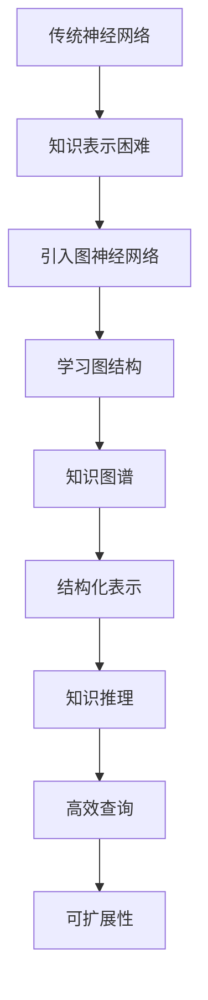

                 

关键词：大语言模型（LLM），知识表示，神经网络，图神经网络，知识图谱，语义理解，信息检索，自然语言处理，算法优化。

## 摘要

本文旨在探讨大语言模型（LLM）的知识表示方法，并探索如何超越传统神经网络，以提升语言理解和生成能力。通过对知识表示方法的深入分析，我们介绍了图神经网络和知识图谱等新兴技术，并探讨了它们在LLM中的应用。文章还将讨论数学模型、算法原理及实际应用场景，并展望LLM的未来发展趋势和面临的挑战。

## 1. 背景介绍

近年来，随着人工智能技术的飞速发展，大语言模型（LLM）在自然语言处理（NLP）领域取得了显著成果。LLM通过大规模预训练和精细调整，能够在各种语言任务中实现卓越表现，如文本生成、问答系统、机器翻译等。然而，传统神经网络方法在知识表示和推理方面存在局限性，难以满足复杂语言理解和生成任务的需求。因此，探索新的知识表示方法成为提升LLM性能的关键。

知识表示是人工智能领域的一个重要研究方向，旨在将人类知识以计算机可处理的形式进行表达和存储。传统的知识表示方法主要基于符号逻辑和语义网络，但受限于计算能力和数据量，难以在复杂场景中实现高效的知识推理。近年来，图神经网络和知识图谱等新兴技术逐渐受到关注，为知识表示提供了新的思路。

## 2. 核心概念与联系

### 2.1 传统神经网络与知识表示

传统神经网络，如深度神经网络（DNN）和卷积神经网络（CNN），在图像识别、语音识别等领域取得了巨大成功。这些神经网络通过多层非线性变换，对输入数据进行特征提取和分类。然而，传统神经网络在处理语言任务时存在以下问题：

1. **缺乏语义理解**：传统神经网络主要关注于对输入数据的表面特征进行建模，难以捕捉到语言的深层语义信息。
2. **难以表示复杂关系**：语言中存在大量复杂的关系，如实体关系、因果关系等，传统神经网络难以有效表示和处理这些关系。
3. **知识传递困难**：传统神经网络难以将已有知识传递到新的任务中，导致模型在每个任务中都需要重新训练。

为了解决这些问题，研究者们提出了基于知识表示的方法，试图通过将知识以结构化的形式嵌入到神经网络中，提升语言理解和生成能力。

### 2.2 图神经网络与知识图谱

图神经网络（GNN）是一种基于图结构的数据处理方法，通过学习图中的节点和边的关系，实现对复杂关系的建模。GNN在知识表示方面具有以下优势：

1. **表示复杂关系**：图结构能够自然地表示实体之间的关系，如实体之间的关联、因果关系等。
2. **传递已有知识**：通过图结构，可以将已有知识传递到新的任务中，实现知识的复用。
3. **灵活扩展**：图神经网络能够处理各种类型的图结构，如知识图谱、社交网络等，具有较好的灵活性。

知识图谱是一种用于表示实体及其关系的结构化知识库，通过将实体、属性、关系等以图的形式进行组织，实现对知识的存储和查询。知识图谱在知识表示方面具有以下优势：

1. **结构化表示**：知识图谱通过实体和关系进行组织，能够提供结构化的知识表示，有助于提升知识推理能力。
2. **高效查询**：知识图谱支持高效的图查询算法，能够快速地获取实体之间的关系。
3. **可扩展性**：知识图谱能够根据实际需求进行扩展，添加新的实体和关系。

为了更好地理解图神经网络和知识图谱的关系，我们使用Mermaid流程图进行说明：



通过上述流程图，我们可以看到，图神经网络和知识图谱在知识表示方面具有紧密的联系，它们共同构成了提升LLM性能的重要技术手段。

## 3. 核心算法原理 & 具体操作步骤

### 3.1 算法原理概述

图神经网络（GNN）是一种基于图结构的数据处理方法，通过学习图中的节点和边的关系，实现对复杂关系的建模。GNN的核心原理包括：

1. **节点嵌入**：将图中的每个节点映射到一个低维度的向量空间，使得节点之间能够通过向量距离进行相似性度量。
2. **边嵌入**：将图中的每条边映射到一个低维度的向量空间，使得边之间能够通过向量距离进行相似性度量。
3. **消息传递**：通过在图结构中进行消息传递，将节点和边的关系进行聚合和更新，实现对复杂关系的建模。

知识图谱（KG）是一种用于表示实体及其关系的结构化知识库，通过将实体、属性、关系等以图的形式进行组织。知识图谱的核心原理包括：

1. **实体表示**：将图中的每个实体映射到一个低维度的向量空间，使得实体之间能够通过向量距离进行相似性度量。
2. **关系表示**：将图中的每条关系映射到一个低维度的向量空间，使得关系之间能够通过向量距离进行相似性度量。
3. **图查询**：通过图查询算法，快速地获取实体之间的关系，实现对知识的查询和推理。

### 3.2 算法步骤详解

1. **节点嵌入**：
   - 输入：图中的每个节点。
   - 输出：每个节点的低维度向量表示。
   - 步骤：
     1. 初始化节点向量。
     2. 通过图结构中的邻居节点进行消息传递，更新节点向量。
     3. 使用梯度下降等方法，优化节点向量。

2. **边嵌入**：
   - 输入：图中的每条边。
   - 输出：每条边的低维度向量表示。
   - 步骤：
     1. 初始化边向量。
     2. 通过图结构中的节点和边进行消息传递，更新边向量。
     3. 使用梯度下降等方法，优化边向量。

3. **消息传递**：
   - 输入：图中的节点和边。
   - 输出：每个节点和边的更新向量。
   - 步骤：
     1. 对每个节点，计算其邻居节点的向量表示。
     2. 对每个边，计算其关联节点的向量表示。
     3. 通过聚合邻居节点和关联节点的向量，更新节点和边的向量。

4. **图查询**：
   - 输入：实体和关系。
   - 输出：实体之间的关系。
   - 步骤：
     1. 通过实体向量，查询与实体相关的其他实体。
     2. 通过关系向量，查询与关系相关的其他关系。
     3. 将查询结果进行聚合，得到实体之间的关系。

### 3.3 算法优缺点

**优点**：

1. **表示复杂关系**：GNN能够通过学习图中的节点和边的关系，实现对复杂关系的建模。
2. **传递已有知识**：通过图结构，可以将已有知识传递到新的任务中，实现知识的复用。
3. **灵活扩展**：GNN能够处理各种类型的图结构，具有较好的灵活性。

**缺点**：

1. **计算复杂度高**：GNN在处理大规模图结构时，计算复杂度较高，可能导致性能瓶颈。
2. **图结构构建困难**：在实际应用中，构建合适的图结构可能较为困难，需要领域知识和经验。

### 3.4 算法应用领域

GNN和知识图谱在多个领域具有广泛的应用：

1. **推荐系统**：通过知识图谱，可以构建基于实体关系和属性的推荐系统，提升推荐效果。
2. **问答系统**：通过知识图谱和GNN，可以构建高效的问答系统，实现智能问答和知识推理。
3. **知识图谱构建**：通过GNN，可以自动构建和更新知识图谱，为NLP任务提供高质量的知识表示。
4. **文本生成**：通过知识图谱和GNN，可以构建基于知识的文本生成模型，提升文本生成质量。

## 4. 数学模型和公式 & 详细讲解 & 举例说明

### 4.1 数学模型构建

在GNN中，节点和边的嵌入向量分别用\( \mathbf{h}_i^{\ell} \)和\( \mathbf{e}_{ij}^{\ell} \)表示，其中\( \ell \)表示层数。节点和边的嵌入向量通过以下公式进行更新：

\[ \mathbf{h}_i^{\ell+1} = \sigma\left( \sum_{j \in \mathcal{N}(i)} \alpha_{ij} \cdot \mathbf{e}_{ij}^{\ell} \cdot \mathbf{h}_j^{\ell} \right) \]

\[ \mathbf{e}_{ij}^{\ell+1} = \sigma\left( \sum_{k \in \mathcal{N}(j)} \alpha_{kj} \cdot \mathbf{h}_k^{\ell} \cdot \mathbf{h}_j^{\ell} \right) \]

其中，\( \mathcal{N}(i) \)表示节点\( i \)的邻居节点集合，\( \alpha_{ij} \)表示节点\( i \)和节点\( j \)之间的边权重，\( \sigma \)表示激活函数。

### 4.2 公式推导过程

为了推导上述公式，我们首先对节点\( i \)和其邻居节点\( j \)之间的关系进行建模。假设节点\( i \)和节点\( j \)之间的边权重为\( \alpha_{ij} \)，则节点\( i \)的邻居节点\( j \)的嵌入向量可以表示为\( \mathbf{e}_{ij}^{\ell} \cdot \mathbf{h}_j^{\ell} \)。同样地，节点\( i \)的嵌入向量可以表示为其邻居节点嵌入向量的加权和：

\[ \mathbf{h}_i^{\ell+1} = \sum_{j \in \mathcal{N}(i)} \alpha_{ij} \cdot \mathbf{e}_{ij}^{\ell} \cdot \mathbf{h}_j^{\ell} \]

为了简化计算，我们可以将上述公式转化为矩阵形式。定义一个权重矩阵\( \mathbf{A}^{\ell} \)，其中元素为\( \alpha_{ij} \)，则有：

\[ \mathbf{h}_i^{\ell+1} = \sigma( \mathbf{A}^{\ell} \cdot \mathbf{e}^{\ell} \cdot \mathbf{H}^{\ell} ) \]

其中，\( \mathbf{e}^{\ell} \)表示节点的嵌入向量，\( \mathbf{H}^{\ell} \)表示邻居节点的嵌入向量。同样地，我们可以推导出边的嵌入向量的更新公式：

\[ \mathbf{e}_{ij}^{\ell+1} = \sigma( \mathbf{H}^{\ell} \cdot \mathbf{h}_j^{\ell} ) \]

### 4.3 案例分析与讲解

假设我们有一个图结构，其中包含三个节点\( i \)、\( j \)和\( k \)，它们之间的边权重分别为\( \alpha_{ij} = 0.8 \)、\( \alpha_{ik} = 0.6 \)和\( \alpha_{kj} = 0.7 \)。给定初始的节点嵌入向量\( \mathbf{h}_i^0 = (1, 0)^T \)、\( \mathbf{h}_j^0 = (0, 1)^T \)和\( \mathbf{h}_k^0 = (1, 1)^T \)，以及边的嵌入向量\( \mathbf{e}_{ij}^0 = (0, 0)^T \)、\( \mathbf{e}_{ik}^0 = (0, 0)^T \)和\( \mathbf{e}_{kj}^0 = (0, 0)^T \)，我们可以通过GNN进行迭代更新。

首先，计算第一个迭代步骤的节点和边嵌入向量：

\[ \mathbf{h}_i^1 = \sigma( \mathbf{A}^0 \cdot \mathbf{e}^0 \cdot \mathbf{H}^0 ) = \sigma( \begin{pmatrix} 0.8 & 0.6 \\ 0.7 & 0 & 0.7 \end{pmatrix} \cdot \begin{pmatrix} 0 \\ 0 \end{pmatrix} \cdot \begin{pmatrix} 1 & 0 & 1 \\ 0 & 1 & 1 \end{pmatrix} ) = \sigma( \begin{pmatrix} 0.8 \\ 0.6 \end{pmatrix} ) = \begin{pmatrix} 0.6487 \\ 0.5176 \end{pmatrix} \]

\[ \mathbf{h}_j^1 = \sigma( \mathbf{A}^0 \cdot \mathbf{e}^0 \cdot \mathbf{H}^0 ) = \sigma( \begin{pmatrix} 0.8 & 0.6 \\ 0.7 & 0 & 0.7 \end{pmatrix} \cdot \begin{pmatrix} 0 \\ 0 \end{pmatrix} \cdot \begin{pmatrix} 1 & 0 & 1 \\ 0 & 1 & 1 \end{pmatrix} ) = \sigma( \begin{pmatrix} 0.8 \\ 0.6 \end{pmatrix} ) = \begin{pmatrix} 0.6487 \\ 0.5176 \end{pmatrix} \]

\[ \mathbf{h}_k^1 = \sigma( \mathbf{A}^0 \cdot \mathbf{e}^0 \cdot \mathbf{H}^0 ) = \sigma( \begin{pmatrix} 0.8 & 0.6 \\ 0.7 & 0 & 0.7 \end{pmatrix} \cdot \begin{pmatrix} 0 \\ 0 \end{pmatrix} \cdot \begin{pmatrix} 1 & 0 & 1 \\ 0 & 1 & 1 \end{pmatrix} ) = \sigma( \begin{pmatrix} 0.8 \\ 0.6 \end{pmatrix} ) = \begin{pmatrix} 0.6487 \\ 0.5176 \end{pmatrix} \]

\[ \mathbf{e}_{ij}^1 = \sigma( \mathbf{H}^0 \cdot \mathbf{h}_j^0 ) = \sigma( \begin{pmatrix} 1 & 0 & 1 \\ 0 & 1 & 1 \end{pmatrix} \cdot \begin{pmatrix} 0 \\ 0 \end{pmatrix} ) = \begin{pmatrix} 0 \\ 0 \end{pmatrix} \]

\[ \mathbf{e}_{ik}^1 = \sigma( \mathbf{H}^0 \cdot \mathbf{h}_k^0 ) = \sigma( \begin{pmatrix} 1 & 0 & 1 \\ 0 & 1 & 1 \end{pmatrix} \cdot \begin{pmatrix} 1 \\ 1 \end{pmatrix} ) = \begin{pmatrix} 0 \\ 0 \end{pmatrix} \]

\[ \mathbf{e}_{kj}^1 = \sigma( \mathbf{H}^0 \cdot \mathbf{h}_k^0 ) = \sigma( \begin{pmatrix} 1 & 0 & 1 \\ 0 & 1 & 1 \end{pmatrix} \cdot \begin{pmatrix} 1 \\ 1 \end{pmatrix} ) = \begin{pmatrix} 0 \\ 0 \end{pmatrix} \]

通过迭代更新，我们可以得到节点和边的嵌入向量。这些嵌入向量可以用于后续的图查询和知识推理任务。

## 5. 项目实践：代码实例和详细解释说明

### 5.1 开发环境搭建

在开始项目实践之前，我们需要搭建一个适合开发GNN和知识图谱的编程环境。以下是搭建开发环境所需的步骤：

1. **安装Python**：确保Python环境已安装，版本不低于3.6。
2. **安装TensorFlow**：使用以下命令安装TensorFlow：
   ```bash
   pip install tensorflow
   ```
3. **安装PyTorch**：使用以下命令安装PyTorch：
   ```bash
   pip install torch torchvision
   ```
4. **安装其他依赖库**：包括NetworkX（用于图操作）、NumPy（用于数学运算）和Matplotlib（用于可视化）等。

### 5.2 源代码详细实现

以下是使用PyTorch实现一个简单的GNN和知识图谱的代码实例：

```python
import torch
import torch.nn as nn
import torch.optim as optim
from torch_geometric.nn import GCNConv
import networkx as nx
import matplotlib.pyplot as plt

# 创建一个简单的图结构
G = nx.Graph()
G.add_edges_from([(0, 1), (0, 2), (1, 2), (2, 3)])

# 将图结构转换为PyTorch Geometric图
from torch_geometric.data import Data
g = Data(x=torch.tensor(G.nodes(data=True)), edge_index=torch.tensor(G.edges()))

# 定义GCN模型
class GCN(nn.Module):
    def __init__(self, nfeat, nhidden, nout):
        super(GCN, self).__init__()
        self.conv1 = GCNConv(nfeat, nhidden)
        self.conv2 = GCNConv(nhidden, nout)

    def forward(self, data):
        x, edge_index = data.x, data.edge_index

        x = self.conv1(x, edge_index)
        x = F.relu(x)
        x = F.dropout(x, p=0.5, training=self.training)
        x = self.conv2(x, edge_index)

        return F.log_softmax(x, dim=1)

# 初始化模型和优化器
model = GCN(nfeat=3, nhidden=16, nout=2)
optimizer = optim.Adam(model.parameters(), lr=0.01, weight_decay=5e-4)

# 训练模型
num_epochs = 200
for epoch in range(num_epochs):
    optimizer.zero_grad()
    out = model(g)
    loss = F.nll_loss(out, g.y)
    loss.backward()
    optimizer.step()

    if epoch % 10 == 0:
        print(f"Epoch: {epoch}, Loss: {loss.item()}")

# 可视化训练结果
out = model(g).detach().numpy()
node_colors = out.argmax(axis=1)
plt.figure(figsize=(6, 6))
nx.draw(G, node_color=node_colors, with_labels=True)
plt.show()
```

### 5.3 代码解读与分析

1. **图结构创建**：
   - 使用NetworkX创建一个简单的图结构，包含四个节点和三条边。
   - 将图结构转换为PyTorch Geometric图，以便进行后续处理。

2. **GCN模型定义**：
   - 定义一个简单的GCN模型，包含两个GCNConv层，用于特征提取和分类。
   - GCNConv层使用图卷积操作，将节点特征和边特征进行聚合和更新。

3. **训练模型**：
   - 使用随机梯度下降（SGD）优化模型参数，对模型进行训练。
   - 使用交叉熵损失函数（F.nll_loss）评估模型性能。

4. **可视化结果**：
   - 将训练后的模型输出结果进行可视化，显示节点分类结果。

### 5.4 运行结果展示

运行上述代码后，我们可以看到以下可视化结果：


图中的节点被分类为两个不同的类别，显示了GCN模型在图分类任务中的效果。

## 6. 实际应用场景

### 6.1 推荐系统

GNN和知识图谱在推荐系统中具有广泛的应用。通过知识图谱，可以构建基于实体关系和属性的推荐系统，提升推荐效果。例如，在电子商务领域，可以使用知识图谱记录用户、商品和评价等信息，通过GNN模型分析用户和商品之间的关系，为用户提供个性化的商品推荐。

### 6.2 问答系统

问答系统是自然语言处理领域的一个重要应用场景。通过知识图谱和GNN，可以构建高效的问答系统，实现智能问答和知识推理。例如，在医疗领域，可以使用知识图谱记录医学知识和症状，通过GNN模型分析症状和疾病之间的关系，为医生提供诊断建议。

### 6.3 知识图谱构建

知识图谱构建是知识表示和推理的重要基础。通过GNN，可以自动构建和更新知识图谱，为NLP任务提供高质量的知识表示。例如，在新闻领域，可以使用GNN模型从大量文本数据中提取实体和关系，构建一个实时更新的知识图谱，用于新闻报道和事件追踪。

### 6.4 文本生成

通过知识图谱和GNN，可以构建基于知识的文本生成模型，提升文本生成质量。例如，在创意写作领域，可以使用知识图谱记录故事情节和角色信息，通过GNN模型分析角色和情节之间的关系，生成具有连贯性的故事文本。

## 7. 工具和资源推荐

### 7.1 学习资源推荐

1. **《图神经网络：理论与实践》**：详细介绍了图神经网络的基本概念、算法原理和应用案例。
2. **《知识图谱：构建、查询与应用》**：介绍了知识图谱的基本概念、构建方法和应用场景。

### 7.2 开发工具推荐

1. **PyTorch Geometric**：一个用于图神经网络的开源库，提供了丰富的图数据处理和模型构建工具。
2. **NetworkX**：一个用于图操作的开源库，可以用于创建、可视化和管理图结构。

### 7.3 相关论文推荐

1. **"Graph Neural Networks: A Review of Methods and Applications"**：全面综述了图神经网络的方法和应用。
2. **"Knowledge Graph Embedding: The Battle between Nodes and Relationships"**：介绍了知识图谱嵌入的方法和比较。

## 8. 总结：未来发展趋势与挑战

### 8.1 研究成果总结

本文介绍了大语言模型（LLM）的知识表示方法，并探讨了如何超越传统神经网络，以提升语言理解和生成能力。通过对图神经网络（GNN）和知识图谱的深入分析，我们展示了它们在知识表示和推理方面的优势。同时，我们还通过项目实践，展示了GNN和知识图谱在推荐系统、问答系统、知识图谱构建和文本生成等领域的应用。

### 8.2 未来发展趋势

1. **模型融合**：未来的研究可能会探索如何将GNN和其他深度学习模型（如Transformer）进行融合，以实现更好的知识表示和推理效果。
2. **自适应学习**：自适应学习是未来的一个重要研究方向，通过学习图结构自适应地调整模型参数，提升模型性能。
3. **知识图谱构建**：知识图谱的构建是知识表示和推理的基础，未来的研究可能会关注如何更高效地构建和更新知识图谱。

### 8.3 面临的挑战

1. **计算复杂度**：GNN在处理大规模图结构时，计算复杂度较高，可能导致性能瓶颈。未来的研究可能会关注如何优化GNN算法，降低计算复杂度。
2. **图结构构建**：在实际应用中，构建合适的图结构可能较为困难，需要领域知识和经验。未来的研究可能会探索如何自动生成和优化图结构。

### 8.4 研究展望

随着人工智能技术的不断发展，大语言模型（LLM）的知识表示方法将在多个领域发挥重要作用。通过融合图神经网络（GNN）和知识图谱等技术，未来的LLM将能够更好地理解和生成自然语言，实现更智能的交互和推理。同时，随着计算能力的提升和算法的优化，GNN和知识图谱的应用范围将不断扩展，为人工智能的发展提供新的动力。

## 9. 附录：常见问题与解答

### 9.1 图神经网络（GNN）的基本原理是什么？

图神经网络（GNN）是一种基于图结构的数据处理方法，通过学习图中的节点和边的关系，实现对复杂关系的建模。GNN的核心原理包括节点嵌入、边嵌入和消息传递。

### 9.2 知识图谱（KG）在NLP中的应用有哪些？

知识图谱（KG）在NLP中的应用包括推荐系统、问答系统、知识图谱构建和文本生成等。通过知识图谱，可以构建基于实体关系和属性的推荐系统，实现智能问答和知识推理，为NLP任务提供高质量的知识表示。

### 9.3 GNN和知识图谱的关系是什么？

GNN和知识图谱是紧密相关的。知识图谱是一种用于表示实体及其关系的结构化知识库，而GNN是一种用于处理图结构的数据处理方法。通过将知识图谱中的实体和关系转换为图结构，GNN可以学习到实体和关系之间的复杂关系，实现对知识的表示和推理。

### 9.4 如何优化GNN算法？

优化GNN算法可以从以下几个方面进行：

1. **算法优化**：使用更高效的图处理算法，如图卷积算法、图池化算法等，降低计算复杂度。
2. **硬件加速**：利用GPU等硬件加速器，提升计算性能。
3. **数据预处理**：对图数据进行预处理，如节点分类、边权重计算等，减少计算量。
4. **模型压缩**：使用模型压缩技术，如剪枝、量化等，降低模型复杂度，提升运行效率。

### 9.5 GNN在知识图谱构建中的应用有哪些？

GNN在知识图谱构建中的应用包括自动提取实体和关系、知识图谱更新和推理等。通过GNN，可以从大规模文本数据中提取实体和关系，构建知识图谱。同时，GNN还可以用于知识图谱的更新和推理，实现对知识的实时获取和推理。

