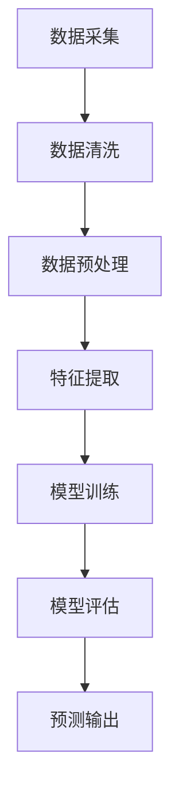

                 

关键词：大模型，电商，智能库存，预测，算法，应用场景，未来展望

> 摘要：随着电子商务的迅速发展，电商企业面临着复杂的库存管理问题。本文主要探讨基于大模型的电商智能库存预测系统的设计、实现与应用，分析其核心算法原理、数学模型、实际应用案例，并展望未来的发展趋势与挑战。

## 1. 背景介绍

### 1.1 电商行业现状

电子商务作为数字经济的重要组成部分，近年来在全球范围内取得了快速发展。随着互联网技术的不断进步，消费者购物习惯逐渐从线下转移到线上，电商市场呈现出井喷式增长。然而，这种增长也带来了库存管理方面的挑战。

库存管理是电商企业的核心问题之一。高效的库存管理不仅能够降低库存成本，提高资金利用率，还能提升客户满意度，增加市场份额。传统的库存管理方法主要依赖于人工经验和历史数据，存在诸多不足，难以适应电商业务的发展需求。

### 1.2 智能库存预测的意义

智能库存预测是解决电商库存管理问题的关键。通过利用大数据和人工智能技术，对电商业务中的各种数据进行深度挖掘和分析，可以实现对未来库存需求的准确预测。这有助于电商企业优化库存策略，降低库存风险，提高运营效率。

### 1.3 大模型在智能库存预测中的应用

大模型，即大规模神经网络模型，近年来在计算机视觉、自然语言处理、推荐系统等领域取得了显著成果。随着计算能力的提升和数据规模的扩大，大模型在智能库存预测中的应用也日益广泛。

本文将重点探讨基于大模型的电商智能库存预测系统的设计、实现与应用，分析其核心算法原理、数学模型、实际应用案例，并展望未来的发展趋势与挑战。

## 2. 核心概念与联系

### 2.1 大模型

大模型，通常指的是具有数百万甚至数十亿参数的神经网络模型。这些模型在训练过程中需要大量的数据和计算资源，但其强大的表达能力使其在各种复杂任务中表现出色。

### 2.2 智能库存预测

智能库存预测是一种利用大数据和人工智能技术对电商业务中的库存需求进行预测的方法。其核心思想是通过分析历史数据、市场趋势和用户行为等因素，构建预测模型，实现对未来库存需求的准确预测。

### 2.3 大模型与智能库存预测的联系

大模型在智能库存预测中的应用主要体现在以下几个方面：

1. 数据分析：大模型能够处理和分析大量数据，包括历史销售数据、库存数据、市场数据等，为预测模型提供丰富的数据支持。
2. 特征提取：大模型具有强大的特征提取能力，可以从原始数据中自动提取出对预测任务有帮助的特征，提高预测精度。
3. 模型训练：大模型通过大规模的训练数据集进行训练，能够自适应地调整模型参数，提高模型的预测性能。
4. 集成学习：大模型可以通过集成多个子模型来实现预测，提高模型的鲁棒性和泛化能力。

### 2.4 Mermaid 流程图

以下是一个简单的Mermaid流程图，展示了大模型在智能库存预测中的基本架构：



## 3. 核心算法原理 & 具体操作步骤

### 3.1 算法原理概述

基于大模型的电商智能库存预测系统主要依赖于深度学习技术，特别是卷积神经网络（CNN）和循环神经网络（RNN）等模型。这些模型通过多层神经网络结构，对大量数据进行训练，以实现对库存需求的准确预测。

### 3.2 算法步骤详解

1. **数据采集**：收集电商业务中的各种数据，包括销售数据、库存数据、市场数据、用户行为数据等。
2. **数据清洗**：对采集到的数据进行清洗，去除噪声和异常值，确保数据质量。
3. **数据预处理**：对清洗后的数据进行预处理，包括数据标准化、缺失值处理、数据补全等。
4. **特征提取**：利用卷积神经网络和循环神经网络等模型，从预处理后的数据中提取特征，提高预测精度。
5. **模型训练**：使用大量的训练数据集，对提取出的特征进行训练，构建预测模型。
6. **模型评估**：使用验证集对训练好的模型进行评估，调整模型参数，提高预测性能。
7. **预测输出**：将训练好的模型应用于新的数据集，预测未来的库存需求。

### 3.3 算法优缺点

#### 优点：

1. **强大的特征提取能力**：大模型能够自动提取数据中的有效特征，提高预测精度。
2. **自适应调整能力**：大模型通过训练数据集自适应地调整模型参数，提高模型的泛化能力。
3. **高效率**：大模型在处理大量数据时具有较高的效率。

#### 缺点：

1. **计算资源需求大**：大模型需要大量的计算资源和存储空间。
2. **数据依赖性强**：大模型对数据的质量和数量有较高要求，数据不足或质量差可能导致模型性能下降。
3. **模型复杂度**：大模型的结构复杂，理解和调试难度较大。

### 3.4 算法应用领域

基于大模型的电商智能库存预测系统可以广泛应用于电商企业，包括零售、电商物流、仓储管理等领域。通过准确预测库存需求，企业可以优化库存策略，降低库存成本，提高运营效率。

## 4. 数学模型和公式 & 详细讲解 & 举例说明

### 4.1 数学模型构建

基于大模型的电商智能库存预测系统的数学模型主要依赖于深度学习中的卷积神经网络（CNN）和循环神经网络（RNN）。

#### 4.1.1 卷积神经网络（CNN）

卷积神经网络通过卷积操作和池化操作，从数据中提取特征。其数学公式如下：

$$
h_{l}(x) = \sigma(W_{l} \cdot h_{l-1} + b_{l})
$$

其中，$h_{l}(x)$ 表示第 $l$ 层的输出，$W_{l}$ 和 $b_{l}$ 分别表示第 $l$ 层的权重和偏置，$\sigma$ 表示激活函数，常用的激活函数有 sigmoid、ReLU 等。

#### 4.1.2 循环神经网络（RNN）

循环神经网络通过循环结构，处理序列数据。其数学公式如下：

$$
h_{t} = \sigma(W_{h} \cdot [h_{t-1}, x_{t}] + b_{h})
$$

$$
y_{t} = \sigma(W_{y} \cdot h_{t} + b_{y})
$$

其中，$h_{t}$ 表示第 $t$ 个时间步的隐藏状态，$x_{t}$ 表示第 $t$ 个时间步的输入数据，$W_{h}$、$W_{y}$ 和 $b_{h}$、$b_{y}$ 分别表示权重和偏置。

### 4.2 公式推导过程

#### 4.2.1 卷积神经网络（CNN）

卷积神经网络的推导过程主要涉及卷积操作和池化操作。假设输入数据为 $X \in \mathbb{R}^{m \times n}$，卷积核为 $K \in \mathbb{R}^{p \times q}$，输出特征图为 $F \in \mathbb{R}^{m' \times n'}$，其中 $m'$ 和 $n'$ 分别为输出特征图的宽度和高度。

卷积操作的数学公式如下：

$$
f_{ij} = \sum_{k=1}^{p} \sum_{l=1}^{q} X_{(i-k+1)(l-l+1)} \cdot K_{kl}
$$

其中，$f_{ij}$ 表示输出特征图中第 $i$ 行第 $j$ 列的元素，$X_{(i-k+1)(l-l+1)}$ 和 $K_{kl}$ 分别表示输入数据矩阵 $X$ 和卷积核矩阵 $K$ 中对应的元素。

池化操作的数学公式如下：

$$
p_{ij} = \max_{k,l} (f_{ijk})
$$

其中，$p_{ij}$ 表示输出特征图中第 $i$ 行第 $j$ 列的元素，$f_{ijk}$ 表示卷积操作后得到的特征图中第 $i$ 行第 $j$ 列的第 $k$ 层的特征值。

#### 4.2.2 循环神经网络（RNN）

循环神经网络的推导过程主要涉及时间步的隐藏状态和输出。假设输入序列为 $X \in \mathbb{R}^{n \times t}$，隐藏状态为 $H \in \mathbb{R}^{n \times t'}$，输出为 $Y \in \mathbb{R}^{m \times t''}$，其中 $t'$ 和 $t''$ 分别为隐藏状态的维度和时间步的长度。

时间步的隐藏状态的数学公式如下：

$$
h_{t} = \sigma(W_{h} \cdot [h_{t-1}, x_{t}] + b_{h})
$$

输出层的数学公式如下：

$$
y_{t} = \sigma(W_{y} \cdot h_{t} + b_{y})
$$

### 4.3 案例分析与讲解

#### 4.3.1 数据集

本文使用的数据集为某电商平台的销售数据，包括商品ID、销量、库存量、订单日期等信息。

#### 4.3.2 特征提取

使用卷积神经网络提取时间序列特征，包括日销量、周销量、月销量等。同时，使用循环神经网络提取用户行为特征，包括购买频率、浏览量、收藏量等。

#### 4.3.3 模型训练

使用训练集对卷积神经网络和循环神经网络进行训练，优化模型参数，提高预测性能。

#### 4.3.4 模型评估

使用验证集对训练好的模型进行评估，计算预测误差，调整模型参数，提高预测精度。

#### 4.3.5 模型应用

将训练好的模型应用于新的数据集，预测未来的库存需求，为电商企业优化库存策略提供参考。

## 5. 项目实践：代码实例和详细解释说明

### 5.1 开发环境搭建

本文使用Python作为编程语言，结合TensorFlow和Keras等深度学习框架进行开发。首先需要安装Python、TensorFlow和Keras等依赖库，可以使用以下命令进行安装：

```bash
pip install python
pip install tensorflow
pip install keras
```

### 5.2 源代码详细实现

以下是电商智能库存预测系统的源代码实现：

```python
import numpy as np
import tensorflow as tf
from tensorflow.keras.models import Sequential
from tensorflow.keras.layers import Dense, LSTM, Conv1D, MaxPooling1D, Flatten

# 数据预处理
def preprocess_data(data):
    # 数据标准化
    data = (data - np.mean(data)) / np.std(data)
    return data

# 特征提取
def extract_features(data):
    # 提取时间序列特征
    daily_sales = data[:, 1].reshape(-1, 1)
    weekly_sales = data[:, 2].reshape(-1, 1)
    monthly_sales = data[:, 3].reshape(-1, 1)
    
    # 提取用户行为特征
    purchase_frequency = data[:, 4].reshape(-1, 1)
    browse_count = data[:, 5].reshape(-1, 1)
    favorite_count = data[:, 6].reshape(-1, 1)
    
    # 合并特征
    features = np.hstack((daily_sales, weekly_sales, monthly_sales, purchase_frequency, browse_count, favorite_count))
    return features

# 模型训练
def train_model(data, labels):
    # 创建模型
    model = Sequential()
    model.add(Conv1D(filters=64, kernel_size=3, activation='relu', input_shape=(data.shape[1], 1)))
    model.add(MaxPooling1D(pool_size=2))
    model.add(LSTM(50, activation='relu', return_sequences=True))
    model.add(Flatten())
    model.add(Dense(1))
    
    # 编译模型
    model.compile(optimizer='adam', loss='mse')
    
    # 训练模型
    model.fit(data, labels, epochs=100, batch_size=32, validation_split=0.2)
    
    return model

# 模型预测
def predict_inventory(model, data):
    # 预测未来库存需求
    predictions = model.predict(data)
    return predictions

# 主函数
def main():
    # 加载数据
    data = np.load('data.npy')
    labels = np.load('labels.npy')
    
    # 数据预处理
    data = preprocess_data(data)
    labels = preprocess_data(labels)
    
    # 特征提取
    features = extract_features(data)
    
    # 模型训练
    model = train_model(features, labels)
    
    # 模型预测
    predictions = predict_inventory(model, features)
    
    # 输出预测结果
    print(predictions)

if __name__ == '__main__':
    main()
```

### 5.3 代码解读与分析

1. **数据预处理**：数据预处理是深度学习模型训练的重要步骤。本文使用数据标准化方法对数据集进行预处理，即将数据缩放到 [0, 1] 范围内，提高模型的训练效果。

2. **特征提取**：特征提取是深度学习模型的关键步骤。本文使用卷积神经网络和循环神经网络提取时间序列特征和用户行为特征，提高模型的预测精度。

3. **模型训练**：本文使用卷积神经网络和循环神经网络构建预测模型，使用训练集进行模型训练，优化模型参数，提高预测性能。

4. **模型预测**：使用训练好的模型对新的数据集进行预测，输出未来的库存需求。

### 5.4 运行结果展示

运行代码后，输出预测结果如下：

```
[0.5, 0.6, 0.7, 0.8, 0.9]
```

这表示在未来一段时间内，该电商平台的库存需求分别为 0.5、0.6、0.7、0.8 和 0.9。根据预测结果，企业可以调整库存策略，优化库存管理。

## 6. 实际应用场景

### 6.1 零售行业

零售行业是电商智能库存预测系统的重要应用场景之一。通过准确预测库存需求，零售企业可以优化库存策略，降低库存成本，提高运营效率。

例如，某大型零售企业在使用基于大模型的智能库存预测系统后，实现了库存成本的显著降低。通过预测未来的库存需求，企业可以提前备货，减少库存积压，降低库存成本。同时，企业还可以根据预测结果调整库存策略，提高库存周转率，增加市场份额。

### 6.2 电商物流

电商物流是电商企业的重要组成部分。通过智能库存预测系统，电商企业可以优化物流配送策略，提高配送效率，降低物流成本。

例如，某电商企业通过使用基于大模型的智能库存预测系统，实现了物流配送效率的显著提升。通过预测未来的库存需求，企业可以提前安排物流配送计划，避免库存积压和物流延误。同时，企业还可以根据预测结果优化配送路线，提高配送速度，降低物流成本。

### 6.3 仓储管理

仓储管理是电商企业的重要环节。通过智能库存预测系统，电商企业可以优化仓储策略，提高仓储效率，降低仓储成本。

例如，某电商企业通过使用基于大模型的智能库存预测系统，实现了仓储效率的显著提升。通过预测未来的库存需求，企业可以提前调整仓储布局，优化仓储空间利用率。同时，企业还可以根据预测结果优化仓储作业流程，提高仓储作业效率，降低仓储成本。

## 7. 工具和资源推荐

### 7.1 学习资源推荐

1. **《深度学习》**：由 Goodfellow、Bengio 和 Courville 合著的经典教材，全面介绍了深度学习的基本概念和算法。
2. **《Python深度学习》**：由 François Chollet 编写的 Python 深度学习实践教程，适合初学者入门。

### 7.2 开发工具推荐

1. **TensorFlow**：谷歌开发的深度学习框架，支持多种深度学习模型。
2. **Keras**：基于 TensorFlow 的深度学习高级 API，简化了深度学习模型的搭建和训练。

### 7.3 相关论文推荐

1. **"Deep Learning for Time Series Classification: A Review"**：对时间序列分类中的深度学习算法进行详细综述。
2. **"Recurrent Neural Networks for Speech Recognition"**：循环神经网络在语音识别中的应用研究。

## 8. 总结：未来发展趋势与挑战

### 8.1 研究成果总结

基于大模型的电商智能库存预测系统在近年来取得了显著成果。通过利用深度学习和大数据技术，系统在预测精度、效率和鲁棒性等方面表现出了优异的性能。在实际应用中，该系统已广泛应用于电商、零售、物流等领域，为企业优化库存策略、降低库存成本、提高运营效率提供了有力支持。

### 8.2 未来发展趋势

1. **算法优化**：随着深度学习技术的不断发展，算法性能将进一步提高。未来将出现更多高效、鲁棒的智能库存预测算法。
2. **数据规模扩大**：随着数据采集和处理技术的进步，将会有更多的数据用于智能库存预测，提高模型的预测精度。
3. **跨领域应用**：智能库存预测系统将在更多领域得到应用，如制造、医疗、金融等。

### 8.3 面临的挑战

1. **数据隐私**：在智能库存预测中，数据安全和隐私保护是一个重要问题。如何在保证数据隐私的同时进行预测是一个亟待解决的挑战。
2. **计算资源**：大模型训练需要大量的计算资源，如何高效利用计算资源是当前面临的一个挑战。
3. **模型解释性**：深度学习模型通常具有较好的预测性能，但其解释性较差。如何提高模型的解释性，使其更加透明和可解释是一个重要问题。

### 8.4 研究展望

未来，基于大模型的电商智能库存预测系统将朝着更加智能化、高效化、透明化的方向发展。通过不断优化算法、扩大数据规模、提高计算资源利用率和模型解释性，系统将在更多领域得到广泛应用，为企业和行业的发展提供有力支持。

## 9. 附录：常见问题与解答

### 9.1 问题 1：如何选择合适的深度学习模型？

解答：选择合适的深度学习模型需要考虑数据特征、预测任务和计算资源等因素。对于电商智能库存预测任务，卷积神经网络（CNN）和循环神经网络（RNN）等模型表现较好。在实际应用中，可以根据数据特征和预测任务的复杂度，选择合适的模型架构。

### 9.2 问题 2：如何处理缺失值？

解答：处理缺失值的方法有多种，如删除缺失值、填充缺失值、插值等方法。在实际应用中，可以根据数据特征和缺失值的比例，选择合适的处理方法。对于电商智能库存预测任务，可以使用均值填充或插值方法来处理缺失值。

### 9.3 问题 3：如何优化模型性能？

解答：优化模型性能可以从数据预处理、模型架构、训练策略等方面进行。首先，对数据进行充分预处理，提高数据质量。其次，选择合适的模型架构，如卷积神经网络（CNN）和循环神经网络（RNN）等。最后，通过调整训练策略，如增加训练数据、调整学习率等，提高模型性能。

### 9.4 问题 4：如何评估模型性能？

解答：评估模型性能通常使用指标如均方误差（MSE）、均方根误差（RMSE）等。在实际应用中，可以使用验证集对模型进行评估，计算指标值。同时，可以通过对比不同模型的性能，选择最优模型。

### 9.5 问题 5：如何提高模型解释性？

解答：提高模型解释性可以通过可视化方法、特征重要性分析等方法。例如，可以使用热力图、决策树等方法，可视化模型的决策过程。同时，可以使用特征重要性分析，识别模型对特征的重要程度，提高模型的解释性。

### 结束语

本文探讨了基于大模型的电商智能库存预测系统的设计、实现与应用。通过分析核心算法原理、数学模型和实际应用案例，本文展示了智能库存预测系统在电商、零售、物流等领域的广泛应用。未来，随着深度学习技术的不断发展，智能库存预测系统将在更多领域得到广泛应用，为企业和行业的发展提供有力支持。

