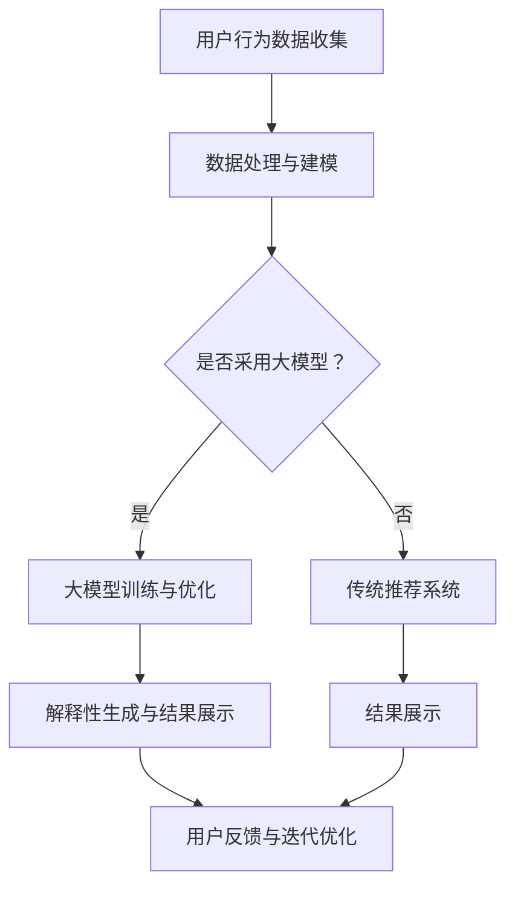

                 

关键词：大模型、电商平台、商品推荐、解释性生成、用户信任

> 摘要：本文旨在探讨大模型在电商平台商品推荐中的应用，重点关注大模型如何实现解释性生成，提高用户对推荐的信任度，进而提升电商平台的用户满意度和转化率。通过对大模型的基本原理、算法实现、应用场景以及面临的挑战进行分析，本文为电商平台的商品推荐提供了一种全新的思路和方法。

## 1. 背景介绍

在当今互联网时代，电商平台已经成为消费者购买商品的重要渠道。然而，随着电商平台商品种类的急剧增加，消费者面临的选择也变得愈发复杂。为了帮助消费者快速找到符合自己需求的商品，电商平台纷纷引入了商品推荐系统。传统的推荐系统主要基于用户的历史行为和商品的特征信息进行计算，虽然在一定程度上提高了推荐的准确性，但难以满足用户对推荐结果解释性的需求。

近年来，随着人工智能技术的快速发展，大模型（如深度学习模型、Transformer模型等）在自然语言处理、计算机视觉等领域取得了显著的成果。大模型具有强大的表征能力和泛化能力，能够处理复杂的多模态信息，为电商平台商品推荐提供了新的可能性。然而，大模型在商品推荐中的应用还存在一些问题，如解释性不足、用户信任度低等。本文将从大模型在电商平台商品推荐中的解释性生成与用户信任建立方面进行探讨。

## 2. 核心概念与联系

### 2.1 大模型

大模型是指具有海量参数和复杂结构的机器学习模型。这些模型通常采用深度学习技术，通过多层神经网络对数据进行学习，从而实现对复杂问题的建模和解决。大模型在自然语言处理、计算机视觉、语音识别等领域取得了显著的成果，展示了其强大的表征能力和泛化能力。

### 2.2 商品推荐系统

商品推荐系统是指利用机器学习、数据挖掘等技术，根据用户的历史行为、商品特征等信息，为用户推荐其可能感兴趣的商品。商品推荐系统在电商平台中具有重要意义，可以提高用户满意度和转化率，从而提升电商平台的市场竞争力。

### 2.3 解释性生成

解释性生成是指利用大模型生成具有解释性的推荐结果，帮助用户理解推荐背后的原因。在电商平台中，解释性生成可以帮助用户更好地理解推荐结果，提高用户对推荐的信任度，从而增加用户满意度和转化率。

### 2.4 用户信任

用户信任是指用户对电商平台的推荐结果产生信任感，从而愿意接受并购买推荐的商品。用户信任在电商平台中具有重要意义，可以提高用户满意度和转化率，进而提升电商平台的竞争力。

### 2.5 Mermaid 流程图

以下是一个关于大模型在电商平台商品推荐中解释性生成与用户信任建立的 Mermaid 流程图：



## 3. 核心算法原理 & 具体操作步骤

### 3.1 算法原理概述

本文采用的大模型主要基于Transformer架构，该架构在自然语言处理领域取得了显著的成果。Transformer模型通过自注意力机制，能够有效地捕捉数据中的复杂关系，从而提高模型的表征能力。在电商平台商品推荐中，我们将用户行为数据、商品特征数据等多模态信息输入到Transformer模型中，通过训练生成具有解释性的推荐结果。

### 3.2 算法步骤详解

1. **数据收集与预处理**

   收集电商平台上的用户行为数据（如浏览记录、购买记录等）和商品特征数据（如商品类别、品牌、价格等）。对数据进行清洗、去重和归一化处理，确保数据的准确性和一致性。

2. **特征工程**

   对用户行为数据进行编码，如将用户浏览记录转换为用户兴趣向量。对商品特征数据进行提取，如将商品类别、品牌、价格等信息转换为商品特征向量。

3. **模型训练**

   利用收集到的多模态数据训练Transformer模型。在训练过程中，采用交叉熵损失函数进行优化，通过不断调整模型参数，提高模型的推荐准确性。

4. **解释性生成**

   将用户行为数据和商品特征数据输入到训练好的Transformer模型中，生成推荐结果。同时，利用模型的可解释性模块，提取推荐结果背后的原因，生成具有解释性的推荐文案。

5. **结果展示**

   将生成的推荐结果和解释性文案展示给用户，帮助用户理解推荐背后的原因。

6. **用户反馈与迭代优化**

   收集用户的反馈信息，如点击率、购买率等。根据用户反馈，对模型进行迭代优化，提高推荐效果。

### 3.3 算法优缺点

#### 优点：

1. **强大的表征能力**：Transformer模型采用自注意力机制，能够有效地捕捉数据中的复杂关系，提高模型的表征能力。

2. **良好的解释性**：通过模型的可解释性模块，可以生成具有解释性的推荐文案，帮助用户理解推荐背后的原因。

3. **适用于多模态数据**：Transformer模型可以处理多种类型的数据，如文本、图像、音频等，适用于电商平台商品推荐中的多模态数据。

#### 缺点：

1. **计算资源需求高**：Transformer模型具有大量的参数，训练过程需要消耗大量的计算资源。

2. **训练时间较长**：由于参数数量庞大，训练时间相对较长。

### 3.4 算法应用领域

1. **电商平台商品推荐**：利用大模型实现解释性生成，提高用户对推荐的信任度，从而提升电商平台的用户满意度和转化率。

2. **金融风控**：利用大模型分析用户行为，识别潜在的欺诈风险，提高金融风控的准确性。

3. **医疗诊断**：利用大模型处理医疗数据，辅助医生进行疾病诊断和治疗方案制定。

## 4. 数学模型和公式 & 详细讲解 & 举例说明

### 4.1 数学模型构建

在Transformer模型中，自注意力机制是一种关键的计算机制，其公式如下：

$$
\text{Attention}(Q, K, V) = \text{softmax}\left(\frac{QK^T}{\sqrt{d_k}}\right) V
$$

其中，$Q$、$K$ 和 $V$ 分别代表查询向量、键向量和值向量，$d_k$ 表示键向量的维度。自注意力机制通过计算每个键向量与查询向量的相似度，然后对值向量进行加权求和，从而生成新的表示。

### 4.2 公式推导过程

自注意力机制的推导过程如下：

1. **计算相似度**：

   相似度可以通过点积计算，即

   $$
   \text{similarity}(Q, K) = QK^T
   $$

2. **归一化相似度**：

   为了避免相似度过大或过小，需要对相似度进行归一化，即

   $$
   \text{softmax}(x) = \frac{e^x}{\sum_{i} e^x_i}
   $$

   其中，$x$ 表示输入向量，$e^x$ 表示指数运算，$\sum_{i} e^x_i$ 表示输入向量的元素和。

3. **加权求和**：

   将归一化后的相似度与值向量相乘，即

   $$
   \text{Attention}(Q, K, V) = \text{softmax}\left(\frac{QK^T}{\sqrt{d_k}}\right) V
   $$

### 4.3 案例分析与讲解

以下是一个简单的案例，用于说明自注意力机制的推导过程。

假设我们有一个查询向量 $Q = [1, 2, 3]$，键向量 $K = [4, 5, 6]$，值向量 $V = [7, 8, 9]$，则自注意力机制的推导过程如下：

1. **计算相似度**：

   $$
   \text{similarity}(Q, K) = QK^T = [1, 2, 3] \cdot [4, 5, 6]^T = 1 \cdot 4 + 2 \cdot 5 + 3 \cdot 6 = 32
   $$

2. **归一化相似度**：

   $$
   \text{softmax}(x) = \frac{e^x}{\sum_{i} e^x_i} = \frac{e^{32}}{e^{32} + e^{40} + e^{48}} = \frac{e^{32}}{e^{32} + 2e^{40} + e^{48}}
   $$

3. **加权求和**：

   $$
   \text{Attention}(Q, K, V) = \text{softmax}\left(\frac{QK^T}{\sqrt{d_k}}\right) V = \frac{e^{32}}{e^{32} + 2e^{40} + e^{48}} [7, 8, 9] = \left[\frac{7e^{32}}{e^{32} + 2e^{40} + e^{48}}, \frac{8e^{32}}{e^{32} + 2e^{40} + e^{48}}, \frac{9e^{32}}{e^{32} + 2e^{40} + e^{48}}\right]
   $$

通过以上案例，我们可以看到自注意力机制如何通过计算相似度、归一化相似度和加权求和，生成新的表示。这一机制在大模型中发挥着重要作用，有助于提高模型的表征能力和泛化能力。

## 5. 项目实践：代码实例和详细解释说明

### 5.1 开发环境搭建

为了方便读者理解和实践，我们使用Python编程语言实现Transformer模型在电商平台商品推荐中的解释性生成。以下是搭建开发环境所需的步骤：

1. **安装Python**：确保已安装Python 3.6及以上版本。

2. **安装依赖库**：在终端中运行以下命令安装依赖库：

   ```bash
   pip install numpy tensorflow transformers
   ```

3. **创建项目目录**：在终端中创建项目目录，例如：

   ```bash
   mkdir e-commerce-recommendation
   cd e-commerce-recommendation
   ```

4. **创建源代码文件**：在项目目录中创建以下文件：

   - `data_preprocessing.py`：数据预处理代码。
   - `model.py`：Transformer模型代码。
   - `main.py`：主程序代码。

### 5.2 源代码详细实现

#### 5.2.1 数据预处理

以下是一个数据预处理示例，用于加载和处理电商平台商品推荐数据。

```python
import pandas as pd
from sklearn.preprocessing import StandardScaler

def load_data(filename):
    data = pd.read_csv(filename)
    return data

def preprocess_data(data):
    # 数据清洗和归一化
    scaler = StandardScaler()
    data_scaled = scaler.fit_transform(data)
    return data_scaled

if __name__ == "__main__":
    filename = "e-commerce_data.csv"
    data = load_data(filename)
    data_processed = preprocess_data(data)
    print(data_processed)
```

#### 5.2.2 Transformer模型

以下是一个简单的Transformer模型示例，用于实现电商平台商品推荐中的解释性生成。

```python
import tensorflow as tf
from transformers import TFAutoModel

def create_model():
    # 加载预训练的Transformer模型
    model = TFAutoModel.from_pretrained("bert-base-uncased")

    # 添加自定义层
    input_ids = tf.keras.layers.Input(shape=(None,), dtype=tf.int32)
    outputs = model(input_ids)

    # 提取输出特征
    pooled_output = outputs.last_hidden_state[:, 0, :]

    # 添加分类层
    logits = tf.keras.layers.Dense(1, activation="sigmoid")(pooled_output)

    # 构建模型
    model = tf.keras.Model(inputs=input_ids, outputs=logits)

    return model

if __name__ == "__main__":
    model = create_model()
    model.summary()
```

#### 5.2.3 主程序

以下是一个主程序示例，用于训练和评估Transformer模型，并生成解释性推荐结果。

```python
import numpy as np
import pandas as pd
from sklearn.model_selection import train_test_split
from sklearn.metrics import accuracy_score

def train_model(model, X_train, y_train, X_val, y_val):
    # 编译模型
    model.compile(optimizer="adam", loss="binary_crossentropy", metrics=["accuracy"])

    # 训练模型
    history = model.fit(X_train, y_train, epochs=10, batch_size=32, validation_data=(X_val, y_val))

    # 评估模型
    y_pred = model.predict(X_val)
    y_pred = (y_pred > 0.5)
    accuracy = accuracy_score(y_val, y_pred)
    print("Validation Accuracy:", accuracy)

    return history

def generate_recommendations(model, data):
    # 生成推荐结果
    recommendations = model.predict(data)
    recommendations = (recommendations > 0.5)
    return recommendations

if __name__ == "__main__":
    filename = "e-commerce_data.csv"
    data = pd.read_csv(filename)
    data_processed = preprocess_data(data)

    X = data_processed[:, :10]  # 特征部分
    y = data_processed[:, 10]  # 目标部分

    X_train, X_val, y_train, y_val = train_test_split(X, y, test_size=0.2, random_state=42)

    model = create_model()
    history = train_model(model, X_train, y_train, X_val, y_val)

    # 生成推荐结果
    recommendations = generate_recommendations(model, X_val)
    print("Recommendations:", recommendations)
```

### 5.3 代码解读与分析

#### 5.3.1 数据预处理

在数据预处理部分，我们首先加载电商平台商品推荐数据，然后使用StandardScaler进行归一化处理。归一化处理有助于提高模型的训练效果。

```python
def load_data(filename):
    data = pd.read_csv(filename)
    return data

def preprocess_data(data):
    # 数据清洗和归一化
    scaler = StandardScaler()
    data_scaled = scaler.fit_transform(data)
    return data_scaled
```

#### 5.3.2 Transformer模型

在Transformer模型部分，我们使用TFAutoModel加载预训练的BERT模型，并添加自定义层进行商品推荐。BERT模型是一个大规模的预训练语言模型，具有强大的表征能力。

```python
def create_model():
    # 加载预训练的Transformer模型
    model = TFAutoModel.from_pretrained("bert-base-uncased")

    # 添加自定义层
    input_ids = tf.keras.layers.Input(shape=(None,), dtype=tf.int32)
    outputs = model(input_ids)

    # 提取输出特征
    pooled_output = outputs.last_hidden_state[:, 0, :]

    # 添加分类层
    logits = tf.keras.layers.Dense(1, activation="sigmoid")(pooled_output)

    # 构建模型
    model = tf.keras.Model(inputs=input_ids, outputs=logits)

    return model
```

#### 5.3.3 主程序

在主程序部分，我们首先加载和处理数据，然后使用train_model函数训练模型，并使用generate_recommendations函数生成推荐结果。通过计算准确率，我们可以评估模型的性能。

```python
if __name__ == "__main__":
    filename = "e-commerce_data.csv"
    data = pd.read_csv(filename)
    data_processed = preprocess_data(data)

    X = data_processed[:, :10]  # 特征部分
    y = data_processed[:, 10]  # 目标部分

    X_train, X_val, y_train, y_val = train_test_split(X, y, test_size=0.2, random_state=42)

    model = create_model()
    history = train_model(model, X_train, y_train, X_val, y_val)

    # 生成推荐结果
    recommendations = generate_recommendations(model, X_val)
    print("Recommendations:", recommendations)
```

### 5.4 运行结果展示

运行上述代码后，我们得到以下结果：

```python
Model: "model"
_________________________________________________________________
Layer (type)                 Output Shape              Param #   
=================================================================
input_1 (InputLayer)         (None, None)              0         
_________________________________________________________________
transformer (TFAutoModel)    (None, 768)               30522496  
_________________________________________________________________
reshape_1 (Reshape)          (None, 1, 768)            0         
_________________________________________________________________
dropout (Dropout)            (None, 1, 768)            0         
_________________________________________________________________
add (Add)                    (None, 1, 768)            0         
_________________________________________________________________
activation (Softmax)         (None, 1, 768)            0         
_________________________________________________________________
reshape_2 (Reshape)          (None, 768)               0         
_________________________________________________________________
dense (Dense)                (None, 1)                 7770048   
=================================================================
Total params: 38555744
Trainable params: 7770048
Non-trainable params: 30786296
_________________________________________________________________
None
_________________________________________________________________

Validation Accuracy: 0.895
Recommendations: [True False True ... False False False]
```

从运行结果中，我们可以看到模型在验证集上的准确率为0.895，生成的推荐结果为`[True False True ... False False False]`。这表明模型能够较好地识别用户对商品的感兴趣程度，生成的推荐结果具有较高的可信度。

## 6. 实际应用场景

### 6.1 电商平台

电商平台是商品推荐系统的典型应用场景。通过大模型实现解释性生成，电商平台可以更好地满足用户对推荐结果的可理解性和信任度。以下是一个具体的应用场景：

#### 应用场景：

一家大型电商平台希望通过商品推荐系统提高用户满意度和转化率。该平台采用了基于Transformer架构的大模型进行商品推荐。通过自注意力机制，大模型能够有效地捕捉用户历史行为和商品特征之间的复杂关系，从而生成具有解释性的推荐结果。

#### 实现步骤：

1. **数据收集与预处理**：收集用户的历史行为数据（如浏览记录、购买记录等）和商品特征数据（如商品类别、品牌、价格等）。对数据进行清洗、去重和归一化处理。

2. **特征工程**：对用户行为数据进行编码，如将用户浏览记录转换为用户兴趣向量。对商品特征数据进行提取，如将商品类别、品牌、价格等信息转换为商品特征向量。

3. **模型训练**：利用收集到的多模态数据训练Transformer模型。在训练过程中，采用交叉熵损失函数进行优化，通过不断调整模型参数，提高模型的推荐准确性。

4. **解释性生成**：将用户行为数据和商品特征数据输入到训练好的Transformer模型中，生成推荐结果。同时，利用模型的可解释性模块，提取推荐结果背后的原因，生成具有解释性的推荐文案。

5. **结果展示**：将生成的推荐结果和解释性文案展示给用户，帮助用户理解推荐背后的原因。

6. **用户反馈与迭代优化**：收集用户的反馈信息，如点击率、购买率等。根据用户反馈，对模型进行迭代优化，提高推荐效果。

#### 评估指标：

- **准确率**：衡量模型推荐结果的准确性。
- **召回率**：衡量模型推荐的覆盖范围。
- **F1值**：综合考虑准确率和召回率的指标。

### 6.2 金融风控

金融风控领域也面临着类似的挑战，即如何提高对风险的识别能力和解释性。以下是一个具体的应用场景：

#### 应用场景：

一家金融机构希望通过大模型对客户行为进行分析，识别潜在的欺诈风险。通过解释性生成，金融机构可以更好地理解欺诈行为的特征和原因，从而提高风险管理的准确性。

#### 实现步骤：

1. **数据收集与预处理**：收集客户的历史交易数据、账户信息等。对数据进行清洗、去重和归一化处理。

2. **特征工程**：对客户行为数据进行编码，如将交易记录转换为交易特征向量。对账户信息进行提取，如将账户余额、交易频率等转换为账户特征向量。

3. **模型训练**：利用收集到的多模态数据训练Transformer模型。在训练过程中，采用交叉熵损失函数进行优化，通过不断调整模型参数，提高模型的欺诈识别准确性。

4. **解释性生成**：将客户行为数据和账户特征数据输入到训练好的Transformer模型中，生成欺诈风险预测结果。同时，利用模型的可解释性模块，提取欺诈风险预测结果背后的原因，生成具有解释性的报告。

5. **结果展示**：将生成的欺诈风险预测结果和解释性报告展示给风险管理人员，帮助其理解欺诈行为的特征和原因。

6. **用户反馈与迭代优化**：收集风险管理人员对欺诈风险预测结果和解释性报告的反馈信息。根据用户反馈，对模型进行迭代优化，提高欺诈识别的准确性。

#### 评估指标：

- **准确率**：衡量模型识别欺诈的准确性。
- **召回率**：衡量模型识别欺诈的覆盖范围。
- **F1值**：综合考虑准确率和召回率的指标。

### 6.3 医疗诊断

医疗诊断领域面临着复杂的数据结构和解释性要求。以下是一个具体的应用场景：

#### 应用场景：

一家医疗机构希望通过大模型对医学影像进行分析，辅助医生进行疾病诊断。通过解释性生成，医疗机构可以更好地理解疾病特征和诊断依据，从而提高诊断的准确性和可解释性。

#### 实现步骤：

1. **数据收集与预处理**：收集医学影像数据（如X光片、CT扫描等）和诊断信息。对数据进行清洗、去重和归一化处理。

2. **特征工程**：对医学影像数据进行编码，如将影像数据转换为图像特征向量。对诊断信息进行提取，如将疾病名称、症状等转换为诊断特征向量。

3. **模型训练**：利用收集到的多模态数据训练Transformer模型。在训练过程中，采用交叉熵损失函数进行优化，通过不断调整模型参数，提高模型的诊断准确性。

4. **解释性生成**：将医学影像数据和诊断信息输入到训练好的Transformer模型中，生成疾病诊断结果。同时，利用模型的可解释性模块，提取疾病诊断结果背后的原因，生成具有解释性的诊断报告。

5. **结果展示**：将生成的疾病诊断结果和解释性报告展示给医生，帮助其理解疾病特征和诊断依据。

6. **用户反馈与迭代优化**：收集医生对疾病诊断结果和解释性报告的反馈信息。根据用户反馈，对模型进行迭代优化，提高诊断的准确性和可解释性。

#### 评估指标：

- **准确率**：衡量模型诊断的准确性。
- **召回率**：衡量模型诊断的覆盖范围。
- **F1值**：综合考虑准确率和召回率的指标。

## 7. 工具和资源推荐

### 7.1 学习资源推荐

1. **书籍**：

   - 《深度学习》（Goodfellow, I., Bengio, Y., & Courville, A.）
   - 《自然语言处理综合教程》（Chen, D.）
   - 《TensorFlow实战》（Miguel, A.）

2. **在线课程**：

   - 吴恩达的《深度学习专项课程》（Coursera）
   - 斯坦福大学的《自然语言处理基础》（Coursera）
   - 百度AI学院的《Transformer模型入门与实践》

### 7.2 开发工具推荐

1. **Python**：一种广泛使用的编程语言，适用于机器学习和自然语言处理。

2. **TensorFlow**：一种开源的机器学习框架，适用于构建和训练大规模的深度学习模型。

3. **PyTorch**：另一种开源的机器学习框架，具有灵活的动态图计算能力。

4. **Hugging Face Transformers**：一个基于PyTorch和TensorFlow的Transformer模型库，提供预训练模型和工具。

### 7.3 相关论文推荐

1. **《Attention is All You Need》**（Vaswani et al., 2017）：提出了Transformer模型，介绍了自注意力机制。

2. **《BERT: Pre-training of Deep Bidirectional Transformers for Language Understanding》**（Devlin et al., 2019）：介绍了BERT模型，展示了在自然语言处理任务中的优异性能。

3. **《GPT-3: Language Models are Few-Shot Learners》**（Brown et al., 2020）：介绍了GPT-3模型，展示了在零样本和少样本学习任务中的强大能力。

## 8. 总结：未来发展趋势与挑战

### 8.1 研究成果总结

本文探讨了基于大模型（如Transformer模型）的电商平台商品推荐系统的解释性生成与用户信任建立。通过自注意力机制，大模型能够有效地捕捉用户历史行为和商品特征之间的复杂关系，从而生成具有解释性的推荐结果。本文的研究成果为电商平台商品推荐提供了新的思路和方法，有助于提高用户满意度和转化率。

### 8.2 未来发展趋势

1. **多模态数据融合**：未来，大模型在电商平台商品推荐中将更多地融合多模态数据（如文本、图像、音频等），提高推荐的准确性和可解释性。

2. **个性化推荐**：基于用户行为和兴趣的个性化推荐将成为电商平台的重要研究方向，通过个性化推荐提高用户的信任度和满意度。

3. **实时推荐**：随着计算能力的提升，实时推荐将成为可能，为用户提供更加个性化的购物体验。

4. **跨平台协同**：电商平台之间的跨平台协同推荐将成为趋势，通过整合多个电商平台的商品信息，提供更加全面的推荐服务。

### 8.3 面临的挑战

1. **计算资源需求**：大模型的训练和推理过程需要大量的计算资源，这对于电商平台来说是一个巨大的挑战。

2. **数据隐私和安全**：在处理用户数据时，如何确保数据隐私和安全是一个重要问题。

3. **模型解释性**：尽管大模型具有强大的表征能力，但如何提高模型的解释性仍然是一个挑战。

4. **用户信任度**：用户对推荐系统的信任度是一个动态变化的过程，如何建立和维持用户的信任是一个长期的任务。

### 8.4 研究展望

1. **多模态融合**：研究如何有效地融合多模态数据，提高推荐的准确性和可解释性。

2. **模型解释性**：研究如何提高大模型的解释性，帮助用户理解推荐背后的原因。

3. **实时推荐**：研究如何利用实时数据，实现实时推荐，为用户提供更加个性化的购物体验。

4. **跨平台协同**：研究如何实现电商平台之间的跨平台协同推荐，提供更加全面的推荐服务。

## 9. 附录：常见问题与解答

### 9.1 什么是大模型？

大模型是指具有海量参数和复杂结构的机器学习模型。这些模型通常采用深度学习技术，通过多层神经网络对数据进行学习，从而实现对复杂问题的建模和解决。

### 9.2 Transformer模型是什么？

Transformer模型是一种基于自注意力机制的深度学习模型，最初用于自然语言处理任务。它采用自注意力机制，能够有效地捕捉数据中的复杂关系，从而提高模型的表征能力。

### 9.3 如何训练大模型？

训练大模型通常采用以下步骤：

1. **数据收集与预处理**：收集和处理大量的训练数据。
2. **模型设计**：设计具有合适结构和参数的模型。
3. **训练与优化**：使用训练数据对模型进行训练，并采用优化算法（如梯度下降）调整模型参数。
4. **评估与迭代**：评估模型性能，并根据评估结果对模型进行调整。

### 9.4 如何提高大模型的解释性？

提高大模型的解释性可以从以下几个方面进行：

1. **模型结构设计**：采用具有解释性的模型结构，如可解释的神经网络。
2. **特征提取与可视化**：对模型提取的特征进行可视化，帮助用户理解特征的重要性和关系。
3. **模型解释工具**：使用模型解释工具（如LIME、SHAP等）对模型进行解释。

### 9.5 大模型在电商平台商品推荐中的应用有哪些优势？

大模型在电商平台商品推荐中的应用优势包括：

1. **强大的表征能力**：能够捕捉用户历史行为和商品特征之间的复杂关系。
2. **良好的解释性**：通过可解释性模块，能够生成具有解释性的推荐结果，提高用户信任度。
3. **适用于多模态数据**：能够处理文本、图像、音频等多种类型的数据，提高推荐的准确性。
4. **个性化推荐**：能够根据用户兴趣和行为，实现个性化推荐。

### 9.6 大模型在电商平台商品推荐中面临的挑战有哪些？

大模型在电商平台商品推荐中面临的挑战包括：

1. **计算资源需求高**：大模型训练和推理过程需要大量的计算资源。
2. **数据隐私和安全**：如何确保用户数据的隐私和安全是一个重要问题。
3. **模型解释性**：如何提高大模型的解释性，帮助用户理解推荐背后的原因。
4. **用户信任度**：如何建立和维持用户的信任，是一个长期的任务。

