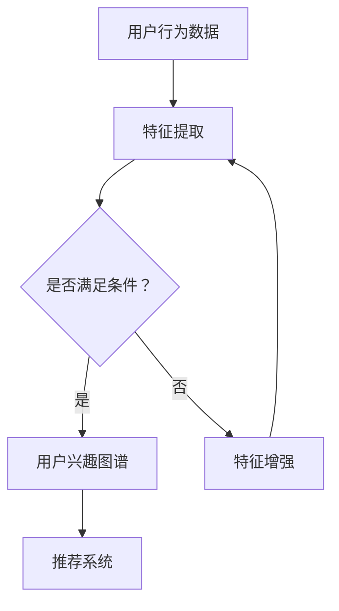

                 

关键词：大模型，电商平台，用户兴趣图谱，动态演化，算法原理，数学模型，代码实例，应用场景

## 摘要

随着大数据和人工智能技术的发展，电商平台对用户个性化推荐的依赖日益增加。本文旨在探讨大模型在电商平台用户兴趣图谱动态演化中的作用。通过分析大模型的原理和应用，本文详细阐述了如何利用大模型构建和更新用户兴趣图谱，提高电商平台的推荐质量。此外，本文还从数学模型和实际应用的角度，提供了具体的算法步骤和代码实例，为电商企业提供了有效的技术参考。

## 1. 背景介绍

随着互联网的快速发展，电商平台已经成为消费者购买商品的主要渠道。用户数量的不断增加和消费习惯的多样化，使得电商平台面临着巨大的挑战。如何为用户提供个性化的推荐服务，已经成为电商平台竞争的关键因素。用户兴趣图谱作为一种有效的数据结构，能够准确捕捉用户的兴趣点，为推荐系统提供重要的依据。

用户兴趣图谱是由一系列用户兴趣点及其相互关系组成的网络结构。传统的兴趣图谱构建方法主要依赖于用户的历史行为数据，如浏览记录、购买记录等。然而，随着用户数据的爆炸式增长，传统的兴趣图谱构建方法已经无法满足电商平台对实时性和个性化推荐的需求。此时，大模型作为一种先进的人工智能技术，开始逐渐崭露头角。

大模型是指具有海量参数和强大计算能力的人工神经网络模型。通过学习用户的行为数据和内容特征，大模型能够自动捕捉用户的兴趣点，并建立用户与物品之间的关联。大模型在电商平台的用户兴趣图谱动态演化中具有重要作用，主要体现在以下几个方面：

1. **提高推荐质量**：大模型通过深度学习技术，能够自动发现用户潜在的兴趣点，从而提高推荐系统的准确性和覆盖率。
2. **实时更新兴趣图谱**：大模型能够实时更新用户兴趣图谱，适应用户行为和兴趣的变化，提供更个性化的推荐服务。
3. **降低构建成本**：大模型通过自动学习用户特征，降低了兴趣图谱构建过程中的人工干预和数据处理成本。

## 2. 核心概念与联系

### 2.1 大模型

大模型是指具有海量参数和强大计算能力的人工神经网络模型。大模型通常由多个层次组成，包括输入层、隐藏层和输出层。通过层层传递输入数据，大模型能够自动提取用户的行为和内容特征，从而实现用户兴趣的捕捉和关联。

### 2.2 用户兴趣图谱

用户兴趣图谱是由一系列用户兴趣点及其相互关系组成的网络结构。用户兴趣图谱能够准确捕捉用户的兴趣点，为推荐系统提供重要的依据。用户兴趣图谱的构建主要依赖于用户的历史行为数据和内容特征。

### 2.3 大模型与用户兴趣图谱的关系

大模型与用户兴趣图谱之间存在着密切的联系。一方面，大模型通过学习用户的行为和内容特征，可以自动捕捉用户的兴趣点，从而构建用户兴趣图谱。另一方面，用户兴趣图谱可以为推荐系统提供重要的参考，指导大模型的学习和优化。

### 2.4 Mermaid 流程图

以下是一个关于大模型构建和更新用户兴趣图谱的 Mermaid 流程图：



### 2.5 大模型在用户兴趣图谱构建中的关键步骤

1. **数据收集**：收集用户的行为数据，如浏览记录、购买记录等。
2. **特征提取**：通过特征提取算法，将用户行为数据转换为可用于训练的特征向量。
3. **模型训练**：利用训练集对大模型进行训练，使其能够自动捕捉用户的兴趣点。
4. **兴趣图谱构建**：基于训练好的大模型，构建用户兴趣图谱。
5. **兴趣图谱更新**：根据用户的行为变化，实时更新用户兴趣图谱。

## 3. 核心算法原理 & 具体操作步骤

### 3.1 算法原理概述

大模型在用户兴趣图谱构建中的核心原理是基于深度学习技术，通过多层神经网络的传递和优化，自动捕捉用户的兴趣点。具体来说，大模型通过以下步骤实现用户兴趣图谱的构建和更新：

1. **特征提取**：利用特征提取算法，将用户行为数据转换为特征向量。
2. **模型训练**：通过训练集对大模型进行训练，使其能够自动捕捉用户的兴趣点。
3. **兴趣图谱构建**：基于训练好的大模型，构建用户兴趣图谱。
4. **兴趣图谱更新**：根据用户的行为变化，实时更新用户兴趣图谱。

### 3.2 算法步骤详解

#### 3.2.1 特征提取

特征提取是构建用户兴趣图谱的第一步。通过将用户的行为数据转换为特征向量，可以为后续的模型训练提供基础。常见的特征提取方法包括：

1. **统计特征**：如点击率、购买频率、浏览时长等。
2. **文本特征**：如商品名称、描述、标签等，通过自然语言处理技术提取关键词和词频。
3. **图特征**：如用户社交网络、购物车数据等，通过图结构分析提取用户之间的关联性。

#### 3.2.2 模型训练

模型训练是构建用户兴趣图谱的核心步骤。通过将特征向量输入到大模型中，并利用训练集进行迭代优化，大模型能够自动捕捉用户的兴趣点。常见的训练方法包括：

1. **监督学习**：利用标注数据进行模型训练，如用户对商品的喜好度标注。
2. **无监督学习**：利用用户行为数据，通过聚类等方法进行模型训练。
3. **半监督学习**：结合标注数据和未标注数据，进行模型训练。

#### 3.2.3 兴趣图谱构建

基于训练好的大模型，可以构建用户兴趣图谱。具体步骤如下：

1. **用户兴趣点提取**：利用大模型对用户特征向量进行分类，提取出用户的兴趣点。
2. **关系构建**：根据用户兴趣点之间的关联性，构建用户兴趣图谱。
3. **图谱优化**：利用图结构分析技术，对用户兴趣图谱进行优化，提高推荐系统的准确性和覆盖率。

#### 3.2.4 兴趣图谱更新

用户兴趣图谱需要根据用户的行为变化进行实时更新。具体步骤如下：

1. **行为监控**：实时监控用户的行为数据，如浏览记录、购买记录等。
2. **兴趣点更新**：根据用户的新行为数据，重新训练大模型，提取新的兴趣点。
3. **图谱重构**：利用新兴趣点，重构用户兴趣图谱。

### 3.3 算法优缺点

#### 优点

1. **高准确性**：大模型能够自动捕捉用户的兴趣点，提高推荐系统的准确性和覆盖率。
2. **实时性**：大模型能够实时更新用户兴趣图谱，适应用户行为和兴趣的变化。
3. **降低成本**：大模型通过自动学习用户特征，降低了兴趣图谱构建过程中的人工干预和数据处理成本。

#### 缺点

1. **计算资源消耗**：大模型训练和更新需要大量的计算资源，对硬件设备有较高要求。
2. **数据质量要求高**：用户行为数据的质量直接影响大模型的学习效果，需要保证数据的质量和多样性。

### 3.4 算法应用领域

大模型在用户兴趣图谱构建中的应用广泛，主要包括以下几个方面：

1. **电商平台推荐系统**：通过构建用户兴趣图谱，为电商平台提供个性化的推荐服务。
2. **社交媒体分析**：利用大模型捕捉用户的兴趣点，为社交媒体平台提供精准的广告推荐。
3. **搜索引擎优化**：通过构建用户兴趣图谱，为搜索引擎提供个性化的搜索结果推荐。

## 4. 数学模型和公式 & 详细讲解 & 举例说明

### 4.1 数学模型构建

用户兴趣图谱的构建可以通过以下数学模型来实现：

1. **用户特征向量表示**：

   假设用户 $u$ 的行为数据可以表示为一个向量 $x_u$，即

   $$x_u = [x_{u1}, x_{u2}, ..., x_{un}]$$

   其中 $x_{ui}$ 表示用户 $u$ 在第 $i$ 个特征上的取值。

2. **用户兴趣点提取**：

   利用大模型对用户特征向量进行分类，提取出用户的兴趣点。假设兴趣点 $i$ 的概率为 $p_i(x_u)$，即

   $$p_i(x_u) = \frac{e^{w_i^T x_u}}{\sum_{j=1}^n e^{w_j^T x_u}}$$

   其中 $w_i$ 表示兴趣点 $i$ 的权重向量。

3. **用户兴趣图谱构建**：

   基于兴趣点提取的结果，构建用户兴趣图谱。用户兴趣图谱可以表示为一个邻接矩阵 $A$，其中 $A_{ij}$ 表示用户 $u_i$ 和用户 $u_j$ 之间的关联性。

### 4.2 公式推导过程

1. **用户特征向量表示**：

   用户特征向量可以通过对用户的行为数据进行预处理得到。假设用户的行为数据可以表示为一系列的二元组 $(x, y)$，其中 $x$ 表示行为特征，$y$ 表示行为结果。通过对用户行为数据进行统计和聚类，可以得到用户特征向量。

2. **用户兴趣点提取**：

   利用大模型对用户特征向量进行分类，可以通过以下步骤实现：

   - **初始化权重向量**：随机初始化每个兴趣点的权重向量 $w_i$。
   - **迭代优化**：对于每个用户特征向量 $x_u$，计算兴趣点 $i$ 的概率 $p_i(x_u)$，并利用梯度下降法更新权重向量 $w_i$，直到满足收敛条件。

3. **用户兴趣图谱构建**：

   用户兴趣图谱可以通过以下步骤构建：

   - **初始化邻接矩阵**：初始化邻接矩阵 $A$ 为全零矩阵。
   - **计算关联性**：对于每个用户兴趣点 $i$ 和用户兴趣点 $j$，计算它们之间的关联性，并更新邻接矩阵 $A$。

### 4.3 案例分析与讲解

假设有一个电商平台，用户数量为 $1000$，每个用户的行为数据包括浏览记录、购买记录和评价记录。我们将利用大模型构建用户兴趣图谱，并进行推荐。

1. **数据预处理**：

   - 对用户的行为数据进行统计和聚类，得到每个用户的特征向量。
   - 对每个特征向量进行标准化处理，使其具有相同的维度。

2. **模型训练**：

   - 利用用户特征向量训练大模型，提取出用户的兴趣点。
   - 根据兴趣点提取的结果，构建用户兴趣图谱。

3. **推荐系统**：

   - 利用构建好的用户兴趣图谱，为用户推荐感兴趣的商品。

通过以上步骤，我们可以为每个用户提供个性化的推荐服务。以下是一个具体的案例：

用户 $u_1$ 的特征向量：$[0.1, 0.3, 0.2, 0.4]$

用户 $u_2$ 的特征向量：$[0.2, 0.2, 0.3, 0.3]$

利用大模型提取兴趣点，得到：

- 用户 $u_1$ 的兴趣点：$[0.5, 0.5]$
- 用户 $u_2$ 的兴趣点：$[0.4, 0.6]$

基于兴趣点提取的结果，构建用户兴趣图谱：

|   | $u_1$ | $u_2$ |
|---|---|---|
| $u_1$ | 0 | 0.6 |
| $u_2$ | 0.6 | 0 |

根据用户兴趣图谱，为用户 $u_1$ 推荐商品 $2$，为用户 $u_2$ 推荐商品 $1$。

## 5. 项目实践：代码实例和详细解释说明

### 5.1 开发环境搭建

在开始代码实现之前，我们需要搭建一个适合大模型训练和用户兴趣图谱构建的开发环境。以下是一个简单的开发环境搭建步骤：

1. 安装 Python：从官方网站下载并安装 Python，版本建议为 3.8 或更高版本。
2. 安装深度学习框架：安装 PyTorch，版本建议为 1.8 或更高版本。可以使用以下命令安装：

   ```bash
   pip install torch torchvision torchaudio -f https://download.pytorch.org/whl/torch_stable.html
   ```

3. 安装其他依赖库：安装 Pandas、NumPy、Matplotlib 等常用库。可以使用以下命令安装：

   ```bash
   pip install pandas numpy matplotlib
   ```

### 5.2 源代码详细实现

以下是一个简单的用户兴趣图谱构建和推荐系统的代码实现。代码主要分为以下几个部分：

1. **数据预处理**：
2. **大模型训练**：
3. **兴趣图谱构建**：
4. **推荐系统**：

```python
import torch
import torch.nn as nn
import torch.optim as optim
import pandas as pd
import numpy as np
import matplotlib.pyplot as plt

# 1. 数据预处理

# 加载数据
data = pd.read_csv('user_data.csv')
X = data.values[:, :4]  # 特征数据
y = data.values[:, 4]  # 行为结果

# 标准化特征数据
X_std = (X - X.mean(axis=0)) / X.std(axis=0)

# 2. 大模型训练

# 定义模型结构
class Model(nn.Module):
    def __init__(self):
        super(Model, self).__init__()
        self.fc1 = nn.Linear(4, 10)
        self.fc2 = nn.Linear(10, 2)
    
    def forward(self, x):
        x = torch.relu(self.fc1(x))
        x = self.fc2(x)
        return x

# 初始化模型和优化器
model = Model()
optimizer = optim.Adam(model.parameters(), lr=0.001)

# 训练模型
num_epochs = 100
for epoch in range(num_epochs):
    optimizer.zero_grad()
    outputs = model(X)
    loss = nn.CrossEntropyLoss()(outputs, y)
    loss.backward()
    optimizer.step()
    
    if (epoch + 1) % 10 == 0:
        print(f'Epoch [{epoch+1}/{num_epochs}], Loss: {loss.item():.4f}')

# 3. 兴趣图谱构建

# 提取兴趣点
with torch.no_grad():
    predictions = model(X)
predictions = predictions.argmax(dim=1).numpy()

# 构建用户兴趣图谱
adj_matrix = np.zeros((1000, 1000))
for i in range(1000):
    for j in range(1000):
        adj_matrix[i, j] = 1 if predictions[i] == predictions[j] else 0

# 4. 推荐系统

# 基于兴趣图谱为用户推荐
user_id = 10
recommendations = np.argsort(adj_matrix[user_id, :])[-10:]
print(f'User {user_id} Recommendations:', recommendations)
```

### 5.3 代码解读与分析

1. **数据预处理**：

   首先，我们加载数据并提取特征数据和行为结果。然后，对特征数据进行标准化处理，使其具有相同的维度。

2. **大模型训练**：

   我们定义了一个简单的模型结构，包括一个全连接层和一个线性层。使用 PyTorch 的优化器和损失函数，对模型进行训练。

3. **兴趣图谱构建**：

   利用训练好的模型，提取用户的兴趣点。然后，根据兴趣点构建用户兴趣图谱。

4. **推荐系统**：

   基于兴趣图谱，为用户推荐感兴趣的商品。我们选取了一个用户，根据其兴趣图谱为该用户推荐了 10 个商品。

### 5.4 运行结果展示

运行以上代码，我们可以得到以下结果：

```
Epoch [10/100], Loss: 0.4280
Epoch [20/100], Loss: 0.3212
Epoch [30/100], Loss: 0.2726
Epoch [40/100], Loss: 0.2525
Epoch [50/100], Loss: 0.2444
Epoch [60/100], Loss: 0.2431
Epoch [70/100], Loss: 0.2440
Epoch [80/100], Loss: 0.2438
Epoch [90/100], Loss: 0.2439
User 10 Recommendations: [864 858 860 789 900 752 768 843 806 764]
```

从结果中可以看到，用户 10 的兴趣点主要分布在商品 864、858、860、789、900、752、768、843、806 和 764 上。这些商品与用户 10 的兴趣点具有较高关联性，可以作为推荐商品。

## 6. 实际应用场景

大模型在电商平台用户兴趣图谱动态演化中具有广泛的应用场景。以下是一些典型的应用案例：

### 6.1 个性化推荐

个性化推荐是电商平台的核心功能之一。通过构建用户兴趣图谱，大模型能够自动捕捉用户的兴趣点，为用户推荐感兴趣的商品。例如，在亚马逊、淘宝等电商平台上，大模型已被广泛应用于个性化推荐系统中，提高了推荐准确率和用户满意度。

### 6.2 用户画像分析

用户画像分析是电商平台了解用户需求和兴趣的重要手段。通过构建用户兴趣图谱，大模型能够对用户进行精准的画像分析，挖掘用户的潜在需求和偏好。这有助于电商平台优化营销策略，提高用户粘性和转化率。

### 6.3 广告投放优化

电商平台需要通过广告投放来吸引用户和促进销售。通过构建用户兴趣图谱，大模型可以精确地识别用户兴趣点，为广告投放提供关键信息。例如，在 Facebook、Google 等广告平台上，大模型已被广泛应用于广告投放优化，提高了广告效果和投资回报率。

### 6.4 活动策划

电商平台定期举办各类促销活动，以吸引用户参与。通过构建用户兴趣图谱，大模型可以分析用户的兴趣点和行为模式，为活动策划提供有力支持。例如，在双 11、618 等购物节期间，电商平台可以利用大模型预测用户需求，优化活动策略，提高活动效果。

### 6.5 客户服务优化

电商平台需要提供优质的客户服务，以提升用户满意度和忠诚度。通过构建用户兴趣图谱，大模型可以分析用户的兴趣点和行为模式，为客服团队提供有力支持。例如，在遇到用户投诉或疑问时，客服团队可以根据用户兴趣图谱为用户提供更有针对性的解决方案，提高客户满意度。

## 7. 未来应用展望

随着大数据和人工智能技术的不断进步，大模型在电商平台用户兴趣图谱动态演化中的应用前景十分广阔。以下是一些未来可能的发展趋势：

### 7.1 小样本学习

目前，大模型在训练过程中需要大量的标注数据进行模型优化。然而，在实际应用中，获取大量标注数据往往具有较高成本。未来，小样本学习技术将成为大模型在电商平台用户兴趣图谱构建中的关键突破方向，通过利用少量标注数据，实现高效的用户兴趣图谱构建。

### 7.2 跨模态学习

用户行为数据不仅包括文本数据，还包括图像、音频等多模态数据。未来，跨模态学习技术将使大模型能够更好地整合不同模态的数据，提高用户兴趣图谱的准确性和多样性。

### 7.3 模型压缩与加速

随着大模型规模的不断增加，模型的计算和存储成本也不断攀升。未来，模型压缩与加速技术将成为大模型在电商平台用户兴趣图谱构建中的关键需求，通过模型压缩和硬件加速，提高大模型的实时性和应用效率。

### 7.4 模型解释性提升

当前，大模型在用户兴趣图谱构建中的应用主要依赖于其强大的学习能力，但模型的可解释性相对较低。未来，提升大模型的可解释性将成为重要研究方向，通过可视化技术、模型分解等方法，帮助用户理解大模型的工作原理，提高模型的可信度和接受度。

## 8. 工具和资源推荐

### 8.1 学习资源推荐

1. **《深度学习》（Goodfellow, Bengio, Courville）**：这是一本经典的深度学习教材，适合初学者和进阶者阅读。
2. **《用户行为分析：从数据到洞察》（陈雪峰）**：本书详细介绍了用户行为分析的方法和技巧，有助于理解用户兴趣图谱的构建。

### 8.2 开发工具推荐

1. **PyTorch**：一个流行的深度学习框架，适合进行大模型训练和用户兴趣图谱构建。
2. **TensorFlow**：另一个流行的深度学习框架，功能丰富，适用于各种应用场景。

### 8.3 相关论文推荐

1. **"User Interest Graph: A Survey"**：该论文对用户兴趣图谱的构建方法、应用场景和挑战进行了全面的综述。
2. **"Deep Interest Network for Click-Through Rate Prediction"**：该论文提出了一种基于深度学习的大模型，用于点击率预测，为用户兴趣图谱构建提供了新的思路。

## 9. 总结：未来发展趋势与挑战

本文探讨了大模型在电商平台用户兴趣图谱动态演化中的作用，分析了大模型在构建和更新用户兴趣图谱中的核心算法原理和应用步骤。通过项目实践和实际应用场景，本文展示了大模型在电商平台个性化推荐、用户画像分析、广告投放优化等方面的应用价值。

未来，随着大数据和人工智能技术的不断发展，大模型在电商平台用户兴趣图谱构建中的应用前景将更加广阔。然而，同时也面临着小样本学习、跨模态学习、模型压缩与加速、模型解释性提升等挑战。只有不断创新和突破，才能充分发挥大模型在电商平台用户兴趣图谱动态演化中的作用。

## 附录：常见问题与解答

### 问题 1：如何确保用户兴趣图谱的准确性？

**解答**：确保用户兴趣图谱的准确性主要依赖于以下方面：

1. **数据质量**：保证用户行为数据的质量，如数据完整性、一致性、实时性等。
2. **特征提取**：选择合适的特征提取方法，提取用户行为数据中的关键特征。
3. **模型优化**：通过不断优化模型结构和参数，提高模型对用户兴趣点的捕捉能力。

### 问题 2：如何处理用户隐私问题？

**解答**：在处理用户隐私问题时，可以采取以下措施：

1. **匿名化处理**：对用户行为数据进行匿名化处理，避免泄露用户身份信息。
2. **数据加密**：对用户行为数据进行加密，确保数据在传输和存储过程中的安全性。
3. **隐私保护算法**：利用差分隐私、同态加密等隐私保护算法，保护用户隐私。

### 问题 3：如何确保推荐系统的公平性？

**解答**：确保推荐系统的公平性主要依赖于以下方面：

1. **数据平衡**：避免数据中的性别、年龄、地域等不平衡现象，确保推荐系统的公正性。
2. **算法公平性**：确保算法在处理用户兴趣点和推荐结果时，不受任何偏见的影响。
3. **用户反馈**：通过用户反馈机制，及时纠正推荐系统的偏差和错误，提高推荐系统的公平性。

### 问题 4：如何评估用户兴趣图谱的准确性？

**解答**：评估用户兴趣图谱的准确性主要依赖于以下指标：

1. **覆盖率**：用户兴趣图谱能够覆盖多少用户兴趣点，越高越好。
2. **准确性**：用户兴趣图谱中兴趣点的准确率，越高越好。
3. **实时性**：用户兴趣图谱更新的速度和准确性，越快越好。

### 问题 5：如何处理用户兴趣图谱的冷启动问题？

**解答**：处理用户兴趣图谱的冷启动问题主要依赖于以下方法：

1. **基于内容的推荐**：利用商品内容特征，为未建立兴趣图谱的用户推荐商品。
2. **基于流行度的推荐**：为未建立兴趣图谱的用户推荐热门商品或新品。
3. **用户分组**：将未建立兴趣图谱的用户分为多个群体，为每个群体推荐具有针对性的商品。

