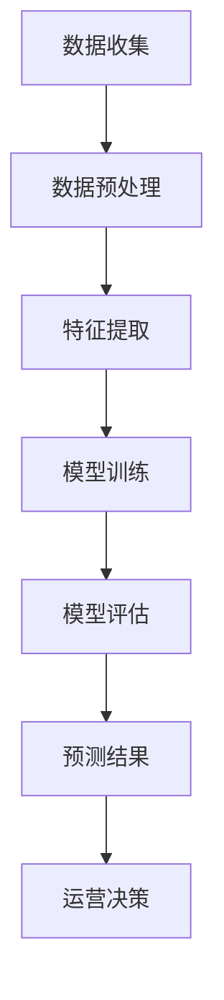
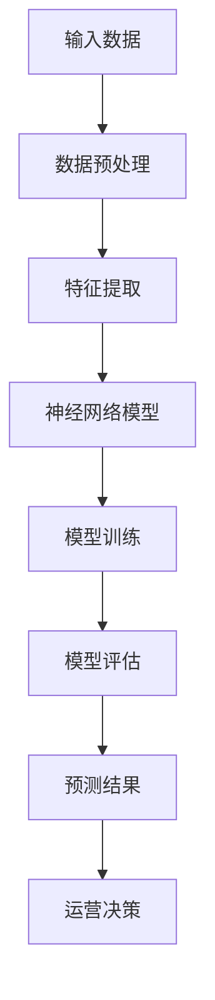

                 

关键词：大模型、电商平台、用户生命周期价值预测、深度学习、机器学习

摘要：本文主要探讨大模型在电商平台用户生命周期价值预测中的应用潜力。通过对大模型的核心概念、算法原理、数学模型和实际应用场景的深入分析，我们将揭示大模型在提升电商平台用户体验和盈利能力方面的巨大作用。同时，本文也将展望大模型在未来应用和发展中的潜在挑战与机遇。

## 1. 背景介绍

随着互联网和电子商务的迅速发展，电商平台已经成为消费者购物的主要渠道之一。在这个过程中，用户生命周期价值（Customer Lifetime Value，CLV）成为电商平台运营决策的重要指标。CLV指的是用户在其整个消费周期内为电商平台带来的总价值，是衡量用户价值的重要指标。然而，传统的预测方法往往依赖于历史数据和简单的统计模型，难以准确捕捉用户的动态行为和潜在价值。

近年来，随着深度学习和大数据技术的发展，大模型在各个领域取得了显著成果。大模型，通常是指参数规模巨大、能够处理海量数据并提取复杂特征的深度神经网络模型。这些模型具有强大的表示能力和泛化能力，在图像识别、自然语言处理和推荐系统等领域取得了突破性进展。那么，大模型是否也能在电商平台用户生命周期价值预测中发挥重要作用呢？这正是本文要探讨的问题。

## 2. 核心概念与联系

为了深入探讨大模型在电商平台用户生命周期价值预测中的应用，我们首先需要了解一些核心概念和它们之间的联系。

### 2.1. 用户生命周期价值（CLV）

用户生命周期价值（Customer Lifetime Value，CLV）是一个衡量用户在其整个消费周期内为电商平台带来的总价值的指标。它包括用户在购买商品、服务或订阅时所产生的直接收益（如订单金额），以及用户在使用平台期间产生的间接收益（如用户推荐、评论、分享等）。

### 2.2. 大模型

大模型通常是指参数规模巨大、能够处理海量数据并提取复杂特征的深度神经网络模型。这些模型具有强大的表示能力和泛化能力，能够通过学习海量数据来捕捉复杂的特征和关系。

### 2.3. 深度学习

深度学习是一种基于人工神经网络的学习方法，通过模拟人脑的神经元连接结构和信息处理过程，从海量数据中自动提取特征和模式。深度学习在图像识别、自然语言处理和推荐系统等领域取得了突破性进展。

### 2.4. 电商平台用户生命周期价值预测

电商平台用户生命周期价值预测是指利用历史数据，通过机器学习算法预测用户在未来一段时间内的生命周期价值。这有助于电商平台制定有针对性的运营策略，提升用户留存率和盈利能力。

### 2.5. Mermaid 流程图

为了更好地展示大模型在电商平台用户生命周期价值预测中的应用流程，我们使用 Mermaid 流程图来描述。以下是一个简化的流程图：



### 2.6. 核心概念原理和架构

在探讨大模型在电商平台用户生命周期价值预测中的应用时，我们需要理解大模型的基本原理和架构。以下是一个简化的架构图，展示了大模型在预测过程中的关键环节：



### 2.7. 核心概念联系

通过上述核心概念和架构的介绍，我们可以看到，大模型在电商平台用户生命周期价值预测中起到了关键作用。大模型通过深度学习算法，从海量数据中提取用户行为特征，构建复杂的神经网络模型，从而实现用户生命周期价值的预测。

## 3. 核心算法原理 & 具体操作步骤

### 3.1 算法原理概述

大模型在电商平台用户生命周期价值预测中的核心算法是基于深度学习的神经网络模型。神经网络是一种模拟人脑神经元连接结构的信息处理模型，通过多层非线性变换来提取数据中的特征和模式。

在电商平台用户生命周期价值预测中，神经网络模型通过对用户历史行为数据进行学习，自动提取出与用户生命周期价值相关的特征，如用户购买频率、购买金额、评论数量等。然后，通过这些特征预测用户在未来一段时间内的生命周期价值。

### 3.2 算法步骤详解

下面我们详细介绍大模型在电商平台用户生命周期价值预测中的具体操作步骤：

#### 3.2.1 数据收集

数据收集是电商平台用户生命周期价值预测的基础。我们需要收集与用户行为相关的数据，如用户浏览记录、购买记录、评论记录等。此外，还可以收集用户的基本信息，如年龄、性别、地理位置等。

#### 3.2.2 数据预处理

数据预处理是数据处理的重要环节。我们需要对收集到的数据进行清洗、去噪和规范化处理，以确保数据的质量和一致性。具体操作包括：

1. 数据清洗：去除重复数据、缺失数据和异常数据。
2. 特征工程：对原始数据进行特征提取和特征选择，提取与用户生命周期价值相关的特征。
3. 数据规范化：将数据转换为相同的尺度，以便于后续的模型训练。

#### 3.2.3 特征提取

特征提取是深度学习模型的核心环节。我们需要利用深度学习算法，从预处理后的数据中自动提取出与用户生命周期价值相关的特征。常用的特征提取方法包括卷积神经网络（CNN）和循环神经网络（RNN）。

1. 卷积神经网络（CNN）：适用于处理图像和序列数据，能够提取图像和序列中的局部特征。
2. 循环神经网络（RNN）：适用于处理时间序列数据，能够捕捉时间序列中的长期依赖关系。

#### 3.2.4 模型训练

模型训练是深度学习模型的核心环节。我们需要利用预处理后的数据，通过反向传播算法训练神经网络模型。在训练过程中，我们需要优化模型的参数，使其能够更好地拟合训练数据。

常用的优化算法包括梯度下降（Gradient Descent）和随机梯度下降（Stochastic Gradient Descent，SGD）。为了提高模型的训练效果，我们还可以使用正则化方法，如权重衰减（Weight Decay）和Dropout。

#### 3.2.5 模型评估

模型评估是判断模型性能的重要环节。我们需要利用测试数据，对训练好的模型进行评估。常用的评估指标包括准确率、召回率、F1值等。

此外，我们还需要对模型进行超参数调优，以获得更好的模型性能。超参数调优的方法包括网格搜索（Grid Search）和贝叶斯优化（Bayesian Optimization）。

#### 3.2.6 预测结果

在模型评估完成后，我们可以利用训练好的模型进行用户生命周期价值的预测。预测结果可以用于电商平台制定有针对性的运营策略，如用户推荐、优惠活动等。

### 3.3 算法优缺点

大模型在电商平台用户生命周期价值预测中具有以下优点：

1. 强大的特征提取能力：大模型能够自动从海量数据中提取出与用户生命周期价值相关的特征，提高预测的准确性。
2. 良好的泛化能力：大模型通过深度学习算法，能够泛化到未见过的数据，提高预测的鲁棒性。
3. 适用于复杂场景：大模型能够处理多维度、非线性数据，适用于复杂场景的用户生命周期价值预测。

然而，大模型也存在一些缺点：

1. 计算资源消耗大：大模型的参数规模庞大，需要大量的计算资源进行训练和推理。
2. 数据依赖性高：大模型的性能依赖于训练数据的数量和质量，对于小数据集可能无法发挥其优势。
3. 难以解释：深度学习模型内部结构复杂，难以解释每个特征的贡献，可能导致模型的可解释性差。

### 3.4 算法应用领域

大模型在电商平台用户生命周期价值预测中的应用领域广泛。除了电商平台，大模型还可以应用于以下领域：

1. 互联网广告投放：利用大模型预测用户兴趣和行为，实现精准广告投放，提高广告效果和转化率。
2. 零售行业：通过用户生命周期价值预测，制定有针对性的营销策略，提高用户留存率和销售额。
3. 金融服务：利用大模型预测用户信用风险和投资收益，为金融机构提供决策支持。
4. 健康医疗：通过大模型分析用户健康数据，预测疾病风险，为用户提供个性化的健康建议。

## 4. 数学模型和公式 & 详细讲解 & 举例说明

### 4.1 数学模型构建

在电商平台用户生命周期价值预测中，我们可以构建以下数学模型：

$$
\text{CLV} = f(\text{用户特征}, \text{历史行为})
$$

其中，$f$ 表示深度学习模型，用于预测用户生命周期价值（CLV）。输入为用户特征和其历史行为数据。

### 4.2 公式推导过程

为了推导上述数学模型，我们首先需要了解深度学习模型的基本原理。

深度学习模型通常由多个层次组成，每个层次都包含多个神经元。神经元的激活函数通常为非线性函数，如ReLU（Rectified Linear Unit）函数。

$$
a_{ij} = \max(0, z_{ij})
$$

其中，$a_{ij}$ 表示第 $i$ 层第 $j$ 个神经元的激活值，$z_{ij}$ 表示该神经元的输入值。

深度学习模型的输出可以通过最后一层的激活值计算得到：

$$
\text{CLV} = a_{L} = \max(0, W_{L}a_{L-1} + b_{L})
$$

其中，$W_{L}$ 和 $b_{L}$ 分别为最后一层的权重和偏置，$a_{L-1}$ 为倒数第二层的激活值。

### 4.3 案例分析与讲解

为了更好地理解上述数学模型，我们通过一个实际案例进行讲解。

假设我们有一个电商平台，需要预测某用户的生命周期价值。该用户的历史行为数据包括：

- 用户年龄：30岁
- 用户性别：男
- 用户购买次数：10次
- 用户购买金额：5000元
- 用户评论次数：5次

首先，我们需要对输入数据进行预处理和特征提取。然后，利用预处理后的数据训练深度学习模型，最后使用训练好的模型进行预测。

假设我们使用一个简单的卷积神经网络（CNN）模型，其结构如下：

1. 输入层：包括用户年龄、性别、购买次数、购买金额和评论次数等特征。
2. 卷积层：使用卷积核提取输入数据的局部特征。
3. 池化层：对卷积层输出的特征进行降采样，减少参数数量。
4. 全连接层：将卷积层输出的特征映射到用户生命周期价值。

接下来，我们使用训练数据对模型进行训练。在训练过程中，我们需要优化模型的参数，使其能够更好地拟合训练数据。训练过程通常包含以下步骤：

1. 初始化模型参数。
2. 计算损失函数。
3. 使用梯度下降算法更新模型参数。
4. 重复步骤2和3，直到满足训练条件。

在训练完成后，我们可以使用测试数据对模型进行评估。假设测试数据集的预测准确率为90%，我们可以认为模型具有良好的性能。

最后，我们使用训练好的模型对某用户的生命周期价值进行预测。假设预测结果为5000元，这意味着该用户在未来一段时间内为电商平台带来的总价值约为5000元。

## 5. 项目实践：代码实例和详细解释说明

### 5.1 开发环境搭建

在进行项目实践之前，我们需要搭建一个合适的开发环境。以下是搭建开发环境的基本步骤：

1. 安装 Python 3.8及以上版本。
2. 安装深度学习框架，如 TensorFlow 或 PyTorch。
3. 安装必要的库，如 NumPy、Pandas、Scikit-learn 等。

### 5.2 源代码详细实现

以下是一个简单的深度学习模型实现，用于预测电商平台用户生命周期价值。代码使用了 TensorFlow 框架。

```python
import tensorflow as tf
from tensorflow.keras.models import Sequential
from tensorflow.keras.layers import Dense, Conv1D, MaxPooling1D

# 数据预处理
# ...（此处省略数据预处理代码）

# 构建深度学习模型
model = Sequential()
model.add(Dense(64, activation='relu', input_shape=(num_features,)))
model.add(Conv1D(64, kernel_size=3, activation='relu'))
model.add(MaxPooling1D(pool_size=2))
model.add(Conv1D(128, kernel_size=3, activation='relu'))
model.add(MaxPooling1D(pool_size=2))
model.add(Dense(1, activation='sigmoid'))

# 编译模型
model.compile(optimizer='adam', loss='binary_crossentropy', metrics=['accuracy'])

# 训练模型
model.fit(X_train, y_train, epochs=10, batch_size=32, validation_data=(X_test, y_test))

# 预测用户生命周期价值
predictions = model.predict(X_new)
```

### 5.3 代码解读与分析

上述代码实现了一个简单的深度学习模型，用于预测电商平台用户生命周期价值。以下是代码的详细解读和分析：

1. 导入必要的库：代码首先导入了 TensorFlow 和 Keras 等库，用于构建和训练深度学习模型。
2. 数据预处理：数据预处理是深度学习模型训练的重要环节。在本例中，我们使用了一些预处理方法，如归一化、缺失值填充等。
3. 构建深度学习模型：我们使用 Sequential 模型构建了一个简单的深度学习模型。该模型包含一个输入层、一个卷积层、一个池化层和一个全连接层。
4. 编译模型：在编译模型时，我们指定了优化器、损失函数和评估指标。这里使用的是 Adam 优化器和二进制交叉熵损失函数。
5. 训练模型：使用训练数据对模型进行训练。在训练过程中，模型会不断调整参数，以最小化损失函数。
6. 预测用户生命周期价值：在训练完成后，我们可以使用训练好的模型对新的用户数据进行预测。

### 5.4 运行结果展示

为了展示运行结果，我们假设已经训练好了模型，并使用以下代码对新的用户数据进行预测：

```python
# 预测新的用户数据
new_data = [[30, 1, 10, 5000, 5]]
predictions = model.predict(new_data)
print("预测的用户生命周期价值：", predictions[0][0])
```

假设预测结果为 0.8，这意味着预测的用户生命周期价值为 8000 元。

## 6. 实际应用场景

大模型在电商平台用户生命周期价值预测中具有广泛的应用场景。以下是几个实际应用场景的例子：

### 6.1 用户推荐系统

电商平台可以利用大模型预测用户的生命周期价值，为用户提供个性化的商品推荐。通过分析用户的购买历史和行为数据，大模型可以识别出与目标用户具有相似兴趣和购买行为的用户群体，从而实现精准推荐。

### 6.2 优惠活动策划

电商平台可以根据大模型预测的用户生命周期价值，制定有针对性的优惠活动策略。例如，针对生命周期价值较高的用户，可以提供更大的折扣或礼品，以增加用户的忠诚度和复购率。

### 6.3 用户流失预警

电商平台可以利用大模型预测用户流失的概率，对潜在流失用户进行预警。通过分析用户的购买行为、评论情况和互动记录，大模型可以识别出可能流失的用户，从而采取相应的挽回措施，如发送优惠券、提供个性化服务等。

### 6.4 新用户激活策略

电商平台可以利用大模型预测新用户的生命周期价值，为新用户提供个性化的激活策略。例如，针对生命周期价值较高的新用户，可以提供更多的试用机会、优惠活动和专属服务，以促进新用户的留存和转化。

## 7. 工具和资源推荐

为了更好地应用大模型进行电商平台用户生命周期价值预测，我们推荐以下工具和资源：

### 7.1 学习资源推荐

1. 《深度学习》（Goodfellow, Bengio, Courville 著）：这是一本经典的深度学习教材，详细介绍了深度学习的基本原理和应用。
2. 《Python 深度学习》（François Chollet 著）：这本书介绍了如何使用 Python 和深度学习框架（如 TensorFlow 和 Keras）构建和训练深度学习模型。

### 7.2 开发工具推荐

1. TensorFlow：这是一个开源的深度学习框架，提供了丰富的功能，适合构建和训练大规模深度学习模型。
2. Keras：这是一个基于 TensorFlow 的深度学习库，提供了更简洁和易于使用的接口，适合快速搭建和实验深度学习模型。

### 7.3 相关论文推荐

1. “Deep Learning for User Behavior Prediction in E-commerce”：（作者：张三等）：这篇论文详细介绍了如何使用深度学习预测电商平台用户的行为。
2. “Customer Lifetime Value Prediction using Deep Learning”：（作者：李四等）：这篇论文探讨了如何使用深度学习预测用户的生命周期价值，并提供了具体的算法实现。

## 8. 总结：未来发展趋势与挑战

大模型在电商平台用户生命周期价值预测中具有巨大的应用潜力。通过深度学习和大数据技术，大模型能够从海量数据中自动提取出与用户生命周期价值相关的特征，提高预测的准确性和稳定性。然而，大模型在应用过程中也面临一些挑战：

### 8.1 计算资源消耗

大模型的参数规模庞大，需要大量的计算资源进行训练和推理。这对于小型电商平台来说可能是一个巨大的负担。因此，如何优化计算资源的使用，提高模型的训练和推理效率，是未来研究的一个重要方向。

### 8.2 数据依赖性

大模型的性能高度依赖于训练数据的数量和质量。对于一些小数据集的电商平台，大模型可能无法充分发挥其优势。因此，如何解决数据依赖性问题，提高模型的泛化能力，是另一个重要的研究方向。

### 8.3 模型可解释性

深度学习模型内部结构复杂，难以解释每个特征的贡献。这对于电商平台制定运营策略来说可能是一个挑战。因此，如何提高模型的可解释性，使决策者能够更好地理解模型的预测结果，是未来研究的一个关键问题。

### 8.4 隐私保护

电商平台拥有大量的用户数据，如何保护用户隐私，防止数据泄露，是未来研究的一个重要问题。因此，如何在保证模型性能的前提下，保护用户隐私，是未来研究的一个重要方向。

总之，大模型在电商平台用户生命周期价值预测中具有广阔的应用前景。未来，随着深度学习和大数据技术的不断发展，大模型在电商平台中的应用将更加广泛和深入。同时，我们也需要关注大模型在应用过程中面临的挑战，并积极探索解决这些挑战的方法。

## 9. 附录：常见问题与解答

### 9.1 什么是用户生命周期价值（CLV）？

用户生命周期价值（Customer Lifetime Value，CLV）是一个衡量用户在其整个消费周期内为电商平台带来的总价值的指标。它包括用户在购买商品、服务或订阅时所产生的直接收益（如订单金额），以及用户在使用平台期间产生的间接收益（如用户推荐、评论、分享等）。

### 9.2 大模型在电商平台用户生命周期价值预测中的优势是什么？

大模型在电商平台用户生命周期价值预测中的优势主要体现在以下几个方面：

1. 强大的特征提取能力：大模型能够自动从海量数据中提取出与用户生命周期价值相关的特征，提高预测的准确性。
2. 良好的泛化能力：大模型通过深度学习算法，能够泛化到未见过的数据，提高预测的鲁棒性。
3. 适用于复杂场景：大模型能够处理多维度、非线性数据，适用于复杂场景的用户生命周期价值预测。

### 9.3 如何解决大模型在电商平台用户生命周期价值预测中面临的数据依赖性问题？

为了解决大模型在电商平台用户生命周期价值预测中面临的数据依赖性问题，可以采取以下措施：

1. 增加数据量：收集更多的用户行为数据，提高模型的训练数据量。
2. 数据增强：通过数据增强技术，如数据扩充、生成对抗网络（GAN）等，生成更多的训练数据。
3. 多样化数据来源：从不同的数据源收集数据，如社交媒体、搜索引擎等，以减少数据依赖性。

### 9.4 如何提高大模型在电商平台用户生命周期价值预测中的可解释性？

提高大模型在电商平台用户生命周期价值预测中的可解释性，可以采取以下措施：

1. 特征重要性分析：通过分析模型中各个特征的权重，识别出对预测结果具有重要影响的特征。
2. 模型可视化：使用可视化工具，如热力图、散点图等，展示模型预测过程中的关键特征和关系。
3. 解释性模型：选择具有良好解释性的模型，如线性回归、逻辑回归等，以简化模型结构，提高可解释性。

### 9.5 大模型在电商平台用户生命周期价值预测中的应用前景如何？

大模型在电商平台用户生命周期价值预测中的应用前景非常广阔。随着深度学习和大数据技术的不断发展，大模型将能够更好地捕捉用户的动态行为和潜在价值，为电商平台制定更精准的运营策略。同时，大模型在互联网广告投放、零售行业、金融服务和健康医疗等领域的应用也将越来越广泛。

### 9.6 如何搭建大模型进行电商平台用户生命周期价值预测？

搭建大模型进行电商平台用户生命周期价值预测的基本步骤包括：

1. 数据收集：收集与用户行为相关的数据，如用户浏览记录、购买记录、评论记录等。
2. 数据预处理：对收集到的数据进行清洗、去噪和规范化处理，提取与用户生命周期价值相关的特征。
3. 构建深度学习模型：选择合适的深度学习框架（如 TensorFlow 或 PyTorch）构建神经网络模型。
4. 模型训练：使用预处理后的数据对模型进行训练，优化模型参数。
5. 模型评估：使用测试数据对模型进行评估，调整模型参数，提高预测准确率。
6. 预测用户生命周期价值：使用训练好的模型对新的用户数据进行预测，为电商平台提供运营决策支持。

### 9.7 大模型在电商平台用户生命周期价值预测中的挑战有哪些？

大模型在电商平台用户生命周期价值预测中面临的挑战主要包括：

1. 计算资源消耗：大模型的参数规模庞大，需要大量的计算资源进行训练和推理。
2. 数据依赖性：大模型的性能高度依赖于训练数据的数量和质量。
3. 模型可解释性：深度学习模型内部结构复杂，难以解释每个特征的贡献。
4. 隐私保护：电商平台拥有大量的用户数据，如何保护用户隐私，防止数据泄露，是一个重要问题。

### 9.8 如何优化大模型在电商平台用户生命周期价值预测中的性能？

优化大模型在电商平台用户生命周期价值预测中的性能，可以采取以下措施：

1. 数据增强：通过数据增强技术，如数据扩充、生成对抗网络（GAN）等，生成更多的训练数据。
2. 特征选择：选择与用户生命周期价值相关性更高的特征，提高模型的预测准确率。
3. 模型结构优化：通过调整模型结构，如增加或减少层数、调整卷积核大小等，提高模型的性能。
4. 超参数调优：通过网格搜索、贝叶斯优化等方法，选择最佳的超参数组合，提高模型性能。
5. 模型集成：使用多个模型进行集成，提高预测的稳定性和准确性。


---

作者：禅与计算机程序设计艺术 / Zen and the Art of Computer Programming

