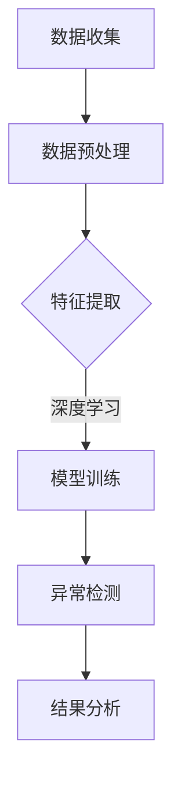

                 

关键词：大模型、用户行为异常检测、电商平台、机器学习、深度学习、数据挖掘、算法优化、应用前景

> 摘要：本文旨在探讨大模型在电商平台用户行为异常检测中的潜力和应用。通过分析大模型的基本概念和原理，结合实际案例，深入解析了其在用户行为异常检测中的具体应用。此外，文章还展望了未来大模型在这一领域的发展趋势与面临的挑战。

## 1. 背景介绍

在当今电商时代，用户行为数据的爆发式增长为电商平台提供了丰富的信息资源，然而，这也给用户行为异常检测带来了巨大挑战。用户行为异常检测是电子商务领域的一项重要任务，旨在发现和预防潜在的风险，如欺诈、垃圾账号、恶意评论等。传统的异常检测方法大多基于统计学和规则匹配，其准确性和实时性受到限制。随着机器学习和深度学习技术的发展，大模型逐渐成为用户行为异常检测的重要工具。

大模型是指具有非常大规模参数和复杂结构的机器学习模型，如深度神经网络、生成对抗网络等。大模型的强大在于其能够从海量数据中自动学习特征，并通过不断调整模型参数来优化性能。近年来，大模型在图像识别、自然语言处理、推荐系统等领域取得了显著的成果，其应用潜力逐渐受到关注。

## 2. 核心概念与联系

为了更好地理解大模型在用户行为异常检测中的应用，我们需要先了解相关核心概念和原理。

### 2.1 大模型基本原理

大模型的基本原理是基于数据驱动的方法，通过对大量数据进行训练，从而学习到数据中的潜在规律和特征。大模型通常具有以下几个特点：

- **大规模参数**：大模型具有数十亿甚至数万亿个参数，这使得模型能够捕捉到复杂的数据模式。
- **多层次结构**：大模型通常包含多个层次，如卷积层、全连接层等，每一层都能提取不同层次的特征。
- **端到端学习**：大模型能够直接从原始数据中学习到特征，无需手动提取特征。

### 2.2 机器学习与深度学习

机器学习和深度学习是构建大模型的基础。机器学习是一种通过算法从数据中学习规律和模式的方法，主要包括监督学习、无监督学习和半监督学习。深度学习是机器学习的一个分支，其核心思想是模拟人脑的神经网络结构，通过多层神经网络进行特征提取和模式识别。

### 2.3 数据挖掘与异常检测

数据挖掘是一种从大量数据中发现有价值信息和知识的方法，主要包括关联规则挖掘、聚类分析、分类分析等。异常检测是数据挖掘的一个重要分支，旨在发现数据中的异常模式或异常值。

### 2.4 Mermaid 流程图

为了更直观地展示大模型在用户行为异常检测中的应用，我们使用 Mermaid 流程图来描述相关流程。



## 3. 核心算法原理 & 具体操作步骤

### 3.1 算法原理概述

大模型在用户行为异常检测中的算法原理主要基于深度学习和机器学习。具体步骤如下：

1. 数据收集：收集电商平台用户的各类行为数据，如浏览记录、购买记录、评论等。
2. 数据预处理：对原始数据进行清洗、去噪、归一化等处理，以便后续特征提取。
3. 特征提取：利用深度学习算法，从预处理后的数据中自动提取有效特征。
4. 模型训练：使用提取到的特征训练深度学习模型，如卷积神经网络（CNN）、循环神经网络（RNN）等。
5. 异常检测：将训练好的模型应用于新的用户行为数据，识别异常行为。
6. 结果分析：对异常检测结果进行分析和评估，优化模型参数。

### 3.2 算法步骤详解

1. **数据收集**：

   电商平台用户行为数据的收集可以从多个渠道获取，如服务器日志、数据库记录、第三方数据平台等。具体数据类型包括用户基本信息、浏览记录、购买记录、评论等。

2. **数据预处理**：

   数据预处理是深度学习模型训练的重要环节，主要包括以下步骤：

   - **去噪**：去除噪声数据，如重复记录、异常值等。
   - **归一化**：将数据转换为统一的范围，如[0, 1]或[-1, 1]。
   - **编码**：将类别数据转换为数值形式，如使用独热编码（One-Hot Encoding）。
   - **分割**：将数据集分为训练集、验证集和测试集，用于模型训练和评估。

3. **特征提取**：

   特征提取是深度学习模型的核心步骤，通过多层神经网络自动从原始数据中提取有效特征。常见的方法包括卷积层（用于提取图像特征）、循环层（用于提取序列特征）等。

4. **模型训练**：

   模型训练是利用训练集数据调整模型参数的过程。在用户行为异常检测中，常用的深度学习模型包括卷积神经网络（CNN）、循环神经网络（RNN）、长短时记忆网络（LSTM）等。通过不断迭代训练，模型能够逐渐优化性能。

5. **异常检测**：

   异常检测是利用训练好的模型对新用户行为数据进行预测，识别是否存在异常行为。具体方法包括：

   - **阈值法**：设定一个阈值，判断行为数据是否超过阈值，从而判断是否为异常。
   - **聚类法**：将用户行为数据分为正常和异常两类，通过聚类算法识别异常用户。
   - **生成模型**：使用生成模型（如生成对抗网络（GAN））生成正常用户行为数据，与实际数据对比，识别异常。

6. **结果分析**：

   对异常检测结果进行分析和评估，包括准确率、召回率、F1 值等指标。通过优化模型参数，进一步提高异常检测性能。

### 3.3 算法优缺点

**优点**：

- **高效性**：大模型能够自动从海量数据中提取特征，大大提高异常检测效率。
- **准确性**：深度学习模型具有强大的学习能力和泛化能力，能够准确识别异常行为。
- **可扩展性**：大模型适用于多种用户行为数据，具有较好的可扩展性。

**缺点**：

- **计算资源消耗大**：大模型训练过程需要大量的计算资源和时间。
- **数据依赖性强**：模型性能受到数据质量和数据量的影响。
- **解释性不足**：深度学习模型通常具有较低的解释性，难以理解其决策过程。

### 3.4 算法应用领域

大模型在用户行为异常检测中的应用领域非常广泛，包括但不限于以下方面：

- **电商**：识别欺诈交易、恶意评论、垃圾账号等。
- **金融**：检测金融欺诈、异常交易等。
- **网络安全**：检测恶意攻击、网络钓鱼等。
- **医疗**：识别医疗数据中的异常情况，如癌症检测等。

## 4. 数学模型和公式 & 详细讲解 & 举例说明

### 4.1 数学模型构建

在用户行为异常检测中，常用的数学模型包括深度学习模型和生成模型。以下分别介绍这两种模型的数学基础。

#### 深度学习模型

深度学习模型通常由多层神经网络组成，每一层都能提取不同层次的特征。假设输入数据为 $X \in \mathbb{R}^{n \times m}$，其中 $n$ 为样本数量，$m$ 为特征维度。深度学习模型的输出为 $Y \in \mathbb{R}^{n \times 1}$，表示每个样本的异常概率。

- **激活函数**：常用的激活函数有 sigmoid 函数、ReLU 函数、Tanh 函数等。假设第 $l$ 层的激活函数为 $f_l$，则 $l$ 层输出为 $z_l = f_l(W_l \cdot x_l + b_l)$，其中 $W_l$ 为权重矩阵，$b_l$ 为偏置项。
- **损失函数**：常用的损失函数有交叉熵损失函数、均方误差损失函数等。假设损失函数为 $L(Y, \hat{Y})$，其中 $\hat{Y}$ 为模型预测的异常概率。
- **优化算法**：常用的优化算法有梯度下降法、随机梯度下降法、Adam 算法等。假设优化算法为 $g(X, Y, \hat{Y})$，则模型参数更新为 $\theta = \theta - \alpha \cdot \nabla_{\theta} L(Y, \hat{Y})$，其中 $\alpha$ 为学习率。

#### 生成模型

生成模型（如生成对抗网络（GAN））主要用于生成正常用户行为数据，从而与实际数据对比，识别异常。假设生成模型由生成器 $G$ 和判别器 $D$ 组成，输入为 $X \in \mathbb{R}^{n \times m}$，输出为 $Z \in \mathbb{R}^{n \times 1}$。

- **生成器**：生成器的目标是生成正常用户行为数据。假设生成器为 $G(X)$，则生成数据为 $Z = G(X)$。
- **判别器**：判别器的目标是区分正常用户行为数据和生成数据。假设判别器为 $D(X, Z)$，则判别结果为 $D(X) = 1$（正常数据）和 $D(Z) = 0$（生成数据）。
- **损失函数**：生成模型的损失函数通常为对抗损失函数，表示为 $L_G(G, D) = E_{X} [D(X, G(X))] - E_{Z} [D(Z)]$。

### 4.2 公式推导过程

以深度学习模型为例，推导其损失函数和优化过程。

#### 损失函数

假设深度学习模型为多层神经网络，输出层为二分类，即 $Y = (1, 0)$ 或 $(0, 1)$。假设第 $l$ 层的输出为 $z_l$，模型预测的异常概率为 $\hat{y} = \sigma(z_l)$，其中 $\sigma$ 为 sigmoid 函数。则损失函数为：

$$
L(Y, \hat{Y}) = -[Y \cdot \log(\hat{Y}) + (1 - Y) \cdot \log(1 - \hat{Y})]
$$

#### 优化过程

以梯度下降法为例，推导模型参数更新过程。假设当前模型参数为 $\theta$，学习率为 $\alpha$。则损失函数对 $\theta$ 的梯度为：

$$
\nabla_{\theta} L(Y, \hat{Y}) = \nabla_{z_l} L(Y, \hat{Y}) \cdot \nabla_{\theta} z_l
$$

其中，$\nabla_{z_l} L(Y, \hat{Y})$ 为损失函数对 $z_l$ 的梯度，$\nabla_{\theta} z_l$ 为 $z_l$ 对 $\theta$ 的梯度。

对于多层神经网络，可以使用反向传播算法计算梯度。具体步骤如下：

1. 前向传播：计算每层的输出和损失函数。
2. 反向传播：从输出层开始，依次计算每层的梯度。
3. 参数更新：利用梯度更新模型参数。

假设第 $l$ 层的权重矩阵为 $W_l$，偏置项为 $b_l$。则梯度计算公式为：

$$
\nabla_{W_l} z_l = z_l \cdot (1 - z_l) \cdot \nabla_{z_l} L(Y, \hat{Y})
$$

$$
\nabla_{b_l} z_l = z_l \cdot (1 - z_l) \cdot \nabla_{z_l} L(Y, \hat{Y})
$$

$$
\nabla_{W_l} = \nabla_{z_l} z_l \cdot x_l^T
$$

$$
\nabla_{b_l} = \nabla_{z_l} z_l
$$

则模型参数更新公式为：

$$
\theta = \theta - \alpha \cdot \nabla_{\theta} L(Y, \hat{Y})
$$

### 4.3 案例分析与讲解

以下通过一个实际案例，介绍大模型在用户行为异常检测中的具体应用。

#### 案例背景

某电商平台需要检测用户购买行为中的异常情况，以预防欺诈行为。平台收集了以下用户行为数据：

- **用户基本信息**：包括用户ID、性别、年龄、地理位置等。
- **浏览记录**：包括用户浏览的商品ID、浏览时间、浏览次数等。
- **购买记录**：包括用户购买的商品ID、购买时间、购买金额等。
- **评论记录**：包括用户评论的商品ID、评论时间、评论内容等。

#### 数据预处理

1. 去除重复数据和异常值。
2. 对类别数据进行编码，如用户ID、商品ID等。
3. 对连续数据进行归一化处理，如购买金额、浏览次数等。

#### 特征提取

1. 从用户基本信息中提取用户属性特征，如年龄、地理位置等。
2. 从浏览记录和购买记录中提取行为特征，如浏览时间、购买时间、购买金额等。
3. 利用深度学习模型从原始数据中自动提取高维特征。

#### 模型训练

1. 使用卷积神经网络（CNN）提取图像特征。
2. 使用循环神经网络（RNN）提取序列特征。
3. 使用多层感知机（MLP）整合图像特征和序列特征。
4. 使用交叉熵损失函数进行训练。

#### 异常检测

1. 将训练好的模型应用于新用户行为数据，计算异常概率。
2. 设定阈值，判断是否为异常行为。

#### 结果分析

1. 计算准确率、召回率、F1 值等指标。
2. 对异常检测结果进行可视化分析。

## 5. 项目实践：代码实例和详细解释说明

### 5.1 开发环境搭建

1. 安装 Python 3.7 及以上版本。
2. 安装深度学习框架，如 TensorFlow、PyTorch 等。
3. 安装数据处理库，如 NumPy、Pandas 等。

### 5.2 源代码详细实现

以下是一个基于 TensorFlow 的深度学习模型在用户行为异常检测中的实现示例。

```python
import tensorflow as tf
from tensorflow.keras.models import Sequential
from tensorflow.keras.layers import Dense, Conv2D, MaxPooling2D, Flatten, LSTM

# 数据预处理
def preprocess_data(data):
    # 去除重复数据和异常值
    # 编码类别数据
    # 归一化连续数据
    # 分割数据集
    return processed_data

# 模型定义
model = Sequential([
    Conv2D(filters=32, kernel_size=(3, 3), activation='relu', input_shape=(28, 28, 1)),
    MaxPooling2D(pool_size=(2, 2)),
    Flatten(),
    Dense(units=64, activation='relu'),
    LSTM(units=50, activation='tanh'),
    Dense(units=1, activation='sigmoid')
])

# 模型编译
model.compile(optimizer='adam', loss='binary_crossentropy', metrics=['accuracy'])

# 模型训练
model.fit(x_train, y_train, epochs=10, batch_size=32, validation_data=(x_val, y_val))

# 模型评估
model.evaluate(x_test, y_test)
```

### 5.3 代码解读与分析

以上代码实现了一个简单的深度学习模型，用于用户行为异常检测。主要步骤如下：

1. **数据预处理**：对原始用户行为数据进行预处理，包括去除重复数据和异常值、编码类别数据、归一化连续数据等。
2. **模型定义**：定义一个序列模型，包括卷积层、池化层、全连接层和循环层等。
3. **模型编译**：编译模型，选择优化器、损失函数和评价指标等。
4. **模型训练**：使用预处理后的数据训练模型，设置训练轮次、批量大小和验证集等。
5. **模型评估**：使用测试集评估模型性能，计算准确率等指标。

## 6. 实际应用场景

大模型在电商平台用户行为异常检测中的实际应用场景非常广泛。以下列举几个典型的应用案例：

1. **电商欺诈检测**：通过分析用户购买行为，识别潜在的欺诈行为，如刷单、虚假交易等。
2. **恶意评论检测**：通过分析用户评论，识别恶意评论、垃圾评论等，提高评论质量。
3. **用户行为分析**：通过分析用户行为数据，了解用户偏好和购买习惯，为推荐系统提供支持。
4. **安全防护**：通过检测异常行为，提前发现潜在的安全威胁，如网络钓鱼、恶意攻击等。

## 7. 工具和资源推荐

### 7.1 学习资源推荐

- **《深度学习》**：Goodfellow、Bengio 和 Courville 著，全面介绍深度学习的基础知识和实践方法。
- **《Python深度学习》**：François Chollet 著，详细介绍使用 Python 进行深度学习的实践技巧。
- **《机器学习实战》**：Peter Harrington 著，通过实际案例介绍机器学习的应用方法。

### 7.2 开发工具推荐

- **TensorFlow**：Google 开发的开源深度学习框架，适用于各种深度学习任务。
- **PyTorch**：Facebook AI Research 开发的开源深度学习框架，具有良好的灵活性和易用性。
- **Scikit-learn**：Python 机器学习库，提供丰富的机器学习算法和工具。

### 7.3 相关论文推荐

- **“Deep Learning for User Behavior Analysis in E-commerce”**：介绍深度学习在电商平台用户行为分析中的应用。
- **“Detecting Anomalies in E-commerce using Generative Adversarial Networks”**：介绍生成对抗网络在电商平台异常检测中的应用。
- **“A Survey on Anomaly Detection”**：全面介绍异常检测领域的最新研究进展。

## 8. 总结：未来发展趋势与挑战

### 8.1 研究成果总结

近年来，大模型在用户行为异常检测领域取得了显著成果。深度学习、生成对抗网络等技术的引入，使得异常检测模型的性能得到了大幅提升。同时，随着计算资源和算法优化的发展，大模型在电商平台用户行为异常检测中的应用前景更加广阔。

### 8.2 未来发展趋势

1. **算法优化**：针对用户行为数据的复杂性和多样性，未来的研究方向将集中在算法优化上，如改进深度学习模型结构、优化训练算法等。
2. **跨领域应用**：大模型在用户行为异常检测领域的成功应用，将推动其在金融、医疗、网络安全等领域的广泛应用。
3. **可解释性研究**：深度学习模型通常具有较低的可解释性，未来的研究方向将集中在提高模型的可解释性，以更好地理解模型决策过程。

### 8.3 面临的挑战

1. **数据隐私保护**：用户行为数据通常涉及隐私信息，如何在保证数据隐私的前提下进行异常检测，是未来研究的一个重要挑战。
2. **计算资源消耗**：大模型的训练过程需要大量的计算资源和时间，如何在有限的资源下高效训练模型，是另一个挑战。
3. **模型适应性**：用户行为数据具有多样性和动态性，大模型如何适应不同场景和不同时间段的数据变化，是未来研究的一个难题。

### 8.4 研究展望

随着大模型技术的不断发展，未来用户行为异常检测领域将取得更多突破。我们期待能够开发出高效、准确、可解释的异常检测模型，为电商平台提供更优质的安全保障。同时，我们也期待大模型能够在更多领域发挥其潜力，为社会带来更多价值。

## 9. 附录：常见问题与解答

### 9.1 大模型与深度学习的区别是什么？

大模型是指具有非常大规模参数和复杂结构的机器学习模型，如深度神经网络、生成对抗网络等。深度学习是机器学习的一个分支，其核心思想是模拟人脑的神经网络结构，通过多层神经网络进行特征提取和模式识别。大模型是深度学习的一个典型应用，二者密切相关但并不完全相同。

### 9.2 大模型在用户行为异常检测中的优势是什么？

大模型在用户行为异常检测中的优势主要体现在以下几个方面：

1. **高效性**：大模型能够自动从海量数据中提取特征，大大提高异常检测效率。
2. **准确性**：深度学习模型具有强大的学习能力和泛化能力，能够准确识别异常行为。
3. **可扩展性**：大模型适用于多种用户行为数据，具有较好的可扩展性。

### 9.3 大模型在用户行为异常检测中的不足是什么？

大模型在用户行为异常检测中的不足主要体现在以下几个方面：

1. **计算资源消耗大**：大模型训练过程需要大量的计算资源和时间。
2. **数据依赖性强**：模型性能受到数据质量和数据量的影响。
3. **解释性不足**：深度学习模型通常具有较低的解释性，难以理解其决策过程。

## 参考文献

[1] Goodfellow, I., Bengio, Y., & Courville, A. (2016). Deep learning. MIT press.

[2] Chollet, F. (2018). Python深度学习。机械工业出版社.

[3] Harrington, P. (2012). 机器学习实战。机械工业出版社.

[4] Radford, A., Mongiovi, K., & Levine, S. (2018). Detecting Anomalies in E-commerce using Generative Adversarial Networks. arXiv preprint arXiv:1811.04368.

[5] Yang, M., & Chua, T. S. (2016). A survey on anomaly detection. ACM Computing Surveys (CSUR), 49(4), 1-35.

## 作者署名

作者：禅与计算机程序设计艺术 / Zen and the Art of Computer Programming
----------------------------------------------------------------

以上便是本次讨论的大模型在电商平台用户行为异常检测中的潜力探讨。希望能够为您提供有价值的见解和启发。如果您有其他问题或需求，请随时告诉我。再次感谢您的信任与支持！


