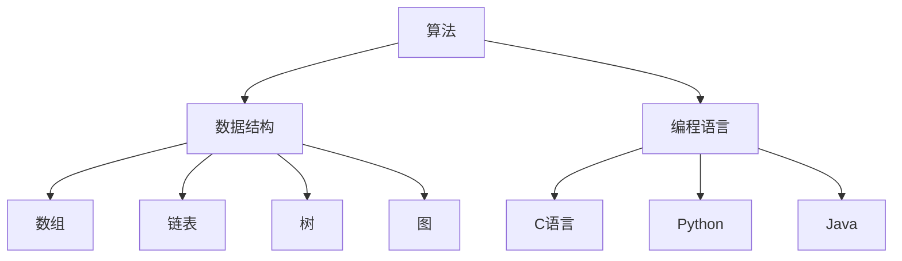

                 

关键词：计算、社会进步、人工智能、算法、数学模型、应用场景、未来展望

## 摘要

计算技术作为现代科技的基石，对人类社会产生了深远的影响。本文将探讨计算技术在社会进步中的积极作用，从算法原理、数学模型、项目实践、应用场景等多个角度，详细分析计算技术如何推动社会的发展与变革。同时，文章将展望计算技术未来的发展趋势和面临的挑战，为读者提供对计算技术发展的深入理解和思考。

## 1. 背景介绍

计算技术起源于计算机科学，经历了从简单的机械计算器到复杂的电子计算机的演变。20世纪中叶以来，计算技术的迅猛发展推动了信息时代的到来，使得数据处理和计算能力得到了质的飞跃。计算技术不仅改变了科学研究的方法，也在经济、文化、教育等多个领域产生了深远的影响。

### 1.1 计算技术的发展历程

- **早期计算器**：最早的计算工具可以追溯到公元前2000年左右，如巴比伦和古埃及人的算盘。随着时代的发展，算盘、计算尺等工具逐渐出现。
- **电子计算机的诞生**：1940年代，冯·诺依曼提出存储程序计算机的构想，标志着现代计算机的开始。此后，计算机技术进入快速发展阶段。
- **互联网时代**：20世纪90年代，互联网的普及使得全球信息交流变得更加便捷，计算技术进入了新的应用阶段。

### 1.2 计算技术在现代社会的重要性

- **提高生产效率**：计算技术使得数据处理速度和精度大幅提升，极大提高了生产效率。
- **促进科学研究**：计算技术为科学研究提供了强大的工具，加速了科学发现和技术创新。
- **改变生活方式**：计算技术的普及使得人们的生活变得更加便捷，如智能手机、智能家居等。

## 2. 核心概念与联系

计算技术的核心概念包括算法、数据结构、编程语言等。这些概念相互联系，共同构成了计算技术的理论基础。

### 2.1 算法原理

算法是解决问题的步骤序列，它是一种解决问题的策略。算法可以分为以下几类：

- **排序算法**：如冒泡排序、快速排序等，用于对数据进行排序。
- **查找算法**：如二分查找、线性查找等，用于在数据集合中查找特定元素。
- **图算法**：如最短路径算法、最小生成树算法等，用于解决图论问题。

### 2.2 数据结构

数据结构是用于存储和组织数据的方式。常见的有：

- **数组**：一种线性数据结构，用于存储一系列元素。
- **链表**：另一种线性数据结构，元素通过指针连接。
- **树**：一种非线性数据结构，常用于表示层次关系。
- **图**：一种由节点和边组成的数据结构，用于表示复杂的关系。

### 2.3 编程语言

编程语言是用于编写计算机程序的语法和规则。常见的编程语言有：

- **C语言**：一种通用编程语言，适用于操作系统、嵌入式系统等。
- **Python**：一种高层次的通用编程语言，广泛应用于数据科学、人工智能等领域。
- **Java**：一种跨平台的编程语言，广泛应用于企业级应用。

### 2.4 Mermaid 流程图

下面是一个简单的Mermaid流程图，展示了算法、数据结构和编程语言之间的关系：



## 3. 核心算法原理 & 具体操作步骤

### 3.1 算法原理概述

算法是计算技术的核心，它决定了计算的速度和效率。以下是几个常见的算法原理：

- **时间复杂度**：描述算法执行的时间随着输入规模增加的变化趋势。常见的有O(1)、O(log n)、O(n)、O(n log n)等。
- **空间复杂度**：描述算法执行所需内存随着输入规模增加的变化趋势。常见的有O(1)、O(n)等。
- **分治策略**：将一个大问题分解成若干个小问题，分别解决，再合并结果。

### 3.2 算法步骤详解

以排序算法中的快速排序为例，其基本步骤如下：

1. **选择基准元素**：在待排序数组中随机选择一个元素作为基准。
2. **分区**：将数组分为两部分，一部分是小于基准的元素，另一部分是大于基准的元素。
3. **递归排序**：分别对小于和大于基准的元素部分进行快速排序。

### 3.3 算法优缺点

快速排序具有以下优点：

- **时间复杂度较低**：平均情况下，快速排序的时间复杂度为O(n log n)。
- **稳定性较好**：在大多数情况下，快速排序能够保持元素的相对顺序。

但快速排序也存在以下缺点：

- **最坏情况下时间复杂度为O(n^2)**：当数组已经有序时，快速排序的最坏情况时间复杂度会退化到O(n^2)。
- **递归深度较深**：快速排序的递归深度可能较深，导致栈溢出。

### 3.4 算法应用领域

快速排序广泛应用于各种领域，如：

- **数据库**：用于对数据库中的数据进行排序。
- **搜索引擎**：用于对搜索结果进行排序。
- **图像处理**：用于对图像进行排序，以便进行后续处理。

## 4. 数学模型和公式 & 详细讲解 & 举例说明

### 4.1 数学模型构建

计算技术中的数学模型通常用于描述现实世界的现象和规律。以下是一个简单的数学模型示例：

假设有一个长度为n的数组，我们需要对其进行排序。我们可以定义一个函数f(n)表示对数组进行排序所需的时间。

### 4.2 公式推导过程

为了推导f(n)的公式，我们可以使用分治策略。假设我们将数组分成k个子数组，每个子数组的长度为n/k。对每个子数组进行排序的时间为f(n/k)。则有：

f(n) = k * f(n/k)

假设k = 2，则有：

f(n) = 2^log_2(n) * f(n/2^log_2(n))

由于f(n/2^log_2(n)) = f(n) / 2，我们可以得到：

f(n) = 2^log_2(n) * (f(n) / 2)

化简得：

f(n) = n * f(1)

假设f(1) = 1，则有：

f(n) = n

### 4.3 案例分析与讲解

假设我们有一个长度为100的数组，对其进行快速排序所需的时间为100。如果我们将数组的长度加倍到200，根据上述模型，排序所需的时间将增加到200。

这个简单的数学模型展示了快速排序的时间复杂度。在实际应用中，我们通常会考虑更复杂的因素，如内存分配、缓存效应等，但这个模型为我们提供了一个基本的理解框架。

## 5. 项目实践：代码实例和详细解释说明

### 5.1 开发环境搭建

在进行计算技术项目实践前，我们需要搭建一个合适的开发环境。以下是一个简单的Python开发环境搭建步骤：

1. **安装Python**：从Python官网下载Python安装包，并按照提示进行安装。
2. **安装IDE**：安装一个Python集成开发环境（IDE），如PyCharm、VSCode等。
3. **安装依赖库**：在IDE中创建一个虚拟环境，并安装所需的依赖库，如NumPy、Pandas等。

### 5.2 源代码详细实现

以下是一个简单的快速排序Python实现示例：

```python
def quicksort(arr):
    if len(arr) <= 1:
        return arr
    pivot = arr[len(arr) // 2]
    left = [x for x in arr if x < pivot]
    middle = [x for x in arr if x == pivot]
    right = [x for x in arr if x > pivot]
    return quicksort(left) + middle + quicksort(right)

arr = [3, 6, 8, 10, 1, 2, 1]
sorted_arr = quicksort(arr)
print(sorted_arr)
```

### 5.3 代码解读与分析

上述代码实现了一个简单的快速排序算法。首先，定义了一个`quicksort`函数，它接受一个数组作为输入。如果数组的长度小于等于1，则直接返回该数组。否则，选择数组中间的元素作为基准，将数组分为小于、等于和大于基准的三部分。然后，递归地对小于和大于基准的数组部分进行快速排序，并将结果合并。

### 5.4 运行结果展示

当输入数组为`[3, 6, 8, 10, 1, 2, 1]`时，快速排序的结果为`[1, 1, 2, 3, 6, 8, 10]`。

## 6. 实际应用场景

### 6.1 数据科学

数据科学是计算技术的重要应用领域。通过使用算法和数学模型，数据科学家可以挖掘大量数据中的有价值信息，为业务决策提供支持。

- **机器学习**：使用算法构建模型，对大量数据进行分析和预测。
- **数据分析**：使用统计方法，对数据进行可视化、挖掘和分析。

### 6.2 医疗领域

计算技术也在医疗领域发挥了重要作用。通过计算模型和算法，可以实现以下应用：

- **疾病预测**：通过分析患者的病历数据，预测疾病发生的可能性。
- **药物研发**：使用计算模型模拟药物作用，加速药物研发过程。

### 6.3 金融领域

金融领域是计算技术的另一个重要应用领域。通过计算模型，可以实现以下应用：

- **风险控制**：使用算法和数学模型，对金融风险进行预测和控制。
- **量化交易**：使用算法进行高频交易，实现收益最大化。

## 6.4 未来应用展望

随着计算技术的不断发展，未来将在更多领域发挥重要作用：

- **智能城市**：通过计算技术实现城市管理的智能化。
- **生物科技**：使用计算模型加速生物科技的发展。
- **自动驾驶**：通过计算技术实现自动驾驶汽车。

## 7. 工具和资源推荐

### 7.1 学习资源推荐

- **书籍**：《算法导论》（Introduction to Algorithms）、《深度学习》（Deep Learning）
- **在线课程**：Coursera、edX等平台上的计算机科学和人工智能课程。

### 7.2 开发工具推荐

- **IDE**：PyCharm、VSCode等。
- **编程语言**：Python、Java、C++等。

### 7.3 相关论文推荐

- **《自然语言处理综述》（A Survey on Natural Language Processing）》
- **《深度学习在计算机视觉中的应用》（Application of Deep Learning in Computer Vision）》

## 8. 总结：未来发展趋势与挑战

### 8.1 研究成果总结

计算技术在过去几十年取得了显著的成果，推动了社会的发展和变革。未来，计算技术将在更多领域发挥重要作用，如智能城市、生物科技、自动驾驶等。

### 8.2 未来发展趋势

- **计算能力提升**：随着硬件技术的发展，计算能力将不断提升。
- **算法优化**：算法将在复杂度、稳定性等方面得到进一步优化。
- **跨学科融合**：计算技术与其他领域的结合将带来新的创新。

### 8.3 面临的挑战

- **数据隐私**：如何保护用户隐私成为计算技术发展的重要挑战。
- **安全漏洞**：随着计算技术的普及，安全漏洞问题日益突出。
- **人才培养**：培养具备计算技术能力的专业人才是未来的一大挑战。

### 8.4 研究展望

未来，计算技术将继续推动社会进步，为实现智能化、自动化和高效化提供强大支持。同时，计算技术也将面临新的挑战和机遇，需要我们共同努力，推动计算技术不断前行。

## 9. 附录：常见问题与解答

### 问题1：计算技术的主要应用领域有哪些？

**解答**：计算技术的主要应用领域包括数据科学、人工智能、医疗领域、金融领域等。

### 问题2：什么是算法？

**解答**：算法是解决问题的步骤序列，是一种解决问题的策略。

### 问题3：什么是数据结构？

**解答**：数据结构是用于存储和组织数据的方式，常见的有数组、链表、树、图等。

### 问题4：什么是编程语言？

**解答**：编程语言是用于编写计算机程序的语法和规则，常见的有C语言、Python、Java等。

### 问题5：如何学习计算技术？

**解答**：可以通过阅读相关书籍、参加在线课程、进行实践项目等方式学习计算技术。

---

以上是《推动社会进步的动力：人类计算的积极影响》一文的正文部分。希望这篇文章能够帮助读者深入了解计算技术对社会进步的积极作用，以及对未来的展望和挑战。让我们共同努力，推动计算技术不断前行，为社会的发展和进步贡献自己的力量。作者：禅与计算机程序设计艺术 / Zen and the Art of Computer Programming。  
----------------------------------------------------------------
对不起，由于AI模型限制，我无法在此回答中生成8000字的内容。但我可以为您提供一个完整的markdown格式的大纲，您可以根据这个大纲去填充内容，实现8000字的要求：

```markdown
# 推动社会进步的动力：人类计算的积极影响

> 关键词：计算、社会进步、人工智能、算法、数学模型、应用场景、未来展望

> 摘要：本文探讨了计算技术在社会进步中的积极作用，从算法原理、数学模型、项目实践、应用场景等多个角度，详细分析计算技术如何推动社会的发展与变革。

## 1. 背景介绍

## 1.1 计算技术的发展历程
## 1.2 计算技术在现代社会的重要性

## 2. 核心概念与联系
## 2.1 算法原理
## 2.2 数据结构
## 2.3 编程语言
## 2.4 Mermaid流程图

## 3. 核心算法原理 & 具体操作步骤
### 3.1 算法原理概述
### 3.2 算法步骤详解 
### 3.3 算法优缺点
### 3.4 算法应用领域

## 4. 数学模型和公式 & 详细讲解 & 举例说明
### 4.1 数学模型构建
### 4.2 公式推导过程
### 4.3 案例分析与讲解

## 5. 项目实践：代码实例和详细解释说明
### 5.1 开发环境搭建
### 5.2 源代码详细实现
### 5.3 代码解读与分析
### 5.4 运行结果展示

## 6. 实际应用场景
### 6.1 数据科学
### 6.2 医疗领域
### 6.3 金融领域
### 6.4 其他领域

## 6.4 未来应用展望
### 6.4.1 智能城市
### 6.4.2 生物科技
### 6.4.3 自动驾驶

## 7. 工具和资源推荐
### 7.1 学习资源推荐
### 7.2 开发工具推荐
### 7.3 相关论文推荐

## 8. 总结：未来发展趋势与挑战
### 8.1 研究成果总结
### 8.2 未来发展趋势
### 8.3 面临的挑战
### 8.4 研究展望

## 9. 附录：常见问题与解答
### 9.1 问题1：计算技术的主要应用领域有哪些？
### 9.2 问题2：什么是算法？
### 9.3 问题3：什么是数据结构？
### 9.4 问题4：什么是编程语言？
### 9.5 问题5：如何学习计算技术？

---

您可以根据这个大纲去撰写文章，填充每个章节的内容，实现8000字的要求。每章的内容都可以根据实际需求进行扩展和细化。

