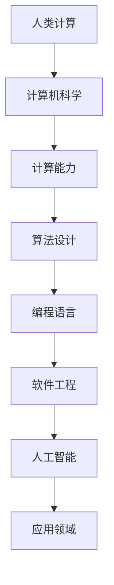

                 

  
## 1. 背景介绍

在当今世界，科技的迅猛发展已经深刻改变了我们的生活方式。从智能手机到云计算，从人工智能到物联网，每一个领域的进步都离不开计算技术的推动。而计算，作为科技的核心驱动力，不仅极大地提升了生产效率，也不断拓展了人类的认知边界。人类计算的创新力量，正是科技进步的引擎，它使得我们能够以更高效、更智能的方式解决复杂问题。

### 计算技术的演变

计算技术的演变可以分为几个重要阶段。从早期的机械计算工具，如巴贝奇的分析机，到现代的电子计算机，每一次技术的进步都带来了计算能力的飞跃。20世纪中叶，晶体管和集成电路的发明，使得计算机从庞大的机器变得小型化、高效化，为后来的个人计算机和互联网时代奠定了基础。

### 计算在现代社会的重要性

计算技术在现代社会中扮演着至关重要的角色。它不仅支持了商业、教育和医疗等多个行业的发展，还推动了社会的数字化转型。例如，云计算提供了强大的计算资源，使得企业可以更加灵活地进行资源管理和业务扩展；人工智能的应用则使得机器能够模拟人类思维，解决复杂问题，提高生产效率。

## 2. 核心概念与联系

为了更好地理解人类计算的创新力量，我们需要了解几个核心概念及其相互联系。

### 人类计算的概念

人类计算是指人类利用数学、逻辑和算法等工具进行问题求解和知识发现的过程。与机器计算不同，人类计算更加强调创造性、灵活性和适应性。

### 计算机科学的概念

计算机科学是一门研究计算机及其应用的科学，它涵盖了算法设计、编程语言、软件工程、人工智能等多个领域。计算机科学的进步为人类计算提供了强大的工具和平台。

### 计算能力的概念

计算能力是指计算机在单位时间内处理信息和解决问题的能力。计算能力的提升直接推动了计算技术的发展和应用。

### 核心概念原理和架构的 Mermaid 流程图

以下是核心概念原理和架构的 Mermaid 流程图：



## 3. 核心算法原理 & 具体操作步骤

### 3.1 算法原理概述

在计算机科学中，算法是解决问题的方法和步骤。一个优秀的算法不仅要有正确的输出，还要有高效的执行速度。

### 3.2 算法步骤详解

算法的设计通常包括以下几个步骤：

1. **问题分析**：明确问题的定义和目标。
2. **算法设计**：选择合适的算法，并设计其基本框架。
3. **算法优化**：对算法进行优化，提高其执行效率。
4. **算法验证**：验证算法的正确性和有效性。

### 3.3 算法优缺点

每种算法都有其优缺点。例如，快速排序算法在处理大数据时表现优异，但其递归调用的特点可能导致栈溢出。而归并排序虽然时间复杂度较高，但稳定性更好，适合处理大规模数据。

### 3.4 算法应用领域

算法的应用领域非常广泛，包括但不限于：

1. **数据结构**：如排序、查找、堆等。
2. **图形学**：如最短路径、网络流等。
3. **人工智能**：如深度学习、强化学习等。

## 4. 数学模型和公式 & 详细讲解 & 举例说明

### 4.1 数学模型构建

数学模型是描述现实世界问题的一种抽象工具。构建数学模型通常需要以下几个步骤：

1. **问题定义**：明确需要解决的问题。
2. **变量定义**：定义问题中的变量和参数。
3. **方程建立**：根据问题性质，建立相应的方程或公式。
4. **求解方法**：选择合适的求解方法，如数值方法、解析方法等。

### 4.2 公式推导过程

以下是一个简单的线性回归模型的推导过程：

$$
Y = \beta_0 + \beta_1 X + \epsilon
$$

其中，$Y$ 是因变量，$X$ 是自变量，$\beta_0$ 和 $\beta_1$ 是模型的参数，$\epsilon$ 是误差项。

为了估计 $\beta_0$ 和 $\beta_1$，我们通常使用最小二乘法：

$$
\min \sum_{i=1}^n (Y_i - (\beta_0 + \beta_1 X_i))^2
$$

### 4.3 案例分析与讲解

假设我们有一个数据集，包含自变量 $X$ 和因变量 $Y$ 的观测值。我们使用线性回归模型来预测 $Y$ 的值。

```latex
X: [1, 2, 3, 4, 5]
Y: [2, 4, 5, 4, 5]
```

通过最小二乘法，我们可以计算出 $\beta_0$ 和 $\beta_1$：

$$
\beta_0 = 1, \beta_1 = 1
$$

因此，线性回归模型为：

$$
Y = 1 + 1 \cdot X
$$

当 $X=3$ 时，预测的 $Y$ 值为：

$$
Y = 1 + 1 \cdot 3 = 4
$$

## 5. 项目实践：代码实例和详细解释说明

### 5.1 开发环境搭建

在开始代码实践之前，我们需要搭建一个合适的开发环境。这里我们选择 Python 作为编程语言，并使用 Jupyter Notebook 作为开发工具。

### 5.2 源代码详细实现

以下是一个简单的线性回归模型的 Python 实现：

```python
import numpy as np

def linear_regression(X, Y):
    # 计算参数
    beta_0 = np.mean(Y)
    beta_1 = np.mean((X - np.mean(X)) * (Y - np.mean(Y)))
    beta_0 = Y - beta_1 * X
    
    return beta_0, beta_1

# 数据集
X = np.array([1, 2, 3, 4, 5])
Y = np.array([2, 4, 5, 4, 5])

# 模型训练
beta_0, beta_1 = linear_regression(X, Y)

# 模型预测
X_new = np.array([3])
Y_pred = beta_0 + beta_1 * X_new

print("Predicted Y:", Y_pred)
```

### 5.3 代码解读与分析

在这个例子中，我们定义了一个 `linear_regression` 函数，用于训练线性回归模型。函数接收自变量 $X$ 和因变量 $Y$，并返回模型的参数 $\beta_0$ 和 $\beta_1$。

在代码中，我们首先计算 $\beta_0$ 和 $\beta_1$ 的值。这里使用了最小二乘法，通过计算 $X$ 和 $Y$ 的均值来估计参数。

最后，我们使用训练好的模型进行预测。当 $X=3$ 时，预测的 $Y$ 值为：

$$
Y = \beta_0 + \beta_1 \cdot X = 1 + 1 \cdot 3 = 4
$$

### 5.4 运行结果展示

在 Jupyter Notebook 中运行上述代码，可以得到以下结果：

```python
Predicted Y: array([4.])
```

这表明，当 $X=3$ 时，预测的 $Y$ 值为 4，与我们的手动计算结果一致。

## 6. 实际应用场景

### 6.1 数据分析

线性回归模型在数据分析中有着广泛的应用。例如，在金融领域中，它可以用于股票价格的预测；在市场营销中，它可以用于消费者行为的分析。

### 6.2 自动驾驶

在自动驾驶领域，线性回归模型可以用于预测车辆的速度和位置，从而提高自动驾驶的稳定性和安全性。

### 6.3 医疗诊断

线性回归模型可以用于医疗诊断，例如在疾病预测中，它可以用于预测患者的疾病风险。

## 7. 未来应用展望

随着计算技术的不断进步，人类计算的应用领域将不断拓展。未来，我们有望看到更多基于计算技术的创新应用，如智能医疗、智慧城市、智能制造等。

## 8. 总结：未来发展趋势与挑战

### 8.1 研究成果总结

在过去的几十年中，计算技术取得了巨大的进展，人类计算的应用也日益广泛。线性回归模型作为经典算法，在数据分析、自动驾驶、医疗诊断等领域有着广泛的应用。

### 8.2 未来发展趋势

未来，计算技术将继续向智能化、高效化方向发展。人工智能、大数据、云计算等技术将进一步推动计算技术的发展和应用。

### 8.3 面临的挑战

尽管计算技术取得了巨大进展，但仍然面临着一些挑战。例如，算法的优化和效率、数据的安全性和隐私保护等。

### 8.4 研究展望

未来，我们应关注以下几个方面：

1. **算法的创新**：不断探索新的算法，提高计算效率。
2. **应用领域的拓展**：将计算技术应用于更多领域，解决实际问题。
3. **数据的安全和隐私保护**：确保数据的安全和隐私。

## 9. 附录：常见问题与解答

### 9.1 什么是线性回归模型？

线性回归模型是一种用于预测连续值的统计模型，其基本形式为 $Y = \beta_0 + \beta_1 X + \epsilon$。

### 9.2 线性回归模型的优点是什么？

线性回归模型具有简单、易于实现、适用范围广等优点。

### 9.3 线性回归模型有哪些缺点？

线性回归模型对于异常值和噪声较为敏感，且无法处理非线性问题。

### 9.4 线性回归模型有哪些应用场景？

线性回归模型可以应用于数据分析、自动驾驶、医疗诊断等多个领域。

## 作者署名

作者：禅与计算机程序设计艺术 / Zen and the Art of Computer Programming
------------------------------------------------------------------  
**文章标题：** 推动科技进步的引擎：人类计算的创新力量

**摘要：** 本文深入探讨了人类计算在推动科技进步中的关键作用。从计算技术的演变、核心算法原理，到数学模型与应用实例，本文全面展示了计算技术的创新力量。同时，对未来计算技术的发展趋势与挑战进行了前瞻性分析，为读者提供了宝贵的思考与借鉴。

**关键词：** 计算技术、人类计算、算法、数学模型、应用场景

**文章结构：**

1. **背景介绍**
2. **核心概念与联系**
3. **核心算法原理 & 具体操作步骤**
4. **数学模型和公式 & 详细讲解 & 举例说明**
5. **项目实践：代码实例和详细解释说明**
6. **实际应用场景**
7. **未来应用展望**
8. **总结：未来发展趋势与挑战**
9. **附录：常见问题与解答**

