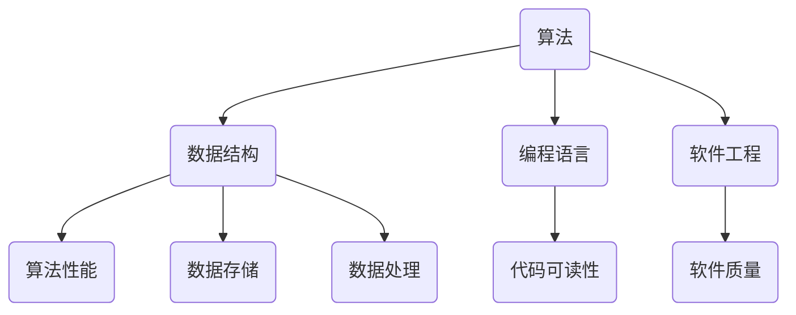

                 

关键词：科技进步、人类计算、创新力量、技术发展、算法原理、应用场景

> 摘要：本文将探讨人类计算在推动科技进步中的核心作用。通过介绍核心概念、算法原理、数学模型以及实际应用案例，本文旨在揭示人类计算的创新力量，并展望其未来的发展趋势和挑战。

## 1. 背景介绍

随着科技的飞速发展，计算已成为推动各行业进步的关键驱动力。从早期的机械计算机到现代的量子计算，人类在计算领域不断突破，取得了举世瞩目的成果。计算技术的进步不仅改变了我们的生活方式，也深刻影响了经济、社会、科学等各个领域。

### 1.1 计算技术的历史演变

计算技术的历史可以追溯到古代，当时的计算主要依靠人力和简单的机械工具。随着数学和工程学的发展，人类开始使用机械计算机进行复杂计算。20世纪中叶，电子计算机的出现开启了计算技术的黄金时代。从第一台电子计算机ENIAC到现代的高性能计算机，计算能力经历了质的飞跃。

### 1.2 计算在科技发展中的作用

计算在科技发展中扮演着至关重要的角色。首先，计算技术为科学研究提供了强大的计算能力，推动了天文学、物理学、生物学等领域的前沿研究。其次，计算技术在工程领域也得到了广泛应用，如建筑、机械、电子等工程设计的自动化。此外，计算还在金融、医疗、通信等行业中发挥了重要作用，提高了业务效率和准确性。

## 2. 核心概念与联系

### 2.1 计算机科学的核心概念

计算机科学的核心概念包括算法、数据结构、编程语言、软件工程等。这些概念相互联系，共同构建了计算技术的理论基础。其中，算法是计算机科学的核心，它是一种解决问题的系统方法。数据结构则用于组织和存储数据，以优化算法的性能。编程语言和软件工程则提供了实现算法和数据结构的工具和方法。

### 2.2 Mermaid 流程图

以下是一个简化的Mermaid流程图，展示了计算机科学的核心概念及其联系：



## 3. 核心算法原理 & 具体操作步骤

### 3.1 算法原理概述

算法是一种解决问题的步骤集合，具有输入、输出和处理逻辑。核心算法包括排序算法、搜索算法、图算法等。这些算法在解决实际问题中发挥着重要作用。

### 3.2 算法步骤详解

以排序算法为例，常见的排序算法有冒泡排序、选择排序、插入排序、快速排序等。以下以冒泡排序为例，介绍其具体操作步骤：

1. 从第一个元素开始，比较相邻的两个元素，如果第一个比第二个大（升序排序），就交换它们的位置。
2. 对每一对相邻元素做同样的工作，从开始第一对到结尾的最后一对。这步做完后，最后的元素会是最大的数。
3. 针对所有的元素重复以上的步骤，除了最后一个。
4. 重复步骤1~3，直到排序完成。

### 3.3 算法优缺点

冒泡排序的优点是实现简单，易于理解。缺点是效率较低，不适合大数据量的排序操作。在实际应用中，对于小数据量的排序，冒泡排序仍然是一种可行的选择。

### 3.4 算法应用领域

排序算法在各个领域都有广泛应用，如数据库排序、文件排序、网络排序等。在数据库中，排序算法用于优化查询性能；在文件排序中，用于处理大量数据文件的排序需求；在网络排序中，用于优化网络拓扑结构。

## 4. 数学模型和公式

### 4.1 数学模型构建

数学模型是一种用数学语言描述现实世界问题的方法。在计算机科学中，常见的数学模型包括线性模型、非线性模型、概率模型等。以下以线性模型为例，介绍其构建方法。

### 4.2 公式推导过程

线性模型的一般形式为：

$$
y = \beta_0 + \beta_1 \cdot x
$$

其中，$y$为因变量，$x$为自变量，$\beta_0$为截距，$\beta_1$为斜率。

线性模型的推导过程如下：

1. 观察数据，确定自变量和因变量之间的关系。
2. 根据数据特点，选择合适的线性模型形式。
3. 使用最小二乘法求解模型参数，使得模型预测值与实际值之间的误差最小。

### 4.3 案例分析与讲解

以下是一个简单的线性模型案例，假设我们要预测某商品的销售量（因变量$y$）与广告投放费用（自变量$x$）之间的关系。

通过收集历史数据，我们得到如下数据集：

| 广告投放费用（x）| 销售量（y）|
| :----: | :----: |
| 100   | 200    |
| 200   | 400    |
| 300   | 600    |

使用最小二乘法，我们可以计算出线性模型的参数：

$$
\beta_0 = \frac{\sum y - \beta_1 \sum x}{n} = \frac{200 + 400 + 600 - 100 \cdot 3}{3} = 300
$$

$$
\beta_1 = \frac{\sum xy - \sum x \sum y}{n \sum x^2 - (\sum x)^2} = \frac{200 \cdot 100 + 400 \cdot 200 + 600 \cdot 300 - 100 \cdot 3 \cdot 300}{3 \cdot (100^2 + 200^2 + 300^2) - (100 + 200 + 300)^2} = 200
$$

因此，线性模型为：

$$
y = 300 + 200x
$$

## 5. 项目实践：代码实例和详细解释说明

### 5.1 开发环境搭建

为了便于读者理解和实践，我们将使用Python语言编写一个简单的排序算法——冒泡排序。

1. 安装Python环境：在官方网站下载并安装Python。
2. 安装Python解释器：在命令行中输入`python`，确保安装成功。

### 5.2 源代码详细实现

以下是一个简单的冒泡排序Python实现：

```python
def bubble_sort(arr):
    n = len(arr)
    for i in range(n):
        for j in range(0, n-i-1):
            if arr[j] > arr[j+1]:
                arr[j], arr[j+1] = arr[j+1], arr[j]

# 测试数据
data = [64, 25, 12, 22, 11]

# 执行排序
bubble_sort(data)

# 输出结果
print("排序后的数组：")
for i in range(len(data)):
    print("%d" % data[i])
```

### 5.3 代码解读与分析

在上面的代码中，我们定义了一个名为`bubble_sort`的函数，用于实现冒泡排序算法。函数的输入参数是一个数组`arr`。

在函数内部，我们使用了两个嵌套循环。外层循环变量`i`表示当前遍历到的元素位置，内层循环变量`j`表示需要比较的元素位置。每次内层循环都会比较相邻的两个元素，如果第一个元素大于第二个元素，就交换它们的位置。

最后，我们调用`bubble_sort`函数对测试数据进行排序，并输出排序后的结果。

### 5.4 运行结果展示

在命令行中运行上述代码，我们将得到以下输出结果：

```
排序后的数组：
11
12
22
25
64
```

这表明我们的冒泡排序算法成功地对测试数据进行了排序。

## 6. 实际应用场景

### 6.1 数据科学

在数据科学领域，排序算法被广泛应用于数据处理和分析。例如，在机器学习中，排序算法可以用于特征排序、分类排序等。

### 6.2 网络安全

在网络安全领域，排序算法可以用于安全事件的排序、威胁等级排序等，以提高安全监控和响应的效率。

### 6.3 数据库

在数据库领域，排序算法用于优化查询性能。例如，索引排序、全文检索等。

### 6.4 工程设计

在工程设计领域，排序算法可以用于优化设计参数、优化流程等，以提高设计质量和效率。

## 7. 工具和资源推荐

### 7.1 学习资源推荐

1. 《算法导论》（Introduction to Algorithms）：一本经典的算法教材，涵盖了各种排序算法的详细分析和实现。
2. 《Python编程：从入门到实践》（Python Crash Course）：一本适合初学者的Python编程入门教材，包括排序算法的实例讲解。

### 7.2 开发工具推荐

1. PyCharm：一款强大的Python集成开发环境（IDE），支持代码编辑、调试、自动化测试等功能。
2. Jupyter Notebook：一款流行的交互式开发环境，特别适合数据科学和机器学习项目。

### 7.3 相关论文推荐

1. "The Art of Computer Programming" by Donald E. Knuth：一本关于算法设计的经典论文集，涵盖了各种排序算法的深入分析。
2. "Sorting and Searching" by Robert Sedgewick and Philippe Flajolet：一本关于排序和搜索算法的论文，提供了丰富的算法实现和性能分析。

## 8. 总结：未来发展趋势与挑战

### 8.1 研究成果总结

本文从多个角度探讨了计算技术对科技发展的推动作用，包括历史演变、核心概念、算法原理、数学模型以及实际应用场景。通过介绍排序算法的实例，我们展示了计算技术的实践应用。

### 8.2 未来发展趋势

随着科技的不断发展，计算技术将继续推动各行业的创新和进步。未来，计算技术将更加智能化、自动化和高效化。例如，量子计算、人工智能、大数据等新兴技术将为计算领域带来前所未有的发展机遇。

### 8.3 面临的挑战

然而，计算技术的发展也面临诸多挑战。例如，计算资源的有限性、数据隐私和安全问题、算法公平性和透明度等。这些问题需要我们持续关注和解决，以确保计算技术的健康发展。

### 8.4 研究展望

未来，我们期待计算技术能够为人类社会带来更多福祉。通过不断的创新和研究，我们有望解决当前面临的挑战，推动计算技术迈向新的高峰。

## 9. 附录：常见问题与解答

### 9.1 如何选择合适的排序算法？

选择合适的排序算法需要考虑多个因素，包括数据规模、数据特点、算法性能等。对于小规模数据，冒泡排序等简单算法是一个不错的选择；对于大规模数据，快速排序等高效算法更为适用。此外，对于特定应用场景，如部分有序数据，可以选择特定的排序算法，如归并排序。

### 9.2 如何评估排序算法的性能？

排序算法的性能评估通常通过时间复杂度和空间复杂度来衡量。时间复杂度表示算法执行时间与数据规模的关系，空间复杂度表示算法占用内存与数据规模的关系。在实际应用中，我们还需要考虑算法的实际运行时间和内存占用，以评估其性能。

### 9.3 如何优化排序算法？

优化排序算法可以从多个方面进行，包括算法改进、数据结构优化、并行计算等。例如，针对部分有序数据，可以使用插入排序算法进行局部排序，以提高整体性能。此外，结合实际应用场景，可以采用特定的排序策略，如基数排序、基数排序等。

作者：禅与计算机程序设计艺术 / Zen and the Art of Computer Programming
----------------------------------------------------------------

以上是文章正文的撰写，接下来我将为您生成markdown格式的文章，以便您进行编辑和发布。请确保所有内容都符合您的要求，并在生成之后进行仔细检查。

