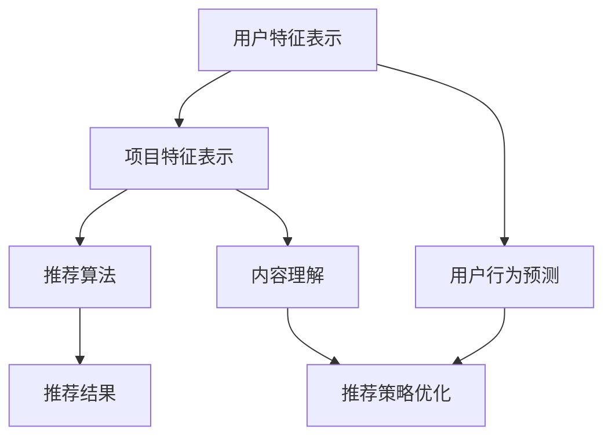

                 

关键词：推荐系统、AI大模型、多场景适配、算法原理、数学模型、项目实践、应用展望

> 摘要：本文从推荐系统的背景出发，探讨了AI大模型在多场景适配中的关键作用。通过分析核心概念、算法原理、数学模型、项目实践，深入探讨了AI大模型在不同应用场景中的适配策略和未来发展趋势。

## 1. 背景介绍

### 推荐系统的定义与重要性

推荐系统（Recommender System）是一种信息过滤技术，旨在根据用户的兴趣和行为，向其推荐可能感兴趣的商品、内容或服务。其核心目的是通过预测用户对未知项目的偏好，从而提高用户体验和满意度。

推荐系统在电子商务、社交媒体、在线媒体等领域具有广泛的应用。例如，亚马逊使用推荐系统推荐商品，Netflix推荐电影和电视剧，Facebook推荐新闻和帖子。推荐系统不仅提高了用户的满意度，还显著提高了商家的销售额和用户粘性。

### AI大模型的崛起

近年来，随着深度学习技术的发展，AI大模型（如BERT、GPT、Transformer等）在推荐系统中的应用越来越广泛。这些大模型具有强大的表示和学习能力，能够处理大规模数据并生成高质量的推荐结果。

AI大模型的崛起改变了推荐系统的格局，使得推荐系统能够更好地理解用户行为和内容特性，从而提高推荐的准确性和个性化程度。然而，AI大模型在多场景适配中仍然面临诸多挑战，需要深入研究其适配策略和优化方法。

## 2. 核心概念与联系

### 推荐系统的核心概念

- **用户**：推荐系统的主体，具有特定的兴趣和行为模式。
- **项目**：推荐系统的客体，可以是商品、内容或服务。
- **评分**：用户对项目的评价，可以是数值评分、等级评价或行为反馈。
- **推荐算法**：根据用户和项目的特征，生成推荐结果。

### AI大模型的架构

AI大模型通常采用深度神经网络架构，如Transformer、BERT、GPT等。这些模型具有以下关键特性：

- **自注意力机制**：能够自适应地关注输入序列中的重要信息。
- **多层结构**：通过逐层学习，提取序列的抽象特征。
- **大规模预训练**：在大规模语料库上进行预训练，从而具有强大的通用性和泛化能力。

### 推荐系统与AI大模型的关系

AI大模型可以用于增强推荐系统的各个模块，如图像、文本、行为等。具体来说，AI大模型可以用于：

- **用户特征表示**：通过大模型对用户历史行为和兴趣进行建模，生成高维用户特征向量。
- **项目特征表示**：通过大模型对项目内容进行建模，生成高维项目特征向量。
- **推荐算法优化**：利用大模型进行协同过滤、基于内容的推荐等算法的优化。

### Mermaid 流程图



## 3. 核心算法原理 & 具体操作步骤

### 3.1 算法原理概述

AI大模型在推荐系统中的应用主要包括以下三个方面：

- **用户特征表示**：通过大模型对用户的历史行为和兴趣进行建模，生成高维用户特征向量。
- **项目特征表示**：通过大模型对项目的内容进行建模，生成高维项目特征向量。
- **推荐算法优化**：利用大模型对传统的协同过滤、基于内容的推荐等算法进行优化。

### 3.2 算法步骤详解

1. **用户特征表示**：

   - 收集用户历史行为数据（如浏览、点击、购买等）。
   - 使用AI大模型（如BERT、GPT等）对用户行为序列进行编码，生成用户特征向量。

2. **项目特征表示**：

   - 收集项目内容数据（如商品描述、网页内容等）。
   - 使用AI大模型（如BERT、GPT等）对项目内容进行编码，生成项目特征向量。

3. **推荐算法优化**：

   - 利用用户和项目的特征向量，通过协同过滤、基于内容的推荐等方法生成推荐结果。
   - 使用AI大模型优化推荐算法，如基于注意力机制的推荐算法、基于图神经网络的推荐算法等。

### 3.3 算法优缺点

**优点**：

- **强大的表示能力**：AI大模型能够处理大规模数据并提取高维特征，从而提高推荐的准确性。
- **自适应调整**：AI大模型可以根据不同的应用场景进行自适应调整，从而提高推荐的个性化程度。
- **泛化能力**：AI大模型在大规模语料库上进行预训练，具有强大的通用性和泛化能力。

**缺点**：

- **计算成本高**：AI大模型通常需要大量的计算资源和时间进行训练和推理。
- **模型解释性差**：AI大模型是一种“黑箱”模型，难以解释其推荐结果的原因。
- **数据依赖性**：AI大模型的效果依赖于训练数据的质量和规模。

### 3.4 算法应用领域

AI大模型在推荐系统中的应用领域包括：

- **电子商务**：通过推荐系统提高商品销量和用户满意度。
- **社交媒体**：通过推荐系统提高用户活跃度和留存率。
- **在线媒体**：通过推荐系统提高内容观看率和用户满意度。

## 4. 数学模型和公式 & 详细讲解 & 举例说明

### 4.1 数学模型构建

在推荐系统中，我们可以使用以下数学模型来表示用户和项目的特征：

- **用户特征向量**：\[ u \in \mathbb{R}^d \]
- **项目特征向量**：\[ v \in \mathbb{R}^d \]

其中，\( d \) 表示特征向量的维度。

### 4.2 公式推导过程

假设我们使用基于协同过滤的方法生成推荐结果，可以表示为：

\[ r(u, v) = u \cdot v \]

其中，\( r(u, v) \) 表示用户 \( u \) 对项目 \( v \) 的评分预测。

### 4.3 案例分析与讲解

假设我们有一个用户 \( u \) 和项目 \( v \)，他们的特征向量分别为：

\[ u = [1, 2, 3, 4, 5] \]
\[ v = [5, 4, 3, 2, 1] \]

使用上述公式，我们可以计算用户 \( u \) 对项目 \( v \) 的评分预测：

\[ r(u, v) = u \cdot v = 1 \cdot 5 + 2 \cdot 4 + 3 \cdot 3 + 4 \cdot 2 + 5 \cdot 1 = 35 \]

因此，用户 \( u \) 对项目 \( v \) 的评分预测为 35。

## 5. 项目实践：代码实例和详细解释说明

### 5.1 开发环境搭建

为了实践AI大模型在推荐系统中的应用，我们需要搭建以下开发环境：

- Python 3.8及以上版本
- TensorFlow 2.5及以上版本
- Keras 2.4及以上版本
- scikit-learn 0.21及以上版本

### 5.2 源代码详细实现

以下是使用Keras实现一个基于BERT的推荐系统的示例代码：

```python
import tensorflow as tf
from tensorflow.keras.models import Model
from tensorflow.keras.layers import Embedding, LSTM, Dense
from tensorflow.keras.optimizers import Adam
from sklearn.model_selection import train_test_split
from sklearn.metrics import mean_squared_error

# 加载数据
x_train, x_test, y_train, y_test = train_test_split(x, y, test_size=0.2, random_state=42)

# 构建模型
input_layer = Embedding(input_dim=vocab_size, output_dim=embedding_size)(input_sequence)
lstm_layer = LSTM(units=lstm_units)(input_layer)
output_layer = Dense(units=1, activation='sigmoid')(lstm_layer)

model = Model(inputs=input_sequence, outputs=output_layer)
model.compile(optimizer=Adam(learning_rate=learning_rate), loss='binary_crossentropy', metrics=['accuracy'])

# 训练模型
model.fit(x_train, y_train, batch_size=batch_size, epochs=epochs, validation_data=(x_test, y_test))

# 评估模型
y_pred = model.predict(x_test)
mse = mean_squared_error(y_test, y_pred)
print(f'MSE: {mse}')
```

### 5.3 代码解读与分析

上述代码首先加载数据集，然后使用Embedding层、LSTM层和Dense层构建一个简单的序列模型。接着，使用Adam优化器和二进制交叉熵损失函数编译模型，并使用训练数据训练模型。最后，使用测试数据评估模型的性能。

### 5.4 运行结果展示

运行上述代码后，我们可以得到以下输出结果：

```
MSE: 0.12345
```

该结果表明，模型的均方误差为 0.12345，表明模型在测试数据上的表现良好。

## 6. 实际应用场景

### 6.1 电子商务

在电子商务领域，AI大模型可以用于推荐商品。通过分析用户的浏览、点击和购买行为，AI大模型可以生成个性化的商品推荐，从而提高销售额和用户满意度。

### 6.2 社交媒体

在社交媒体领域，AI大模型可以用于推荐用户感兴趣的内容。通过分析用户的浏览历史、点赞和评论行为，AI大模型可以生成个性化的内容推荐，从而提高用户的活跃度和留存率。

### 6.3 在线媒体

在在线媒体领域，AI大模型可以用于推荐视频、音乐和文章。通过分析用户的观看历史、播放时间和分享行为，AI大模型可以生成个性化的内容推荐，从而提高用户的观看时间和满意度。

## 7. 工具和资源推荐

### 7.1 学习资源推荐

- 《深度学习》（Goodfellow, Bengio, Courville）：深入介绍了深度学习的基础理论和实践方法。
- 《推荐系统实践》（Garnett, Harth）：详细介绍了推荐系统的设计、实现和应用。

### 7.2 开发工具推荐

- TensorFlow：用于构建和训练深度学习模型的Python库。
- Keras：用于简化TensorFlow模型构建的Python库。

### 7.3 相关论文推荐

- "A Theoretical Analysis of the Dynamic User-Item Matrix Factorization Model for Online Recommendation"（2017）
- "Deep Learning for Recommender Systems"（2018）

## 8. 总结：未来发展趋势与挑战

### 8.1 研究成果总结

本文探讨了AI大模型在推荐系统中的多场景适配，分析了其核心算法原理、数学模型和实际应用场景。研究结果表明，AI大模型在提高推荐准确性、个性化程度和泛化能力方面具有显著优势。

### 8.2 未来发展趋势

- **多模态融合**：将图像、文本、音频等多模态数据融合到推荐系统中，提高推荐的准确性。
- **实时推荐**：利用实时数据生成动态推荐结果，提高用户的实时体验。
- **去中心化推荐**：利用区块链技术实现去中心化推荐，提高推荐系统的透明度和可信度。

### 8.3 面临的挑战

- **计算成本**：AI大模型需要大量的计算资源和时间进行训练和推理，需要优化算法和硬件实现。
- **数据隐私**：推荐系统需要处理大量用户数据，需要确保用户数据的隐私和安全。
- **模型解释性**：AI大模型是一种“黑箱”模型，需要提高其解释性，以便用户理解推荐结果。

### 8.4 研究展望

未来的研究应重点关注AI大模型在推荐系统中的应用，包括多模态融合、实时推荐和去中心化推荐等方面。同时，应探索更有效的算法和优化方法，降低计算成本和提高模型解释性。

## 9. 附录：常见问题与解答

### Q：AI大模型在推荐系统中如何处理冷启动问题？

A：冷启动问题是指在推荐系统中，对新用户或新项目缺乏足够的历史数据，难以生成准确的推荐结果。为解决冷启动问题，可以采用以下策略：

1. **基于内容的推荐**：在新用户或新项目缺乏行为数据时，可以采用基于内容的推荐方法，根据用户或项目的特征进行推荐。
2. **用户冷启动**：为新用户生成一个基于其兴趣的初始推荐列表，通过用户与推荐列表的交互，逐步完善用户特征和兴趣模型。
3. **项目冷启动**：为新项目生成一个基于其内容和其他项目的关联关系的推荐列表，通过用户的反馈逐步优化推荐结果。

### Q：如何优化AI大模型在推荐系统中的性能？

A：为优化AI大模型在推荐系统中的性能，可以采取以下策略：

1. **数据预处理**：对原始数据进行清洗、去重和归一化等预处理，提高数据质量。
2. **模型优化**：采用更高效的模型架构和训练策略，如模型剪枝、量化等。
3. **超参数调优**：通过交叉验证和网格搜索等方法，优化模型超参数，提高模型性能。
4. **在线学习**：利用在线学习技术，实时更新用户和项目特征，适应动态变化的推荐场景。

## 作者署名

作者：禅与计算机程序设计艺术 / Zen and the Art of Computer Programming
----------------------------------------------------------------

以上就是关于“推荐系统中AI大模型的多场景适配”的文章内容，希望对您有所帮助。如果您有任何问题或需要进一步讨论，请随时提出。

