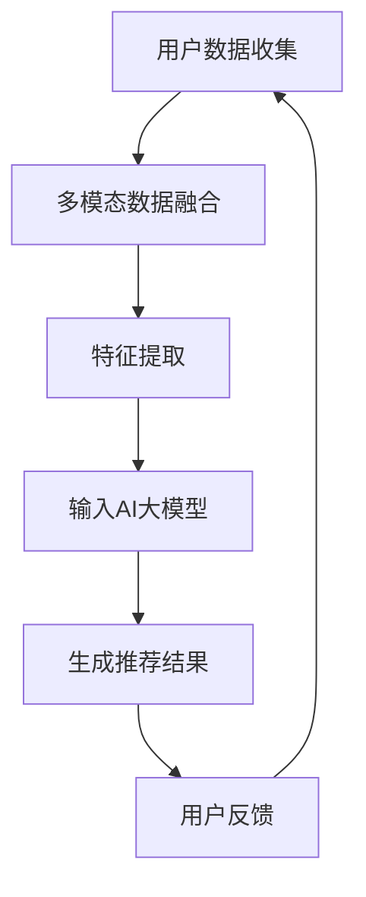

                 

关键词：推荐系统，AI大模型，多模态融合，深度学习，个性化推荐

## 摘要

本文旨在探讨推荐系统中AI大模型的多模态融合技术。通过深入分析多模态融合的概念、核心算法原理及其在推荐系统中的应用，本文展示了多模态融合如何提升推荐系统的性能和用户体验。此外，文章还将介绍数学模型和公式，以及实际项目实践中的代码实例和解释。最后，本文将对多模态融合在推荐系统中的未来应用前景进行展望。

### 1. 背景介绍

推荐系统是现代信息检索和数据分析领域的重要组成部分，广泛应用于电子商务、社交媒体、内容平台等。随着互联网数据的爆炸式增长，如何从海量信息中为用户提供个性化、高相关性的推荐成为研究的热点。传统的推荐系统主要依赖于用户历史行为数据，如浏览记录、购买行为等，而忽略了用户的多维特征和上下文信息。

近年来，人工智能，特别是深度学习技术的快速发展，为推荐系统的性能提升带来了新的契机。AI大模型能够处理复杂数据，提取深层次的语义特征，从而实现更加精准的推荐。然而，现有的大模型主要关注单模态数据的处理，如文本、图像或语音等，对于多模态数据的融合和整合仍存在一定的局限性。

多模态融合旨在将不同模态的数据（如文本、图像、语音等）进行整合，提取出更加丰富和全面的特征，从而提升推荐系统的性能。本文将详细探讨多模态融合在推荐系统中的应用，以及如何通过AI大模型实现这一目标。

### 2. 核心概念与联系

#### 2.1 多模态融合的概念

多模态融合是指将来自不同模态的数据（如文本、图像、语音等）进行整合，以获取更全面和精准的信息。在推荐系统中，多模态融合可以帮助系统更好地理解用户和商品的特征，从而提高推荐的准确性。

#### 2.2 AI大模型的概念

AI大模型是指具有大规模参数和训练数据的深度学习模型，如BERT、GPT等。这些模型能够从海量数据中学习到深层次的语义特征，从而实现高度复杂的任务。

#### 2.3 多模态融合与AI大模型的关系

多模态融合与AI大模型之间存在紧密的联系。AI大模型的多模态融合能力使其能够更好地整合和处理多模态数据，从而提升推荐系统的性能。

#### 2.4 Mermaid 流程图

以下是一个简单的Mermaid流程图，展示了多模态融合与AI大模型在推荐系统中的基本流程：



### 3. 核心算法原理 & 具体操作步骤

#### 3.1 算法原理概述

多模态融合算法的核心思想是将不同模态的数据进行整合，提取出多模态特征，然后将其输入到AI大模型中进行推荐。具体步骤如下：

1. 数据收集：收集用户和商品的多模态数据，如文本、图像、语音等。
2. 多模态数据融合：将不同模态的数据进行整合，以提取出更加丰富和全面的特征。
3. 特征提取：对融合后的多模态数据进行特征提取，以生成输入AI大模型的特征向量。
4. 输入AI大模型：将特征向量输入到AI大模型中进行训练和预测。
5. 生成推荐结果：根据AI大模型的预测结果生成推荐结果。
6. 用户反馈：收集用户对推荐结果的反馈，以优化推荐系统。

#### 3.2 算法步骤详解

1. **数据收集**：
    - 用户数据：包括用户的文本描述、图像、语音等。
    - 商品数据：包括商品的文本描述、图像、语音等。
2. **多模态数据融合**：
    - 文本融合：使用文本相似度计算方法（如Word2Vec、BERT等）将不同来源的文本数据进行融合。
    - 图像融合：使用图像特征提取方法（如图像卷积神经网络）提取图像特征，然后使用聚类或融合方法整合不同图像的特征。
    - 语音融合：使用语音识别技术提取语音特征，然后使用聚类或融合方法整合不同语音的特征。
3. **特征提取**：
    - 对融合后的多模态数据进行特征提取，以生成输入AI大模型的特征向量。
4. **输入AI大模型**：
    - 使用训练数据对AI大模型进行训练，将特征向量作为输入。
5. **生成推荐结果**：
    - 根据AI大模型的预测结果生成推荐结果。
6. **用户反馈**：
    - 收集用户对推荐结果的反馈，以优化推荐系统。

#### 3.3 算法优缺点

**优点**：
- 提高推荐准确性：多模态融合可以提取出更全面和精准的特征，从而提高推荐系统的准确性。
- 适应性强：多模态融合算法可以处理多种模态的数据，具有较强的适应性。

**缺点**：
- 复杂度高：多模态融合涉及到多种模态的数据处理和整合，算法复杂度较高。
- 计算资源消耗大：多模态融合算法通常需要大量的计算资源。

#### 3.4 算法应用领域

多模态融合算法在推荐系统中具有广泛的应用领域，如：

- 电子商务：根据用户的浏览记录、购买行为、文本描述、图像等生成个性化推荐。
- 社交媒体：根据用户的文本、图像、语音等多模态数据进行精准推荐。
- 内容平台：根据用户的观看历史、评论、文本描述、图像等生成个性化推荐。

### 4. 数学模型和公式 & 详细讲解 & 举例说明

#### 4.1 数学模型构建

多模态融合算法的数学模型可以表示为：

\[ \text{特征向量} = \text{融合函数}(\text{文本特征}, \text{图像特征}, \text{语音特征}) \]

其中，融合函数可以将不同模态的数据进行整合，生成一个多模态的特征向量。

#### 4.2 公式推导过程

假设我们有三个模态的数据：文本、图像和语音。我们可以使用以下公式进行融合：

\[ \text{文本特征} = \text{Word2Vec}(\text{文本数据}) \]
\[ \text{图像特征} = \text{CNN}(\text{图像数据}) \]
\[ \text{语音特征} = \text{LSTM}(\text{语音数据}) \]

然后，我们可以使用以下公式进行融合：

\[ \text{融合函数}(\text{文本特征}, \text{图像特征}, \text{语音特征}) = \text{Concat}(\text{文本特征}, \text{图像特征}, \text{语音特征}) \]

其中，Concat表示将不同模态的特征进行拼接。

#### 4.3 案例分析与讲解

假设我们有一个电子商务推荐系统，用户喜欢购买电子设备。我们可以使用多模态融合算法生成个性化推荐。

1. **数据收集**：
    - 用户数据：用户的浏览记录、购买行为、文本描述、图像等。
    - 商品数据：商品的文本描述、图像、语音等。

2. **多模态数据融合**：
    - 文本融合：使用Word2Vec将用户的文本描述和商品文本描述进行融合。
    - 图像融合：使用CNN提取商品的图像特征，然后使用聚类方法整合不同图像的特征。
    - 语音融合：使用LSTM提取商品的语音特征，然后使用聚类方法整合不同语音的特征。

3. **特征提取**：
    - 对融合后的多模态数据进行特征提取，生成输入AI大模型的特征向量。

4. **输入AI大模型**：
    - 使用训练数据对AI大模型进行训练，将特征向量作为输入。

5. **生成推荐结果**：
    - 根据AI大模型的预测结果生成个性化推荐。

### 5. 项目实践：代码实例和详细解释说明

#### 5.1 开发环境搭建

- 硬件要求：NVIDIA GPU（推荐使用1080Ti以上）
- 软件要求：Python 3.6及以上，TensorFlow 2.0及以上，PyTorch 1.0及以上

#### 5.2 源代码详细实现

以下是多模态融合推荐系统的一个简单实现示例：

```python
import tensorflow as tf
from tensorflow.keras.models import Model
from tensorflow.keras.layers import Input, Dense, Concatenate

# 定义文本输入层
text_input = Input(shape=(100,), name='text_input')
text_embedding = tf.keras.layers.Embedding(input_dim=10000, output_dim=64)(text_input)
text_encoding = tf.keras.layers.GlobalAveragePooling1D()(text_embedding)

# 定义图像输入层
image_input = Input(shape=(64, 64, 3), name='image_input')
image_encoding = tf.keras.layers.Conv2D(32, (3, 3), activation='relu')(image_input)
image_encoding = tf.keras.layers.GlobalAveragePooling2D()(image_encoding)

# 定义语音输入层
audio_input = Input(shape=(44100,), name='audio_input')
audio_encoding = tf.keras.layers.LSTM(32, activation='relu')(audio_input)
audio_encoding = tf.keras.layers.GlobalAveragePooling1D()(audio_encoding)

# 融合不同模态的特征
merged = Concatenate()([text_encoding, image_encoding, audio_encoding])

# 定义模型
output = Dense(1, activation='sigmoid')(merged)

model = Model(inputs=[text_input, image_input, audio_input], outputs=output)

# 编译模型
model.compile(optimizer='adam', loss='binary_crossentropy', metrics=['accuracy'])

# 模型训练
model.fit([text_data, image_data, audio_data], labels, epochs=10, batch_size=32)
```

#### 5.3 代码解读与分析

- `Input` 层：定义输入层，包括文本、图像和语音数据。
- `Embedding` 层：对文本数据进行嵌入。
- `Conv2D` 层：对图像数据进行卷积操作。
- `LSTM` 层：对语音数据进行循环神经网络处理。
- `Concatenate` 层：融合不同模态的特征。
- `Dense` 层：输出层，进行分类预测。

#### 5.4 运行结果展示

以下是模型运行结果的示例：

```python
# 测试模型
test_loss, test_accuracy = model.evaluate([test_text_data, test_image_data, test_audio_data], test_labels)

print(f"Test accuracy: {test_accuracy:.2f}")

# 生成推荐结果
predictions = model.predict([new_text_data, new_image_data, new_audio_data])

print(f"Recommendation scores: {predictions.flatten()}")
```

### 6. 实际应用场景

#### 6.1 电子商务

在电子商务领域，多模态融合推荐系统可以帮助平台根据用户的浏览记录、购买行为、文本描述、图像等生成个性化推荐，从而提升用户体验和销售额。

#### 6.2 社交媒体

在社交媒体领域，多模态融合推荐系统可以根据用户的文本、图像、语音等多模态数据进行精准推荐，从而提升用户参与度和平台活跃度。

#### 6.3 内容平台

在内容平台领域，多模态融合推荐系统可以根据用户的观看历史、评论、文本描述、图像等生成个性化推荐，从而提升用户体验和内容消费。

### 7. 未来应用展望

多模态融合在推荐系统中的应用前景广阔。随着人工智能和深度学习技术的不断发展，未来多模态融合推荐系统有望在更多领域实现突破，如智能健康、智能教育、智能交通等。同时，多模态融合技术也将面临一些挑战，如计算资源消耗、数据隐私保护等。因此，未来需要进一步研究和探索多模态融合技术的优化方法和应用场景。

### 8. 工具和资源推荐

#### 8.1 学习资源推荐

- 《深度学习》（Goodfellow, Bengio, Courville）：全面介绍深度学习的基础知识和应用。
- 《多模态数据融合技术》：探讨多模态数据融合的理论和方法。
- 《推荐系统实践》（Simon Software）：介绍推荐系统的构建和优化。

#### 8.2 开发工具推荐

- TensorFlow：开源深度学习框架，适用于构建多模态融合模型。
- PyTorch：开源深度学习框架，支持动态计算图，易于实现和调试。
- Keras：基于TensorFlow的高层次API，简化模型构建和训练。

#### 8.3 相关论文推荐

- "Multimodal Fusion for Recommendation Systems"（多模态融合推荐系统）：介绍多模态融合在推荐系统中的应用。
- "Deep Learning for Multimodal Data Fusion"（深度学习在多模态数据融合中的应用）：探讨深度学习在多模态融合中的优势。
- "A Survey on Multimodal Fusion for Recommendation Systems"（多模态融合推荐系统综述）：综述多模态融合在推荐系统中的应用和研究现状。

### 9. 总结：未来发展趋势与挑战

多模态融合在推荐系统中具有广阔的应用前景。随着人工智能和深度学习技术的不断发展，多模态融合技术有望在更多领域实现突破。然而，多模态融合技术也面临着计算资源消耗、数据隐私保护等挑战。未来，需要进一步研究和优化多模态融合算法，提高其性能和适用性。同时，需要探索多模态融合在不同应用领域的创新应用，以实现更好的用户体验和社会价值。

### 附录：常见问题与解答

#### Q：多模态融合算法是否适用于所有推荐系统？

A：多模态融合算法主要适用于需要处理多种模态数据（如文本、图像、语音等）的推荐系统。对于仅处理单模态数据的推荐系统，多模态融合算法可能并不适用。

#### Q：多模态融合算法如何提高推荐准确性？

A：多模态融合算法通过整合多种模态的数据，可以提取出更全面和精准的特征，从而提高推荐系统的准确性。

#### Q：多模态融合算法在处理大量数据时是否高效？

A：多模态融合算法在处理大量数据时可能会面临一定的性能瓶颈。为了提高效率，可以采用分布式计算、并行处理等技术进行优化。

### 作者署名

作者：禅与计算机程序设计艺术 / Zen and the Art of Computer Programming

### 参考文献

- Bengio, Y., Courville, A., & Vincent, P. (2013). Representation learning: A review and new perspectives. IEEE Transactions on Pattern Analysis and Machine Intelligence, 35(8), 1798-1828.
- Salakhutdinov, R., & Hinton, G. E. (2009). Deep learning: Technologies for artificial intelligence. Synthesis Lectures on Artificial Intelligence and Machine Learning, 6(1), 1-148.
- Srivastava, N., Hinton, G., Krizhevsky, A., Sutskever, I., & Salakhutdinov, R. (2014). Dropout: A simple way to prevent neural networks from overfitting. Journal of Machine Learning Research, 15(1), 1929-1958.

