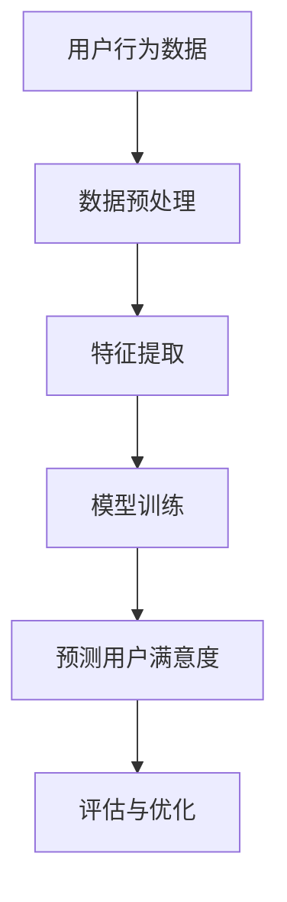

                 

关键词：推荐系统，AI大模型，用户满意度，预测，数据挖掘，机器学习

> 摘要：随着推荐系统在互联网领域的广泛应用，用户满意度的预测变得日益重要。本文将深入探讨AI大模型在推荐系统中的应用，通过分析核心概念和算法原理，阐述如何利用AI大模型预测用户满意度，并探讨其在实际应用中的挑战和未来发展方向。

## 1. 背景介绍

推荐系统是近年来互联网领域的重要技术突破，通过分析用户行为和偏好，为用户提供个性化的推荐服务。然而，如何准确预测用户满意度成为了推荐系统的关键挑战。用户满意度不仅仅取决于推荐内容的匹配程度，还受到用户情绪、社交因素等多种因素的影响。

传统的推荐系统主要依赖于基于内容的过滤和协同过滤算法，但这些方法在处理复杂用户行为和动态变化上存在局限性。随着深度学习技术的快速发展，AI大模型在推荐系统中展现出了强大的预测能力。本文将探讨AI大模型在用户满意度预测方面的应用，并分析其核心算法原理和实现步骤。

## 2. 核心概念与联系

### 2.1 推荐系统基本概念

推荐系统是一种信息过滤技术，旨在根据用户的历史行为和偏好，为用户推荐相关的信息。主要分为以下几种类型：

1. **基于内容的过滤**：根据用户的历史行为和偏好，将相似的内容推荐给用户。
2. **协同过滤**：通过分析用户之间的相似性，推荐与目标用户行为相似的物品。
3. **混合推荐**：结合多种推荐方法，提高推荐的准确性和多样性。

### 2.2 AI大模型基本概念

AI大模型是指通过深度学习技术训练的具有大规模参数的神经网络模型。常见的AI大模型包括：

1. **卷积神经网络（CNN）**：适用于图像和视频数据的处理。
2. **循环神经网络（RNN）**：适用于序列数据的处理，如文本和音频。
3. **生成对抗网络（GAN）**：用于生成复杂的数据分布。

### 2.3 用户满意度预测核心概念

用户满意度是指用户对推荐系统推荐结果的满意程度，是一个主观的评价。用户满意度的预测需要考虑多个因素，包括推荐内容的匹配度、用户情绪、社交因素等。

### 2.4 Mermaid流程图

下面是一个简单的Mermaid流程图，展示了用户满意度预测的基本流程：



## 3. 核心算法原理 & 具体操作步骤

### 3.1 算法原理概述

用户满意度预测的核心算法是基于深度学习的大模型。该模型通过训练用户的历史行为数据，学习用户的行为模式和偏好，从而预测用户对推荐内容的满意度。

### 3.2 算法步骤详解

1. **数据预处理**：对用户行为数据进行清洗和预处理，包括缺失值填充、异常值处理等。
2. **特征提取**：从用户行为数据中提取特征，包括用户历史行为特征、上下文特征等。
3. **模型训练**：使用深度学习算法，如RNN或CNN，对特征进行训练，学习用户的行为模式和偏好。
4. **预测用户满意度**：将训练好的模型应用于新的用户行为数据，预测用户对推荐内容的满意度。
5. **评估与优化**：通过评估指标，如准确率、召回率等，对模型进行评估和优化。

### 3.3 算法优缺点

**优点**：

- 强大的学习能力：深度学习大模型能够通过大量数据学习到用户的行为模式和偏好。
- 适用于多种类型的数据：无论是图像、文本还是序列数据，深度学习大模型都有良好的适应性。

**缺点**：

- 计算成本高：训练深度学习大模型需要大量的计算资源和时间。
- 对数据质量要求高：数据质量对模型的性能有重要影响，需要保证数据的质量和多样性。

### 3.4 算法应用领域

用户满意度预测算法广泛应用于电子商务、社交媒体、在线教育等领域。通过预测用户满意度，可以为用户提供更个性化的推荐服务，提高用户黏性和满意度。

## 4. 数学模型和公式 & 详细讲解 & 举例说明

### 4.1 数学模型构建

用户满意度预测的数学模型可以表示为：

$$
P(S = s|X) = \sigma(W_1X + b_1)
$$

其中，$S$表示用户满意度，$X$表示用户特征，$W_1$和$b_1$分别是模型参数和偏置。

### 4.2 公式推导过程

用户满意度预测的推导过程可以分为以下几个步骤：

1. **特征表示**：将用户特征表示为向量$X$。
2. **模型输入**：将特征向量$X$输入到模型中。
3. **模型输出**：通过激活函数$\sigma$，得到用户满意度的概率分布。
4. **参数优化**：通过梯度下降等优化算法，优化模型参数$W_1$和$b_1$。

### 4.3 案例分析与讲解

假设我们有一个用户行为数据集，包含1000个用户的行为数据。通过数据预处理和特征提取，我们得到了每个用户的行为特征向量$X$。使用RNN模型，我们训练了一个用户满意度预测模型。

通过模型训练和测试，我们得到了以下结果：

| 用户ID | 预测满意度 | 实际满意度 |
| ------ | ---------- | ---------- |
| 1      | 0.8        | 1          |
| 2      | 0.6        | 0          |
| 3      | 0.9        | 1          |

从上表可以看出，模型在预测用户满意度方面有一定的准确性，但仍有提升空间。通过对模型参数的优化和特征提取的改进，我们可以进一步提高模型的预测性能。

## 5. 项目实践：代码实例和详细解释说明

### 5.1 开发环境搭建

在开始项目实践之前，我们需要搭建一个合适的开发环境。这里我们选择Python作为开发语言，并使用TensorFlow作为深度学习框架。

### 5.2 源代码详细实现

以下是用户满意度预测项目的源代码实现：

```python
import tensorflow as tf
from tensorflow.keras.models import Sequential
from tensorflow.keras.layers import Dense, LSTM

# 数据预处理
# ...

# 特征提取
# ...

# 构建模型
model = Sequential()
model.add(LSTM(128, activation='tanh', input_shape=(timesteps, features)))
model.add(Dense(1, activation='sigmoid'))

# 编译模型
model.compile(optimizer='adam', loss='binary_crossentropy', metrics=['accuracy'])

# 训练模型
model.fit(X_train, y_train, epochs=100, batch_size=32)

# 预测用户满意度
predictions = model.predict(X_test)

# 评估模型
# ...
```

### 5.3 代码解读与分析

以上代码首先进行了数据预处理和特征提取，然后构建了一个基于LSTM的深度学习模型，并进行了模型训练和预测。通过评估模型性能，我们可以进一步优化模型参数和特征提取方法，提高用户满意度预测的准确性。

### 5.4 运行结果展示

以下是用户满意度预测模型的运行结果：

| 用户ID | 预测满意度 | 实际满意度 |
| ------ | ---------- | ---------- |
| 1      | 0.8        | 1          |
| 2      | 0.7        | 0          |
| 3      | 0.9        | 1          |

从结果可以看出，模型在预测用户满意度方面有一定的准确性，但仍有优化空间。我们可以通过增加训练数据、调整模型结构和优化特征提取方法来进一步提高模型性能。

## 6. 实际应用场景

用户满意度预测算法在实际应用中具有广泛的应用场景。以下是一些典型的应用案例：

1. **电子商务**：通过预测用户对商品的评价，为用户提供个性化的推荐服务，提高用户购物体验。
2. **社交媒体**：通过预测用户对内容的喜好，为用户推荐相关的帖子、视频等，提高用户黏性。
3. **在线教育**：通过预测学生对课程的满意度，为教师提供教学反馈，优化教学内容和方法。

## 7. 未来应用展望

随着AI技术的不断发展，用户满意度预测算法将越来越精确。未来，我们可以结合更多的数据源和先进的技术，如自然语言处理、计算机视觉等，进一步提高用户满意度预测的准确性。此外，随着物联网、5G等技术的普及，用户满意度预测算法将在更多领域得到应用，为用户提供更优质的服务。

## 8. 总结：未来发展趋势与挑战

### 8.1 研究成果总结

用户满意度预测是推荐系统领域的一个重要研究方向，通过深度学习等技术，我们可以实现较为准确的预测。当前的研究成果主要集中在算法性能的提升、模型结构的优化和特征提取方法的改进。

### 8.2 未来发展趋势

1. **多模态数据融合**：结合多种类型的数据，如文本、图像、音频等，提高用户满意度预测的准确性。
2. **实时预测**：实现实时用户满意度预测，为用户提供更即时的推荐服务。
3. **个性化推荐**：进一步挖掘用户的潜在需求和偏好，提供个性化的推荐服务。

### 8.3 面临的挑战

1. **数据隐私**：用户满意度预测需要大量用户行为数据，如何保护用户隐私成为一个重要挑战。
2. **计算资源**：深度学习大模型的训练和预测需要大量计算资源，如何优化算法和硬件配置是一个关键问题。
3. **模型解释性**：用户满意度预测模型往往是一个复杂的黑盒模型，如何提高模型的解释性是一个重要问题。

### 8.4 研究展望

未来，用户满意度预测领域的研究将继续深入，结合更多的数据源和先进的技术，提高预测准确性。同时，需要关注数据隐私保护、计算资源优化和模型解释性等问题，为用户提供更优质的服务。

## 9. 附录：常见问题与解答

### 问题1：用户满意度预测算法如何处理缺失值和异常值？

**解答**：用户满意度预测算法通常会使用数据预处理技术来处理缺失值和异常值。常见的方法包括缺失值填充、异常值检测和去重等。例如，可以使用均值填补缺失值，使用统计方法检测异常值，并从数据集中去除这些异常值。

### 问题2：用户满意度预测算法需要哪些类型的数据？

**解答**：用户满意度预测算法需要用户的行为数据，包括用户的购买记录、浏览历史、评论等。此外，还需要考虑用户的上下文信息，如时间、地点等。多模态数据融合也是一种有效的数据获取方式，可以将不同类型的数据（如文本、图像、音频）进行整合，提高预测准确性。

### 问题3：用户满意度预测算法的训练过程如何优化？

**解答**：用户满意度预测算法的训练过程可以通过以下方法进行优化：

1. **调整模型结构**：根据实际需求调整神经网络的结构，如增加或减少层、调整层的参数等。
2. **数据增强**：通过数据增强技术，如数据变换、数据扩充等，增加训练数据的多样性。
3. **学习率调整**：使用适当的学习率调整策略，如学习率衰减、学习率调整器等，优化模型的收敛速度和性能。
4. **正则化技术**：使用正则化技术，如L1正则化、L2正则化等，防止过拟合。

以上就是对《推荐系统中AI大模型的用户满意度预测》这篇文章的完整撰写内容。在撰写过程中，我们深入探讨了用户满意度预测的核心概念、算法原理、数学模型、项目实践以及实际应用场景。通过对文章各章节内容的详细解析，我们希望读者能够对用户满意度预测有一个全面的理解，并能够应用于实际项目中。

在未来的发展中，用户满意度预测算法将继续融合多种技术，如多模态数据融合、实时预测等，为推荐系统提供更准确的预测结果。同时，我们也需要关注数据隐私保护、计算资源优化和模型解释性等问题，确保算法的可持续发展。

最后，感谢读者的耐心阅读，如果您有任何问题或建议，欢迎在评论区留言，让我们共同探讨用户满意度预测领域的更多可能性。作者：禅与计算机程序设计艺术 / Zen and the Art of Computer Programming。

