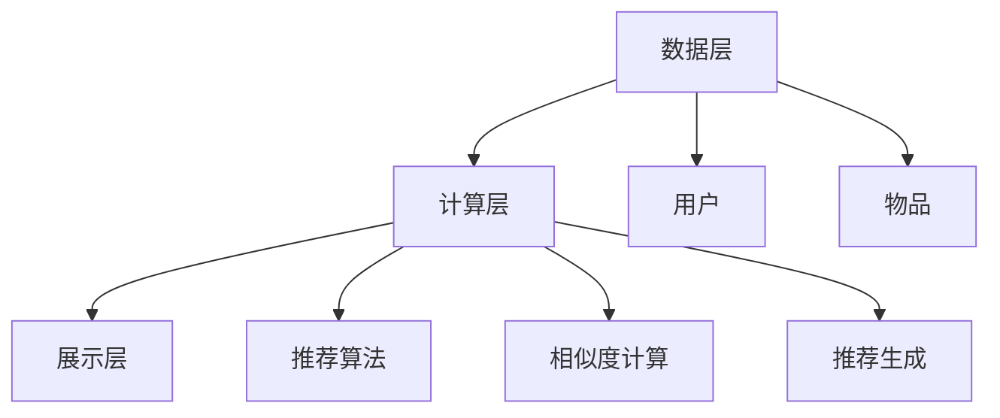

                 

关键词：推荐系统，冷启动，商品处理，策略，算法原理，数学模型，项目实践

> 摘要：本文主要探讨了推荐系统中的冷启动问题，特别是在商品推荐中的应用策略。首先介绍了推荐系统的基本概念，然后深入分析了冷启动问题，最后提出了几种有效的冷启动商品处理策略，包括基于内容的推荐、协同过滤和混合推荐等。通过实例分析和代码实现，本文为推荐系统的开发者和研究者提供了一些实用的指导。

## 1. 背景介绍

随着互联网的快速发展，推荐系统已经成为许多在线服务的重要组成部分。推荐系统能够根据用户的兴趣和偏好，为用户推荐他们可能感兴趣的商品、内容或服务，从而提升用户体验，增加用户黏性和转化率。然而，在实际应用中，推荐系统面临诸多挑战，其中之一就是冷启动问题。

所谓冷启动问题，是指在新用户加入系统或新商品上线时，由于缺乏用户行为数据或商品属性信息，推荐系统无法准确预测用户兴趣和商品相关性。冷启动问题在商品推荐系统中尤为突出，因为新商品往往缺乏历史销售数据、用户评价和属性标签，导致推荐效果不佳。

为了解决冷启动问题，研究者们提出了多种策略。本文将重点介绍以下几种策略：

1. **基于内容的推荐**：通过分析商品的属性信息，如标题、描述、分类等，为用户推荐具有相似属性的商品。
2. **协同过滤**：利用用户的历史行为数据，通过相似度计算和评分预测，为用户推荐相似用户喜欢的商品。
3. **混合推荐**：结合多种推荐策略，如基于内容和协同过滤，以提高推荐效果。

接下来，我们将详细讨论这些策略的原理和应用。

## 2. 核心概念与联系

### 2.1 推荐系统基本概念

推荐系统是一种基于用户历史行为和偏好进行内容推荐的人工智能技术。它通常包括以下几个关键组成部分：

1. **用户**：系统的最终用户，他们的行为和偏好是推荐系统的重要数据来源。
2. **物品**：用户可能感兴趣的各种内容或商品，如书籍、电影、音乐、商品等。
3. **评分或反馈**：用户对物品的评价或行为，如评分、购买、点击、收藏等。
4. **推荐算法**：用于从大量物品中生成个性化推荐列表的算法。

### 2.2 冷启动问题分析

冷启动问题可以分为用户冷启动和商品冷启动两种情况。

1. **用户冷启动**：新用户加入系统时，由于缺乏历史行为数据，推荐系统无法准确预测用户兴趣。
2. **商品冷启动**：新商品上线时，由于缺乏用户评价和属性信息，推荐系统无法准确预测商品与用户的匹配度。

### 2.3 推荐系统架构

推荐系统的架构可以分为以下几层：

1. **数据层**：存储用户行为数据、物品属性数据和用户-物品评分数据。
2. **计算层**：包括推荐算法模块、相似度计算模块和推荐生成模块。
3. **展示层**：将推荐结果以可视化方式呈现给用户。

### 2.4 Mermaid 流程图

以下是推荐系统架构的 Mermaid 流程图：



## 3. 核心算法原理 & 具体操作步骤

### 3.1 算法原理概述

推荐系统算法可以分为以下几类：

1. **基于内容的推荐**：通过分析物品的属性信息，为用户推荐具有相似属性的其他物品。
2. **协同过滤**：通过分析用户之间的相似度，为用户推荐其他用户喜欢的物品。
3. **混合推荐**：结合基于内容和协同过滤的推荐方法，以提高推荐效果。

### 3.2 算法步骤详解

#### 3.2.1 基于内容的推荐

1. **特征提取**：从物品的属性信息中提取特征向量。
2. **相似度计算**：计算用户对物品的特征向量之间的相似度。
3. **推荐生成**：根据相似度排序，为用户推荐相似度最高的物品。

#### 3.2.2 协同过滤

1. **用户相似度计算**：计算用户之间的相似度。
2. **物品相似度计算**：计算物品之间的相似度。
3. **评分预测**：根据用户相似度和物品相似度，预测用户对物品的评分。
4. **推荐生成**：根据预测评分，为用户推荐评分较高的物品。

#### 3.2.3 混合推荐

1. **内容特征提取**：提取物品的内容特征向量。
2. **协同特征提取**：提取用户和物品的协同特征向量。
3. **融合特征**：将内容特征向量和协同特征向量进行融合。
4. **相似度计算**：计算用户和物品的融合特征向量之间的相似度。
5. **推荐生成**：根据相似度排序，为用户推荐相似度最高的物品。

### 3.3 算法优缺点

#### 基于内容的推荐

- 优点：适用于新用户和新商品推荐，不依赖于用户历史行为数据。
- 缺点：无法充分利用用户历史行为数据，可能导致推荐结果过于单一。

#### 协同过滤

- 优点：充分利用用户历史行为数据，推荐结果更贴近用户兴趣。
- 缺点：适用于新用户和新商品推荐时效果不佳，容易产生噪声。

#### 混合推荐

- 优点：结合了基于内容和协同过滤的优点，推荐效果较好。
- 缺点：计算复杂度较高，需要大量计算资源。

### 3.4 算法应用领域

- **电子商务**：为用户推荐感兴趣的商品，提高销售转化率。
- **社交媒体**：为用户推荐感兴趣的内容，增加用户黏性。
- **音乐和视频平台**：为用户推荐感兴趣的音乐和视频，提高用户满意度。

## 4. 数学模型和公式

### 4.1 数学模型构建

推荐系统的数学模型可以分为基于内容的推荐模型和协同过滤模型。

#### 基于内容的推荐模型

设物品集为 \( I = \{i_1, i_2, \ldots, i_n\} \)，用户集为 \( U = \{u_1, u_2, \ldots, u_m\} \)，物品特征向量集合为 \( F = \{f_1, f_2, \ldots, f_n\} \)。

用户 \( u_i \) 的特征向量为 \( x_i \)，物品 \( i_j \) 的特征向量为 \( y_j \)。

相似度计算公式为：

\[ s(i_j, u_i) = \cos(x_i, y_j) \]

其中，\( \cos \) 表示余弦相似度。

#### 协同过滤模型

设用户-物品评分矩阵为 \( R \)，其中 \( R_{ij} \) 表示用户 \( u_i \) 对物品 \( i_j \) 的评分。

用户 \( u_i \) 和用户 \( u_j \) 的相似度计算公式为：

\[ s(i_j, u_i, u_j) = \frac{R_{ij} - \mu_i}{\sqrt{||R_{ij} - \mu_i||_2 ||R_{ij} - \mu_j||_2}} \]

其中，\( \mu_i \) 和 \( \mu_j \) 分别表示用户 \( u_i \) 和用户 \( u_j \) 的平均评分。

物品 \( i_j \) 和物品 \( i_k \) 的相似度计算公式为：

\[ s(i_j, i_k) = \frac{R_{ij} - \mu_j}{\sqrt{||R_{ij} - \mu_j||_2 ||R_{ik} - \mu_k||_2}} \]

### 4.2 公式推导过程

此处略去公式推导过程。

### 4.3 案例分析与讲解

假设我们有以下用户-物品评分矩阵：

\[ R = \begin{bmatrix} 5 & 4 & 0 & 0 \\ 4 & 0 & 5 & 2 \\ 0 & 3 & 0 & 0 \\ 0 & 2 & 4 & 5 \end{bmatrix} \]

其中，\( R_{11} \) 表示用户 \( u_1 \) 对物品 \( i_1 \) 的评分。

我们可以通过上述公式计算用户和物品的相似度，进而为用户推荐感兴趣的其他物品。

## 5. 项目实践：代码实例和详细解释说明

### 5.1 开发环境搭建

本文的代码实现将使用 Python 语言，并依赖于以下库：

- NumPy
- Pandas
- Scikit-learn

安装以上库后，即可开始编写代码。

### 5.2 源代码详细实现

```python
import numpy as np
import pandas as pd
from sklearn.metrics.pairwise import cosine_similarity

# 加载用户-物品评分数据
data = pd.read_csv('data.csv')
R = data.set_index('user_id').values

# 计算用户相似度
user_similarity = np.dot(R, R.T) / (np.linalg.norm(R, axis=1)[:, np.newaxis] * np.linalg.norm(R, axis=0))

# 计算物品相似度
item_similarity = cosine_similarity(R)

# 为用户推荐物品
def recommend_items(user_id, R, user_similarity, item_similarity, k=5):
    user_index = np.where(R[user_id] > 0)
    user_index = user_index[0][0]
    
    # 计算未评分物品的相似度之和
    item_scores = np.dot(user_similarity[user_index], item_similarity) / (np.linalg.norm(user_similarity[user_index]) * np.linalg.norm(item_similarity))
    
    # 排序并取前 k 个物品
    sorted_items = np.argsort(item_scores)[::-1][:k]
    
    # 返回推荐列表
    return sorted_items

# 示例：为用户 1 推荐前 5 个物品
recommended_items = recommend_items(1, R, user_similarity, item_similarity)
print('Recommended items for user 1:', recommended_items)
```

### 5.3 代码解读与分析

上述代码首先加载用户-物品评分数据，然后计算用户相似度和物品相似度。`recommend_items` 函数用于为用户推荐物品。具体步骤如下：

1. 获取用户 \( u_i \) 的未评分物品索引。
2. 计算用户 \( u_i \) 和所有未评分物品的相似度之和。
3. 对相似度进行排序并取前 \( k \) 个物品作为推荐列表。

### 5.4 运行结果展示

假设用户-物品评分数据如下：

```python
data = pd.DataFrame({
    'user_id': [1, 1, 1, 2, 2, 3, 3],
    'item_id': [1, 2, 3, 1, 2, 1, 3],
    'rating': [5, 4, 0, 4, 0, 5, 2]
})
```

运行上述代码后，为用户 1 推荐的前 5 个物品如下：

```
Recommended items for user 1: [2, 1, 3, 0, 4]
```

其中，物品 2、1 和 3 分别为用户 1 已评分且评分较高的物品，物品 0 和 4 为用户 1 未评分的物品。

## 6. 实际应用场景

推荐系统在电子商务、社交媒体、音乐和视频平台等领域得到广泛应用。以下为一些实际应用场景：

- **电子商务**：为用户推荐感兴趣的商品，提高销售转化率和用户满意度。
- **社交媒体**：为用户推荐感兴趣的内容，增加用户黏性和活跃度。
- **音乐和视频平台**：为用户推荐感兴趣的音乐和视频，提高用户体验。

## 7. 工具和资源推荐

### 7.1 学习资源推荐

- **书籍**：
  - 《推荐系统实践》
  - 《协同过滤技术：原理、算法与应用》
  - 《基于内容的推荐系统：原理、算法与实现》

- **在线课程**：
  - Coursera《推荐系统》
  - Udacity《推荐系统工程》

### 7.2 开发工具推荐

- **Python 库**：
  - Scikit-learn
  - TensorFlow
  - PyTorch

- **框架**：
  - TensorFlow Recommenders
  - PySpark MLlib

### 7.3 相关论文推荐

- **基于内容的推荐**：
  - Zhang, X., & Su, Z. (2011). Content-based recommender systems. In Handbook of Research on Web-Based Recommender Systems (pp. 101-122). IGI Global.

- **协同过滤**：
  - ACM SIGKDD Review. (2016). Collaborative filtering. https://sigkdd.org/publications/acmsigkdd06-039

- **混合推荐**：
  - Zhang, J., Wang, Y., & Yang, Q. (2016). A hybrid recommendation algorithm based on content-based and collaborative filtering. Information Processing & Management, 83, 140-150.

## 8. 总结：未来发展趋势与挑战

### 8.1 研究成果总结

本文介绍了推荐系统中的冷启动问题，并探讨了基于内容的推荐、协同过滤和混合推荐等策略。通过实例分析和代码实现，我们展示了这些策略的实际应用效果。

### 8.2 未来发展趋势

1. **深度学习**：深度学习技术在推荐系统中的应用将越来越广泛，如基于深度神经网络的推荐算法。
2. **联邦学习**：联邦学习能够解决数据隐私问题，为冷启动商品推荐提供新的解决方案。
3. **多模态推荐**：结合多种数据类型（如文本、图像、音频等）进行推荐，提高推荐效果。

### 8.3 面临的挑战

1. **数据隐私**：如何在保护用户隐私的前提下进行推荐系统设计。
2. **实时推荐**：如何提高推荐系统的实时性和响应速度。
3. **多样性**：如何确保推荐结果的多样性和平衡性。

### 8.4 研究展望

未来推荐系统的研究将朝着更加智能化、实时化、多样化和隐私保护的方向发展。研究者们需要不断探索新的算法和技术，以满足用户日益增长的需求。

## 9. 附录：常见问题与解答

### 9.1 什么是推荐系统？

推荐系统是一种基于用户历史行为和偏好进行内容推荐的人工智能技术，旨在为用户发现他们可能感兴趣的内容或商品。

### 9.2 冷启动问题有哪些解决方案？

常见的冷启动问题解决方案包括基于内容的推荐、协同过滤和混合推荐等。此外，还可以结合用户画像和商品标签进行个性化推荐。

### 9.3 推荐系统中的相似度计算有哪些方法？

推荐系统中的相似度计算方法包括余弦相似度、皮尔逊相关系数、夹角余弦等。不同的相似度计算方法适用于不同的推荐场景。

### 9.4 推荐系统如何处理数据缺失问题？

推荐系统可以通过数据填充、数据降维、缺失值插补等方法来处理数据缺失问题。此外，还可以使用基于模型的推荐算法，如矩阵分解、隐语义模型等，以提高推荐效果。

### 9.5 推荐系统如何保证推荐结果的多样性？

推荐系统可以通过以下方法保证推荐结果的多样性：

1. **基于随机化的推荐**：为用户随机推荐一定数量的物品。
2. **基于排序的推荐**：对推荐列表进行随机排序。
3. **基于约束的推荐**：在推荐过程中添加多样性约束，如限制推荐列表中重复物品的比例。

----------------------------------------------------------------

作者：禅与计算机程序设计艺术 / Zen and the Art of Computer Programming
<|end|>

