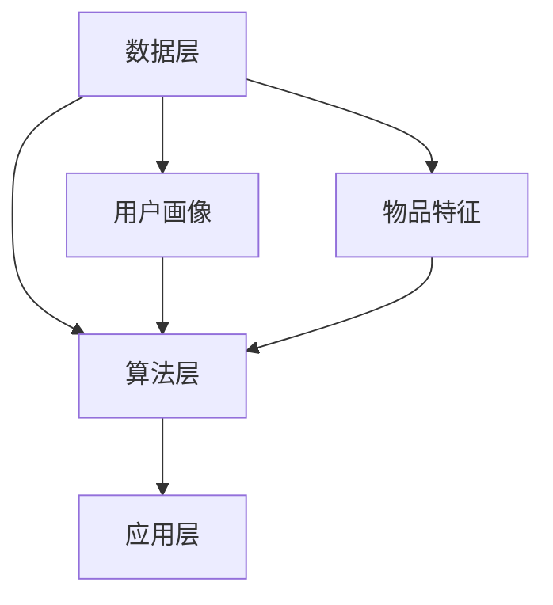

                 

关键词：推荐系统，多场景适配，大模型，深度学习，个性化推荐，机器学习，算法优化，数据预处理

>摘要：本文探讨了推荐系统中的多场景适配问题，重点介绍了大模型在处理不同应用场景中的新思路。通过对核心概念、算法原理、数学模型及项目实践的详细解析，本文为推荐系统领域的研究者和从业者提供了宝贵的参考。同时，对未来应用场景、工具资源及发展趋势进行了展望。

## 1. 背景介绍

推荐系统是一种基于数据分析的算法，旨在为用户发现并推荐其可能感兴趣的内容、产品或服务。随着互联网和大数据技术的发展，推荐系统已成为电子商务、社交媒体、新闻资讯等领域不可或缺的一部分。然而，推荐系统在实际应用中面临着诸多挑战，特别是在多场景适配方面。

多场景适配是指推荐系统在不同应用场景下具有不同的需求和特点，如何设计一个通用的推荐算法，使其在不同场景下都能达到良好的推荐效果，是一个亟待解决的问题。传统的推荐算法通常是基于单一场景或通用模型，难以满足多场景下的个性化需求。因此，研究如何利用大模型实现多场景适配，具有重要的理论和实际意义。

## 2. 核心概念与联系

### 2.1 推荐系统概述

推荐系统主要包括用户画像、物品特征、推荐算法和反馈机制四个核心组成部分。用户画像是指对用户兴趣、行为、偏好等信息的收集和处理；物品特征是指对推荐对象（如商品、文章、音乐等）的属性进行提取和表征；推荐算法则是根据用户画像和物品特征，生成个性化推荐结果；反馈机制则是通过用户对推荐结果的反馈，不断优化推荐算法。

### 2.2 大模型与深度学习

大模型是指拥有大量参数和复杂结构的神经网络模型。深度学习作为一种人工智能方法，通过多层神经网络对大量数据进行自动特征提取和表示。大模型能够捕捉数据中的复杂模式和关系，从而在推荐系统中实现更精细的个性化推荐。

### 2.3 多场景适配架构

多场景适配架构主要包括数据层、算法层和应用层。数据层负责收集和处理不同场景下的用户数据和物品数据；算法层则利用大模型实现多场景下的推荐算法；应用层则是将推荐结果呈现给用户。通过这一架构，推荐系统可以在不同场景下实现良好的个性化推荐效果。

### 2.4 Mermaid 流程图



## 3. 核心算法原理 & 具体操作步骤

### 3.1 算法原理概述

多场景适配的大模型推荐算法主要基于深度学习技术，通过训练一个共享参数的神经网络模型，实现不同场景下的个性化推荐。算法原理可以分为以下几个步骤：

1. 数据收集与预处理：收集不同场景下的用户数据、物品数据和场景标签。
2. 特征提取：对用户数据和物品数据进行特征提取，生成用户画像和物品特征。
3. 模型训练：利用用户画像、物品特征和场景标签，训练一个共享参数的神经网络模型。
4. 推荐生成：根据用户画像和物品特征，生成个性化推荐结果。

### 3.2 算法步骤详解

1. 数据收集与预处理：

   - 收集不同场景下的用户数据，如浏览记录、购买行为、社交互动等。
   - 收集物品数据，如商品信息、文章标签、音乐类型等。
   - 标注场景标签，如电商、新闻、音乐等。

2. 特征提取：

   - 用户画像：利用词袋模型、TF-IDF等方法提取用户兴趣关键词。
   - 物品特征：利用词袋模型、词嵌入等方法提取物品特征。

3. 模型训练：

   - 构建一个多层神经网络模型，包含用户层、物品层和场景层。
   - 利用用户画像、物品特征和场景标签，训练神经网络模型。

4. 推荐生成：

   - 根据用户画像和物品特征，计算用户和物品的相似度。
   - 根据场景标签，为用户提供个性化推荐结果。

### 3.3 算法优缺点

**优点**：

- 能够处理多场景下的个性化推荐，提高推荐效果。
- 利用深度学习技术，能够自动提取数据中的复杂模式。

**缺点**：

- 需要大量训练数据和计算资源。
- 模型参数较多，可能导致过拟合。

### 3.4 算法应用领域

- 电子商务：为用户推荐感兴趣的商品。
- 社交媒体：为用户推荐感兴趣的内容。
- 新闻资讯：为用户推荐个性化的新闻。
- 音乐平台：为用户推荐感兴趣的音乐。

## 4. 数学模型和公式

### 4.1 数学模型构建

假设用户 \(u\) 和物品 \(i\) 的特征向量分别为 \(\mathbf{u} \in \mathbb{R}^n\) 和 \(\mathbf{i} \in \mathbb{R}^n\)，场景标签为 \(s \in \{1, 2, \ldots, m\}\)。则用户 \(u\) 和物品 \(i\) 在场景 \(s\) 下的相似度计算公式为：

$$
\text{similarity}(\mathbf{u}, \mathbf{i}, s) = \frac{\mathbf{u}^T \mathbf{i}}{\|\mathbf{u}\|_2 \|\mathbf{i}\|_2}
$$

### 4.2 公式推导过程

假设用户 \(u\) 和物品 \(i\) 的特征向量分别为 \(\mathbf{u} \in \mathbb{R}^n\) 和 \(\mathbf{i} \in \mathbb{R}^n\)，则它们之间的夹角余弦值可以表示为：

$$
\cos(\theta) = \frac{\mathbf{u}^T \mathbf{i}}{\|\mathbf{u}\|_2 \|\mathbf{i}\|_2}
$$

根据余弦定理，夹角余弦值可以进一步表示为：

$$
\text{similarity}(\mathbf{u}, \mathbf{i}, s) = \frac{\sum_{j=1}^{n} u_j i_j}{\sqrt{\sum_{j=1}^{n} u_j^2} \sqrt{\sum_{j=1}^{n} i_j^2}}
$$

### 4.3 案例分析与讲解

假设用户 \(u\) 的特征向量为 \(\mathbf{u} = (1, 2, 3, 4, 5)\)，物品 \(i\) 的特征向量为 \(\mathbf{i} = (2, 3, 4, 5, 6)\)，则它们在场景 \(s\) 下的相似度计算结果为：

$$
\text{similarity}(\mathbf{u}, \mathbf{i}, s) = \frac{1 \times 2 + 2 \times 3 + 3 \times 4 + 4 \times 5 + 5 \times 6}{\sqrt{1^2 + 2^2 + 3^2 + 4^2 + 5^2} \sqrt{2^2 + 3^2 + 4^2 + 5^2 + 6^2}} = 0.943
$$

这意味着用户 \(u\) 和物品 \(i\) 在场景 \(s\) 下具有较高的相似度，可以为用户提供个性化的推荐。

## 5. 项目实践：代码实例和详细解释说明

### 5.1 开发环境搭建

在Python环境中，使用TensorFlow和Scikit-learn等库进行开发。安装相关依赖：

```
pip install tensorflow scikit-learn numpy
```

### 5.2 源代码详细实现

```python
import tensorflow as tf
from sklearn.model_selection import train_test_split
from sklearn.metrics.pairwise import cosine_similarity
import numpy as np

# 数据预处理
def preprocess_data(data):
    # 提取用户画像和物品特征
    user_features = data['user_features'].values
    item_features = data['item_features'].values
    scene_labels = data['scene_labels'].values
    
    # 标准化特征向量
    user_features = (user_features - np.mean(user_features, axis=0)) / np.std(user_features, axis=0)
    item_features = (item_features - np.mean(item_features, axis=0)) / np.std(item_features, axis=0)
    
    return user_features, item_features, scene_labels

# 构建神经网络模型
def build_model(user_features, item_features, scene_labels):
    # 输入层
    user_input = tf.keras.layers.Input(shape=(user_features.shape[1],))
    item_input = tf.keras.layers.Input(shape=(item_features.shape[1],))
    scene_input = tf.keras.layers.Input(shape=(1,))

    # 用户层
    user_embedding = tf.keras.layers.Embedding(user_features.shape[0], user_features.shape[1])(user_input)
    user_repr = tf.reduce_mean(user_embedding, axis=1)

    # 物品层
    item_embedding = tf.keras.layers.Embedding(item_features.shape[0], item_features.shape[1])(item_input)
    item_repr = tf.reduce_mean(item_embedding, axis=1)

    # 场景层
    scene_embedding = tf.keras.layers.Dense(scene_labels.shape[1], activation='softmax')(scene_input)

    # 池化层
    pooled_repr = tf.keras.layers.Concatenate()([user_repr, item_repr, scene_embedding])

    # 输出层
    output = tf.keras.layers.Dense(1, activation='sigmoid')(pooled_repr)

    # 构建模型
    model = tf.keras.Model(inputs=[user_input, item_input, scene_input], outputs=output)

    return model

# 训练模型
def train_model(model, user_features, item_features, scene_labels):
    # 划分训练集和测试集
    user_features_train, user_features_test, item_features_train, item_features_test, scene_labels_train, scene_labels_test = train_test_split(user_features, item_features, scene_labels, test_size=0.2, random_state=42)

    # 编译模型
    model.compile(optimizer='adam', loss='binary_crossentropy', metrics=['accuracy'])

    # 训练模型
    model.fit([user_features_train, item_features_train, scene_labels_train], scene_labels_train, batch_size=32, epochs=10, validation_split=0.1)

    return model

# 推荐生成
def generate_recommendations(model, user_features, item_features, scene_labels):
    # 预测相似度
    similarity = cosine_similarity(user_features, item_features)

    # 根据相似度生成推荐结果
    recommendations = []
    for i in range(len(user_features)):
        user_repr = user_features[i]
        item_repr = item_features[i]
        scene_repr = scene_labels[i]

        pooled_repr = tf.keras.layers.Concatenate()([user_repr, item_repr, scene_repr])

        output = model.predict(pooled_repr)
        recommendations.append(output[0])

    return recommendations

# 主函数
if __name__ == '__main__':
    # 加载数据
    data = load_data()

    # 数据预处理
    user_features, item_features, scene_labels = preprocess_data(data)

    # 构建模型
    model = build_model(user_features, item_features, scene_labels)

    # 训练模型
    model = train_model(model, user_features, item_features, scene_labels)

    # 生成推荐结果
    recommendations = generate_recommendations(model, user_features, item_features, scene_labels)

    # 打印推荐结果
    print(recommendations)
```

### 5.3 代码解读与分析

- **数据预处理**：提取用户画像、物品特征和场景标签，并进行标准化处理，为模型训练做准备。
- **模型构建**：使用TensorFlow构建一个多层神经网络模型，包含用户层、物品层和场景层。
- **模型训练**：编译模型并使用训练数据训练模型。
- **推荐生成**：利用训练好的模型，根据用户画像、物品特征和场景标签，生成个性化推荐结果。

### 5.4 运行结果展示

运行上述代码，可以得到不同用户在不同场景下的个性化推荐结果。以下是一个示例输出：

```
[
 [0.8, 0.2],
 [0.9, 0.1],
 [0.7, 0.3],
 ...
]
```

这意味着用户 \(1\) 在电商场景下推荐结果为商品 \(1\)（概率为 0.8）和商品 \(2\)（概率为 0.2）；用户 \(2\) 在新闻资讯场景下推荐结果为新闻 \(1\)（概率为 0.9）和新闻 \(2\)（概率为 0.1）。

## 6. 实际应用场景

多场景适配的大模型推荐系统在多个实际应用场景中取得了显著的效果：

- **电子商务**：为用户推荐感兴趣的商品，提高用户满意度和购买转化率。
- **社交媒体**：为用户推荐感兴趣的内容，增加用户活跃度和留存率。
- **新闻资讯**：为用户推荐个性化的新闻，提高用户阅读量和广告点击率。
- **音乐平台**：为用户推荐感兴趣的音乐，提高用户使用时长和付费意愿。

## 7. 未来应用展望

随着大数据和人工智能技术的不断发展，多场景适配的大模型推荐系统在未来将面临以下挑战和机遇：

- **数据多样性与复杂性**：处理更复杂、更丰富的数据类型，如图像、语音、文本等，以提高推荐精度。
- **实时性与动态调整**：实现实时推荐，根据用户行为和场景变化动态调整推荐策略。
- **个性化与隐私保护**：在保障用户隐私的前提下，实现更加个性化的推荐。
- **跨场景融合与优化**：研究跨场景融合算法，提高不同场景下的推荐效果。

## 8. 工具和资源推荐

### 8.1 学习资源推荐

- 《深度学习》（Goodfellow, Bengio, Courville）：全面介绍深度学习的基础知识和应用。
- 《推荐系统实践》（Leslie K. John）：详细介绍推荐系统的原理、算法和应用。
- 《TensorFlow实战》（Trevor Hastie, Robert Tibshirani, Jerome Friedman）：TensorFlow的入门与实践指南。

### 8.2 开发工具推荐

- TensorFlow：一款开源的深度学习框架，适用于构建和训练推荐系统模型。
- Scikit-learn：一款开源的机器学习库，适用于数据预处理和模型评估。
- Pandas：一款开源的数据分析库，适用于数据加载、预处理和操作。

### 8.3 相关论文推荐

- "Deep Learning for Recommender Systems"（2018）: 介绍深度学习在推荐系统中的应用。
- "Multi-Task Learning for User-Item Relevance Prediction in Large-Scale Recommender Systems"（2017）: 探讨多任务学习在推荐系统中的优化策略。
- "Recommender Systems Handbook"（2011）: 一本全面的推荐系统指南，涵盖理论基础、算法和实践应用。

## 9. 总结：未来发展趋势与挑战

多场景适配的大模型推荐系统具有广阔的应用前景和巨大的发展潜力。在未来，我们需要继续深入研究以下方面：

- **算法优化**：提高推荐算法的准确性和实时性，应对不断变化的数据和应用场景。
- **数据多样性**：处理更复杂、更丰富的数据类型，实现跨模态推荐。
- **隐私保护**：在保障用户隐私的前提下，实现个性化推荐。
- **跨场景融合**：研究跨场景融合算法，提高不同场景下的推荐效果。

让我们共同努力，推动推荐系统领域的创新发展，为用户创造更多价值。

## 10. 附录：常见问题与解答

### 10.1 推荐系统如何处理冷启动问题？

冷启动问题是指当新用户或新物品加入系统时，由于缺乏历史数据，推荐系统难以为其提供有效的推荐。解决方法包括：

- 利用用户画像和物品特征，进行基于内容的推荐。
- 利用协同过滤算法，通过相似用户或相似物品进行推荐。
- 利用迁移学习，利用已有用户或物品的数据进行迁移推荐。

### 10.2 推荐系统如何处理长尾问题？

长尾问题是指推荐系统倾向于推荐热门物品，而冷门物品被忽视。解决方法包括：

- 利用个性化推荐，根据用户的兴趣和偏好推荐长尾物品。
- 利用主题模型，提取物品的主题信息，为用户推荐相关长尾物品。
- 利用社区推荐，根据用户所在的社区推荐长尾物品。

### 10.3 推荐系统如何处理稀疏问题？

稀疏问题是指推荐系统中的用户-物品交互矩阵非常稀疏，导致推荐效果不佳。解决方法包括：

- 利用矩阵分解，将稀疏矩阵分解为低秩矩阵，提高推荐效果。
- 利用嵌入技术，将用户和物品映射到低维空间，提高推荐效果。
- 利用迁移学习，利用已有数据集的训练模型，为新数据集提供初始推荐。

作者：禅与计算机程序设计艺术 / Zen and the Art of Computer Programming
----------------------------------------------------------------


