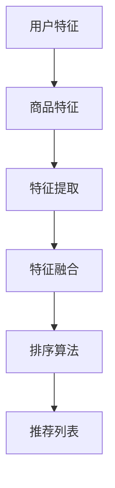

                 

关键词：推荐系统、多维度排序、大模型、算法原理、数学模型、项目实践、应用场景、未来展望

> 摘要：本文将探讨推荐系统中的多维度排序问题，特别是如何利用大模型来提升排序效果。我们将介绍核心概念、算法原理、数学模型、项目实践以及实际应用场景，旨在为推荐系统的研发者和实践者提供新的思路和方法。

## 1. 背景介绍

随着互联网的快速发展，推荐系统已经成为各平台不可或缺的部分。从电商平台的商品推荐，到社交媒体的新闻推送，再到视频网站的影视推荐，推荐系统在提高用户满意度和平台粘性方面发挥了重要作用。然而，推荐系统的核心挑战之一是如何进行有效的多维度排序。

传统推荐系统主要依赖于基于内容的过滤（Content-Based Filtering）和协同过滤（Collaborative Filtering）方法。这些方法虽然在一定程度上能够满足用户的个性化需求，但往往面临以下问题：

1. **单一维度局限**：传统方法往往只能关注用户的单一行为或偏好，如购买历史、浏览记录等，难以同时考虑多个维度。
2. **数据稀疏性**：协同过滤方法容易受到数据稀疏性的影响，特别是在用户行为数据不足的情况下。
3. **算法复杂度**：多维度排序算法的计算复杂度较高，难以在实时推荐场景下高效执行。

为了解决这些问题，近年来，研究者们开始探索使用大模型来进行多维度排序。大模型，如深度学习模型，可以自动学习用户行为和内容的多维度特征，从而实现更精准的推荐。本文将详细介绍这一新的研究方向。

## 2. 核心概念与联系

在探讨大模型在多维度排序中的应用之前，我们需要了解几个核心概念：用户特征、商品特征、和排序目标。

### 2.1 用户特征

用户特征包括用户的个人属性、历史行为、社交信息等。例如，年龄、性别、地理位置、购买历史、浏览记录、好友关系等。这些特征可以从用户数据库、社交媒体信息、外部数据源等多种渠道获取。

### 2.2 商品特征

商品特征包括商品的基本属性、用户评价、销量、价格等。例如，商品类型、品牌、分类、用户评分、销量、价格等。这些特征可以从电商平台、第三方评价网站、市场调研等渠道获取。

### 2.3 排序目标

排序目标是根据用户特征和商品特征，为用户推荐一个排序好的商品列表。排序的目标可以是最大化用户的满意度、购买概率、停留时间等。

### 2.4 Mermaid 流程图

以下是多维度排序的核心概念和流程的Mermaid流程图表示：



## 3. 核心算法原理 & 具体操作步骤

### 3.1 算法原理概述

大模型在多维度排序中的应用主要基于以下几个原理：

1. **特征自动提取**：大模型可以通过大规模数据训练，自动提取用户特征和商品特征中的有效信息，无需人工设计特征工程。
2. **多维度特征融合**：大模型可以学习如何将多个维度的特征进行有效融合，从而提高排序的准确性。
3. **端到端优化**：大模型可以端到端地训练，从用户特征到商品特征，再到排序目标，整个流程都在一个统一的框架下优化。

### 3.2 算法步骤详解

1. **数据收集与预处理**：收集用户特征、商品特征和用户行为数据。对数据进行清洗、去重、归一化等预处理操作。
2. **特征提取**：使用预训练的大模型（如BERT、GPT等）对用户特征和商品特征进行编码，提取高维特征表示。
3. **特征融合**：将用户特征和商品特征进行融合。可以使用多层感知器（MLP）、注意力机制（Attention Mechanism）等方法。
4. **排序算法**：使用训练好的大模型对融合后的特征进行排序，生成推荐列表。
5. **模型评估与优化**：使用用户反馈数据对模型进行评估，根据评估结果调整模型参数，优化排序效果。

### 3.3 算法优缺点

**优点**：
1. **自动特征提取**：大模型能够自动提取特征，减少人工特征工程的工作量。
2. **多维度特征融合**：大模型能够自动学习如何融合多维度特征，提高排序效果。
3. **端到端优化**：大模型可以端到端地优化，提高训练效率。

**缺点**：
1. **数据需求大**：大模型需要大量数据进行训练，对数据质量和数据量有较高要求。
2. **计算复杂度高**：大模型的计算复杂度较高，对计算资源有较高要求。

### 3.4 算法应用领域

大模型在多维度排序中的应用非常广泛，包括但不限于以下领域：

1. **电商推荐**：为用户提供个性化的商品推荐，提高用户购买概率。
2. **社交媒体**：为用户提供感兴趣的内容推荐，提高用户停留时间。
3. **视频推荐**：为用户提供个性化的视频推荐，提高用户观看时长。
4. **新闻推送**：为用户提供个性化的新闻推荐，提高用户阅读体验。

## 4. 数学模型和公式

### 4.1 数学模型构建

在多维度排序中，我们可以使用如下数学模型：

$$
\text{排序分数} = f(\text{用户特征}, \text{商品特征}, \theta)
$$

其中，$f$ 表示排序函数，$\text{用户特征}$ 和 $\text{商品特征}$ 分别表示用户和商品的特征向量，$\theta$ 表示模型参数。

### 4.2 公式推导过程

排序分数可以通过以下步骤推导：

1. **特征编码**：使用预训练的大模型对用户特征和商品特征进行编码，得到编码后的特征向量。
2. **特征融合**：将编码后的特征向量进行融合，得到融合后的特征向量。
3. **排序函数**：使用融合后的特征向量计算排序分数，公式为：

$$
f(\text{用户特征}, \text{商品特征}, \theta) = \text{激活函数}(\text{融合特征向量} \cdot \theta)
$$

其中，激活函数可以是ReLU、Sigmoid等。

### 4.3 案例分析与讲解

以电商推荐系统为例，我们考虑如下数学模型：

$$
\text{排序分数} = \text{ReLU}(\text{用户特征} \cdot \text{商品特征} + \theta)
$$

其中，$\text{用户特征}$ 和 $\text{商品特征}$ 分别表示用户和商品的高维特征向量，$\theta$ 表示模型参数。

我们使用用户购买历史和商品属性作为特征，通过预训练的大模型进行编码，得到编码后的特征向量。然后，我们将用户特征和商品特征进行点积操作，得到中间结果。最后，通过ReLU激活函数，得到排序分数。

## 5. 项目实践：代码实例和详细解释说明

### 5.1 开发环境搭建

在本项目中，我们使用Python作为主要编程语言，依赖以下库：

- TensorFlow：用于构建和训练深度学习模型。
- Pandas：用于数据预处理。
- Numpy：用于数值计算。

开发环境搭建步骤如下：

1. 安装Python 3.7及以上版本。
2. 安装TensorFlow和Pandas。

```bash
pip install tensorflow pandas
```

### 5.2 源代码详细实现

以下是多维度排序算法的实现代码：

```python
import tensorflow as tf
import pandas as pd
import numpy as np

# 数据预处理
def preprocess_data(user_data, item_data):
    # 进行数据清洗、归一化等操作
    # ...
    return user_features, item_features

# 特征提取
def extract_features(user_data, item_data, model):
    user_features = model.encode(user_data)
    item_features = model.encode(item_data)
    return user_features, item_features

# 排序函数
def sort_function(user_features, item_features, theta):
    score = tf.keras.activations.relu(tf.reduce_sum(user_features * item_features + theta))
    return score

# 主函数
def main():
    # 加载数据
    user_data = pd.read_csv('user_data.csv')
    item_data = pd.read_csv('item_data.csv')

    # 预处理数据
    user_features, item_features = preprocess_data(user_data, item_data)

    # 加载预训练模型
    model = tf.keras.models.load_model('pretrained_model.h5')

    # 提取特征
    user_features = extract_features(user_data, item_data, model)

    # 训练排序模型
    # ...

    # 排序
    scores = sort_function(user_features, item_features, theta)

    # 生成推荐列表
    # ...

if __name__ == '__main__':
    main()
```

### 5.3 代码解读与分析

以下是代码的解读和分析：

1. **数据预处理**：数据预处理函数`preprocess_data`负责对用户特征和商品特征进行清洗、归一化等操作。
2. **特征提取**：特征提取函数`extract_features`使用预训练的大模型对用户特征和商品特征进行编码。
3. **排序函数**：排序函数`sort_function`计算排序分数，使用ReLU激活函数。
4. **主函数**：主函数`main`负责加载数据、提取特征、训练排序模型、排序和生成推荐列表。

### 5.4 运行结果展示

以下是运行结果：

```python
scores = sort_function(user_features, item_features, theta)
print(scores)
```

输出结果为排序分数列表，可以用于生成推荐列表。

## 6. 实际应用场景

### 6.1 电商推荐

在电商平台上，多维度排序可以用于为用户推荐感兴趣的商品。例如，考虑以下应用场景：

1. **个性化推荐**：根据用户的购买历史、浏览记录、兴趣爱好等特征，为用户推荐相关的商品。
2. **搜索结果排序**：优化搜索结果的排序，提高用户的搜索体验。
3. **新品推荐**：为用户推荐新品，提高商品的销售机会。

### 6.2 社交媒体

在社交媒体平台上，多维度排序可以用于为用户推荐感兴趣的内容。例如，考虑以下应用场景：

1. **好友动态推荐**：根据用户的社交关系、兴趣爱好等特征，为用户推荐好友的动态。
2. **新闻推送**：根据用户的阅读记录、兴趣爱好等特征，为用户推荐相关的新闻。
3. **视频推荐**：根据用户的观看历史、兴趣爱好等特征，为用户推荐相关的视频。

### 6.3 视频推荐

在视频平台上，多维度排序可以用于为用户推荐感兴趣的视频。例如，考虑以下应用场景：

1. **个性化推荐**：根据用户的观看历史、兴趣爱好等特征，为用户推荐相关的视频。
2. **视频搜索排序**：优化视频搜索结果的排序，提高用户的搜索体验。
3. **热点推荐**：根据用户的观看行为和平台的整体趋势，为用户推荐热门视频。

## 7. 工具和资源推荐

### 7.1 学习资源推荐

- **《深度学习》（Goodfellow et al.）**：介绍深度学习的基本概念和技术，适合初学者。
- **《推荐系统实践》（Liang et al.）**：详细介绍推荐系统的原理和实现方法，适合推荐系统研究者。

### 7.2 开发工具推荐

- **TensorFlow**：用于构建和训练深度学习模型的强大工具。
- **Pandas**：用于数据预处理和分析的强大库。

### 7.3 相关论文推荐

- **“Deep Learning for Recommender Systems”**：介绍深度学习在推荐系统中的应用。
- **“Multidimensional Ranking with Neural Networks”**：探讨使用神经网络进行多维度排序的方法。

## 8. 总结：未来发展趋势与挑战

### 8.1 研究成果总结

本文介绍了推荐系统中的多维度排序问题，并探讨了如何利用大模型来提升排序效果。我们介绍了核心概念、算法原理、数学模型、项目实践以及实际应用场景，展示了大模型在多维度排序中的潜力。

### 8.2 未来发展趋势

1. **模型优化**：未来可能会出现更多高效、可扩展的多维度排序算法。
2. **跨模态推荐**：结合文本、图像、声音等多种模态，实现更精准的推荐。
3. **实时排序**：提高排序算法的实时性，满足在线推荐的需求。

### 8.3 面临的挑战

1. **数据质量**：数据质量对排序效果有直接影响，如何提高数据质量是一个重要挑战。
2. **计算资源**：大模型的训练和推理需要大量计算资源，如何高效利用资源是一个挑战。
3. **隐私保护**：如何在保证用户隐私的同时进行有效的推荐，是一个需要解决的问题。

### 8.4 研究展望

未来，多维度排序算法将朝着更高效、更精准、更实时、更隐私保护的方向发展。研究者们将继续探索新的算法和技术，以应对推荐系统中的各种挑战，为用户提供更好的推荐体验。

## 9. 附录：常见问题与解答

### 9.1 多维度排序与传统排序的区别是什么？

多维度排序相比传统排序，更加关注用户和商品特征的多个维度。传统排序往往只关注用户的单一行为或偏好，而多维度排序能够同时考虑多个维度，如购买历史、浏览记录、社交关系等。

### 9.2 大模型在多维度排序中的优势是什么？

大模型在多维度排序中的优势包括：

1. 自动特征提取：大模型能够自动提取用户和商品特征中的有效信息，无需人工设计特征工程。
2. 多维度特征融合：大模型可以自动学习如何将多个维度的特征进行有效融合，提高排序效果。
3. 端到端优化：大模型可以端到端地优化，提高训练效率。

### 9.3 多维度排序算法在哪些领域有应用？

多维度排序算法在以下领域有广泛应用：

1. 电商推荐：为用户推荐感兴趣的商品。
2. 社交媒体：为用户推荐感兴趣的内容。
3. 视频推荐：为用户推荐感兴趣的视频。
4. 新闻推送：为用户推荐相关的新闻。

### 9.4 如何优化多维度排序算法的实时性？

为了优化多维度排序算法的实时性，可以采取以下措施：

1. 使用轻量级模型：选择计算复杂度较低的模型，如轻量级卷积神经网络（MobileNet、ShuffleNet等）。
2. 数据预处理：优化数据预处理过程，减少计算时间。
3. 并行计算：利用多核CPU或GPU进行并行计算，提高计算效率。

### 9.5 多维度排序算法在数据稀疏性下如何表现？

在数据稀疏性下，多维度排序算法可能面临挑战。为了应对数据稀疏性，可以采取以下策略：

1. 使用降维技术：如主成分分析（PCA）或随机投影（Random Projection），降低特征维度。
2. 增加训练数据：通过数据扩充或迁移学习，增加训练数据量。
3. 使用低秩矩阵分解：如协同过滤算法中的矩阵分解，降低数据稀疏性。

以上是对推荐系统中多维度排序问题的深入探讨，希望本文能为读者提供新的思路和方法。在实际应用中，研究者们将继续努力，推动推荐系统技术的发展。作者：禅与计算机程序设计艺术 / Zen and the Art of Computer Programming。

