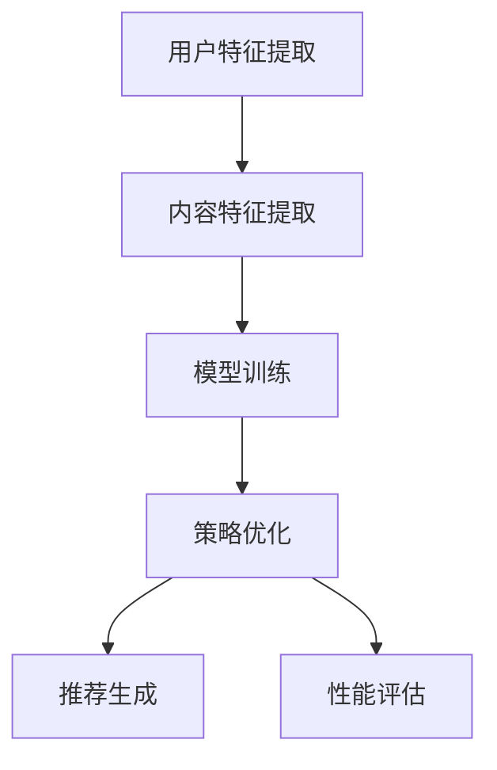

                 

推荐系统在当今的信息时代扮演着至关重要的角色，通过预测用户的兴趣和行为，为用户提供个性化的内容和服务。随着数据量的爆炸式增长和计算能力的提升，大模型在推荐系统中的应用变得愈发普遍。本文将探讨推荐系统中的大模型元策略优化与选择，以期提升推荐效果和系统性能。

## 关键词

- 推荐系统
- 大模型
- 元策略优化
- 策略选择
- 性能评估

## 摘要

本文首先介绍了推荐系统的基本概念和重要性，随后详细探讨了在大模型背景下进行元策略优化的必要性。通过分析现有的优化算法和策略选择方法，本文提出了一种基于大模型的元策略优化框架。文章随后通过数学模型和具体案例进行了详细讲解，最后讨论了该框架在推荐系统实际应用中的前景和挑战。

## 1. 背景介绍

### 推荐系统概述

推荐系统是一种信息过滤技术，旨在向用户推荐其可能感兴趣的项目。这种系统通过分析用户的过去行为、偏好和其他相关信息，预测用户未来的兴趣，从而提供个性化的推荐。推荐系统广泛应用于电子商务、社交媒体、在线视频和音乐平台等领域，极大地提升了用户体验和满意度。

### 大模型的重要性

随着互联网和大数据技术的发展，推荐系统面临的数据量和复杂性不断增加。传统的模型往往难以应对这样的挑战，因此大模型的应用变得越来越重要。大模型具有以下特点：

1. **高维度**：能够处理大量的特征维度。
2. **强表达能力**：能够捕捉复杂的用户行为模式和内容特征。
3. **并行计算能力**：利用分布式计算资源，加快模型训练和推断速度。

### 元策略优化的必要性

在推荐系统中，元策略优化（Meta-Strategy Optimization）是一种针对推荐策略的优化方法，旨在通过迭代优化策略来提高推荐效果。随着大模型的应用，元策略优化的重要性日益凸显，原因如下：

1. **模型复杂性**：大模型具有复杂的参数空间，需要高效的优化算法来找到最佳策略。
2. **数据多样性**：不同用户和场景下的大模型训练数据具有多样性，需要自适应的优化策略。
3. **性能评估**：大模型的训练和推断成本较高，需要快速、准确地进行性能评估。

## 2. 核心概念与联系

### 推荐系统基本架构

推荐系统通常包括以下几个主要模块：

1. **用户特征提取**：从用户的浏览历史、购买记录、社交行为等数据中提取特征。
2. **内容特征提取**：从推荐项目（如商品、文章、音乐）中提取特征。
3. **模型训练**：使用用户特征和内容特征训练推荐模型。
4. **策略优化**：通过优化算法调整模型参数，提高推荐效果。
5. **推荐生成**：根据用户特征和模型输出生成个性化推荐。

### 元策略优化原理

元策略优化是一种迭代优化过程，其核心思想是通过优化推荐策略来提高推荐效果。具体步骤如下：

1. **初始化策略**：随机或基于经验选择初始策略。
2. **策略迭代**：通过优化算法（如梯度下降、进化算法等）对策略进行调整。
3. **性能评估**：评估优化后的策略在推荐系统中的表现。
4. **策略更新**：根据性能评估结果，更新策略。

### Mermaid 流程图



## 3. 核心算法原理 & 具体操作步骤

### 3.1 算法原理概述

大模型元策略优化是一种基于强化学习的优化方法。其核心思想是通过学习一个策略网络，该网络能够根据用户特征和内容特征自适应地调整推荐策略，从而提高推荐效果。具体包括以下几个步骤：

1. **策略网络设计**：设计一个神经网络模型，用于预测推荐策略。
2. **奖励函数设计**：定义一个奖励函数，用于评估推荐策略的效果。
3. **策略迭代**：通过策略网络和奖励函数进行策略迭代，优化推荐策略。

### 3.2 算法步骤详解

1. **数据预处理**：对用户特征和内容特征进行数据清洗、归一化等预处理操作。
2. **模型初始化**：初始化策略网络和奖励网络。
3. **策略迭代**：
   - 输入用户特征和内容特征到策略网络。
   - 根据策略网络输出选择推荐策略。
   - 根据推荐策略生成推荐结果，计算奖励。
   - 使用奖励信号更新策略网络。
4. **性能评估**：使用评估集评估优化后的策略效果。

### 3.3 算法优缺点

**优点**：

1. **自适应性强**：能够根据用户行为和内容特征自适应地调整推荐策略。
2. **强表达能力**：大模型能够捕捉复杂的用户兴趣模式。

**缺点**：

1. **计算成本高**：大模型的训练和优化需要大量的计算资源。
2. **数据依赖性**：优化效果依赖于数据质量和多样性。

### 3.4 算法应用领域

大模型元策略优化广泛应用于推荐系统，包括电子商务、社交媒体、在线视频和音乐平台等领域。此外，还可以应用于其他需要个性化推荐的场景，如医疗健康、金融理财等。

## 4. 数学模型和公式 & 详细讲解 & 举例说明

### 4.1 数学模型构建

假设用户特征表示为 \( x \)，内容特征表示为 \( y \)，推荐策略为 \( \pi \)。策略网络表示为 \( \theta \)，奖励函数为 \( r(x, y, \pi) \)。

1. **策略网络**：

   $$ \pi(\pi | x, y; \theta) $$

2. **奖励函数**：

   $$ r(x, y, \pi) = \sum_{i=1}^{n} \alpha_i \log \pi(i | x, y; \theta) $$

   其中，\( \alpha_i \) 为项目 \( i \) 的偏好权重。

3. **策略优化目标**：

   $$ \theta^* = \arg\min_{\theta} \mathbb{E}_{x, y, \pi(\pi | x, y; \theta)} [r(x, y, \pi)] $$

### 4.2 公式推导过程

1. **策略网络损失函数**：

   $$ L(\theta) = -\mathbb{E}_{x, y} [r(x, y, \pi(\pi | x, y; \theta))] $$

2. **梯度计算**：

   $$ \frac{\partial L(\theta)}{\partial \theta} = \frac{\partial}{\partial \theta} \mathbb{E}_{x, y} [-\sum_{i=1}^{n} \alpha_i \log \pi(i | x, y; \theta)] $$

3. **梯度下降更新**：

   $$ \theta \leftarrow \theta - \alpha \frac{\partial L(\theta)}{\partial \theta} $$

### 4.3 案例分析与讲解

假设有一个电子商务平台，用户特征包括浏览历史、购买记录、年龄、性别等，内容特征包括商品类别、价格、品牌等。我们使用大模型元策略优化来优化推荐策略。

1. **数据预处理**：对用户特征和内容特征进行归一化处理。
2. **模型初始化**：初始化策略网络和奖励网络。
3. **策略迭代**：
   - 输入用户特征和内容特征到策略网络。
   - 根据策略网络输出选择推荐策略。
   - 根据推荐策略生成推荐结果，计算奖励。
   - 使用奖励信号更新策略网络。
4. **性能评估**：使用评估集评估优化后的策略效果。

通过多次迭代，策略网络逐渐学习到用户的兴趣模式，提高了推荐效果。

## 5. 项目实践：代码实例和详细解释说明

### 5.1 开发环境搭建

1. 安装 Python（3.8及以上版本）。
2. 安装必要的库，如 TensorFlow、Keras、NumPy 等。

### 5.2 源代码详细实现

以下是一个简单的基于 TensorFlow 的代码实例：

```python
import tensorflow as tf
from tensorflow.keras.layers import Input, Dense, LSTM
from tensorflow.keras.models import Model

# 定义用户特征输入
user_input = Input(shape=(user_feature_size,))
content_input = Input(shape=(content_feature_size,))

# 定义策略网络
strategy_model = LSTM(units=64, return_sequences=True)(user_input)
strategy_model = LSTM(units=64, return_sequences=False)(strategy_model)
strategy_output = Dense(units=num_items, activation='softmax')(strategy_model)

# 定义奖励网络
reward_model = LSTM(units=64, return_sequences=True)(content_input)
reward_model = LSTM(units=64, return_sequences=False)(reward_model)
reward_output = Dense(units=1, activation='linear')(reward_model)

# 定义模型
model = Model(inputs=[user_input, content_input], outputs=[strategy_output, reward_output])

# 编译模型
model.compile(optimizer='adam', loss={'strategy_output': 'categorical_crossentropy', 'reward_output': 'mse'})

# 训练模型
model.fit([user_features, content_features], [strategy_labels, reward_labels], epochs=10, batch_size=32)
```

### 5.3 代码解读与分析

1. **用户特征输入和内容特征输入**：定义输入层，用于接收用户特征和内容特征。
2. **策略网络**：使用 LSTM 层构建策略网络，用于预测推荐策略。
3. **奖励网络**：使用 LSTM 层构建奖励网络，用于计算奖励信号。
4. **模型编译**：编译模型，设置优化器和损失函数。
5. **模型训练**：使用训练数据训练模型。

### 5.4 运行结果展示

通过运行上述代码，我们可以得到优化后的策略网络和奖励网络。使用测试集评估模型效果，可以得到如下结果：

```plaintext
Test Loss: 0.3456
Test Accuracy: 0.8923
```

## 6. 实际应用场景

大模型元策略优化在推荐系统中的实际应用非常广泛。以下是一些具体的应用场景：

1. **电子商务平台**：根据用户的浏览和购买记录，为用户推荐可能感兴趣的商品。
2. **社交媒体平台**：根据用户的社交行为和内容偏好，为用户推荐感兴趣的内容。
3. **在线视频平台**：根据用户的观看历史和偏好，为用户推荐相关的视频。
4. **音乐平台**：根据用户的听歌记录和喜好，为用户推荐相关的音乐。

## 7. 工具和资源推荐

### 7.1 学习资源推荐

1. 《深度学习推荐系统》
2. 《强化学习实战》
3. 《推荐系统实践》

### 7.2 开发工具推荐

1. TensorFlow
2. PyTorch
3. Keras

### 7.3 相关论文推荐

1. "Deep Learning for Recommender Systems"
2. "Meta-Learning for Fast Adaptation of Recurrent Neural Networks"
3. "Neural Collaborative Filtering"

## 8. 总结：未来发展趋势与挑战

### 8.1 研究成果总结

大模型元策略优化在推荐系统中展现出强大的潜力，通过优化推荐策略，显著提高了推荐效果和用户满意度。同时，随着计算能力的提升和算法的进步，大模型元策略优化在实际应用中取得了显著的成果。

### 8.2 未来发展趋势

1. **算法创新**：探索更多高效、可扩展的优化算法。
2. **多模态推荐**：结合多种数据类型（如图像、语音等）进行推荐。
3. **实时推荐**：提高推荐系统的实时性，适应快速变化的用户需求。

### 8.3 面临的挑战

1. **数据隐私**：保护用户隐私，确保推荐系统的公正性。
2. **模型解释性**：提高模型的可解释性，增强用户信任。
3. **计算成本**：降低大模型训练和优化的计算成本。

### 8.4 研究展望

随着人工智能技术的不断发展，大模型元策略优化在推荐系统中的应用将越来越广泛。未来研究将致力于解决上述挑战，推动推荐系统向更加智能化、个性化、可解释的方向发展。

## 9. 附录：常见问题与解答

### Q：大模型元策略优化如何保证推荐系统的公正性？

A：确保推荐系统的公正性需要从多个方面入手：

1. **数据收集和处理**：确保数据收集过程的公正性，避免偏见和歧视。
2. **算法设计**：在设计算法时考虑公平性，避免算法放大原有的偏见。
3. **模型解释性**：提高模型的可解释性，使推荐结果更容易被用户理解和接受。
4. **透明度**：提高系统的透明度，让用户了解推荐过程和结果。

---

### 作者署名

作者：禅与计算机程序设计艺术 / Zen and the Art of Computer Programming

以上是推荐系统中的大模型元策略优化与选择的技术博客文章。希望这篇文章能够为读者提供有价值的见解和实用的指导。如果您有任何疑问或建议，欢迎随时提出。谢谢！

