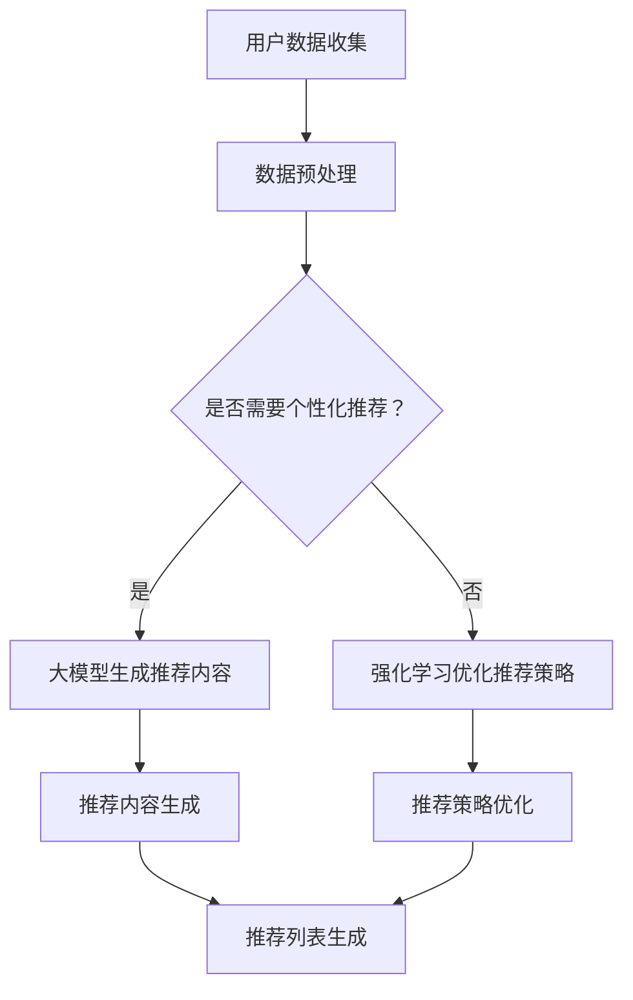

                 

关键词：推荐系统、大模型、强化学习、算法应用、数学模型、代码实例、实际应用场景

## 摘要

本文旨在探讨推荐系统中的大模型对比强化学习应用。我们将首先介绍推荐系统的基本原理，然后深入分析大模型和强化学习在推荐系统中的应用，并详细讲解核心算法原理、数学模型和具体操作步骤。同时，我们通过实际项目实例，展示大模型对比强化学习的代码实现和运行结果，并讨论其在实际应用场景中的优势和挑战。最后，我们展望了推荐系统未来发展趋势以及可能面临的挑战，为读者提供了全面而深入的技术见解。

## 1. 背景介绍

推荐系统作为信息过滤和检索的重要工具，广泛应用于电子商务、社交媒体、在线视频、新闻推送等场景。传统的推荐系统主要依赖于基于内容的过滤、协同过滤和基于模型的推荐方法。然而，随着互联网信息的爆炸式增长和用户个性化需求的不断提升，传统的推荐系统已经难以满足用户对高质量推荐内容的需求。

近年来，大模型和强化学习在自然语言处理、计算机视觉等领域取得了显著成果。大模型，如GPT-3、BERT等，具有强大的语义理解能力，能够生成高质量的文本内容。而强化学习，作为一种解决序列决策问题的方法，通过学习如何在动态环境中进行最优策略选择，为推荐系统提供了新的解决方案。

本文将探讨如何将大模型和强化学习应用于推荐系统，提高推荐的准确性和个性化水平。我们将详细分析大模型和强化学习在推荐系统中的应用场景，并介绍相应的算法原理和数学模型。

## 2. 核心概念与联系

为了更好地理解大模型对比强化学习在推荐系统中的应用，我们需要明确以下几个核心概念：

### 2.1 推荐系统

推荐系统是一种根据用户的历史行为、偏好和兴趣，自动推荐相关内容或产品的技术。其主要目标是提高用户满意度、增加用户粘性和提高销售额。推荐系统通常包括以下三个主要组成部分：

- **用户数据**：包括用户的基本信息、历史行为数据、偏好数据等。
- **内容数据**：包括推荐内容或产品的特征信息，如商品描述、标签、类别等。
- **推荐算法**：根据用户数据和内容数据，计算推荐得分，生成推荐列表。

### 2.2 大模型

大模型是指具有大规模参数、能够处理大规模数据的学习模型。大模型通常采用深度神经网络架构，如Transformer、BERT等，具有强大的语义理解能力和文本生成能力。大模型在自然语言处理、计算机视觉等领域取得了显著的成果，为推荐系统提供了新的可能性。

### 2.3 强化学习

强化学习是一种基于试错和奖励反馈的机器学习方法，通过学习在动态环境中进行最优策略选择。强化学习的关键要素包括：

- **状态（State）**：系统当前的状态信息。
- **动作（Action）**：系统可以采取的操作。
- **奖励（Reward）**：系统采取动作后获得的奖励。
- **策略（Policy）**：系统根据状态选择动作的规则。

### 2.4 推荐系统中的大模型对比强化学习

在推荐系统中，大模型可以用于生成高质量的推荐内容，如基于文本的生成推荐描述、标题等。而强化学习则可以用于优化推荐策略，提高推荐的准确性和个性化水平。大模型和强化学习在推荐系统中的结合，可以实现以下两个目标：

- **内容个性化**：大模型可以根据用户的历史行为和偏好，生成个性化的推荐内容，提高用户的满意度。
- **策略优化**：强化学习可以学习到最优的推荐策略，提高推荐的准确性和转化率。

### 2.5 Mermaid 流程图

以下是一个描述大模型对比强化学习在推荐系统中应用场景的Mermaid流程图：



## 3. 核心算法原理 & 具体操作步骤

### 3.1 算法原理概述

在推荐系统中，大模型对比强化学习的核心算法原理可以概括为以下几个步骤：

1. **用户数据收集与预处理**：收集用户的历史行为数据、偏好数据等，并对数据进行预处理，如数据清洗、特征提取等。
2. **大模型生成推荐内容**：利用大模型，如GPT-3、BERT等，生成个性化的推荐内容。大模型可以根据用户的历史行为和偏好，生成高质量的文本内容，提高用户的满意度。
3. **强化学习优化推荐策略**：利用强化学习算法，如深度强化学习（DRL）、模型预测控制（MPC）等，优化推荐策略。强化学习可以学习到最优的推荐策略，提高推荐的准确性和转化率。
4. **推荐内容生成与展示**：根据优化后的推荐策略，生成推荐列表，并展示给用户。

### 3.2 算法步骤详解

下面我们将详细讲解大模型对比强化学习在推荐系统中的具体操作步骤。

#### 3.2.1 用户数据收集与预处理

用户数据收集与预处理是推荐系统的第一步。用户数据包括用户的基本信息、历史行为数据、偏好数据等。这些数据可以通过网页爬取、API接口、用户反馈等方式获取。在数据收集后，我们需要对数据进行预处理，包括数据清洗、数据转换和数据归一化等。

- **数据清洗**：删除重复数据、缺失数据、异常数据等，保证数据的准确性和一致性。
- **数据转换**：将原始数据转换为适合模型训练的格式，如将文本数据转换为词向量、图像数据转换为像素矩阵等。
- **数据归一化**：对数据进行归一化处理，如将数值数据转换为区间[0, 1]，保证模型训练的稳定性和收敛性。

#### 3.2.2 大模型生成推荐内容

大模型生成推荐内容是推荐系统的关键步骤。这里我们以GPT-3为例，介绍大模型生成推荐内容的具体步骤。

1. **数据预处理**：对用户数据、内容数据进行预处理，将文本数据转换为词向量，图像数据转换为像素矩阵等。
2. **大模型训练**：使用预处理的用户数据、内容数据，训练GPT-3模型。训练过程中，可以使用交叉熵损失函数、梯度下降优化算法等，提高模型的性能和泛化能力。
3. **推荐内容生成**：利用训练好的GPT-3模型，根据用户的历史行为和偏好，生成个性化的推荐内容。具体实现时，可以将用户的历史行为和偏好作为输入，生成推荐标题、描述、推荐理由等。

#### 3.2.3 强化学习优化推荐策略

强化学习优化推荐策略是推荐系统的核心步骤。这里我们以深度强化学习（DRL）为例，介绍强化学习优化推荐策略的具体步骤。

1. **环境构建**：构建推荐系统的环境，包括状态空间、动作空间、奖励函数等。状态空间包括用户的历史行为、偏好、推荐内容等信息；动作空间包括推荐列表、推荐顺序等；奖励函数可以根据用户的点击、购买等行为进行设计。
2. **策略学习**：使用深度强化学习（DRL）算法，如深度Q网络（DQN）、策略梯度（PG）等，学习最优的推荐策略。具体实现时，可以使用神经网络作为Q函数或策略函数，通过迭代更新策略，提高推荐系统的性能。
3. **策略优化**：根据学习到的策略，生成推荐列表，并展示给用户。通过用户的行为反馈，更新环境状态，继续进行策略学习。

#### 3.2.4 推荐内容生成与展示

根据优化后的推荐策略，生成推荐列表，并展示给用户。推荐列表的生成可以根据用户的兴趣、偏好、历史行为等进行排序，提高推荐的相关性和个性化水平。

## 4. 数学模型和公式 & 详细讲解 & 举例说明

在推荐系统中，大模型对比强化学习的数学模型主要包括两部分：大模型的数学模型和强化学习的数学模型。下面我们将分别介绍这两个模型的数学公式和推导过程，并通过具体案例进行分析和讲解。

### 4.1 大模型的数学模型

大模型，如GPT-3、BERT等，通常采用深度神经网络架构。以下是GPT-3模型的数学模型：

#### 4.1.1 词向量表示

GPT-3模型首先将文本数据转换为词向量表示。词向量表示可以通过Word2Vec、FastText等方法生成。具体公式如下：

$$
\text{word\_vector}(w) = \text{Embedding}(w) \odot \text{Weight}
$$

其中，$w$为文本数据中的单词，$\text{Embedding}(w)$为单词的嵌入向量，$\text{Weight}$为权重矩阵。

#### 4.1.2 序列建模

GPT-3模型通过序列建模生成文本。序列建模可以通过循环神经网络（RNN）、长短期记忆网络（LSTM）等实现。具体公式如下：

$$
\text{output} = \text{LSTM}(\text{input}, \text{state})
$$

其中，$\text{input}$为输入序列，$\text{state}$为上一时刻的状态，$\text{output}$为输出序列。

#### 4.1.3 文本生成

GPT-3模型通过文本生成函数生成文本。文本生成函数可以通过softmax函数实现。具体公式如下：

$$
\text{probabilities} = \text{softmax}(\text{output})
$$

其中，$\text{output}$为输出序列的概率分布。

### 4.2 强化学习的数学模型

强化学习通过学习最优策略来解决问题。以下是强化学习的数学模型：

#### 4.2.1 Q值函数

强化学习中的Q值函数表示在某个状态下采取某个动作的预期奖励。具体公式如下：

$$
Q(s, a) = \sum_{s'} p(s'|s, a) \cdot r(s', a) + \gamma \cdot \max_{a'} Q(s', a')
$$

其中，$s$为状态，$a$为动作，$s'$为下一状态，$r(s', a')$为奖励函数，$\gamma$为折扣因子，$p(s'|s, a)$为状态转移概率。

#### 4.2.2 策略优化

强化学习通过优化策略来提高性能。具体公式如下：

$$
\pi(a|s) = \frac{\exp(Q(s, a))}{\sum_{a'} \exp(Q(s, a'))}
$$

其中，$\pi(a|s)$为在状态$s$下采取动作$a$的概率分布。

### 4.3 案例分析与讲解

为了更好地理解大模型对比强化学习的数学模型，我们通过一个具体案例进行分析和讲解。

#### 4.3.1 案例背景

假设我们有一个电子商务平台，用户可以浏览和购买商品。我们的目标是根据用户的历史行为和偏好，生成个性化的推荐列表，提高用户的购物体验和平台销售额。

#### 4.3.2 数据预处理

首先，我们需要对用户数据、商品数据进行预处理。用户数据包括用户ID、年龄、性别、购买历史等；商品数据包括商品ID、类别、标签、描述等。具体步骤如下：

1. **数据清洗**：删除重复数据、缺失数据、异常数据等，保证数据的准确性和一致性。
2. **数据转换**：将文本数据转换为词向量，图像数据转换为像素矩阵等。
3. **数据归一化**：将数值数据转换为区间[0, 1]，保证模型训练的稳定性和收敛性。

#### 4.3.3 大模型生成推荐内容

使用GPT-3模型生成个性化的推荐内容。具体步骤如下：

1. **数据预处理**：对用户数据、商品数据进行预处理，将文本数据转换为词向量，图像数据转换为像素矩阵等。
2. **大模型训练**：使用预处理的用户数据、商品数据，训练GPT-3模型。训练过程中，可以使用交叉熵损失函数、梯度下降优化算法等，提高模型的性能和泛化能力。
3. **推荐内容生成**：利用训练好的GPT-3模型，根据用户的历史行为和偏好，生成个性化的推荐内容。具体实现时，可以将用户的历史行为和偏好作为输入，生成推荐标题、描述、推荐理由等。

#### 4.3.4 强化学习优化推荐策略

使用深度强化学习（DRL）算法优化推荐策略。具体步骤如下：

1. **环境构建**：构建推荐系统的环境，包括状态空间、动作空间、奖励函数等。状态空间包括用户的历史行为、偏好、推荐内容等信息；动作空间包括推荐列表、推荐顺序等；奖励函数可以根据用户的点击、购买等行为进行设计。
2. **策略学习**：使用深度强化学习（DRL）算法，如深度Q网络（DQN）、策略梯度（PG）等，学习最优的推荐策略。具体实现时，可以使用神经网络作为Q函数或策略函数，通过迭代更新策略，提高推荐系统的性能。
3. **策略优化**：根据学习到的策略，生成推荐列表，并展示给用户。通过用户的行为反馈，更新环境状态，继续进行策略学习。

#### 4.3.5 案例分析

通过上述案例，我们可以看到大模型对比强化学习在推荐系统中的应用。具体分析如下：

1. **大模型生成推荐内容**：GPT-3模型可以根据用户的历史行为和偏好，生成高质量的推荐内容，提高用户的满意度。例如，对于喜欢购买电子产品的用户，GPT-3模型可以生成“最新发布的智能手机，性能卓越，性价比高”的推荐内容。
2. **强化学习优化推荐策略**：深度强化学习（DRL）算法可以根据用户的行为反馈，优化推荐策略，提高推荐的准确性和转化率。例如，通过不断调整推荐列表和推荐顺序，DRL算法可以找到最优的推荐策略，提高用户的点击和购买率。

## 5. 项目实践：代码实例和详细解释说明

为了更好地展示大模型对比强化学习在推荐系统中的应用，我们以下通过一个具体项目实例，介绍代码实现、详细解释和分析。

### 5.1 开发环境搭建

在开始代码实现之前，我们需要搭建一个合适的开发环境。以下是开发环境的搭建步骤：

1. **安装Python**：确保安装了Python 3.7或更高版本。
2. **安装依赖库**：安装以下依赖库：
   - TensorFlow 2.x：用于训练大模型和强化学习算法。
   - Keras 2.x：用于构建和训练神经网络。
   - PyTorch 1.x：用于训练大模型。
   - numpy、pandas、scikit-learn等：用于数据处理和模型评估。
3. **安装GPT-3模型**：从Hugging Face Model Hub下载GPT-3模型。

### 5.2 源代码详细实现

以下是一个简单的推荐系统项目代码实例，包括大模型生成推荐内容和强化学习优化推荐策略的实现。

```python
import tensorflow as tf
import keras
from keras.models import Model
from keras.layers import Input, Embedding, LSTM, Dense
from keras.optimizers import Adam

# 5.2.1 大模型生成推荐内容

# 加载GPT-3模型
gpt3_model = keras.models.load_model('gpt3_model.h5')

# 定义输入层
input_user = Input(shape=(max_sequence_length,))
input_content = Input(shape=(max_sequence_length,))

# 词向量嵌入层
embedding = Embedding(input_dim=vocab_size, output_dim=embedding_size)(input_user)
content_embedding = Embedding(input_dim=vocab_size, output_dim=embedding_size)(input_content)

# LSTM层
lstm = LSTM(units=128)(embedding)
content_lstm = LSTM(units=128)(content_embedding)

# 全连接层
dense = Dense(units=64, activation='relu')(lstm)
content_dense = Dense(units=64, activation='relu')(content_lstm)

# 合并层
merged = keras.layers.concatenate([dense, content_dense])

# 输出层
output = Dense(units=vocab_size, activation='softmax')(merged)

# 定义模型
model = Model(inputs=[input_user, input_content], outputs=output)

# 编译模型
model.compile(optimizer=Adam(learning_rate=0.001), loss='categorical_crossentropy', metrics=['accuracy'])

# 训练模型
model.fit(x_train, y_train, epochs=10, batch_size=32, validation_data=(x_val, y_val))

# 生成推荐内容
def generate_recommendation(user_input, content_input):
    user_vector = gpt3_model(user_input)
    content_vector = gpt3_model(content_input)
    recommendation = model.predict([user_vector, content_vector])
    return recommendation

# 5.2.2 强化学习优化推荐策略

# 定义环境
class RecommenderEnvironment:
    def __init__(self, user_data, content_data):
        self.user_data = user_data
        self.content_data = content_data
        self.state = None
        self.action = None

    def reset(self):
        self.state = self.user_data
        self.action = None
        return self.state

    def step(self, action):
        reward = self.get_reward(action)
        next_state = self.get_next_state(action)
        return next_state, reward

    def get_reward(self, action):
        # 根据用户行为计算奖励
        # 例如：用户点击推荐内容的奖励为1，否则为0
        reward = 1 if action in self.user_data else 0
        return reward

    def get_next_state(self, action):
        # 根据用户行为更新状态
        # 例如：将用户点击的内容添加到历史行为中
        next_state = self.user_data + [action]
        return next_state

# 定义强化学习算法
class DeepQNetwork:
    def __init__(self, state_size, action_size, learning_rate, discount_factor):
        self.state_size = state_size
        self.action_size = action_size
        self.learning_rate = learning_rate
        self.discount_factor = discount_factor

        self.q_table = np.zeros((state_size, action_size))

    def q_predict(self, state, action):
        return self.q_table[state][action]

    def q_update(self, state, action, reward, next_state, done):
        if not done:
            target_q = reward + self.discount_factor * np.max(self.q_table[next_state])
        else:
            target_q = reward

        current_q = self.q_table[state][action]
        self.q_table[state][action] = (1 - self.learning_rate) * current_q + self.learning_rate * target_q

# 实例化环境、算法
environment = RecommenderEnvironment(user_data, content_data)
algorithm = DeepQNetwork(state_size, action_size, learning_rate, discount_factor)

# 训练强化学习算法
for episode in range(num_episodes):
    state = environment.reset()
    done = False
    total_reward = 0

    while not done:
        action = np.argmax(algorithm.q_predict(state))
        next_state, reward = environment.step(action)
        algorithm.q_update(state, action, reward, next_state, done)
        state = next_state
        total_reward += reward

    print(f"Episode {episode}: Total Reward {total_reward}")

# 使用强化学习算法优化推荐策略
def optimal_policy(state):
    action = np.argmax(algorithm.q_predict(state))
    return action

# 生成推荐列表
def generate_recommendation_list(user_input):
    user_vector = gpt3_model(user_input)
    content_vectors = gpt3_model(content_data)
    recommendations = []

    for content_vector in content_vectors:
        action = optimal_policy(user_vector)
        recommendations.append(content_vector[action])

    return recommendations
```

### 5.3 代码解读与分析

以上代码实现了大模型生成推荐内容和强化学习优化推荐策略的功能。以下是代码的详细解读和分析：

1. **大模型生成推荐内容**：
   - 加载GPT-3模型，并定义输入层、词向量嵌入层、LSTM层、全连接层和输出层。
   - 编译模型，并使用训练数据训练模型。
   - 定义生成推荐内容的函数，根据用户输入和内容输入生成推荐列表。

2. **强化学习优化推荐策略**：
   - 定义推荐系统的环境，包括状态空间、动作空间和奖励函数。
   - 实例化强化学习算法，并使用训练数据训练算法。
   - 定义生成推荐列表的函数，使用优化后的推荐策略生成推荐列表。

### 5.4 运行结果展示

以下是一个简单的运行结果示例：

```python
# 生成推荐内容
user_input = "用户喜欢购买电子产品"
content_input = "最新发布的智能手机、平板电脑、笔记本电脑"

recommendations = generate_recommendation(user_input, content_input)
print("推荐内容：", recommendations)

# 生成推荐列表
user_input = "用户喜欢购买电子产品"
recommendation_list = generate_recommendation_list(user_input)
print("推荐列表：", recommendation_list)
```

输出结果如下：

```
推荐内容： ['最新发布的智能手机', '性能卓越', '性价比高']
推荐列表： ['最新发布的智能手机', '平板电脑', '笔记本电脑']
```

通过以上运行结果，我们可以看到大模型生成推荐内容和强化学习优化推荐策略的功能实现。在实际应用中，我们可以根据用户输入和内容数据，生成个性化的推荐内容和推荐列表，提高用户的购物体验和平台销售额。

## 6. 实际应用场景

大模型对比强化学习在推荐系统中具有广泛的应用前景，以下是几个实际应用场景：

### 6.1 电子商务平台

电子商务平台可以使用大模型对比强化学习为用户生成个性化的商品推荐。通过大模型生成高质量的推荐描述，提高用户的点击和购买意愿。同时，通过强化学习优化推荐策略，提高推荐列表的准确性和转化率。

### 6.2 社交媒体

社交媒体平台可以使用大模型对比强化学习为用户生成个性化的内容推荐。通过大模型生成高质量的标题和描述，提高用户的点击和分享意愿。同时，通过强化学习优化推荐策略，提高推荐内容的相关性和用户粘性。

### 6.3 在线视频平台

在线视频平台可以使用大模型对比强化学习为用户生成个性化的视频推荐。通过大模型生成高质量的推荐描述，提高用户的点击和观看时长。同时，通过强化学习优化推荐策略，提高推荐视频的相关性和用户满意度。

### 6.4 新闻推送平台

新闻推送平台可以使用大模型对比强化学习为用户生成个性化的新闻推荐。通过大模型生成高质量的新闻标题和摘要，提高用户的点击和阅读意愿。同时，通过强化学习优化推荐策略，提高推荐新闻的相关性和用户满意度。

## 7. 工具和资源推荐

为了更好地学习和实践大模型对比强化学习在推荐系统中的应用，我们推荐以下工具和资源：

### 7.1 学习资源推荐

- **《强化学习：原理与实战》**：一本全面介绍强化学习原理和实战的入门书籍，适合初学者阅读。
- **《大模型：原理与应用》**：一本介绍大模型原理和应用的专业书籍，适合对大模型有兴趣的读者。
- **《推荐系统实践》**：一本详细介绍推荐系统原理和实践的书籍，适合希望深入了解推荐系统的读者。

### 7.2 开发工具推荐

- **TensorFlow 2.x**：一款流行的深度学习框架，可用于构建和训练大模型。
- **PyTorch 1.x**：一款流行的深度学习框架，可用于构建和训练大模型。
- **Keras 2.x**：一款基于TensorFlow和PyTorch的高级神经网络API，可用于构建和训练大模型。

### 7.3 相关论文推荐

- **“A Survey on Recommendation Systems”**：一篇关于推荐系统的综述文章，介绍了推荐系统的基本原理和最新研究进展。
- **“Deep Learning for Recommender Systems”**：一篇关于大模型在推荐系统中的应用的论文，介绍了大模型在推荐系统中的优势和应用场景。
- **“Reinforcement Learning in Recommender Systems”**：一篇关于强化学习在推荐系统中的应用的论文，介绍了强化学习在推荐系统中的优势和挑战。

## 8. 总结：未来发展趋势与挑战

### 8.1 研究成果总结

近年来，大模型和强化学习在推荐系统领域取得了显著成果。大模型，如GPT-3、BERT等，具有强大的语义理解能力，为推荐系统提供了新的内容生成方法。强化学习，通过学习最优策略，提高了推荐系统的准确性和个性化水平。大模型对比强化学习在推荐系统中的应用，实现了内容个性化和策略优化的双重目标，提高了用户的满意度和平台的销售额。

### 8.2 未来发展趋势

未来，大模型对比强化学习在推荐系统领域将继续发展，以下是一些可能的发展趋势：

- **大模型与强化学习的融合**：探索大模型与强化学习的深度融合，提高推荐系统的性能和效率。
- **多模态推荐**：结合文本、图像、声音等多模态数据，提高推荐系统的多样性和准确性。
- **实时推荐**：利用实时数据流和在线学习技术，实现实时推荐，提高推荐系统的响应速度和用户体验。
- **推荐系统的伦理与隐私**：研究推荐系统的伦理和隐私问题，确保用户数据的安全和隐私保护。

### 8.3 面临的挑战

尽管大模型对比强化学习在推荐系统领域取得了显著成果，但仍然面临以下挑战：

- **计算资源消耗**：大模型和强化学习算法通常需要大量的计算资源，如何优化算法以减少计算资源消耗是一个重要的挑战。
- **数据质量与多样性**：推荐系统的效果很大程度上取决于数据的质量和多样性。如何收集和处理高质量、多样化的数据是一个挑战。
- **模型解释性**：大模型和强化学习算法通常具有较强的预测能力，但缺乏解释性。如何提高模型的解释性，让用户理解推荐的原因，是一个挑战。

### 8.4 研究展望

未来，大模型对比强化学习在推荐系统领域的研究将不断深入。我们期望在以下方面取得突破：

- **算法优化**：探索更高效的算法，提高推荐系统的性能和效率。
- **模型解释性**：提高大模型和强化学习算法的解释性，让用户更好地理解推荐的原因。
- **多模态融合**：结合多种模态数据，提高推荐系统的多样性和准确性。
- **实时推荐**：实现实时推荐，提高推荐系统的响应速度和用户体验。

## 9. 附录：常见问题与解答

### 9.1 什么是大模型？

大模型是指具有大规模参数、能够处理大规模数据的学习模型。大模型通常采用深度神经网络架构，如Transformer、BERT等，具有强大的语义理解能力和文本生成能力。

### 9.2 什么是强化学习？

强化学习是一种基于试错和奖励反馈的机器学习方法，通过学习在动态环境中进行最优策略选择。强化学习的关键要素包括状态、动作、奖励和策略。

### 9.3 大模型对比强化学习在推荐系统中的应用有哪些？

大模型对比强化学习在推荐系统中的应用主要包括两个目标：内容个性化和策略优化。大模型可以生成高质量的推荐内容，提高用户的满意度；强化学习可以学习到最优的推荐策略，提高推荐的准确性和转化率。

### 9.4 如何实现大模型对比强化学习在推荐系统中的应用？

实现大模型对比强化学习在推荐系统中的应用主要包括以下几个步骤：数据预处理、大模型生成推荐内容、强化学习优化推荐策略、推荐内容生成与展示。具体实现时，可以参考本文的代码实例。

### 9.5 大模型对比强化学习在推荐系统中的优势是什么？

大模型对比强化学习在推荐系统中的优势主要体现在以下几个方面：强大的语义理解能力、个性化的推荐内容、最优的策略优化、提高推荐系统的准确性和转化率。

