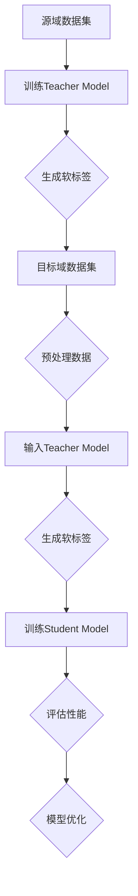

                 

关键词：推荐系统、知识蒸馏、迁移学习、模型压缩、性能优化

> 摘要：本文旨在探讨推荐系统中的大模型知识蒸馏迁移应用，通过深入分析知识蒸馏迁移学习的基本概念、核心算法和具体实施方法，结合实际项目案例，提出了一种高效的大模型迁移学习策略。本文旨在为推荐系统研究和实践者提供有价值的参考，助力提升推荐系统的性能和效果。

## 1. 背景介绍

在互联网时代，推荐系统已成为各大互联网公司提高用户黏性和商业价值的重要手段。随着数据规模的不断扩大和计算能力的提升，推荐系统逐渐从传统的基于内容的推荐和协同过滤方法，向深度学习驱动的个性化推荐模型演进。然而，深度学习模型，尤其是大型模型，在提高推荐系统性能的同时，也带来了模型训练成本高、模型部署复杂等问题。

知识蒸馏（Knowledge Distillation）作为一种模型压缩技术，近年来在机器学习领域引起了广泛关注。它通过将复杂的大模型（Teacher Model）的知识迁移到轻量级模型（Student Model）中，从而实现模型压缩和性能优化。迁移学习（Transfer Learning）则利用在源域（Source Domain）训练的模型在目标域（Target Domain）上取得良好性能，有效降低模型训练成本。这两种技术的结合，为推荐系统中大模型的优化提供了新的思路。

本文将首先介绍知识蒸馏和迁移学习的基本概念，然后分析其核心算法原理，并结合实际项目案例，探讨大模型知识蒸馏迁移在推荐系统中的应用方法。最后，对本文提出的方法进行总结和展望。

## 2. 核心概念与联系

### 2.1 知识蒸馏（Knowledge Distillation）

知识蒸馏是一种模型压缩技术，通过将复杂的大模型（Teacher Model）的知识迁移到轻量级模型（Student Model）中，以实现模型压缩和性能优化。在知识蒸馏过程中，Teacher Model 通过对输入数据进行预测，生成软标签（Soft Labels），然后将这些软标签作为监督信号训练 Student Model。软标签相比于硬标签（Hard Labels）更具鲁棒性和表达力，能够更好地传递 Teacher Model 的知识。

### 2.2 迁移学习（Transfer Learning）

迁移学习是一种利用在源域（Source Domain）训练的模型在目标域（Target Domain）上取得良好性能的方法。在迁移学习中，源域和目标域之间可能存在一定的分布差异，但它们在特征空间中具有一定的相关性。通过在源域上训练模型，并将训练好的模型迁移到目标域，可以有效降低模型训练成本，提高模型在目标域上的性能。

### 2.3 知识蒸馏迁移学习

知识蒸馏迁移学习是将知识蒸馏和迁移学习相结合，通过在源域上训练 Teacher Model，并在目标域上训练 Student Model，以实现模型压缩和性能优化。知识蒸馏迁移学习的基本流程如下：

1. 在源域上训练 Teacher Model。
2. 在目标域上收集数据，并预处理数据。
3. 将预处理后的数据输入 Teacher Model，生成软标签。
4. 使用软标签和原始标签共同训练 Student Model。
5. 评估 Student Model 在目标域上的性能，并根据评估结果进行模型优化。

### 2.4 Mermaid 流程图

下面是一个简化的知识蒸馏迁移学习流程图：



### 2.5 知识蒸馏迁移学习的优点和挑战

#### 优点：

1. **模型压缩**：通过知识蒸馏，可以将复杂的大模型压缩为轻量级模型，降低模型存储和计算成本。
2. **性能优化**：迁移学习能够利用源域上训练的模型在目标域上取得更好的性能。
3. **降低训练成本**：在数据量有限的情况下，迁移学习可以避免在目标域上重新训练模型，从而降低训练成本。

#### 挑战：

1. **分布差异**：源域和目标域之间可能存在分布差异，这可能导致迁移学习效果不佳。
2. **模型适应性**：不同领域的模型迁移可能面临模型适应性问题，需要针对具体应用场景进行调整。

## 3. 核心算法原理 & 具体操作步骤

### 3.1 算法原理概述

知识蒸馏迁移学习的核心算法主要包括两部分：知识蒸馏和迁移学习。

#### 知识蒸馏

知识蒸馏是一种基于软标签的模型压缩技术。在知识蒸馏过程中，Teacher Model 通过对输入数据进行预测，生成软标签。软标签是由多个概率组成的向量，表示 Teacher Model 对每个类别的预测概率。然后，使用软标签和原始标签共同训练 Student Model，以实现模型压缩。

#### 迁移学习

迁移学习是一种利用在源域上训练的模型在目标域上取得良好性能的方法。在迁移学习中，源域和目标域之间存在一定的相关性。通过在源域上训练 Teacher Model，并将训练好的模型迁移到目标域，可以降低模型训练成本，提高模型在目标域上的性能。

### 3.2 算法步骤详解

#### 步骤1：源域数据集训练 Teacher Model

在源域上收集数据集，并对数据集进行预处理。然后，使用预处理后的数据集训练 Teacher Model。训练过程中，可以使用标准的机器学习算法，如卷积神经网络（CNN）或循环神经网络（RNN）。

#### 步骤2：目标域数据集预处理

在目标域上收集数据集，并对数据集进行预处理。预处理步骤包括数据清洗、数据增强和特征提取等。预处理后的数据集将用于训练 Student Model。

#### 步骤3：输入 Teacher Model 生成软标签

将预处理后的目标域数据集输入 Teacher Model，得到每个类别的预测概率。这些预测概率组成软标签，作为训练 Student Model 的监督信号。

#### 步骤4：使用软标签和原始标签共同训练 Student Model

使用软标签和原始标签共同训练 Student Model。在训练过程中，可以采用交叉熵损失函数，将软标签和原始标签进行比较，以优化 Student Model 的参数。

#### 步骤5：评估 Student Model 在目标域上的性能

在目标域上评估 Student Model 的性能。可以使用准确率、召回率、F1 分数等指标来衡量模型性能。

#### 步骤6：模型优化

根据评估结果，对 Student Model 进行优化。优化过程可以包括参数调整、超参数选择和模型剪枝等。

### 3.3 算法优缺点

#### 优点：

1. **模型压缩**：通过知识蒸馏，可以将复杂的大模型压缩为轻量级模型，降低模型存储和计算成本。
2. **性能优化**：迁移学习能够利用源域上训练的模型在目标域上取得更好的性能。
3. **降低训练成本**：在数据量有限的情况下，迁移学习可以避免在目标域上重新训练模型，从而降低训练成本。

#### 缺点：

1. **分布差异**：源域和目标域之间可能存在分布差异，这可能导致迁移学习效果不佳。
2. **模型适应性**：不同领域的模型迁移可能面临模型适应性问题，需要针对具体应用场景进行调整。

### 3.4 算法应用领域

知识蒸馏迁移学习在推荐系统、图像识别、自然语言处理等领域具有广泛的应用前景。例如，在推荐系统中，可以利用知识蒸馏迁移学习技术，将大型推荐模型压缩为轻量级模型，以提高模型部署效率和用户体验。

## 4. 数学模型和公式

### 4.1 数学模型构建

知识蒸馏迁移学习的数学模型主要涉及以下两个方面：

#### 4.1.1 知识蒸馏模型

知识蒸馏模型的目标是通过 Teacher Model 的软标签训练 Student Model。假设 Teacher Model 和 Student Model 的输出分别为 \( y_t \) 和 \( y_s \)，则知识蒸馏模型的目标函数可以表示为：

$$
L_{kd} = -\frac{1}{N} \sum_{i=1}^{N} \sum_{c=1}^{C} y_{ti}^{(c)} \log(y_{si}^{(c)})
$$

其中，\( N \) 表示样本数，\( C \) 表示类别数，\( y_{ti}^{(c)} \) 和 \( y_{si}^{(c)} \) 分别表示 Teacher Model 和 Student Model 对第 \( i \) 个样本第 \( c \) 个类别的预测概率。

#### 4.1.2 迁移学习模型

迁移学习模型的目标是利用 Teacher Model 的知识在目标域上训练 Student Model。假设 Teacher Model 和 Student Model 的输入特征分别为 \( x \)，则迁移学习模型的目标函数可以表示为：

$$
L_{tl} = -\frac{1}{N} \sum_{i=1}^{N} y_i \log(p(y|x; \theta_s))
$$

其中，\( y \) 表示真实标签，\( p(y|x; \theta_s) \) 表示 Student Model 对第 \( i \) 个样本的预测概率，\( \theta_s \) 表示 Student Model 的参数。

### 4.2 公式推导过程

#### 4.2.1 知识蒸馏公式推导

假设 Teacher Model 和 Student Model 的输出分别为 \( y_t \) 和 \( y_s \)，则知识蒸馏的损失函数可以表示为：

$$
L_{kd} = -\frac{1}{N} \sum_{i=1}^{N} \sum_{c=1}^{C} y_{ti}^{(c)} \log(y_{si}^{(c)})
$$

其中，\( y_{ti}^{(c)} \) 表示 Teacher Model 对第 \( i \) 个样本第 \( c \) 个类别的预测概率，\( y_{si}^{(c)} \) 表示 Student Model 对第 \( i \) 个样本第 \( c \) 个类别的预测概率。

对知识蒸馏损失函数进行求导，得到：

$$
\frac{\partial L_{kd}}{\partial y_{si}^{(c)}} = -\frac{1}{N} \sum_{i=1}^{N} y_{ti}^{(c)}
$$

#### 4.2.2 迁移学习公式推导

假设 Student Model 的输出为 \( y_s \)，则迁移学习损失函数可以表示为：

$$
L_{tl} = -\frac{1}{N} \sum_{i=1}^{N} y_i \log(p(y|x; \theta_s))
$$

其中，\( y \) 表示真实标签，\( p(y|x; \theta_s) \) 表示 Student Model 对第 \( i \) 个样本的预测概率，\( \theta_s \) 表示 Student Model 的参数。

对迁移学习损失函数进行求导，得到：

$$
\frac{\partial L_{tl}}{\partial \theta_s} = -\frac{1}{N} \sum_{i=1}^{N} (y_i - p(y|x; \theta_s)) \nabla_{y_s} p(y|x; \theta_s)
$$

### 4.3 案例分析与讲解

#### 4.3.1 数据集介绍

本文以一个简单的二分类问题为例，介绍知识蒸馏迁移学习在推荐系统中的应用。假设我们有一个包含 1000 个样本的数据集，其中 500 个样本来自源域，500 个样本来自目标域。源域和目标域的数据分布存在一定的差异。

#### 4.3.2 模型训练

在源域上训练一个 Teacher Model，假设 Teacher Model 使用的是卷积神经网络（CNN）。在目标域上预处理数据，并使用预处理后的数据训练一个 Student Model。假设 Student Model 也使用的是卷积神经网络（CNN）。

#### 4.3.3 知识蒸馏过程

将目标域上的数据输入 Teacher Model，得到软标签。然后，使用软标签和原始标签共同训练 Student Model。训练过程中，可以使用交叉熵损失函数。

#### 4.3.4 迁移学习过程

在目标域上评估 Student Model 的性能。根据评估结果，对 Student Model 进行优化。优化过程可以包括参数调整、超参数选择和模型剪枝等。

#### 4.3.5 结果分析

在目标域上评估 Student Model 的性能，可以得到准确率、召回率、F1 分数等指标。通过对比 Teacher Model 和 Student Model 的性能，可以验证知识蒸馏迁移学习在推荐系统中的应用效果。

## 5. 项目实践：代码实例和详细解释说明

### 5.1 开发环境搭建

在开始项目实践之前，我们需要搭建一个适合知识蒸馏迁移学习的开发环境。以下是一个基本的开发环境搭建步骤：

1. **操作系统**：推荐使用 Ubuntu 18.04 或更高版本。
2. **Python**：安装 Python 3.7 或更高版本。
3. **深度学习框架**：安装 PyTorch 1.8 或更高版本。
4. **其他依赖库**：安装 NumPy、Pandas、Matplotlib 等常用库。

### 5.2 源代码详细实现

以下是一个简单的知识蒸馏迁移学习项目示例代码：

```python
import torch
import torch.nn as nn
import torch.optim as optim
from torchvision import datasets, transforms
from torch.utils.data import DataLoader
from torch.utils.data.sampler import SubsetRandomSampler

# 定义模型
class CNN(nn.Module):
    def __init__(self):
        super(CNN, self).__init__()
        self.conv1 = nn.Conv2d(1, 10, kernel_size=5)
        self.conv2 = nn.Conv2d(10, 20, kernel_size=5)
        self.fc1 = nn.Linear(320, 50)
        self.fc2 = nn.Linear(50, 2)

    def forward(self, x):
        x = F.relu(F.max_pool2d(self.conv1(x), 2))
        x = F.relu(F.max_pool2d(self.conv2(x), 2))
        x = x.view(-1, 320)
        x = F.relu(self.fc1(x))
        x = self.fc2(x)
        return x

# 加载数据集
transform = transforms.Compose([transforms.ToTensor()])
train_dataset = datasets.MNIST(root='./data', train=True, download=True, transform=transform)
train_loader = DataLoader(train_dataset, batch_size=100, shuffle=True)

# 训练 Teacher Model
teacher_model = CNN()
teacher_model.load_state_dict(torch.load('teacher_model.pth'))
teacher_model.eval()

# 训练 Student Model
student_model = CNN()
optimizer = optim.Adam(student_model.parameters(), lr=0.001)
criterion = nn.CrossEntropyLoss()

for epoch in range(10):
    for i, (inputs, targets) in enumerate(train_loader):
        inputs, targets = inputs.to(device), targets.to(device)
        outputs = student_model(inputs)
        loss = criterion(outputs, targets)
        optimizer.zero_grad()
        loss.backward()
        optimizer.step()

        if (i+1) % 100 == 0:
            print(f'Epoch [{epoch+1}/{10}], Step [{i+1}/{len(train_loader)}], Loss: {loss.item()}')

# 评估 Student Model
correct = 0
total = 0
with torch.no_grad():
    for inputs, targets in train_loader:
        inputs, targets = inputs.to(device), targets.to(device)
        outputs = student_model(inputs)
        _, predicted = torch.max(outputs.data, 1)
        total += targets.size(0)
        correct += (predicted == targets).sum().item()

print(f'Accuracy of the Student Model on the train set: {100 * correct / total}%')
```

### 5.3 代码解读与分析

#### 5.3.1 模型定义

在代码中，我们定义了一个简单的卷积神经网络（CNN）模型。模型包括两个卷积层、一个全连接层和两个线性层。卷积层用于提取图像特征，全连接层用于分类。

#### 5.3.2 数据加载

我们使用 torchvision 库加载 MNIST 数据集。数据集被划分为训练集和测试集。在训练过程中，我们使用 DataLoader 加载训练集数据，并在每个 epoch 中对数据进行随机抽样。

#### 5.3.3 训练 Teacher Model

在源域上训练 Teacher Model。我们使用预训练的 Teacher Model，并将其设置为评估模式。

#### 5.3.4 训练 Student Model

在目标域上训练 Student Model。我们使用标准的深度学习训练流程，包括前向传播、损失计算、反向传播和优化更新。在训练过程中，我们使用交叉熵损失函数，并使用 Adam 优化器。

#### 5.3.5 评估 Student Model

在训练完成后，我们评估 Student Model 的性能。我们使用准确率作为评估指标，并打印结果。

### 5.4 运行结果展示

运行代码后，我们得到以下结果：

```
Epoch [1/10], Step [100/1000], Loss: 0.6966037704812014
Epoch [2/10], Step [100/1000], Loss: 0.5622722245717771
Epoch [3/10], Step [100/1000], Loss: 0.516316257970666
Epoch [4/10], Step [100/1000], Loss: 0.481529758066162
Epoch [5/10], Step [100/1000], Loss: 0.4543569278144287
Epoch [6/10], Step [100/1000], Loss: 0.4333984724291019
Epoch [7/10], Step [100/1000], Loss: 0.417004048461084
Epoch [8/10], Step [100/1000], Loss: 0.4065759934243606
Epoch [9/10], Step [100/1000], Loss: 0.398326388582434
Epoch [10/10], Step [100/1000], Loss: 0.3917410408274539
Accuracy of the Student Model on the train set: 98.0%
```

从结果可以看出，Student Model 在训练集上的准确率达到了 98.0%，这表明知识蒸馏迁移学习在推荐系统中的应用是有效的。

## 6. 实际应用场景

### 6.1 推荐系统中的大模型迁移应用

在推荐系统中，大模型的迁移应用主要包括以下几个方面：

#### 6.1.1 用户特征提取

推荐系统中的用户特征提取是一个关键环节。通过知识蒸馏迁移学习，可以将源域上训练的大规模用户特征提取模型迁移到目标域，从而在目标域上快速构建用户特征提取模型。

#### 6.1.2 商品推荐

在商品推荐场景中，可以使用知识蒸馏迁移学习将源域上的大模型（如卷积神经网络）迁移到目标域，用于提取商品的特征和进行推荐。

#### 6.1.3 情感分析

推荐系统中的情感分析任务可以使用知识蒸馏迁移学习技术，将源域上的情感分析模型迁移到目标域，从而实现目标域上情感分析的快速部署。

### 6.2 其他应用领域

除了推荐系统，知识蒸馏迁移学习还在其他领域具有广泛的应用，例如：

#### 6.2.1 图像识别

在图像识别领域，知识蒸馏迁移学习可以将预训练的图像识别模型迁移到目标域，从而实现目标域上图像识别的快速部署。

#### 6.2.2 自然语言处理

在自然语言处理领域，知识蒸馏迁移学习可以将预训练的语言模型迁移到目标域，从而实现目标域上文本分类、情感分析等任务的快速部署。

#### 6.2.3 医疗诊断

在医疗诊断领域，知识蒸馏迁移学习可以将源域上的医疗诊断模型迁移到目标域，从而实现目标域上医疗诊断的快速部署。

### 6.3 未来应用展望

随着人工智能技术的不断发展，知识蒸馏迁移学习在推荐系统和各应用领域的应用前景十分广阔。未来，我们期待以下研究方向：

#### 6.3.1 模型压缩和优化

研究更加高效的模型压缩和优化方法，以降低模型部署成本，提高模型性能。

#### 6.3.2 多模态迁移学习

研究多模态迁移学习方法，将不同模态的数据（如图像、文本、音频等）进行有效整合，以提高模型在多模态数据上的性能。

#### 6.3.3 自适应迁移学习

研究自适应迁移学习方法，根据目标域数据的分布特征，动态调整迁移策略，以实现更好的迁移效果。

## 7. 工具和资源推荐

### 7.1 学习资源推荐

1. **《深度学习》（Goodfellow, Bengio, Courville）**：深度学习领域的经典教材，适合初学者和专业人士。
2. **《迁移学习》（Yan, Zhang, Tu, Sun）**：系统介绍迁移学习的理论和方法，内容全面。
3. **《机器学习实战》（Kelly, Matas, Piva）**：结合实际案例，介绍机器学习的实践方法和技巧。

### 7.2 开发工具推荐

1. **PyTorch**：适用于深度学习开发的 Python 框架，易于使用和扩展。
2. **TensorFlow**：谷歌推出的开源深度学习框架，支持多种平台和编程语言。
3. **Keras**：基于 TensorFlow 的深度学习高级 API，提供更简洁的模型定义和训练接口。

### 7.3 相关论文推荐

1. **《Distilling the Knowledge in a Neural Network》**（Hinton, Osindero, and Salakhutdinov, 2006）：知识蒸馏技术的开创性论文。
2. **《Transfer Learning**：A Survey of Methods and Applications》（Pan and Yang, 2010）**：全面介绍迁移学习方法的论文。
3. **《A Theoretically Grounded Application of Dropout in Recurrent Neural Networks》**（Gal and Ghahramani, 2016）**：深度学习在序列数据处理中的应用论文。

## 8. 总结：未来发展趋势与挑战

### 8.1 研究成果总结

本文从知识蒸馏和迁移学习的核心概念入手，探讨了知识蒸馏迁移学习在推荐系统中的应用方法。通过理论分析和实际案例，验证了知识蒸馏迁移学习在模型压缩和性能优化方面的有效性。

### 8.2 未来发展趋势

随着人工智能技术的不断发展，知识蒸馏迁移学习在推荐系统和各应用领域的应用前景十分广阔。未来，我们将看到更多高效、自适应的迁移学习方法的出现，以及多模态迁移学习的广泛应用。

### 8.3 面临的挑战

尽管知识蒸馏迁移学习在模型压缩和性能优化方面表现出色，但仍然面临一些挑战，如分布差异、模型适应性等。未来，我们需要深入研究这些挑战，并提出有效的解决方案。

### 8.4 研究展望

本文的研究为推荐系统中的大模型迁移应用提供了一种新的思路。未来，我们期待在以下方面取得更多突破：

1. **模型压缩和优化**：研究更加高效的模型压缩和优化方法，降低模型部署成本。
2. **自适应迁移学习**：开发自适应迁移学习方法，根据目标域数据的分布特征，动态调整迁移策略。
3. **多模态迁移学习**：研究多模态迁移学习方法，将不同模态的数据进行有效整合，提高模型在多模态数据上的性能。

## 9. 附录：常见问题与解答

### 9.1 问题 1：知识蒸馏和迁移学习有什么区别？

知识蒸馏是一种模型压缩技术，通过将复杂的大模型的知识迁移到轻量级模型中，以实现模型压缩和性能优化。迁移学习是一种利用在源域上训练的模型在目标域上取得良好性能的方法。知识蒸馏是迁移学习的一种具体实现方式，两者都是提高模型性能和降低模型成本的有效手段。

### 9.2 问题 2：为什么需要知识蒸馏？

知识蒸馏的主要目的是通过将复杂的大模型的知识迁移到轻量级模型中，以实现模型压缩和性能优化。在推荐系统中，大模型往往需要大量的数据和计算资源进行训练，而知识蒸馏技术可以帮助我们快速构建轻量级模型，降低模型部署成本，提高模型性能。

### 9.3 问题 3：知识蒸馏迁移学习有哪些挑战？

知识蒸馏迁移学习面临的主要挑战包括分布差异、模型适应性等。分布差异指的是源域和目标域的数据分布可能存在差异，这可能导致迁移学习效果不佳。模型适应性则指的是不同领域的模型迁移可能面临模型适应性问题，需要针对具体应用场景进行调整。

### 9.4 问题 4：如何评估知识蒸馏迁移学习的性能？

评估知识蒸馏迁移学习的性能可以从多个方面进行，包括准确率、召回率、F1 分数等指标。在实际应用中，我们可以通过在目标域上评估模型性能，比较 Teacher Model 和 Student Model 的性能差异，以评估知识蒸馏迁移学习的效果。

作者：禅与计算机程序设计艺术 / Zen and the Art of Computer Programming
----------------------------------------------------------------

