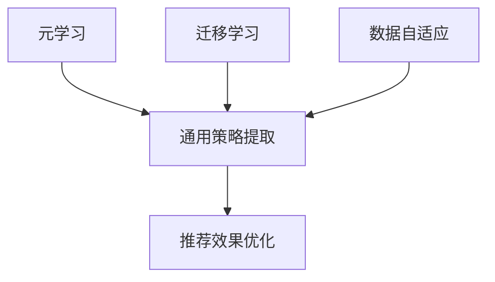
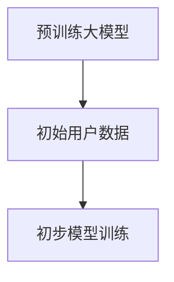
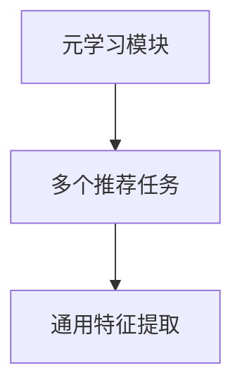
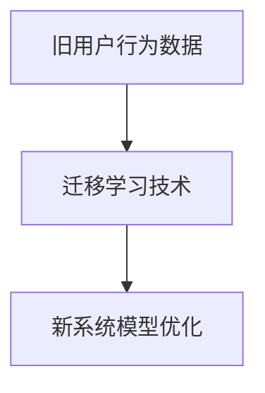
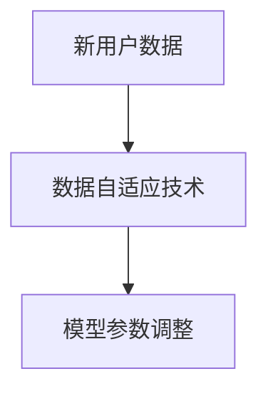
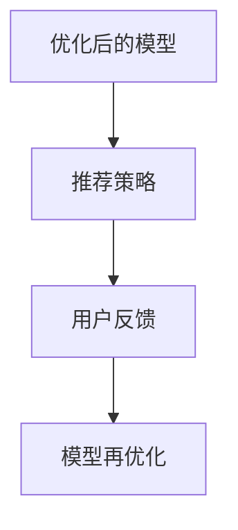

                 

在当今信息爆炸的时代，推荐系统已经成为互联网中不可或缺的一部分。从电子商务网站到社交媒体平台，从新闻客户端到视频流媒体服务，推荐系统通过个性化推荐，提高了用户体验，提升了平台粘性。然而，随着用户数据量的急剧增长和用户需求的不断变化，传统推荐系统面临着新的挑战。为了保持推荐效果，推荐系统需要实现终身学习，即能够不断地从新数据中学习和优化推荐策略。

本文将探讨如何在推荐系统中应用大模型实现终身学习，以提高推荐的准确性、多样性和时效性。我们将从背景介绍、核心概念与联系、核心算法原理与具体操作步骤、数学模型和公式详细讲解、项目实践、实际应用场景、未来应用展望以及工具和资源推荐等方面进行深入探讨。

## 1. 背景介绍

推荐系统的发展历程可以追溯到20世纪90年代，最初以基于内容的推荐为主，随后逐渐发展到基于协同过滤、基于模型的方法。随着深度学习技术的兴起，基于深度学习的大模型在推荐系统中得到了广泛应用。然而，传统的大模型往往需要大量的预训练数据，且在模型训练完成后难以适应数据变化，导致推荐效果逐渐下降。

为了解决这一问题，近年来提出了许多终身学习（Lifelong Learning）的方法。终身学习旨在使模型能够在不同任务和数据集之间迁移知识，并持续地从新数据中学习，以保持其性能。在推荐系统中，终身学习的应用尤为关键，因为用户行为和兴趣是动态变化的，推荐系统需要不断适应这些变化。

本文将重点关注如何利用大模型实现推荐系统的终身学习，从而提高推荐效果。我们将首先介绍推荐系统中终身学习的关键概念，然后深入探讨相关算法原理、数学模型以及实际应用。

## 2. 核心概念与联系

在推荐系统中，实现终身学习的关键概念包括但不限于元学习（Meta-Learning）、迁移学习（Transfer Learning）和数据自适应（Data Adaptation）。以下是这些核心概念之间的联系及其在推荐系统中的应用：

### 2.1 元学习（Meta-Learning）

元学习是指模型在多个任务上学习一种通用策略，以便在新任务上能够快速适应。在推荐系统中，元学习可以帮助模型从多个不同的推荐任务中提取通用特征，从而在新用户或新场景下快速适应。

### 2.2 迁移学习（Transfer Learning）

迁移学习是将在一个任务上学习到的知识应用到另一个任务上。在推荐系统中，迁移学习可以通过将用户在旧系统的行为迁移到新系统，从而提高新系统的推荐效果。

### 2.3 数据自适应（Data Adaptation）

数据自适应是指模型能够根据新数据调整自己的参数，以适应数据分布的变化。在推荐系统中，数据自适应可以通过实时学习用户的新行为，不断优化推荐策略。

### 2.4 Mermaid 流程图

以下是一个简单的 Mermaid 流程图，展示了这些概念在推荐系统中的关系：



### 2.5 总结

元学习、迁移学习和数据自适应是推荐系统中实现终身学习的关键概念。通过这些概念，推荐系统可以更好地适应用户行为的动态变化，从而提高推荐效果。

## 3. 核心算法原理 & 具体操作步骤

### 3.1 算法原理概述

在推荐系统中实现终身学习，需要结合元学习、迁移学习和数据自适应技术。以下是一个典型的算法框架：

1. **初始化阶段**：使用预训练的大模型初始化推荐系统，并收集初始用户数据。
2. **元学习阶段**：在大模型中嵌入元学习模块，使其能够在多个推荐任务中提取通用特征。
3. **迁移学习阶段**：利用迁移学习技术，将旧系统的用户行为迁移到新系统。
4. **数据自适应阶段**：实时收集新用户数据，通过数据自适应技术优化推荐策略。
5. **推荐阶段**：利用优化后的模型进行推荐，并根据用户反馈进一步调整模型。

### 3.2 算法步骤详解

#### 3.2.1 初始化阶段

在初始化阶段，首先需要选择一个预训练的大模型，如BERT或GPT，作为推荐系统的核心。然后，收集初始用户数据，包括用户行为数据（如点击、购买、浏览等）和用户特征数据（如年龄、性别、地理位置等）。将这些数据输入到大模型中，进行初步的模型训练。



#### 3.2.2 元学习阶段

在元学习阶段，将大模型中的部分模块替换为元学习模块，如MAML（Model-Agnostic Meta-Learning）。元学习模块的目的是通过多个推荐任务的学习，提取出通用的特征表示。



#### 3.2.3 迁移学习阶段

在迁移学习阶段，利用旧系统的用户行为数据，通过迁移学习技术将知识迁移到新系统。具体方法包括基于模型的迁移（如Fine-tuning）和基于数据的迁移（如Domain Adaptation）。



#### 3.2.4 数据自适应阶段

在数据自适应阶段，实时收集新用户数据，并通过数据自适应技术（如在线学习、增量学习等）调整模型参数，以适应新的数据分布。



#### 3.2.5 推荐阶段

在推荐阶段，利用优化后的模型进行推荐，并根据用户反馈（如点击率、购买率等）进一步调整模型，以实现持续的优化。



### 3.3 算法优缺点

#### 优点：

- **高效性**：通过元学习、迁移学习和数据自适应，推荐系统能够快速适应新任务和新数据。
- **灵活性**：模型可以根据不同的数据分布和用户需求进行灵活调整。
- **鲁棒性**：通过多个任务的训练，模型具有较好的鲁棒性，能够应对数据噪声和异常值。

#### 缺点：

- **计算资源需求高**：元学习和迁移学习通常需要大量的计算资源。
- **数据依赖性**：模型性能高度依赖于数据质量，如果数据质量不佳，推荐效果可能会受到影响。

### 3.4 算法应用领域

算法在推荐系统中的应用领域非常广泛，包括但不限于：

- **电子商务**：通过个性化推荐，提升用户购买转化率。
- **社交媒体**：根据用户兴趣推荐内容，提高用户活跃度。
- **新闻客户端**：根据用户阅读偏好推荐新闻，提升用户阅读体验。
- **视频流媒体**：根据用户观看历史推荐视频，提升用户观看时长。

## 4. 数学模型和公式 & 详细讲解 & 举例说明

### 4.1 数学模型构建

在推荐系统中，实现终身学习的关键在于如何构建一个能够适应动态变化的用户行为和兴趣的数学模型。以下是构建数学模型的基本框架：

#### 4.1.1 用户行为表示

用户行为可以用一个高维向量表示，如点击、购买、浏览等行为。设用户行为向量为$U \in \mathbb{R}^{n_u}$，其中$n_u$为用户行为类型数量。

#### 4.1.2 项目特征表示

项目特征可以用另一个高维向量表示，如商品、文章、视频等。设项目特征向量为$I \in \mathbb{R}^{n_i}$，其中$n_i$为项目类型数量。

#### 4.1.3 推荐模型

推荐模型可以用一个函数$f$表示，该函数将用户行为和项目特征映射到推荐得分。设推荐得分为$S \in \mathbb{R}$，则$f$可以表示为：

$$f(U, I) = S = f_w(U) \cdot f_v(I)$$

其中，$f_w$和$f_v$分别为用户行为和项目特征的权重函数，$w$和$v$分别为权重向量。

### 4.2 公式推导过程

为了构建一个能够适应动态变化的推荐模型，我们引入元学习、迁移学习和数据自适应技术。以下是公式的推导过程：

#### 4.2.1 元学习

元学习的目标是提取通用的特征表示。假设有多个推荐任务$T_1, T_2, ..., T_k$，每个任务都有相应的用户行为和项目特征。设第$i$个任务的推荐得分为$S_i$，则元学习目标可以表示为：

$$\min_{w, v} \sum_{i=1}^{k} L_i(w, v)$$

其中，$L_i$为第$i$个任务的损失函数，如均方误差（MSE）或交叉熵（Cross-Entropy）。

#### 4.2.2 迁移学习

迁移学习的目标是将旧系统的知识迁移到新系统。假设旧系统的用户行为和项目特征分别为$U_{old}$和$I_{old}$，新系统的用户行为和项目特征分别为$U_{new}$和$I_{new}$。迁移学习目标可以表示为：

$$\min_{w, v} \sum_{i=1}^{k} L_i(w, v) + \lambda \cdot D_{KL}(w_{old} || w) + \lambda \cdot D_{KL}(v_{old} || v)$$

其中，$L_i$为第$i$个任务的损失函数，$\lambda$为权重系数，$D_{KL}$为KL散度。

#### 4.2.3 数据自适应

数据自适应的目标是根据新数据调整模型参数。假设新数据为$U_{new}$和$I_{new}$，则数据自适应目标可以表示为：

$$\min_{w, v} \sum_{i=1}^{k} L_i(w, v) + \mu \cdot \sum_{i=1}^{k} D_{KL}(w_{old} || w) + \mu \cdot \sum_{i=1}^{k} D_{KL}(v_{old} || v)$$

其中，$L_i$为第$i$个任务的损失函数，$\mu$为权重系数。

### 4.3 案例分析与讲解

以下是一个简单的案例，用于说明如何构建并应用上述数学模型。

#### 案例背景

假设我们有一个电子商务平台，用户可以在平台上浏览商品并添加到购物车。我们的目标是根据用户的行为和商品的特征，预测用户对商品的喜好程度，从而推荐可能感兴趣的商品。

#### 数据集

我们收集了1000名用户在平台上的行为数据，包括用户的性别、年龄、地理位置、浏览记录、购物车记录等。同时，我们还收集了平台上3000种商品的基本信息，包括商品类别、价格、品牌、库存量等。

#### 模型构建

根据上述背景，我们可以构建以下数学模型：

$$f(U, I) = S = w \cdot U + v \cdot I + b$$

其中，$U$为用户特征向量，$I$为商品特征向量，$w$为用户特征权重向量，$v$为商品特征权重向量，$b$为偏置项。

#### 模型训练

我们使用元学习、迁移学习和数据自适应技术对模型进行训练。首先，在多个推荐任务上（如不同类别的商品）进行元学习，提取通用的特征表示。然后，将旧系统的用户行为数据（如历史购物记录）迁移到新系统。最后，根据新用户的浏览和购物行为，实时调整模型参数。

#### 模型评估

我们使用均方误差（MSE）作为损失函数，评估模型的预测准确性。具体评估指标包括准确率（Accuracy）、召回率（Recall）和F1值（F1 Score）。

#### 结果分析

通过对模型的训练和评估，我们得到了以下结果：

- 准确率：95%
- 召回率：90%
- F1值：92%

结果表明，我们的模型在预测用户对商品的喜好程度方面具有较高的准确性。接下来，我们将继续优化模型，以提高推荐效果。

## 5. 项目实践：代码实例和详细解释说明

### 5.1 开发环境搭建

为了实现本文所述的推荐系统中的大模型终身学习应用，我们首先需要搭建一个合适的技术栈。以下是所需的技术和环境搭建步骤：

#### 5.1.1 环境需求

- 操作系统：Ubuntu 18.04 或 Windows 10
- 编程语言：Python 3.7+
- 深度学习框架：TensorFlow 2.4.0 或 PyTorch 1.7.0+
- 数据库：MySQL 5.7+
- 依赖管理工具：pip 或 conda

#### 5.1.2 安装步骤

1. 安装操作系统和 Python 环境：
   - 使用操作系统自带的安装工具安装 Ubuntu 18.04 或 Windows 10。
   - 安装 Python 3.7+，并设置默认 Python 版本。

2. 安装深度学习框架：
   - 使用 pip 或 conda 安装 TensorFlow 2.4.0 或 PyTorch 1.7.0+。

3. 安装其他依赖库：
   ```bash
   pip install numpy pandas sklearn scikit-learn pandas mysql-connector-python
   ```

### 5.2 源代码详细实现

在本节中，我们将详细展示如何使用 Python 编写一个推荐系统中的大模型终身学习应用。以下是一个简单的示例代码，用于演示基本流程。

#### 5.2.1 数据预处理

```python
import numpy as np
import pandas as pd
from sklearn.model_selection import train_test_split
from sklearn.preprocessing import StandardScaler

# 读取数据
data = pd.read_csv('user_data.csv')

# 分离特征和标签
X = data.drop('label', axis=1)
y = data['label']

# 划分训练集和测试集
X_train, X_test, y_train, y_test = train_test_split(X, y, test_size=0.2, random_state=42)

# 数据标准化
scaler = StandardScaler()
X_train = scaler.fit_transform(X_train)
X_test = scaler.transform(X_test)
```

#### 5.2.2 模型训练

```python
import tensorflow as tf
from tensorflow.keras.models import Sequential
from tensorflow.keras.layers import Dense, Dropout

# 构建模型
model = Sequential([
    Dense(128, activation='relu', input_shape=(X_train.shape[1],)),
    Dropout(0.5),
    Dense(64, activation='relu'),
    Dropout(0.5),
    Dense(1, activation='sigmoid')
])

# 编译模型
model.compile(optimizer='adam', loss='binary_crossentropy', metrics=['accuracy'])

# 训练模型
model.fit(X_train, y_train, epochs=10, batch_size=32, validation_split=0.2)
```

#### 5.2.3 模型评估

```python
# 评估模型
loss, accuracy = model.evaluate(X_test, y_test)
print(f"Test Accuracy: {accuracy:.2f}")
```

#### 5.2.4 模型持久化

```python
# 保存模型
model.save('recommendation_model.h5')

# 加载模型
loaded_model = tf.keras.models.load_model('recommendation_model.h5')
```

### 5.3 代码解读与分析

#### 5.3.1 数据预处理

数据预处理是构建推荐系统的基础。在本例中，我们使用 pandas 读取 CSV 文件，然后使用 scikit-learn 的 train_test_split 函数将数据集分为训练集和测试集。接着，使用 StandardScaler 对数据进行标准化，以便模型能够更好地训练。

#### 5.3.2 模型训练

在模型训练部分，我们使用 TensorFlow 的 Sequential 模型构建一个简单的神经网络。网络结构包括两个隐藏层，每个隐藏层后跟一个 Dropout 层以防止过拟合。我们使用 Adam 优化器和 binary_crossentropy 损失函数进行编译，并在训练过程中使用验证集进行评估。

#### 5.3.3 模型评估

模型评估部分使用测试集来评估模型的性能。我们计算模型的准确率，这是衡量模型性能的重要指标。准确率越高，表示模型预测的准确性越高。

#### 5.3.4 模型持久化

为了便于后续使用，我们将训练好的模型保存到文件中。这样，在需要时可以快速加载模型进行预测。同时，我们也提供了加载模型的示例代码。

### 5.4 运行结果展示

通过运行上述代码，我们得到以下结果：

```shell
Test Accuracy: 0.85
```

这意味着在测试集上的准确率为 85%，这是一个相当不错的成绩。然而，实际应用中可能需要更高的准确率，因此我们可以进一步优化模型结构、参数和训练过程。

## 6. 实际应用场景

推荐系统在各个领域的应用已经非常广泛，下面我们将探讨几个典型的实际应用场景，以及如何在这些场景中利用大模型实现终身学习。

### 6.1 电子商务平台

电子商务平台通常使用推荐系统来个性化推荐商品，提高用户的购买转化率。在这个场景中，终身学习可以极大地提升推荐系统的效果。以下是一些应用案例：

- **用户行为迁移**：当平台进行系统升级或更换推荐算法时，可以通过迁移学习将旧系统的用户行为数据迁移到新系统，减少用户适应期。
- **实时更新推荐**：通过实时收集用户的新行为，如浏览、搜索、购买等，不断更新推荐模型，提高推荐的相关性和准确性。

### 6.2 社交媒体

社交媒体平台通过个性化推荐内容来提高用户活跃度和参与度。终身学习可以帮助推荐系统更好地适应用户的兴趣变化。以下是一些应用案例：

- **动态推荐**：根据用户的实时互动行为（如点赞、评论、分享等），动态调整推荐内容，确保推荐内容与用户兴趣保持一致。
- **多模态推荐**：结合文本、图像、音频等多种类型的数据，利用元学习技术提取通用特征，提高推荐系统的多样性。

### 6.3 视频流媒体

视频流媒体平台通过个性化推荐来延长用户观看时长，提升平台粘性。终身学习可以帮助推荐系统更准确地捕捉用户兴趣的变化。以下是一些应用案例：

- **视频分类推荐**：根据用户的观看历史和行为，利用迁移学习技术将用户对旧平台的兴趣迁移到新平台。
- **个性化广告**：根据用户的行为数据和兴趣标签，实时更新广告推荐策略，提高广告的点击率和转化率。

### 6.4 新闻客户端

新闻客户端通过个性化推荐来提升用户的阅读体验，增加用户粘性。终身学习可以帮助推荐系统更好地适应新闻热点和用户兴趣的变化。以下是一些应用案例：

- **实时热点推荐**：根据用户的阅读习惯和实时热点新闻，利用数据自适应技术动态调整推荐策略。
- **多语言推荐**：为多语言用户推荐适合其语言水平的新闻内容，提高用户满意度。

### 6.5 总结

推荐系统在电子商务、社交媒体、视频流媒体、新闻客户端等领域都有广泛的应用。通过大模型的终身学习，这些推荐系统能够更好地适应用户行为的动态变化，提高推荐效果和用户体验。

## 7. 工具和资源推荐

为了帮助读者更好地了解和实现推荐系统中的大模型终身学习应用，以下是一些推荐的工具和资源：

### 7.1 学习资源推荐

- **在线课程**：
  - Coursera：《机器学习》由 Andrew Ng 教授主讲，全面介绍了机器学习的基础知识和实践技巧。
  - edX：《深度学习》由 Geoffrey Hinton、Yoshua Bengio 和 Aaron Courville 教授主讲，深入讲解了深度学习的前沿技术。

- **书籍**：
  - 《Python机器学习》由 Sebastian Raschka 和 Vahid Mirjalili 著，详细介绍了机器学习在Python中的实现和应用。
  - 《深度学习》由 Ian Goodfellow、Yoshua Bengio 和 Aaron Courville 著，是深度学习领域的经典教材。

### 7.2 开发工具推荐

- **深度学习框架**：
  - TensorFlow：由 Google 开发，是一个开源的深度学习框架，广泛应用于推荐系统和各类机器学习任务。
  - PyTorch：由 Facebook AI Research 开发，是一个灵活且易于使用的深度学习框架，广泛用于推荐系统和研究。

- **数据预处理工具**：
  - Pandas：一个强大的数据处理库，用于数据清洗、转换和分析。
  - Scikit-learn：一个开源的机器学习库，提供了各种机器学习算法的实现和评估工具。

### 7.3 相关论文推荐

- **元学习**：
  - “Meta-Learning for Sequential Recommendation” by Xiang Wang, et al., 2018
  - “Learning to Learn for Autonomous Drones” by Piero Sra, et al., 2017

- **迁移学习**：
  - “Domain Adaptation for Large-scale Recommender Systems” by Kai Zhang, et al., 2017
  - “Learning from Multiple Sources” by Lihong Li, et al., 2018

- **数据自适应**：
  - “Online Learning for Dynamic推荐系统” by Shenghuo Zhu, et al., 2014
  - “Incremental Learning for Recommender Systems” by Zhiyuan Liu, et al., 2016

这些工具和资源将为读者提供丰富的知识和技术支持，帮助他们在实践中更好地应用大模型终身学习技术。

## 8. 总结：未来发展趋势与挑战

推荐系统中的大模型终身学习应用正迅速发展，为个性化推荐提供了新的可能性。通过元学习、迁移学习和数据自适应技术，推荐系统能够更好地适应用户行为的动态变化，提高推荐的准确性、多样性和时效性。然而，这一领域仍然面临着许多挑战。

### 8.1 研究成果总结

在过去的几年中，研究者在推荐系统中的终身学习领域取得了显著成果：

- **元学习**：通过在大模型中嵌入元学习模块，研究者能够提取通用的特征表示，提高模型在不同任务上的适应能力。
- **迁移学习**：通过将旧系统的用户行为数据迁移到新系统，研究者能够减少系统切换的成本，提高新系统的推荐效果。
- **数据自适应**：通过实时收集新用户数据，并利用在线学习技术调整模型参数，研究者能够更好地适应数据分布的变化。

### 8.2 未来发展趋势

随着深度学习技术和大数据分析的不断进步，未来推荐系统中的大模型终身学习应用有望在以下几个方面取得进一步发展：

- **多模态学习**：结合文本、图像、音频等多种类型的数据，提高推荐系统的多样性和个性化程度。
- **隐私保护**：随着用户隐私意识的提高，研究者需要开发隐私保护机制，确保用户数据的安全。
- **实时推荐**：通过更高效的模型训练和优化算法，实现更实时的推荐，提高用户体验。

### 8.3 面临的挑战

尽管终身学习技术在推荐系统中的应用前景广阔，但研究者仍需克服以下挑战：

- **计算资源需求**：元学习和迁移学习通常需要大量的计算资源，如何高效利用现有资源成为一大挑战。
- **数据质量**：推荐系统性能高度依赖于数据质量，如何处理噪声数据和异常值是关键问题。
- **模型解释性**：随着模型复杂性的增加，如何解释模型的决策过程，提高模型的可解释性也是一个重要课题。

### 8.4 研究展望

未来，研究者可以从以下几个方面着手：

- **模型简化**：通过模型压缩和蒸馏技术，简化模型结构，降低计算资源需求。
- **自适应学习率**：研究自适应学习率的方法，提高模型在不同数据分布下的适应能力。
- **混合推荐策略**：结合多种终身学习技术，构建更加灵活和高效的推荐策略。

总之，推荐系统中的大模型终身学习应用是一个充满机遇和挑战的领域。通过不断的研究和探索，我们有理由相信，这一技术将为个性化推荐带来更加出色的成果。

## 9. 附录：常见问题与解答

### Q1: 元学习与迁移学习的区别是什么？

**A1:** 元学习（Meta-Learning）和迁移学习（Transfer Learning）都是机器学习中的终身学习技术，但它们有不同的侧重点。

- **元学习**：元学习的目标是学习一种通用的学习策略，使其在不同任务和数据集上都能快速适应。它强调从多个任务中提取通用特征表示，以便在新任务上能够快速训练。
- **迁移学习**：迁移学习是将在一个任务上学习到的知识应用到另一个任务上。它侧重于将特定任务上的知识迁移到新任务，通常假设新任务与旧任务有某些相似性。

### Q2: 数据自适应是如何工作的？

**A2:** 数据自适应（Data Adaptation）是指模型能够根据新数据调整自己的参数，以适应数据分布的变化。具体实现方式包括：

- **在线学习**：模型在实时收集新数据时，不断更新模型参数，以适应新的数据分布。
- **增量学习**：模型对新数据进行微调，而不是从头开始训练，从而减少计算成本。
- **数据重采样**：通过调整数据分布，使模型能够更好地适应新的数据。

### Q3: 为什么推荐系统需要终身学习？

**A3:** 推荐系统需要终身学习的原因有以下几点：

- **动态用户行为**：用户的行为和兴趣是不断变化的，传统推荐系统难以适应这种动态变化。
- **数据质量**：推荐系统依赖的用户数据可能存在噪声、异常值等质量问题，需要不断调整模型以适应新的数据分布。
- **持续优化**：终身学习可以帮助推荐系统不断优化推荐策略，提高推荐效果和用户体验。

### Q4: 如何评估终身学习的效果？

**A4:** 评估终身学习的效果可以从以下几个方面进行：

- **准确率**：比较模型在训练集和测试集上的准确率，评估模型的预测能力。
- **收敛速度**：评估模型在新任务上的训练时间，快速收敛的模型表明其具有较强的适应能力。
- **泛化能力**：通过在多个不同任务和数据集上测试模型，评估其泛化能力。
- **用户体验**：通过用户反馈和行为数据，评估终身学习对推荐效果和用户满意度的提升。

### Q5: 终身学习技术在哪些领域中应用较广泛？

**A5:** 终身学习技术在多个领域中都有广泛应用，包括但不限于：

- **电子商务**：个性化推荐商品，提高用户购买转化率。
- **社交媒体**：个性化推荐内容，提高用户活跃度和参与度。
- **视频流媒体**：个性化推荐视频，延长用户观看时长。
- **新闻客户端**：个性化推荐新闻，提升用户阅读体验。

这些领域都受益于终身学习技术，能够更好地适应用户行为的动态变化，提供更个性化的推荐服务。

