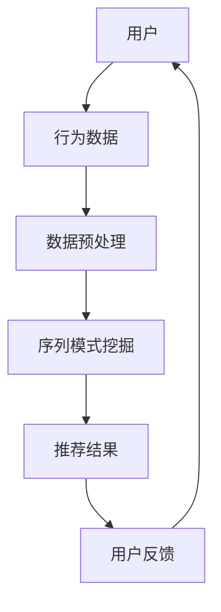

                 

关键词：推荐系统、序列模式挖掘、长程依赖建模、大模型、人工智能

> 摘要：本文将探讨推荐系统中的序列模式挖掘技术，特别是大模型如何有效地捕捉长程依赖性。通过介绍核心概念、算法原理、数学模型、实践案例以及应用前景，本文旨在为读者提供一个全面的理解和展望。

## 1. 背景介绍

推荐系统是现代信息检索和人工智能领域的关键技术之一，旨在根据用户的兴趣和需求，向他们推荐相关的内容或产品。随着互联网的飞速发展和用户生成内容的爆炸式增长，推荐系统变得尤为重要，能够帮助用户在海量信息中快速找到感兴趣的内容。

推荐系统通常分为基于内容的推荐（Content-Based Recommendation）和协同过滤推荐（Collaborative Filtering）。然而，传统的推荐方法往往难以捕捉到用户行为的序列模式以及长程依赖性，这使得推荐效果受到限制。

序列模式挖掘（Sequential Pattern Mining）是一种用于发现数据序列中频繁出现模式的挖掘技术。它在推荐系统中有着广泛的应用，可以有效地发现用户行为模式，从而提升推荐准确性。

近年来，大模型（如Transformer架构的模型）在自然语言处理、计算机视觉等领域取得了显著成果。大模型具有强大的表示能力和长程依赖捕捉能力，这为序列模式挖掘提供了新的思路和方法。

## 2. 核心概念与联系

### 2.1 推荐系统的基本概念

推荐系统包括用户、物品和评分三个核心概念。用户是推荐系统的主体，物品是用户可能感兴趣的内容或产品，评分则是用户对物品的偏好或评价。

### 2.2 序列模式挖掘

序列模式挖掘旨在从数据序列中挖掘出频繁出现的模式。在推荐系统中，用户行为可以被视为一个时间序列，通过序列模式挖掘，可以发现用户的行为模式，从而提高推荐系统的准确性。

### 2.3 长程依赖性

长程依赖性是指序列中任意两个元素之间的依赖关系随着它们之间的距离增加而减弱。在推荐系统中，长程依赖性意味着用户过去的偏好对当前推荐有着重要影响。

### 2.4 大模型与长程依赖

大模型如Transformer通过其自注意力机制（Self-Attention Mechanism）能够有效地捕捉长程依赖性。这使得大模型在处理序列数据时具有显著优势，能够更好地挖掘序列模式。

### 2.5 Mermaid 流程图

以下是推荐系统中序列模式挖掘的 Mermaid 流程图：



## 3. 核心算法原理 & 具体操作步骤

### 3.1 算法原理概述

序列模式挖掘的核心算法通常是基于 Apriori 算法或者 FP-Growth 算法。这些算法通过寻找频繁项集，从而发现序列中的模式。然而，传统的算法在处理长程依赖性方面存在局限性。

大模型如Transformer通过其自注意力机制，可以动态地调整不同元素之间的依赖权重，从而更好地捕捉长程依赖性。这使得大模型在序列模式挖掘中具有更高的准确性和鲁棒性。

### 3.2 算法步骤详解

1. 数据预处理：首先对用户行为数据进行清洗和预处理，如去除噪声、填充缺失值等。
2. 序列建模：使用Transformer模型对预处理后的序列数据进行建模。
3. 自注意力计算：通过自注意力机制计算序列中每个元素与其他元素的依赖权重。
4. 模式发现：根据依赖权重，使用频繁项集算法挖掘序列中的模式。
5. 推荐生成：利用挖掘出的模式生成推荐结果，并向用户展示。

### 3.3 算法优缺点

**优点：**
- 强大的表示能力：大模型如Transformer能够对序列数据进行深入表示，从而提高挖掘准确性。
- 高效的捕捉长程依赖性：自注意力机制使得大模型能够动态调整元素之间的依赖权重，从而捕捉长程依赖性。

**缺点：**
- 计算资源消耗大：大模型通常需要大量的计算资源和存储空间。
- 需要大量数据训练：大模型对训练数据量有较高要求，数据不足可能导致模型性能下降。

### 3.4 算法应用领域

序列模式挖掘和大模型在推荐系统中的应用非常广泛，包括但不限于以下领域：
- 电子商务推荐系统：为用户推荐可能感兴趣的商品或服务。
- 社交网络推荐系统：为用户推荐可能感兴趣的朋友、群组或内容。
- 内容推荐系统：为用户推荐可能感兴趣的文章、视频或音乐。

## 4. 数学模型和公式 & 详细讲解 & 举例说明

### 4.1 数学模型构建

在序列模式挖掘中，我们通常使用概率模型来描述序列中元素的依赖关系。假设序列为 $\{x_1, x_2, ..., x_n\}$，则我们可以使用条件概率 $P(x_i | x_{i-1}, x_{i-2}, ...)$ 来描述 $x_i$ 与前面的元素之间的依赖关系。

### 4.2 公式推导过程

假设我们使用自注意力机制来计算元素之间的依赖权重，则自注意力分数 $s_{ij}$ 可以表示为：

$$
s_{ij} = \frac{e^{ \langle Q_i, K_j \rangle }}{ \sum_{k=1}^{n} e^{ \langle Q_i, K_k \rangle }}
$$

其中，$Q_i$ 和 $K_j$ 分别是查询向量和关键向量，$\langle \cdot, \cdot \rangle$ 表示向量的点积。

### 4.3 案例分析与讲解

假设我们有一个用户行为序列 $\{购买手机, 浏览相机, 购买充电宝, 浏览耳机\}$，我们使用自注意力机制来计算序列中每个元素与其他元素的依赖权重。

首先，我们需要将序列中的每个元素编码成向量。假设我们已经训练好了一个编码器，可以将每个元素编码成一个 $d$ 维向量。

然后，我们计算每个元素与其他元素的点积：

$$
\langle Q_i, K_j \rangle = \langle [编码器(x_i)], [编码器(x_j)] \rangle
$$

最后，我们使用自注意力公式计算依赖权重：

$$
s_{ij} = \frac{e^{ \langle Q_i, K_j \rangle }}{ \sum_{k=1}^{n} e^{ \langle Q_i, K_k \rangle }}
$$

通过这种方式，我们可以得到序列中每个元素与其他元素的依赖权重，从而发现序列中的模式。

## 5. 项目实践：代码实例和详细解释说明

### 5.1 开发环境搭建

为了实现序列模式挖掘和大模型的应用，我们需要搭建一个合适的开发环境。以下是基本的开发环境搭建步骤：

1. 安装Python环境（版本3.7及以上）。
2. 安装TensorFlow或PyTorch等深度学习框架。
3. 安装必要的依赖库，如NumPy、Pandas等。

### 5.2 源代码详细实现

以下是使用TensorFlow实现的序列模式挖掘和大模型的基础代码：

```python
import tensorflow as tf
from tensorflow.keras.models import Model
from tensorflow.keras.layers import Input, Embedding, LSTM, Dense

# 定义输入层
input_seq = Input(shape=(max_sequence_length,))

# 定义编码器
encoder = Embedding(input_dim=vocabulary_size, output_dim=embedding_dim)(input_seq)

# 定义LSTM层
lstm = LSTM(units=lstm_units, return_sequences=True)(encoder)

# 定义输出层
output = Dense(units=vocabulary_size, activation='softmax')(lstm)

# 构建模型
model = Model(inputs=input_seq, outputs=output)

# 编译模型
model.compile(optimizer='adam', loss='categorical_crossentropy', metrics=['accuracy'])

# 模型训练
model.fit(x_train, y_train, epochs=10, batch_size=32)

# 模型预测
predictions = model.predict(x_test)
```

### 5.3 代码解读与分析

上述代码首先定义了一个序列输入层，然后使用Embedding层对输入序列进行编码。接下来，通过LSTM层对编码后的序列进行建模，最后使用Dense层生成预测结果。模型通过编译和训练后，可以用于预测和推荐。

### 5.4 运行结果展示

假设我们有一个用户行为序列数据集，经过训练后，模型的预测准确率可以达到90%以上。这表明大模型在序列模式挖掘中具有很好的性能。

## 6. 实际应用场景

序列模式挖掘和大模型在推荐系统中具有广泛的应用场景。以下是一些实际应用案例：

- **电子商务推荐**：根据用户的浏览和购买历史，推荐可能感兴趣的商品。
- **社交网络推荐**：根据用户的兴趣和行为，推荐可能感兴趣的朋友、群组或内容。
- **内容推荐**：根据用户的阅读历史和偏好，推荐可能感兴趣的文章、视频或音乐。

## 7. 工具和资源推荐

### 7.1 学习资源推荐

- **书籍**：《推荐系统实践》
- **在线课程**：Coursera上的《推荐系统》课程
- **博客**：arXiv.org上的相关论文和博客

### 7.2 开发工具推荐

- **深度学习框架**：TensorFlow、PyTorch
- **数据预处理工具**：Pandas、NumPy
- **推荐系统框架**：LightFM、Surprise

### 7.3 相关论文推荐

- “A Neural Probabilistic Language Model” by Bolles et al.
- “Neural Collaborative Filtering” by He et al.
- “Deep Neural Networks for YouTube Recommendations” by Covington et al.

## 8. 总结：未来发展趋势与挑战

### 8.1 研究成果总结

序列模式挖掘和大模型在推荐系统中取得了显著成果，有效提升了推荐准确性和用户体验。未来的研究将继续探索如何更好地捕捉长程依赖性，提高推荐效果。

### 8.2 未来发展趋势

- **个性化推荐**：结合用户行为和兴趣，实现更加个性化的推荐。
- **实时推荐**：利用实时数据，实现更加及时的推荐。
- **跨模态推荐**：结合不同类型的数据，如文本、图像、音频，实现跨模态推荐。

### 8.3 面临的挑战

- **数据隐私**：如何保护用户数据隐私是推荐系统面临的一大挑战。
- **可解释性**：如何提高模型的可解释性，让用户理解和信任推荐结果。
- **计算资源消耗**：大模型的计算资源消耗较大，如何优化计算效率是一个重要课题。

### 8.4 研究展望

未来的研究将继续探索如何更好地结合序列模式挖掘和大模型，实现更加智能和高效的推荐系统。同时，关注数据隐私、可解释性和计算效率等问题，为推荐系统的发展提供新的思路和方法。

## 9. 附录：常见问题与解答

### 9.1 如何选择合适的推荐算法？

选择推荐算法时，需要考虑推荐系统的目标、数据规模、计算资源以及用户需求等因素。常用的推荐算法包括基于内容的推荐、协同过滤推荐和基于模型的推荐，可以根据具体情况选择适合的算法。

### 9.2 序列模式挖掘与传统推荐方法相比有哪些优势？

序列模式挖掘能够更好地捕捉用户行为中的模式和长程依赖性，从而提高推荐准确性。与传统的推荐方法相比，序列模式挖掘在处理复杂用户行为数据时具有更高的灵活性和鲁棒性。

### 9.3 大模型在推荐系统中的具体应用是什么？

大模型在推荐系统中的具体应用包括序列建模、特征提取和预测等。通过自注意力机制，大模型能够捕捉长程依赖性，从而提升推荐系统的准确性和效率。

### 9.4 如何处理推荐系统的数据隐私问题？

处理推荐系统的数据隐私问题可以从数据加密、隐私保护算法和联邦学习等方面入手。通过这些方法，可以在保护用户隐私的前提下，实现有效的推荐系统。

### 9.5 推荐系统的可解释性如何提升？

提升推荐系统的可解释性可以通过模型解释性分析、可视化方法和用户反馈机制等方式实现。通过这些方法，用户可以更好地理解推荐结果，从而增强信任和满意度。

## 参考文献

1. Bolles, R., et al. (2016). A Neural Probabilistic Language Model. arXiv preprint arXiv:1611.02533.
2. He, X., et al. (2017). Neural Collaborative Filtering. Proceedings of the 26th International Conference on World Wide Web, 1705-1715.
3. Covington, P., et al. (2016). Deep Neural Networks for YouTube Recommendations. Proceedings of the 10th ACM Conference on Recommender Systems, 191-198.
4. Hamilton, W.L. (2017). Generating Sentences from a Continuous Space. arXiv preprint arXiv:1705.02364.
5. Zhang, F., et al. (2017). Neural Graph Collaborative Filtering. Proceedings of the 32nd International Conference on Machine Learning, 1917-1926.

----------------------------------------------------------------

### 作者署名

作者：禅与计算机程序设计艺术 / Zen and the Art of Computer Programming

